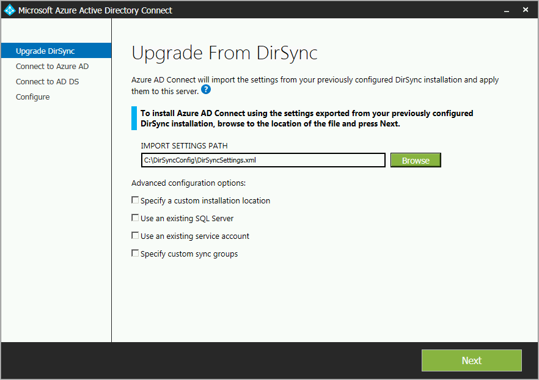
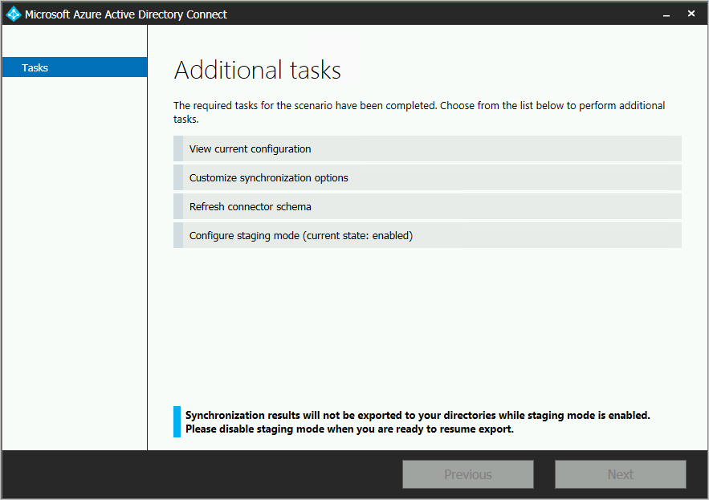
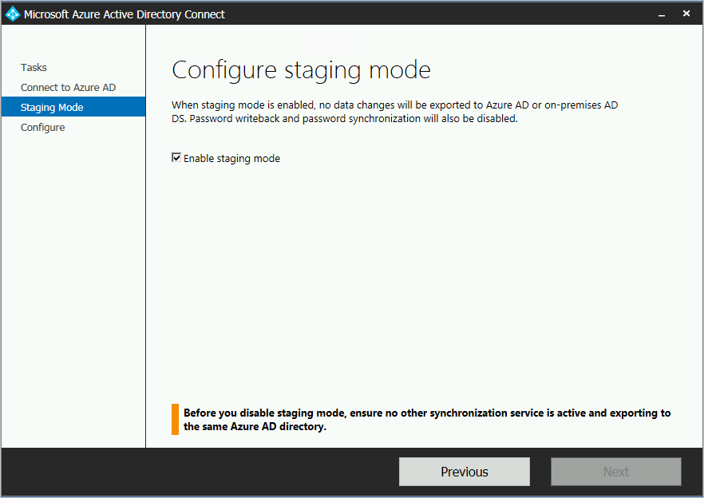

<properties 
   pageTitle="Microsoft Azure AD Connect - 从 Microsoft Azure AD 同步工具 (DirSync) 升级" 
   description="了解如何从 DirSync 升级到 Azure AD Connect。本文介绍将当前 Microsoft Azure AD 同步工具 (DirSync) 升级到 Azure AD Connect 的步骤。" 
   services="active-directory" 
   documentationCenter="" 
   authors="shoatman" 
   manager="terrylanfear" 
   editor="billmath"/>

<tags 
   ms.service="active-directory" 
   ms.date="09/02/2015" 
   wacn.date="11/02/2015"/>

# 将 Microsoft Azure Active Directory 同步功能 (DirSync) 升级到 Azure Active Directory Connect

以下文档可帮助你将现有 DirSync 安装升级到 Azure AD Connect

## 下载 Azure AD Connect

若要开始使用 Azure AD Connect，可以使用以下链接下载最新版本：[下载 Azure AD Connect](http://go.microsoft.com/fwlink/?LinkId=615771)

## 安装 Azure AD Connect 之前
在安装 Azure AD Connect 以及从 DirSync 升级之前，你需要做好以下几项准备。

- Azure AD 实例的现有全局管理员帐户的密码（安装程序将提醒你使用哪一个帐户）
- 本地 Active Directory 的企业管理员帐户
- 可选：如果你将 DirSync 配置为使用完全版的 SQL Server - 该数据库实例的信息。

### 并行部署

如果你目前正在同步 5 万个以上的对象，则可以选择执行并行部署。并行部署需要不同的服务器或一组服务器（如果你需要不同的服务器作为 SQL Server）。并行部署的好处是有机会避免同步停机。Azure AD Connect 安装程序将尝试评估我们预期的停机时间，但是，如果你过去升级过 DirSync，则你自己的经验可能会提供最佳指导。

## 安装 Azure AD Connect

下载 Azure AD Connect 并将其复制到现有 DirSync 服务器。

1. 导航到 AzureADConnect.msi 并双击它
2. 开始逐步执行向导

对于就地升级，将发生以下高级步骤：

1. 欢迎使用 Azure AD Connect
2. 当前 DirSync 配置的分析
3. 收集 Azure AD 全局管理员密码
4. 收集企业管理员帐户的凭据（仅在 Azure AD Connect 安装期间使用）
5. 安装 AAD Connect
    * 卸载 DirSync
	* 安装 AAD Connect
	* （可选）开始同步

存在以下情况时，需要其他步骤/信息：

* 你当前正在使用完全版 SQL Server - 本地或远程
* 要同步的对象超过 5 万个

## 就地升级 - 少于 5 万个对象 - SQL Express（演练）

0. 启动 Azure AD Connect 安装程序 (MSI)

1. 查看并同意许可条款和隐私声明。

2. 单击“下一步”分析现有的 DirSync 安装

3. 分析完成时，我们将提出如何继续的建议。在使用 SQL Express 且少于 5 万个对象的情况下，会显示以下屏幕。

4. 提供当前用于连接 Azure AD 的帐户的密码。

5. 提供 Active Directory 的企业管理员帐户。

6. 你现在可以开始配置。单击“下一步”时，将会卸载 DirSync 并配置 Azure AD Connect，然后开始同步。  

## 就地升级 - 超过 5 万个对象
如果你有 5 万个以上的对象需要同步，则在步骤 #3 中，你会看到不同的消息。将会显示类似于下面的屏幕：

在此情况下，建议你考虑在不同的服务器上进行并行升级。提出这项建议的原因是，根据你组织的大小，就地升级可能会影响企业的服务级别协议（在本地 Active Directory 中的更改反映在 Azure AD/Office 365 中的速度方面）。我们将尝试评估使用 Azure AD Connect 进行第一次同步所需的时间。如前所述，你自己的 DirSync 原始安装或升级到 DirSync 的经验可能是最佳指标。

并行部署需要一个或多个不同的服务器（如果你需要从 Azure AD Connect 在不同的服务器上运行 SQL Server）。因此，如果就地升级可以安排成避免组织内的影响，则可以完全合理地考虑进行就地升级。

若要继续进行就地升级，请单击消息旁的复选框：“继续在此计算机上升级 DirSync”。

## 就地升级 - 完全版 SQL Server

如果 DirSync 安装使用本地或远程完全版的 SQL Server，则会在步骤 #3 中看到不同的消息。将会显示类似于下面的屏幕：

系统会向你显示有关 DirSync 使用的现有 SQL Server 数据库服务器的信息。如果需要，请进行适当的调整。单击“下一步”将会继续安装。

## 并行部署 - 超过 5 万个对象

在步骤 #3 中，如果你的对象数超过 5 万个，则 Azure AD Connect 安装程序将会建议并行部署。有关选择对 Azure AD Connect 进行就地部署或并行部署的详细信息，请参阅上面的“就地升级 - 超过 5 万个对象”。将会显示类似于下面的屏幕：

如果你想要继续进行并行部署，需要运行以下步骤：

- 单击“导出设置”按钮。在不同的服务器上安装 Azure AD Connect 时，会导入这些设置，以将目前 DirSync 中的任何设置迁移到新的 AAD Connect 安装。

成功导出设置后，可以退出 DirSync 服务器上的 Azure AD Connect 向导。

### 独立服务器上的 Azure AD Connect 安装

在新的服务器上安装 Azure AD Connect 时，会找不到 DirSync，并假设你想要运行 Azure AD Connect 的全新安装。这里提供了几个特殊步骤：

1. 运行 Azure AD Connect 安装程序 (MSI)
2. 当你看到“欢迎使用 Azure AD Connect”屏幕时，请单击窗口右上角的“X”，以退出向导。
3. 打开命令提示符
4. 从 Azure AD Connect 的安装位置（默认值：C:\\Program Files\\Microsoft Azure Active Directory Connect）执行以下命令：  
    * AzureADConnect.exe /migrate  

Azure AD Connect 会连接并向你呈现以下 UI：

 
5. 选择从 DirSync 安装中导出的设置文件。    
6. 配置任何高级选项，包括：  
   * Azure AD Connect 的自定义安装位置
   * 现有 SQL Server 实例（默认值：Azure AD Connect 将安装 SQL Server 2012 Express）
   * 用于连接 SQL Server 的服务帐户（如果你的 SQL Server 数据库位于远程，则此帐户必须是域服务帐户）

UI 中会显示以下选项：

 
7. 单击“下一步”。   
8. 在“已准备好配置”页上，保留选中“配置完成后立即开始同步过程”。  

> [AZURE.NOTE]将会开始 Windows Server Active Directory 和 Azure Active Directory 之间的同步，但不会将任何更改导出到 Azure AD。每次只能有一个同步工具在主动导出更改。9.单击“安装”。

> [AZURE.NOTE]取消选中“开始同步”复选框，确保 DirSync（仍已安装并正在运行）和 Azure AD Connect 未尝试同时写入到 AAD。

### 检查 Azure AD Connect 是否已准备好开始同步

若要判断 Azure AD Connect 是否已准备好接管 DirSync，需要打开 Azure AD Connect 同步服务管理器。在 Windows“开始”菜单中使用“同步”进行搜索可以显示此应用程序。

在应用程序内，你需要查看“操作”选项卡。在此选项卡上，你可以确认是否已完成以下操作：

- AD 管理代理上的导入
- Azure AD 管理代理上的导入
- AD 管理代理上的完全同步
- Azure AD 管理代理上的完全同步

完成这 4 项操作之后，即已准备好卸载 DirSync 并启用 Azure AD Connect 同步。

### 卸载 DirSync（旧服务器）

- 在“添加或删除程序”中找到“Microsoft Azure Active Directory 同步工具”
- 卸载“Microsoft Azure Active Directory 同步工具”

### 打开 Azure AD Connect（新服务器）
安装之后，重新打开 Azure AD Connect 时会提供配置体验。打开 Azure AD Connect。

你应该看到以下内容：

* 选择“配置过渡模式”
    * 使用导出的设置自动从 DirSync 升级时，Azure AD Connect 将进入过渡模式。简单而言，过渡模式表示在 Azure AD Connect 中进行同步，但是更改不会导出到 Azure AD 或 AD。
* 取消选中“已启用过渡模式”复选框可以关闭过渡。

* 单击安装按钮

祝贺你！你已使用并行部署成功迁移到 Azure AD Connect。

## Azure AD Connect 支持组件

下面列出了 Azure AD Connect 将在设置 Azure AD Connect 的服务器上安装的必备组件支持组件。此列表针对基本快速安装。如果你在“安装同步服务”页上选择使用其他 SQL Server，则不会安装下面列出的 SQL Server 2012 组件。

- Forefront Identity Manager Azure Active Directory 连接器
- Microsoft SQL Server 2012 命令行实用工具
- Microsoft SQL Server 2012 本机客户端
- Microsoft SQL Server 2012 Express LocalDB
- 用于 Windows PowerShell 的 Azure Active Directory 模块
- 面向 IT 专业人员的 Microsoft Online Services 登录助手
- Microsoft Visual C++ 2013 Redistribution Package

**其他资源**

* [在云中使用本地标识基础结构](/documentation/articles/active-directory-aadconnect)
* [Azure AD Connect 后续步骤](/documentation/articles/active-directory-aadconnect-whats-next)
* [MSDN 上的 Azure AD Connect](/documentation/articles/active-directory-aadconnect)
 

<!---HONumber=67-->