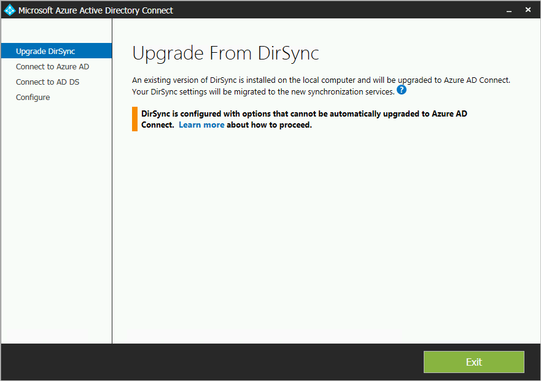
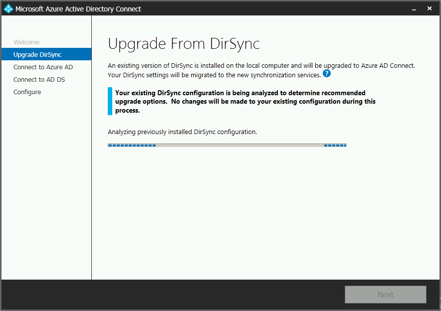
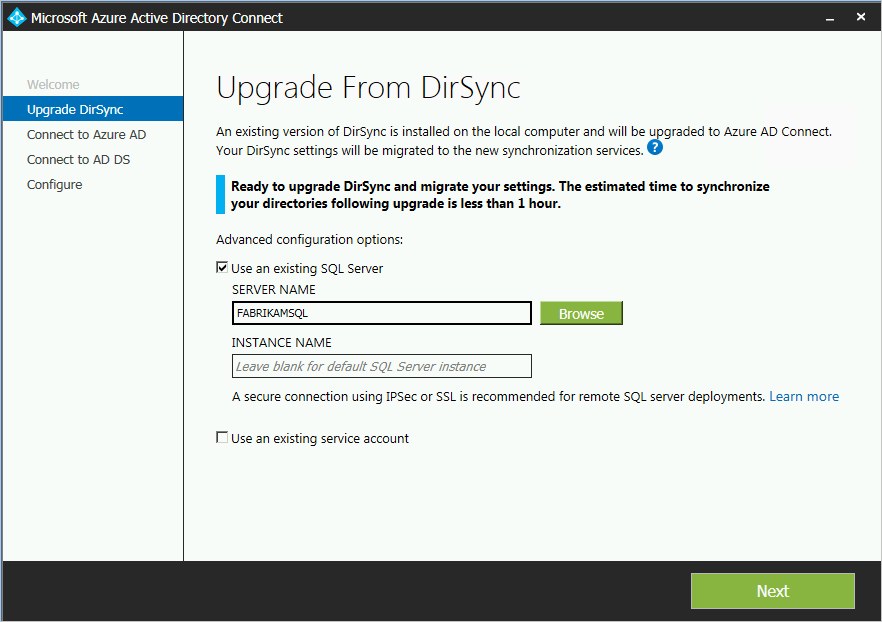

<properties
   pageTitle="Azure AD Connect：从 Microsoft Azure AD 同步工具 (DirSync) 升级 | Microsoft Azure"
   description="了解如何从 DirSync 升级到 Azure AD Connect。本文介绍将当前 Microsoft Azure AD 同步工具 (DirSync) 升级到 Azure AD Connect 的步骤。"
   services="active-directory"
   documentationCenter=""
   authors="andkjell"
   manager="stevenpo"
   editor=""/>

<tags 
   ms.service="active-directory" 
   ms.date="04/25/2016"
   wacn.date="06/14/2016"/>

# Azure AD Connect：升级 Microsoft Azure Active Directory 同步 (DirSync)

以下文档可帮助你将现有 DirSync 安装升级到 Azure AD Connect。

## 相关文档
如果你尚未阅读有关[将本地标识与 Azure Active Directory 集成](/documentation/articles/active-directory-aadconnect)的文档，下表提供了相关主题的链接。开始从 DirSync 升级之前，需要完成以粗体显示的前两个主题。

| 主题 | |
| --------- | --------- |
| **下载 Azure AD Connect** | [下载 Azure AD Connect](http://go.microsoft.com/fwlink/?LinkId=615771) |
| **硬件和先决条件** | [Azure AD Connect：硬件和先决条件](/documentation/articles/active-directory-aadconnect-prerequisites) |
| **用于安装的帐户** | [有关 Azure AD Connect 帐户和权限的详细信息](/documentation/articles/active-directory-aadconnect-accounts-permissions) |

## 从 DirSync 升级
根据当前的 DirSync 部署，可以使用不同的升级选项。如果预期的升级时间少于 3 小时，则我们建议执行就地升级。如果预期的升级时间超过 3 小时，则我们建议在另一台服务器上进行并行部署。如果对象数目超过 50,000 个，预计需要花费 3 个多小时才能完成升级。

| 方案 | |
| ---- | ---- |
| [就地升级](#in-place-upgrade) | 如果升级预期少于 3 小时，则为首选选项。 |
| [并行部署](#parallel-deployment) | 如果升级预期超过 3 小时，则为首选选项。 |

>[AZURE.NOTE] 当你规划从 DirSync 升级到 Azure AD Connect 时，在升级之前请勿自行卸载 DirSync。Azure AD Connect 将读取和迁移 DirSync 的配置，并在检查服务器之后卸载 DirSync。

**就地升级**

向导会显示完成升级的预期所需时间。根据假设，估计需要 3 小时才能完成包含 50,000 个对象（用户、联系人和组）的数据库的升级。Azure AD Connect 将分析当前 DirSync 设置，如果数据库中的对象数少于 50,000 个，则会建议就地升级。如果你确定继续，则会在升级期间自动应用当前设置，并且服务器将自动恢复活动的同步。

如果你想要执行配置迁移并执行并行部署，可以拒绝就地升级建议。例如，你可以借机刷新硬件和操作系统。有关详细信息，请参阅[并行部署](#parallel-deployment)部分。

**并行部署**

如果对象数超过 50,000 个，则我们建议使用并行部署。这样，用户就不会遇到任何操作延迟。Azure AD Connect 安装程序将尝试评估升级时的停机时间，但是，如果你过去升级过 DirSync，则你自己的经验可能会提供最佳指导。

### 要升级的受支持 DirSync 配置
以下配置更改受 DirSync 的支持，并且将会升级：

- 域和 OU 筛选
- 备用 ID (UPN)
- 密码同步与 Exchange 混合设置
- 林/域与 Azure AD 设置
- 基于用户属性进行筛选

以下更改无法升级。如果进行了此项更改，将会阻止升级：

- 不支持的 DirSync 更改，例如删除属性和使用自定义扩展 DLL

在这种情况下，建议在[过渡模式](/documentation/articles/active-directory-aadconnectsync-operations#staging-mode)下安装新的 Azure AD Connect 服务器，并验证旧的 DirSync 及新的 Azure AD Connect 配置。使用自定义配置重新应用所有更改，如 [Azure AD Connect 同步自定义配置](/documentation/articles/active-directory-aadconnectsync-whatis)中所述。

无法检索且不会迁移 DirSync 用于服务帐户的密码。这些密码将在升级期间重置。

### 从 DirSync 升级到 Azure AD Connect 的高级步骤

1. 欢迎使用 Azure AD Connect
2. 当前 DirSync 配置的分析
3. 收集 Azure AD 全局管理员密码
4. 收集企业管理员帐户的凭据（仅在 Azure AD Connect 安装期间使用）
5. 安装 Azure AD Connect
    * 卸载 DirSync
	* 安装 Azure AD Connect
	* （可选）开始同步

发生以下情况时，需要执行其他步骤：

* 你当前正在使用完全版 SQL Server - 本地或远程
* 要同步的对象超过 50,000 个

## 就地升级

1. 启动 Azure AD Connect 安装程序 (MSI)。
2. 查看并同意许可条款和隐私声明。

3. 单击“下一步”开始分析现有的 DirSync 安装。

4. 分析完成时，我们将提出如何继续的建议。  
    - 如果使用 SQL Server Express 并且对象数少于 50,000 个，则会显示以下屏幕：  

    - 如果为 DirSync 使用了完整的 SQL Server，将看到此页面：
 
系统会显示有关 DirSync 使用的现有 SQL Server 数据库服务器的信息。如果需要，请做相应的调整。单击“下一步”继续安装。
    - 如果对象数超过 50,000 个，你将看到此屏幕：
 
若要继续进行就地升级，请单击消息旁的复选框：“继续在此计算机上升级 DirSync”。
若要改为执行[并行部署](#parallel-deployment)，请导出 DirSync 配置设置并将其转移到新服务器。
5. 提供当前用于连接 Azure AD 的帐户的密码。这必须是 DirSync 当前使用的帐户。
  
如果你收到错误消息并且出现了连接问题，请参阅[排查连接问题](/documentation/articles/active-directory-aadconnect-troubleshoot-connectivity)。
6. 提供 Active Directory 的企业管理员帐户。

7. 你现在可以开始配置。单击“升级”后，将会卸载 DirSync 并配置 Azure AD Connect，然后开始同步。

8. 安装完成后，请注销并再次登录到 Windows，然后即可使用同步服务管理器或同步规则编辑器，或者尝试进行其他任何配置更改。

## 并行部署

### 导出 DirSync 配置
**对象数超过 50,000 时执行并行部署**

如果你的对象数超过 50,000 个，则 Azure AD Connect 安装程序会建议并行部署。

将会显示类似于下面的屏幕：

如果你想要继续进行并行部署，需要运行以下步骤：

- 单击“导出设置”按钮。在不同的服务器上安装 Azure AD Connect 时，会导入这些设置，以将目前 DirSync 中的任何设置迁移到新的 Azure AD Connect 安装。

成功导出设置后，可以退出 DirSync 服务器上的 Azure AD Connect 向导。继续执行下一步，以[在不同的服务器上安装 Azure AD Connect](#installation-of-azure-ad-connect-on-separate-server)

**对象数少于 50,000 时执行并行部署**

如果你的对象数少于 50,000 个，但仍然想要执行并行部署，请执行以下操作：

1. 运行 Azure AD Connect 安装程序 (MSI)。
2. 看到“欢迎使用 Azure AD Connect”屏幕时，请单击窗口右上角的“X”退出安装向导。
3. 打开命令提示符。
4. 从 Azure AD Connect 的安装位置（默认值：C:\\Program Files\\Microsoft Azure Active Directory Connect）执行以下命令：`AzureADConnect.exe /ForceExport`。
5. 单击“导出设置”按钮。在不同的服务器上安装 Azure AD Connect 时，会导入这些设置，以将目前 DirSync 中的任何设置迁移到新的 Azure AD Connect 安装。

成功导出设置后，可以退出 DirSync 服务器上的 Azure AD Connect 向导。继续执行下一步，以[在不同的服务器上安装 Azure AD Connect](#installation-of-azure-ad-connect-on-separate-server)

### 在不同的服务器上安装 Azure AD Connect

在新的服务器上安装 Azure AD Connect 时，会假设你想要运行 Azure AD Connect 的全新安装。由于你想要使用 DirSync 配置，因此还要执行一些额外的步骤：

1. 运行 Azure AD Connect 安装程序 (MSI)。
2. 看到“欢迎使用 Azure AD Connect”屏幕时，请单击窗口右上角的“X”退出安装向导。
3. 打开命令提示符。
4. 从 Azure AD Connect 的安装位置（默认值：C:\\Program Files\\Microsoft Azure Active Directory Connect）执行以下命令：
    `AzureADConnect.exe /migrate`。
    Azure AD Connect 安装向导将会启动并显示以下屏幕：

5. 选择从 DirSync 安装中导出的设置文件。
6. 配置任何高级选项，包括：
    - Azure AD Connect 的自定义安装位置。
	- 现有 SQL Server 实例（默认值：Azure AD Connect 将安装 SQL Server 2012 Express）。请不要使用与 DirSync 服务器相同的数据库实例。
	- 用于连接 SQL Server 的服务帐户（如果你的 SQL Server 数据库位于远程，则此帐户必须是域服务帐户）。
可以在此屏幕上看到以下选项：

7. 单击“下一步”。
8. 在“已准备好配置”页上，保留选中“配置完成后立即开始同步过程”。服务器将进入[过渡模式](/documentation/articles/active-directory-aadconnectsync-operations#staging-mode)，因此暂时不会将更改导出到 Azure AD。
9. 单击“安装”。
10. 安装完成后，请注销并再次登录到 Windows，然后即可使用同步服务管理器或同步规则编辑器，或者尝试进行其他任何配置更改。

>[AZURE.NOTE] 将会开始 Windows Server Active Directory 和 Azure Active Directory 之间的同步，但不会将任何更改导出到 Azure AD。每次只能有一个同步工具在主动导出更改。这称为[过渡模式](/documentation/articles/active-directory-aadconnectsync-operations#staging-mode)。

### 验证 Azure AD Connect 是否已准备好开始同步

若要验证 Azure AD Connect 是否已准备好接管 DirSync，你需要从“开始”菜单的“Azure AD Connect”组中打开“同步服务管理器”。

在应用程序内，你需要查看“操作”选项卡。在此选项卡上，你可以确认是否已完成以下操作：

- 在 AD 连接器上导入
- 在 Azure AD 连接器上导入
- 在 AD 连接器上执行完全同步
- 在 Azure AD 连接器上执行完全同步

检查这些操作的结果，并确保没有任何错误。

如果你想要查看并检查哪些更改即将导出到 Azure AD，请阅读有关如何在[过渡模式](/documentation/articles/active-directory-aadconnectsync-operations#staging-mode)下验证配置的主题。进行所需的配置更改，直到没有任何意外的错误。

完成这 4 项操作之后，如果没有任何错误，并且你对即将导出的更改感到满意，即表示已准备好卸载 DirSync 并启用 Azure AD Connect 同步。完成以下两个步骤以完成迁移。

### 卸载 DirSync（旧服务器）

- 从“程序和功能”中，找到“Microsoft Azure Active Directory 同步工具”
- 卸载“Microsoft Azure Active Directory 同步工具”
- 请注意，最长可能需要 15 分钟才能完成卸载。

卸载 DirSync 之后，不会将任何活动的服务器导出到 Azure AD。只有在完成下一步骤之后，才能将本地 Active Directory 中的任何更改继续同步到 Azure AD。

### 启用 Azure AD Connect（新服务器）
安装之后，重新打开 Azure AD Connect 时可以进行其他配置更改。从“开始”菜单或桌面快捷方式启动 **Azure AD Connect**。请确保不要尝试重新运行安装 MSI。

你应该看到以下内容：

- 选择“配置过渡模式”。
- 取消选中“已启用过渡模式”复选框可以关闭过渡。

- 单击“下一步”按钮。
- 在确认页面上，单击“安装”按钮。

Azure AD Connect 现为你的活动服务器。

## 后续步骤
安装 Azure AD Connect 后，可以[验证安装并分配许可证](/documentation/articles/active-directory-aadconnect-whats-next)。

了解有关[将本地标识与 Azure Active Directory 集成](/documentation/articles/active-directory-aadconnect)的详细信息。

<!---HONumber=Mooncake_0606_2016-->