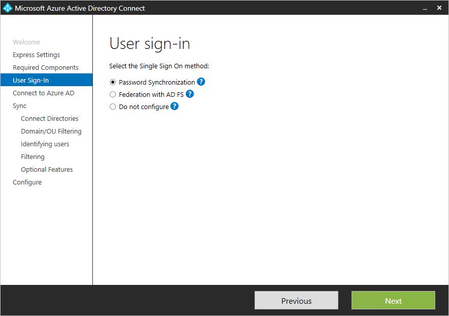
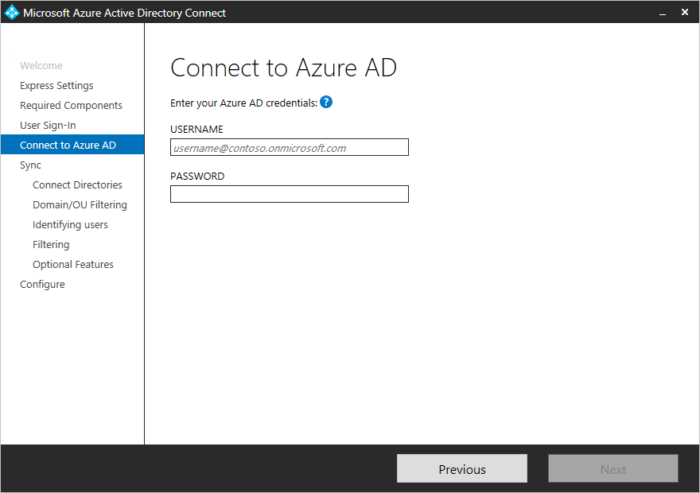
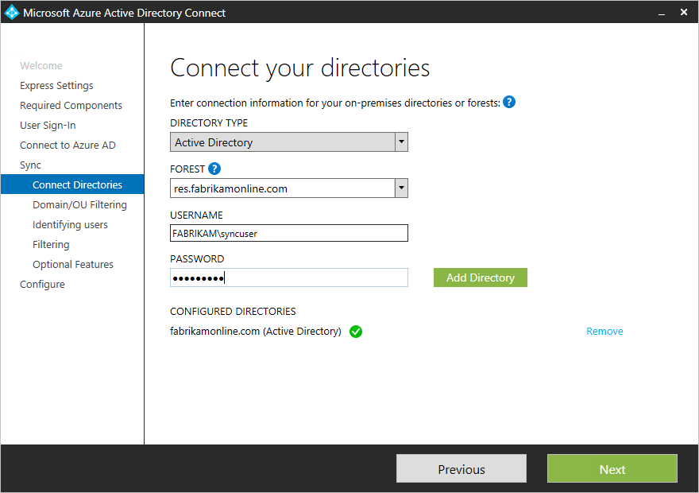
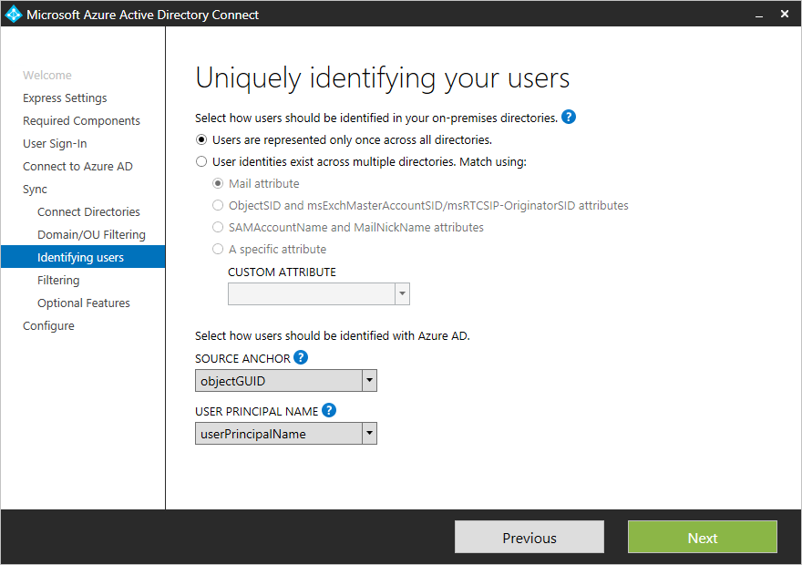
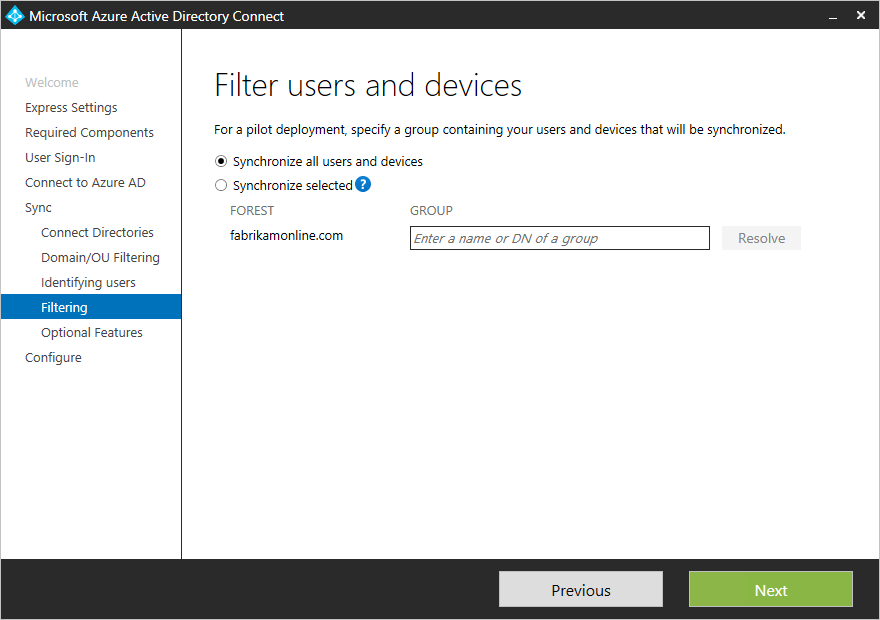
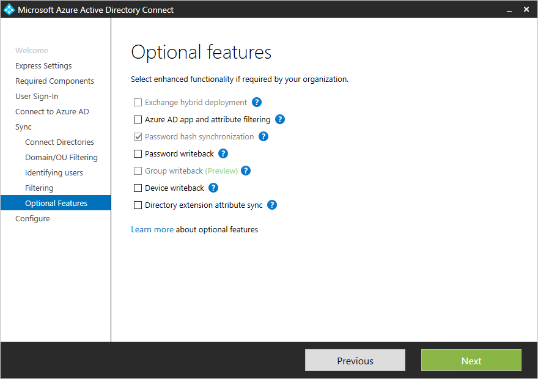
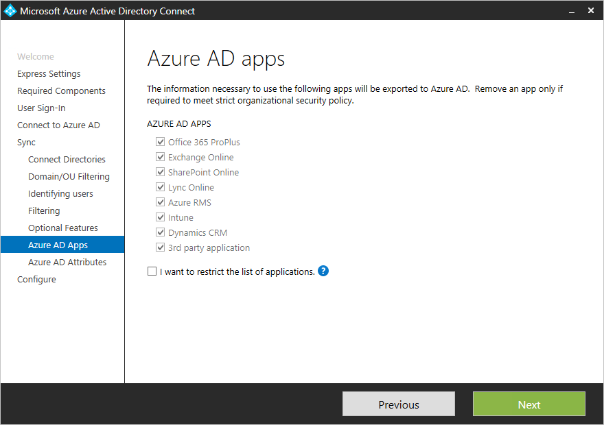
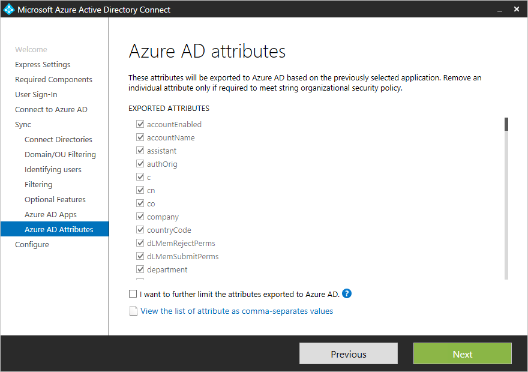

<properties 
	pageTitle="Azure AD Connect 的自定义安装" 
	description="本文档详细介绍了 Azure AD Connect 的自定义安装选项。" 
	services="active-directory" 
	documentationCenter="" 
	authors="billmath" 
	manager="stevenpo" 
	editor="curtand"/>

<tags 
	ms.service="active-directory"   
	ms.date="10/13/2015"
	wacn.date="01/21/2016"/>

# Azure AD Connect 的自定义安装

以下文档提供了有关对 Azure AD Connect 使用自定义安装选项的信息。如果你要设置其他配置选项，或需要使用快速安装中未包括的可选功能，则可以使用此选项。

## 相关文档
如果你尚未阅读有关[将本地标识与 Azure Active Directory 集成](active-directory-aadconnect.md)的文档，下表提供了相关主题的链接。开始安装之前，需要完成以粗体显示的前三个主题。

| 主题 | |
| --------- | --------- |
| **下载 Azure AD Connect** | [下载 Azure AD Connect](http://go.microsoft.com/fwlink/?LinkId=615771) |
| **硬件和先决条件** | [Azure AD Connect：硬件和先决条件](active-directory-aadconnect-prerequisites.md) |
| **用于安装的帐户** | [Azure AD Connect 帐户和权限](active-directory-aadconnect-accounts-permissions.md) |
| 使用快速设置安装 | [Azure AD Connect 的快速安装](active-directory-aadconnect-get-started-express.md) |
| 从 DirSync 升级 | [从 Azure AD 同步工具 (DirSync) 升级](active-directory-aadconnect-dirsync-upgrade-get-started.md) |
| 安装后 | [验证安装并分配许可证](active-directory-aadconnect-whats-next.md) |

## 安装所需的组件

在安装同步服务时，可以将可选配置部分保留未选中状态，Azure AD Connect 会自动完成所有设置。这包括设置 SQL Server 2012 Express 实例，以及创建相应的组并为其分配权限。如果你想要更改默认设置，可以使用下表来了解可用的可选配置选项。

可选配置 | 说明 
------------- | ------------- |
SQL Server 名称 | 用于指定 SQL Server 名称和实例名称。如果你已有一个要使用的数据库服务器，请选择此选项。
服务帐户 | 默认情况下，Azure AD Connect 将为同步服务创建要使用的本地服务帐户。密码是自动生成的，而安装 Azure AD Connect 的人员并不知道该密码。如果你使用远程 SQL 服务器，则需要在域中创建一个服务帐户并知道密码。在这些情况下，请输入要使用的服务帐户。 |
权限 | 默认情况下，在安装同步服务时，Azure AD Connect 将在服务器本地创建四个组。这些组是：管理员组、操作员组、浏览组和密码重置组。如果你想要指定自己的组，可在此处指定。组必须在服务器本地，并且不能位于域中。 |

## 用户登录
安装所需的组件后，系统会要求你指定用户要使用的单一登录方法。下表提供了可用选项的简短说明。

单一登录选项 | 说明 
------------- | ------------- |
密码同步 |用户可以使用登录本地网络时所用的同一密码登录 Microsoft 云服务，例如 Office 365、Dynamics CRM 和 Windows InTune。用户密码将通过密码哈希同步到 Azure，并在云中进行身份验证。有关详细信息，请参阅[密码同步](/documentation/articles/active-directory-aadconnectsync-implement-password-synchronization)。
使用 AD FS 进行联合身份验证|用户可以使用登录本地网络时所用的同一密码登录 Microsoft 云服务，例如 Office 365、Dynamics CRM 和 Windows InTune。用户将重定向到他们的本地 AD FS 实例以进行登录，在本地完成身份验证。
不要配置| 不会安装和配置任一功能。如果你已有第三方联合服务器或部署了另一个现有解决方案，请选择此选项。

## 连接到 Azure AD
在“连接到 Azure AD”屏幕中，输入全局管理员的帐户和密码。请确保此帐户未启用 Multi-Factor Authentication。否则会导致身份验证失败。请注意，此帐户只会用于在 Azure AD 中创建服务帐户，在向导完成后将不会使用。

## “同步”部分下的页面

### 连接你的目录
若要连接到你的 Active Directory 域服务，Azure AD Connect 工具需要使用具有足够权限的帐户的凭据。此帐户可以是普通的用户帐户，因为该帐户只需默认的读取权限。不过，根据你的方案，可能会需要其他权限。有关详细信息，请参阅 [Azure AD Connect 帐户和权限](/documentation/articles/active-directory-aadconnect-accounts-permissions#create-the-ad-ds-account)

### 唯一标识你的用户

“跨林匹配”功能允许你定义如何在 Azure AD 中呈现你的 AD DS 林中的用户。一个用户可以在所有林中只呈现一次，也可以使用已启用和已禁用帐户的组合。

设置 | 说明 
------------- | ------------- |
[我的用户在所有林中只呈现一次](/documentation/articles/active-directory-aadconnect-topologies#multiple-forests-separate-topologies) | 将所有用户在 Azure AD 中创建为单独的对象。  不会在 Metaverse 中联接对象。
[邮件属性](/documentation/articles/active-directory-aadconnect-topologies#multiple-forests-full-mesh-with-optional-galsync) | 如果邮件属性在不同的林中具有相同的值，则此选项将联接用户和联系人。当已使用 GALSync 创建了联系人时，建议使用此选项。
[ObjectSID 和 msExchangeMasterAccountSID](/documentation/articles/active-directory-aadconnect-topologies#multiple-forests-account-resource-forest)|此选项将帐户林中的已启用用户与 Exchange 资源林中的已禁用用户进行联接。这也称为 Exchange 中的链接邮箱。
sAMAccountName 和 MailNickName|此选项根据预期可以在其中找到用户登录 ID 的属性进行联接。
我自己的属性|此选项允许你选择自己的属性。**限制：**确保选择 Metaverse 中已存在的属性。如果你选择自定义属性，向导将无法完成。

- **源定位点** - sourceAnchor 属性是一个在用户对象的生命周期内不会改变的属性。它是链接本地用户与 Azure AD 中用户的主密钥。由于无法更改该属性，因此你必须规划好要使用的合适属性。objectGUID 就是不错的候选项。除非在林/域之间移动用户帐户，否则此属性不会更改。在要在林间移动帐户的多林环境中，必须使用另一个属性，例如具有 employeeID 的属性。要避免某人结婚时会改变的属性，或会更改分配的属性。由于不可以使用带有 @ 符号的属性，因此无法使用 email 和 userPrincipalName。属性也区分大小写，因此在林间移动对象时，请务必保留大写/小写。对二进制属性而言，值采用 Base64 编码，但对其他属性类型而言，值会保留未编码状态。在联合方案和某些 Azure AD 接口中，此属性也称为 immutableID。可以在[设计概念](/documentation/articles/active-directory-aadconnect-design-concepts#sourceAnchor)中找到有关源定位点的详细信息。

- **UserPrincipalName** - 属性 userPrincipalName 是用户登录 Azure AD 和 Office 365 时使用的属性。应在同步处理用户前在 Azure AD 中对使用的域（也称为 UPN 后缀）进行验证。强烈建议保留默认属性 userPrincipalName。如果此属性不可路由且无法验证，则可以选择另一个属性，例如，选择 email 作为保存登录 ID 的属性。这就是所谓的**替代 ID**。“替代 ID”属性值必须遵循 RFC822 标准。替代 ID 可以配合密码单一登录 (SSO) 和联合 SSO 作为登录解决方案来使用。

>[AZURE.WARNING]所有 Office 365 工作负荷都不允许使用替代 ID。有关详细信息，请参阅[配置替代登录 ID](https://technet.microsoft.com/library/dn659436.aspx.)。

### 根据组同步筛选
根据组筛选功能可让你执行小型试验，试验中应该只会在 Azure AD 和 Office 365 内创建一小部分对象。若要使用这项功能，请在 Active Directory 中创建一个组，并添加应该以直接成员身份与 Azure AD 同步的用户和组。你稍后可以在此组中添加和删除用户，以维护应该要在 Azure AD 中显示的对象列表。若要使用这项功能，请在自定义路径中查看以下页面：

>[AZURE.WARNING]此功能只用于支持试验部署，不应在成熟的生产部署中使用。

### 可选功能

此屏幕可让你针对特定方案选择可选功能。以下是各项功能的简短说明。

> [AZURE.WARNING]如果你当前启用了 DirSync 或 Azure AD Sync，请勿激活 Azure AD Connect 中的任何写回功能

可选功能 | 说明
-------------------    | ------------- |
Exchange 混合部署 |Exchange 混合部署功能通过将 Azure AD 中的特定[属性](/documentation/articles/active-directory-aadconnectsync-attributes-synchronzied#exchange-hybrid-writeback)集同步回到本地目录，使 Exchange 邮箱能够在本地和 Azure 中共存。
Azure AD 应用程序和属性筛选|通过启用 Azure AD 应用程序和属性筛选，可以根据向导后续页面上的特定集定制同步属性集。这会在向导中打开两个附加的配置页。  
密码同步 | 如果你选择了联合作为登录解决方案，则可以启用此选项。然后，可将密码同步用作备份选项。有关更多信息，请参阅[密码同步](/documentation/articles/active-directory-aadconnectsync-implement-password-synchronization)。
密码写回|通过启用密码写回，源自 Azure AD 的密码更改将写回到本地目录。有关更多信息，请参阅[密码管理入门](/documentation/articles/active-directory-passwords-getting-started)。
组写回 |如果你使用了 **Office 365 中的组**功能，则可以在本地 Active Directory 中将这些组用作分发组。仅当本地 Active Directory 中存在 Exchange 时，才可以使用此选项。有关更多信息，请参阅[组写回](/documentation/articles/active-directory-aadconnect-feature-preview#group-writeback)。
设备写回 | 允许你将 Azure AD 中的设备对象写回本地 Active Directory 以实现条件性访问方案。有关更多信息，请参阅[在 Azure AD Connect 中启用设备写回](/documentation/articles/active-directory-aadconnect-get-started-custom-device-writeback)
目录扩展属性同步|通过启用目录扩展属性同步，可将指定的其他属性同步到 Azure AD。有关更多信息，请参阅[目录扩展](/documentation/articles/active-directory-aadconnect-feature-preview#directory-extensions)。

### Azure AD 应用程序和属性筛选
如果你希望限制要同步到 Azure AD 的属性，则一开始请选择要使用哪些服务。如果你配置此页面，则必须重新运行安装向导来明确选择任何新服务。

此页面将根据上一步选择的服务来显示要同步的所有属性。此列表是要同步的所有对象类型的组合。如果你需要禁止同步某些特定属性，可以取消选中它们。在下图中，已取消选中 homePhone 属性，它们不会同步到 Azure AD。

### 目录扩展属性同步（预览）
借助目录扩展，你可以使用组织添加的自定义属性或 Active Directory 中的其他属性，在 Azure AD 中扩展架构。若要使用这项功能，请在“可选功能”页上选择“目录扩展属性同步”。这样，你便可以进入此页，并在其中选择其他属性。

有关更多信息，请参阅[目录扩展](active-directory-aadconnect-feature-preview.md#directory-extensions)。

## 配置与 AD FS 的联合
只需单击几下鼠标，请能使用 Azure AD Connect 配置 AD FS。以下是设置之前需要满足的要求。

- 已启用远程管理的、用作联合服务器的 Windows Server 2012 R2 服务器
- 已启用远程管理的、用作 Web 应用代理服务器的 Windows Server 2012 R2 服务器
- 你想要使用的联合身份验证服务名称（例如 adfs.contoso.com）的 SSL 证书

### 创建新的 AD FS 场或使用现有的 AD FS 场
你可以使用现有的 AD FS 场，或选择创建新的 AD FS 场。如果选择创建新的场，则需要提供 SSL 证书。如果 SSL 证书受密码保护，系统会提示你输入密码。

 
**注意：**如果选择使用现有 AD FS 场，你将会跳过几个页面并直接转到一个屏幕，你可以在其中配置 AD FS 与 Azure AD 的之间的信任关系。

### 指定 AD FS 服务器

在此处输入想要在其中安装 AD FS 的特定服务器。你可以根据容量规划需求添加一个或多个服务器。在执行此配置之前，必须先将这些服务器全部加入 Active Directory 域。我们建议安装一台用于测试和试验部署的 AD FS 服务器，并通过打开 Azure AD Connect 向其他服务器部署 AD FS 来部署更多的服务器，以满足你的缩放需求。

> [AZURE.NOTE]在执行此配置之前，请确保将所有服务器加入 AD 域。

 
### 指定 Web 应用代理服务器
在此处输入你要用作 Web 应用代理服务器的特定服务器。 Web 应用代理服务器部署在你的外围网络中（面向 Extranet），支持来自 Extranet 的身份验证请求。你可以根据容量规划需求添加一个或多个服务器。我们建议安装一台用于测试和试验部署的 Web 应用代理服务器，并通过打开 Azure AD Connect 向其他服务器部署 Web 应用代理，来部署更多的服务器。我们通常建议使用数量相当的代理服务器，以满足来自 Intranet 的身份验证要求。

> [AZURE.NOTE]- 如果用于安装 Azure AD Connect 的帐户不是 AD FS 服务器上的本地管理员，则系统会提示你提供具有足够权限的帐户的凭据。- 在配置此步骤之前，请确保 Azure AD Connect 服务器与 Web 应用代理服务器之间已建立 HTTP/HTTPS 连接。- 此外，请确保 Web 应用服务器与 AD FS 服务器之间的 HTTP/HTTPS 连接允许通过身份验证请求。

 

系统将提示你输入凭据，使 Web 应用服务器可以创建与 AD FS 服务器的安全连接。这些凭据需是 AD FS 服务器上的本地管理员。

 
 
### 指定 AD FS 服务的服务帐户
AD FS 服务需要域服务帐户来验证用户，以及在 Active Directory 中查找用户信息。它可以支持两种类型的服务帐户：

- **组托管服务帐户** - 这是 Active Directory 域服务中随 Windows Server 2012 一起引入的服务帐户类型。此类型的帐户提供 AD FS 之类的服务，让你可以使用单个帐户，且不需要定期更新帐户密码。如果 AD FS 服务器将要加入的域中已有 Windows Server 2012 域控制器，请使用此选项。
- **域用户帐户** - 此类型的帐户会请求你提供密码，并在密码更改时定期更新密码。仅当 AD FS 服务器将要加入的域中没有 Windows Server 2012 域控制器时，才使用此选项。

如果你以域管理员的身份登录，Azure AD Connect 将自动创建组托管服务帐户。
 

 

### 选择你要联合的 Azure AD 域
此配置用于设置 AD FS 与 Azure AD 之间的联合关系。它将 AD FS 配置为向 Azure AD 颁发安全令牌，并将 Azure AD 配置为信任来自此特定 AD FS 实例的令牌。此页只允许你在第一次体验时配置单个域。你随时可以再次打开 Azure AD Connect 并执行此任务，以配置其他域。

 

 
 
### 执行其他任务以完成联合配置
需要完成以下附加任务才能完成联合配置。

- 针对 Intranet（内部 DNS 服务器）和 Extranet（通过域注册机构注册的公共 DNS）设置 AD FS 联合身份验证服务名称（例如 adfs.contoso.com）的 DNS 记录。对于 Intranet 记录，请确保使用 A 记录而不是 CNAME 记录。只有这样，才能从加入域的计算机正常执行 Windows 身份验证。
- 如果要部署多个 AD FS 服务器或 Web 应用代理服务器，请确保配置负载平衡器，以及指向负载平衡器的 AD FS 联合身份验证服务名称（例如 adfs.contoso.com）的 DNS 记录。
- 如果要将 Windows 集成身份验证用于 Intranet 中使用 Internet Explorer 的浏览器应用程序，请确保已将 AD FS 联合身份验证服务名称（例如 adfs.contoso.com）添加到 IE 中的 Intranet 区域。此配置可以通过组策略进行控制，并可部署到所有已加入域的计算机中。 

### AD FS 服务中的可选配置
你可以自定义 AD FS 登录页的插图和徽标图像，方法是登录 AD FS，然后使用 PSH 进行这项配置。

	Set-AdfsWebTheme -TargetName default -Logo @{path="c:\Contoso\logo.png"} –Illustration @{path=”c:\Contoso\illustration.png”}

## 配置和验证页面
在此页面上进行实际配置。

### 过渡模式
在过渡模式下，可以同时设置新的同步服务器与现有的服务器。系统仅支持让一台同步服务器与云中的一个目录连接。但如果想要从另一台服务器（例如运行 DirSync 的服务器）移动，则可以启用过渡模式的 Azure AD Connect。启用后，同步引擎将像平时一样导入并同步数据，但不会将任何内容导出到 Azure AD，且会关闭密码同步和密码写回。

在过渡模式下，可以对同步引擎进行所需的更改，并复查要导出的内容。如果配置看起来正常，请再次运行安装向导，并禁用过渡模式。这样即可将数据导出到 Azure AD。确保同时禁用其他服务器，以便只有一台服务器在主动导出。

 有关更多信息，请参阅[过渡模式](/documentation/articles/active-directory-aadconnectsync-operations#staging-mode)。

### 验证联合配置

当你单击“验证”按钮时，Azure AD Connect 将为你验证 DNS 设置。

 
 
此外，请执行以下验证步骤：

- 在已加入域的计算机上通过 Intranet 中的 Internet Explorer 验证浏览器登录：连接到 https://myapps.microsoft.com，然后使用你登录的帐户验证登录。
- 通过 Extranet 中的任何设备验证浏览器登录：在家庭计算机或移动设备上连接到 https://myapps.microsoft.com，然后提供你的登录 ID 和密码凭据。
- 验证富客户端登录：连接到 https://testconnectivity.microsoft.com，选择“Office 365”选项卡，然后选择“Office 365 单一登录测试”。

## 后续步骤
安装 Azure AD Connect 后，可以[验证安装并分配许可证](/documentation/articles/active-directory-aadconnect-whats-next)。

了解有关[将本地标识与 Azure Active Directory 集成](/documentation/articles/active-directory-aadconnect)的详细信息。

<!---HONumber=67-->