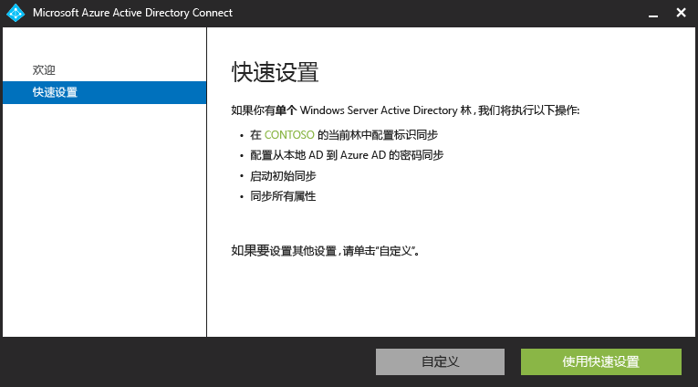
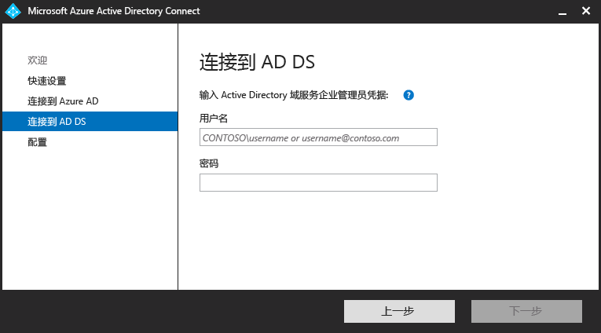
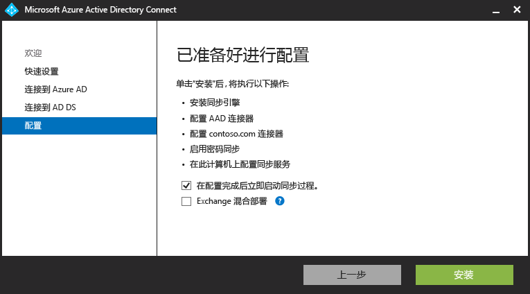
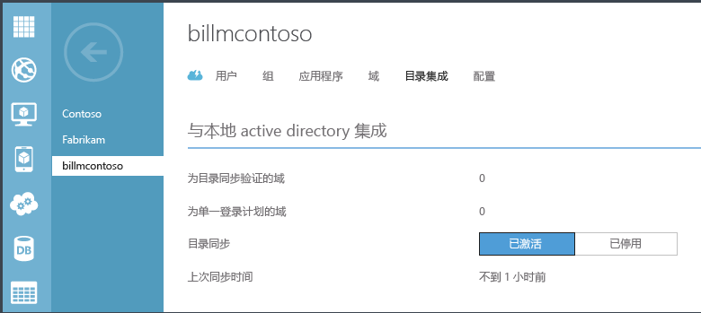

<properties 
	pageTitle="Azure AD Connect 入门" 
	description="了解如何下载、安装和运行 Azure AD Connect 的设置向导。" 
	services="active-directory" 
	documentationCenter="" 
	authors="billmath" 
	manager="stevenpo" 
	editor="curtand"/>

<tags 
	ms.service="active-directory" 
	ms.date="08/24/2015" 
	ms.author="11/02/2015"/>

# Azure AD Connect 入门

> [AZURE.SELECTOR]
- [简介](/documentation/articles/active-directory-aadconnect/)
- [工作原理](/documentation/articles/active-directory-aadconnect-how-it-works/)
- [入门](/documentation/articles/active-directory-aadconnect-get-started/)
- [后续步骤](/documentation/articles/active-directory-aadconnect-whats-next/)
- [了解详细信息](/documentation/articles/active-directory-aadconnect-learn-more/)

以下文档将会帮助你开始使用 Azure Active Directory Connect。本文档说明如何使用 Azure AD Connect 的快速安装。有关自定义安装的详细信息，请参阅 [Azure AD Connect 的自定义安装](/documentation/articles/active-directory-aadconnect-get-started-custom)。有关从 DirSync 升级到 Azure AD Connect 的信息，请参阅[将 DirSync 升级到 Azure Active Directory Connect](/documentation/articles/active-directory-aadconnect-dirsync-upgrade-get-started)。

## 下载 Azure AD Connect

若要开始使用 Azure AD Connect，可以使用以下链接下载最新版本：[下载 Azure AD Connect 公共预览版](http://connect.microsoft.com/site1164/program8612)

## 安装 Azure AD Connect 之前
在使用“快速设置”安装 Azure AD Connect 之前，需要做好以下准备。

 
- Azure 订阅或 [Azure 试用版订阅](http://azure.microsoft.com/pricing/free-trial/) - 这只是用来访问 Azure 门户，而不是用于 Azure AD Connect。如果你正在使用 PowerShell 或 Office 365，则无需 Azure 订阅即可使用 Azure AD Connect。
- 你要集成的 Azure AD 租户的 Azure AD 全局管理员帐户
- 装有 Windows Server 2008 或更高版本的 AD 域控制器或成员服务器
- 本地 Active Directory 的企业管理员帐户
- 可选：一个用于验证同步的测试用户帐户。 

### Azure AD Connect 的硬件要求
下表显示了 Azure AD Connect 计算机的最低要求。

| Active?Directory 中的对象数目 | CPU | 内存 | 硬盘驱动器大小 |
| ------------------------------------- | --- | ------ | --------------- |
| 少于 10,000 个 | 1.6 GHz | 4 GB | 70 GB |
| 10,000¨C50,000 | 1.6 GHz | 4 GB | 70 GB |
| 50,000¨C100,000 | 1.6 GHz | 16 GB | 100 GB |
| 如果对象数超过 100,000 个，则需要使用完全版本的 SQL Server| | | |
| 100,000¨C300,000 | 1.6 GHz | 32 GB | 300 GB |
| 300,000¨C600,000 | 1.6 GHz | 32 GB | 450 GB |
| 超过 600,000 个 | 1.6 GHz | 32 GB | 500 GB |

对于多个林或联合登录等“自定义选项”，请在[此处](/documentation/articles/active-directory-aadconnect-get-started-custom)了解其他要求。

## Azure AD Connect 的快速安装
“快速设置”是默认选项，也是最常用的设置方案之一。使用此选项时，Azure AD Connect 将部署使用密码哈希同步选项的同步。这适用于单一林，它允许你的用户使用本地密码登录到云。使用“快速设置”在完成安装之后自动开始同步处理（不过可以选择不打开）。使用此选项时，只需单击几下鼠标就能将本地目录扩展到云中。

### 使用快速设置安装 Azure AD Connect
--------------------------------------------------------------------------------------------

1. 以企业管理员身份登录到要安装 Azure AD Connect 的服务器。这应该是你想要用作同步服务器的服务器。
2. 导航到 AzureADConnect.msi 并双击它
3. 在“欢迎”屏幕上，选中同意许可条款对应的框，然后单击“继续”。
4. 在“快速设置”屏幕上，单击“使用快速设置”。

6. 在“连接到 Azure AD”屏幕上，输入 Azure AD 的 Azure 全局管理员用户名和密码。单击**“下一步”**。
8. 在“连接到 AD DS”屏幕上，输入企业管理员帐户的用户名和密码。单击**“下一步”**。

9. 在“已准备好配置”屏幕上，单击“安装”。
	- 在“已准备好配置”页上，可以取消选中“配置完成后立即开始同步过程”复选框。如果你这样做，向导将配置同步，但会保持禁用任务，直到你在任务计划程序将它重新启用。启用任务后，将每隔三小时运行同步一次。
	- 此外，你也可以选择选中“Exchange 混合部署”对应的复选框，以配置同步服务。如果你不打算在云中和本地配置 Exchange 邮箱，则不需要这样做。

8. 安装完成后，单击“退出”。

  
 

<!--有关使用快速安装的视频，请参阅以下内容：

[AZURE.VIDEO azure-active-directory-connect-express-settings]

-->

## 验证安装

成功安装 Azure AD Connect 之后，你可以登录 Azure 门户并检查上次同步时间，以验证是否正在同步。

1.  登录到 Azure 门户。
2.  在左侧选择“Active Directory”。
3.  双击刚刚用于设置 Azure AD Connect 的目录。
4.  在顶部选择“目录集成”。请注意上次同步时间。

## 后续操作
安装 Azure AD Connect 后，你可以使用[此处](/documentation/articles/active-directory-aadconnect-whats-next)的链接执行安装后任务，例如，向用户分配 Azure AD Premium 或企业移动套件许可证，或配置其他选项。

**其他资源**

[目录集成工具比较](/documentation/articles/active-directory-aadconnect-get-started-tools-comparison)

 

<!---HONumber=60-->