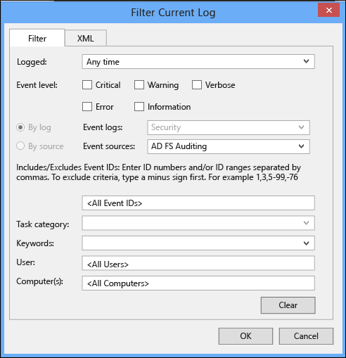

<properties 
	pageTitle="Azure AD Connect Health AD FS 代理安装 | Microsoft Azure" 
	description="本页与 Azure AD Connect Health 相关，介绍如何安装 Active Directory 联合身份验证服务 (AD FS) 代理。" 
	services="active-directory" 
	documentationCenter="" 
	authors="billmath" 
	manager="stevenpo" 
	editor="curtand"/>

<tags 
	ms.service="active-directory" 
	ms.date="08/14/2015" 
	wacn.date="11/12/2015"/>

# 适用于 AD FS 的 Azure AD Connect Health 代理安装

本文档将指导你在服务器上安装和配置适用于 AD FS 的 Azure AD Connect Health 代理。

>[AZURE.NOTE]请记住在查看 Azure AD Connect Health 实例中的任何数据之前，你将需要在目标服务器上安装 Azure AD Connect Health 代理。请务必在安装代理之前，满足[此处](/documentation/articles/active-directory-aadconnect-health#requirements)所述的要求。可以从[此处](http://go.microsoft.com/fwlink/?LinkID=518973)下载该代理。

## 代理安装
若要启动代理安装，请双击下载的 .exe 文件。在第一个屏幕上，单击“安装”。

安装完成后，单击“立即配置”。

这将启动后跟一些将执行 Register-AzureADConnectHealthADFSAgent 的 PowerShell 的命令提示符。系统将提示你登录到 Azure。继续登录。

登录后，将继续 PowerShell。完成后你可以关闭 PowerShell，配置已完成。

此时，应自动启动服务且代理将在此时监视和收集数据。请注意如果未满足已在前面几节中所述的所有先决条件，你将在 PowerShell 窗口看到警告。请务必在安装代理之前，满足[此处](/documentation/articles/active-directory-aadconnect-health#requirements)所述的要求。以下屏幕截图是这些错误的一个示例。

若要验证代理是否已安装，打开服务并检查以下方面。如果你完成了配置，这些服务应运行。否则，配置完成之前它们将无法启动。

- Azure AD Connect Health AD FS Diagnostics 服务
- Azure AD Connect Health AD FS Insights 服务
- Azure AD Connect Health AD FS Monitoring 服务
 

## 在 Windows Server 2008 R2 服务器上的代理安装

对于 Windows Server 2008 R2 服务器执行以下操作：

1. 确保正在运行 Service Pack 1 或更高版本的服务器。
1. 关闭代理安装的 IE ESC：
1. 在安装 AD Health 代理之前，在每台服务器上安装 Windows PowerShell 4.0。若要安装 Windows PowerShell 4.0：
 - 使用以下链接下载脱机安装程序，安装 [Microsoft.NET Framework 4.5](https://www.microsoft.com/download/details.aspx?id=40779)。
 - （从 Windows 功能）安装 PowerShell ISE
 - 安装 [Windows Management Framework 4.0。](https://www.microsoft.com/download/details.aspx?id=40855)
 - 在服务器上安装 Internet Explorer 版本 10 或更高版本。这是 Health 服务通过使用你的 Azure 管理员凭据对你进行身份验证所必需的。
1. 有关在 Windows Server 2008 R2 上安装 Windows PowerShell 4.0 的其他信息，请参阅[此处](http://social.technet.microsoft.com/wiki/contents/articles/20623.step-by-step-upgrading-the-powershell-version-4-on-2008-r2.aspx)的 wiki 文章。

## 为 AD FS 启用审核

若要通过使用情况分析功能收集和分析数据，必须向 Azure AD Connect Health 代理提供 AD FS 审核日志中的信息。默认情况下未启用这些日志。这仅适用于 AD FS 联合服务器。不需在 AD FS 代理服务器或网站代理服务器上启用审核。请通过以下步骤启用 AD FS 审核并查找 AD FS 审核日志。

#### 启用 AD FS 2.0 审核的步骤

1. 单击“开始”，指向“程序”，然后指向“管理工具”，再单击“本地安全策略”。
2. 导航到“安全设置\\本地策略\\用户权限管理”文件夹，然后双击“生成安全审核”。
3. 在“本地安全设置”选项卡上，验证是否列出了 AD FS 2.0 服务帐户。如果该帐户不存在，请单击“添加用户或组”并将其添加到列表中，然后单击“确定”。
4. 使用提升的权限打开命令提示符，然后运行以下命令以启用审核：<code>auditpol.exe /set /subcategory:"生成的应用程序" /failure:enable /success:enable</code>
5. 关闭本地安全策略，然后打开“管理”管理单元。若要打开“管理”管理单元，请单击“开始”，指向“程序”，然后指向“管理工具”，再单击“AD FS 2.0 管理”。
6. 在“操作”窗格中，单击“编辑联合身份验证服务属性”。
7. 在“联合身份验证服务属性”对话框中，单击“事件”选项卡。
8. 选择“成功审核”和“失败审核”复选框。
9. 单击**“确定”**。

#### 在 Windows Server 2012 R2 上启用 AD FS 审核的步骤

1. 通过在“开始”屏幕上打开“服务器管理器”或在桌面的任务栏中打开“服务器管理器”的方式打开“本地安全策略”，然后单击“工具/本地安全策略”。
2. 导航到“安全设置\\本地策略\\用户权限分配”文件夹，然后双击“生成安全审核”。
3. 在“本地安全设置”选项卡上，验证是否列出了 AD FS 服务帐户。如果该帐户不存在，请单击“添加用户或组”并将其添加到列表中，然后单击“确定”。
4. 使用提升的权限打开命令提示符，然后运行以下命令以启用审核：<code>auditpol.exe /set /subcategory:"生成的应用程序" /failure:enable /success:enable。</code>
5. 关闭“本地安全策略”，然后打开“AD FS 管理”管理单元（在“服务器管理器”中，单击“工具”，然后选择“AD FS 管理”）。
6. 在“操作”窗格中，单击“编辑联合身份验证服务属性”。
7. 在“联合身份验证服务属性”对话框中，单击“事件”选项卡。
8. 选择“成功审核”和“失败审核”复选框，然后单击“确定”。

#### 查找 AD FS 审核日志的步骤

1. 打开“事件查看器”。
2. 转到“Windows 日志”，然后选择“安全”。
3. 在右侧单击“筛选当前日志”。
4. 在“事件源”下选择“AD FS 审核”。

> [AZURE.WARNING]如果你的组策略正在禁用 AD FS 审核，则 Azure AD Connect Health 代理将不能收集信息。请确保没有可能正在禁用审核的组策略。

[//]: # "代理的代理配置部分开头"

## 将 Azure AD Connect Health 代理配置为使用 HTTP 代理
你可以将 Azure AD Connect Health 代理配置为使用 HTTP 代理。

>[AZURE.NOTE]
>- 无法使用 ¡°Netsh WinHttp set ProxyServerAddress¡±，因为代理使用 System.Net 而不是 Microsoft Windows HTTP 服务发出 Web 请求。
>- 配置的 Http 代理地址将用于传递加密的 Https 消息。
>- 不支持经过身份验证的代理（使用 HTTPBasic）。

### 更改 Health 代理的代理配置
可以使用以下选项将 Azure AD Connect Health 代理配置为使用 HTTP 代理。

>[AZURE.NOTE]必须重新启动 Azure AD Connect Health 代理服务才能更新代理设置。运行以下命令：  
>Restart-Service AdHealth*

#### 导入现有的代理设置
##### 从 Internet Explorer 导入
可以通过在运行 Health 代理的每台服务器上执行以下 PowerShell 命令，来导入 Internet Explorer HTTP 代理设置并将这些设置用于 Azure AD Connect Health 代理。

	Set-AzureAdConnectHealthProxySettings -ImportFromInternetSettings

##### 从 WinHTTP 导入
可以通过在运行 Health 代理的每台服务器上执行以下 PowerShell 命令，来导入 WinHTTP 代理设置。

	Set-AzureAdConnectHealthProxySettings -ImportFromWinHttp

#### 手动指定代理地址
可以通过在运行 Health 代理的每台服务器上执行以下 PowerShell 命令，来手动指定代理服务器。

	Set-AzureAdConnectHealthProxySettings -HttpsProxyAddress address:port

示例：*Set-AzureAdConnectHealthProxySettings -HttpsProxyAddress myproxyserver:443*

- “地址”可以是 DNS 可解析的服务器名称或 IPv4 地址
- 可以省略“端口”。如果省略端口，则会选择 443 作为默认端口。

#### 清除现有的代理配置
可通过运行以下命令来清除现有的代理配置。

	Set-AzureAdConnectHealthProxySettings -NoProxy

### 读取当前的代理设置
可以使用以下命令来读取当前配置的代理设置。

	Get-AzureAdConnectHealthProxySettings

[//]: # "代理的代理配置部分结尾"

## 相关链接

* [Azure AD Connect Health](/documentation/articles/active-directory-aadconnect-health)
* [Azure AD Connect Health 操作](/documentation/articles/active-directory-aadconnect-health-operations)
* [在 AD FS 中使用 Azure AD Connect Health](/documentation/articles/active-directory-aadconnect-health-adfs)
* [Azure AD Connect Health 常见问题](/documentation/articles/active-directory-aadconnect-health-faq)

<!---HONumber=76-->