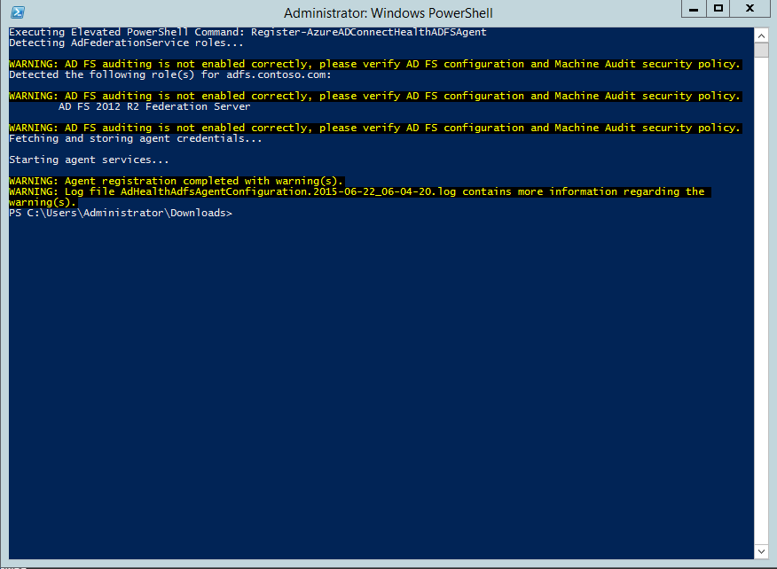
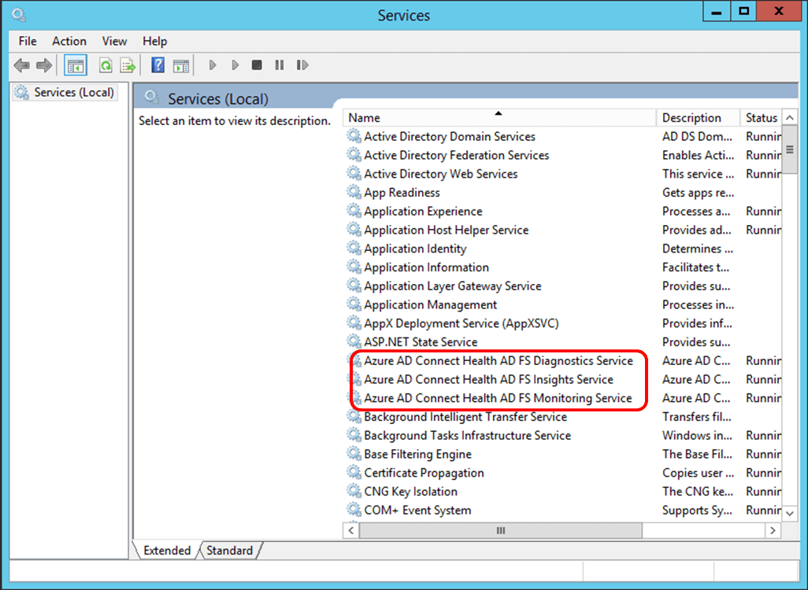

<properties 
	pageTitle="Azure AD Connect Health 要求。" 
	description="这是介绍要求和代理安装的 Azure AD Connect Health 页。" 
	services="active-directory" 
	documentationCenter="" 
	authors="billmath" 
	manager="swadhwa" 
	editor="curtand"/>

<tags 
	ms.service="active-directory" 
	ms.date="07/12/2015" 
	wacn.date="08/29/2015"/>

# Azure Active Directory Connect Health 要求
以下文档是你开始使用 Azure AD Connect Health 之前必须满足的要求的列表。

## Azure AD 高级版许可证

Azure AD Connect Health 是一项 Azure AD 高级版功能，并要求 Azure AD 高级版许可证。若要获取许可证，请参阅“Azure AD 高级版入门”。
 

## 你必须是 Azure AD 租户的全局管理员。

默认情况下，全局管理员有权访问由 Azure AD Connect Health 提供的信息。如果你不是与本地 Active Directory 联合的 Azure AD 租户的全局管理员，你将不能创建 Azure AD Connect Health 服务实例。确保你是全局管理员。其他有关信息，请参阅[管理 Azure AD 目录](https://msdn.microsoft.com/library/azure/hh967611.aspx)。
 

## 安装在每个目标服务器上的 Azure AD Connect Health 代理

Azure AD Connect Health 要求在目标服务器上安装代理，以便提供在 Azure AD Connect Health 门户中查看的数据。这意味着若要获得有关 AD FS 的本地基础结构的数据，必须在 AD FS 服务器上安装代理。这包括 AD FS 代理服务器和 Web 应用程序代理服务器。有关安装 Azure AD Connect Health 代理的信息，请参阅 Azure AD Connect Health 代理安装步骤。

## Azure AD Connect Health 代理要求

以下各节介绍 Azure AD Connect Health 代理特定要求。
 

### 下载 Azure AD Connect Health 代理

若要开始使用 Azure AD Connect Health，可在此处下载最新版本的代理：[下载 Azure AD Connect Health 代理。](http://go.microsoft.com/fwlink/?LinkID=518973) 在安装代理之前，请确保已从应用商店添加了该服务。

 
### Azure 服务终结点的出站连接
在安装和运行时期间，代理需要连接到下面列出的 Azure AD Connect Health 服务终结点。如果阻止出站连接，请确保将以下内容添加到允许列表：

- **.servicebus.chinacloudapi.cn - Port: 5671
- https://*.adhybridhealth.azure.com/
- https://*.table.core.chinacloudapi.cn/
- https://policykeyservice.dc.ad.msft.net/
- https://login.chinacloudapi.cn
- https://login.microsoftonline.com
- https://secure.aadcdn.microsoftonline-p.com 

## 如果已启用 IE 增强安全措施，可允许以下网站
如果在将安装代理的服务器上启用了 IE 增强安全措施，以下网站需要被允许。

- https://login.microsoftonline.com 
- https://secure.aadcdn.microsoftonline-p.com
- https://login.chinacloudapi.cn
- 受 Azure Active Directory 信任的你的组织的联合服务器。例如的：https://sts.contoso.com 

### 对于 AD FS 来说，必须启用 AD FS 审核才能使用使用情况分析

为了使使用情况分析功能用来收集数据并分析 Azure AD Connect Health 代理，需要 AD FS 审核日志中的信息。默认情况下未启用这些日志。这仅适用于 AD FS 联合服务器。不需要在 AD FS 代理服务器或 Web 应用程序代理服务器上启用审核。使用以下过程以启用 AD FS 审核并查找 AD FS 审核日志。

#### 若要启用对 AD FS 2.0 的审核

1. 单击“开始”，指向“程序”，指向“管理工具”，然后单击“本地安全策略”。
1. 导航到“安全设置\\本地策略\\用户权限管理”文件夹，然后双击“生成安全审核”。
1. 在“本地安全设置”选项卡上，验证 AD FS 2.0 的服务帐户是否已列出。如果不存在，请单击“添加用户或组”并将其添加到列表中，然后单击“确定”。
1. 使用升级权限打开命令提示符并运行以下命令以启用审核。`auditpol.exe /set /subcategory:"Application Generated" /failure:enable /success:enable`
1. 关闭本地安全策略，然后打开“管理”管理单元。若要打开“管理”管理单元，单击“开始”，指向“程序”，指向“管理工具”，然后单击“AD FS 2.0 管理”。
1. 在“操作”窗格中，单击“编辑联合服务属性”。
1. 在“联合服务属性”对话框中，单击“事件”选项卡。
1. 选择“成功审核”和“失败审核”复选框。
1. 单击“确定”。

#### 若要启用对 Windows Server 2012 R2 中 AD FS 的审核

1. 通过打开“开始”屏幕上的“服务器管理器”，或通过打开在桌面上的任务栏中的“服务器管理器”打开“本地安全策略”，然后单击“工具/本地安全策略”。
1. 导航到“安全设置\\本地策略\\用户权限分配”文件夹，然后再双击“生成安全审核”。
1. 在“本地安全设置”选项卡上，验证 AD FS 服务帐户是否已列出。如果不存在，请单击“添加用户或组”并将其添加到列表中，然后单击“确定”。
1. 使用升级权限打开命令提示符并运行以下命令以启用审核：`auditpol.exe /set /subcategory:"Application Generated" /failure:enable /success:enable.`
1. 关闭“本地安全策略”，然后打开“AD FS 管理”管理单元（在“服务器管理器”中，单击“工具”，然后选择“AD FS 管理”）。
1. 在“操作”窗格中，单击“编辑联合服务属性”。
1. 在“联合服务属性”对话框中，单击“事件”选项卡。
1. 选择“成功审核和失败审核”复选框，然后单击“确定”。

#### 若要查找 AD FS 审核日志

1. 打开“事件查看器”。</li>
1. 转到 Windows 日志并选择“安全”。
1. 在右侧单击“筛选当前日志”。
1. 在“事件源”下选择“AD FS 审核”。

> [AZURE.WARNING]如果你有一个禁用 AD FS 审核的组策略，则 Azure AD Connect Health 代理将不能收集信息。确保没有可能禁用审核的组策略。

### 在 Windows Server 2008 R2 服务器上的代理安装

对于 Windows Server 2008 R2 服务器执行以下操作：

1. 确保正在运行 Service Pack 1 或更高版本的服务器。
1. 关闭代理安装的 IE ESC：
1. 在安装 AD Health 代理之前，在每台服务器上安装 Windows PowerShell 4.0。若要安装 Windows PowerShell 4.0：
 - 使用以下链接下载脱机安装程序，安装 [Microsoft.NET Framework 4.5](https://www.microsoft.com/zh-cn/download/details.aspx?id=40779)。
 - （从 Windows 功能）安装 PowerShell ISE
 - 安装 [Windows Management Framework 4.0。](https://www.microsoft.com/zh-cn/download/details.aspx?id=40855)
 - 在服务器上安装 Internet Explorer 版本 10 或更高版本。这是 Health 服务通过使用你的 Azure 管理员凭据对你进行身份验证所必需的。
1. 有关在 Windows Server 2008 R2 上安装 Windows PowerShell 4.0 的其他信息，请参阅[此处](http://social.technet.microsoft.com/wiki/contents/articles/20623.step-by-step-upgrading-the-powershell-version-4-on-2008-r2.aspx)的 wiki 文章。

## Azure AD Connect Health 代理部署
本部分将指导你在服务器上安装和配置 Azure AD Connect Health 代理。请记住在查看 Azure AD Connect Health 实例中的任何数据之前，你将需要在目标服务器上安装 Azure AD Connect Health 代理。请务必在安装代理之前，完成上面的要求。你可以使用上面的链接下载代理，然后按照下面的步骤操作。

双击你下载的 .exe 文件。在第一个屏幕上，单击“安装”。

安装完成后，单击“立即配置”。

这将启动后跟一些将执行 Register-AzureADConnectHealthADFSAgent 的 PowerShell 的命令提示符。系统将提示你登录到 Azure。继续登录。

登录后，将继续 PowerShell。完成后你可以关闭 PowerShell，配置已完成。

此时，应自动启动服务且代理将在此时监视和收集数据。请注意如果未满足已在前面几节中所述的所有先决条件，你将在 PowerShell 窗口看到警告。以下屏幕快照是一个示例。

若要验证代理是否已安装，打开服务并检查以下方面。如果你完成了配置，这些服务应运行。否则，配置完成之前它们将无法启动。

- Azure AD Connect Health AD FS Diagnostics 服务
- Azure AD Connect Health AD FS Insights 服务
- Azure AD Connect Health AD FS Monitoring 服务
 

<!---HONumber=67-->