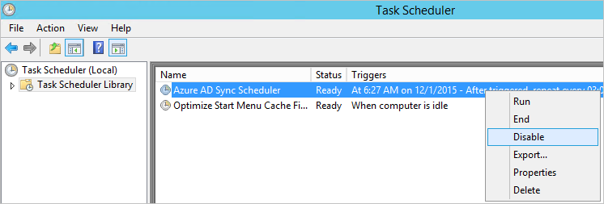
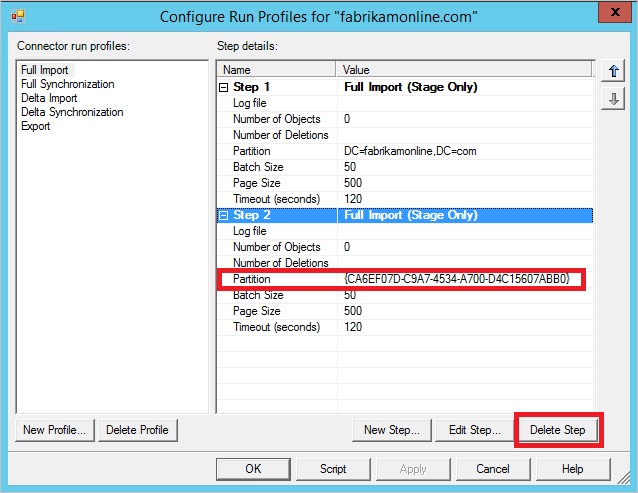
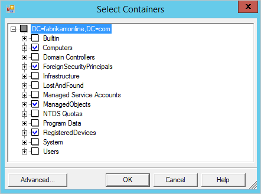

<properties
	pageTitle="Azure AD Connect 同步：配置筛选 | Microsoft Azure"
	description="介绍如何在 Azure AD Connect 同步中配置筛选。"
	services="active-directory"
	documentationCenter=""
	authors="andkjell"
	manager="stevenpo"
	editor=""/>

<tags
	ms.service="active-directory"
	ms.date="05/10/2016"
	wacn.date="06/14/2016"/>

# Azure AD Connect 同步：配置筛选
筛选功能可让你控制本地目录中的哪些对象应该出现在 Azure AD 中。默认配置将采用配置的林中所有域内的所有对象。我们一般建议使用这种配置。例如，使用 Exchange Online 和 Skype for Business 等 Office 365 工作负荷的最终用户将受益于完整的全局地址列表，因为这样可以发送电子邮件和呼叫每个联系人。使用默认配置时，用户获得的体验与在 Exchange 或 Lync 的本地实现中相同。

有某些情况下，需要对默认配置进行一些更改。下面是一些示例：

- 你打算使用[多重 Azure AD 目录拓扑](/documentation/articles/active-directory-aadconnect-topologies#each-object-only-once-in-an-azure-ad-directory)。然后，你需要应用筛选器以控制要将哪些对象同步到特定的 Azure AD 目录。
- 你要试用 Azure 或 Office 365，因此只想在 Azure AD 中创建少量的用户。在进行小规模试用时，无需使用完整全局地址列表即可演示功能。
- Azure AD 中有很多你不需要的服务帐户和其他非个人帐户。
- 出于合规性的原因，你不能删除任何本地用户帐户，而只能禁用它们。但是，在 Azure AD 中，你只希望存在活动的帐户。

本文将介绍如何配置不同的筛选方法。

> [AZURE.IMPORTANT]Microsoft 不支持在正式记录的这些操作之外修改或操作 Azure AD Connect 同步。其中的任何操作都可能会导致 Azure AD Connect 同步出现不一致或不受支持状态，并由此导致 Microsoft 无法提供这种部署的技术支持。

## 基础知识和重要说明
在 Azure AD Connect 同步中，你可以随时启用筛选。如果你从目录同步的默认配置开始并在此后配置了筛选，则筛选出的对象不再同步到 Azure AD。因此，Azure AD 中前面已同步，但之后进行筛选的任何对象会在 Azure AD 中进行删除。

在开始更改筛选之前，请确保[禁用计划的任务](#disable-scheduled-task)，以免意外导出尚未确认是否正确的更改。

由于筛选操作可能会同时删除非常多的对象，因此请先确保新的筛选器正确无误，然后再开始将更改导出到 Azure AD。在完成配置步骤后，强烈建议你执行[验证步骤](#apply-and-verify-changes)，然后才对 Azure AD 进行导出和更改操作。

为了防止意外删除许多对象，默认情况下已打开[防止意外删除](/documentation/articles/active-directory-aadconnectsync-feature-prevent-accidental-deletes)功能。如果由于筛选而删除了许多对象（默认为 500 个），则需要遵循本文中的步骤来允许将删除结果传播到 Azure AD。

如果你使用 2015 年 11 月 ([1\.0.9125](/documentation/articles/active-directory-aadconnect-version-history#1091250)) 之前的内部版本、更改筛选器配置或使用密码同步，则在完成配置之后，需要触发所有密码的完全同步。有关如何触发密码完全同步的步骤，请参阅[触发所有密码的完全同步](/documentation/articles/active-directory-aadconnectsync-implement-password-synchronization#trigger-a-full-sync-of-all-passwords)。如果使用 1.0.9125 或更高版本，则常规的**完全同步**操作也会计算是否应同步密码，因此你不再需要执行这个额外的步骤。

如果在 Azure AD 中由于筛选错误导致**用户**对象被无意中删除，你可以通过删除筛选配置，然后再次同步目录，在 Azure AD 中重新创建用户对象。这样就可以从 Azure AD 的回收站中还原用户。但是，你无法取消删除其他对象类型。例如，如果你意外删除了某个安全组，而该组用于将资源加入 ACL，则无法恢复该组及其 ACL。

Azure AD Connect 只删除其曾经认为在范围中的对象。如果 Azure AD 中的对象由另一个同步引擎创建且不在范围内，则添加筛选并不会删除这些对象。例如，如果你一开始使用 DirSync 服务器，而该服务器在 Azure AD 中创建了整个目录的完整副本，然后你在从一开始便启用筛选的情况下并行安装了新的 Azure AD Connect 同步服务器，则这个新服务器将不会删除 DirSync 所创建的额外对象。

当你安装或升级到较新版本的 Azure AD Connect 时，筛选配置将会保留。运行第一个同步周期之前，在升级到较新版本之后验证配置没有被无意中更改，这始终是最佳做法。

如果你有多个林，则必须将本主题中所述的筛选配置应用到每个林（假设你想要让所有林使用相同的配置）。

若要禁用每隔 30 分钟触发同步周期一次的内置计划程序，请遵循以下步骤：

1. 转到 PowerShell 提示符。
2. 运行 `Set-ADSyncScheduler -SyncCycleEnabled $False` 以禁用计划程序。
3. 如本主题中所述进行更改。
4. 运行 `Set-ADSyncScheduler -SyncCycleEnabled $True` 以再次启用计划程序。

**如果使用低于 1.1.105.0 的 Azure AD Connect 版本**  
若要禁用每隔 3 小时触发同步作业一次的计划任务，请遵循以下步骤：

1. 从开始菜单启动“任务计划程序”。
2. 在“任务计划程序库”正下方找到名为“Azure AD 同步计划程序”的任务，单击右键，然后选择“禁用”。  
  
3. 现在可以进行配置更改，并从“同步服务管理器”控制台手动运行同步引擎。

完成所有筛选更改之后，别忘了返回以重新**启用**任务。

## 筛选选项
可将以下筛选配置类型应用到目录同步工具：

- [**基于组**](/documentation/articles/active-directory-aadconnect-get-started-custom##sync-filtering-based-on-groups)：初始安装时只能使用安装向导配置基于单个组的筛选。本主题不会进一步讨论此类型。

- [**基于域**](#domain-based-filtering)：此选项可让你选择要将哪些域同步到 Azure AD。如果在安装 Azure AD Connect 同步之后对本地基础结构进行更改，此选项还可让你在同步引擎配置中添加和删除域。

- [**基于组织单位**](#organizational-unitbased-filtering)：此筛选选项可让你选择要将哪些组织单位同步到 Azure AD。将对所选 OU 中的所有对象类型应用此选项。

- [**基于属性**](#attribute-based-filtering)：此选项可让你根据对象属性值筛选对象。你也可以对不同的对象类型使用不同的筛选器。

可以同时使用多个筛选选项。例如，可以使用基于组织单位的筛选以便只包含某个 OU 中的对象，同时使用基于属性的筛选进一步筛选这些对象。使用多个筛选方法时，筛选器之间使用逻辑 AND。

## 基于域的筛选
本部分为你提供配置域筛选器需要执行的步骤。如果安装 Azure AD Connect 之后在林中添加或删除域，则也必须更新筛选配置。

更改基于域的筛选的首选方法是运行安装向导并更改[域和 OU 筛选](/documentation/articles/active-directory-aadconnect-get-started-custom#domain-and-ou-filtering)。使用安装向导可以自动执行本主题中所述的所有任务。

仅当你出于某种原因而无法运行安装向导时，才遵循以下步骤。

基于域的筛选配置包括以下步骤：

- [选择应包含在同步操作中的域](#select-domains-to-be-synchronized)。
- 针对添加和删除的每个域，请调整[运行配置文件](#update-run-profiles)。
- [应用并验证更改](#apply-and-verify-changes)。

### 选择要同步的域
**若要设置域筛选器，请执行以下步骤：**

1. 通过使用属于 **ADSyncAdmins** 安全组的成员的帐户，登录到正在运行 Azure AD Connect 同步的服务器。
2. 从“开始”菜单启动“同步服务”。
3. 选择“连接器”，然后在“连接器”列表中选择类型为“Active Directory 域服务”的连接器。从“操作”中选择“属性”。  
  
4. 单击“配置目录分区”。
5. 在“选择目录分区”列表中，根据需要选择和取消选择域。确认只选择了想要同步的分区。  
  
如果更改了本地 AD 基础结构并在林中添加或删除了域，请单击“刷新”按钮以获取更新的列表。刷新时系统会要求你提供凭据，请提供具有本地 Active Directory 读取权限的任何凭据。不一定要使用对话框中预先填充的用户。  
  
6. 完成后，请单击“确定”关闭“属性”对话框。如果在林中删除了域，屏幕上会弹出消息，指出已删除域且将清除配置。
7. 继续调整[运行配置文件](#update-run-profiles)。

### 更新运行配置文件
如果你已修改域筛选器，则还需要更新运行配置文件。

1. 在“连接器”列表中，确保已选择你在上一个步骤中更改的连接器。从“操作”中选择“配置运行配置文件”。  
  

需要调整以下配置文件：

- 完全导入
- 完全同步
- 增量导入
- 增量同步
- 导出

针对上述五个配置文件，请对每个**添加的**域执行以下步骤：

1. 选择运行配置文件，然后单击“新步骤”。
2. 在“配置步骤”页上的“类型”下拉列表中，选择与你要配置的配置文件同名的步骤类型。然后，单击“下一步”。  
  
3. 在“连接器配置”页上的“分区”下拉列表中，选择已添加到域筛选器的域名。  
  
4. 若要关闭“配置运行配置文件”对话框，请单击“完成”。

针对上述五个配置文件，请对每个“删除”的域执行以下步骤：

1. 选择运行配置文件。
2. 如果“分区”属性的“值”为 GUID，请选择运行步骤并单击“删除步骤”。  
  

最终结果应该是想要同步的每个域都已列为每个运行配置文件中的步骤。

若要关闭“配置运行配置文件”对话框，请单击“确定”。

- 若要完成配置设置，请参阅[应用并验证更改](#apply-and-verify-changes)。

## 基于组织单位的筛选
更改基于 OU 的筛选的首选方法是运行安装向导并更改[域和 OU 筛选](/documentation/articles/active-directory-aadconnect-get-started-custom#domain-and-ou-filtering)。使用安装向导可以自动执行本主题中所述的所有任务。

仅当你出于某种原因而无法运行安装向导时，才遵循以下步骤。

**若要配置基于组织单元的筛选，请执行以下步骤：**

1. 通过使用属于 **ADSyncAdmins** 安全组的成员的帐户，登录到正在运行 Azure AD Connect 同步的服务器。
2. 从“开始”菜单启动“同步服务”。
3. 选择“连接器”，然后在“连接器”列表中选择类型为“Active Directory 域服务”的连接器。从“操作”中选择“属性”。  
  
4. 单击“配置目录分区”，选择你想要配置的域，然后单击的域“容器”。
5. 出现提示时，请提供具有本地 Active Directory 读取权限的任何凭据。不一定要使用对话框中预先填充的用户。
6. 在“选择容器”对话框中，清除不想与云目录同步的 OU，然后单击“确定”。  
  
  - 应选择“计算机”容器，这样 Windows 10 计算机才能成功同步到 Azure AD。如果已加入域的计算机位于其他 OU，请确保已选择这些计算机。
  - 如果有多个信任的林，则应选择 **ForeignSecurityPrincipals** 容器。这样即可解析跨林安全组成员身份。
  - 如果已启用设备写回功能，则应选择 **RegisteredDevices** OU。如果你使用另一种写回功能，例如组写回，请确保已选择这些位置。
  - 选择用户、iNetOrgPersons、组、联系人和计算机所在位置的其他 OU。在上图中，这些项目全都位于 ManagedObjects OU 中。
7. 完成后，请单击“确定”关闭“属性”对话框。
8. 若要完成配置设置，请参阅[应用并验证更改](#apply-and-verify-changes)。

## 基于属性的筛选
为了正常执行这些步骤，请确保使用 2015 年 11 月 ([1\.0.9125](/documentation/articles/active-directory-aadconnect-version-history#1091250)) 或更高版本。

基于属性的筛选是最灵活的对象筛选方式。将对象同步到 Azure AD 时，你可以使用[声明性预配](/documentation/articles/active-directory-aadconnectsync-understanding-declarative-provisioning-expressions)的能力来控制几乎每个方面的问题。

筛选可以应用于从 Active Directory 到 Metaverse 的[入站](#inbound-filtering)传输和从 Metaverse 到 Azure AD 的[出站](#outbound-filtering)传输。建议对入站传输应用筛选，因为这样做最容易进行维护。仅当需要先要从多个林加入对象再进行评估时，才使用出站筛选。

### 入站筛选
基于入站的筛选利用默认配置，其中，传入 AAD 的对象必须未将 Metaverse 属性 cloudFiltered 设置为要同步的值。如果这个属性的值设置为 **True**，则不会同步对象。根据设计，此值不应设为 **False**。若要确保其他规则能够提供值，这个属性只应具有 **True** 或 **NULL**（不存在）值。

在入站筛选中，我们将使用**范围**的能力来决定哪些对象应该或不应该同步。你可以在此处根据组织的要求进行调整。范围模块提供**组**和**子句**，以决定是否应在范围内包含同步规则。一个**组**包含一个或多个**子句**。多个子句之间使用逻辑 AND，多个组之间使用逻辑 OR。

让我们看看以下示例：  
 
这应该写为 **(department = IT) OR (department = Sales AND c = US)**。

在以下示例和步骤中，我们以用户对象为例，但可以将此例子应用到所有对象类型。

在下面的示例中，所用的优先级值从 500 开始。这可以确保这些值在现有规则（较低的优先级、较高的数字值）之后进行评估。

#### 负筛选：“不同步这些项目”
在下面的示例中，我们将筛选出（不同步）其中 **extensionAttribute15** 具有值 **NoSync** 的所有用户。

1. 通过使用属于 **ADSyncAdmins** 安全组的成员的帐户，登录到正在运行 Azure AD Connect 同步的服务器。
2. 从开始菜单启动“同步规则编辑器”。
3. 确保选择了“入站”，然后单击“添加新规则”。
4. 为规则指定一个描述性名称，如 In from AD – User DoNotSyncFilter。选择正确的林，选择“用户”作为“CS 对象类型”，并选择“人员”作为“MV 对象类型”。对于“链接类型”，请选择“联接”，在优先级类型中，选择当前未由其他同步规则使用的值（例如 500），然后单击“下一步”。  
  
5. 在“范围筛选器”中，单击“添加组”，单击“添加子句”，然后在属性中选择“ExtensionAttribute15”。确保运算符设置为“等于”，并在值框中键入值 **NoSync**。单击“下一步”。  
  
6. 将“联接”规则留空，然后单击“下一步”。
7. 单击“添加转换”，为“FlowType”选择“Constant”，选择目标属性“cloudFiltered”，然后在源文本框中键入 **True**。单击“添加”保存规则。  

8. 若要完成配置设置，请参阅[应用并验证更改](#apply-and-verify-changes)。

#### 正筛选：“只同步这些项目”
表达正筛选更加复杂，因为必须同时考虑不是明显需要同步的对象，例如会议室。

正筛选选项需要两个同步规则。一个（或多个）要有所要同步的对象的正确范围，另一个则是全方位同步规则，后者将用来筛选出尚未标识为属于应同步对象的所有对象。

在以下示例中，我们只同步部门属性值为 **Sales** 的用户对象。

1. 通过使用属于 **ADSyncAdmins** 安全组的成员的帐户，登录到正在运行 Azure AD Connect 同步的服务器。
2. 从开始菜单启动“同步规则编辑器”。
3. 确保选择了“入站”，然后单击“添加新规则”。
4. 为规则指定一个描述性名称，如 In from AD – User Sales sync。选择正确的林，选择“用户”作为“CS 对象类型”，并选择“人员”作为“MV 对象类型”。对于“链接类型”，请选择“联接”，在优先级类型中，选择当前未由其他同步规则使用的值（例如 501），然后单击“下一步”。  
  
5. 在“范围筛选器”中，单击“添加组”，单击“添加子句”，然后在属性中选择“department”。确保运算符设置为“等于”，并在值框中键入值 **Sales**。单击“下一步”。  
  
6. 将“联接”规则留空，然后单击“下一步”。
7. 单击“添加转换”，为“FlowType”选择“Constant”，选择目标属性“cloudFiltered”，然后在源文本框中键入 **False**。单击“添加”保存规则。  
  
这是一种特殊情况，在此我们将 cloudFiltered 显式设置为 False。

	我们现在必须创建全方位同步规则。

8. 为规则指定一个描述性名称，如 In from AD – User Catch-all filter。选择正确的林，选择“用户”作为“CS 对象类型”，并选择“人员”作为“MV 对象类型”。对于“链接类型”，请选择“加入”，然后在“优先顺序”中，键入当前未由其他同步规则使用的值（例如 600）。我们选择了高于先前同步规则的优先顺序值（较低优先顺序），但同时也预留了一些空间，以便可以在稍后想要开始同步其他部门时添加其他筛选同步规则。单击“下一步”。  

9. 让“范围筛选器”保留空白，然后单击“下一步”。空白筛选器表示规则应该应用到所有对象。
10. 将“联接”规则留空，然后单击“下一步”。
11. 单击“添加转换”，为“FlowType”选择“Constant”，选择目标属性“cloudFiltered”，然后在源文本框中键入 **True**。单击“添加”保存规则。  
  
12. 若要完成配置设置，请参阅[应用并验证更改](#apply-and-verify-changes)。

如果需要，我们可以创建更多第一种类型的规则，以便在同步中包含越来越多的对象。

### 出站筛选
在某些情况下，仅在对象已联接到 metaverse 中之后执行筛选是必要的。例如，可能需要从资源林中查看邮件属性，并需要从帐户林中查看 userPrincipalName 属性，以确定某个对象是否应同步。在这些情况下，我们会基于出站规则创建筛选。

在此示例中，我们会更改筛选，以便只同步 mail 和 userPrincipalName 均以 @contoso.com 结尾的用户：

1. 通过使用属于 **ADSyncAdmins** 安全组的成员的帐户，登录到正在运行 Azure AD Connect 同步的服务器。
2. 从开始菜单启动“同步规则编辑器”。
3. 在“规则类型”下，单击“出站”。
4. 查找名为 **Out to AAD – User Join SOAInAD** 的规则。单击“编辑”。
5. 在弹出窗口中，回答“是”以创建规则的副本。
6. 在“说明”页上，将优先顺序更改为某个尚未使用的值，例如 50。
7. 单击左侧导航上的“范围筛选器”。单击“添加子句”，在“属性”中，选择“mail”，在“运算符”中，选择“ENDSWITH”，并在值中键入 **@contoso.com**。单击“添加子句”，在“属性”中，选择“userPrincipalName”，在“运算符”中，选择“ENDSWITH”，并在值中键入 **@contoso.com**。
8. 单击“保存”。
9. 若要完成配置设置，请参阅[应用并验证更改](#apply-and-verify-changes)。

##  应用并验证更改
在更改配置后，必须将这些更改应用到系统中现有的对象。也有可能需要处理同步引擎中当前不存在的对象，因此我们需要再次读取源系统以验证其内容。

如果使用**域**或**组织单位**筛选更改了配置，则需要执行**完全导入**，接着执行**增量同步**。

如果使用**属性**筛选更改了配置，则需要进行**完全同步**。

执行以下步骤：

1. 从“开始”菜单启动“同步服务”。
2. 选择“连接器”，然后在“连接器”列表中选择前面进行了配置更改的连接器。从“操作”中选择“运行”。  
  
3. 在“运行配置文件”中，选择上一部分中所述的操作。如果需要运行两项操作，请在完成第一项操作后再运行第二项操作（所选连接器的“状态”列为“空闲”）。

同步后，将暂存所有更改以便导出。在 Azure AD 中实际进行更改之前，请验证所有更改是否正确。

1. 启动 cmd 提示符并转到 `%Program Files%\Microsoft Azure AD Sync\bin`
2. 运行：`csexport "Name of Connector" %temp%\export.xml /f:x` 连接器名称可以在同步服务中找到。它的名称类似于“contoso.com – AAD”（表示 Azure AD）。
3. 运行：`CSExportAnalyzer %temp%\export.xml > %temp%\export.csv`
4. 现在在 %temp% 中已经有名称为 export.csv 的文件，可在 Microsoft Excel 中检查。此文件包含将要导出的所有更改。
5. 对数据或配置进行必要的更改并再次运行这些步骤（导入、同步和验证），直到要导出的更改都按预期进行。

感到满意后，将更改导出到 Azure AD。

1. 选择“连接器”，然后在“连接器”列表中选择“Azure AD 连接器”。从“操作”中选择“运行”。
2. 在“运行配置文件”中，选择“导出”。
3. 如果配置更改将会删除许多对象，且数目超过配置的阈值（默认为 500），则在导出时你会看到错误。如果看到了错误，则需要暂时禁用[防止意外删除](/documentation/articles/active-directory-aadconnectsync-feature-prevent-accidental-deletes)功能。

现在，需要再次启用计划程序。

1. 从开始菜单启动“任务计划程序”。
2. 在“任务计划程序库”正下方找到名为“Azure AD 同步计划程序”的任务，单击右键，然后选择“启用”。

## 后续步骤

了解有关 [Azure AD Connect 同步](/documentation/articles/active-directory-aadconnectsync-whatis)配置的详细信息。

了解有关[将本地标识与 Azure Active Directory 集成](/documentation/articles/active-directory-aadconnect)的详细信息。

<!---HONumber=Mooncake_0606_2016-->