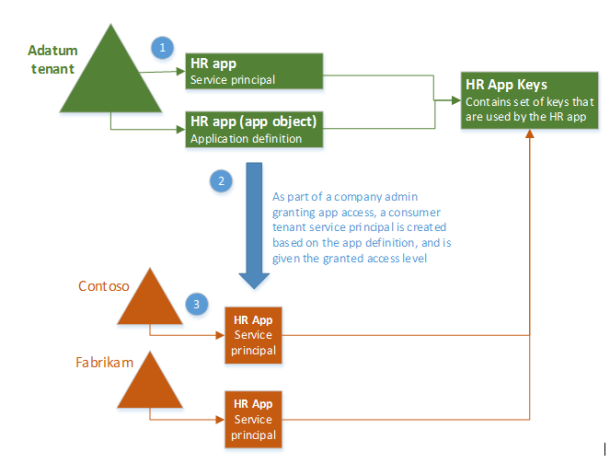

<properties
   pageTitle="应用程序对象和服务主体对象"
   description="介绍 Azure Active Directory 中应用程序对象和 ServicePrincipal 对象之间的关系"
   documentationCenter="dev-center-name"
   authors="msmbaldwin"
   manager="mbaldwin"
   services="active-directory"
   editor=""/>

<tags
   ms.service="active-directory"
   ms.date="09/17/2015"
   wacn.date="11/12/2015"/>

# 应用程序对象和服务主体对象

此图描述了名为 **HR 应用**的示例应用程序上下文中，应用程序对象与服务主体对象对象之间的关系。有三个租户：开发应用程序的租户 **Adatum**，以及使用 **HR 应用**的租户 **Contoso** 和 **Fabrikam**。

当你在 Azure 管理门户中注册某个应用程序时，将在你的目录租户中创建两个对象：

- **应用程序对象**：此对象表示应用程序的定义。可以在下面的**应用程序对象**部分中找到其属性的详细描述。

- **ServicePrincipal 对象**：此对象表示目录租户中的应用实例。你可以向 ServicePrincipal 对象应用策略，包括将权限分配给允许应用读取租户目录数据的服务主体。每当你更改应用程序对象时，所做的更改还会应用到租户中关联的 ServicePrincipal 对象。

> [AZURE.NOTE]如果将应用程序配置为进行外部访问，则在使用者租户删除该访问权限并重新授予访问权限之前，使用者租户的 ServicePrincipal 中不会反映对应用程序所做的更改。
 

在上图中，步骤“1”是创建应用程序对象和 ServicePrincipal 对象的过程。

在步骤 2 中，当公司管理员授予访问权限时，将在公司的 Azure AD 租户中创建一个 ServicePrincipal 对象，并为其分配公司管理员授予的目录访问级别。

在步骤 3 中，应用的每个使用者租户（例如 Contoso 和 Fabrikam）都有自身的、表示应用实例的 ServicePrincipal 对象。在此示例中，每个租户都有表示 HR 应用的 ServicePrincipal。
 

## 应用程序对象属性

下表列出了应用程序对象的所有属性，并包含面向开发人员的重要详细信息。这些属性适用于已注册到 Azure AD 的 Web 应用程序、Web API 和本机客户端应用程序。

 
### 常规

属性 | 说明
| ------------- | ----------- 
| Name | 应用的显示名称。**添加应用程序**向导中的必需属性。
| 徽标 | 表示应用或公司的应用徽标。外部用户可借助此徽标更轻松地将授权请求与应用相关联。上载徽标时，请遵守**上载徽标**向导中的规范。如果你不提供徽标，系统将显示默认徽标。
| 外部访问权限 | 确定是否允许外部组织内的用户授予应用单一登录权限并允许访问其组织目录中的数据。这种控制只会影响授权能力。它不会更改已授予的访问权限。 只有公司管理员可以授予访问权限。
 

### 单一登录
 
属性 | 说明
| ------------- | ----------- 
| 应用 ID URI | 应用程序的唯一逻辑标识符。**添加应用程序**向导中的必需属性。  由于“应用 ID URI”是一个逻辑标识符，因此它不需要解析为 Internet 地址。它是应用在向 Azure AD 发送单一登录请求时提供的。Azure AD 将识别你的应用，并向应用注册期间提供的 Reply URL 发送登录响应（一个 SAML 令牌）。在发出登录请求时，可以使用“应用 ID URI”值来设置 wtrealm 属性（对于 WS-Federation）或 Issuer 属性（对于 SAML-P）。“应用 ID URI”必须是组织 Azure AD 中的唯一值。  注意：在为外部用户启用某个应用程序时，该应用程序的“应用 ID URI”值必须是目录的某个已验证域中的地址。因此，它不能是 URN。这种保护措施可以防止其他组织指定（和使用）属于你的组织的唯一属性。在开发期间，可以将“应用 ID URI”更改为组织初始域中的某个位置（如果尚未验证自定义/无用域），并将应用更新为使用此新值。初始域是注册期间创建的 3 级域，例如 contoso.partner.onmschina.cn。
| 应用 URL | 用户可在其中登录和使用你的应用程序的网页地址。**添加应用**向导中的必需属性。  注意：在“添加应用程序”向导中为此属性设置的值也将设置为“回复 URL”的值。
| 回复 URL | 应用的物理地址。Azure AD 将向此地址发送包含单一登录响应的令牌。在**添加应用程序**向导中首次注册期间，为“应用 URL”设置的值也将设置为“回复 URL”的值。在发出登录请求时，可以使用“回复 URL”值来设置 wreply 属性（对于 WS-Federation）或 **AssertionConsumerServiceURL** 属性（对于 SAML-P）。  注意：为外部用户启用应用程序时，“回复 URL”必须是 **https://** 地址。| 联合元数据 URL |（可选）。表示应用程序的联合元数据文档的实际 URL。必须使用该属性来支持 SAML-P 注销。Azure AD 将下载的元数据文档的此终结点上托管，并使用它来发现用于验证你注销请求和你的应用注销 URL 上的签名的证书的公共部分。当你首次添加你的应用时，不能配置此属性。它可以仅配置更高版本。  **注意：如果你需要支持 SAML-P 注销，但你的应用没有联合身份验证元数据终结点，请与联系客户支持有关其他选项。
 

### 调用 Graph API 或 Web API
 
属性 | 说明
| ------------- | ----------- 
| 客户端 ID | 应用的唯一标识符。需要在对 Graph API 或其他 Web API 向 Azure AD 中注册的调用中使用此标识符。Azure AD 在应用注册过程将自动生成此值并不能更改。  若要启用你的应用能够通过 Graph API 访问（用于读取或写入访问）的目录，你需要客户端 ID 和密钥（在 OAuth 2.0 中称为客户端机密）。应用使用的客户端 ID 和密钥从 Azure AD OAuth 2.0 令牌终结点请求访问令牌。（若要查看所有 Azure AD 终结点，请在命令栏中单击“查看终结点”。） 使用 Graph API 获取或设置（更改）目录数据时，应用将在对 Graph API 发出的请求的授权标头中使用此访问令牌。
| 密钥 | 如果应用在 Azure AD 中读取或写入数据（例如，通过 Graph API 提供的数据），则应用需要一个密钥。当请求访问令牌来调用 Graph API 时，应用将提供其**客户端 ID** 和**密钥**。在颁发访问令牌之前，令牌终结点将使用该 ID 和密钥对你的应用进行身份验证。你可以创建多个密钥来实现密钥滚动更新方案。此外，你可以删除已过期、已泄露或不再使用的密钥。
| 管理访问权限 | 从三个不同的访问级别中选择一个：单一登录 (SSO)、SSO 并读取目录数据，或者 SSO 并读取/写入目录数据。你还可以删除访问权限。<!-- 有关目录访问权限的详细信息，请参阅[应用程序访问级别](/documentation/articles/active-directory-integrating-applications/)。-->   **注意**：对应用的目录访问级别所做的更改只会应用到目录。这些更改不会应用到已授权访问你应用的客户。
 
 
### 本机客户端
 
属性 | 说明
| ------------- | ----------- 
| 重定向 URI | Azure AD 在响应 OAuth 2.0 授权请求时将用户代理重定向到的 URI。该值不需要是物理终结点，但必须是有效的 URI。

 

 
 

<!---HONumber=76-->