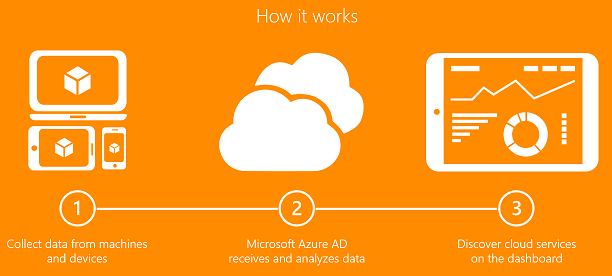

<properties 
	pageTitle="Cloud App Discovery 安全和隐私注意事项" 
	description="本主题介绍与 Cloud App Discovery 相关的安全和隐私注意事项。" 
	services="active-directory" 
	documentationCenter="" 
	authors="markusvi" 
	manager="swadhwa" 
	editor="lisatoft"/>

<tags 
	ms.service="active-directory" 
	ms.date="07/23/2015" 
	wacn.date="08/29/2015"/>

# Cloud App Discovery 安全和隐私注意事项

Microsoft 致力于保护你的隐私和数据，同时交付可帮助你管理所在组织的安全性的软件和服务。 我们意识到当你将你的数据委托给他人时，需要严谨的安全工程投资和专业技能来支持此类委托。Microsoft 遵守从安全软件开发生命周期实践到运营服务的严格的符合性和安全指南。 保护数据是 Microsoft 的重中之重。

本主题介绍如何在 Azure Active Directory Cloud App Discovery 中收集、处理和保护数据

##概述

Cloud App Discovery 是 Azure AD 的一项功能，托管在 Windows Azure 中。 Cloud App Discovery 终结点代理用于收集 IT 托管计算机的应用程序发现数据。 收集到的数据通过加密通道安全传送到 Azure AD Cloud App Discovery 服务。 然后即可在 Azure 门户中查看组织的 Cloud App Discovery 数据。

以下章节遵循信息流，介绍它在从你的组织移动到 Cloud App Discovery 服务，最终到达 Cloud App Discovery 门户的过程中是如何受到保护的。

## 从你的组织中收集数据

要使用 Azure Active Directory 的 Cloud App discovery 功能来深入了解你所在组织的员工使用的应用程序，你需要首先将 Azure AD Cloud App Discovery 终结点代理部署到你组织的计算机中。

Azure Active Directory 租户（或其代理）的管理员可从 Azure 门户下载代理安装包。代理可手动安装，也可使用 SCCM 或组策略跨组织中的多个计算机进行安装。

有关部署选项的进一步说明，请参阅[Cloud App Discovery 组策略部署指南](http://social.technet.microsoft.com/wiki/contents/articles/30965.cloud-app-discovery-group-policy-deployment-guide.aspx)。

### 代理收集的数据

下表中所列信息是由代理在连接到 Web 应用程序时收集的。仅针对管理员已为应用程序发现配置的应用程序收集此信息。 可在“设置”选项卡下的门户中配置你选择要为其收集元数据的应用程序的列表。

> [AZURE.NOTE]有关详细信息，请参阅 [Cloud App Discovery 入门](http://social.technet.microsoft.com/wiki/contents/articles/30962.getting-started-with-cloud-app-discovery.aspx)
 
**信息类别**：用户信息   **描述**： 向目标 Web 应用程序发出请求的进程的 Windows 用户名称（如 DOMAIN\\username）以及用户的 Windows 安全标识符 (SID)。

**信息类别**：进程信息   **描述**： 进程名称，该进程向目标 Web 应用程序（如“iexplore.exe”）发出请求

**信息类别**：计算机信息   **描述**： 代理安装位置的计算机 NetBIOS 名称。

**信息类别**：应用流量信息   **描述**： 

以下连接信息：

- 源（本地计算机）及目标 IP 地址和端口号 

- 转出请求所经过的组织的公用 IP 地址。

- 请求的时间

- 流量发送和接收的量

- IP 版本（4 或 6）

- 仅针对 TLS 连接：来自服务器名称指示扩展或服务器证书的目标主机名称。

以下 HTTP 信息：

- 方法（GET、POST 等） 

- 协议（(HTTP/1.1 等）

- 用户代理字符串

- 主机名

- 目标 URI（不包括查询字符串）

- 内容类型信息

- 引用 URL 信息（不包括查询字符串）

> [AZURE.NOTE]以上 HTTP 信息针对所有非加密连接进行收集。对于 TLS 连接，只有在门户中打开“深度检测”设置时才捕获此信息。默认情况下设置为“ON”。有关详细信息，请参阅 [Cloud App Discovery 入门](http://social.technet.microsoft.com/wiki/contents/articles/30962.getting-started-with-cloud-app-discovery.aspx)
 

 
### 代理的工作原理

代理安装包括两个组件：

- 用户模式组件

- 内核模式驱动程序组件（Windows 筛选平台驱动程序）

首次安装代理时，它会在计算机上存储一个特定于计算机的可信证书，它随后使用此证书来建立与 Cloud App Discovery 服务的安全连接。 代理定期从 Cloud App Discovery 服务中检索经由此安全连接的策略配置。 该策略包括要监视的云应用程序以及是否应启用自动更新等相关信息。

当计算机上发送和接收 Web 流量时，Cloud App Discovery 会分析流量并提取相关元数据（请参见上表）。 代理每隔一分钟即将收集到的元数据通过加密通道上载到 Cloud App Discovery 服务。

对于加密连接，需要执行额外的步骤以增加所收集的数据的准确性。  这称为深度检测。 驱动程序组件拦截加密流量并将其自身插入到加密流中。为此，它在计算机上创建自签名的根证书，使客户端应用程序信任 Cloud App Discovery 代理。此自签名的根证书标记为“非可导出”且允许管理员访问 ACL。这样做的目的是不离开创建它的计算机。

### 尊重用户隐私

我们的目标是为管理员提供相应工具，以达到详细了解应用程序使用情况和用户在其组织中恰当的隐私之间的平衡。为此，我们在该门户的设置页中提供以下设置：

- **数据收集**：管理员可选择指定要在其上获取发现数据的应用程序或应用程序类别。

- **深度检测**：管理员可选择指定代理是否收集 SSL/TLS 连接的 HTTP 流量。

Cloud App Discovery 终结点代理仅收集上表中所述的信息。

> [AZURE.NOTE]有关详细信息，请参阅 [Cloud App Discovery 入门](http://social.technet.microsoft.com/wiki/contents/articles/30962.getting-started-with-cloud-app-discovery.aspx)
 

## 发送数据到 Cloud App Discovery

代理收集元数据后，元数据在计算机上最多缓存一分钟，或直到缓存数据达到 5MB。随后元数据被压缩，经由安全连接发送到 Cloud App Discovery 服务。

如果代理因故无法与 Cloud App Discovery 服务通信，收集到的元数据将保存在仅可由此计算机上获得特权的用户（如管理员组）访问的本地文件缓存中。 代理会自动尝试重新发送已缓存元数据，直到 Cloud App Discovery 服务成功接收元数据。

## 在服务端接收数据

代理使用以上引用的特定于计算机的客户端身份验证证书向 Cloud App Discovery 服务进行身份验证，并通过加密通道传送数据。 Cloud App Discovery 服务的分析管道单独处理每个客户的元数据，方法是通过分析管道的所有阶段对其进行逻辑分割。经过分析的元数据生成门户中的不同报告。

未处理的元数据和经过分析的元数据可最多存储 180 天。此外，客户可选择性地捕获所选的 Azure Blob 存储帐户中经过分析的元数据。这有助于脱机分析元数据以及更长时间保存数据。

## 使用 Azure 门户访问数据

为了保证收集的元数据的安全性，默认情况下，仅租户的全局管理员可访问 Azure 门户中的 Cloud App Discovery 功能。 但是，管理员可以选择将此访问权授予其他用户或组。

> [AZURE.NOTE]有关详细信息，请参阅 [Cloud App Discovery 入门](http://social.technet.microsoft.com/wiki/contents/articles/30962.getting-started-with-cloud-app-discovery.aspx)
 

在门户中访问数据的任何用户都必须获得 Azure AD Premium 许可证的许可。

**其他资源**

* [我如何发现我的组织内使用的未经认可的云应用](/documentation/articles/active-directory-cloudappdiscovery-whatis) 

<!---HONumber=67-->