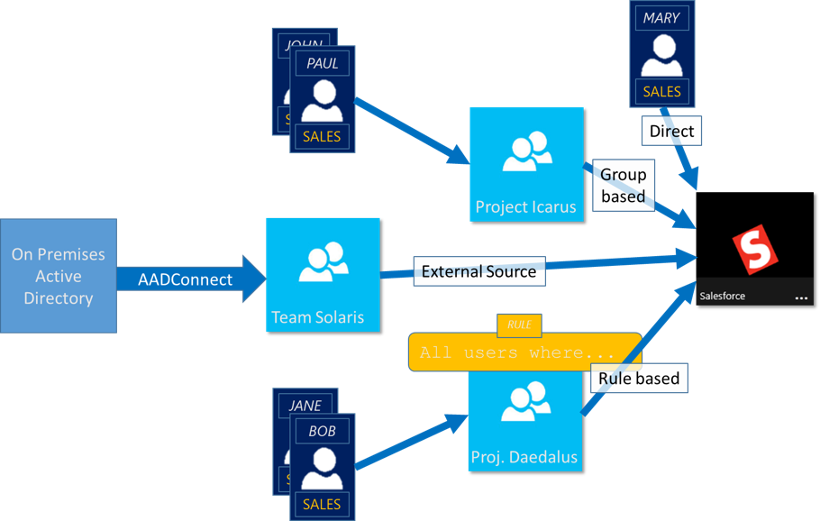
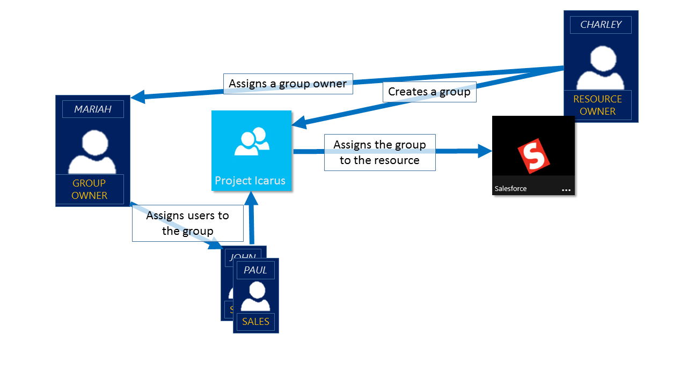

<properties 
	pageTitle="使用 Azure Active Directory 组管理对资源的访问 | Microsoft Azure" 
	description="如何在 Azure Active Directory 中使用组来管理对本地和云应用程序与资源的访问。"
	services="active-directory" 
	documentationCenter="" 
	authors="curtand"
	manager="stevenpo"
	editor=""/>

<tags 
	ms.service="active-directory" 
	ms.date="02/09/2016"
	wacn.date="05/13/2016" />

# 使用 Azure Active Directory 组管理对资源的访问

Azure Active Directory (Azure AD) 是综合性的标识和访问管理解决方案，它提供一套稳健的功能来管理对本地和云应用程序及资源（包括诸如 Office 365 的 Microsoft 联机服务和众多非 Microsoft SaaS 应用程序）的安全访问。

> [AZURE.NOTE] 若要使用 Azure Active Directory，你需要一个 Azure 帐户。如果你没有帐户，可以[注册免费的 Azure 帐户](/pricing/free-trial/)。

Azure Active Directory 的主要功能之一是管理对资源的访问。这些资源可以是目录的一部分（例如，用于通过目录中的角色管理对象的权限）、目录外部的资源（例如 SaaS 应用程序、Azure 服务以及 SharePoint 站点）或者本地资源。可通过 4 种方式向用户分配资源访问权限：

1.直接分配

资源的所有者可以直接向用户分配对该资源的访问权限。

2.组成员身份

资源所有者可以向组分配资源访问权限，这会向该组的成员授予资源访问权限。然后，组的所有者可以管理该组的成员身份。实际上，资源所有者是将其资源的用户访问权限委派给了组的所有者。

3.基于规则

资源所有者可以使用规则来表明应向哪些用户分配资源访问权限。规则的结果取决于规则中使用的属性，以及针对特定用户的值。通过这种方式，资源所有者实际上是根据规则中所用的属性，将其资源的管理访问权限委派给了权威来源。请注意，资源所有者仍可管理规则本身，并确定哪些属性与值提供其资源的访问权限。

4.外部机构

对资源的访问权限派生自外部来源，例如，从权威来源（如本地目录或 WorkDay 等 SaaS 应用）同步的组。资源所有者分配组以提供资源访问权限，外部来源管理组的成员。

  

### 观看演示访问管理的视频

观看一段详细演示访问管理的简短视频：

[Azure AD：组的动态成员资格简介](https://channel9.msdn.com/Series/Azure-Active-Directory-Videos-Demos/Azure-AD--Introduction-to-Dynamic-Memberships-for-Groups)

##访问管理在 Azure Active Directory 中如何工作？
Azure Active Directory 访问管理解决方案的核心是安全组。使用安全组管理资源访问权限是众所周知的模式，这样就能以弹性且易于理解的方式针对目标用户组提供资源访问权限。资源所有者（或目录管理员）可以分配组，以提供对其拥有的资源的特定访问权限。组的成员将获取访问权限，而资源所有者可将组成员列表管理权限委派给其他人 – 例如部门经理或技术服务管理员。

组的所有者也可以让该组发出自助请求。这样，最终用户就可以搜索和查找组并发出加入请求，有效地寻求权限以访问通过组所管理的资源。组的所有者可以设置组，以便自动批准加入请求，或者要求组的所有者批准。当用户发出加入组的请求时，加入请求转发到组的所有者。如果某个所有者批准了该请求，则发出请求的用户将收到通知并加入该组。如果某个所有者拒绝了该请求，则发出请求的用户将收到通知，但不会加入该组。

## 访问管理入门
已准备就绪？ 你可以尝试一些可以使用 Azure AD 组完成的基本任务。使用这些功能可向不同的人员组提供对组织中不同资源的特定访问权限。下面是基本的首要步骤列表。

* [使用 Azure AD Connect 将本地组同步到 Azure](/documentation/articles/active-directory-aadconnect)

## 访问管理的后续步骤
了解访问管理的基本概念后，请继续学习 Azure Active Directory 中用于管理应用程序和资源访问权限的其他高级功能。

## 了解详细信息
这些文章提供了有关 Azure Active Directory 的更多信息。

* [什么是 Azure Active Directory？](/documentation/articles/active-directory-whatis)

* [将本地标识与 Azure Active Directory 集成](/documentation/articles/active-directory-aadconnect)

* [适用于组的图形 API 参考](https://msdn.microsoft.com/Library/Azure/Ad/Graph/api/groups-operations#GroupFunctions)

<!---HONumber=Mooncake_0418_2016-->