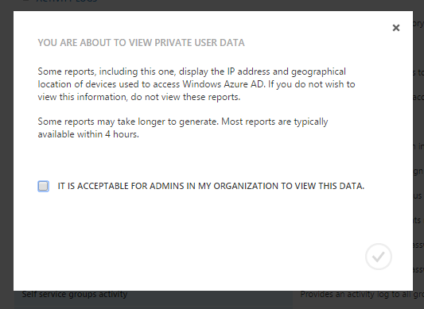
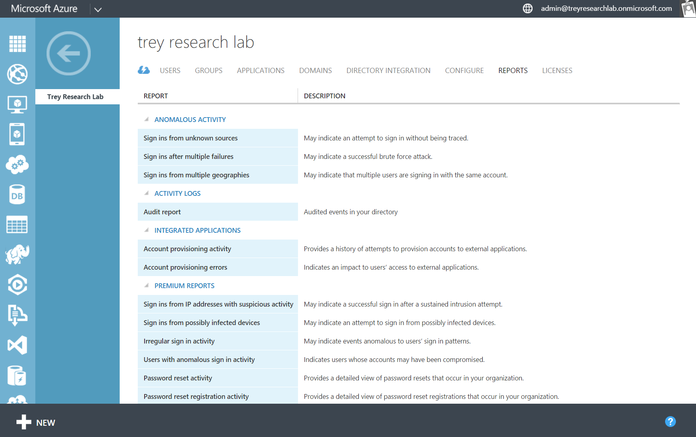
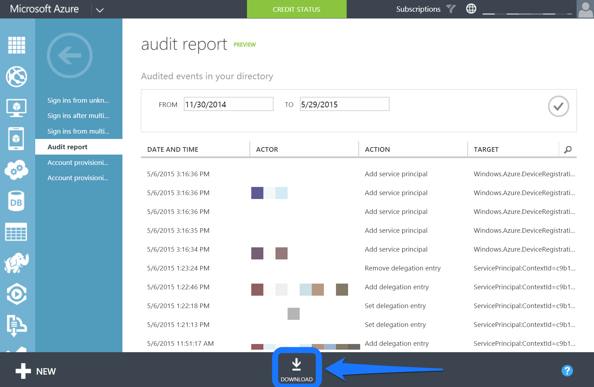
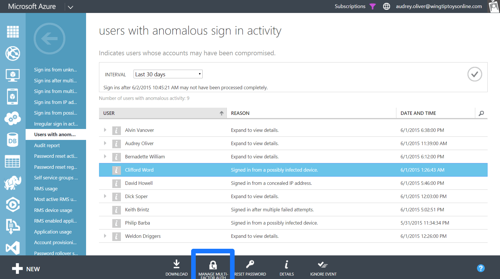

<properties
   pageTitle="Azure AD Reporting：入门"
   description="Azure AD Reporting：入门"
   services="active-directory"
   documentationCenter=""
   authors="curtand"
   manager="mbaldwin"
   editor=""/>

<tags
   ms.service="active-directory"
   ms.date="06/30/2015"
   wacn.date="08/29/2015"/>

# Azure AD Reporting 入门

## 作用

Azure Active Directory 包括针对目录的安全报表、活动报表和审核报表。下面是包含的报表列表：

### 安全报表

- 从未知源登录
- 多次失败后的登录
- 从多个地理区域登录
- 从具有可疑活动的 IP 地址登录
- 异常登录活动
- 从可能受感染的设备登录
- 具有异常登录活动的用户

### 活动报表

- 应用程序使用情况：摘要
- 应用程序使用情况：详细信息
- 应用程序仪表板
- 帐户设置错误
- 单个用户设备
- 单个用户活动
- 组活动报表
- 密码重置注册活动报表
- 密码重置活动

### 审核报表

- 目录审核报表

> [AZURE.TIP]有关 Azure AD Reporting 的更多文档，请签出[查看访问和使用情况报表](/documentation/articles/active-directory-view-access-usage-reports)。

## 工作原理

### 报告管道

报告管道包含三个主要步骤。每当用户登录或进行身份验证时，都将发生下列情况：

- 首先，对用户进行身份验证（成功或失败），相关结果会存储在 Azure Active Directory 服务数据库中。
- 定期处理所有最近的登录。此时，安全和异常活动算法将搜索所有最近登录中的可疑活动。
- 处理后，通过 Azure 管理门户编写和缓存报表，并提供相关服务。

### 报表生成时间

由于大量身份验证和登录都是通过 Azure AD 平台进行处理的，因此，处理的最近登录为平均 1 小时内的登录。在极少数情况下，处理最近的登录可能需要 8 小时时间。

你可以通过检查每个报表顶部的帮助文本来查找最近处理的登录。

> [AZURE.TIP]有关 Azure AD Reporting 的更多文档，请签出[查看访问和使用情况报表](/documentation/articles/active-directory-view-access-usage-reports)。

## 入门

### 登录到 Azure 管理门户

首先，你需要以全局管理员或合规性管理员身份登录到 [Azure 管理门户](https://manage.windowsazure.cn)。此外，你还必须是 Azure 订阅服务管理员或共同管理员，或正在使用“访问 Azure AD”的 Azure 订阅。

### 导航到报表

要查看报表，请导航到目录顶部的“报表”选项卡。

如果你是首次查看报表，则将需要先同意对话框中的内容才可查看报表。这是为了确保你组织内的管理员可以查看此数据，某些国家/地区可能将此数据视为私人信息。

### 浏览每个报表

导航到每个报表以查看所收集的数据和处理的登录。可在[此处](/documentation/articles/active-directory-reporting-what-it-is)查看所有报表的列表。

### 将报表下载为 CSV 文件

每个报表都可以下载为 CSV（逗号分隔值）文件。你可以在 Excel、PowerBI 或第三方分析程序中使用这些文件进一步分析你的数据。

若要将任何报表下载为 CSV 文件，请导航到报表并单击底部的“下载”。

> [AZURE.TIP]有关 Azure AD Reporting 的更多文档，请签出[查看访问和使用情况报表](/documentation/articles/active-directory-view-access-usage-reports)。

## 后续步骤

### 针对异常登录活动自定义警报

导航到目录的“配置”选项卡。

滚动到“通知”部分。

启用或禁用“异常登录电子邮件通知"部分。

### 与 Azure AD Reporting API 集成

请参阅 [Reporting API 入门](/documentation/articles/active-directory-reporting-api-getting-started)。

### 对用户使用 Multi-Factor Authentication

在报表中选择一个用户。

单击屏幕底部的“启用 MFA”按钮。

> [AZURE.TIP]有关 Azure AD Reporting 的更多文档，请签出[查看访问和使用情况报表](/documentation/articles/active-directory-view-access-usage-reports)。

## 了解详细信息

### 审核事件

了解 [Azure Active Directory Reporting 审核事件](/documentation/articles/active-directory-reporting-audit-events)目录中要审核的事件。

### API 集成

请参阅 [Reporting API 入门](/documentation/articles/active-directory-reporting-api-getting-started)和 [API 参考文档](https://msdn.microsoft.com/zh-cn/library/azure/mt126081.aspx)。

### 联系方式

如有反馈或任何疑问，或者需要获取帮助，请发送电子邮件至 [aadreportinghelp@microsoft.com](mailto:aadreportinghelp@microsoft.com)！

> [AZURE.TIP]有关 Azure AD Reporting 的更多文档，请签出[查看访问和使用情况报表](/documentation/articles/active-directory-view-access-usage-reports)。

<!---HONumber=67-->