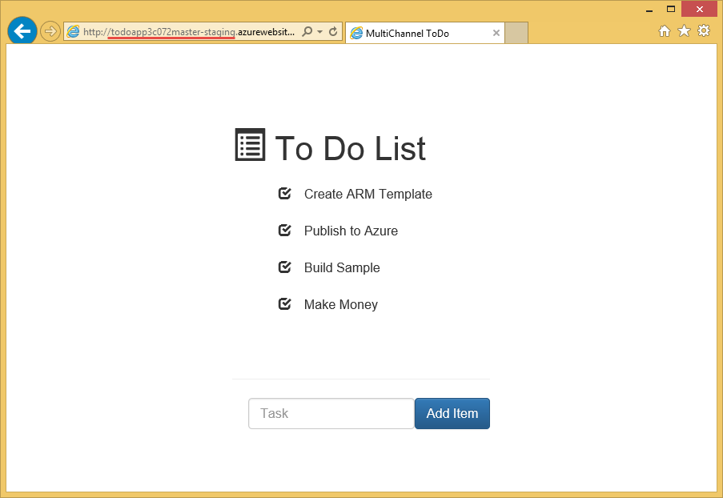

<properties
	pageTitle="使用 Azure Web 应用进行灵便软件开发"
	description="学习如何使用支持灵便软件开发的方式，通过 Azure Web 应用创建高缩放性的复杂应用程序。"
	services="app-service"
	documentationCenter=""
	authors="cephalin"
	manager="wpickett"
	editor=""/>

<tags
	ms.service="app-service"
	ms.date="10/16/2015"
	wacn.date="02/17/2016"/>

# 使用 Azure Web 应用进行灵便软件开发 #

在本教程中，你将学习如何使用支持[灵便软件开发](https://en.wikipedia.org/wiki/Agile_software_development)的方式，通过 [Azure Web 应用](/home/features/web-site/)创建高缩放性的复杂应用程序。

技术流程限制通常会妨碍成功的实施灵便方法。如果在 [Azure 资源管理器](/documentation/articles/resource-group-overview)中合理地结合了部署的协调与管理，则具有[连续发布](/documentation/articles/web-sites-publish-source-control)、[过渡环境](/documentation/articles/web-sites-staged-publishing)（槽）和[监视](/documentation/articles/web-sites-monitor)等功能的 Azure Web 应用是非常适合采用灵便软件开发的开发人员的解决方案。

下表是灵便开发的相关要求以及 Azure 服务如何启用它们的简短列表。

| 要求 | Azure 如何实现 |
|---------------------------------------------------------------|--------------------------------------------------------------------------------------------------------------------------------------------------------------------------------------------------------------------------|
| - 将构建版本设为自我测试 | 负载测试、Web 测试等可以使用 Azure 资源管理器模板进行部署。|
| - 在生产环境的复本中运行测试 | Azure 资源管理器模板可以用来创建 Azure 生产环境的复本（包括应用设置、连接字符串模板、缩放等）以通过快速且可预测的方式测试。|

## 执行的操作 ##

你将逐步执行典型的“开发-测试-过渡-生产”工作流，以将新更改发布到 [ToDoApp](https://github.com/azure-appservice-samples/ToDoApp) 示例应用程序（包含两个[ Web 应用](/home/features/web-site/)：一个是前端 (FE)，另一个是 Web API 后端 (BE)）和 [SQL 数据库](/home/features/sql-database/)。将按如下所示使用部署体系结构：

将图片放入文字：

-	部署体系结构分成三个不同的环境（或 Azure 中的[资源组](/documentation/articles/resource-group-overview)），各有其自身的 App Service 计划、[缩放](/documentation/articles/web-sites-scale)设置和 SQL 数据库。 
-	你可以单独管理每个环境。它们甚至可以存在于不同的订阅中。
-	过渡和生产环境实现为相同 Web 应用应用的两个槽。
-	在过渡槽（包含生产数据）上验证主分支的提交时，已验证的过渡应用将交换到生产槽，且[不会造成停机](/documentation/articles/web-sites-staged-publishing)。

生产和过渡环境由 [*&lt;repository\_root>*/ARMTemplates/ProdandStage.json](https://github.com/azure-appservice-samples/ToDoApp/blob/master/ARMTemplates/ProdAndStage.json) 中的模板定义。

开发和测试环境由 [*&lt;repository\_root>*/ARMTemplates/Dev.json](https://github.com/azure-appservice-samples/ToDoApp/blob/master/ARMTemplates/Dev.json) 中的模板定义。

你还要使用典型分支策略，其中，代码从开发分支移到测试分支，然后移到主分支（所谓的质量提升）。

## 所需的项目 ##

-	一个 Azure 帐户
-	一个 [GitHub](https://github.com/) 帐户
-	Git Shell（与 [GitHub for Windows](https://windows.github.com/) 一起安装）- 可让你在相同的会话中运行 Git 和 PowerShell 命令 
-	最新的 [Azure PowerShell](https://github.com/Azure/azure-powershell/releases/download/0.9.4-June2015/azure-powershell.0.9.4.msi) 软件
	
	>[AZURE.NOTE] 如果使用的是 Auzre PowerShell 1.0 或更高版本，需要对“deploy.ps1”进行大量修改。

	> 1. 需要删除所有 `Switch-AzureMode` 命令。
	> 2. 将 `Get-AzureResource` 替换为 `Get-AzureRmResource`，并删除 `-OutputObjectFormat` 参数
	> 3. 将 `New-AzureResourceGroup` 解构为 `New-AzureRmResourceGroup` 和 `New-AzureRmResourceGroupDeployment`，例如 `New-AzureRmResourceGroup -Name $RG_Name -Location $RG_Location` 和 `New-AzureRmResourceGroupDeployment -Verbose -name $RG_Name -ResourceGroupName $RG_Name -TemplateFile ".\$TemplateFile" -TemplateParameterFile ".\temp.json" -ErrorAction Stop`

-	基本了解以下知识：
	-	[Azure 资源管理器](/documentation/articles/resource-group-overview)模板部署
	-	[Git](http://git-scm.com/documentation)
	-	[PowerShell](https://technet.microsoft.com/zh-cn/library/bb978526.aspx)

> [AZURE.NOTE] 完成本教程需要有一个 Azure 帐户：
> + 你可以[建立一个试用 Azure 帐户](/pricing/1rmb-trial/) - 获取可用来试用付费版 Azure 服务的信用额度，甚至在用完信用额度后，你仍可以保留帐户和使用免费的 Azure 服务（如 Web 应用）。

## 设置生产环境 ##

在典型的 DevOps 方案中，应用程序在 Azure 中实时运行，并且你可以对它进行更改。此方案将会提供你开发、测试和使用的模板来部署生产环境。本部分将介绍如何设置生产环境。

1.	创建 [ToDoApp](https://github.com/azure-appservice-samples/ToDoApp) 存储库的专属分叉。有关创建分叉的信息，请参阅[分叉存储库](https://help.github.com/articles/fork-a-repo/)。创建分叉后，可以在浏览器中查看它。
 
	

2.	打开 Git Shell 会话。如果你还没有 Git Shell，请立即安装 [GitHub for Windows](https://windows.github.com/)。

3.	通过执行以下命令创建分叉的本地复本：

		git clone https://github.com/<your_fork>/ToDoApp.git 

4.	创建本地复本后，请导航到 *&lt;repository\_root>*\\ARMTemplates 并运行 deploy.ps1 脚本，如下所示：

		.\deploy.ps1 -RepoUrl https://github.com/<your_fork>/todoapp.git

	>[AZURE.NOTE] 在使用这些模板之前，你需要进行以下编辑，以适应 Azure 中国区的云环境：

	> 1. 打开文件“ProdAndStage.json”，然后搜索“sourcecontrols”。
	> 2. 在块和 fater `"branch": "[parameters('branch')]"` 中添加 `"IsManualIntegration": true`
	> 3. 在“ProdAndStage.json”和“deploy.ps1”中，将“West US”或“East US”替换为“China East”或“China North”

	> 由于 Ibiza 门户尚未在 Microsoft Azure 中国区推出，因此我们无法设置 GitHub 凭据。

4.	出现提示时，键入所需的用户名和密码来访问数据库。

	你应会看到各种 Azure 资源的设置进度。部署完成后，脚本将在浏览器中启动应用程序，并发出友好的提示音。

	
 
	>[AZURE.TIP] 查看 *&lt;repository\_root>*\\ARMTemplates\\Deploy.ps1，以了解它如何生成具有唯一 ID 的资源。可以使用相同的方法来创建相同部署的复本，而不必担心资源名称冲突。
 
6.	返回 Git Shell 会话，运行：

		.\swap -Name ToDoApp<unique_string>master

	

	>[AZURE.NOTE] 对于 Azure PowerShell 1.0 和更高版本，请删除“swap.ps1”中的所有 `Switch-AzureMode` 命令。

7.	脚本完成后，请返回浏览到前端的地址 (http://ToDoApp*&lt;unique_string>*master.chinacloudsites.cn/)，以查看在生产环境中运行的应用程序。
 
5.	登录到 [Azure 管理门户](https://manage.windowsazure.cn/)并查看创建的内容。

	你应该可以看到两个 Web 应用，其中一个 Web 应用的名称包含 `Api` 后缀。你还会看到 SQL 数据库和服务器、App Service 计划，以及 Web 应用的过渡槽。浏览不同的资源，并将它们与 *&lt;repository\_root>*\\ARMTemplates\\ProdAndStage.json 进行比较，以查看它们在模板中的配置方式。

你现在已经设置了生产环境。接下来，将要开始更新应用程序。

## 创建开发和测试分支 ##

现在，你已在 Azure 的生产环境中创建了一个复杂应用程序，接下来，你要使用灵便方法来更新应用程序。在本部分中，你将要创建需要进行必要更新的开发和测试分支。

1.	首先创建测试环境。在 Git Shell 会话中，运行以下命令来创建名为 **NewUpdate** 的新分支的环境。 

		git checkout -b NewUpdate
		git push origin NewUpdate 
		.\deploy.ps1 -TemplateFile .\Dev.json -RepoUrl https://github.com/<your_fork>/ToDoApp.git -Branch NewUpdate

	>[AZURE.NOTE] 应该对“Dev.json”进行相同的修改，就像你对“ProdAndStage.json”所做的修改一样

1.	出现提示时，键入所需的用户名和密码来访问数据库。

	部署完成后，脚本将在浏览器中启动应用程序，并发出友好的提示音。这时，你已创建了带有自身测试环境的新分支。请花点时间来了解有关此测试环境的一些要点：

	-	你可以在任何 Azure 订阅中创建测试环境。这意味着，你可以分开管理生产环境和测试环境。
	-	测试环境在 Azure 中实时运行。
	-	测试环境类似于生产环境，差别在于过渡槽和缩放设置。因为这是 ProdandStage.json 与 Dev.json 之间的唯一差别，所以你可以得知这项信息。
	-	你可以在其自身 App Service 计划与不同的价格层（例如**免费**）中管理测试环境。
	-	删除这个测试环境就像删除资源组一样简单。[稍后](#delete)你将学习如何执行这项操作。

2.	运行以下命令，以继续创建开发分支：

		git checkout -b Dev
		git push origin Dev
		.\deploy.ps1 -TemplateFile .\Dev.json -RepoUrl https://github.com/<your_fork>/ToDoApp.git -Branch Dev

3.	出现提示时，键入所需的用户名和密码来访问数据库。

	请花点时间来了解有关此开发环境的一些要点：

	-	开发环境的配置与测试环境相同，因为它是使用相同模板部署的。
	-	在开发人员自己的 Azure 订阅中，可以创建每个开发环境，但分开管理测试环境。
	-	开发环境在 Azure 中实时运行。
	-	删除开发环境就像删除资源组一样简单。[稍后](#delete)你将学习如何执行这项操作。

>[AZURE.NOTE] 有多位开发人员处理新的更新时，只要执行以下操作，每一位都可以轻松创建分支和专用开发环境：
>
>1.	在 GitHub 中创建其在存储库中的专属分叉（请参阅[分叉存储库](https://help.github.com/articles/fork-a-repo/)）。
>2.	克隆其本地计算机上的分叉
>3.	运行相同的命令，以创建其自身的开发分支和环境。

完成后，GitHub 分叉应有三个分支：

[Azure 管理门户](https://manage.windowsazure.cn)中应该有六个 Web 应用（一共三组，每组两个 Web 应用）：
 
>[AZURE.NOTE] 请注意，ProdandStage.json 将生产环境指定为使用**标准**定价层，这适合生产应用程序的缩放性。

## 将代码合并到测试环境 ##

准备好将代码从 Dev 分支推送到 NewUpdate 分支后，请执行标准的 git 过程：

1.	在 GitHub 中，将 NewUpdate 的任何新提交（例如其他开发人员所创建的提交）合并到 Dev 分支。GitHub 上的任何新提交都会在开发环境中触发代码推送和构建。然后可以确保开发分支中的代码仍能与 NewUpdate 分支中的最新位一起运行。

2.	在 GitHub 中，将所有新提交从 Dev 分支合并到 NewUpdate 分支。此操作将在测试环境中触发代码推送和构建。

现在，请将你的代码推送到 **NewUpdate** 分支。在 Git Shell 中运行以下命令：

	git checkout NewUpdate
	git pull origin NewUpdate
	git merge Dev
	git push origin NewUpdate

就这么简单！

转到测试环境的 Web 应用边栏选项卡，以查看新提交是否已推送到测试环境（合并到 NewUpdate 分支）。然后，单击“浏览”查看样式更改是否在 Azure 中实时运行。

## 将更新部署到生产环境 ##

将代码推送到过渡和生产环境的过程类似于前面将代码所推送到测试环境。真的就这么简单。

在 Git Shell 中运行以下命令：

	git checkout master
	git pull origin master
	git merge NewUpdate
	git push origin master

请记住，根据在 ProdandStage.json 中设置过渡和生产环境的方式，新代码将推送到“过渡”槽，并在该处运行。因此，如果你导航到过渡槽的 URL，则会看到新代码正在该处运行。为此，请在 Git Shell 中运行 `Show-AzureWebsite` cmdlet。

	Show-AzureWebsite -Name ToDoApp<unique_string>master -Slot Staging
 
现在，在过渡槽中验证更新之后，唯一要做的就是将它交换到生产环境。在 Git Shell 中，只要运行以下命令：

	cd <repository_root>\ARMTemplates
	.\swap.ps1 -Name ToDoApp<unique_string>master

祝贺你！ 你已成功地将新的更新发布到生产 Web 应用。不仅如此，完成的方式也只是轻松地创建开发和测试环境，以及构建和测试每项提交。这些是灵便软件开发的重要构建块。

## 删除开发和测试环境 ##

由于你特意将开发和测试环境构建为独立的资源组，因此可以很容易删除它们。若要删除你在本教程中创建的环境（GitHub 分支和 Azure 项目），只需在 Git Shell 中运行以下命令：

	git branch -d Dev
	git push origin :Dev
	git branch -d NewUpdate
	git push origin :NewUpdate
	Remove-AzureRmResourceGroup -Name ToDoApp<unique_string>dev-group -Force -Verbose
	Remove-AzureRmResourceGroup -Name ToDoApp<unique_string>newupdate-group -Force -Verbose

## 摘要 ##

对于许多想要采用 Azure 作为其应用程序平台的公司而言，灵便软件开发是必不可少的。在本教程中，你已学习如何轻松创建和删除生产环境的确切副本或近似副本，即使对于复杂应用程序也是一样。你还学习了如何利用此功能创建开发过程，以便在 Azure 中构建和测试每项提交。本教程旨在演示如何最恰当地将 Azure Web 应用和 Azure 资源管理器配合使用，以创建提供灵便方法的 DevOps 解决方案。接下来，你可以通过执行高级 DevOps 技术，基于此方案生成项目。

## 更多资源 ##

-	[灵便开发实践：有关现代化开发周期的提示和技巧](http://channel9.msdn.com/Events/Ignite/2015/BRK3707)
-	[使用资源管理器模板为 Azure Web 应用制定高级部署策略](http://channel9.msdn.com/Events/Build/2015/2-620)
-	[创作 Azure 资源管理器模板](/documentation/articles/resource-group-authoring-templates)
-	[JSONLint – JSON 验证程序](http://jsonlint.com/)
-	[ARMClient - 设置从 GitHub 到站点的发布](https://github.com/projectKudu/ARMClient/wiki/Setup-GitHub-publishing-to-Site)
-	[Git 分支 - 基本分支和合并](http://www.git-scm.com/book/en/v2/Git-Branching-Basic-Branching-and-Merging)
-	[David Ebbo 的博客](http://blog.davidebbo.com/)
-	[Azure PowerShell](/documentation/articles/powershell-install-configure)
-	[Azure 跨平台命令行工具](/documentation/articles/xplat-cli-install)
-	[在 Azure AD 中创建或编辑用户](https://msdn.microsoft.com/zh-cn/library/azure/hh967632.aspx#BKMK_1)

<!---HONumber=Mooncake_0118_2016-->