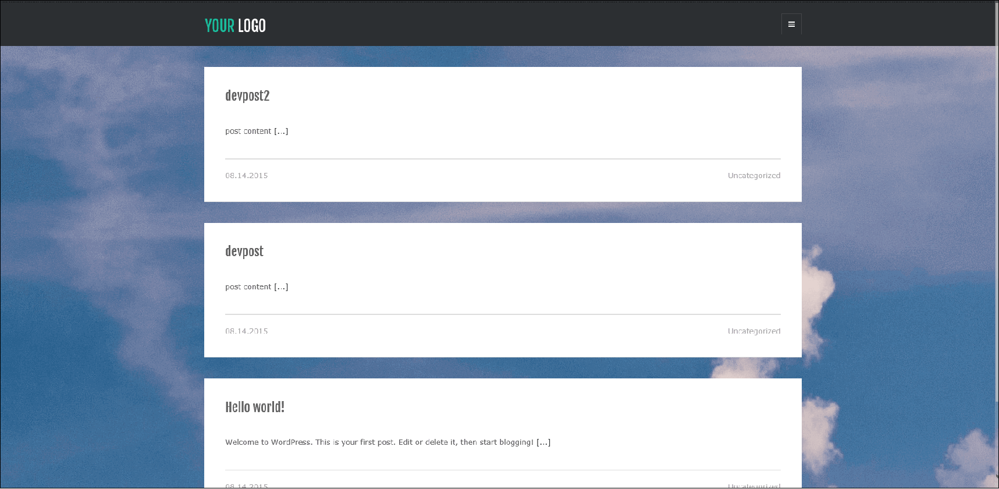
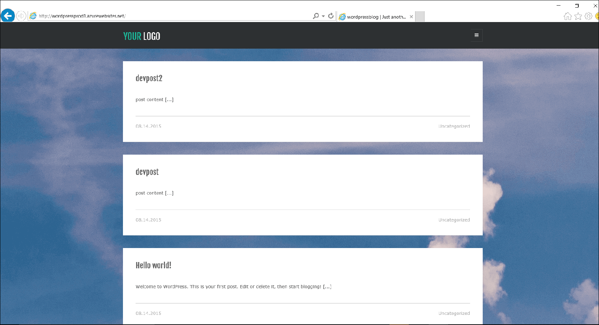

<properties
   pageTitle="对 Web 应用有效使用 DevOps 环境"
   description="了解如何使用部署槽来设置和管理应用程序的多个开发环境"
   services="app-service\web"
   documentationCenter=""
   authors="sunbuild"
   manager="yochayk"
   editor=""/>

<tags
	ms.service="app-service"
	ms.date="02/26/2016"
	wacn.date="05/24/2016"/>

# 对 Web 应用有效使用 DevOps 环境

本文说明如何针对应用程序的多个版本（例如开发、过渡、QA 和生产）来设置和管理 Web 应用程序部署。应用程序的每个版本可被视为满足部署过程特定需求的开发环境，例如，开发团队可以使用 QA 环境来测试应用程序的质量，然后将更改推送到生产环境。
设置多个开发环境可能是具挑战性的任务，因为需要在这些环境之间跟踪、管理资源（计算、Web 应用程序、数据库、缓存等），以及在不同的环境之间部署内容。

## 设置非生产环境（过渡、开发、QA）
生产 Web 应用启动并运行之后，下一步是创建非生产环境。为了使用部署槽，请确保你在**标准** App Service 计划模式下运行。部署槽实际上是具有自身主机名的实时 Web 应用。两个部署槽（包括生产槽）之间的 Web 应用内容与配置元素可以交换。将应用程序部署到部署槽具有以下优点：

1. 你可以在分阶段部署槽中验证 Web 应用更改，然后将其与生产槽交换。
2. 首先将 Web 应用部署到槽，然后将其交换到生产，这确保槽的所有实例都预热，然后交换到生产。部署你的 Web 应用时，这消除了停机时间。流量重定向是无缝的，且不会因交换操作而删除任何请求。 
3. 交换后，具有以前分阶段 Web 应用的槽现在具有以前的生产 Web 应用。如果交换到生产槽的更改与你的预期不同，你可以立即执行同一交换来收回“上一已知的良好 Web 应用”。

若要设置过渡部署槽，请参阅[为 Azure 中的 Web 应用设置过渡环境](/documentation/articles/web-sites-staged-publishing)。每个环境应该包含自身的一组资源，例如，如果 Web 应用使用数据库，则生产和过渡 Web 应用应该使用不同的数据库。添加过渡开发环境资源，例如数据库、存储或缓存，用于设置过渡开发环境。

## 使用多个开发环境的示例

任何项目应该遵循具有至少两个环境（开发和生产环境）的源代码管理，但在使用内容管理系统、应用程序框架等时，我们可能遇到应用程序原本不支持这种方案的问题。下面讨论的某些流行框架正是如此。使用 CMS/框架时，你要考虑到很多问题，例如

1. 如何分解成不同的环境
2. 可以更改哪些文件且不影响框架版本更新
3. 如何管理每个环境的配置
4. 如何管理模块/插件版本更新、核心框架版本更新

有多种方法可为项目设置多个环境，以下示例只是相关应用程序使用的一种方法。

### WordPress
在本部分中，你将学习如何使用 WordPress 槽来设置部署工作流。与大多数 CMS 解决方案一样，WordPress 原本并不支持使用多个开发环境。Azure Web Apps 有一些功能可让你更轻松地将配置设置存储在代码之外。

在创建过渡槽之前，请设置应用程序代码以支持多个环境。若要在 WordPress 中支持多个环境，需要在本地开发 Web 应用上编辑 `wp-config.php`，并在文件的开头添加以下代码。这样，应用程序就可以根据所选环境选择正确的配置。

	// Support multiple environments
	// set the config file based on current environment
	/**/
	if (strpos(filter_input(INPUT_SERVER, 'HTTP_HOST', FILTER_SANITIZE_STRING),'localhost') !== false) {
	    // local development
	    $config_file = 'config/wp-config.local.php';
	}
	elseif  ((strpos(getenv('WP_ENV'),'stage') !== false) ||  (strpos(getenv('WP_ENV'),'prod' )!== false )){
	      //single file for all azure development environments
	      $config_file = 'config/wp-config.azure.php';
	}
	$path = dirname(__FILE__) . '/';
	if (file_exists($path . $config_file)) {
	    // include the config file if it exists, otherwise WP is going to fail
	    require_once $path . $config_file;
	}

在 Web 应用根目录下创建名为 `config` 的文件夹，并添加两个文件：`wp-config.azure.php` 和 `wp-config.local.php`，分别代表 Azure 和本地环境。

复制 `wp-config.local.php` 中的以下内容：

	<?php
	// MySQL settings
	/** The name of the database for WordPress */
	
	define('DB_NAME', 'yourdatabasename');
	
	/** MySQL database username */
	define('DB_USER', 'yourdbuser');
	
	/** MySQL database password */
	define('DB_PASSWORD', 'yourpassword');
	
	/** MySQL hostname */
	define('DB_HOST', 'localhost');
	/**
	 * For developers: WordPress debugging mode.
	 * * Change this to true to enable the display of notices during development.
	 * It is strongly recommended that plugin and theme developers use WP_DEBUG
	 * in their development environments.
	 */
	define('WP_DEBUG', true);
	
	//Security key settings
	define('AUTH_KEY',         'put your unique phrase here');
	define('SECURE_AUTH_KEY',  'put your unique phrase here');
	define('LOGGED_IN_KEY',    'put your unique phrase here');
	define('NONCE_KEY',        'put your unique phrase here');
	define('AUTH_SALT',        'put your unique phrase here');
	define('SECURE_AUTH_SALT', 'put your unique phrase here');
	define('LOGGED_IN_SALT',   'put your unique phrase here');
	define('NONCE_SALT',       'put your unique phrase here');
	
	/**
	 * WordPress Database Table prefix.
	 *
	 * You can have multiple installations in one database if you give each a unique
	 * prefix. Only numbers, letters, and underscores please!
	 */
	$table_prefix  = 'wp_';

设置上述安全密钥可以帮助防止 Web 应用受到黑客攻击，因此请使用唯一值。如果需要为前面所述的安全密钥生成字符串，你可通过此[链接](https://api.wordpress.org/secret-key/1.1/salt)使用自动生成器来创建新密钥/值

复制 `wp-config.azure.php` 中的以下代码：

	<?php
	// MySQL settings
	/** The name of the database for WordPress */
	
	define('DB_NAME', getenv('DB_NAME'));
	
	/** MySQL database username */
	define('DB_USER', getenv('DB_USER'));
	
	/** MySQL database password */
	define('DB_PASSWORD', getenv('DB_PASSWORD'));
	
	/** MySQL hostname */
	define('DB_HOST', getenv('DB_HOST'));
	
	/**
	* For developers: WordPress debugging mode.
	*
	* Change this to true to enable the display of notices during development.
	* It is strongly recommended that plugin and theme developers use WP_DEBUG
	* in their development environments.
	* Turn on debug logging to investigate issues without displaying to end user. For WP_DEBUG_LOG to
	* do anything, WP_DEBUG must be enabled (true). WP_DEBUG_DISPLAY should be used in conjunction
	* with WP_DEBUG_LOG so that errors are not displayed on the page */
	
	*/
	define('WP_DEBUG', getenv('WP_DEBUG'));
	define('WP_DEBUG_LOG', getenv('TURN_ON_DEBUG_LOG'));
	define('WP_DEBUG_DISPLAY',false);
	
	//Security key settings
	/** If you need to generate the string for security keys mentioned above, you can go the automatic generator to create new keys/values: https://api.wordpress.org/secret-key/1.1/salt **/
	define('AUTH_KEY' ,getenv('DB_AUTH_KEY'));
	define('SECURE_AUTH_KEY',  getenv('DB_SECURE_AUTH_KEY'));
	define('LOGGED_IN_KEY', getenv('DB_LOGGED_IN_KEY'));
	define('NONCE_KEY', getenv('DB_NONCE_KEY'));
	define('AUTH_SALT',  getenv('DB_AUTH_SALT'));
	define('SECURE_AUTH_SALT', getenv('DB_SECURE_AUTH_SALT'));
	define('LOGGED_IN_SALT',   getenv('DB_LOGGED_IN_SALT'));
	define('NONCE_SALT',   getenv('DB_NONCE_SALT'));
	
	/**
	* WordPress Database Table prefix.
	*
	* You can have multiple installations in one database if you give each a unique
	* prefix. Only numbers, letters, and underscores please!
	*/
	$table_prefix  = getenv('DB_PREFIX');

#### 使用相对路径
最后一件事是允许 WordPress 应用使用相对路径。WordPress 在数据库中存储 URL 信息。这会使得在不同环境间移动内容变得困难，因为每次从本地转移到过渡环境或者从过渡环境转移到生产环境时，都需要更新数据库。若要降低每次在不同环境间部署数据库时造成问题的风险，请使用[相对根链接插件](https://wordpress.org/plugins/root-relative-urls/)，你可以使用 WordPress 管理员仪表板来安装它，或者从[此处](https://downloads.wordpress.org/plugin/root-relative-urls.zip)手动下载。

将以下条目添加到 `wp-config.php` 文件中的 `That's all, stop editing!` 注释前面：

    define('WP_HOME', 'http://' . filter_input(INPUT_SERVER, 'HTTP_HOST', FILTER_SANITIZE_STRING));
	define('WP_SITEURL', 'http://' . filter_input(INPUT_SERVER, 'HTTP_HOST', FILTER_SANITIZE_STRING));
	define('WP_CONTENT_URL', '/wp-content');
	define('DOMAIN\_CURRENT\_SITE', filter\_input(INPUT\_SERVER, 'HTTP\_HOST', FILTER\_SANITIZE\_STRING));

通过 WordPress 管理员仪表板中的“`Plugins`”菜单激活该插件。保存 WordPress 应用的 permalink 设置。

#### 最终的 `wp-config.php` 文件
任何 WordPress 核心更新并不影响 `wp-config.php`、`wp-config.azure.php` 和 `wp-config.local.php` 文件。`wp-config.php` 文件最终看起来像是这样

	<?php
	/**
	 * The base configurations of the WordPress.
	 *
	 * This file has the following configurations: MySQL settings, Table Prefix,
	 * Secret Keys, and ABSPATH. You can find more information by visiting
	 *
	 * Codex page. You can get the MySQL settings from your web host.
	 *
	 * This file is used by the wp-config.php creation script during the
	 * installation. You don't have to use the web web app, you can just copy this file
	 * to "wp-config.php" and fill in the values.
	 *
	 * @package WordPress
	 */
	
	// Support multiple environments
	// set the config file based on current environment
	if (strpos($_SERVER['HTTP_HOST'],'localhost') !== false) { // local development
	    $config_file = 'config/wp-config.local.php';
	}
	elseif  ((strpos(getenv('WP_ENV'),'stage') !== false) ||  (strpos(getenv('WP_ENV'),'prod' )!== false )){
	    $config_file = 'config/wp-config.azure.php';
	}
	
	
	$path = dirname(__FILE__) . '/';
	if (file_exists($path . $config_file)) {
	    // include the config file if it exists, otherwise WP is going to fail
	    require_once $path . $config_file;
	}
	
	/** Database Charset to use in creating database tables. */
	define('DB_CHARSET', 'utf8');
	
	/** The Database Collate type. Don't change this if in doubt. */
	define('DB_COLLATE', '');
	
	
	/* That's all, stop editing! Happy blogging. */
	
	define('WP_HOME', 'http://' . filter_input(INPUT_SERVER, 'HTTP_HOST', FILTER_SANITIZE_STRING));
	define('WP_SITEURL', 'http://' . filter_input(INPUT_SERVER, 'HTTP_HOST', FILTER_SANITIZE_STRING));
	define('WP_CONTENT_URL', '/wp-content');
	define('DOMAIN_CURRENT_SITE', filter_input(INPUT_SERVER, 'HTTP_HOST', FILTER_SANITIZE_STRING));
	
	/** Absolute path to the WordPress directory. */
	if ( !defined('ABSPATH') )
		define('ABSPATH', dirname(__FILE__) . '/');
	
	/** Sets up WordPress vars and included files. */
	require_once(ABSPATH . 'wp-settings.php');

#### 设置过渡环境
假设你已在 Azure Web 上运行了 WordPress Web 应用，请登录 [Azure 经典管理门户](http://manage.windowsazure.cn)并转到该 WordPress Web 应用。
单击“仪表板”->“速览”->“添加新部署槽”以创建名为 stage 的部署槽。部署槽是与上面创建的主要 web 应用共享相同资源的另一个 web 应用。

#### 配置环境特定的应用设置
开发人员可以在 Azure 中存储键-值字符串对，作为与名为“应用设置”的 Web 应用关联的配置信息的一部分。在运行时，Azure Web Apps 将自动检索这些值，并使这些值可供 Web 应用中运行的代码使用。从安全角度来看，这可以带来优势，因为包含密码的数据库连接字符串等机密信息永远不会以明文形式显示在文件（例如 `wp-config.php`）中。

执行更新时，下面定义的过程会很有帮助，因为它同时包含 WordPress 应用的文件更改和数据库更改：

- WordPress 版本升级
- 新增、编辑或升级插件
- 新增、编辑或升级主题

配置应用设置：

- 数据库信息
- 打开/关闭 WordPress 日志记录
- WordPress 安全设置

请确保为生产 Web 应用和过渡槽添加了以下应用设置。请注意，生产 Web 应用和过渡 Web 应用使用不同的数据库。
取消选中除 WP\_ENV 以外的所有设置参数的“槽设置”复选框。这会交换 Web 应用以及文件内容和数据库的配置。如果“槽设置”**已选中**，则执行交换操作时，Web 应用的应用设置和连接字符串配置将不会跨环境移动，因此，如果存在任何数据库更改，将不会中断你的生产 Web 应用。

使用 WebMatrix 或所选的工具（例如 FTP、Git 或 PhpMyAdmin）将本地开发环境 Web 应用部署到过渡 Web 应用和数据库。

浏览并测试你的过渡 Web 应用。假设要更新 Web 应用的主题，可以使用以下过渡 Web 应用。

如果一切看起来正常，请使用以下 PowerShell 交换网站槽。

	try{
	    $acct = Get-AzureRmSubscription
	}
	catch{
	    Login-AzureRmAccount -EnvironmentName AzureChinaCloud
	}
	
	# this is the resource group of you web site.
	# If you didn't specify during creation, by default, it's "Default-Web-ChinaEast" or "Default-Web-ChinaNorth"
	$myResourceGroup = '<your resource Group>'
	$mySite = '<your web site name>'
	$stageSlot = '<your source slot>'
	
	
	$props = (Invoke-AzureRmResourceAction -ResourceGroupName $myResourceGroup `
	            -ResourceType Microsoft.Web/sites/Config -Name $mySite/appsettings `
	            -Action list -ApiVersion 2015-08-01 -Force).Properties

	$props_stage = (Invoke-AzureRmResourceAction -ResourceGroupName $myResourceGroup `
	            -ResourceType Microsoft.Web/sites/slots/Config -Name $mySite/$stageSlot/appsettings `
	            -Action list -ApiVersion 2015-08-01 -Force).Properties 
	
	$hash = @{}
	$props | Get-Member -MemberType NoteProperty | % { $hash[$_.Name] = $props.($_.Name) }
	
	$hash_stage = @{}
	$props_stage | Get-Member -MemberType NoteProperty | % { $hash_stage[$_.Name] = $props_stage.($_.Name) }
	
	Set-AzureRMWebAppSlot -ResourceGroupName $myResourceGroup `
	            -Name $mySite -Slot $stageSlot -AppSettings $hash
	
	$ParametersObject = @{targetSlot = 'production'}
	Invoke-AzureRmResourceAction -ResourceGroupName $myResourceGroup `
	            -ResourceType Microsoft.Web/sites/slots `
	            -ResourceName $mySite/$stageSlot `
	            -Action slotsswap `
	            -Parameters $ParametersObject `
	            -ApiVersion 2015-08-01

	Set-AzureRMWebAppSlot -ResourceGroupName $myResourceGroup `
	            -Name $mySite -Slot $stageSlot -AppSettings $hash_stage

> [AZURE.NOTE] 上述脚本是针对 Azure PowerShell 1.0.2 或更高版本编写的。对于更低的版本，请相应地更改命令。有关详细信息，请参阅博客[在中国使用的 Azure PowerShell 1.0.0 或更高版本](http://blogs.msdn.com/b/azchina/archive/2015/12/18/azure-powershell-1.0.0_e54e0a4e48722c6728572d4efd56_azure_7f4f28758476e86c0f618b4e7998_.aspx)。

必须使用此 PowerShell 脚本（或其他类似的方式，如 Azure CLI）来执行交换，以保留每个槽的应用设置。如果在 Azure 经典管理门户中执行交换，则执行交换操作时，网站的应用设置、连接字符串配置将不会跨环境移动，因此，如果存在任何数据库更改，在中断生产网站时将看不到这些更改。

 > [AZURE.NOTE]
 如果需要交换一些应用设置，同时保留其他一些应用设置，你可以在上述脚本中编辑变量 `$hash` 和 `$hash_stage`。

这是在执行交换之前的 WordPress 生产 Web 应用

执行交换操作之后，主题已在生产 Web 应用上更新。

如果你需要**回滚**，可以转到生产 Web 应用设置，并单击“交换”按钮将 Web 应用与数据库从生产槽交换到过渡槽。要记住的重点是，如果数据库的更改是在任意给定时间随**交换**操作而包含的，则下次重新部署到过渡 Web 应用时，你需要将数据库更改部署到过渡 Web 应用的当前数据库，而该数据库以前可能是生产数据库或过渡数据库。

#### 摘要
将适用于包含数据库的任何应用程序的过程通用化

1. 在本地环境中安装应用程序
2. 包含环境特定的配置（本地和 Azure Web 应用）
3. 在 Azure Web 应用中设置环境 - 过渡、生产
4. 如果已在 Azure 上运行生产应用程序，请将生产内容（文件/代码和数据库）同步到本地和过渡环境。
5. 在本地环境中开发应用程序
6. 将生产 Web 应用置于维护或锁定模式，并将数据库内容从生产环境同步到过渡环境和开发环境
7. 部署到过渡环境和测试环境
8. 部署到生产环境
9. 重复步骤 4 至 6

## 参考
[使用 Azure Web 应用进行灵便软件开发](/documentation/articles/app-service-agile-software-development)

[为 Azure 中的 Web 应用设置过渡环境](/documentation/articles/web-sites-staged-publishing)

[如何阻止对非生产部署槽的 Web 访问](http://ruslany.net/2014/04/azure-web-sites-block-web-access-to-non-production-deployment-slots/)

<!---HONumber=Mooncake_0215_2016-->