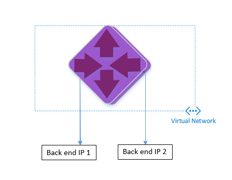

<properties
   pageTitle="使用 Azure 资源管理器模板创建应用程序网关 | Azure"
   description="本页提供有关使用 Azure 资源管理器模板创建 Azure 应用程序网关的说明"
   documentationCenter="na"
   services="application-gateway"
   authors="joaoma"
   manager="jdial"
   editor="tysonn"/>
<tags
   ms.service="application-gateway"
   ms.date="02/02/2016"
   wacn.date="03/18/2016"/>

# 使用 Azure 资源管理器模板创建应用程序网关

Azure 应用程序网关是第 7 层负载平衡器。它在不同服务器之间提供故障转移和性能路由 HTTP 请求，而不管它们是在云中还是本地。应用程序网关具有以下应用程序传递功能：HTTP 负载平衡、基于 Cookie 的会话相关性和安全套接字层 (SSL) 卸载。

> [AZURE.SELECTOR]
- [Azure 经典 PowerShell](/documentation/articles/application-gateway-create-gateway)
- [Azure 资源管理器 PowerShell](/documentation/articles/application-gateway-create-gateway-arm)
- [Azure 资源管理器模板](/documentation/articles/application-gateway-create-gateway-arm-template)

你将了解如何从 GitHub 下载并修改现有 Azure 资源管理器模板，以及如何通过 GitHub、PowerShell 和 Azure CLI 部署该模板。

如果你只是直接从 GitHub 部署 Azure 资源管理器模板，而不进行任何更改，请跳到“从 GitHub 部署模板”。

## 方案

在此方案中，你将：

- 创建包含两个实例的应用程序网关。
- 创建名为 VirtualNetwork1 且包含 10.0.0.0/16 保留 CIDR 块的虚拟网络。
- 创建名为 Appgatewaysubnet 且使用 10.0.0.0/28 作为其 CIDR 块的子网。
- 为需要用来进行流量负载平衡的 Web 服务器设置两个先前已配置的后端 IP。在此模板示例中，后端 IP 将是 10.0.1.10 和 10.0.1.11。

>[AZURE.NOTE] 这是适用于此模板的参数。若要自定义模板，你可以更改规则、侦听程序，以及用于打开 azuredeploy.json 的 SSL。

## 下载 Azure 资源管理器模板并对其进行了解

可以从 GitHub 下载用于创建虚拟网络和两个子网的现有 Azure 资源管理器模板，进行任何所需的更改，然后重用该模板。为此，请执行以下步骤：

1. 导航到 https://raw.githubusercontent.com/azure/azure-quickstart-templates/master/101-create-application-gateway/。
2. 单击 **azuredeploy.json**，然后单击 **RAW**。
3. 将该文件保存到你计算机上的本地文件夹。
4. 如果你熟悉 Azure 资源管理器模板，则跳到步骤 7。
5. 打开刚保存的文件，并查看 **parameters** 下第 5 行中的内容。Azure 资源管理器模板参数提供了在部署过程中可以填充的值的占位符。

	| 参数 | 说明 |
	|---|---|
	| **位置** | 将创建应用程序网关的 Azure 区域 |
	| **VirtualNetwork1** | 新虚拟网络的名称 |
	| **addressPrefix** | 虚拟网络的地址空间，采用 CIDR 格式 |
	| **ApplicationGatewaysubnet** | 应用程序网关子网的名称 |
	| **subnetPrefix** | 应用程序网关子网的 CIDR 块 |
	| **skuname** | SKU 实例大小 |
	| **容量** | 实例数 |
	| **backendaddress1** | 第一个 Web 服务器的 IP 地址 |
	| **backendaddress2** | 第二个 Web 服务器的 IP 地址 |

>[AZURE.IMPORTANT] 在 GitHub 中维护的 Azure 资源管理器模板可能随着时间的推移发生变化。请确保在使用该模板之前对其进行检查。

6. 查看 **resources** 下的内容，并注意以下项：

	- **type**。模板创建的资源的类型。在本例中，该类型为 **Microsoft.Network/applicationGateways**，表示应用程序网关。
	- **name**。资源的名称。请注意 **[parameters('applicationGatewayName')]** 的使用，这意味着在部署过程中将通过用户输入或参数文件输入的方式提供该名称。
	- **properties**。资源的属性列表。此模板在应用程序网关创建期间，使用虚拟网络与公共 IP 地址。

7. 导航回 https://raw.githubusercontent.com/azure/azure-quickstart-templates/master/101-create-application-gateway/azuredeploy.json。
8. 单击 **azuredeploy-paremeters.json**，然后单击 **RAW**。
9. 将该文件保存到你计算机上的本地文件夹。
10. 打开刚保存的文件并编辑参数的值。使用以下值来部署本方案中所述的应用程序网关。

		{
		  "$schema": "http://schema.management.azure.com/schemas/2015-01-01/deploymentParameters.json#",
		{
    	"location" : {
        "value" : "China North"
    	},
    	"addressPrefix": {
        "value": "10.0.0.0/16"
    	},
    	"subnetPrefix": {
        "value": "10.0.0.0/24"
    	},
    	"skuName": {
        "value": "Standard_Small"
    	},
    	"capacity": {
        "value": 2
    	},
    	"backendIpAddress1": {
        "value": "10.0.1.10"
    	},
    	"backendIpAddress2": {
        "value": "10.0.1.11"
    	}
		}

11. 保存文件。你可以使用联机 JSON 验证工具（例如 [JSlint.com](http://www.jslint.com)）来测试 JSON 模板和参数模板。

## 使用 PowerShell 部署 Azure 资源管理器模板

如果你从未使用过 Azure PowerShell，请参阅[如何安装和配置 Azure PowerShell](/documentation/articles/powershell-install-configure)，并始终按照说明进行操作，以登录到 Azure 并选择你的订阅。

### 步骤 1

		Login-AzureRmAccount -EnvironmentName AzureChinaCloud

### 步骤 2

检查该帐户的订阅。

		get-AzureRmSubscription

系统将提示你使用凭据进行身份验证。 

### 步骤 3

选择要使用的 Azure 订阅。 

		Select-AzureRmSubscription -Subscriptionid "GUID of subscription"

### 步骤 4

如有必要，请使用 **New-AzureResourceGroup** cmdlet 来创建新资源组。在下面的示例中，将在“中国东部”位置创建名为 AppgatewayRG 的新资源组。

	 New-AzureRmResourceGroup -Name AppgatewayRG -Location "China East"
		VERBOSE: 5:38:49 PM - Created resource group 'AppgatewayRG' in location 'ChinaEast'

		ResourceGroupName : AppgatewayRG
		Location          : ChinaEast
		ProvisioningState : Succeeded
		Tags              :
		Permissions       :
	                 Actions  NotActions
	                 =======  ==========
	                  *

		ResourceId        : /subscriptions/xxxxxxxxxxxxxxxxxxxxxxxxxxxxxx/resourceGroups/AppgatewayRG

运行 **New-AzureRmResourceGroupDeployment** cmdlet 以使用你在前面下载并修改的模板和参数文件部署新虚拟网络。

		New-AzureRmResourceGroupDeployment -Name TestAppgatewayDeployment -ResourceGroupName AppgatewayRG `
 		   -TemplateFile C:\ARM\azuredeploy.json -TemplateParameterFile C:\ARM\azuredeploy-parameters.json

该命令行将生成以下输出：

		DeploymentName    : testappgatewaydeployment
		ResourceGroupName : appgatewayRG
		ProvisioningState : Succeeded
		Timestamp         : 9/19/2015 1:49:41 AM
		Mode              : Incremental
		TemplateLink      :
		Parameters        :
                   Name             Type                       Value
                   ===============  =========================  ==========
                   location         String                     China East
                   addressPrefix    String                     10.0.0.0/16
                   subnetPrefix     String                     10.0.0.0/24
                   skuName          String                     Standard_Small
                   capacity         Int                        2
                   backendIpAddress1  String                     10.0.1.10
                   backendIpAddress2  String                     10.0.1.11

		Outputs           :

## 使用 Azure CLI 部署 Azure 资源管理器模板

若要使用 Azure CLI 部署下载的 Azure 资源管理器模板，请执行以下步骤：

1. 如果你从未使用过 Azure CLI，请参阅[安装和配置 Azure CLI](/documentation/articles/xplat-cli-install)，并按照说明进行操作，直到选择 Azure 帐户和订阅。
2. 运行 **azure config mode** 命令以切换到资源管理器模式，如下所示。

		azure config mode arm

下面是上述命令的预期输出：

		info:	New mode is arm

3. 如有必要，请运行 **azure group create** 命令以创建新资源组，如下所示。请注意命令的输出。在输出后显示的列表说明了所用的参数。有关资源组的详细信息，请访问 [Azure 资源管理器概述](/documentation/articles/resource-group-overview)。

		azure group create -n appgatewayRG -l ChinaEast

**-n（或 --name）**。新资源组的名称。在本方案中为 *appgatewayRG*。

**-l（或 --location）**。将在其中创建新资源组的 Azure 区域。在本方案中为 *ChinaEast*。

4. 运行 **azure group deployment create** cmdlet 以使用你在前面下载并修改的模板和参数文件部署新虚拟网络。在输出后显示的列表说明了所用的参数。

		azure group deployment create -g appgatewayRG -n TestAppgatewayDeployment -f C:\ARM\azuredeploy.json -e C:\ARM\azuredeploy-parameters.json

下面是上述命令的预期输出：

		azure group deployment create -g appgatewayRG -n TestAppgatewayDeployment -f C:\ARM\azuredeploy.json -e C:\ARM\azuredeploy-parameters.json
		info:    Executing command group deployment create
		+ Initializing template configurations and parameters
		+ Creating a deployment
		info:    Created template deployment "TestAppgatewayDeployment"
		+ Waiting for deployment to complete
		data:    DeploymentName     : TestAppgatewayDeployment
		data:    ResourceGroupName  : appgatewayRG
		data:    ProvisioningState  : Succeeded
		data:    Timestamp          : 2015-09-21T20:50:27.5129912Z
		data:    Mode               : Incremental
		data:    Name               Type    Value
		data:    -----------------  ------  --------------
		data:    location           String  China East
		data:    addressPrefix      String  10.0.0.0/16
		data:    subnetPrefix       String  10.0.0.0/24
		data:    skuName            String  Standard_Small
		data:    capacity           Int     2
		data:    backendIpAddress1  String  10.0.1.10
		data:    backendIpAddress2  String  10.0.1.11
		info:    group deployment create command OK

**-g（或 --resource-group）**。将在其中创建新虚拟网络的资源组的名称。

**-f（或 --template-file）**。Azure 资源管理器模板文件的路径。

**-e（或 --parameters-file）**。Azure 资源管理器 参数文件的路径。

## 使用“单击部署”来部署 Azure 资源管理器模板

“单击部署”是另一种使用 Azure 资源管理器模板的方式。这是将模板与 Azure 门户配合使用的简便方法。

### 步骤 1
转到创建使用公共 IP 的应用程序网关。

### 步骤 2

单击**“部署到 Azure”**。

### 步骤 3

在门户上填写部署模板的参数，然后单击“确定”。

### 步骤 4

选择“法律条款”，然后单击“购买”。

### 步骤 5

在“自定义部署”边栏选项卡上，单击“创建”。

## 后续步骤

如果你要配置 SSL 卸载，请参阅[配置应用程序网关以进行 SSL 卸载](/documentation/articles/application-gateway-ssl)。

如果你想要将应用程序网关配置为与内部负载平衡器配合使用，请参阅[创建具有内部负载平衡器 (ILB) 的应用程序网关](/documentation/articles/application-gateway-ilb)。

如需负载平衡选项的其他常规信息，请参阅：

<!--- [Azure 负载平衡器](/documentation/services/load-balancer)-->
- [Azure 流量管理器](/documentation/services/traffic-manager)

<!---HONumber=Mooncake_0307_2016-->
