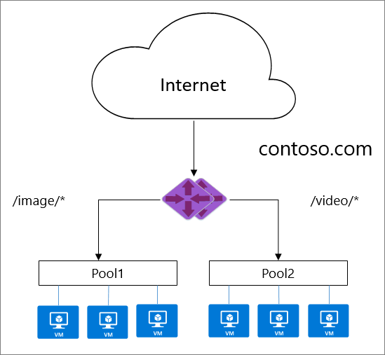

<properties
   pageTitle="使用 URL 路由规则创建应用程序网关 | Azure"
   description="本页提供有关使用 URL 路由规则创建、配置 Azure 应用程序网关的说明"
   documentationCenter="na"
   services="application-gateway"
   authors="joaoma"
   manager="jdial"
   editor="tysonn"/>
<tags
   ms.service="application-gateway"
   ms.date="02/10/2016"
   wacn.date="04/05/2016"/>

# 使用基于 URL 的路由创建应用程序网关 

基于 URL 路径的路由可让你根据 Http 请求的 URL 路径来关联路由。它将检查是否有路由连接到针对应用程序网关中的 URL 列表配置的后端池，并将网络流量发送到定义的后端池。基于 URL 的路由的常见用法是将不同内容类型的请求负载平衡到不同的后端服务器池。

基于 URL 的路由将新的规则类型引入应用程序网关。应用程序网关有 2 种规则类型：基本和 PathBasedRouting。基本规则类型针对后端池提供轮循机制服务，而 PathBasedRouting 除了轮循机制分发以外，还在选择后端池时考虑请求 URL 的路径模式。

>[AZURE.IMPORTANT] PathPattern：要匹配的路径模式列表。每个模式必须以 / 开始，只允许在末尾处添加 \*。允许的例子有 /xyz, /xyz\* 或者 /xyz/\*。发送到路径匹配器的字符串不会在第一个 ? 或 # 之后包含任何文本，这些字符是不允许的。

## 方案
在以下示例中，应用程序网关使用两个后端服务器池来为 contoso.com 提供流量：视频服务器池和图像服务器池。

对 http://contoso.com/image* 的请求将路由到图像服务器池 (pool1)，对 http://contoso.com/video* 的请求将路由到视频服务器池 (pool2)。如果没有任何路径模式匹配，则选择默认的服务器池 (pool1)。

## 开始之前

1. 使用 Web 平台安装程序安装最新版本的 Azure PowerShell cmdlet。可以从[下载页面](/downloads)的“Windows PowerShell”部分下载并安装最新版本。
2. 你将为应用程序网关创建虚拟网络和子网。请确保没有虚拟机或云部署正在使用子网。应用程序网关必须单独位于虚拟网络子网中。
3. 为使用应用程序网关而添加到后端池的服务器必须存在，或者在虚拟网络中为其创建终结点，或者为其分配公共 IP/VIP。

## 创建应用程序网关需要什么？

- **后端服务器池：**后端服务器的 IP 地址列表。列出的 IP 地址应属于虚拟网络子网，或者是公共 IP/VIP。
- **后端服务器池设置：**每个池都有一些设置，例如端口、协议和基于 Cookie 的关联性。这些设置绑定到池，并会应用到池中的所有服务器。
- **前端端口：**此端口是应用程序网关上打开的公共端口。流量将抵达此端口，然后重定向到后端服务器之一。
- **侦听器：**侦听器具有前端端口、协议（Http 或 Https，区分大小写）和 SSL 证书名称（如果要配置 SSL 卸载）。
- **规则：**规则将会绑定侦听器和后端服务器池，并定义当流量抵达特定侦听器时应定向到的后端服务器池。

## 创建新的应用程序网关

使用 Azure 经典门户和 Azure Resource Manager 的差别在于创建应用程序网关的顺序和需要配置的项。

使用 Resource Manager，组成应用程序网关的所有项都将分开配置，然后放在一起创建应用程序网关资源。

以下是创建应用程序网关所需执行的步骤：

1. 为 Resource Manager 创建资源组。
2. 创建应用程序网关的虚拟网络、子网和公共 IP。
3. 创建应用程序网关配置对象。
4. 创建应用程序网关资源。

## 为 Resource Manager 创建资源组

确保使用最新版本的 Azure PowerShell。[将 Windows PowerShell 与 Resource Manager 配合使用](/documentation/articles/powershell-azure-resource-manager)中提供了详细信息。

### 步骤 1
登录到 Azure

	Login-AzureRmAccount -EnvironmentName AzureChinaCloud

系统将提示你使用凭据进行身份验证。 

### 步骤 2
检查该帐户的订阅。

	Get-AzureRmSubscription

### 步骤 3
选择要使用的 Azure 订阅。 

	Select-AzureRmSubscription -Subscriptionid "GUID of subscription"

### 步骤 4
创建新的资源组（如果要使用现有的资源组，请跳过此步骤）。

    New-AzureRmResourceGroup -Name appgw-RG -location "China North"
或者，可以为应用程序网关的资源组创建标记：
	
	$resourceGroup = New-AzureRmResourceGroup -Name appgw-RG -Location "China North" -Tags @{Name = "testtag"; Value = "Application Gateway URL routing"} 

Azure Resource Manager 要求所有资源组指定一个位置。此位置将用作该资源组中的资源的默认位置。请确保用于创建应用程序网关的所有命令都使用相同的资源组。

在上面的示例中，我们在位置“中国北部”创建了名为“appgw-RG”的资源组。

>[AZURE.NOTE] 如果你需要为应用程序网关配置自定义探测，请参阅[使用 PowerShell 创建带自定义探测的应用程序网关](/documentation/articles/application-gateway-create-probe-ps)。有关详细信息，请查看[自定义探测和运行状况监视](/documentation/articles/application-gateway-probe-overview)。

## 为应用程序网关创建虚拟网络和子网

以下示例演示如何使用 Resource Manager 创建虚拟网络：

### 步骤 1
将地址范围 10.0.0.0/24 分配给用于创建虚拟网络的子网变量。

	$subnet = New-AzureRmVirtualNetworkSubnetConfig -Name subnet01 -AddressPrefix 10.0.0.0/24

### 步骤 2
使用前缀 10.0.0.0/16 和子网 10.0.0.0/24，在中国北部区域的“appgw-rg”资源组中创建名为“appgwvnet”的虚拟网络。

	$vnet = New-AzureRmVirtualNetwork -Name appgwvnet -ResourceGroupName appgw-RG -Location "China North" -AddressPrefix 10.0.0.0/16 -Subnet $subnet

### 步骤 3
分配子网变量，以完成后面的创建应用程序网关的步骤。

	$subnet=$vnet.Subnets[0]

## 创建前端配置的公共 IP 地址
在中国北部区域的“appgw-rg”资源组中创建公共 IP 资源“publicIP01”。

	$publicip = New-AzureRmPublicIpAddress -ResourceGroupName appgw-RG -name publicIP01 -location "China North" -AllocationMethod Dynamic

服务启动时，会将一个 IP 地址分配到应用程序网关。

## 创建应用程序网关配置

在创建应用程序网关之前，需要设置所有配置项。以下步骤将创建应用程序网关资源所需的配置项。

### 步骤 1
创建名为“gatewayIP01”的应用程序网关 IP 配置。当应用程序网关启动时，它会从配置的子网获取 IP 地址，再将网络流量路由到后端 IP 池中的 IP 地址。请记住，每个实例需要一个 IP 地址。

	$gipconfig = New-AzureRmApplicationGatewayIPConfiguration -Name gatewayIP01 -Subnet $subnet

### 步骤 2
分别配置名为“pool01”和“pool2”的后端 IP 地址池，其中，“pool1”的 IP 地址为“134.170.185.46, 134.170.188.221,134.170.185.50”；“pool2”的 IP 地址为“134.170.186.46, 134.170.189.221,134.170.186.50”。

	$pool1 = New-AzureRmApplicationGatewayBackendAddressPool -Name pool01 -BackendIPAddresses 134.170.185.46, 134.170.188.221,134.170.185.50

	$pool2 = New-AzureRmApplicationGatewayBackendAddressPool -Name pool02 -BackendIPAddresses 134.170.186.46, 134.170.189.221,134.170.186.50

在本示例中，将有两个后端池根据 URL 路径路由网络流量。一个池接收来自 URL 路径“/video”的流量，另一个池接收来自路径“/image”的流量。你必须替换上述 IP 地址才能添加你自己的应用程序 IP 地址终结点。

### 步骤 3
为后端池中进行了负载平衡的网络流量配置应用程序网关设置“poolsetting01”和“poolsetting02”。在本示例中，你将为后端池配置不同的后端池设置。每个后端池可有自身的后端池设置。

	$poolSetting01 = New-AzureRmApplicationGatewayBackendHttpSettings -Name "besetting01" -Port 80 -Protocol Http -CookieBasedAffinity Disabled -RequestTimeout 120

	$poolSetting02 = New-AzureRmApplicationGatewayBackendHttpSettings -Name "besetting02" -Port 80 -Protocol Http -CookieBasedAffinity Enabled -RequestTimeout 240

### 步骤 4
使用公共 IP 终结点配置前端 IP。

	$fipconfig01 = New-AzureRmApplicationGatewayFrontendIPConfig -Name "frontend1" -PublicIPAddress $publicip

### 步骤 5 
配置应用程序网关的前端端口。

	$fp01 = New-AzureRmApplicationGatewayFrontendPort -Name "fep01" -Port 80
### 步骤 6
配置侦听器。此步骤针对用于接收传入网络流量的公共 IP 地址和连接端口配置侦听器。
 
	$listener = New-AzureRmApplicationGatewayHttpListener -Name "listener01" -Protocol Http -FrontendIPConfiguration $fipconfig01 -FrontendPort $fp01

### 步骤 7 
配置后端池的 URL 规则路径。此步骤配置应用程序网关用于定义 URL 路径间映射的相对路径，并将分配到后端池来处理传入流量。

以下示例将创建两个规则：一个用于将流量路由到后端“pool1”的“/image/”路径，另一个用于将流量路由到后端“pool2”的“/video/”路径。
    
	$imagePathRule = New-AzureRmApplicationGatewayPathRuleConfig -Name "pathrule1" -Paths "/image/*" -BackendAddressPool $pool1 -BackendHttpSettings $poolSetting01

	$videoPathRule = New-AzureRmApplicationGatewayPathRuleConfig -Name "pathrule2" -Paths "/video/*" -BackendAddressPool $pool2 -BackendHttpSettings $poolSetting02

如果路径不匹配任何预定义的路径规则，规则路径映射配置也会配置默认的后端地址池。

	$urlPathMap = New-AzureRmApplicationGatewayUrlPathMapConfig -Name "urlpathmap" -PathRules $videoPathRule, $imagePathRule -DefaultBackendAddressPool $pool1 -DefaultBackendHttpSettings $poolSetting02

### 步骤 8 
创建规则设置。此步骤将应用程序网关配置为使用基于 URL 路径的路由。

	$rule01 = New-AzureRmApplicationGatewayRequestRoutingRule -Name "rule1" -RuleType PathBasedRouting -HttpListener $listener -UrlPathMap $urlPathMap
### 步骤 9 
配置实例数目和应用程序网关的大小。

	$sku = New-AzureRmApplicationGatewaySku -Name "Standard_Small" -Tier Standard -Capacity 2

## 创建应用程序网关
创建包含上述步骤中所有配置对象的应用程序网关。

	$appgw = New-AzureRmApplicationGateway -Name appgwtest -ResourceGroupName appgw-RG -Location "China North" -BackendAddressPools $pool1,$pool2 -BackendHttpSettingsCollection $poolSetting01, $poolSetting02 -FrontendIpConfigurations $fipconfig01 -GatewayIpConfigurations $gipconfig -FrontendPorts $fp01 -HttpListeners $listener -UrlPathMaps $urlPathMap -RequestRoutingRules $rule01 -Sku $sku

## 获取应用程序网关
	$getgw =  Get-AzureRmApplicationGateway -Name appgwtest -ResourceGroupName appgw-RG

<!---HONumber=Mooncake_0328_2016-->
