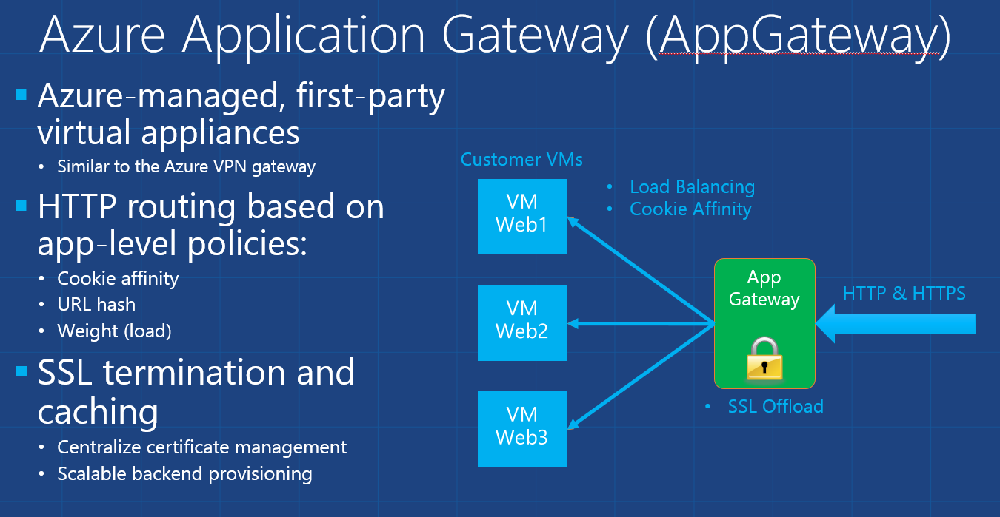
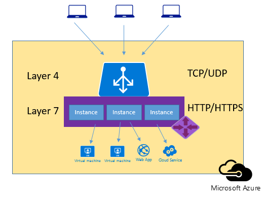

<properties 
   pageTitle="应用程序网关简介 | Windows Azure"
   description="此页提供第 7 层负载平衡的应用程序网关服务概述，包括网关的大小、HTTP 负载平衡、基于 Cookie 的会话相关性和 SSL 卸载。"
   documentationCenter="na"
   services="application-gateway"
   authors="joaoma"
   manager="carmonm"
   editor="tysonn"/>
<tags 
   ms.service="application-gateway" 
   ms.date="11/09/2015"
   wacn.date="01/05/2016"/>

# 什么是应用程序网关？

Windows Azure 应用程序网关提供基于第 7 层负载平衡的 Azure 托管 HTTP 负载平衡解决方案。

应用程序负载平衡使 IT 管理员和开发人员能够基于 HTTP 为网络流量创建路由规则。应用程序网关服务高度可用，并附带计量功能。有关 SLA 和定价，请参阅 [SLA](/support/legal/sla/) 和[定价](/home/features/application-gateway/#price/)页。

应用程序网关当前支持以下第 7 层应用程序传送功能：

- HTTP 负载平衡
- 基于 Cookie 的会话相关性
- SSL 卸载

## HTTP 第 7 层负载平衡

Azure 通过在传输层 (TCP/UDP) 运行 Azure 负载平衡器并让所有传入的网络流量负载平衡到应用程序网关服务，来提供第 4 层负载平衡。然后，应用程序网关将路由规则应用到 HTTP 流量，以提供第 7 层 (HTTP) 负载平衡。当你创建应用程序网关时，将与一个终结点 (VIP) 相关联并将其用作输入网络流量的公共 IP。

应用程序网关将会根据其配置（是虚拟机、云服务、 WEB 应用还是外部 IP 地址）来路由 HTTP 流量。

下图解释了应用程序网关流量的流动方式：

HTTP 第 7 层负载平衡适合用于：

- 需要使用来自同一用户/客户端会话的请求来访问相同后端 VM 的应用程序。此类应用程序的示例包括购物车应用程序和 Web 邮件服务器。
- 希望 Web 服务器场不产生 SSL 终端开销的应用程序。
- 要求长时间运行的同一 TCP 连接上多个 HTTP 请求路由/负载平衡到不同后端服务器的应用程序（例如 CDN）。

## 网关大小和实例

应用程序网关目前以 3 种大小提供：小型、中型和大型。小型实例大小适用于开发和测试方案。

最多可为每个订阅创建 50 个应用程序网关，每个应用程序网关最多可有 10 个实例。Azure 托管服务形式的应用程序网关负载平衡允许在 Azure 软件负载平衡器的后面预配第 7 层负载平衡器。

下表显示了每个应用程序网关实例的平均性能吞吐量：

| 后端页面响应 | 小型 | 中型 | 大型|
|---|---|---|---|
| 6K | 7\.5 mbps | 13 mbps | 50 mbps |
|100k | 35 mbps | 100 mbps| 200 mbps |

>[AZURE.NOTE]这是有关应用程序网关吞吐量的大约指导数据。实际吞吐量取决于平均页面大小、后端实例的位置、提供页面所需的处理时间等各种环境详细信息。

## 运行状况监视
 

Azure 应用程序网关每隔 30 秒监视后端实例的运行状况一次。它会将 HTTP 运行状况探测请求发送到 *BackendHttpSettings* 配置元素中配置的端口上的每个实例。运行状况探测预期会返回成功 HTTP 响应，响应状态代码在 200-399 的范围内。

收到成功 HTTP 响应时，后端服务器将标记为运行正常，并继续接收来自 Azure 应用程序网关的流量。如果探测失败，则会从运行正常的池中删除后端实例，并且流量会停止传送到此服务器。仍会在失败的后端实例上每隔 30 秒进行运行状况探测，以检查其当前的运行状况。当后端实例成功响应运行状况探测时，将以正常状态重新添加回到后端池，然后，流量会再次开始传到此实例。

## 配置和管理

可以使用 REST API 和 PowerShell cmdlet 来创建及管理应用程序网关。

## 后续步骤

创建应用程序网关。请参阅[创建应用程序网关](/documentation/articles/application-gateway-create-gateway)。

配置 SSL 卸载。请参阅[配置应用程序网关的 SSL 卸载](/documentation/articles/application-gateway-ssl)。

<!---HONumber=Mooncake_1221_2015-->
