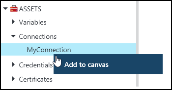
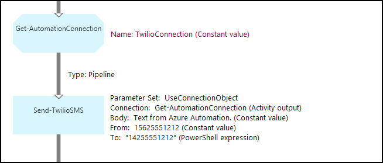
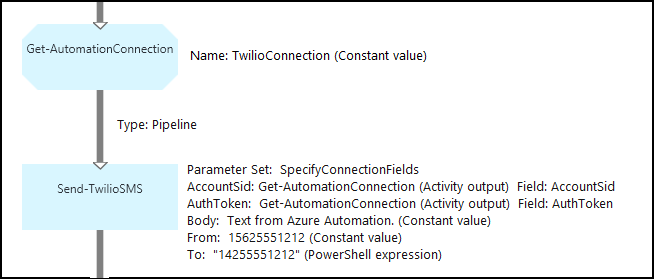

<properties 
   pageTitle="Azure 自动化中的连接资产"
   description="Azure 自动化中的连接资产包含从 Runbook 连接到外部服务或应用程序所需的信息。本文介绍了有关连接的详细信息，以及如何在文本和图形创作中使用连接。"
   services="automation"
   documentationCenter=""
   authors="bwren"
   manager="stevenka"
   editor="tysonn" />
<tags
   ms.service="automation"
   
   ms.date="05/21/2015"
   wacn.date="08/29/2015" />

# Azure 自动化中的连接资产

自动化连接资产包含从 Runbook 连接到外部服务或应用程序所需的信息。除 URL 和端口等连接信息外，还包括身份验证所需的信息，如用户名和密码。使用连接的值将用于连接一个特定应用程序的所有属性保留在一个资产中，而不是创建多个变量。用户可以从一个位置编辑连接的值，并且您可以在单个参数中将连接名称传递给 Runbook。可在 Runbook 中使用 **Get-AutomationConnection** 活动访问连接的属性。

当创建连接时，必须指定*连接类型*。连接类型是定义了一组属性的模板。连接为其连接类型中定义的每个属性定义值。连接类型通过集成模块添加到 Azure 自动化或使用 [Azure 自动化 API](http://msdn.microsoft.com/zh-cn/library/azure/mt163818.aspx) 创建。在创建连接时，仅能使用安装到您的自动化帐户中的连接类型。

>[AZURE.NOTE]Azure 自动化中的安全资产包括凭据、证书、连接和加密的变量。这些资产已使用针对每个自动化帐户生成的唯一密钥加密并存储在 Azure 自动化中。此密钥由主证书加密，并存储在 Azure 自动化中。在存储安全资产之前，会先使用主证书来解密自动化帐户的密钥，然后使用该密钥来加密资产。

## Windows PowerShell Cmdlet

下表中的 cmdlet 用于创建和管理与 Windows PowerShell 的自动化连接。可在自动化 runbook 中使用的 [Azure PowerShell 模块](/documentation/articles/powershell-install-configure)随附了这些 cmdlet。

|Cmdlet|说明|
|:---|:---|
|[Get-AzureAutomationConnection](http://msdn.microsoft.com/zh-cn/library/dn921828.aspx)|检索连接。包括一个哈希表，其中包括连接的字段的值。|
|[New-AzureAutomationConnection](http://msdn.microsoft.com/zh-cn/library/dn921825.aspx)|创建新连接。|
|[Remove-AzureAutomationConnection](http://msdn.microsoft.com/zh-cn/library/dn921827.aspx)|删除现有连接。|
|[Set-AzureAutomationConnectionFieldValue](http://msdn.microsoft.com/zh-cn/library/dn921826.aspx)|设置现有连接的一个特定字段的值。|

## Runbook 活动

下表中的活动用于在 Runbook 中访问连接。

|活动|说明|
|---|---|
|Get-AutomationConnection|获取要在 Runbook 中使用的连接。返回包括该连接属性的哈希表。|

>[AZURE.NOTE]应避免在 **Get- AutomationConnection** 的 –Name 参数中使用变量，因为这可能会使设计时发现 Runbook 与连接资产之间的依赖关系变得复杂化。

## 创建新连接

### 使用 Azure 门户创建新连接

1. 在您的自动化帐户中，单击窗口顶部的“资产”。
1. 在窗口底部，单击“添加设置”。
1. 单击“添加连接”。
2. 在“连接类型”下拉列表中，选择您想要创建连接的类型。向导将显示该特定类型的属性。
1. 完成该向导并单击该复选框以保存新连接。

### 使用 Azure 预览门户创建新连接

1. 在您的自动化帐户中，单击“资产”部分打开“资产”边栏选项卡。
1. 单击“连接”部分以打开“连接”边栏选项卡。
1. 单击边栏选项卡顶部的“添加连接”。
2. 在“类型”下拉列表中，选择您想要创建连接的类型。表单将显示该特定类型的属性。
1. 完成该表单，然后单击“创建”以保存新连接。

### 使用 Windows PowerShell 创建新连接

使用 Windows PowerShell 通过 [New-AzureAutomationConnection](http://msdn.microsoft.com/zh-cn/library/dn921825.aspx) cmdlet 创建新连接。此 cmdlet 有一个名为 **ConnectionFieldValues** 的参数，其预期值为该连接类型定义的每个属性定义值的[哈希表](http://technet.microsoft.com/zh-cn/library/hh847780.aspx)。

下面的示例命令为 [Twilio](http://www.twilio.com) 创建一个新连接，Twilio 是一种允许您发送和接收短信的电话服务。在[脚本中心](http://gallery.technet.microsoft.com/scriptcenter/Twilio-PowerShell-Module-8a8bfef8)中提供了包括 Twilio 连接类型的示例集成模块。此连接类型为“帐户 SID”和“授权令牌”定义属性，这些是连接到 Twilio 时验证您的帐户时所需的属性。您必须[下载此模块](http://gallery.technet.microsoft.com/scriptcenter/Twilio-PowerShell-Module-8a8bfef8)并将其安装到您的自动化帐户中，才能使此示例代码正常工作。

	$AccountSid = "DAf5fed830c6f8fac3235c5b9d58ed7ac5"
	$AuthToken  = "17d4dadfce74153d5853725143c52fd1"
	$FieldValues = @{"AccountSid" = $AccountSid;"AuthToken"=$AuthToken}

	New-AzureAutomationConnection -AutomationAccountName "MyAutomationAccount" -Name "TwilioConnection" -ConnectionTypeName "Twilio" -ConnectionFieldValues $FieldValues

## 在 Runbook 中使用连接

在 Runbook 中使用 **Get-AutomationConnection** cmdlet 检索连接。此活动检索连接中的不同字段的值，并将它们按[哈希表](https://technet.microsoft.com/zh-cn/library/hh847780.aspx)返回，该哈希表随后可用于 Runbook 中适当的命令。

### 文本 Runbook 示例
下面的示例命令演示如何使用前面示例中的 Twilio 连接从 Runbook 中发送短信。此处使用的 Send-TwilioSMS 活动具有两个参数集，它们分别使用不同方法对 Twilio 服务进行身份验证。其中一个使用连接对象，而另一个对“帐户 SID”和“授权令牌”使用单个参数。此示例中显示了这两种方法。

	$Con = Get-AutomationConnection -Name "TwilioConnection"
	$NumTo = "14255551212"
	$NumFrom = "15625551212"
	$Body = "Text from Azure Automation."

	#Send text with connection object.
	Send-TwilioSMS -Connection $Con -From $NumFrom -To $NumTo -Body $Body

	#Send text with connection properties.
	Send-TwilioSMS -AccountSid $Con.AccountSid -AuthToken $Con.AuthToken $Con -From $NumFrom -To $NumTo -Body $Body

### 图形 Runbook 示例

通过在图形编辑器的“库”窗格中右键单击连接，并选择“添加到画布”，将 **Get-AutomationConnection** 活动添加到图形 Runbook。

下图显示了在图形 Runbook 中使用连接的示例。该示例与上面显示的从文本 runbook 中使用 Twilio 发送短信的示例为同一个示例。此示例将对使用连接对象向服务进行身份验证的 **Send-TwilioSMS** 活动使用 **UseConnectionObject** 参数集。此处使用了一个[管道链接](automation-graphical-authoring-intro#links-and-workflow)，因为预期的连接参数是单个对象。

将 PowerShell 表达式而不是常量值用作 **To** 参数中的值，是因为此参数要求一个字符串数组值类型，以便您可以将其发送到多个号码。PowerShell 表达式允许您提供单个值或一个数组。

下图显示的示例与上面显示的示例为同一个示例，但使用**SpecifyConnectionFields** 参数集，要求单独指定 AccountSid 和 AuthToken 参数，而不使用连接对象进行身份验证。在这种情况下，指定的是连接的字段，而不是连接本身。

## 相关文章

- [图形创作中的链接](automation-graphical-authoring-intro#links-and-workflow)
 

<!---HONumber=67-->