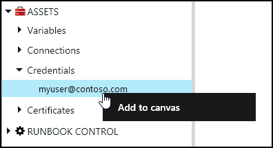

<properties 
   pageTitle="Azure 自动化中的凭据资产"
   description="Azure 自动化中的凭据资产包含可用于向 Runbook 访问的资源进行身份验证的安全凭据。本文介绍如何创建凭据资产并在 Runbook 中使用它们。"
   services="automation"
   documentationCenter=""
   authors="bwren"
   manager="stevenka"
   editor="tysonn" />
<tags
   ms.service="automation"
   ms.date="08/18/2015"
   wacn.date="09/15/2015" />

# Azure 自动化中的凭据资产

自动化凭据资产包含 [PSCredential](http://msdn.microsoft.com/zh-cn/library/system.management.automation.pscredential) 对象，该对象包含用户名和密码等安全凭据。Runbook 可能会使用接受 PSCredential 对象用于身份验证的 cmdlet，或者 Runbook 可能会提取 PSCredential 对象的用户名和密码，以便提供给需要进行身份验证的应用程序或服务。在 Azure 自动化中安全地存储凭据的属性，并可以在 Runbook 中通过 [Get-AutomationPSCredential](http://msdn.microsoft.com/zh-cn/library/system.management.automation.pscredential.aspx) 活动访问这些属性。

>[AZURE.NOTE]Azure 自动化中的安全资产包括凭据、证书、连接和加密的变量。这些资产已使用针对每个自动化帐户生成的唯一密钥加密并存储在 Azure 自动化中。此密钥由主证书加密，并存储在 Azure 自动化中。在存储安全资产之前，会先使用主证书来解密自动化帐户的密钥，然后使用该密钥来加密资产。

## Windows PowerShell cmdlet

下表中的 cmdlet 用于通过 Windows PowerShell 创建和管理自动化凭据资产。可在自动化 Runbook 中使用的 [Azure PowerShell 模块](/documentation/articles/powershell-install-configure)已随附了这些 cmdlet。

|Cmdlet|说明|
|:---|:---|
|[Get-AzureAutomationCredential](http://msdn.microsoft.com/zh-cn/library/dn913781.aspx)|检索有关凭据资产的信息。只能从 **Get-AutomationCredential** 活动中检索凭据本身。|
|[New-AzureAutomationCredential](http://msdn.microsoft.com/zh-cn/library/azure/jj554330.aspx)|创建新的自动化凭据。|
|[Remove- AzureAutomationCredential](http://msdn.microsoft.com/zh-cn/library/azure/jj554330.aspx)|删除自动化凭据。|
|[Set- AzureAutomationCredential](http://msdn.microsoft.com/zh-cn/library/azure/jj554330.aspx)|设置现有自动化凭据的属性。|

## Runbook 活动

下表中的活动用于在 Runbook 中访问凭据。

|活动|说明|
|:---|:---|
|Get-AutomationPSCredential|获取要在 Runbook 中使用的凭据。返回 [System.Management.Automation.PSCredential](http://msdn.microsoft.com/zh-cn/library/system.management.automation.pscredential) 对象。|

>[AZURE.NOTE]应避免在 Get-AutomationPSCredential 的 –Name 参数中使用变量，因为这可能会使设计时发现 Runbook 与凭据资产之间的依赖关系变得复杂化。

## 创建新凭据

### 使用 Azure 门户创建新变量

1. 在您的自动化帐户中，单击窗口顶部的“资产”。
1. 在窗口底部，单击“添加设置”。
1. 单击“添加凭据”。
2. 在“凭据类型”下拉列表中，选择“PowerShell 凭据”。
1. 完成向导并单击复选框以保存新凭据。

### 使用 Azure 预览门户创建新凭据

1. 在您的自动化帐户中，单击“资产”部分打开“资产”边栏选项卡。
1. 单击“凭据”部分以打开“凭据”边栏选项卡。
1. 单击边栏选项卡顶部的“添加凭据”。
1. 完成表单，然后单击“创建”以保存新凭据。

### 使用 Windows PowerShell 创建新的 PowerShell 凭据

以下示例命令演示了如何创建新的自动化凭据。首先创建了一个具有名称和密码的 PSCredential 对象，然后使用该对象创建凭据资产。或者，可以使用 **Get-Credential** cmdlet，会提示您键入名称和密码。

	$user = "MyDomain\MyUser"
	$pw = ConvertTo-SecureString "PassWord!" -AsPlainText -Force
	$cred = New-Object –TypeName System.Management.Automation.PSCredential –ArgumentList $user, $pw
	New-AzureAutomationCredential -AutomationAccountName "MyAutomationAccount" -Name "MyCredential" -Value $cred

## 在 Runbook 中使用 PowerShell 凭据

在 Runbook 中使用 **Get-AutomationPSCredential** 活动检索凭据资产。此操作将返回“[PSCredential 对象](http://msdn.microsoft.com/zh-cn/library/system.management.automation.pscredential.aspx)”，您可将其用于需要 PSCredential 参数的活动或 cmdlet。还可以检索要单独使用的凭据对象的属性。该对象具有一个用于用户名和安全密码的属性，或者您可以使用 **GetNetworkCredential** 方法返回 [NetworkCredential](http://msdn.microsoft.com/zh-cn/library/system.net.networkcredential.aspx) 对象，该对象将提供该密码的不安全版本。

### 文本 Runbook 示例

下面的示例命令演示如何在 Runbook 中使用 PowerShell 凭据。在此示例中，检索了凭据并将其用户名和密码分配到变量。

	$myCredential = Get-AutomationPSCredential -Name 'MyCredential'
	$userName = $myCredential.UserName
	$securePassword = $myCredential.Password
	$password = $myCredential.GetNetworkCredential().Password

### 图形 Runbook 示例

通过在图形编辑器的“库”窗格中右键单击凭据并选择“添加到画布”，将 **Get-AutomationPSCredential** 活动添加到图形 Runbook。

下图显示了在图形 Runbook 中使用凭据的示例。在这种情况下，它被该 Runbook 用来对 Azure 资源提供身份验证，在[配置对 Azure 资源的身份验证](#automation-configuring)中进行了描述。第一个活动检索有权访问 Azure 订阅的凭据。然后，**Add-AzureAccount** 活动使用此凭据对它之后的任何活动提供身份验证。此处是一个[管道链接](/documentation/articles/automation-graphical-authoring-intro#links-and-workflow)，因为 **Get-AutomationPSCredential** 要求是单个对象。

## 相关文章

- [图形创作中的链接](/documentation/articles/automation-graphical-authoring-intro#links-and-workflow)

 

<!---HONumber=69-->