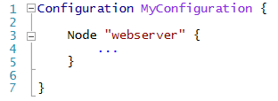

<properties 
   pageTitle="Azure 自动化 DSC 概述" 
   description="对 Azure 自动化所需状态配置 (DSC) 及其术语和已知问题的概述" 
   services="automation" 
   documentationCenter="dev-center-name" 
   authors="coreyp-at-msft" 
   manager="stevenka" 
   editor="tysonn"/>

<tags ms.service="automation" ms.date="05/04/2015" wacn.date="06/16/2015"/> 

# Azure 自动化 DSC 概述 #

>[AZURE.IMPORTANT]**Azure 自动化 DSC 当前为受限预览版**，不支持用于生产工作负荷。它现在仅基于 cmdlet，没有图形用户界面。注册获取 Azure 自动化 DSC 的预览版本即表示你认同此功能为预览版本，因此其服务条款可能有所缩减或有所不同，详见[服务协议](/support/legal/)。虽然此服务当前可免费使用，但以后会对其定价。

## 什么是 PowerShell DSC？   

所需状态配置 (DSC) 是 Windows PowerShell 中一个新的管理平台，可通过声明性的 PowerShell 语法管理物理主机和虚拟机的配置。

DSC 提供了一套 Windows PowerShell 语言扩展、新的 Windows PowerShell cmdlet 和资源，可通过声明方式指定你所希望的软件环境配置方式。它还提供了一种方法来维护和管理现有配置。

### 实际应用  

下面是一些示例方案，在这些方案中，你可以使用内置的 DSC 资源通过自动化方式配置和管理一组计算机（也称为目标节点）：

- 启用或禁用服务器角色和功能
- 管理注册表设置
- 管理文件和目录
- 启动、停止和管理进程和服务
- 管理组和用户帐户
- 部署新的软件
- 管理环境变量
- 运行 Windows PowerShell 脚本
- 修复偏离所需状态的配置
- 发现给定节点上的实际配置状态

此外，你还可以创建自定义资源，以便配置任何应用程序或系统设置的状态。

有关 PowerShell DSC 的更多详细信息，请参阅：[开发运营环境中的配置 - Windows PowerShell 所需状态配置](http://blogs.msdn.com/b/powershell/archive/2013/11/01/configuration-in-a-devops-world-windows-powershell-desired-state-configuration.aspx)

##什么是 Azure 自动化 DSC？  

Azure 自动化 DSC 是在 PowerShell DSC 中已引入基本功能的基础上构建的，将为用户提供更轻松的配置管理体验。Azure 自动化 DSC 向 [PowerShell 所需状态配置](https://technet.microsoft.com/zh-cn/library/dn249912.aspx)<link>提供的管理层与目前的 Azure 自动化为 PowerShell 脚本提供的相同。

使用 Azure 自动化 DSC，你可以[创作和管理 PowerShell 所需状态配置](https://technet.microsoft.com/zh-cn/library/dn249918.aspx)、导入 [DSC 资源](https://technet.microsoft.com/zh-cn/library/dn282125.aspx)并生成 DSC 节点配置（MOF 文档），所有这一切均在云中完成。这些 DSC 项会被放置在 Azure 自动化 [DSC 拉取服务器](https://technet.microsoft.com/zh-cn/library/dn249913.aspx)上，方便云中或本地的目标节点（例如物理机和虚拟机）拾取它们，自动符合其所指定的所需状态，并回过头来将其符合所需状态的情况报告给 Azure 自动化。

## Azure 自动化 DSC 术语  

### 配置  

PowerShell DSC 引入了名为“配置”的新概念。使用配置，你可以通过 PowerShell 语法来定义你的环境所需的状态。若要使用 DSC 配置你的环境，请先使用配置关键字来定义 Windows PowerShell 脚本块，然后使用标识符来跟踪它，最后再使用大括号 ({}) 来分隔该块。

在配置块内，你可以定义节点配置块，以便指定你的环境中应配置为完全相同的一组节点（计算机）的所需配置。节点配置通过这种方式来表示一个或多个节点需要采用的一种“角色”。节点配置块以节点关键字开头。紧跟此关键字的是角色的名称，可以是变量。在计算机名称之后，使用大括号 {} 来分隔节点配置块。

 
在节点配置模块中，你可以定义用于配置特定 DSC 资源的资源块。资源块以资源名称开头，后跟需要为该块指定的标识符，然后是用来分隔块的大括号 {}。

如需有关配置关键字的更详细信息，请参阅：[了解所需状态配置中的配置关键字](http://blogs.msdn.com/b/powershell/archive/2013/11/05/understanding-configuration-keyword-in-desired-state-configuration.aspx "了解所需状态配置中的配置关键字")

运行（编译）DSC 配置将生成一个或多个 DSC 节点配置（MOF 文档），DSC 节点需要应用这些配置才能符合所需状态。

Azure 自动化 DSC 允许你在 Azure 自动化中导入、创作和编译 DSC 配置，这与你可以在 Azure 自动化中导入、创作和启动 Runbook 类似。

Azure 自动化 DSC 目前在 **Azure 资源管理器 PowerShell 模块**中提供以下 cmdlet，用于对 DSC 配置进行管理：

- `Get-AzureAutomationDscConfiguration`
- `Import-AzureAutomationDscConfiguration`

>[AZURE.IMPORTANT]在 Azure 自动化 DSC 中，一项配置只应包含一个配置块，块名称与配置名称相同。

###节点配置

编译 DSC 配置时，会生成一个或多个节点配置，具体取决于配置中的节点块。节点配置等同于“MOF”或"配置文档"（如果你熟悉这些 PS DSC 术语的话），表示"角色"（例如 Web 服务器或辅助角色），即一个或多个节点应采用的所需状态。

PS DSC 节点现在可以感知那些应通过 DSC 推送或拉取方法来执行的节点配置。Azure 自动化 DSC 依赖于 DSC 拉取方法，在该方法中，节点会从 Azure 自动化 DSC 拉取服务器中请求应该应用的节点配置。由于节点会向 Azure 自动化 DSC 发出请求，因此这些节点可能会位于防火墙之后，也可能会关闭所有入站端口，等等。它们只需通过出站访问方式来访问 Internet。

Azure 自动化 DSC 目前在 **Azure 资源管理器 PowerShell 模块**中提供以下cmdlet，用于管理 DSC 节点配置：`Get-AzureAutomationDscNodeConfiguration`

###节点

DSC 节点是其配置由 DSC 管理的任何计算机。该节点可能是 Azure VM 或本地 VM/物理主机。节点会执行节点配置，以便始终符合其所定义的所需状态，并且还会回过头来向报告服务器报告其配置状态以及符合配置状态的情况。

Azure 自动化 DSC 可以在载入节点后对其进行轻松的管理，并允许更改分配给每个服务器端节点的节点配置，这样当某个节点下一次检查服务器上是否有说明时，它就会采用不同的角色，并且会相应地更改其配置方式。节点还报告其状态以及其配置是否符合 Azure 自动化 DSC 的要求。

Azure 自动化 DSC 目前在 [Azure 资源管理器 PowerShell 模块](powershell-azure-resource-manager)中提供以下 cmdlet，用于对 DSC 节点进行管理：

-	`Get-AzureAutomationDscNode`  
-	`Register-AzureAutomationDscNode`（用于将 Azure v2 VM 加载为节点）
-	`Get-AzureAutomationDscOnboardingMetaconfig`（用于加载节点）
-	`Set-AzureAutomationDscNode`（用于设置/更新节点到节点配置映射）
-	`Unregister-AzureAutomationDscNode`
-	`Get-AzureAutomationDscNodeReport`
-	`Export-AzureAutomationDscNodeReportContent`

可以使用 `Get-AzureAutomationRegistrationInfo` cmdlet 来获取所需的注册 URL 和密钥，以便将 Azure 经典 VM 加入 Azure 自动化帐户，不管是通过Azure 门户中的 Azure 自动化 DSC VM 扩展还是通过 PowerShell 来进行。

Azure 自动化 DSC VM 扩展：

PowerShell：

    # fill in correct values for your VM / Automation Account here
    $VMName = ""
    $ServiceName = ""
    $AutomationAccountName = ""
    $AutomationAccountResourceGroup = ""

    # get Azure Automation DSC registration info
    Switch-AzureMode AzureResourceManager

    $Account = Get-AzureAutomationAccount -ResourceGroupName $AutomationAccountResourceGroup -Name $AutomationAccountName

    $RegistrationInfo = $Account | Get-AzureAutomationRegistrationInfo

    # use the DSC extension to onboard the VM for management with Azure Automation DSC
    Switch-AzureMode AzureServiceManagement

    $VM = Get-AzureVM -Name $VMName -ServiceName $ServiceName

    $PublicConfiguration = ConvertTo-Json -Depth 8 @{
        SasToken = ""
        ModulesUrl = "https://eus2oaasibizamarketprod1.blob.core.chinacloudapi.cn/automationdscpreview/RegistrationMetaConfig.zip"
        ConfigurationFunction = "RegistrationMetaConfig.ps1\RegistrationMetaConfig"

        # update these DSC agent configurations if these defaults are not what you want. 
        # See https://technet.microsoft.com/zh-cn/library/dn249922.aspx?f=255&MSPPError=-2147217396 for more details
        Properties = @{
            RegistrationKey = $RegistrationInfo.PrimaryKey
            RegistrationUrl = $RegistrationInfo.Endpoint
            NodeConfigurationName = "configname.webserver"
            ConfigurationMode = "ApplyAndMonitor"
            ConfigurationModeFrequencyMins = 15
            RefreshFrequencyMins = 30
           RebootNodeIfNeeded = $False
           ActionAfterReboot = "ContinueConfiguration"
           AllowModuleOverwrite = $False
        }
    } 

    $VM = Set-AzureVMExtension `
        -VM $vm `
        -Publisher Microsoft.Powershell `
        -ExtensionName DSC `
        -Version 1.9 `
        -PublicConfiguration $PublicConfiguration

    $VM | Update-AzureVM
 

###资源  

DSC 资源是可用于定义 Windows PowerShell 所需状态配置 (DSC) 配置的构建基块。DSC 附带了一组内置功能，用于配置资源（如文件和文件夹、服务器功能和角色、注册表设置、环境变量，以及服务和进程）。若要了解内置 DSC 资源的完整列表以及如何使用它们，请参阅[内置 Windows PowerShell 所需状态配置资源](https://technet.microsoft.com/zh-cn/library/dn249921.aspx)。

还可以将 DSC 资源作为 PowerShell 模块的一部分导入，以便扩展内置 DSC 资源的集合。如果 DSC 节点要执行的节点配置包含对非默认资源的引用，则该节点会从 DSC 拉取服务器中拉取这些资源。若要了解如何创建自定义资源，请参阅[构建自定义 Windows PowerShell 所需状态配置资源](https://technet.microsoft.com/zh-cn/library/dn249927.aspx)。

Azure 自动化 DSC 附带的内置 DSC 资源与 PS DSC 附带的完全一样。通过将包含额外资源的 PowerShell 模块导入 Azure 自动化中，可以向 Azure 自动化 DSC 添加这些资源。

Azure 自动化 DSC 目前在 [Azure 资源管理器 PowerShell 模块](powershell-azure-resource-manager)中提供以下 cmdlet，用于对 DSC 节点进行管理：

- `New-AzureAutomationModule`
- `Remove-AzureAutomationModule`
- `Set-AzureAutomationModule`
- `Get-AzureAutomationModule`

###编译作业  

Azure 自动化 DSC 中的编译作业是配置的编译实例，用于创建一个或多个节点配置。它们类似于 Azure 自动化 Runbook 作业，但实际上并不执行任何任务，只是创建节点配置。编译作业创建的任何节点配置会自动放置在 Azure 自动化 DSC 拉取服务器上，并覆盖以前版本的节点配置（如果此配置存在以前的版本）。编译作业所生成的节点配置的名称采用“<Configuration-name>.<Node configuration-block-name>”的形式。例如，编译以下配置将生成名为“MyConfiguration.webserver”的单节点配置

>[AZURE.NOTE]就像 Runbook 一样，配置可以进行发布。这与将 DSC 项目放置到 Azure 自动化 DSC 拉取服务器上无关。编译作业导致 DSC 项目被放置到 Azure 自动化 DSC 拉取服务器上。有关如何在 Azure 自动化中“发布”内容的详细信息，请参阅[发布 Runbook](https://msdn.microsoft.com/zh-cn/library/dn903765.aspx)。

Azure 自动化 DSC 目前在 [Azure 资源管理器 PowerShell 模块](powershell-azure-resource-manager)中提供以下 cmdlet，用于对编译作业进行管理：

-	`Get-AzureAutomationDscCompilationJob`
-	`Get-AzureAutomationDscCompilationJobOutput`
-	`Start-AzureAutomationDscCompilationJob`

##难题/已知问题：

- 由于 Azure 自动化 DSC 为预览版，因此第一次使用此功能时，你需要通过 Azure PowerShell cmdlet 来注册获取它。你可以通过调用以下两个 cmdlet 来注册：

 - `Register-AzureProvider –ProviderNamespace Microsoft.Automation`
 - `Register-AzureProviderFeature -FeatureName dsc -ProviderNamespace Microsoft.Automation` 
 
>[AZURE.NOTE]Azure 自动化 DSC 注册可能需要长达一小时才能完成，然后你才能使用此功能。

- 目前，Azure 自动化 DSC 不支持进行部分式的或复合式的 DSC 配置。

- 必须先安装最新版的 WMF 5，然后适用于 Windows 的 PowerShell DSC 代理才能与 Azure 自动化通信。目前，适用于 Linux 的 PowerShell DSC 代理不支持与 Azure 自动化通信。这应该很快就会进行更新。

- Azure 自动化不支持并行使用 PowerShell 模块。这意味着，自动化帐户中的所有配置都必须兼容已导入该自动化帐户中的最新版 PowerShell 模块，并兼容该模块包含的并由配置使用的任何 PowerShell DSC 资源。

- 传统的 PowerShell DSC 拉取服务器需要将模块 zip 文件置于拉取服务器上，采用 **ModuleName_Version.zip** 格式。Azure 自动化要求在导入 PowerShell 模块时，其名称采用 **ModuleName.zip** 格式。请参阅[此博客文章](http://azure.microsoft.com/blog/2014/12/15/authoring-integration-modules-for-azure-automation/)，了解将模块导入 Azure 自动化中时需要的集成模块格式的更多信息。

- 用于通过“版本/文件夹”格式来指定模块中并行 DSC 资源的 PowerShell 模块目前无法在 Azure 自动化中使用。

- 使用 `New-AzureAutomationModule` 或 `Set-AzureAutomationModule` cmdlet 将 PowerShell 模块导入 Azure 自动化中时，模块导入是异步的。即使该 cmdlet 成功返回，也并不意味着模块导入成功完成。若要检查导入是否成功，请使用 `Get-AzureAutomationModule –Name <ModuleName>`（确保只获取此模块，而非所有模块）并确保模块的 **ProvisioningState** 字段指示导入已成功。

- 已导入 Azure 自动化中的 PowerShell 模块不能包含 .doc 或 .docx 文件。某些包含 DSC 资源的 PowerShell 模块包含这些文件，可用作帮助文件。在导入到 Azure 自动化中之前，这些文件应从模块中删除。

- Azure 自动化中的配置当前仅支持针对参数值的字符串。如果你想要传递针对参数值的字符串之外的内容，可将该参数值作为 JSON 字符串传递，然后在配置中使用 ConvertFrom-Json 将 JSON 字符串转换回非字符串值。

- 将某个节点首次注册到 Azure 自动化帐户时，或者将节点更改为映射到服务器端的其他节点配置时，其状态将是合规的，即使该节点的状态实际上并不符合它现在所映射到的节点配置。注册以后或者节点配置映射更改以后，如果该节点发送了首个报告，则节点状态将是可以信任的。

- 当载入 Azure VM，以便在 Azure 预览门户中使用 Azure 自动化 DSC 通过 `Register-AzureAutomationDscNode`、`Set-AzureAutomationDscExtension` 或 Azure 自动化 DSC VM 扩展进行管理时，如果注册失败并出现消息“计算机名称未指定且配置目录没有任何配置文件”，则需注意该消息为假警报，VM 注册实际上已成功。可以使用 `Get-AzureAutomationDscNode` cmdlet 来验证注册是否成功。

<!---HONumber=60-->