<properties
	pageTitle="我在 Azure Automation 中的第一个图形 Runbook"
	description="本教程将指导您完成创建、 测试和发布一个简单图形 Runbook。涵盖了多个概念，例如，对 Azure 资源进行身份验证、 输入参数和条件链接。"
	services="automation"
	documentationCenter=""
	authors="bwren"
	manager="stevenka"
	editor=""/>

<tags
	ms.service="automation"
	
	ms.date="07/03/2015"
	wacn.date="08/29/2015"/>

# 我的第一个 Runbook

本教程将指导您在 Azure Automation 中创建“[图形 Runbook](/documentation/articles/automation-graphical-authoring-intro)”。我们将从一个简单的 Runbook 开始，我们将测试和发布该 Runbook，同时介绍如何跟踪 Runbook 作业的状态。然后我们将通过修改 Runbook 来实际管理 Azure 资源，这种情况下将启动 Azure 虚拟机。然后我们将通过添加 Runbook 参数和条件链接来使该 Runbook 更稳健。

## 先决条件

为了完成本教程，您将需要以下内容。

- Azure 订阅。如果您没有帐户，则可以“[激活 MSDN 订户权益](http://azure.microsoft.com/pricing/member-offers/msdn-benefits-details/)”或<a href="/pricing/free-trial/" target="_blank">“[注册免费试用](http://www.windowsazure.cn/pricing/1rmb-trial/)”。
- 用于保存 Runbook 的“[Automation 帐户](/documentation/articles/automation-configuring)”。
- Azure 虚拟机。我们将停止并启动该计算机，因此其不应为生产用计算机。
- 用于对 Azure 资源进行身份验证的“[Azure Active Directory 用户和凭据资产](/documentation/articles/automation-configuring)”。此用户必须有权启动和停止虚拟机。

## 步骤 1 - 创建新的 Runbook

我们将创建一个输出文本 *Hello World* 的简单 Runbook 。

1. 在 Azure 预览门户中，打开您的 Automation 帐户。  
通过 Automation 帐户页面可快速查看此帐户中的资源。您应该已拥有某些资产。大多数资产都是自动包括在新的 Automation 帐户中的模块。您还应具有在“[先决条件](#prerequisites)”中提到的凭证资产。
2. 单击 **Runbook** 磁贴打开 Runbook 的列表。 

2. 通过单击“添加 Runbook”按钮创建一个新 Runbook，然后“创建新 Runbook”。
3. 将该 Runbook 命名为 *MyFirstRunbook-Graphical*。
4. 在这种情况下，我们要创建“[图形 Runbook](/documentation/articles/automation-graphical-authoring-intro)”，因此应选择“图形”作为“Runbook 类型”。 
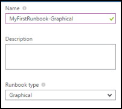
5. 单击“创建”以创建 Runbook 并打开图形编辑器。

## 步骤 2 - 向 Runbook 添加活动

编辑器左侧的库控件允许您选择要添加到 Runbook 的活动。我们要添加 **Write-Output** cmdlet 以从 Runbook 输出我们的文本。

1.   在库控件中，展开 **Cmdlet** 节点，然后展开 **Microsoft.PowerShell.Utility**。 
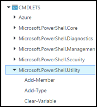
2.   向下滚动到列表的底部。右键单击 **Write-Output**，然后单击“添加到画布”。
4.   单击画布上的 **Write-Output** 活动。这将打开可用于配置活动的配置控件。
5.   “标签”默认为该 cmdlet 的名称，但我们可以将其更改为更友好。将其更改为 *Write Hello World to output*。
6.   单击“参数”为 cmdlet 参数提供值。  
某些 cmdlet 有多个参数集，并且您需要选择将使用的参数集。在这种情况下，**Write-Output** 只具有一个参数集，因此无需选择一个。  
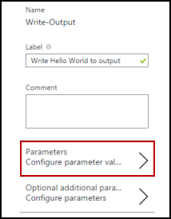
7.   选择 **InputObject** 参数。这是我们将在其中指定要发送到输出流的文本的参数。
9.   在“数据源”下拉列表中，选择“PowerShell 表达式”。“数据源”下拉列表中提供了用于填充参数值的不同的源。您可以使用来自诸如另一个活动、Automation 资产或 PowerShell 表达式等类型源的输出。在这种情况下，我们只想输出文本 *Hello World*。我们可以使用 PowerShell 表达式并指定一个字符串。
10.   在“表达式”框中，键入 *"Hello World"* 然后单击“确定”两次以返回到画布。 
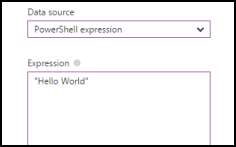
11.   通过单击“保存”来保存 Runbook。 

## 步骤 3 - 测试 Runbook

在我们发布 Runbook 使其可在生产中使用之前，我们要对其进行测试以确保其能正常工作。测试 Runbook 时，您可以运行其“草稿”版本并以交互方式查看其输出。
 
2. 单击“测试窗格”打开测试窗格。 

2. 单击“启动”以启动测试。这应该是唯一的已启用选项。
3. 会创建一个“[Runbook 作业](automation-runbook-execution)”并且在窗格中显示其状态。  
作业状态初始为“排队”，该值指示它正在等待云中的 Runbook 辅助角色可用。在某个辅助角色认领该作业后，该作业状态将变为“正在启动”，然后当 Runbook 实际开始运行时，该作业状态将变为“正在运行”。  
4. Runbook 作业完成后，会显示其输出。在本例中，我们应该看到 *Hello World*。 
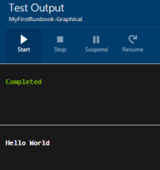
5. 关闭测试窗格以返回到画布。

## 步骤 4 - 发布和启动 Runbook

我们刚刚创建的 Runbook 仍处于草稿模式。我们需要发布该 Runbook，然后才可将其用于生产。当发布 Runbook 时，您可以用草稿版本覆盖现有的已发布版本。在本例中，我们还没有已发布版本，因为我们刚刚创建 Runbook。

1. 单击“发布”以发布该 Runbook，然后在出现提示时单击“是”。 

2. 如果您现在向左滚动以在 **Runbooks** 窗格中查看该 Runbook，它将显示“已发布”的“创作状态”。
3. 向右滚动查看 **MyFirstRunbook** 窗格。  
顶部的选项允许我们启动 Runbook，计划其在将来的某个时刻启动，或创建 [webhook](/documentation/articles/automation-webhooks) 以使其可以通过 HTTP 调用启动。 
4. 我们只想要启动 Runbook，因此单击“启动”，然后在出现提示时单击“是”。 

5. 会为我们刚刚创建的 Runbook 作业打开作业窗格。我们可以关闭此窗格，但在这种情况下我们将其保持打开，以便可以查看该作业的进度。
6.  作业状态显示在“作业摘要”中并且与我们在测试该 Runbook 时看到的状态相匹配。 

7.  一旦此 Runbook 状态显示*“已完成”*，单击“输出”。“输出”窗格将打开，并且我们可以看到 *Hello World*。 
  
8.  关闭“输出”窗格。
9.  单击“流”打开 Runbook 作业的“流”窗格。应该只会在输出流中看到 *Hello World*，但此窗格也可以显示 Runbook 作业的其他流，例如，“详细”和“错误”（如果 Runbook 向其写入)。 
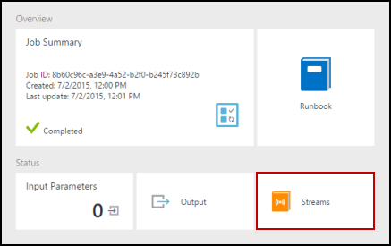 
9. 关闭“流”窗格和“作业”窗格中以返回到 MyFirstRunbook 窗格。
9.  单击“作业”打开此 Runbook 的“作业”窗格。这将列出此 Runbook 创建的所有作业。由于我们只运行该作业一次，应该只会看到一个列出的作业。 
 
9. 您可以在此作业上单击以打开我们启动 Runbook 时查看的相同的作业窗格。这样您就可以回溯并查看为特定 Runbook 创建的任何作业的详细信息。

## 步骤 5 - 添加身份验证来管理 Azure 资源

我们已经测试并发布 Runbook，但到目前为止它不执行任何有用的操作。我们想要让其管理 Azure 资源。然而，除非使用“[先决条件](#prerequisites)”中引用的凭据对其进行身份验证，否则它将无法进行管理。我们使用 **Set-AzureAccount** cmdlet 实现此目的。

1.  通过单击 MyFirstRunbook 窗格上的“编辑”打开图形编辑器。 
 
2.  我们不再需要 **Write Hello World to output**，因此请右键单击它并选择“删除”。
8.  在库控件中，展开 **Cmdlets**，然后展开 **Azure**。 
9.  将 **Add-AzureAccount** 添加到画布。 
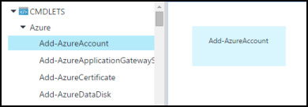 
12.  选择 **Add-AzureAccount**，然后单击“配置”窗格中的“参数”。
13.  **Add-AzureAccount** 有多个参数集，因此需要选择其中一个，然后才能提供参数值。单击“参数集”，然后选择“用户”参数集。
14.  一旦您选择的参数集，这些参数将显示在“活动参数配置”窗格中。添加“凭据”。 
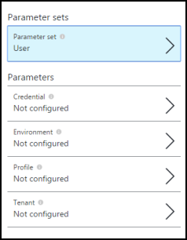
15.  我们希望此 cmdlet 使用我们的 Automation 帐户中的凭据资产，因此选择“凭据资产”作为“数据源”。
16.  选择有权启动和停止 Azure 环境中的虚拟机的凭据资产。 
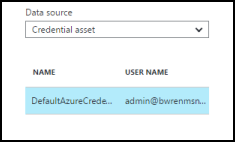
17.  单击“确定”两次以返回到画布。

## 步骤 6 – 添加用于启动虚拟机的活动

我们现在将添加 **Start-AzureVM** 活动来启动虚拟机。您可以在您的 Azure 订阅中选取任何虚拟机，现在我们会将该名称硬编码到 cmdlet 中。

1. 依次展开 **Cmdlets** 和 **Azure**。
2. 将 **Start-AzureVM** 添加到画布，然后单击并将其拖放到 **Add-AzureAccount** 之下。
11.  将鼠标悬停在 **Add-AzureAccount** 上方，之前在该形状的底部显示一个圆圈。单击该圆圈并将箭头拖至 **Start-AzureVM**。  
您刚创建的箭头是*“链接”*。Runbook 将从 **Add-azureaccount** 开始，然后运行 **Start-azurevm**。 
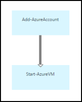
5. 选择 **Start-azurevm**。单击“参数”，然后单击“参数集”查看 **Start-AzureVM** 的参数集。选择 **ByName** 参数集。请注意旁边有感叹号的“名称”和 **ServiceName** 。这表示它们是必需的参数。
7. 选择“名称”。使用“常数值”作为“数据源”，并输入要启动的虚拟机的名称。单击“确定”。
8. 选择 **ServiceName**。使用“常数值”作为“数据源”，并输入要启动的虚拟机的名称。单击“确定”。 
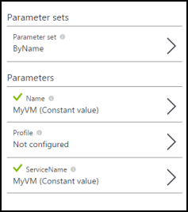
9. 单击“测试”窗格，以便我们可以测试 Runbook。
10. 单击“启动”以启动测试。一旦测试完成后，检查已启动的虚拟机。

## 步骤 7 - 将输入参数添加到 Runbook

我们的 Runbook 当前启动在 **Start-AzureVM** cmdlet 中指定的虚拟机，但如果我们在启动 Runbook 时指定了虚拟机，我们的 Runbook 会更有用。我们现在将输入参数添加到 Runbook 以提供该功能。

1. 通过单击 **MyFirstRunbook** 窗格上的“编辑”打开图形编辑器。
2. 依次单击“输入和输出”和“添加输入”，打开“Runbook 输入参数”窗格。 

4. 指定 *VMName* 作为“名称”。保留“字符串”作为“类型”，但将“必需”更改为*“是”*。单击“确定”。
5. 创建第二个称为 *VMServiceName* 的必需输入参数，然后单击“确定”关闭“输入和输出”窗格。 
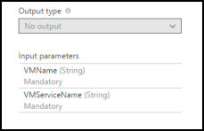 
6. 选择 **Start-AzureVM** 活动，然后单击“参数”。
7. 将“名称”的“数据源”更改为“Runbook 输入”，然后选择 **VMName**。 
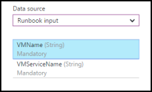 
8. 将 **ServiceName** 的“数据源”更改为“Runbook 输入”，然后选择 **VMServiceName**。 
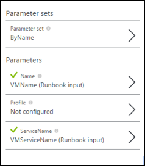 
9. 保存 Runbook 并打开“测试”窗格。请注意，现在可以为将在测试中使用的两个输入变量提供值。 
11.  关闭“测试”窗格。
12.  单击“发布”以发布 Runbook 的新版本。
13.  停止在上一步中启动的虚拟机。
13.  单击“启动”以启动 Runbook。键入要启动的虚拟机的 **VMName** 和 **VMServiceName**。 
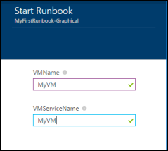 
14.  一旦 Runbook 完成后，检查已启动的虚拟机。

## 步骤 8 – 创建条件链接

我们现在将修改该 runbook，以便它将仅在尚未启动 Runbook 时尝试将其启动。我们将通过将 **Get-AzureVM** cmdlet 添加到包括虚拟机当前状态的 Runbook 来实现此目的。然后，我们将添加仅在当前运行状态为“停止”的情况下运行 **Start-AzureVM** 的条件链接。如果 Runbook 未停止，则输出消息。

1. 在图形编辑器中打开 **MyFirstRunbook**。
2. 单击 **Add-azureaccount** 和 **Start-azurevm** 之间的链接然后按“删除”键将其删除。
3. 在库控件中，展开 **Cmdlets**，然后展开 **Azure**。
4. 将 **Get-AzureVM** 添加到画布。
5. 创建 **Add-AzureAccount** 与 **Get-AzureVM** 之间的链接。创建 **Get-AzureVM** 与 **Start-AzureVM** 之间的另一个链接。  
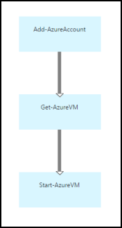   
6.  选择 **Get AzureVM**，然后单击“参数”。选择参数集 *GetVMByServiceAndVMName*。
7.  将“名称”的“数据源”更改为“Runbook 输入”，然后选择 **VMName**。   
7.  将 **ServiceName** 的“数据源”更改为“Runbook 输入”，然后选择 **VMServiceName**。  
8.  选择 **Get-AzureVM** 和 **Start-AzureVM** 之间的链接。
9.  在“配置”窗格中，将“应用条件”更改为 **True**。请注意，该链接将变为虚线，指示仅在条件解析为 True 时才会运行目标活动。
10.  对于”条件表达式“，输入 *$ActivityOutput['Get-AzureVM'].PowerState -eq "Stopped"*。**Start-AzureVM** 现在仅在虚拟机停止才会运行。  
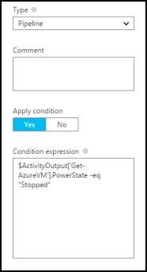 
11.  在库控件中，展开 **Cmdlet** 节点，然后展开 **Microsoft.PowerShell.Utility**。
12.  将 **Write-Output** 添加到画布。
13.  创建 **Get-AzureVM** 与 **Write-Output** 之间的链接。
14.  选择该链接并将”应用条件“更改为 **True**。
14.  对于”条件表达式“，输入 *$ActivityOutput['Get-AzureVM'].PowerState -ne "Stopped"*。**Write-Output** 现在仅在虚拟机停止时才会运行。  
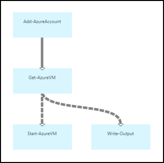 
15.  选择 **Write-Output**，然后单击“参数”。
16.  对于 **InputObject**，将“数据源”更改为“PowerShell 表达式”，然后输入表达式 *"$VMName.Name already started."*。
17.  保存 Runbook 并打开“测试”窗格。
18.  如果在虚拟机停止时启动 Runbook，那么虚拟机将启动。
19.  如果在虚拟机已启动时启动 runbook，那么您应得到已启动的输出。
 

## 相关文章

- [Azure Automation 中的图形创作](/documentation/articles/automation-graphical-authoring-intro)

 

<!---HONumber=67-->