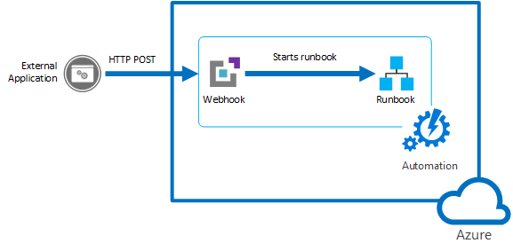
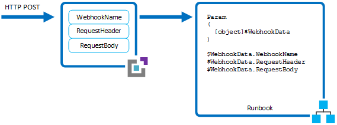
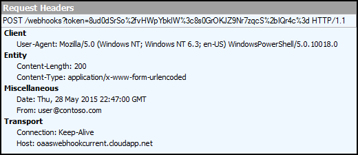
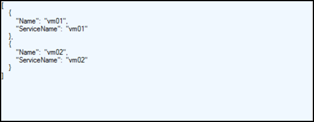
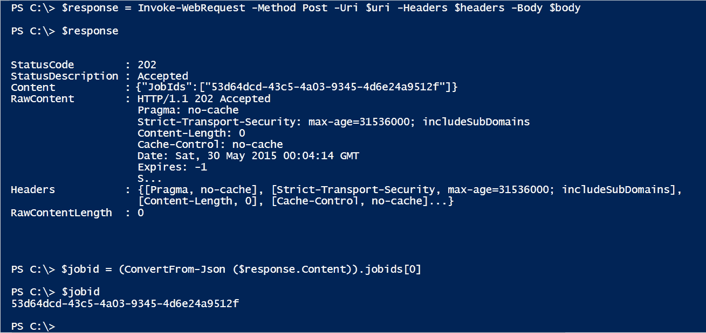

<properties 
   pageTitle="Azure 自动化 Webhook"
   description="一个可供客户端通过 HTTP 调用在 Azure 自动化中启动 Runbook 的 Webhook。本文介绍了如何创建 Webhook，以及如何通过调用 Webhook 来启动 Runbook。"
   services="automation"
   documentationCenter=""
   authors="bwren"
   manager="stevenka"
   editor="tysonn" />
<tags 
   ms.service="automation"
   ms.date="08/04/2015"
   wacn.date="09/15/2015" />

# Azure 自动化 Webhook

*Webhook* 可以用来在 Azure 自动化中通过单个 HTTP 请求来启动特定的 Runbook。这样，外部服务（例如 Visual Studio Online、GitHub 或自定义应用程序）就可以在不通过 Azure 自动化 API 实施完整解决方案的情况下启动 Runbook。

你可以将 Webhook 与[在 Azure 自动化中启动 Runbook](/documentation/articles/automation-starting-a-runbook) 中其他启动 Runbook 的方法进行比较。

## Webhook 详细信息

下表介绍了你必须为 Webhook 配置的属性。

| 属性 | 说明 |
|:---|:---|
|Name | 你可以提供要用于 Webhook 的任何名称，因为该名称不会公开给客户端。它只供你用来标识 Azure 自动化中的 Runbook。  最好是为 Webhook 提供一个与要使用该名称的客户端相关的名称。 |
|URL |Webhook 的 URL 是客户端通过 HTTP POST 来调用的唯一地址，用于启动链接到 Webhook 的 Runbook。它是在你创建 Webhook 时自动生成的。不能指定自定义 URL。    URL 包含一个允许第三方系统调用 Runbook 的安全令牌，不需要进一步进行身份验证。因此，应将其视为密码。出于安全原因，你只能在创建 Webhook 时通过 Azure 预览门户查看该 URL。你应该将保存在安全位置的 URL 记下来，供将来使用。 |
|到期日期 | 与证书一样，每个 Webhook 都有一个过期日期，到了过期日期 Webhook 将不再可用。此到期日期在 Webhook 创建后将无法更改，而在到达到期日期以后，Webhook 也将无法再次启用。在这种情况下，你必须创建另一个 Webhook 来替换当前的 Webhook，并对客户端进行更新，使之能够使用新的 Webhook。 |
| Enabled | Webhook 在创建后已按默认启用。如果将 Runbook 设置为“Disabled”，将没有客户端能够使用它。你可以在创建 Webhook 时设置 **Enabled** 属性，也可以在创建后随时设置它。 |

### Parameters
Webhook 可以定义 Runbook 参数的值，当该 Webhook 启动 Runbook 时会用到这些值。Webhook 必须包含 Runbook 的任何必需参数的值，可以包含可选参数的值。链接到单个 Runbook 的多个 Webhook 可以使用不同的参数值。

客户端在使用 Webhook 启动 Runbook 时，不能重写在 Webhook 中定义的参数值。为了从客户端接收数据，Runbook 可能会接受名为 **$WebhookData** 且类型为 [object] 的单个参数，该参数会包含客户端包括在 POST 请求中的数据。

**$WebhookData** 对象将具有以下属性：

| 属性 | 说明 |
|:--- |:---|
| WebhookName | Webhook 的名称。 |
| RequestHeader | 包含传入 POST 请求标头的哈希表。 |
| RequestBody | 传入 POST 请求的正文。用于保留任何格式，如字符串、JSON、XML，或窗体编码的数据。编写的 Runbook 必须能够与预期的数据格式配合工作。|

不需配置 Webhook 即可支持 **$WebhookData** 参数，也不需要 Runbook 来接受它。如果 Runbook 没有定义该参数，则会忽略从客户端发送的请求的任何详细信息。

如果你在创建 Webhook 时为 $WebhookData 指定了值，则会在 Webhook 使用客户端 POST 请求中的数据启动 Runbook 时重写该值，即使该客户端的请求正文中不包含任何数据。如果你使用 Webhook 以外的方法启动包含 $WebhookData 的 Runbook，则可为能够被 Runbook 识别的 $WebhookData 提供值。该值应该是一个其属性与 $Webhookdata 相同的对象，这样 Runbook 就可以正常地使用它。

>[AZURE.NOTE]所有输入参数的值都会通过 Runbook 作业进行记录。这意味着，客户端在 Webhook 请求中提供的任何输入都将记录下来，并可供有权访问自动化作业的任何人使用。因此，在 Webhook 调用中包括敏感信息时，应该特别小心。

## “安全”

Webhook 的安全性取决于其 URL 的私密性，可以通过 URL 中包含的安全令牌来调用它。如果请求是向正确的 URL 发出的，Azure 自动化不对请求进行任何身份验证。因此，不应将 Webhook 用于执行敏感性很高的功能却不使用替代方法来验证请求的 Runbook。

你可以将逻辑包括在 Runbook 中，以便确定它是否是通过 Webhook 调用的，只需检查 $WebhookData 参数的 **WebhookName** 属性即可。该 Runbook 还可以执行进一步的验证，只需在 **RequestHeader** 或 **RequestBody** 属性中查找特定信息即可。

另一种策略是让 Runbook 在收到 Webhook 请求时对外部条件执行某些验证。例如，当有新的内容提交到 GitHub 存储库时，可通过 GitHub 调用 Runbook。Runbook 在继续之前，可能会连接到 GitHub 来验证是否确实有新的提交内容。

## 创建 Webhook

在 Azure 预览门户中使用以下过程来创建新的链接到 Runbook 的 Webhook。

1. 在 Azure 预览门户的**“Runbook”边栏选项卡**中，单击需要通过 Webhook 来启动以查看其详细信息边栏选项卡的 Runbook。 
3. 单击边栏选项卡顶部的 **Webhook** 以打开“添加 Webhook”边栏选项卡。  
4. 单击“创建新的 Webhook”以打开“创建 Webhook 边栏选项卡”。
5. 指定 Webhook 的“名称”、“到期日期”，以及是否应启用它。若需这些属性的详细信息，请参阅 [Webhook 详细信息](#details-of-a-webhook)。
6. 单击复制图标，然后按 Ctrl+C 以复制 Webhook 的 URL。然后，将其记录在某个安全的位置。**一旦创建 Webhook，你就不能再次检索该 URL。**  
3. 单击“参数”为 Runbook 参数提供值。如果 Runbook 包含必需的参数，除非提供了相应的值，否则你无法创建 Webhook。
1. 单击“创建”以创建 Webhook。

## 使用 Webhook

若要在创建 Webhook 后使用该 Webhook，客户端应用程序必须发出带 Webhook URL 的 HTTP POST。Webhook 的语法将按以下格式。

	http://<Webhook Server>/token?=<Token Value>

客户端将从 POST 请求中接收以下返回代码之一。

| 代码 | 文本 | 说明 |
|:---|:----|:---|
| 202 | 已接受 | 已接受该请求，并已成功将 Runbook 排队。 |
| 400 | 错误的请求 | 出于以下原因之一，未接受该请求。<ul> <li>Webhook 已过期。</li> <li>Webhook 处于禁用状态。</li> <li>URL 中的令牌无效。</li></ul>|
| 404 | 未找到 | 出于以下原因之一，未接受该请求。<ul> <li>找不到 Webhook。</li> <li>找不到 Runbook。</li> <li>找不到帐户。</li> </ul> |
| 500 | 内部服务器错误 | URL 有效，但出现了错误。请重新提交请求。 |

假设请求成功，Webhook 响应包含 JSON 格式的作业 ID，如下所示。它包含单个作业 ID，但 JSON 格式允许将来可能的增强功能。

	{"JobIds":["<JobId>"]}  

客户端无法从 Webhook 确定 Runbook 的作业何时完成或其完成状态。可以使用作业 ID 并配合其他方法（例如 [Windows PowerShell](http://msdn.microsoft.com/zh-cn/library/azure/dn690263.aspx) 或 [Azure 自动化 API](https://msdn.microsoft.com/zh-cn/library/azure/mt163826.aspx)）来确定此信息。

### 示例

以下示例使用 Windows PowerShell 并配合 Webhook 来启动 Runbook。请注意，任何可以发出 HTTP 请求的语言都可以使用 Webhook；Windows PowerShell 在这里仅用作示例。

Runbook 预期请求的正文中包含 JSON 格式的虚拟机列表。我们还要在请求标头中包含有关启动 Runbook 的人员、启动日期和时间的信息。

	$uri = "https://oaaswebhookcurrent.chinacloudapp.cn/webhooks?token=8ud0dSrSo%2fvHWpYbklW%3c8s0GrOKJZ9Nr7zqcS%2bIQr4c%3d"
	$headers = @{"From"="user@contoso.com";"Date"="05/28/2015 15:47:00"}
    
    $vms  = @([pscustomobject]@{Name="vm01";ServiceName="vm01"})
    $vms += @([pscustomobject]@{Name="vm02";ServiceName="vm02"})
	$body = ConvertTo-Json -InputObject $vms 

	$response = Invoke-RestMethod -Method Post -Uri $uri -Headers $headers -Body $body
	$jobid = ConvertFrom-Json $response 

下图显示此请求中的标头信息（使用 [Fiddler](http://www.telerik.com/fiddler) 跟踪）。这包括 HTTP 请求的标准标头，除此之外，还有我们添加的自定义“日期”和“时间”标头。其中每个值可以在 **WebhookData** 的 **RequestHeaders** 属性中提供给 Runbook 使用。

下图显示请求的正文（使用 [Fiddler](http://www.telerik.com/fiddler) 跟踪）可在 **WebhookData** 的 **RequestBody** 属性中提供给 Runbook 使用。格式化为 JSON 是因为其格式是请求正文中包含的格式。

下图显示了从 Windows PowerShell 发送的请求以及生成的响应。作业 ID 从响应中提取，并转换为字符串。

以下示例 Runbook 将接受前面的示例请求，并启动请求正文中指定的虚拟机。

	workflow Test-StartVirtualMachinesFromWebhook
	{
		param (	
				[object]$WebhookData
		)

		# If runbook was called from Webhook, WebhookData will not be null.
		if ($WebhookData -ne $null) {	
			
			# Collect properties of WebhookData
			$WebhookName 	= 	$WebhookData.WebhookName
			$WebhookHeaders = 	$WebhookData.RequestHeader
			$WebhookBody 	= 	$WebhookData.RequestBody
			
			# Collect individual headers. VMList converted from JSON.
			$From = $WebhookHeaders.From
			$VMList = (ConvertFrom-Json -InputObject $WebhookBody).VirtualMachines
			Write-Output "Runbook started from webhook $WebhookName by $From."
			
			# Authenticate to Azure resources
			$Cred = Get-AutomationPSCredential -Name 'MyAzureCredential'
			Add-AzureAccount -Credential $Cred
			
            # Start each virtual machine
			foreach ($VM in $VMList)
			{
				Write-Output "Starting $VM.Name."
				Start-AzureVM -Name $VM.Name -ServiceName $VM.ServiceName
			}
		}
		else {
			Write-Error "Runbook mean to be started only from webhook." 
		} 
	}

	

## 相关文章

- [启动 Runbook](/documentation/articles/automation-starting-a-runbook)
- [查看 Runbook 作业的状态](/documentation/articles/automation-viewing-the-status-of-a-runbook-job) 

<!---HONumber=69-->