<properties
	pageTitle="Azure IaaS 用户手册 - 第二部分 | Azure"
	description="详细介绍如何创建和管理 Azure 虚拟机。"
	services="virtual-machines-windows"
	documentationCenter=""
	authors="Lei Zhang"
	manager=""
	editor=""/>

<tags
	ms.service="virtual-machines-windows"
	ms.date=""
	wacn.date="06/13/2016"/>

# Azure IaaS 用户手册 - 第二部分

- [Azure IaaS 用户手册 - 第一部分](/documentation/articles/azure-Iaas-user-manual-part1)
- [Azure IaaS 用户手册 - 第三部分](/documentation/articles/azure-Iaas-user-manual-part3)

##目录
5.&nbsp;[开始创建 Azure 虚拟机](#section_5)

- 5.1 [模拟场景](#section_5_1)
- 5.2 [规划](#section_5_2)
	- 5.2.1 [如何选择 Azure 数据中心](#section_5_2_1)
	- 5.2.2 [Azure 是如何解决大并发](#section_5_2_2)
	- 5.2.3 [选择最合适的虚拟机配置](#section_5_2_3)
	- 5.2.4 [规划好高可用(非常重要)](#section_5_2_4)
	- 5.2.5 [规划好 Azure 订阅(非常重要)](#section_5_2_5)
	- 5.2.6 [选择订阅(非常重要)](#section_5_2_6)
	- 5.2.7 [查看该订阅中可使用的 Azure 资源](#section_5_2_7)
- 5.3 [创建 Azure 虚拟机](#section_5_3)
	- 5.3.1 [说明](#section_5_3_1)
	- 5.3.2 [规划](#section_5_3_2)
- 5.4 [使用 Azure 管理界面创建虚拟机](#section_5_4)
	- 5.4.1 [创建虚拟网络(非常重要)](#section_5_4_1)
	- 5.4.2 [创建存储账号](#section_5_4_2)
	- 5.4.3 [创建虚拟机说明](#section_5_4_3)
	- 5.4.4 [使用管理界面创建 Azure 虚拟机](#section_5_4_4)
		- 5.4.4.1 [注意事项(非常重要)](#section_5_4_4_1)
		- 5.4.4.2 [创建第一台 AD Server](#section_5_4_4_2)
		- 5.4.4.3 [创建第二台 AD Server](#section_5_4_4_3)
		- 5.4.4.4 [观察 AD Server](#section_5_4_4_4)
		- 5.4.4.5 [创建 Web Server](#section_5_4_4_5)
		- 5.4.4.6 [创建 SQL Server 虚拟机(非常重要)](#section_5_4_4_6)
		- 5.4.4.7 [总结(非常重要)](#section_5_4_4_7)
- 5.5 [使用 Azure PowerShell 创建虚拟机](#section_5_5)
	- 5.5.1 [说明](#section_5_5_1)
	- 5.5.2 [配置 PowerShell](#section_5_5_2)
	- 5.5.3 [使用 PowerShell 创建 Windows VM(非常重要)](#section_5_5_3)
	- 5.5.4 [使用 PowerShell 创建 Linux VM](#section_5_5_4)
- 5.6 [管理 Azure 虚拟机](#section_5_6)
	- 5.6.1 [远程桌面连接 WindowsVM (非常重要)](#section_5_6_1)
	- 5.6.2 [Linux SSH](#section_5_6_2)
	- 5.6.3 [挂载磁盘](#section_5_6_3)
	- 5.6.4 [存储账号中查看磁盘](#section_5_6_4)
	- 5.6.5 [Azure 临时磁盘(非常重要)](#section_5_6_5)
	- 5.6.6 [卸载磁盘](#section_5_6_6)
	- 5.6.7 [虚拟机关机(非常重要)](#section_5_6_7)
	- 5.6.8 [删除 Azure 虚拟机](#section_5_6_8)
	- 5.6.9 [虚拟机监控](#section_5_6_9)

## 5.	开始创建 Azure 虚拟机
### 5.1 模拟场景
Contoso 公司已经采购了 Azure China 服务，计划把现有托管在 IDC 的企业官网迁移到 Azure 云平台。该企业官网面向的用户群主要是华东地区的用户。

该企业官网部署需要服务器列表如下：

1.	1 台 AD 服务器
2.	1 台 Web 服务器
3.	1 台 SQL Server 服务器

### 5.2 规划
#### 5.2.1 如何选择 Azure 数据中心
世纪互联运维的 Azure 在中国大陆有两个数据中心:

1.	中国北部，即位于北京的数据中心
2.	中国东部，即位于上海的数据中心

当我们在选择 Azure 数据中心的时候，需要从以下两方面进行考虑：

1.	**选择的 Azure 数据中心离最终用户越近越好**

	考虑到 Contoso 的企业官网主要的用户群是华东地区，建议 Contoso 公司将应用部署到 Azure 在中国东部的数据中心。

2.	**如果需要在 Azure 部署多台应用服务器，则需要将所有的应用服务器放在同一个数据中心**

	建议用户将 Web 服务器和 SQL Server 服务器都部署在 Azure 中国东部数据中心，不要将 Web 服务器和 SQL 服务器部署在不同的数据中心，会产生内部通信的延时。

3.	**利用 CDN**

	CDN 能将静态内容缓存到离用户最近的 CDN 节点服务器，提高应用程序的用户体验。

#### 5.2.2 Azure 是如何解决大并发
建议使用多台 Azure 虚拟机，利用横向扩展的方式来解决大量的并发。

单个节点向上扩展是有限的，这是因为受限于现有的 CPU 制造技术，我们无法将大量的计算资源都堆积到 1 台 300 Core 甚至 400 Core 的计算节点上。对于需要大量的计算资源的情况下，我们可以通过横向扩展的方法来解决。

所谓横向扩展，就是由 1 个计算节点，横向扩展到多个计算节点上并行计算，比如 50 个、100 个计算节点。比如一个互联网业务需要大量的计算资源，那可以将这些计算需求由 100 台 4 Core 的计算节点进行并行计算。

架构图如下：

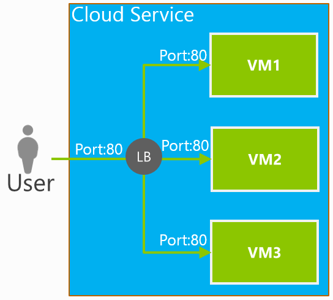

#### 5.2.3 选择最合适的虚拟机配置
<mark>首先请读者注意，传统的虚拟机化技术，CPU 是共享的。Azure 虚拟机，除了 A0 的虚拟机类型，它的 CPU 是和别的用户共享的。其他类型的虚拟机，比如 A1-A7，它的 CPU 是独占的，不是和别的用户共享的。</mark>

如[第 4.4.2 章](/documentation/articles/azure-Iaas-user-manual-part1#section_4_4_2)，Azure 虚拟机分为 A 系列和 D 系列，并且拥有不同的 CPU 和内存配置。

如果客户在传统 IDC 托管中已经部署了硬件服务器。则在 Azure 平台选择最接近的 Azure 虚拟机配置即可。

如果客户需要部署新的应用，则需要根据并发、性能等多个因素，选择最合适的 Azure 虚拟机配置。

另外说明一下 A 系列虚拟机和 D 系列虚拟机的区别：

1.	相比 A 系列单台 VM 最大 8Core/56GB RAM 的配置，D 系列虚拟机单台最大的配置为 16Core/112GB RAM
2.	D 系列的 CPU 性能比 A 系列提升约 60%

其他内容，请参考[第 4.4.2 章](/documentation/articles/azure-Iaas-user-manual-part1#section_4_4_2)。

#### 5.2.4 规划好高可用(非常重要)
在 Azure 虚拟机中，用户也可以选择使用一台 Azure 虚拟机部署 AD Server，一台 Azure 虚拟机部署 Web 应用程序，使用另一台虚拟机部署 SQL Server。<mark>但是这样的场景是没有服务级别协议保障的。</mark>

Azure 虚拟机承诺的 99.95% 的服务级别协议是需要 2 台或者 2 台以上的 Azure 虚拟机同时运行，且所有的虚拟机都需要在同一个可用性集中。对于上面实例，用户如果想在 Azure 中实现 99.95% 的服务级别协议，需要同时部署：

1.	两台 AD Server 虚拟机，放在同一个<mark>可用性集 A</mark> 中。
2.	两台 Web Server 虚拟机，放在另外一个<mark>可用性集 B</mark> 中。
3.	两台 SQL Server 虚拟机，采用 SQL Server 2012 Enterprise 提供的 Always-On 功能，实现高可用性(High Availability)。且 SQL Server 所在的虚拟机需要在另外一个<mark>可用性集C</mark>中。
4.	将具有相同功能的多台VM放置在同一个可用性集下。

这边还需要强调一下:

1.	<mark>可用性集 A</mark> 中的两台 AD Server 中的内容配置必须完全一致，并且需要进行 AD 的同步。
2.	<mark>可用性集 B</mark> 中的两台 Web Server 中的网站在部署的时候，内容必须完全一致。
3.	<mark>可用性集 C</mark> 中的两台 SQL Server 必须配置 SQL Server Always-On 或者 SQL Mirroring，保证数据库之间的<mark>日志同步</mark>

对于 DB Server，比如 SQL Server 或者 MySQL，需要在两台 DB Server 进行日志同步：

1.	SQL Server 需要在两台 VM 配置 Always-On 或者 SQL Mirroring，使用<mark>日志同步</mark>
2.	My SQL 可以配置 Master-Slave，使用 Replication 进行复制。
3.	<mark>这样的目的是保证在其中一台 Server 宕机的情况下，另外一台 Server 可以正常运行，因为配置了日志同步，可以保证日志不会丢。</mark>
4.	<mark>另外还要强调一下，客户端如果调用 SQL Server 服务的时候，需要正确配置 AG Listener，这样保证在一台 SQL Server 宕机的情况下，AG Listener 可以将请求自动发送到另外一台 SQL Server 上。</mark>

#### 5.2.5 规划好 Azure 订阅(非常重要)
订阅是进行 Azure 账单分拆的最小单位。

如果企业内部需要进行内部成本核算，例如 IT 部门、销售部门、市场部门均需要使用 Azure，并且根据不同的部门的 Azure 实际使用量进行内部成本核算，就需要实现规划好三个不同的 Azure 订阅。在创建 Azure IaaS 相关资源的时候，将这些资源创建在不同的订阅下。

关于订阅相关的内容，请参考[《Azure 企业门户管理手册》](/documentation/articles/azure-ea-portal-user-manual)

#### 5.2.6 选择订阅(非常重要)
我们登陆 Azure [管理门户](https://manage.windowsazure.cn))，输入账户和密码。

点击右上角的订阅按钮，如下图:

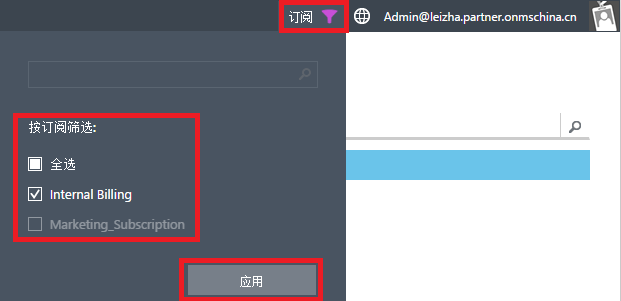

我们就可以筛选一个或者多个订阅。

在一般情况下，建议选择一个订阅，这样就可以把所有的 Azure 源创建到这个订阅下。

本文所有的 demo 内容，就会创建到 Marketing_Subscription 这个订阅下。

#### 5.2.7 查看该订阅中可使用的 Azure 资源
如果您使用的是<mark>测试账户</mark>，只能有一个订阅，该订阅默认情况下可以使用的 Azure 资源为

1.	计算能力：20 Core
2.	Host Service： 即 DNS 地址，4个
3.	存储账号：4个

如果<mark>测试账户</mark>在测试过程中，需要的 Azure 资源超出测试账号默认提供的资源，请通过 Azure 销售团队，<mark>联系 Azure PMM Bill Jin</mark>。在 Bill 批准的情况下，再联系[世纪互联支持团队](/support/contact)，请世纪互联在后台将测试账户的订阅进行扩大。

如果您使用的是正式账户，可以创建无限多个订阅。新创建的 Azure 订阅默认可以使用的 Azure 资源为：

1.	计算能力：100 Core
2.	Host Service： 即 DNS 地址，20 个
3.	存储账号：20 个

如果<mark>正式账户</mark>在使用过程中，需要的Azure资源超出订阅默认的 Azure 资源，<mark>请不要联系 PMM Bill Jin</mark>。请直接联系世纪互联支持团队，世纪互联会先审核相关请求，然后会将该订阅的相关资源进行扩大。

举个例子，比如 Contoso 公司需要在月底进行一次大型的 Digital Campaign 促销活动，需要使用 300个CPU Core，则可以提前联系世纪互联支持团队，让世纪互联运维团队将默认的 100 CPU Core 提升到 300个。

[世纪互联支持团队](/support/contact)

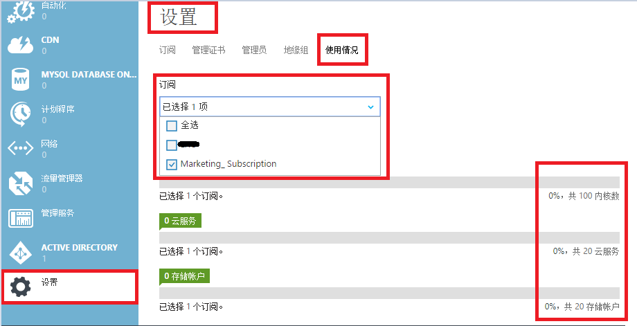

上图中，我们登陆 Azure [管理门户](https://manage.windowsazure.cn)，点击上图中的”设置”，”使用情况”，”选择订阅”，就可以查看到该订阅可以使用的Azure资源情况。

上图中，订阅名称为 ”Marketing_Subscription” 可以使用的 Azure 资源为

1.	100 个 CPU Core
2.	20 个 Cloud Service
3.	20 个 Storage Account

### 5.3 创建 Azure 虚拟机
#### 5.3.1 说明
我们在创建 Azure 服务的时候，可以通过以下两种方式来创建

1.	使用 Azure [管理门户](https://manage.windowsazure.cn)

	优势：
	* (1)	可以通过用户界面的方式，创建相应的 Azure 虚拟机，方便简单。

	劣势：
	* (1)	某些 Azure 虚拟机的高级功能，比如固定内网 IP，固定公网 IP，设置虚拟机时区等，都需要借助于 Azure PowerShell。Azure 管理界面不具备相应的功能。
	* (2)	当用户需要批量创建 Azure 虚拟机，批量配置虚拟机端口等，通过 Azure 管理界面就非常麻烦。

2.	我们可以使用 Azure PowerShell，创建 Azure 虚拟机。

	Azure PowerShell 可以批量创建虚拟机，其他高级功能也需要通过 Azure PowerShell 来进行配置。

	关于 Azure PowerShell 的详细内容，请参考[第 5.5 章](#section_5_5)内容。

#### 5.3.2 规划
在我们创建 Azure 虚拟机之前，首先需要对 Azure 虚拟机进行规划。规划主要分为：

1.	创建虚拟网络，规划虚拟机的内网 IP 地址和 IP Rang
2.	创建存储账号
3.	选择虚拟机的操作系统及配置

针对这次模拟场景，我们需要规划以下内容:

1.	数据中心选择中国东部
2.	虚拟网络

	* (1)	我们创建 Azure 虚拟网络，命名为 ContosoVNet，同时设置虚拟网络的 IP Rang 为10.0.0.0 - 10.0.3.255
	* (2)	设置 3 个 Sub-net

		<mark>AD-Subnet，IP Rang为10.0.0.0 – 10.0.0.255</mark>

		<mark>Web-Subnet，IP Rang为10.0.1.0 – 10.0.1.255</mark>

		<mark>DB-Subnet，IP Rang为10.0.2.0 – 10.0.2.255</mark>

3.	在中国东部创建 2 个存储账号 <mark>contosostor1</mark> 和 <mark>contosostor2</mark>
4.	创建 6 台 Azure 虚拟机

<table border="1">
<tr>
<td>角色	AD</td>	<td>Server</td>	<td>Web Server</td>	<td>DB Server</td>
</tr>
<tr>
<td>操作系统</td>	<td>Server 2012 Eng</td>	<td>Server 2012 Eng</td>	<td>Server 2012 Eng with SQL Enterprise</td>
</tr>
<tr>
<td>虚拟机类型</td>	<td>D2</td>	<td>D2</td>	<td>D2</td>
</tr>
<tr>
<td>虚拟机数量</td>	<td>2台</td>	<td>2台</td>	<td>2台</td>
</tr>
<tr>
<td>虚拟机名称</td>	<td>ContosoAD01 ContosoAD02</td>	<td>ContosoWeb01 ContosoWeb02</td>	<td>ContosoDB01 ContosoDB02</td>
</tr>
<tr>
<td>云服务名称</td>	<td>ContosoADCS</td>	<td>ContosoWebCS</td>	<td>ContosoDBCS</td>
</tr>
<tr>
<td>存储账号</td>	<td><mark>contosostor1</mark></td>	<td><mark>contosostor1</mark></td>	<td><mark>contosostor2</td>
</tr>
<tr>
<td>虚拟网络子网</td>	<td><mark>AD-Subnet</mark></td>	<td><mark>Web-Subnet</mark></td>	<td><mark>DB-Subnet</mark></td>
</tr>
<tr>
<td>内网IP</td>	<td>10.0.0.4 10.0.0.5</td>	<td>10.0.1.4 10.0.1.5</td>	<td>10.0.2.4 10.0.2.5</td>
</tr>
<tr>
<td>可用性集</td>	<td>ADAvbSet</td>	<td>WebAvbSet</td>	<td>DBAvbSet</td>
</tr>
<tr>
<td>用户名</td>	<td>AzureAdmin</td>	<td>AzureAdmin</td>	<td>AzureAdmin</td>
</tr>
<tr>
<td>密码</td>	<td>Contoso!000</td>	<td>Contoso!000</td>	<td>Contoso!000</td>
</tr>
</table>

我们会在接下来几章详细介绍如何创建 Azure 虚拟机。

### 5.4 使用 Azure 管理界面创建虚拟机
我们登陆 Azure [管理门户](https://manage.windowsazure.cn/))，输入相应的 Azure 账户名称和密码。

#### 5.4.1 创建虚拟网络(非常重要)
1.	在 Azur e管理界面的左下角，点击”新建”按钮。如下图:

	

2.	在弹出的窗口中，点击”网络服务”，”虚拟网络”，”自定义创建”。如下图:

	

3.	在弹出的窗口中，将名称命名为 ContosoVNet，位置我们选择”中国东部”

	

4.	下一步，设置 DNS 地址：

	

	注意，因为我们需要使用 AD Server，这里的 DNS 就是 AD Server 的内网IP地址。

	<mark>注意: 在 Azure 云环境，Azure 虚拟机的 Private IP，DNS Server 都必须通过虚拟网络来设置。我们不可以通过远程桌面连接 (Remote Desktop)，来修改 Azure 虚拟机的本地 TCP/IP 地址。如果这样操作的话，Azure 虚拟机会运行不正常。</mark>

	<mark>如果用户场景不需要设置 AD 服务器，则 DNS 服务器配置页面可以不输入任何信息，直接选择下一步。</mark>

5.	最后，我们设置虚拟网络的 IP Rang 和 Subnet。如下图：

	

	上图中：
	* (1)	IP Range 为 10.0.0.0 – 10.0.3.255
	* (2)	子网 AD-Subnet 的 IP Range 为 10.0.0.0 – 10.0.0.255。<mark>注意每个子网的前 4 个 IP 是 Azure 系统保留的，对于 AD-Subnet 来说，可用的 IP Range 为 10.0.0.4 – 10.0.0.255</mark>
	* (3)	子网 Web-Subnet 的 IP Range 为 10.0.1.0 – 10.0.1.255。同上，<mark>该子网实际可用的 IP Range 为 10.0.1.4 – 10.0.1.255</mark>。
	* (4)	子网 DB-Subnet 的 IP Rang 为 10.0.2.0 – 10.0.3.255。同上，<mark>该子网的实际可用 IP Rang 为 10.0.2.0 – 10.0.3.255</mark>。
	* (5)	定义了虚拟网络以后，我们创建的 Azure 虚拟机的内网 IP 地址，就是在虚拟网络中定义的可用地址范围和子网来定义的。

6.	创建完毕后，我们就可以在 Azure 管理界面上查看到我们创建成功的虚拟网络 ContosoVNet。如下图：

	

#### 5.4.2 创建存储账号
我们需要创建 2 个存储账号：<mark>contosostor1</mark> 和 <mark>contosostor2。注意存储账号的名称只能是小写英文字符。</mark>

1.	首先，在 Azure 管理界面的左下角，点击”新建”按钮。如下图:

	

2.	创建存储账号 contostor1，位置选择<mark>中国东部</mark>

	

	复制选项中，我们可以根据自身的需求，选择本地冗余或者地域冗余。

	<mark>注意: 从成本角度来说，地域冗余的成本会比本地冗余要贵。</mark>

3.	创建另外一个存储账号 contostor2，位置选择<mark>中国东部</mark>

	

	复制选项中，我们可以根据自身的需求，选择本地冗余或者地域冗余。

4.	这样我们在存储栏目里，就可以看到创建成功的两个存储账号，如下图:

	

	<mark>注意：一个 Azure 存储账号的 IOPS 上限为 20000，考虑到每块磁盘的最大 IOPS 为 500，建议不要在同一个存储账号保存超过40块磁盘。</mark>

#### 5.4.3 创建虚拟机说明
在上面的章节中，我们创建了如下内容：

1.	虚拟网络，设置了虚拟内网的 IP Rang 和 DNS 地址
2.	存储账号，设置了虚拟机所在的 VHD 文件保存的数据中心的物理位置及文件的冗余性
接下来的内容，就是创建相应的虚拟机了。
我们会依次创建如下虚拟机：
1.	2 台 AD 服务器，2 台服务器使用同一个云服务，名称为 ContosoADCS
2.	2 台 Web 服务器，使用同一个云服务，名称为 ContosoWebCS
3.	2 台 SQL Server 服务器，使用同一个云服务，名称为 ContosoDBCS

从 Azure 虚拟机的角度来说，云服务只是一个 DNS，概念上可以理解为一个容器。这个容器可以同时容纳一个或者多个虚拟机。如下图:

当我们新建一个虚拟机的时候，因为不存在容纳这个虚拟机的容器，所以 Azure 会默认创建一个新的 Cloud Service，然后将虚拟机加入到这个容器当中去。

当我们创建第 2 个虚拟机的时候，可以复用这个 Cloud Service，然后将第 2 个虚拟机加入到这个 Cloud Service 里。

<mark>从负载均衡和高可用两个角度来说，强烈建议，将 2 台或者 2 台以上具有同样功能的虚拟机，创建在同一个 Cloud Service云服务下。</mark>

#### 5.4.4 使用管理界面创建 Azure 虚拟机

##### 5.4.4.1 注意事项(非常重要)
我们在开始创建 Azure 虚拟机之前，已经定义了虚拟机网络。在虚拟机网络配置页面里，我们创建了 3 个子网 (Subnet)。并且定义了每个子网的 IP Rang。如下图：

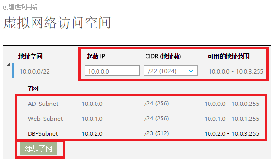

接下来，我们需要创建不同的 Azure 虚拟机，并且将虚拟机加入上面定义的虚拟网络。

注意：

1.	上图中，IP Rang 为 10.0.0.0 – 10.0.0.255
2.	子网 AD-Subnet 的 IP Range 为 10.0.0.0 – 10.0.0.255。<mark>注意每个子网的前 4 个 IP 是 Azure 系统保留的，对于 AD-Subnet 来说，可用的 IP Range 为 10.0.0.4 – 10.0.0.255</mark>
3.	子网 Web-Subnet 的 IP Range 为 10.0.1.0 – 10.0.1.255。<mark>同上，该子网实际可用的 IP Range 为 10.0.1.4 – 10.0.1.255。</mark>
4.	子网 DB-Subnet 的 IP Rang 为 10.0.2.0 – 10.0.3.255。<mark>同上，该子网的实际可用 IP Rang 为 10.0.2.0 – 10.0.3.255。</mark>
5.	定义了虚拟网络以后，我们创建的 Azure 虚拟机的内网 IP 地址，就是在虚拟网络中定义的可用地址范围和子网来定义的。

>[AZURE.NOTE]
>使用 Azure 管理界面创建的虚拟机，是无法固定内网 IP 地址的。必须通过 Azure PowerShell，才能固定虚拟机的内网 IP 地址。

在 Azure 云平台是没有 DHCP 这个概念的。如果我们将第一台虚拟机 VM01，<mark>通过管理界面进行创建</mark>，加入到 AD-Subnet 的话，这台虚拟机 VM01 会自动获得第一个可用的内网 IP (Private IP)，为 10.0.0.4。

如果我们在第一台虚拟机 VM01 不关机的情况下。再次通过<mark>管理界面</mark>继续创建第 2 台虚拟机 VM02，同样加入到 AD-Subnet。因为 10.0.0.4 这个 IP 被第一台虚拟机 VM01 占用。所以第 2 台虚拟机 VM02 自动获得下一个可用的内网 IP 地址，为 10.0.0.5。

如果 VM01, VM02 都不关机的情况下，则第 3 台新创建的虚拟机 VM03 加入到 AD-Subnet 的 Azure 虚拟机自动获得下一个可用的内网 IP 地址为 10.0.0.6。

还有一个问题需要读者注意。如果我们在上面创建的 3 台虚拟机，<mark>通过管理界面关机了，则这些内网IP地址会被释放</mark>。经过一段时间后，第一个通过管理界面开机的虚拟机(无论是 VM01，VM02，VM03)，会自动获得第一个可用的 IP 地址。

假设我们将虚拟机通过管理界面关机。经过一段时间后，将 VM03 首先通过管理界面开机，则 VM03 会自动获得第一个可用的内网 IP 地址，为 10.0.0.4。

>[AZURE.IMPORTANT]
>如果您通过管理界面创建 Azure 虚拟机，通过管理界面开关虚拟机，内网 IP 地址会变化。

如果读者需要固定内网 IP 地址，请直接阅读[第 5.5 章](#section_5_5)，<mark>只有通过 PowerShell 创建的虚拟机，内网 IP 地址才是固定的</mark>。

>[AZURE.IMPORTANT]
>使用管理界面创建的 Azure 虚拟机，默认时区是 UTC 时区。而我们平时使用的市区是 UTC+8 (北京时区)。

##### 5.4.4.2 创建第一台 AD Server
根据我们在 [5.3.2 节](#section_5_3_2)的规划，我们需要创建 2 台 Azure AD Server，配置如下：

<table border="1">
<tr>
角色	AD Server
</tr>
<tr>
<td>操作系统</td>	<td>Server 2012 Eng</td>
</tr>
<tr>
<td>虚拟机类型</td>	<td>A2</td>
</tr>
<tr>
<td>虚拟机数量</td>	<td>2台</td>
</tr>
<tr>
<td>虚拟机名称</td>	<td>ContosoAD01 ContosoAD02</td>
</tr>
<tr>
<td>云服务名称</td>	<td>ContosoADCS</td>
</tr>
<tr>
<td>存储账号</td>	<td><mark>contosostor1</mark></td>
</tr>
<tr>
<td>虚拟网络子网</td>	<td><mark>AD-Subnet</mark></td>
</tr>
<tr>
<td>内网IP</td>	<td>10.0.0.4 10.0.0.5</td>
</tr>
<tr>
<td>可用性集</td>	<td>ADAvbSet</td>
</tr>
<tr>
<td>用户名</td>	<td>AzureAdmin</td>
</tr>
<tr>
<td>密码</td>	<td>CONTOSO!000</td>
</tr>
</table>

我们首先创建第一台 AD Server。步骤如下：

1.	在 Azure [管理门户](https://manage.windowsazure.cn/))。选择新建，计算，虚拟机，从库中。如下图：

	

2.	镜像我们选择 Windows Server 2012 R2 Datacenter (en-us)

	

3.	设置虚拟机配置

	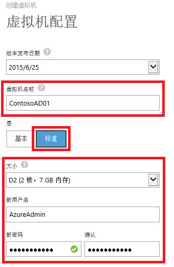

	上图中，我们设置虚拟机名称为 ContosoAD01，虚拟机类型为标准。虚拟机配置为 D2 (2Core/7GB)。用户名密码按照之前的规划进行设置。

4.	在接下来配置文件里，我们输入以下信息：

	

	在上面的图片中，我们需要注意以下内容
	* (1)	因为我创建的是第一台 AD 服务器，所有选择<mark>创建新的云服务</mark>
	* (2)	在 DNS 名称中，输入自定义的 DNS 名称 <mark>ContosoADCS</mark>
	* (3)	在虚拟网络中，选择我们之前创建的虚拟机网络名称 <mark>ContosoVNet</mark>
		 选择对应的虚拟网络子网 <mark>AD-Subnet</mark>
	* (4)	存储账户，我们选择之前创建的存储账号 <mark>contosostor1</mark>
	* (5)	可用性集，因为我们创建新云服务，所以我们<mark>创建新的可用性集</mark>，命名为 <mark>ADAvbSet</mark>

	在配置页面的下方，还会指定终节点，我们使用系统默认设置。

	

	关于终结点的内容，我们会在[第 6 章](/documentation/articles/azure-Iaas-user-manual-part3#section_6)做详细的介绍。

5.	最后我们点击确认，这样就完成创建第一个 AD Server。在虚拟机创建列表中就会显示”正在启动(正在配置)”

	

	>[AZURE.NOTE]
	>注意：在客户点击创建的时间点，Azure 就开始计费。而不是等到虚拟机创建完毕才开始计费。

 

1.	我们等待 ContosoAD01 这台虚拟机创建完毕，状态为”正在运行”。

	然后点击虚拟机名称，如下图红色区域：

	

2.	点击后，页面会进行跳转。我们可以查看到 ContosoAD01 这个虚拟机的配置信息。如下图:

	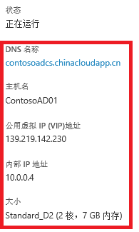

	里面的 DNS 名称，主机名称和虚拟机大小，就是我们在创建虚拟机的配置页面里进行配置的。

	注意：内部 IP 地址是从 AD-Subnet 子网中获得第一个有效 IP，为 10.0.0.4

##### 5.4.4.3 创建第二台AD Server
我们创建完第一台 AD Server 之后，从高可用的角度来说，我们需要创建第 2 台 AD Server。步骤如下：

1.	选择新建，计算，虚拟机，从库中。如下图：

	

2.	镜像我们选择 Windows Server 2012 R2 Datacenter (en-us)

	

3.	设置虚拟机配置。注意虚拟机名称命名为 ContosoAD02

	

4.	在接下来配置文件里，我们输入以下信息：

	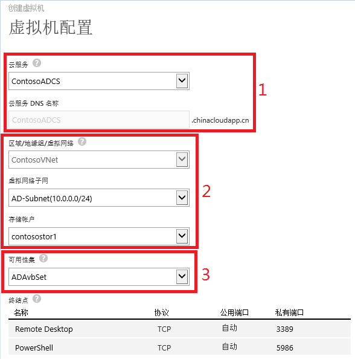

	注意，我们创建的第 2 台 AD Server 中，与第一台配置稍有不同:
	* (1)	复用之前我们已经创建的云服务 ContosoADCS
	* (2)	选择对应的虚拟网络和存储账户
	* (3)	选择我们之前已经创建的可用性集 ADAvbSet。

##### 5.4.4.4 观察 AD Server
等待第 2 台虚拟机创建完毕，状态变为”正在运行”。然后我们观察一下 Azure 管理界面。

上图中，我们可以发现：

1.	在初始状态，虚拟机和云服务的数量都是 0
2.	我们创建第 1 台 AD Server 的时候，新建了一个云服务，同时新建了一个虚拟机。此时虚拟机和云服务的数量都是 1
3.	然后我们创建第 2 台 AD Server，复用之前创建的云服务。所以虚拟机数量为 2，云服务数量是 1。

在[第 5.4.3 章](#section_5_4_3)中说明过：

从 Azure 虚拟机的角度来说，云服务只是一个 DNS，概念上可以理解为一个容器。这个容器可以同时容纳一个或者多个虚拟机。如下图:

<mark>从高可用的角度来说明，我们在创建虚拟机的时候，创建并指定了高可用集。如下图的红色部分区域 3 的内容。</mark>

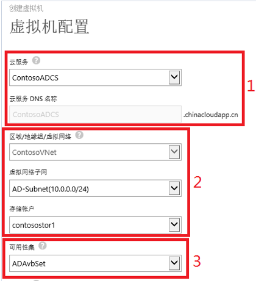

我们必须把在同一个云服务下的多台 Azure 虚拟机，保存在同一个可用性集下。

这样，多台 Azure 虚拟机是部署在不同的 RACK 上的。

我们点击云服务，选择之前创建的云服务 ContosoADCS，然后选择实例。如下图:

上图中，ContosoAD01 和 ContosoAD02 是在不同的容错域上，分别是 0 和 1。则这 2 台虚拟机是不是在不同的 RACK 上，保证高可用。

##### 5.4.4.5 创建 Web Server
我们创建的 Web Server 信息如下：

<table border="1">
<tr>
<td>角色</td>	<td>Web Server</td>
</tr>
<tr>
<td>操作系统</td>	<td>Server 2012 Eng</td>
</tr>
<tr>
<td>虚拟机类型</td>	<td>D2</td>
</tr>
<tr>
<td>虚拟机数量</td>	<td>2台</td>
</tr>
<tr>
<td>虚拟机名称</td>	<td>ContosoWeb01 ContosoWeb02</td>
</tr>
<tr>
<td>云服务名称</td>	<td><mark>ContosoWebCS</mark></td>
</tr>
<tr>
<td>存储账号</td>	<td><mark>contosostor1</mark></td>
</tr>
<tr>
<td>虚拟网络子网</td>	<td>Web-Subnet</td>
</tr>
<tr>
<td>内网IP</td>	<td>10.0.1.4 10.0.1.5</td>
</tr>
<tr>
<td>可用性集</td>	<td>WebAvbSet</td>
</tr>
<tr>
<td>用户名</td>	<td>AzureAdmin</td>
</tr>
<tr>
<td>密码</td>	<td>Contoso!000</td>
</tr>
</table>

注意：

1.	我们在<mark>创建第一台 Web Server</mark> 的时候，需要创建新的云服务。如下图:

	

2.	我们在创建<mark>第 2 台 Web Server</mark> 的时候，需要注意:

	* (1)	复用之前我们已经创建的云服务ContosoWebCS
	* (2)	选择对应的虚拟网络和存储账户，注意子网为Web-Subnet
	* (3)	选择我们之前已经创建的可用性集WebAvbSet。

	如下图：

	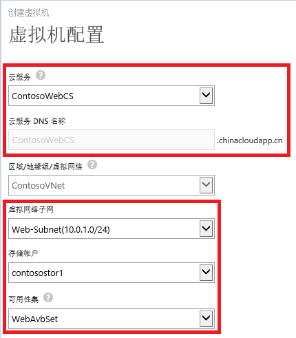

注意创建 Web Server 的先后顺序，第1个创建成功的 Web Server ContosoWeb01，会从子网 Web-Subnet 中，自动获得第一个可用的内网 IP，为 10.0.1.4。第 2 个创建成功的 ContosoWeb02，会自动获得第 2 个可用的内网 IP，地址为 10.0.1.5。

##### 5.4.4.6 创建 SQL Server 虚拟机(非常重要)
然后我们快速创建 SQL Server。配置信息如下表:

<table border="1">
<tr>
<td>角色</td>	<td>DB Server</td>
</tr>
<tr>
<td>操作系统</td>	<td>Server 2012 Eng with SQL Enterprise</td>
</tr>
<tr>
<td>虚拟机类型</td>	<td>D2</td>
</tr>
<tr>
<td>虚拟机数量</td>	<td>2台</td>
</tr>
<tr>
<td>虚拟机名称</td>	<td>ContosoDB01 ContosoDB02</td>
</tr>
<tr>
<td>云服务名称</td>	<td>ContosoDBCS</td>
</tr>
<tr>
<td>存储账号</td>	<td><mark>contosostor2</mark></td>
</tr>
<tr>
<td>虚拟网络子网</td>	<td><mark>DB-Subnet</mark></td>
</tr>
<tr>
<td>内网IP</td>	<td>10.0.2.4 10.0.2.5</td>
</tr>
<tr>
<td>可用性集</td>	<td>DBAvbSet</td>
</tr>
<tr>
<td>用户名</td>	<td>AzureAdmin</td>
</tr>
<tr>
<td>密码</td>	<td>Contoso!000</td>
</tr>
</table>

第 1 台 Web Server 的截图信息：

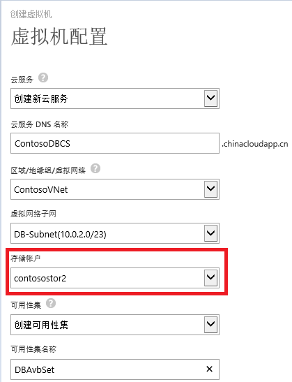

注意，上图中，我们用的存储账户和之前的 AD Server，Web Server 不同。我们指定的 contosostor2，这个新的存储账号。

<mark>建议用户在创建 Azure 虚拟机的时候，不要把所有的虚拟机都保存在同一个存储账号里。因为 1 个存储账号是有 IOPS 上限为 20000。</mark>

<mark>一般来说，建议每 3 台虚拟机使用同一个存储账号，第 4 台虚拟机使用另外一个存储账号。</mark>

第 2 台 Web Server 的截图信息，如下图：

有关 SQL Server 虚拟机配置 Always-On 的文档，请参考 [文档](/documentation/articles/virtual-machines-windows-classic-ps-sql-alwayson-availability-groups)

##### 5.4.4.7 总结
一般情况下，创建 Azure 虚拟机之前需要做如下准备:

1.	创建虚拟机网络，设置 IP Rang 和 Subnet
2.	创建存储账号

<mark>使用管理界面创建 Azure 虚拟机的过程中，需要注意</mark>

1.	<mark>在创建过程中，具将 2 台或者 2 台以上具有同样功能的虚拟机，创建在同一个云服务下</mark>
2.	<mark>同样功能的虚拟机在创建的时候，需要指定子网 Subnet 和存储账号</mark>
3.	<mark>每 3 台虚拟机使用同一个存储账号</mark>
4.	<mark>需要指定可用性集</mark>
5.	<mark>管理界面创建的 Azure 虚拟机，内网 IP(Private IP) 不是固定的</mark>
6.	<mark>管理界面创建的 Azure 虚拟机，默认时区为 UTC 时区。</mark>

### 5.5 使用 Azure PowerShell 创建虚拟机
#### 5.5.1 说明
掌握好 Azure PowerShell 是非常重要的。主要原因有以下几点：

1.	某些 Azure 虚拟机的高级功能，比如固定内网 IP，固定公网 IP，设置虚拟机时区等，都需要借助于 Azure PowerShell。Azure 管理界面不具备相应的功能。
2.	当用户需要批量创建 Azure 虚拟机，批量配置虚拟机端口等，通过 Azure 管理界面就非常麻烦。

#### 5.5.2 配置PowerShell
1.	我们在 Azure China [官方网站](/downloads)，安装 Azure PowerShell。如下图：

	

2.	安装完毕后，我们以管理员身份运行Azure PowerShell。如下图：

	

3.	<mark>如果你是第一次运行 Azure PowerShell</mark>，需要在本地创建证书文件。以便本地计算机和 Azure 建立可靠的安全连接。请在 Azure PowerShell 输入以下命令：

		Get-AzurePublishSettingsFile -Environment AzureChinaCloud

	输入命令后，计算机会弹出新的浏览器窗口，导航至 Azure China 网站，并要求我们输入 Org ID 和密码进行登陆

4.	如果在运行 Azure PowerShell 之后报错，错误信息为系统上禁止运行脚本，请在 PowerShell 中执行

		Set-ExecutionPolicy -ExecutionPolicy Unrestricted

5.	登陆完毕后，系统会要求我们保存扩展名为 publishsettings 的文件，我们保存至本地计算机 (这里保存在 D 盘上)。如下图:

	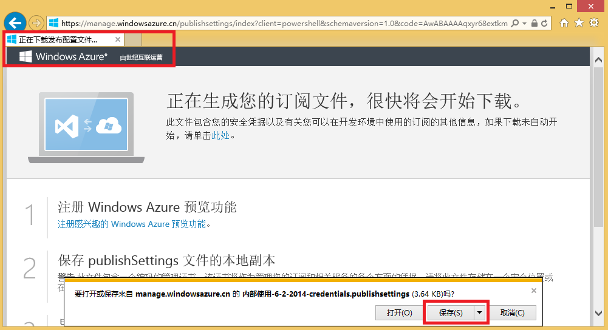

6.	然后我们回到 Azure PowerShell 窗口，继续输入以下命令

		Import-AzurePublishSettingsFile <PathToFile>

	PathToFile 就是我们保存步骤 4 中扩展名为 publishsettings 的文件位置(文件路径+文件名)，比如我将该文件保存至 D 盘根目录，我们就输入以下命令：

		Import-AzurePublishSettingsFile 'D:\内部使用-6-2-2014-credentials.publishsettings'

	上面的命令实际上是将本地的 publishsettings 文件上传至 Azure China 的 Management Certificates。我们可以打开[管理门户](https://manage.windowsazure.cn)。点击设置，并选择管理证书，查看上传的publishsettings文件。如下图：

	

7.	这样，本地计算机就和 Azure China 建立了可靠安全的链接了。在不删除上传的 Management Certificates 情况下，下次运行 Azure PowerShell 将不必再次运行上面的运行。接下来可以运行我们的命令了。

	比如输入命令 Get-AzureSubscription，可以查看到当前的订阅

	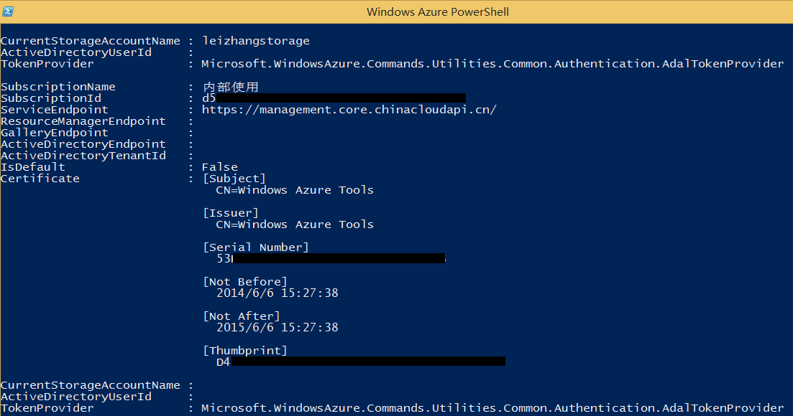

#### 5.5.3 使用 PowerShell 创建 Windows VM
>[AZURE.NOTE]
>本节所有的 Azure PowerShell，在执行的时候请不要用换行符。请复制到记事本后，根据自己的情况，修改相应的参数。

首先，请读者<mark>预先准备</mark>以下内容：

1.	创建虚拟网络并配置 IP Rang，Subnet
2.	创建存储账号
3.	如果已经通过Azure管理界面创建虚拟机，请先<mark>删除所有的虚拟机和云服务。释放相关的资源。</mark>

读者还必须了解以下内容：

1.	了解订阅的相关知识
2.	云服务 Cloud Service
3.	虚拟机名称
4.	虚拟网络、子网

首先假设账户存在多个订阅的情况下，我们需要浏览订阅：

1.	使用命令 Get-AzureSubscription，通过 PowerShell 查看多个订阅，如下图:

	

	上图中，可以查看到，这里的 Azure PowerShell已经关联两个订阅，分为别POC和Internal Billing。

2.	在某些情况下，我们要设置默认的订阅，那么我们可以执行以下命令：

		Select-AzureSubscription "<SubscriptionName>" –Default

	比如设置 POC 这个订阅为默认订阅，我们就执行以下命令：

		Select-AzureSubscription "POC" –Default

	然后我们重新执行 Get-AzureSubscription，可以看到 POC 这个订阅，IsDefault 属性为 True。
　
	即 POC 这个订阅被设置为了默认的订阅

	

3.	在某些时候，我们需要在多个订阅之前进行切换。我们可以执行以下命令

		Select-AzureSubscription "<SubscriptionName>" –Current

	这样，可以把某个订阅设置为当前的订阅。

我们以 AD Server 为例，使用 Azure PowerShell 创建 AD01 和 AD02

<table border="1">
<tr>
角色	AD Server
</tr>
<tr>
<td>操作系统</td>	<td>Server 2012 Eng</td>
</tr>
<tr>
<td>虚拟机类型</td>	<td>D2</td>
</tr>
<tr>
<td>虚拟机数量</td>	<td>2台</td>
</tr>
<tr>
<td>虚拟机名称</td>	<td>ContosoAD01 ContosoAD02</td>
</tr>
<tr>
<td>云服务名称</td>	<td>ContosoADCS</td>
</tr>
<tr>
<td>存储账号</td>	<td><mark>contosostor1</mark></td>
</tr>
<tr>
<td>虚拟网络子网</td>	<td><mark>AD-Subnet</mark></td>
</tr>
<tr>
<td>内网IP</td>	<td>10.0.0.4 10.0.0.5</td>
</tr>
<tr>
<td>可用性集</td>	<td>ADAvbSet</td>
</tr>
<tr>
<td>用户名</td>	<td>AzureAdmin</td>
</tr>
<tr>
<td>密码</td>	<td>Contoso!000</td>
</tr>
</table>

我们在按照上面的配置，通过 PowerShell 创建 2 台 AD Server，同时指定这 2 台 AD Server 的时区为 UTC+8 北京时区。

1.	设置当前订阅的存储账号

	<pre><code>Set-AzureSubscription -SubscriptionName '<mark>[SubscriptionName]</mark>' -CurrentStorageAccount '<mark>[StorageName]</mark>'</code></pre>

	以本文为例，实际的 PowerShell 命令为

	<pre><code>Set-AzureSubscription -SubscriptionName '<mark>Marketing_Subscription</mark>' -CurrentStorageAccount '<mark>contosostor1</mark>'</code></pre>

2.	设置当前订阅

	<pre><code>Select-AzureSubscription -SubscriptionName '<mark>[SubscriptionName]</mark>' –Current</code></pre>

	以本文为例，我们设置当前订阅的名称为：

	<pre><code>Select-AzureSubscription -SubscriptionName '<mark>Marketing_Subscription</mark>' –Current</code></pre>

3.	通过精确查询，查询到 Azure 虚拟机镜像

		$imageList = Get-AzureVMImage | where {$_.ImageName -eq "55bc2b193643443bb879a78bda516fc8__Windows-Server-2012-Datacenter-201506.01-en.us-127GB.vhd"}
		$image=$imageList[0]

	或者使用模糊查询，查询到某个虚拟机镜像

		$imageList = Get-AzureVMImage | where {$_.ImageName -like "*Windows-Server-2012-Datacenter*"}
		$image=$imageList[0]

4.	根据实际情况，修改下面的参数

		$ServiceName= "[虚拟机名称]"
		$VMSize= "[虚拟机大小]"
		$AvbSetName="[可用性集名称]"
		$adminusername="[虚拟机登录名]"
		$adminpassword="[虚拟机密码]"
		$SubnetName="[子网名称]"
		$PrivateIP="[内网IP地址]"
		$CloudServiceName="[云服务名称]"
		$VNetName="[虚拟网络名称]"
		$Location="[Azure数据中心]"

		New-AzureVMConfig -Name $ServiceName -InstanceSize $VMSize -ImageName $image.ImageName -AvailabilitySetName $AvbSetName ` | Add-AzureProvisioningConfig -Windows -AdminUsername $adminusername -Password $adminpassword -TimeZone 'China Standard Time' | Set-AzureSubnet -SubnetNames $SubnetName | Set-AzureStaticVNetIP -IPAddress $PrivateIP | New-AzureVM -ServiceName $CloudServiceName -VNetName $VNetName -Location $Location

	以创建第一台 ContosoAD01 为例，实际的 PowerShell 如下：

		$ServiceName= "ContosoAD01"
		$VMSize= "Standard_D2"
		$AvbSetName="ADAvbSet"
		$adminusername="AzureAdmin"
		$adminpassword="Contoso!000"
		$SubnetName="AD-Subnet "
		$PrivateIP="10.0.0.4"
		$CloudServiceName="ContosoADCS"
		$VNetName="ContosoVNet "
		$Location="China East"
		
		New-AzureVMConfig -Name $ServiceName -InstanceSize $VMSize -ImageName $image.ImageName -AvailabilitySetName $AvbSetName ` | Add-AzureProvisioningConfig -Windows -AdminUsername $adminusername -Password $adminpassword -TimeZone 'China Standard Time' | Set-AzureSubnet -SubnetNames $SubnetName | Set-AzureStaticVNetIP -IPAddress $PrivateIP | New-AzureVM -ServiceName $CloudServiceName -VNetName $VNetName -Location $Location

执行上面的 PowerShell，Azure PowerShell 会显示执行成功 Success，如下图:

我们打开 Azure 管理门户，会发现新创建的 ContosoAD01 显示为正在启动，如下图:

这样第一台 ContosoAD01 就算创建完毕了。

>[AZURE.IMPORTANT]
>不同于使用 Azure 管理界面创建，使用 PowerShell 创建 Azure 虚拟机，内网 IP 是固定的，而且创建的时候指定了时区为 UTC+8 北京时间。

我们可以创建第 2 台 ContosoAD02，使用相同的云服务，命令如下：

<pre><code>New-AzureVMConfig -Name '<mark>ContosoAD02</mark>' -InstanceSize '<mark>Standard_D2</mark>' -ImageName $image.ImageName -AvailabilitySetName '<mark>ADAvbSet</mark>' ` | Add-AzureProvisioningConfig -Windows -AdminUsername '<mark>AzureAdmin</mark>' -Password '<mark>Contoso!000</mark>' -TimeZone 'China Standard Time' | Set-AzureSubnet -SubnetNames '<mark>AD-Subnet</mark>' | Set-AzureStaticVNetIP -IPAddress '<mark>10.0.0.5</mark>' | New-AzureVM -ServiceName '<mark>ContosoADCS</mark>' -VNetName '<mark>ContosoVNet</mark>'</code></pre>

注意上面的黄色部分需要修改，而且创建第 2 台 ContosoAD02 的时候，复用云服务，所以最后的 Location 参数就不需要了。

这样 ContosoAD02 也创建好了，如下图：

#### 5.5.4 使用 PowerShell 创建 Linux VM
请参考[这篇博客](http://www.cnblogs.com/threestone/p/4360198.html)。

### 5.6 管理 Azure 虚拟机
#### 5.6.1 远程桌面连接 WindowsVM
我们选中在之前创建成功的 ContosoAD01 这台虚拟机，如下图：

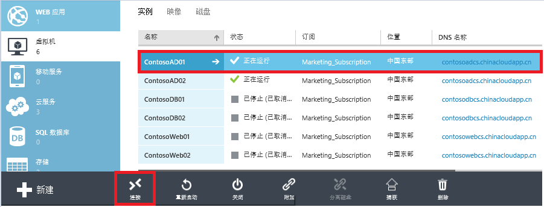

点击上图中的按钮，系统就会提示我们输入相应的用户名和密码进行登陆。我们输入用户名 AzureAdmin 和密码 Contoso!000。就会登陆到部署到Azure 数据中心的这台虚拟机上去了。如下图:

我们就可以通过远程桌面连接，在这台 Azure 虚拟机上安装和配置软件。

另外，我们在 ContosoAD01 这台虚拟机上，通过 CMD 执行 ipconfig /all 命令，可以看到如下信息：

<mark>虽然 ContosoAD01 这台虚拟机的 TCP/IPv4 的属性是自动获取，但是在 ipconfig 命令中，看到的 DNS 服务器是 10.0.0.4 和 10.0.0.5，这 2 个地址，恰恰是我们在 Azure 虚拟网络中预先设置好的。</mark>

<mark>而且其 IPV4 地址，是 10.0.0.4，这也是我们通过 PowerShell 创建 Azure 虚拟机时指定的。</mark>

<mark>这里再次强调一下，在 Azure 云环境，Azure 虚拟机的 Private IP，DNS Server 都必须通过虚拟网络来设置。我们不可以通过远程桌面连接 (Remote Desktop)，来修改 Azure 虚拟机的本地 TCP/IP 地址。如果这样操作的话，Azure 虚拟机会运行不正常。</mark>

#### 5.6.2 Linux SSH
假设 ContosoAD01 这台是 Linux 虚拟机，我们可以通过在本地安装 putty，通过 SSH 登陆。

我们点击下图的区域。如下图:

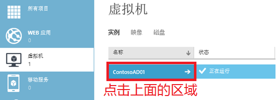

页面跳转到仪表板，然后我们查看相应的信息，如下图:

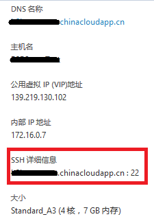

在上面的 SSH 详细信息中，获得 SSH 的地址。通过 Putty 工具，就可以 SSH 链接到该 Linux 虚拟机上。

#### 5.6.3 挂载磁盘
在 Windows 平台，Azure 虚拟机默认有两块磁盘：

1.	C 盘，操作系统盘，默认为 127GB
2.	<mark>D 盘，临时磁盘。只能用来保存临时文件，数据会有丢失的风险。</mark>

假设我们要挂载更多的磁盘，我们可以在 Azure [管理门户](https://manage.windowsazure.cn)，选中某一台虚拟机，然后点击附加空磁盘。如下图

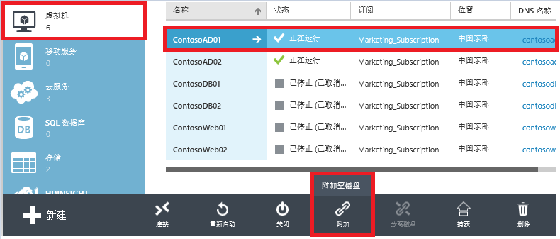

会弹出附加空磁盘信息，我们可以在这台虚拟机上，挂载新的 1-1023GB 的空磁盘。如下图：

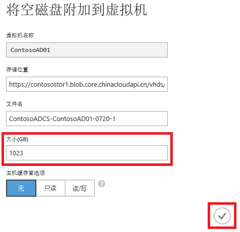

<mark>考虑到 Azure 磁盘空间是用多少算多少。强烈建议用户直接挂载 1023GB 的空磁盘。</mark>

磁盘挂载完毕后，我们通过远程桌面连接，计算管理中的磁盘管理，来重新格式化和分配相应的磁盘空间，如下图：

对于 A 系列虚拟机来说，可以挂载的磁盘数量如下:

<table border="1">
<thead>
<tr>
<th>虚拟机类型</th>	<th>CPU</th>	<th>内存</th>	<th>外挂磁盘数</th>	<th>IOPS</th>
</tr>
</thead>
<tbody>
<tr>
<td>A0</td>	<td>共享</td>	<td>768MB</td>	<td>1</td>	<td>500</td>
</tr>
<tr>
<td>A1</td>	<td>1</td>	<td>1.75GB</td>	<td>2</td>	<td>2 * 500</td>
</tr>
<tr>
<td>A2</td>	<td>2</td>	<td>3.5GB</td>	<td>4</td>	<td>4 * 500</td>
</tr>
<tr>
<td>A3</td>	<td>4</td>	<td>7GB</td>	<td>8</td>	<td>8 * 500</td>
</tr>
<tr>
<td>A4</td>	<td>8</td>	<td>14GB</td>	<td>16</td>	<td>16 * 500</td>
</tr>
<tr>
<td>A5</td>	<td>2</td>	<td>14GB</td>	<td>4</td>	<td>4 * 500</td>
</tr>
<tr>
<td>A6</td>	<td>4</td>	<td>28GB</td>	<td>8</td>	<td>8 * 500</td>
</tr>
<tr>
<td>A7</td>	<td>8</td>	<td>56GB</td>	<td>16</td>	<td>16 * 500</td>
</tr>
</tbody>
</table>

也就是说，A7 虚拟机可以挂载最多 16 块磁盘。每块磁盘最大容量为 1TB。

#### 5.6.4 存储账号中查看磁盘
从上面的图片中，我们可以看到，ContosoAD01 这台虚拟机在 Windows 远程桌面中可以查看到三块磁盘：

1.	C 盘，容量为 127GB
2.	D 盘，容量为 100GB
3.	未分配的磁盘，容量为 1023GB

我们又知道，ContosoAD01 这台虚拟机使用的存储账号为 <mark>contosostor1</mark>，我们实际上可以在这个存储账号里，查看到虚拟机所使用的 VHD 文件。

我们在 Azure 管理界面(http://)，选择存储，点击存储账号 contosostor1，如下图

页面跳转后，选择容器，点击 vhds。如下图:

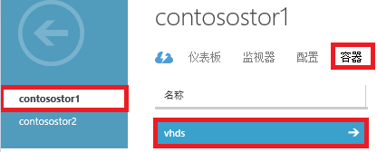

点击 vhds 以后，页面跳转。我们可以看到保存在该存储账号下面的 vhd 文件。文件是名称是按照<mark>[云服务]-[虚拟机名称]-[创建时间]</mark>来命名的。如下图:

上图中，127GB 这个 VHD 就是虚拟机 ContosoAD01 的 C 盘，1023GB 的 VHD 就是我们在上一步骤中，挂载的 1023GB 的磁盘。

注意：<mark>虚拟机所在的 D 盘 100GB 是临时磁盘，不会保存在存储账号中。</mark>保存在 D 盘的文件会有丢失的风险。

#### 5.6.5 Azure 临时磁盘(非常重要)
当我们执行完新挂载的磁盘的格式化操作后，在本地计算机就可以看到三块磁盘。如下图:

1.	C 盘，操作系统盘。默认为 127GB。重启数据不会丢失。
2.	D 盘，临时磁盘。只能用来保存临时文件，<mark>数据会有丢失的风险。这块盘的 IOPS 会比较高，我们可以把临时文件保存在这块盘上。</mark>
3.	E 盘，我们通过管理界面挂载上去的磁盘。最大容量为 1023GB。重启数据不会丢失。

#### 5.6.6 卸载磁盘
在某些情况下，我们需要卸载虚拟机的磁盘。这时候我们可以通过 Azure 管理界面，选择这台虚拟机。然后点击分离磁盘。如下图:

这样就可以把挂载的磁盘从这台 Azure 虚拟机分离了。

分离磁盘还有一个好处，比如我们需要在多台 Azure 虚拟机上安装软件，比如 Visual Studio。我们可以将 Visual Studio 保存在附加的磁盘上。

当第一台 VM 安装完毕后，我们可以将附加磁盘分离。然后挂载到第二台 VM 上继续安装。这样可以加快安装部署的速度。

<mark>请注意，附加磁盘不允许通过挂载多台 Azure 虚拟机上</mark>。如果有共享磁盘的需求，请使用 SMB 共享文件夹，具体请参考[这篇博客](http://www.cnblogs.com/threestone/p/4441388.html)。

#### 5.6.7 虚拟机关机(非常重要)
<mark>注意：我们通过远程桌面连接或者是 SSH，关闭 Azure 虚拟机，是会继续收取 Azure 计算费用的。</mark>

只有通过 Azure [管理门户](https://manage.windowsazure.cn)，选中相应的 Azure 虚拟机，并点击关闭按钮。如下图：

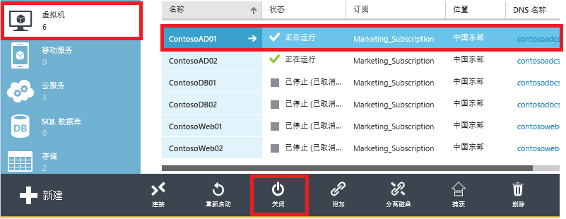

通过上面的操作后，Azure 虚拟机才不会继续收取计算费用。但是因为虚拟机所在的 VHD 文件还没有被删除。<mark>所以虽然不会收取计算费用，但是虚拟机磁盘的存储费用还是会继续收取的。</mark>

另外需要强调一点，当我们创建的 6 台虚拟机(每台配置为 2Core) <mark>都是开机状态</mark>的时候，总体 CPU 使用情况为 6*2=12 个核心。

我们可以在 Azure 设置，使用情况进行查看，如下图：

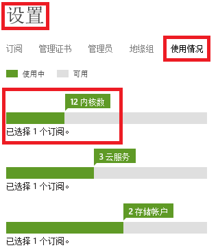

当我们关闭其中两台虚拟机的时候，总体 CPU 使用情况为 12-4=8 个核心。

如下图：

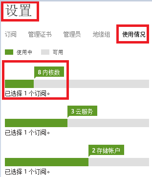

<mark>由此可见，Azure 订阅中可用的内核数是按照实际开机的虚拟机的数量，动态调整的</mark>。在某些时候，我们可以关闭不需要的虚拟机，释放可用的内核数。

举个例子，假设客户的测试订阅，默认情况只有 20 个内核数，最多只能创建 10 台，每台 2Core 的 Azure 虚拟机，总计 10*2=20Core。因为达到了可用 CPU 内核的上限，就不能再创建新的 Azure 虚拟机了。

假设需要再上另外一个系统，只能将之前创建的虚拟机关闭一部分，释放可用的 CPU 内核数才可以。

#### 5.6.8 删除 Azure 虚拟机
<mark>在这里特别强调一下，Azure 是没有回收站的概念的。删除虚拟机之前，必须确认该虚拟机里的文件已经做好备份。</mark>

当我们需要删除某台 Azure 虚拟机的时候，选中该台虚拟机。然后点击删除。如下图：

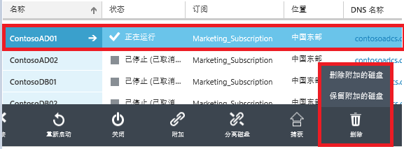

在上图中，删除有两个选项：

1.	删除附加的磁盘。<mark>在执行该步骤的时候需要谨慎。</mark>表示删除该虚拟机的时候，同时将虚拟机的 VHD 文件和所有挂载的磁盘都进行删除。这样虚拟机不会收取虚拟机计算费用，同时 VHD 文件被删除了，也不会收取 VHD 存储的费用。
2.	保留附加的磁盘。表示删除该虚拟机的时候，将虚拟机的 VHD 文件和所有外挂的磁盘保留。这些 VHD 文件将来可以继续使用。注意，虽然虚拟机删除了，不会收取虚拟机的计算费用。但是因为 VHD 文件保留了，<mark>还是会收取 VHD 的存储费用。</mark>

我们可以根据实际需求，执行相应的操作。

#### 5.6.9 虚拟机监控
Azure 虚拟机可以提供监控的功能，包括：

1.	CPU 使用率
2.	磁盘写
3.	磁盘读
4.	输入网络流量
5.	输出网络流量

我们可以点击某一台 Azure 虚拟机，如下图:

页面跳转，然后选择监视器，如下图：

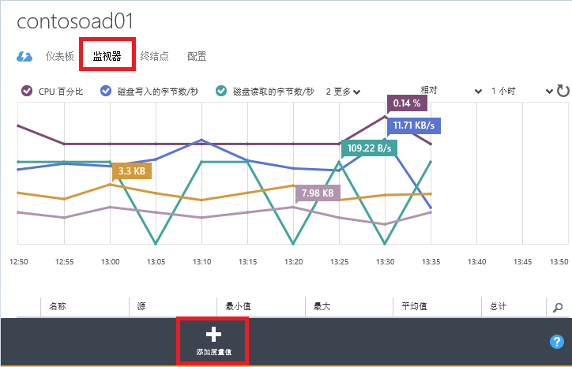

点击上图中的添加度量值，会弹出窗口，我们可以选择相应的监控指标。

另外，我们还可以在监控的窗口，选择相应的时间段。如下图：

就可以显示在过去 1 小时，24 小时或者是 7 天的范围内，该虚拟机的监控情况。

