<properties
	pageTitle="管理和监视 Azure 虚拟机备份 | Azure"
	description="了解如何管理和监视 Azure 虚拟机备份"
	services="backup"
	documentationCenter=""
	authors="trinadhk"
	manager="shreeshd"
	editor=""/>

<tags
	ms.service="backup" 
	ms.date="06/03/2016"
	wacn.date="07/11/2016"/>

# 管理和监视 Azure 虚拟机备份

> [AZURE.SELECTOR]
- [管理 Azure VM 备份](/documentation/articles/backup-azure-manage-vms)
- [管理 经典 VM 备份](/documentation/articles/backup-azure-manage-vms-classic)

本文将指导你如何管理虚拟机 (VM) 的备份，并对门户仪表板中提供的备份信息进行了说明。本文中的指导的适用范围是将 VM 用于恢复服务保管库。本文不介绍如何创建虚拟机，也不说明如何保护虚拟机。

## 访问保管库和受保护的虚拟机

在 Azure 门户中，恢复服务保管库仪表板可用于访问有关保管库的信息，包括：

- 最新备份快照，即最新还原点  
- 备份策略  
- 所有备份快照的总大小  
- 通过保管库进行保护的虚拟机的数目  

进行虚拟机备份时，许多管理任务一开始都是在仪表板中打开保管库。但是，由于保管库可用来保护多个项（或多个虚拟机），因此若要查看特定虚拟机的详细信息，需打开保管库项仪表板。以下过程演示了如何先打开保管库仪表板，然后再继续打开保管库项仪表板。两个过程都提供了“提示”，指出如何使用“固定到仪表板”命令将保管库和保管库项添加到 Azure 仪表板。可以使用“固定到仪表板”来创建保管库或项目的快捷方式。也可以通过快捷方式执行常用命令。

>[AZURE.TIP] 如果打开了多个仪表板和边栏选项卡，则可使用窗口底部的深蓝色滑块在 Azure 仪表板中来回滑动视图。

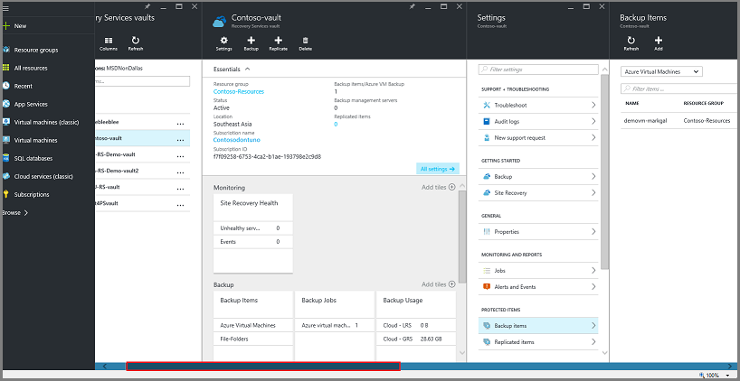

### 在仪表板中打开恢复服务保管库：

1. 登录到 [Azure 门户](https://portal.azure.cn/)。

2. 在“中心”菜单中，单击“浏览”，然后在资源列表中，键入“恢复服务”。当你开始键入时，会根据你的输入筛选该列表。单击“恢复服务保管库”。

      

    此时将显示恢复服务保管库列表。

      

    >[AZURE.TIP] 如果将保管库固定到 Azure 仪表板，则打开 Azure 门户即可访问该保管库。若要将某个保管库固定到仪表板，可在保管库列表中，右键单击该保管库，然后选择“固定到仪表板”。

3. 从保管库列表中，选择要打开其仪表板的保管库。选择保管库后，将打开保管库仪表板和“设置”边栏选项卡。在下图中，突出显示了 **Contoso-vault** 仪表板。

    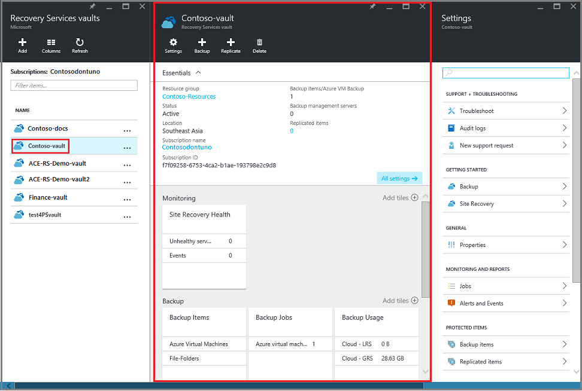

### 打开保管库项仪表板

在前面的过程中，你打开了保管库仪表板。打开保管库项仪表板的步骤：

1. 在保管库仪表板上的“备份项”磁贴中，单击“Azure 虚拟机”。

    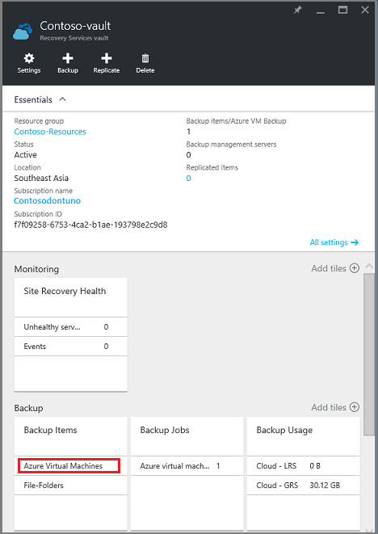

    “备份项”边栏选项卡列出每个项的上次备份作业。在本示例中，有一个受此保管库保护的虚拟机：demovm-markgal。

    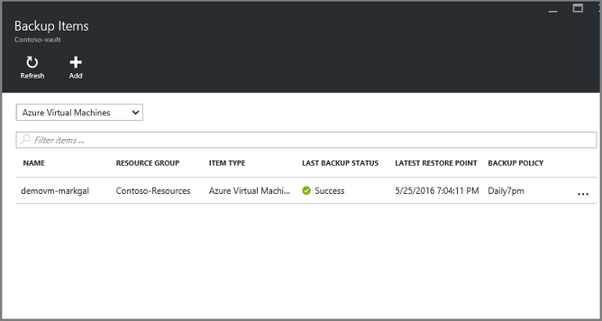

    >[AZURE.TIP] 为了访问方便，可将保管库项目固定到 Azure 仪表板。若要固定某个保管库项目，可在保管库项目列表中，右键单击该项目，然后选择“固定到仪表板”。

2. 在“备份项”边栏选项卡中，单击打开保管库项仪表板所需的项。

    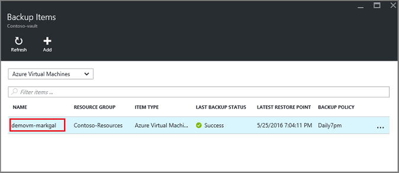

    此时会打开保管库项仪表板及其“设置”边栏选项卡。

    

    在保管库项仪表板中，你可以完成许多关键性的管理任务，例如：

    - 更改策略或创建新的备份策略 
	- 查看还原点及其一致性状态  
	- 虚拟机的按需备份  
	- 停止保护虚拟机  
	- 恢复对虚拟机的保护  
	- 删除备份数据（或恢复点） 
	- [删除备份（或恢复点）](/documentation/articles/backup-azure-arm-restore-vms#restore-a-recovery-point) 

以下过程的起点是保管库项仪表板。

## 更改策略或创建新的备份策略

1. 在“[保管库项仪表板](/documentation/articles/backup-azure-manage-vms#open-a-vault-item-dashboard)”中，单击“所有设置”以打开“设置”边栏选项卡。

    

2. 在“设置”边栏选项卡中，单击“备份策略”以打开该边栏选项卡。

    备份频率和保留期范围详细信息将显示在边栏选项卡中。

    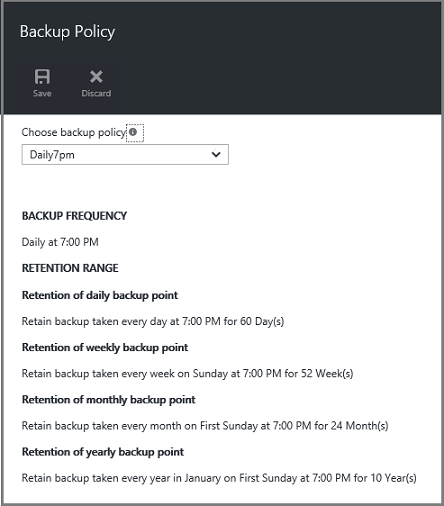

3. 在“选择备份策略”菜单中执行以下操作：
    - 若要更改策略，请选择其他策略，然后单击“保存”。新策略将立即应用于保管库。 
    - 若要创建新策略，请选择“新建”。

    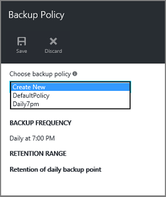

    有关创建备份策略的说明，请参阅[定义备份策略](/documentation/articles/backup-azure-manage-vms#defining-a-backup-policy)。

## 虚拟机的按需备份
为虚拟机配置保护后，可以对它执行按需备份。如果虚拟机的初始备份已挂起，则按需备份将在恢复服务保管库中创建虚拟机的完整副本。如果初始备份已完成，按需备份仅将以前快照的更改发送到恢复服务保管库，即始终进行增量备份。

>[AZURE.NOTE] 按需备份的保留期范围是在策略中针对“每日”备份点指定的保留期值。如果没有选择“每日”备份点，则使用“每周”备份点。

若要触发虚拟机的按需备份，请执行以下操作：

1. 在“[保管库项仪表板](/documentation/articles/backup-azure-manage-vms#open-a-vault-item-dashboard)”中，单击“立即备份”。

    

    门户会确认你需要启动按需备份作业。单击“是”启动备份作业。

    

    备份作业创建新的恢复点。创建的恢复点保留期范围与在虚拟机的关联策略中指定的保留期范围相同。若要跟踪作业进度，请在保管库仪表板中，单击“备份作业”磁贴。

## 停止保护虚拟机
如果你选择停止保护虚拟机，系统会询问你是否需要保留恢复点。可以通过两种方式来停止保护虚拟机：停止所有未来的备份作业并删除所有恢复点，或者停止所有未来的备份作业但保留恢复点。将恢复点保留在存储空间中需支付相关费用。不过，保留恢复点的好处是，你可以根据需要在以后还原虚拟机。有关此类虚拟机的定价详细信息，请单击[此处](https://azure.microsoft.com/pricing/details/backup/)。如果你选择删除所有恢复点，则没有还原虚拟机的选项。

若要停止保护虚拟机，请执行以下操作：

1. 在“[保管库项仪表板](/documentation/articles/backup-azure-manage-vms#open-a-vault-item-dashboard)”中，单击“停止备份”。

    

    此时会打开“停止备份”边栏选项卡。

    

2. 在“停止备份”边栏选项卡中，选择是保留还是删除备份数据。信息框提供了所做选择的详细信息。

    

3. 如果你选择保留备份数据，则可跳到第 4 步。如果你选择删除备份数据，则请确认你要停止备份作业并删除恢复点 - 键入项的名称。

    

    如果你不能确定项名称，将鼠标悬停在感叹号上面即可查看该名称。另外，项的名称位于边栏选项卡顶部的“停止备份”下。

4. （可选）提供**原因**或**注释**。

5. 若要停止当前项的备份作业，请单击 
    

    你可以通过通知消息了解到备份作业已停止。

    

## 恢复对虚拟机的保护
如果在停止对虚拟机的保护时选择了“保留备份数据”选项，则可恢复对虚拟机的保护。如果选择了“删除备份数据”选项，则不能恢复对虚拟机的保护。

恢复对虚拟机的保护的步骤

1. 在“[保管库项仪表板](/documentation/articles/backup-azure-manage-vms#open-a-vault-item-dashboard)”中，单击“恢复备份”。

    

    “备份策略”边栏选项卡随即打开。

    >[AZURE.NOTE] 重新保护虚拟机时，你可以选择一个不同的策略，而不是最初用于保护虚拟机的策略。

2. 按[更改策略或创建新的备份策略](/documentation/articles/backup-azure-manage-vms#change-policies-or-create-a-new-backup-policy)中的步骤为虚拟机分配策略。

    对虚拟机应用备份策略以后，你会看到以下消息。

    

## 删除备份数据
你可以在“停止备份”作业过程中删除与虚拟机关联的备份数据，也可以在备份已停止后随时删除。如果允许先停止虚拟机的备份作业，然后等待数天或数周再决定是否删除恢复点是有好处的，则可这样做。与还原恢复点不同，在删除备份数据时，不能选择要删除的特定恢复点。如果你选择删除特定恢复点，则会删除与该项关联的所有恢复点。

以下过程假设虚拟机的备份作业已停止或禁用。仅当已禁用备份作业后，才能在保管库项仪表板中使用“恢复备份”和“删除备份”选项。

若要删除已禁用备份的虚拟机上的备份数据，请执行以下操作：

1. 在“[保管库项仪表板](/documentation/articles/backup-azure-manage-vms#open-a-vault-item-dashboard)”中，单击“删除备份”。

    

    “删除备份数据”边栏选项卡随即打开。

    

2. 必须键入项的名称，以便确认你需要删除恢复点。

    

    如果你不能确定项名称，将鼠标悬停在感叹号上面即可查看该名称。另外，项的名称位于边栏选项卡顶部的“删除备份数据”下。

3. （可选）提供**原因**或**注释**。

4. 若要删除当前项的备份数据，请单击 

    你可以通过通知消息了解到备份数据已删除。

## 审核操作
你可以通过查看操作和事件日志来了解对恢复服务保管库执行的管理操作。通过操作日志，可以针对备份操作进行很好的事后总结和审核。你可以使用审核日志功能来查看订阅中所有操作的日志。有关事件、操作和审核日志的其他信息，请参阅文章：[查看事件和审核日志](/documentation/articles/insights-debugging-with-events)。使用“审核日志”设置可查看特定于恢复服务保管库或保管库项的事件和操作日志。

审核日志中记录了以下操作：

- 注册
- 注销
- 配置保护
- 备份（二者均可以按需备份的形式进行计划）
- 还原
- 停止保护
- 删除备份数据
- 添加策略
- 删除策略
- 更新策略
- 取消作业

若要查看恢复服务保管库的事件日志，请执行以下操作：

1. 在“[保管库仪表板](/documentation/articles/backup-azure-manage-vms#open-a-recovery-services-vault-in-the-dashboard)”中，浏览到“审核日志”并单击该选项，以便打开“事件”边栏选项卡。

    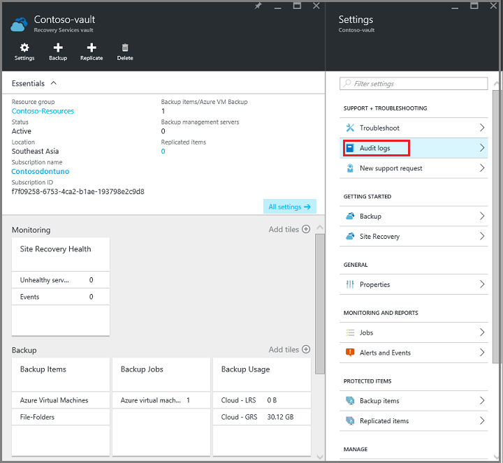

    “事件”边栏选项卡打开到仅针对当前保管库筛选的操作事件。该边栏选项卡显示在过去一周发生的“严重”事件、“错误”事件、“警告”事件和“信息”事件的列表。时间跨度是在“筛选器”设置中设置的默认值。“事件”边栏选项卡还显示一个跟踪事件发生时间的条形图。如果你不希望看到条形图，可在“事件”菜单中，单击“显示图表”将图表切换到关闭状态。

    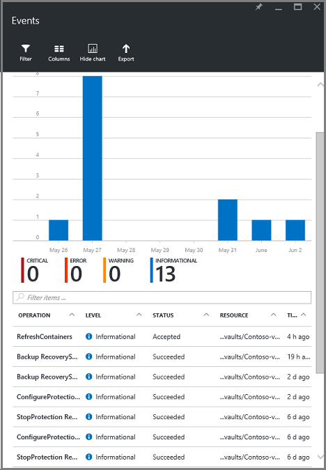

2. 如需特定操作的其他信息，请在“操作”列表中单击该操作以打开其边栏选项卡。边栏选项卡包含有关操作的详细信息，以及发生在时间跨度中的事件的列表。

    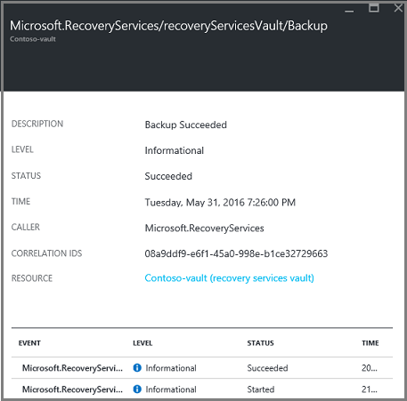

3. 若要查看有关特定事件的详细信息，请在事件列表中单击该操作以打开其“详细信息”边栏选项卡。

    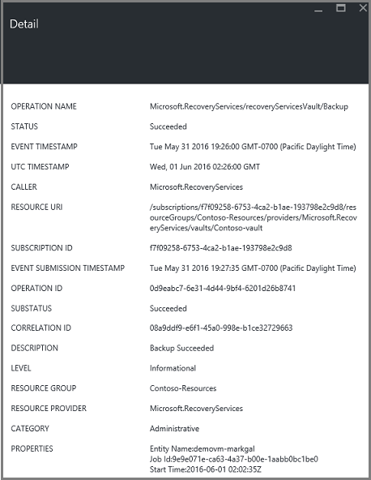

    事件级信息将尽可能详细。此过程的其余部分介绍如何编辑或更改可用信息。

4. 若要编辑可用筛选器的列表，请在“事件”菜单中单击“筛选器”以打开该边栏选项卡。

    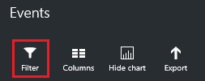

5. 在“筛选器”边栏选项卡中，调整“级别”、“时间跨度”和“调用方”筛选器。其他筛选器将不可用，因为已将它们设置为提供恢复服务保管库的当前信息。

    

    你可以指定事件的“级别”：严重、错误、警告或信息。你可以选择任意组合的事件级别，但必须选择至少一个级别。通过切换打开或关闭级别。你可以通过“时间跨度”筛选器指定捕获事件的时间长度。如果你使用自定义时间跨度，则可设置开始时间和结束时间。

6. 做好使用筛选器查询操作日志的准备以后，即可单击“更新”。结果显示在“事件”边栏选项卡中。

    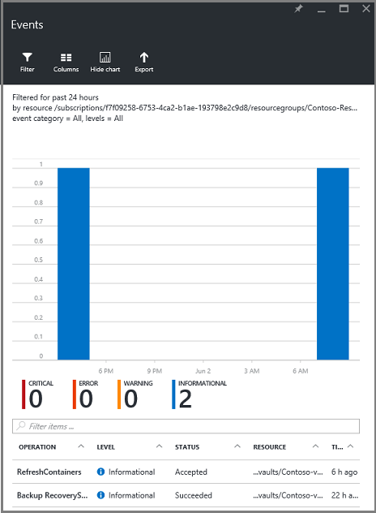

## 警报通知
你可以获取门户中作业的自定义警报通知。若要获取这些作业，请针对操作日志事件定义基于 PowerShell 的警报规则。使用 PowerShell 1.3.0 或更高版本。

若要定义自定义通知以便在备份失败时发出警报，可使用如下所示的命令：

		PS C:\> $actionEmail = New-AzureRmAlertRuleEmail -CustomEmail contoso@microsoft.com
		PS C:\> Add-AzureRmLogAlertRule -Name backupFailedAlert -Location "East US" -ResourceGroup RecoveryServices-DP2RCXUGWS3MLJF4LKPI3A3OMJ2DI4SRJK6HIJH22HFIHZVVELRQ-East-US -OperationName Microsoft.Backup/backupVault/Backup -Status Failed -TargetResourceId /subscriptions/86eeac34-eth9a-4de3-84db-7a27d121967e/resourceGroups/RecoveryServices-DP2RCXUGWS3MLJF4LKPI3A3OMJ2DI4SRJK6HIJH22HFIHZVVELRQ-East-US/providers/microsoft.backupbvtd2/BackupVault/trinadhVault -Actions $actionEmail

**ResourceId**：你可以从审核日志中获取此信息。操作日志的“资源”列中提供了 ResourceId。

**OperationName**：采用“Microsoft.RecoveryServices/recoveryServicesVault/<EventName>”格式，其中，EventName 的值为 Register、Unregister、ConfigureProtection、Backup、Restore、StopProtection、DeleteBackupData、CreateProtectionPolicy、DeleteProtectionPolicy、UpdateProtectionPolicy 中的一个

**Status**：支持的值包括 Started、Succeeded 和 Failed。

**ResourceGroup**：这是资源所属的资源组。可以将“资源组”列添加到生成的日志。资源组是一种可用的事件信息类型。

**Name**：警报规则的名称。

**CustomEmail**：指定要向其发送警报通知的自定义电子邮件地址。

**SendToServiceOwners**：此选项会将警报通知发送给订阅的所有管理员和共同管理员。可以在 **New-AzureRmAlertRuleEmail** cmdlet 中使用

### 对警报的限制
基于事件的警报会受到以下限制：

1. 警报在恢复服务保管库的所有虚拟机上触发。你不能在恢复服务保管库中自定义特定虚拟机集的警报。
2. 此功能以预览版提供。[了解详细信息](/documentation/articles/insights-powershell-samples#create-alert-rules)
3. 警报从“alerts-noreply@mail.windowsazure.com”发送。目前你无法修改电子邮件发件人。

[AZURE.INCLUDE [backup-create-backup-policy-for-vm](../includes/backup-create-backup-policy-for-vm.md)]

## 后续步骤

有关如何从恢复点重新创建虚拟机的信息，请查看[还原 Azure VM](/documentation/articles/backup-azure-restore-vms)。如果你需要有关如何保护虚拟机的信息，请参阅[初步了解：将 VM 备份到恢复服务保管库](/documentation/articles/backup-azure-vms-first-look-arm)。

<!---HONumber=Mooncake_0704_2016-->