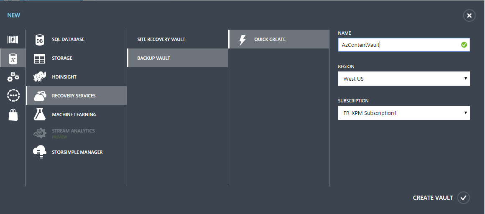
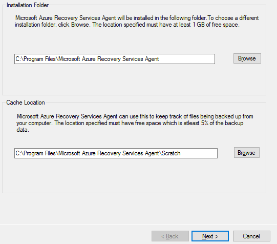
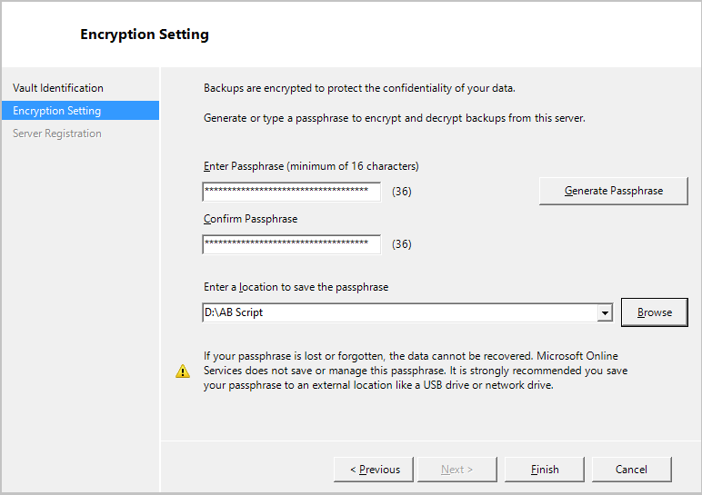

<properties
	pageTitle="进行环境准备以备份 Windows 服务器或客户端计算机 | Microsoft Azure"
	description="通过创建备份保管库、下载凭据和安装备份代理，对环境进行备份 Windows 的准备。"
	services="backup"
	documentationCenter=""
	authors="Jim-Parker"
	manager="jwhit"
	editor=""
	keywords="备份保管库; 备份代理; 备份 windows;"/>

<tags
	ms.service="backup"
	ms.date="02/23/2016"
	wacn.date="04/12/2016"/>

# 进行环境准备，以便将 Windows 计算机备份到 Azure
本文列出了你在进行环境准备时需要完成的事项，方便你将 Windows 计算机备份到 Azure。

| 步骤 | 名称 | 详细信息 |
| :------: | ---- | ------- |
| 1 | [创建保管库](#create-a-backup-vault) | 在 [Azure 备份管理门户](http://manage.windowsazure.cn)中创建一个保管库 |
| 2 | [下载保管库凭据](#download-the-vault-credential-file) | 下载保管库凭据，以便将 Windows 计算机注册到备份保管库 |
| 3 | [安装 Azure 备份代理](#download-install-and-register-the-azure-backup-agent) | 安装该代理，然后使用保管库凭据将服务器注册到备份保管库 |

如果你已完成上述所有概括性步骤，则可开始[备份 Windows 计算机](/documentation/articles/backup-azure-backup-windows-server)。否则请继续完成下面的详细步骤，确保你的环境已准备就绪。

## 开始之前
若要进行环境准备以备份 Windows 计算机，你需要一个 Azure 帐户。如果你没有帐户，只需几分钟的时间就能创建一个[免费试用帐户](/pricing/free-trial/)。

## 创建备份保管库
若要将文件和数据从 Windows 计算机或 Data Protection Manager (DPM) 备份到 Azure，或者要将 IaaS VM 备份到 Azure，你需要在要存储数据的地理区域中创建备份保管库。

**创建备份保管库的步骤：**

1. 登录到[管理门户](https://manage.windowsazure.cn/)

2. 单击“新建”>“数据服务”>“恢复服务”->“备份保管库”，然后选择“快速创建”。

    

3. 对于“名称”参数，请输入一个友好名称以标识备份保管库。这必须是每个订阅的唯一名称。

    对于“区域”参数，请选择备份保管库的地理区域。所选项决定了备份数据要发送到的地理区域。选择靠近你所在位置的地理区域可以减少备份到 Azure 时的网络延迟。

    单击“创建保管库”完成该工作流。

    创建备份保管库可能需要一段时间。若要检查状态，可以监视门户底部的通知。

    

    在创建备份保管库后，将显示一条消息通知你已成功创建保管库。该保管库还会在恢复服务的资源中列出为“活动”。

    

    >[AZURE.IMPORTANT] 确定存储冗余选项的最佳时机是在创建保管库之后，并且是在将任何计算机注册到保管库之前。将某个项注册到保管库后，存储冗余选项将会锁定且不能修改。

4. 选择“存储冗余”选项。

    如果你要使用 Azure 作为主要备份存储终结点（例如，你要从 Windows Server 备份到 Azure），应考虑选择（默认的）[异地冗余存储](/documentation/articles/storage-redundancy#geo-redundant-storage)选项。

    如果使用 Azure 作为第三级备份存储终结点（例如，你正在使用 SCDPM 在本地创建本地备份复制，使用 Azure 满足长期数据保留需求），应考虑选择[本地冗余存储](/documentation/articles/storage-redundancy#locally-redundant-storage)。这可以降低在 Azure 中存储数据的成本，但提供的数据持久性更低，不过，对于第三级副本是可接受的。

    请在此[概述](/documentation/articles/storage-redundancy)中深入了解[异地冗余](/documentation/articles/storage-redundancy#geo-redundant-storage)和[本地冗余](/documentation/articles/storage-redundancy#locally-redundant-storage)存储选项。

    a.单击刚刚创建的保管库。

    b.在“快速启动”页面上，选择“配置”。

    

    c.选择适当的存储冗余选项。

    如果已选择“本地冗余”，则需要单击“保存”，因为“异地冗余”是默认选项。

    

    d.单击左侧导航窗格中的“恢复服务”，以返回到“恢复服务”的资源列表。

    

## 下载保管库凭据文件
在本地服务器（Windows 客户端、Windows Server 或 Data Protection Manager 服务器）将数据备份到 Azure 之前，需要使用备份保管库对服务器进行身份验证。身份验证是使用“保管库凭据”实现的。保管库凭据文件是通过安全通道从 Azure 门户下载的，而 Azure 备份服务并不了解证书的私钥，该私钥不保存在门户或服务中。

详细了解[如何使用保管库凭据向 Azure 备份服务进行身份验证](/documentation/articles/backup-introduction-to-azure-backup#what-is-the-vault-credential-file)。

**将保管库凭据文件下载到本地计算机：**

1. 登录到[管理门户](https://manage.windowsazure.cn/)

2. 在左侧导航窗格中单击“恢复服务”，然后选择你创建的备份保管库。

3.  单击云图标转到备份保管库的“快速启动”视图。

    

4. 在“快速启动”页上，单击“下载保管库凭据”。

    

    门户将使用保管库名称和当前日期的组合生成保管库凭据。保管库凭据文件仅在注册工作流中使用，48 小时后过期。

    保管库凭据文件可从门户下载。

5. 单击“保存”将保管库凭据下载到本地帐户的 downloads 文件夹，或者从“保存”菜单中选择“另存为”以指定保管库凭据保存到的位置。

    此时不需打开保管库凭据。

    确保将保管库凭据保存到可从计算机访问的位置。如果将它存储在文件共享/SMB 中，请检查访问权限。

## 下载、安装和注册 Azure 备份代理
在创建 Azure 备份保管库后，应在每个 Windows 计算机（Windows Server、Windows 客户端、System Center Data Protection Manager 服务器或 Azure 备份服务器计算机）上安装代理，以便将数据和应用程序备份到 Azure。

**下载、安装和注册代理：**

1. 登录到[管理门户](https://manage.windowsazure.cn/)

2. 单击“恢复服务”，然后选择你要向其注册服务器的备份保管库。

3. 在“快速启动”页上，单击“用于 Windows Server、System Center Data Protection Manager 或 Windows 客户端的代理”>“保存”。

    

4. MARSagentinstaller.exe 下载完以后，单击“运行”（或双击保存位置中的 MARSAgentInstaller.exe）。选择代理所需的安装文件夹和缓存文件夹，然后单击“下一步”。

    指定的缓存位置必须至少有备份数据的 5% 的可用空间。

    

5. 如果使用代理服务器连接到 Internet，请在“代理配置”屏幕中，输入代理服务器详细信息。如果使用已经过身份验证的代理，请输入用户名和密码详细信息，然后单击“下一步”。

    Azure 备份代理将安装 .NET Framework 4.5 和 Windows PowerShell（如果尚未安装）以完成安装。

6. 安装代理后，单击“继续注册”以继续运行工作流。

    

7. 在“保管库标识”屏幕中，浏览到前面下载的保管库凭据文件并将其选中。

    

    从门户下载后，保管库凭据文件只能生效 48 小时。如果此屏幕中显示任何错误（例如“提供的保管库凭据文件已过期”），请登录到 Azure 门户，并再次下载保管库凭据文件。

    确保将保管库凭据文件放置在安装应用程序可访问的位置。如果你遇到访问相关的错误，请将保管库凭据文件复制到此计算机中的临时位置，然后重试操作。

    如果你遇到保管库凭据无效错误（例如“所提供的保管库凭据无效”），则该文件已损坏，或者没有与恢复服务关联的最新凭据。请在从门户下载新的保管库凭据文件后重试该操作。如果用户快速连续单击“下载保管库凭据”选项，则通常会出现此错误。在这种情况下，只有最后一个保管库凭据文件有效。

8. 在“加密设置”屏幕中，你可以生成一个通行短语，或者提供一个通行短语（最少包含 16 个字符）。请记住将通行短语保存在安全位置。

    

    > [AZURE.WARNING] 如果你丢失或忘记了通行短语，Microsoft 无法帮助你恢复备份的数据。加密通行短语由最终用户拥有，Microsoft 看不到最终用户所用的通行短语。请将该文件保存在安全位置，因为在恢复操作期间需要用到它。

9. 单击“完成”。

    此时计算机已成功注册到保管库，你可以开始备份到 Microsoft Azure 了。

## 后续步骤
- 注册[免费 Azure 试用帐户](/pricing/free-trial/)
- [备份 Windows 服务器或客户端计算机](/documentation/articles/backup-azure-backup-windows-server)。
- 如果仍有疑问，请查看 [Azure 备份常见问题](/documentation/articles/backup-azure-backup-faq)。
- 访问 [Azure 备份论坛](http://go.microsoft.com/fwlink/p/?LinkId=290933)

<!---HONumber=Mooncake_0405_2016-->