<properties
   pageTitle="将文件和文件夹从 Windows 备份到 Azure | Microsoft Azure"
   description="通过创建保管库、安装备份代理，并将文件和文件夹备份到 Azure，来保护你的 Windows Server 数据。"
   services="backup"
   documentationCenter=""
   authors="Jim-Parker"
   manager="jwhit"
   editor=""
   keywords="如何备份;怎样备份"/>

<tags
   ms.service="backup" 
   ms.date="03/09/2016"
   wacn.date="04/12/2016"/>
   
# 先睹为快：将文件和文件夹从 Windows Server 或客户端备份到 Azure

只需几个步骤，即可将 Windows 机器（Windows 客户端或 Windows Server）备份到 Azure。

只需执行以下步骤：

 获取 Azure 订阅（如果需要）。 
 创建备份保管库并下载所需的组件。 
 通过安装并注册这些组件，来准备好 Windows Server 或客户端。 
 保护你的数据。

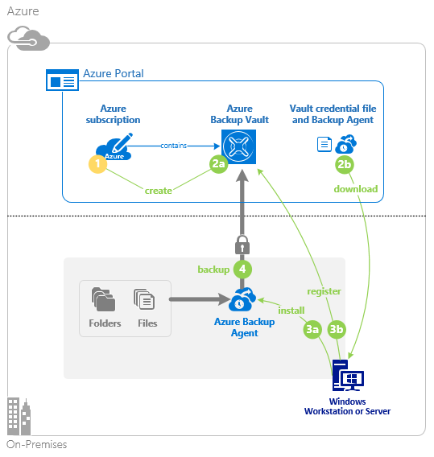

## 步骤 1：获取 Azure 订阅

如果你没有 Azure 订阅，可以创建一个[试用帐户](https://www.azure.cn/pricing/1rmb-trial/)，这样便可以访问任何 Azure 服务。

>[AZURE.NOTE] 如果你已有了 Azure 订阅，则可以跳过此步骤。

## 步骤 2：创建备份保管库并下载所需的组件

若要将文件和数据从 Windows 计算机备份到 Azure，你需要在要存储数据的地理区域内创建一个备份保管库。

1. 如果你尚未登录 [Azure 门户](https://portal.azure.cn/)，请使用你的 Azure 订阅登录。

2. 单击“新建”>“混合集成”>“备份”。

    

    a.在出现的屏幕中，对于“名称”，请输入一个友好名称用于标识备份保管库。键入包含 2 到 50 个字符的名称。名称必须以字母开头，只能包含字母、数字和连字符。

    b.在“区域”中，为备份保管库选择地理区域。选择靠近你所在位置的地理区域可以减少备份到 Azure 时的网络延迟。

    c.单击“创建保管库”。

    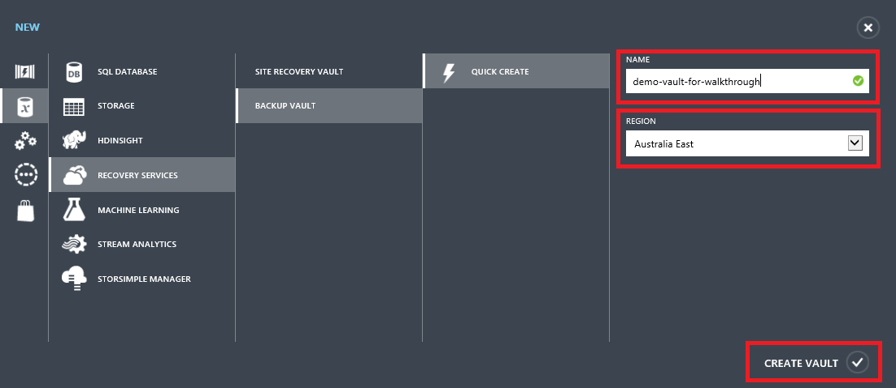

    若要查看状态，你可以监视门户底部的通知。

    

    创建备份保管库后，你将在“恢复服务”的资源中看到该保管库列列为“活动”。

    

3. 选择“存储冗余”选项。

    选择存储冗余选项的最佳时机是在创建保管库之后、将任何计算机注册到保管库之前。将某个项注册到保管库后，存储冗余选项将会锁定且不能修改。

    如果你要使用 Azure 作为主要备份存储终结点（例如，你要从 Windows Server 备份到 Azure），应考虑选择（默认的）[异地冗余存储](../storage/storage-redundancy.md#geo-redundant-storage)选项。

    如果使用 Azure 作为第三级备份存储终结点（例如，你正在使用 SCDPM 在本地创建本地备份复制，使用 Azure 满足长期数据保留需求），应考虑选择[本地冗余存储](../storage/storage-redundancy.md#locally-redundant-storage)。这可以降低在 Azure 中存储数据的成本，但提供的数据持久性更低，不过，对于第三级副本是可接受的。

    a.单击刚刚创建的保管库。

    b.在“快速启动”页面上，选择“配置”。

    

    c.选择适当的存储冗余选项。

    如果已选择“本地冗余”，则需要单击“保存”，因为“异地冗余”是默认选项。

    

    d.单击左侧导航窗格中的“恢复服务”，以返回到“恢复服务”的资源列表。

    

    现在需要以刚刚创建的备份保管库在 Windows 计算机上进行身份验证。身份验证是使用保管库凭据来实现的。

4.  单击刚刚创建的保管库。

    

5. 在“快速启动”页中，单击“下载保管库凭据”。

    

    门户将使用保管库名称和当前日期的组合生成保管库凭据。

    >[AZURE.NOTE] 保管库凭据文件仅在注册工作流中使用，48 小时后过期。

6. 单击“保存”将保管库凭据下载到本地帐户的 **downloads** 文件夹，或者从“保存”菜单中选择“另存为”以指定保管库凭据保存到的位置。

    

    确保将保管库凭据保存到可从计算机访问的位置。如果将该文件存储在文件共享/SMB 中，请检查访问权限。

    >[AZURE.NOTE] 此时不需打开保管库凭据。

    接下来，需要下载备份代理

7. 单击左侧导航窗格中的“恢复服务”，然后单击要向服务器注册的备份保管库。

    

8. 在“快速启动”页上，单击“用于 Windows Server、System Center Data Protection Manager 或 Windows 客户端的代理”>“保存”（或从“保存”菜单中选择“另存为”以指定代理的位置）。

    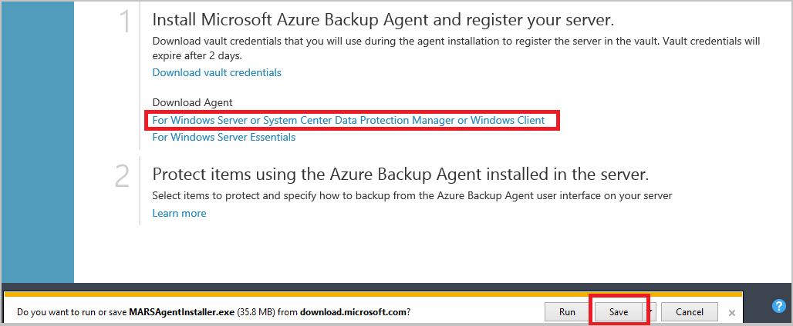

此时，你已完成备份保管库的创建并下载了所需的组件。现在将要安装备份代理。

## 步骤 3：通过安装并注册这些组件，来准备好 Windows Server 或客户端

1. 下载完成后，从保存的位置双击“MARSagentinstaller.exe”（或者单击“运行”，而不是单击上一步骤中保存的文件）。

2. 选择代理所需的“安装文件夹”和“缓存文件夹”。

    指定的缓存位置必须至少有备份数据的 5% 的可用空间。

    单击“下一步”。

    

3. 你可以继续通过默认代理设置连接到 Internet；如果使用代理服务器连接到 Internet，请在“代理配置”屏幕中选中“使用自定义代理设置”框并输入代理服务器详细信息。

    如果使用已经过身份验证的代理，请输入用户名和密码详细信息。

    单击“下一步”。

    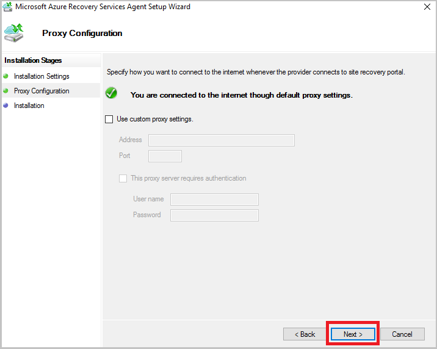

4. 单击“安装”。

    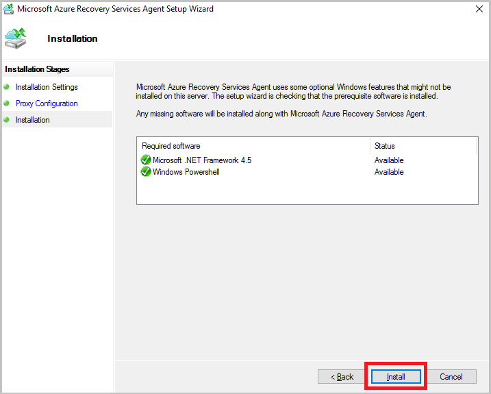

    Azure 备份代理将安装 .NET Framework 4.5 和 Windows PowerShell（如果尚未安装）以完成安装。

5. 安装代理后，单击“继续注册”以继续运行工作流。

    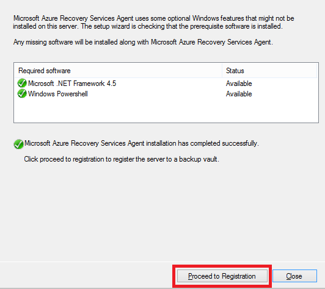

6. 在“保管库标识”屏幕中，浏览到前面下载的保管库凭据文件并将其选中。确保将“保管库凭据文件”放置在安装应用程序可访问的位置。

    单击“下一步”。

    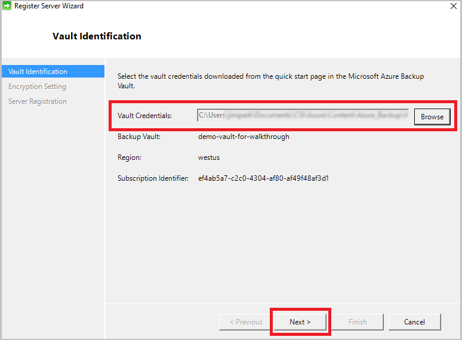

7. 在“加密设置”屏幕中，你可以生成一个通行短语，或者提供一个通行短语（最少包含 16 个字符）。请记住将通行短语保存在安全位置。

    > [AZURE.WARNING] 如果你丢失或忘记了通行短语，Microsoft 无法帮助你恢复备份的数据。加密通行短语由最终用户拥有，Microsoft 看不到最终用户所用的通行短语。请将该文件保存在安全位置，因为在恢复操作期间需要用到它。

    单击“完成”。

    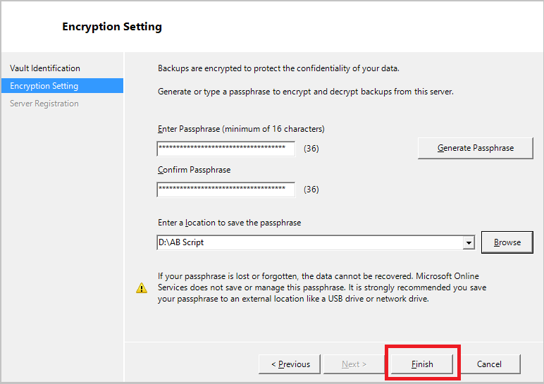

    “注册服务器向导”将在 Microsoft Azure 备份中注册服务器。

    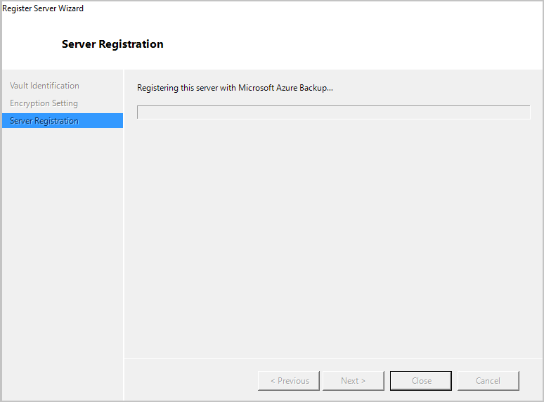

8. 设置“加密密钥”后，请让“启动 Microsoft Azure 恢复服务代理”复选框保持为选中状态，然后单击“关闭”。

    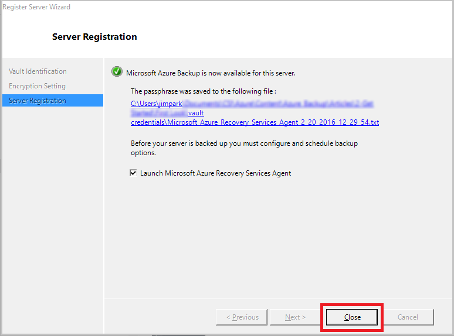

    此时计算机已成功注册到保管库，你可以配置和计划备份选项。

## 步骤 4：保护你的数据

1. 在“备份代理”（如果让“启动 Microsoft Azure 恢复服务代理”复选框保持选中状态，则自动打开）中，单击“计划备份”。

    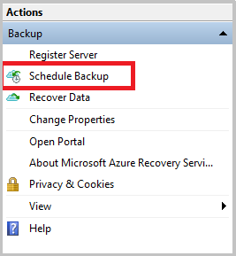

2. 在“开始使用”屏幕上，单击“下一步”。

    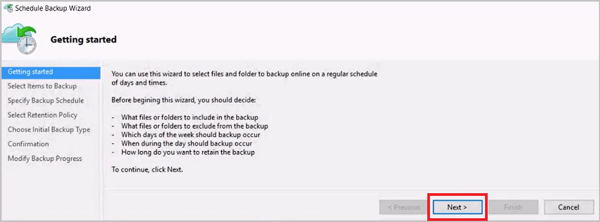

3. 在“选择要备份的项”屏幕上，单击“添加项”。

    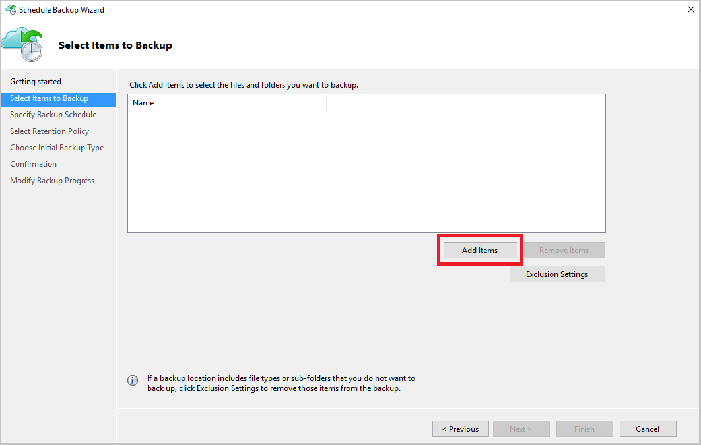

    选择要备份的项并单击“确定”。Windows Server 或 Windows 客户端上的 Azure 备份可让你保护文件和文件夹。

    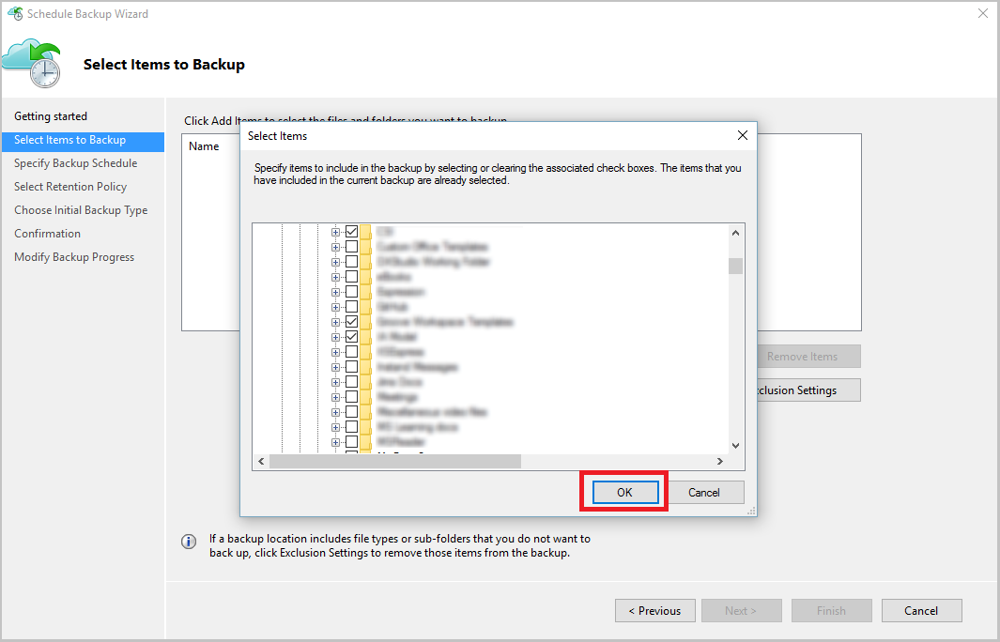

    单击“下一步”。

    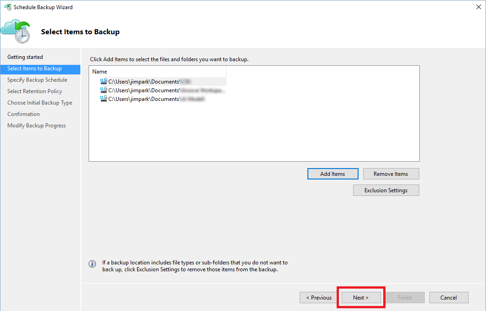

4. 指定“备份计划”并单击“下一步”。

    可以计划每日（一天最多 3 次）或每周备份。

    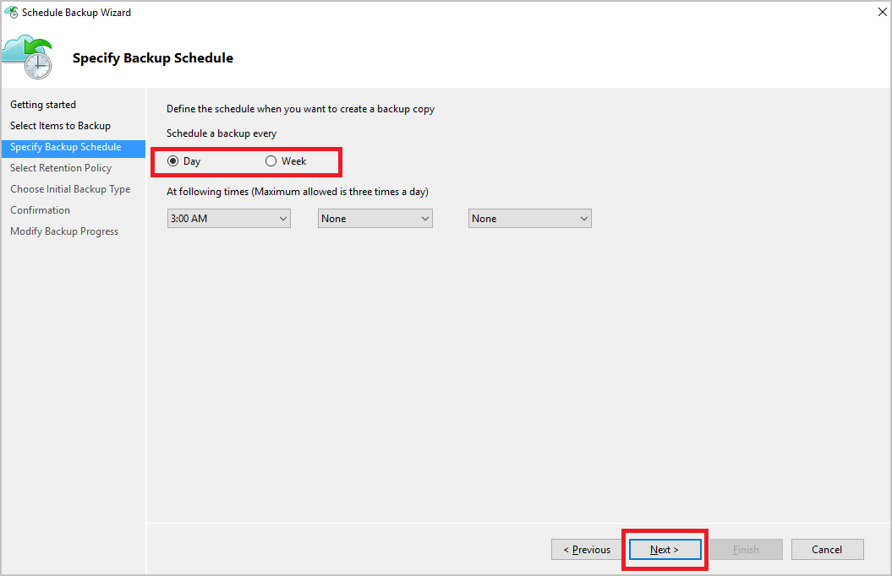

5. 选择备份副本的“保留策略”。你可以根据需要修改每日、每周、每月和每年保留策略。

    >[AZURE.NOTE] [此文](backup-azure-backup-cloud-as-tape.md)中详细介绍了备份计划。

     单击“下一步”

    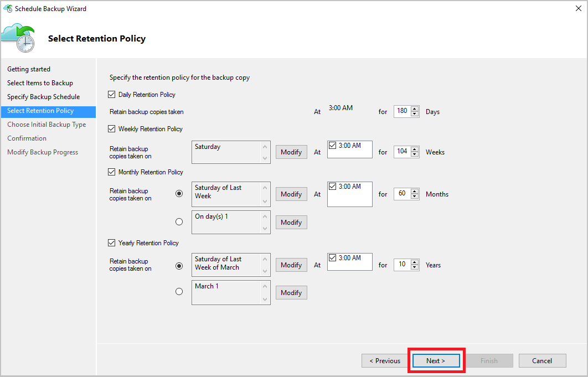

6. 选择初始备份类型。

    你可以通过网络自动备份，或者脱机备份。本文的余下部分将遵循自动备份过程。如果你想要执行脱机备份，请此文章，以获取有关 [Azure 备份中的脱机备份工作流](backup-azure-backup-import-export.md)的其他信息。

    单击“下一步”

    

7. 在“确认”屏幕上复查信息，然后单击“完成”。

    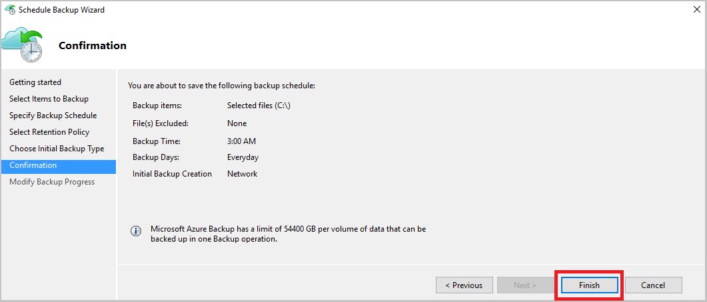

8. 向导完成创建“备份计划”后，请单击“关闭”。

    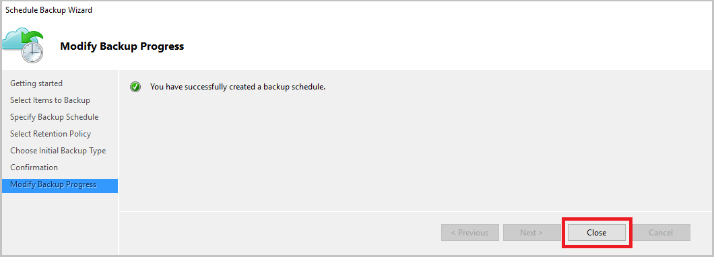

9. 在“备份代理”中单击“立即备份”，以通过网络完成初始种子设定。

    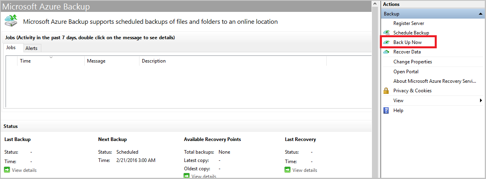

10. 在“确认”屏幕上，检查向导将用于备份计算机的设置，然后单击“备份”。

    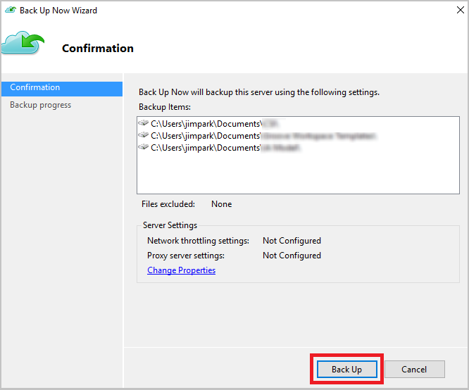

11. 单击“关闭”以关闭向导。你可以在“备份过程”完成之前执行此操作，备份过程将继续在后台运行。

    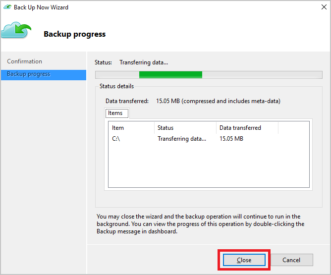

12. 完成初始备份后，Azure 备份控制台中的“作业”视图将指示“作业已完成”状态。

    

祝贺你，你已将文件和文件夹成功备份到 Azure 备份。

## 后续步骤
+ 若要了解有关 Azure 备份的详细信息，请参阅 [Azure 备份概述](/documentation/articles/backup-introduction-to-azure-backup)。
- [备份 Windows Server](/documentation/articles/backup-azure-backup-windows-server)
+ 访问 [Azure 备份论坛](https://social.msdn.microsoft.com/forums/azure/zh-cn/home?forum=windowsazureonlinebackup)。

<!---HONumber=Mooncake_0405_2016-->