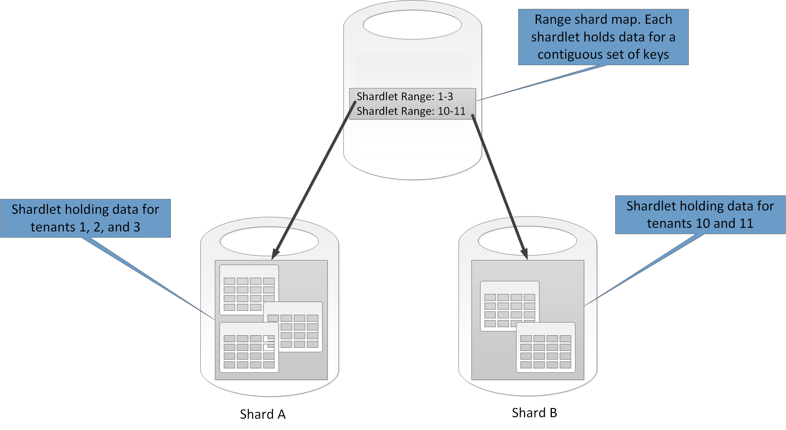
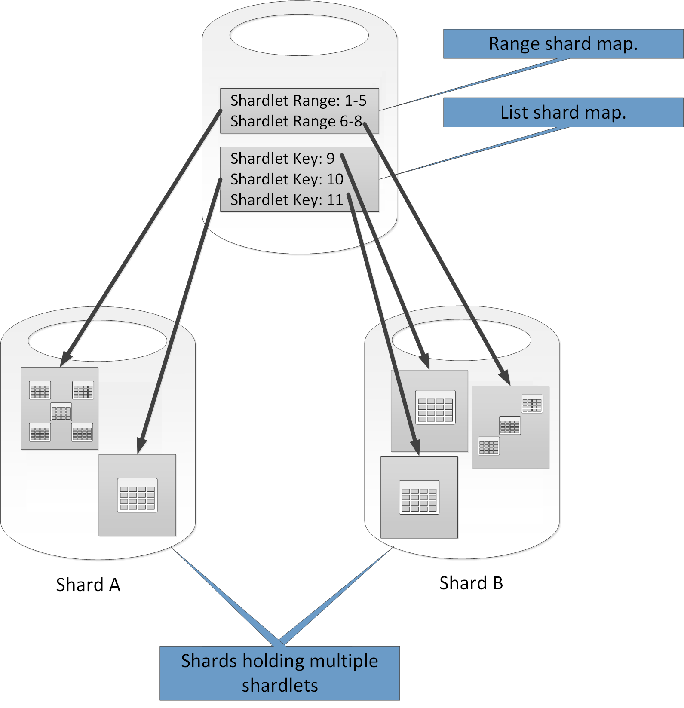
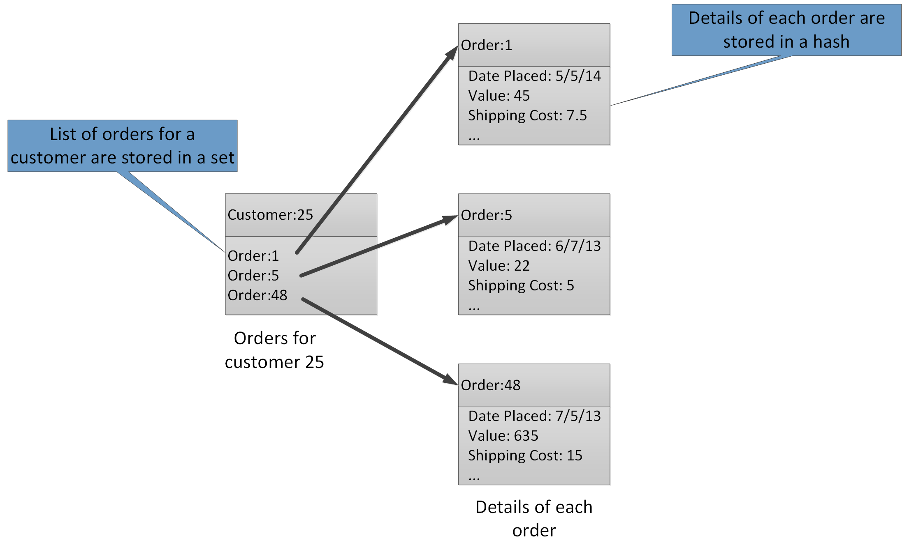

<properties
   pageTitle="数据分区指南 | Azure"
   description="有关如何隔离分区，以便单独进行管理和访问的指导。"
   services=""
   documentationCenter="na"
   authors="dragon119"
   manager="masimms"
   editor=""
   tags=""/>

<tags
   ms.service="best-practice"
   ms.date="03/26/2016"
   wacn.date="07/08/2016"/>

# 数据分区指南

## 概述

在许多大型解决方案中，数据分割成独立的分区，而这些分区可以单独进行管理和访问。必须慎重选择分区策略，才能最大程度地提高效益，将负面影响降到最低。分区可以帮助改善缩放性、减少争用，以及优化性能。分区的附带好处是还能提供一种机制，用于通过使用模式来分割数据。例如，你可以将较旧的、活动性不高（冷）的数据存档在成本较低的数据存储中。

## 为何要将数据分区？

大多数云应用程序和服务将数据存储与检索当作其操作的一部分。应用程序所用数据存储的设计可能会给系统的性能、吞吐量和缩放性造成严重的影响。大型系统中经常应用的一项技术是将数据分割成独立分区。

> 本指南中所用的术语_分区_是指以物理方式将数据分割成独立数据存储的过程。这与 SQL Server 表分区不同，后者是不同的概念。

将数据分区可以带来很多好处。例如，应用分区可以：

- **提高缩放性**。向上扩展单一数据库系统最终会达到物理硬件的限制。跨多个分区来分割数据，每个分区托管在独立的服务器上，使系统几乎能够无限向外缩放。
- **提高性能**。在每个分区上的数据访问操作通过较小的数据卷进行。如果以适当方式将数据分区，可以提高系统的效率。影响多个分区的操作可以同时运行。每个分区可以靠近使用它的应用程序以最小化网络延迟。
- **提高可用性**。跨多个服务器隔离数据可避免单点故障。如果服务器发生故障，或正在进行计划的维护，只有该分区中的数据不可用。其他分区上的操作可以继续进行。增加分区的数量可减少无法使用的数据百分比，从而减轻单个服务器故障造成的相对影响。复制每个分区可以进一步减少单个分区故障影响操作的可能性。它还可以隔离必须持续高度可用的重要数据和具有较低可用性要求的低价值数据（例如日志文件）。
- **提高安全性**。根据数据的性质及其分区方式，可以将机密和非机密数据隔离到不同的分区，因而隔离到不同的服务器或数据存储。然后，便可以针对机密数据专门进行安全优化。
- **提供操作灵活性**。使用分区可以从多方面优化操作、最大程度提高管理效率及降低成本。例如，你可以根据数据在每个分区中的重要性定义不同的策略，以管理、监视、备份和还原及其他管理任务。
- **将数据存储和使用模式相匹配**。分区允许根据数据存储提供的成本和内置功能，将每个分区部署在不同类型的数据存储上。例如，大型二进制数据可存储在 Blob 数据存储中，而结构化程度更高的数据则可保存在文档数据库中。有关详细信息，请参阅 Microsoft 网站上模式与实践指南 [Data access for highly-scalable solutions: Using SQL, NoSQL, and polyglot persistence]（高度可缩放解决方案的数据访问：使用 SQL、NoSQL 和 Polyglot 持续性）中的 [Building a polyglot solution]（构建 Polyglot 解决方案）。

有些系统不实施分区，因为分区被视为额外的成本，而不是一项优势。持有这种观点的常见原因包括：

- 许多数据存储系统不支持跨分区联接，并且难以维护分区系统中的引用完整性。经常需要在应用代码（分区层）中实施联接和完整性检查，而这可能会导致其他 I/O 和应用程序变复杂。
- 维护分区并非总是一项简单的任务。在数据容易发生变化的系统中，可能需要定期重新平衡分区来减少争用和热点。
- 有些常用的工具不能直接处理已分区的数据。

## 设计分区

可以用不同的方式将数据分区：水平、垂直或功能。选择的策略取决于数据分区的原因、应用程序的要求和使用该数据的服务。

> [AZURE.NOTE] 本指南中所述分区方案的解释与底层的数据存储技术无关。这些方案可应用到许多类型的数据存储，包括关系数据库和 NoSQL 数据库。

### 分区策略

数据分区的三个典型策略是：

- **水平分区**（通常称为分片）。在此策略中，每个分区本身都是数据存储，但所有分区具有相同的架构。每个分区称为分片，保存数据的特定子集，例如电子商务应用程序中一组特定客户的所有订单。
- **垂直分区**。在此策略中，每个分区在数据存储中保存项字段的子集。这些字段已根据其使用模式进行分割。例如，将经常访问的字段放在一个垂直分区，将较不经常访问的字段放在另一个垂直分区。
- **功能分区**。在此策略中，数据已根据系统中每个界限上下文使用数据的方式进行聚合。例如，实现发票开立和管理产品库存等独立商务功能的电子商务系统可以将发票数据存储在一个分区，将产品库存数据存储在另一个分区。

请务必注意，此处所述的三种策略可以结合使用。它们不是互斥的，我们建议在设计分区方案时全盘考虑。例如，可以将数据分割成分片，然后使用垂直分区进一步细分每个分片中的数据。同样地，功能分区中的数据可以拆分成分片（也可以是垂直分区的分片）。

但是，每种策略的不同要求可能引发许多冲突问题。在设计符合系统中整体数据处理性能目标的分区方案时，必须加以评估和平衡。以下部分更详细讨论每种策略。

### 水平分区（分片）

图 1 显示了水平分区或分片的概览。在此示例中，产品库存数据已根据产品键分割成分片。每个分片保存分区键（A-G 和 H-Z）的连续范围数据，根据字母顺序排列。

图 1.基于分区键将数据水平分区（分片）

分片可让你将负载分散到多台计算机，减少争用并改善性能。通过添加在其他服务器上运行的更多分片，可以向外扩展系统。

实施此分区策略时的最重要因素是分片键的选择。系统运行之后，就很难更改该键。键必须确保数据已分区，使工作负荷尽可能跨分片平均分配。

请注意，不同分片并不一定包含类似的数据卷。重要的考虑因素是平衡请求数目。有些分片可能非常大，但每个项都是少量访问操作的主体。其他分片可能较小，但是更常访问每个项。另一个重点是确保单个分片不超过用于托管该分片的数据存储的规模限制（在容量和处理资源方面）。

如果你使用分片方案，应避免产生热点（或热分区），否则可能会影响性能与可用性。例如，使用客户标识符的哈希而不是客户名称的第一个字母，可以防止常见和较不常见首字母所造成的不平衡分布。这是一种典型的技巧，可帮助数据更平均地跨分区分布。

选择的分片键应该最大程度地减少将来把大分片拆分成较小片段、将小分片合并成较大分区，或者更改描述分区集中存储的数据的架构的要求。这些操作可能非常耗时，并且可能需要在执行时使一个或多个分片脱机。

如果复制分片，则某些副本也许能够保持联机，而其他副本将被拆分、合并，或者重新配置。但系统可能需要限制在发生重新配置时可对这些分片中的数据执行的操作。例如，副本中的数据可标记为只读以限制任何不一致的范围，否则在重新构建分片时可能会发生不一致性。

> 有关其中许多考虑因素的详细信息和指导，以及设计实现水平分区的数据存储的最佳实践技巧，请参阅[分片模式]

### 垂直分区

垂直分区的最常见用途是降低与提取最常访问的项相关的 I/O 和性能成本。图 2 显示了垂直分区的示例。在此示例中，每个数据项的不同属性都保存在不同的分区中。一个分区保存了经常访问的数据，包括产品的名称、描述和价格信息。另一个分区保存了库存量和上次订购日期。

图 2.按使用模式将数据垂直分区

在此示例中，应用程序在向客户显示产品详细信息时，按常规查询产品名称、描述和价格。库位和上次从制造商订购产品的日期保存在一个隔离的分区中，因为这两个项通常一起使用。

此分区方案有额外的优势，转移频率相对较低的数据（产品名称、描述和价格）和较动态的数据（库位和上次订购日期）彼此隔离。如果转移频率较低的数据经常被访问，应用程序可能会发现，在内存中缓存该数据会很有好处。

此分区策略的另一个典型案例是最大化机密数据的安全性。例如，可通过将信用卡号与对应的卡安全验证码存储在独立的分区中来实现此目的。

垂直分区还可以减少数据所需的并发访问数量。

> 垂直分区在数据存储中的实体级运行，将会部分规范化某个实体，以将它从宽项分割成一组窄项。在理想的情况下，垂直分区适用于 HBase 和 Cassandra 等列导向型数据存储。如果列集合中的数据不太可能会更改，你还可以考虑使用 SQL Server 中的列存储。

### 功能分区

对于可以在应用程序中为每个不同商业领域或服务识别界限上下文的系统，功能分区提供了一种技术用于改善隔离和数据访问性能。功能分区的另一种常见用途是将读写数据与用于报告的只读数据相隔离。图 3 显示了功能分区的概览，其中的库存数据已与客户数据相隔离。

图 3.按界限上下文或子域对数据进行功能分区

此分区策略可帮助减少跨系统中不同部件的数据访问争用。

## 针对缩放性设计分区

请务必考虑每个分区的大小和工作负荷并进行平衡，使数据分布实现最大可缩放性。但是，你还必须将数据分区，使它不超过单个分区存储的缩放限制。

在针对缩放性设计分区时，请执行以下步骤：

1. 分析应用程序以了解数据访问模式，例如每个查询返回的结果集大小、访问的频率、固有的延迟，以及服务器端计算处理要求。在许多情况下，一些主要实体需要大部分的处理资源。
2. 使用这种分析来确定当前和将来的缩放性目标，例如数据大小和工作负荷。然后将数据跨分区分布以符合缩放性目标。在水平分区策略中，选择适当的分片键对确保分布是否平均很重要。有关详细信息，请参阅[分片模式]。
3. 确保每个分区的可用资源充足，在数据大小和吞吐量方面可以应对缩放性要求。例如，托管分区的节点可能对存储空间量、处理能力或它所提供的网络带宽施加了硬性限制。如果数据存储和处理要求可能会超过这些限制，则可能必须优化你的分区策略或进一步拆分数据。例如，实现可缩放性的方法之一是将日志记录数据与核心应用程序功能相隔离。为此，可以使用不同的数据存储来避免整个数据存储要求超过节点的缩放限制。如果数据存储的总数超过节点限制，可能需要使用独立的存储节点。
4. 监视使用中的系统以验证数据是否按预期分布，并且分区可以处理其上施加的负载。该用法可能不符合分析的预期。在这种情况下，可以重新平衡分区。如果无法做到，可能需要重新设计系统的某些部件以获得所需的平衡。

请注意，某些云环境会根据基础结构边界分配资源。请确保所选边界的限制可在数据存储、处理能力和带宽等方面提供足够的空间，以满足数据量的预期增长。

例如，如果你使用 Azure 表存储，繁忙的分片所需的资源可能会超过可供单一分区处理请求的资源。（单一分区在给定时间段内可处理的请求数量是有限制的。请参阅 Microsoft 网站上的 [Azure storage scalability and performance targets]（Azure 存储空间可缩放性和性能目标）页以了解详细信息。

 在此情况下，可能需要对分片进行重新分区以分散负载。如果这些表的总大小或吞吐量超过存储帐户的容量，可能需要创建其他存储帐户并跨帐户分散表。如果存储帐户的数目超过订阅可用的帐户数目，可能需要使用多个订阅。

## 针对查询性能设计分区

使用较小的数据集和运行并行查询通常可以提高查询性能。每个分区应该包含整个数据集的一小部分。这种数量缩减可以提高查询性能。但是，分区并不是合理设计和配置数据库的替代方式。例如，如果使用关系数据库，则应确保已编制必要的索引。

在针对查询性能设计分区时，请执行以下步骤：

1. 检查应用程序的要求和性能：
	- 使用业务要求来确定始终必须快速执行的重要查询。
	- 监视系统以识别任何执行速度缓慢的查询。
	- 建立最常执行的查询。每个查询的单个实例可能只会造成极少的开销，但是资源的累积消耗却很大。有利的做法是将查询检索的数据隔离到不同的分区甚至缓存中。
2. 将导致性能变慢的数据分区。
	- 限制每个分区的大小，使查询响应时间在目标范围内。
	- 以合理的方式设计分片键，以便在你实施水平分区时，使应用程序可以轻松找到分区。这可防止查询需要扫描每个分区。
	- 考虑分区的位置。如果可能，请尽量将数据保留在地理位置靠近访问数据的应用程序和用户的分区中。
3. 如果实体有吞吐量和查询性能的要求，请根据该实体使用功能分区。如果这样还是无法满足要求，请同时应用水平分区。在大多数情况下，单个分区策略就已足够，但在某些情况下，结合两种策略会更有效率。
4. 考虑使用跨分区并行执行的异步查询以改善性能。

## 针对可用性设计分区

将数据分区可以确保整个数据集不会构成单一故障点，并可确保数据集的单个子集可以独立进行管理，从而提高应用程序的可用性。复制包含重要数据的分区也可以提高可用性。

在设计和实施分区时，请考虑以下影响可用性的因素：

- **数据对业务运营的重要程度**。某些数据可能包含重要的商业信息，例如发票明细或银行交易。其他数据可能只是较不重要的操作数据，例如日志文件、性能跟踪，等等。识别每种类型的数据后，请考虑：
	- 利用适当的备份计划将重要数据存储在高度可用的分区中。
	- 根据每个数据集的不同重要性建立独立的管理和监视机制或过程。将具有相同级别重要性的数据放在相同的分区中，以便可以按照相应的频率一同备份。例如，保存银行交易数据的分区需要备份的频率可能高于保存日志记录或跟踪信息的分区。
- **单个分区的管理方式**。将分区设计为支持单独管理和维护可提供多种优势。例如：
	- 如果分区失败，可以单独恢复而不影响在其他分区中访问数据的应用程序实例。
	- 按地理区域将数据分区可以在每个位置的非高峰时段进行计划的维护任务。确保分区不会太大，避免任何计划中的维护在这段时间无法完成。
- **是否要跨分区复制重要数据**。此策略可以提高可用性和性能，不过它也可能会造成一致性问题。对分区中数据做出的更改需要一段时间才能与每个副本同步。在这段时间，不同的分区将会包含不同的数据值。

## 了解分区对设计和开发的影响

使用分区会增大系统设计和开发的复杂性。即使系统一开始只包含单个分区，也必须将分区视为系统设计的基础部分。当系统开始遇到性能和缩放性问题时，将分区视为备案只会增大复杂性，因为你可能已经有了要维护的实时系统。

更新系统以将分区整合到此环境中不但需要修改数据访问逻辑，还可能涉及到迁移大量现有数据以跨分区分布数据，用户希望能够继续使用系统时经常发生这种情况。

在某些情况下，分区并不重要，因为初始数据集很小，可以轻松地由单个服务器处理。对于预期不会扩展到超出初始大小的系统而言，这可能是真的，但是许多商务系统都需要能够在用户数量增加时进行扩展。这种扩展通常伴随着数据量的增长。

你还必须知道，分区不总是发生在大型数据存储上。例如，数百个并发客户端可能会重度访问一个小型数据存储。在此情况下，将数据分区有助于减少争用并提高吞吐量。

在设计数据分区方案时，请注意以下几点：

- **尽可能地一并保存每个分区中最常见数据库操作的数据，以最大程度地减少跨分区数据访问操作**。跨分区查询可能比只在单个分区中查询更费时，但是优化一个查询集的分区可能对其他查询集造成不利影响。如果无法避免跨分区查询，则应该通过运行并行查询并在应用程序中聚合结果来最大程度地减少查询时间。在某些情况下可能无法使用这种方法，例如需要从查询获取结果并在下一次查询中使用此结果时。
- **如果查询利用相当静态的引用数据，例如邮政编码表或产品列表，请考虑将此数据复制到所有分区，以减少在不同分区中执行独立查找操作的要求**。这种方法还减少了引用数据变成“热”数据集（经常在整个系统中接受高访问流量）的可能性。不过，将可能发生的任何更改同步到此引用数据也会产生额外的开销。
- **尽量减少跨垂直和功能分区的引用完整性的要求**。在这些方案中，应用程序本身负责在更新和使用数据时维护跨分区的引用完整性。必须跨分区联接数据的查询执行的速度远低于只在相同分区内联接数据的查询，因为应用程序通常需要根据某个键，然后根据某个外键执行连续查询。建议复制或取消规范化相关的数据。在需要执行跨分区联接时，为了最大限度地减少查询时间，请对各分区运行并行查询，并在应用程序内部联接数据。
- **考虑分区方案可能对跨分区数据一致性产生的影响。** 评估强一致性是否为实际要求。云中的常见方法是实施最终一致性。每个分区中的数据将单独更新，应用程序逻辑可确保所有更新成功完成。此外，它还会处理在运行最终一致操作时查询数据所造成的不一致。有关实施最终一致性的详细信息，请参阅 [Data consistency primer]（数据一致性入门）。
- **考虑查询如何查找正确的分区**。如果查询必须扫描所有分区来查找所需的数据，即使运行多个并行查询，也会对性能产生严重的影响。配合垂直和功能分区策略使用的查询可以自然地指定分区。但是，使用水平分区（分片）时，查找项可能很困难，因为每个分片都有相同的架构。典型的分片解决方案是维护一种映射，该映射可用于查找特定数据项的分片位置。此映射可以在应用程序的分片逻辑中实施，或者由数据存储维护（如果数据存储支持透明分片）。
- **使用水平分区策略时，请考虑定期重新平衡分片**。这有助于根据大小和工作负荷平均分布数据，从而最小化热点，最大化查询性能，并解决物理存储限制。不过，这是一个复杂的任务，通常需要使用定制工具或过程。
- **复制每个分区可以进一步防范故障**。如果单个副本发生故障，查询可以定向到可用的副本。
- **如果达到了分区策略的物理限制，可能需要将缩放性扩展到其他级别**。例如，如果分区位于数据库级别，则你可能需要在多个数据库中查找或复制分区。如果分区已在数据库级别，而物理限制成为一个问题，则你可能需要在多个托管帐户中查找或复制分区。
- **避免执行在多个分区中访问数据的事务**。某些数据存储针对修改数据的操作实施事务一致性和完整性，但仅当数据位于单个分区时才能如此。如果需要跨多个分区的事务支持，可能需要实施此支持作为应用程序逻辑的一部分，因为大多数分区系统不提供本机支持。

所有数据存储都需要某种操作管理和监视活动。任务的范围可能包括加载数据、备份和还原数据、重新组织数据，以及确保系统正常有效地执行。

请注意以下会影响操作管理的因素：

- **将数据分区时如何实施适当的管理和操作任务**。这些任务可能包括备份与还原、存档数据，监视系统及其他管理任务。例如，在备份和还原操作期间保持逻辑一致性可能是一个难题。
- **如何将数据载入多个分区，以及如何添加来自其他源的新数据**。某些工具和实用程序可能不支持分片数据操作（例如将数据载入正确的分区）。这意味着，你可能需要创建或获取新的工具和实用程序。
- **如何定期存档和删除数据**。为防止分区过度增长，需要定期（也许是每月）存档和删除数据。可能需要转换数据以符合不同的存档架构。
- **如何找出数据完整性问题**。考虑运行定期过程来查找任何数据完整性的问题，例如一个分区的数据引用了另一个分区中缺少的信息。该过程可能会尝试自动修复这些问题，或者向操作人员引发警报，让其手动修复问题。例如，在电子商务应用程序中，订单信息可能保存在一个分区中，但是构成每份订单的行项可能保存在另一个分区中。下单的过程需要向其他分区添加数据。如果此过程失败，就可能会存储没有对应订单的行项。

不同的数据存储技术通常提供自身的功能来支持分区。以下部分汇总了 Azure 应用程序常用的数据存储所实施的选项，并描述了设计出可充分利用这些功能的应用程序时的考虑因素。

## Azure SQL 数据库的分区策略

Azure SQL 数据库是在云中运行的关系数据库即服务。它基于 Microsoft SQL Server。关系数据库将信息分割成表，每个表以一系列的行保存有关实体的信息。每个行包含的列保存实体各个字段的数据。Microsoft 网站上的 [What is Azure SQL Database?]（什么是 Azure SQL 数据库？）页提供了有关创建和使用 SQL 数据库的详细文档。

## 使用弹性数据库进行水平分区

单个 SQL 数据库对其包含的数据列施加了限制。吞吐量受体系结构因素及数据库支持的并发连接数的约束。Azure SQL 数据库的弹性数据库功能支持 SQL 数据库的水平缩放。使用弹性数据库，可以将数据分区到分布于多个 SQL 数据库的分片中。此外，还可以随着需要处理的数据量的增长和缩减，增加或删除分片。使用弹性数据库还有助于在数据库之间分散负载，以减少争用。

> [AZURE.NOTE] 弹性数据库可以取代 Azure SQL 数据库的联合功能。可以使用联合迁移实用工具将现有的 SQL 数据库联合安装迁移到弹性数据库。如果你的方案原本无法适应弹性数据库提供的功能，你可以实施自己的分片机制。

每个分片将作为 SQL 数据库实施。一个分片可以保存多个数据集（称为 _shardlet_）。每个数据库将维护描述其所包含的 shardlet 的元数据。shardlet 可以是单个数据项，也可以是一组共享同一 shardlet 键的项。例如，如果在多租户应用程序中分片数据，则 shardlet 键可能是租户 ID，给定租户的所有数据都将保存为同一 shardlet 的一部分。其他租户的数据保存在不同的 shardlet 中。

程序员负责将数据集与 shardlet 键相关联。独立的 SQL 数据库将充当全局分片映射管理器。此数据库包含系统中所有分片和 shardlet 的列表。访问数据的客户端应用程序先连接到全局分片映射管理器数据库，以获取它在本地缓存的分片映射副本（列出分片和 shardlet）。

然后，应用程序使用这项信息将数据请求路由发送到相应的分片。此功能隐藏在 Azure SQL 数据库弹性数据库客户端库（以 NuGet 包的形式提供）中的一系列 API 之后。Microsoft 网站上的 [Elastic Database features overview]（弹性数据库功能概述）页提供了有关弹性数据库的更全面介绍。

> [AZURE.NOTE] 你可以复制全局分片映射管理器数据库，以减少延迟并提高可用性。如果使用某个高级定价层实施数据库，可以配置活动异地复制以持续将数据复制到不同区域中的数据库。在用户所在的每个区域中创建数据库的副本。然后将应用程序配置为连接到此副本，以获取分片映射。

> 另一种方法是使用 Azure SQL 数据同步或 Azure 数据工厂管道来跨区域复制分片映射管理器数据库。这种形式的复制将定期运行，更适合用于分片映射不经常更改的情况。此外，分片映射管理器数据库不一定要使用高级定价层来创建。

弹性数据库提供了两种方案用于将数据映射到 shardlet 并将 shardlet 存储在分片中：

- **列表分片映射**描述单个键与 shardlet 之间的关联。例如，在多租户系统中，每个租户的数据可与唯一的键相关联，并存储在自身的 shardlet 中。为了保证隐私性和隔离（即，防止租户耗尽其他租户可用的数据存储资源），每个 shardlet 都可以保存在自身的分片中。

图 4.使用列表分片映射将租户数据存储在独立分片中

- **范围分片映射**描述一组连续键值与 shardlet 之间的关联。在前面所述的多租户示例中，有一个实施专用 shardlet 的替代方案，就是将数据分组成同一 shardlet 中的一组租户（每个租户有自己的键）。此方案的开销低于第一种方案（因为租户共享数据存储资源），但同时会产生数据隐私性和隔离性降低的风险。

图 5.使用范围分片映射来存储分片中租户范围的数据

请注意，单个分片可以包含多个 shardlet 的数据。例如，可以使用列表 shardlet 将不同非连续租户的数据存储在同一分片中。还可以混合同一分片中的范围 shardlet 和列表 shardlet，不过，将会通过全局分片映射管理器数据库中的不同映射对这些 shardlet 寻址。（全局分片映射管理器数据库可以包含多个分片映射。） 图 6 演示了这种方法。

图 6.实施多个分片映射

实施的分区方案可能会对系统性能带来很重的负担。此外，还会影响需要添加或删除分片的速率，或者跨分片重新分区数据的速率。使用弹性数据库将数据分区时，应注意以下几点：

- 将一起使用的数据分组到同一个分片，并避免执行需要访问保存在多个分片中的数据的操作。请记住，使用弹性数据库时，分片本身就是 SQL 数据库，而 Azure SQL 数据库不支持跨数据库联接（这些操作必须在客户端执行）。另请记住，使用 Azure SQL 数据库时，引用完整性条件约束、触发器和一个数据库中的存储过程无法引用另一个数据库中的对象。因此请不要设计在分片之间具有依赖性的系统。但是，SQL 数据库可以包含表（保存查询和其他操作常用的引用数据副本）。这些表并不一定属于任何特定 shardlet。跨分片复制此数据有助于消除联接跨数据库的数据的需要。在理想的情况下，此类数据应该是静态或缓慢移动的，以最大限度地减少复制工作量并减少数据变陈旧的可能性。

	> [AZURE.NOTE] 尽管 Azure SQL 数据库不支持跨数据库联接，但你可以使用弹性数据库 API 执行跨分片查询。这些查询可以透明方式循环访问分片映射引用的所有 shardlet 中保存的数据。弹性数据库 API 将跨分片查询分解成一系列独立查询（每个数据库一个），然后将结果合并在一起。

- 存储在属于相同分片映射的 shardlet 中的数据应该具有相同的架构。例如，创建的列表分片映射不应指向包含租户数据的某些 shardlet 和其他包含产品信息的 shardlet。弹性数据库不会强制实施此规则，但如果每个 shardlet 都有不同的架构，则数据管理和查询将变得非常复杂。在上述示例中，不错的解决方案是创建两个列表分片映射；一个引用租户数据，另一个指向产品信息。请记住，属于不同 shardlet 的数据可以存储在相同的分片中。

	> [AZURE.NOTE] 弹性数据库 API 的跨分片查询功能依赖于包含相同架构的分片映射中的每个 shardlet。

- 只有保存在相同分片中的数据支持事务操作，而跨分片的数据并不支持。事务可以跨 shardlet，前提是它们属于同一分片。因此，如果你的业务逻辑需要执行事务，请将受影响的数据存储在同一分片中，或者实施最终一致性。有关详细信息，请参阅 [Data Consistency Primer]（数据一致性入门）。
- 将分片放置在访问这些分片中的数据的用户的附近（即地域查找分片）。此策略有助于缩短延迟。
- 避免混合高度活跃（热点）和相对不活跃的分片。尽量跨分片平均分散负载。这可能需要编写 shardlet 键的哈希。
- 如果要按地域查找分片，请确保哈希键映射到的 shardlet 保存在访问该数据的用户附近存储的分片中。
- 目前，仅支持将有限的一组 SQL 数据类型用作 shardlet 键；_int、bigint、varbinary_ 和 _uniqueidentifier_。SQL _int_ 和 _bigint_ 类型映射为 C# 中的 _int_ 和 _long_ 数据类型，并且具有相同的范围。SQL _varbinary_ 类型可以使用 C# 中的 _Byte_ 数组处理，SQL _uniqueidentier_ 类型映射为 .NET Framework 中的 _Guid_ 类。

顾名思义，弹性数据库可在数据量缩小和增大时，让系统添加和删除分片。Azure SQL 数据库弹性数据库客户端库中的 API 可让应用程序动态创建和删除分片（并以透明方式更新分片映射管理器）。但删除分片是破坏性操作，还需要删除该分片中的所有数据。

如果应用程序需要将一个分片拆分成两个独立的分片或者将分片组合在一起，弹性数据库可提供独立的拆分/合并服务。此服务在云托管的服务中（开发人员必须创建此云托管服务）运行，并安全地在分片之间迁移数据。有关详细信息，请参阅 Microsoft 网站上的主题 [Scaling using the Elastic Database split-merge tool]（使用弹性数据库拆分/合并工具进行缩放）。

## Azure 存储空间的分区策略

Azure 存储空间提供用于管理数据的三个抽象：

- 表存储，用于实施可缩放的结构存储。表包含实体的集合，每个集合可以包含一组属性和值。
- Blob 存储，为大型对象和文件提供存储。
- 存储队列，支持应用程序之间可靠的异步消息传递。

表存储和 Blob 存储本质上是经过优化的键-值存储，可以分别保存结构化和非结构化数据。存储队列提供用于构建松散耦合且可缩放应用程序的机制。表存储、Blob 存储和存储队列在 Azure 存储帐户的上下文中创建。存储帐户支持三种形式的冗余：

- **本地冗余存储**，可以维护单个数据中心内的三个数据副本。这种形式的冗余可防范硬件故障，但无法防范涉及整个数据中心的灾难。
- **区域冗余存储空间**，可以维护在相同区域中跨不同数据中心（或跨两个地理位置靠近近的区域）分散的三个数据副本。这种形式的冗余可以防范单个数据中心发生的灾难，但无法防范影响整个区域的大规模网络中断。请注意，区域冗余存储空间目前仅适用于块 Blob。
- **异地冗余存储**，可维护六个数据副本。三个副本在一个区域中（你所在的区域），另外三个副本在远程区域中。这种形式的冗余提供最高级别的灾难保护。

Microsoft 已发布 Azure 存储空间的缩放性目标。有关详细信息，请参阅 Microsoft 网站上的 [Azure Storage scalability and performance targets]（Azure 存储空间可缩放性和性能目标）页。目前，总存储帐户容量不能超过 500 TB。（这包括保存在表存储、Blob 存储中的数据大小和保存在存储队列中的未处理消息大小）。

请求速率上限（假设为 1-KB 实体、Blob 或消息大小）为 20 KBps。如果系统可能会超过这些限制，请考虑跨多个存储帐户分散负载。单个 Azure 订阅可以创建多达 100 个存储帐户。但是，请注意这些限制会随时更改。

## 将 Azure 表存储分区

Azure 表存储是存储的键/值，专为分区而设计。所有实体都存储在分区中，分区在内部由 Azure 表存储管理。存储在表中的每个实体需要提供一个双部分键，其中包括：

- **分区键**。这是一个字符串值，确定 Azure 表存储将在哪个分区中放置实体。具有相同分区键的所有实体将存储在同一分区中。
- **行键**。这是另一个字符串值，用于标识分区中的实体。分区中的所有实体已按此键的词法升序排序。每个实体的分区键/行键组合必须是唯一的，且长度不能超过 1 KB。

实体数据的剩余部分由应用程序定义的字段组成。没有强制实施特定的架构，每个行可以包含一组不同的应用程序定义字段。唯一的限制是实体的大小上限（包括分区和行键）目前为 1 MB。表的大小上限为 200 TB，但是这些数字将来可能会更改。（请查看 Microsoft 网站上的 [Azure Storage scalability and performance targets]（Azure 存储空间可缩放性和性能目标）页以了解有关这些限制的最新信息。）

如果尝试存储的实体超过此容量，请考虑将它们拆分成多个表。使用垂直分区，并将字段分割成很有可能一起访问的组。

图 7 显示了一个虚构电子商务应用程序的示例存储帐户（Contoso 数据）的逻辑结构。存储帐户包含三个表（“客户信息”、“产品信息”和“订单信息”）。每个表有多个分区。

在“客户信息”表中，数据已根据客户所在的城市分区，行键包含客户 ID。在“产品信息”表中，产品已按产品类别分区，行键包含产品编号。在“订单信息”表中，订单已按下单日期分区，行键指定了收到订单的时间。请注意，所有数据都已按行键在每个分区中排序。

图 7.示例存储帐户中的表和分区

> [AZURE.NOTE] Azure 表存储还会将时间戳字段添加到每个实体。时间戳字段由表存储维护，并在每次修改实体并写回分区时更新。表存储服务使用此字段来实施乐观并发访问。（每次应用程序将实体写回表存储时，表存储服务将比较正在实体中写入的时间戳值和保存在表存储中的值。如果值不同，则表示另一个应用程序必须已修改此实体，因为已检索该实体且写入操作失败。）请不要在你自己的代码中修改此字段，也不要在创建新实体时指定此字段的值。

Azure 表存储使用分区键来确定如何存储数据。如果将具有先前未用过的分区键的实体添加到表中，Azure 表存储将为此实体创建新的分区。具有相同分区键的其他实体将存储在同一分区中。

此机制将有效地实施自动向外扩展策略。每个分区将存储在 Azure 数据中心的单个服务器上（以帮助确保从单个分区中检索数据的查询可以快速运行）。但是不同的分区可以分布在多个服务器上。此外，如果这些分区的大小受限，单个服务器可以托管多个分区。

在设计 Azure 表存储的实体时，请注意以下几点：

- 分区键与行键值的选择应该与访问数据的方式一致。选择支持大多数查询的分区键/行键组合。最有效的查询将通过指定分区键和行键来检索数据。可以通过扫描单个分区来满足指定分区键和行键范围的查询。这是相当快速的方法，因为数据以行键的顺序保存。如果查询未指定要扫描的分区，分区键可能要求 Azure 表存储扫描数据的每个分区。

	> [AZURE.TIP] 如果实体有一个自然键，请使用它作为分区键，并指定空白字符串作为行键。如果实体具有包含两个属性的复合键，请选择变化最慢的属性作为分区键，另一个属性作为行键。如果实体有两个以上的键属性，请使用属性的串联来提供分区键和行键。

- 如果使用分区和行键以外的字段定期执行查找数据的查询，请考虑实施[索引表模式]。
- 如果使用单调递增或递减序列（例如 "0001"、"0002"、"0003"，依次类推）生成分区键，而每个分区只包含有限的数据量，则 Azure 表存储可以物理方式将同一服务器上的这些分区分组在一起。这个机制假设应用程序很可能在连续范围的分区中执行查询（范围查询），并已针对此情况进行优化。但是，这种方法可能会导致热点聚焦在单个服务器上，因为新实体的所有插入可能集中在连续范围的其中一端。这也会降低可缩放性。若要跨服务器更平均地分散负载，请考虑编写分区键哈希，使序列更加随机。
- Azure 表存储支持属于相同分区的实体的事务操作。这意味着，应用程序可以原子单位的形式执行多次插入、更新、删除、替换或合并操作（前提是事务不包含 100 个以上的实体，且请求负载不超过 4 MB）。跨多个分区的操作不是事务式的，并且可能需要你按 [Data consistency primer]（数据一致性入门）中所述实施最终一致性。有关表存储和事务的详细信息，请转到 Microsoft 网站上的 [Performing entity group transactions]（执行实体组事务）页。
- 出于以下原因，请特别注意分区键的粒度：
	- 对每个实体使用相同的分区键使表存储服务创建保存在一台服务器上的单个大型分区。这可以防止它向外扩展，并改为将负载焦点放在单个服务器上。因此，这种方法只适用于管理少数实体的系统。但是，这种方法确实能确保所有实体都可以参与实体组事务。
	- 对每个实体使用唯一的分区键使表存储服务为每个实体创建不同的分区，可能会导致大量的小分区（取决于实体的大小）。这种方法比使用单个分区键更具可缩放性，但是无法进行实体组事务。此外，检索多个实体的查询可能涉及到读取多台服务器。但是，如果应用程序执行范围查询，使用单调序列生成分区键可能有助于优化这些查询。
	- 跨实体子集共享分区键可将相同分区中的相关实体分组。涉及使用实体组事务执行的相关实体的操作，以及提取一组相关实体的查询，可能通过访问单个服务器即可满足。

有关 Azure 表存储中的分区的更多信息，请参阅 Microsoft 网站上的 [Azure storage table design guide]（Azure 存储表设计指南）一文。

## 将 Azure Blob 存储分区

Azure Blob 存储可让你保存大型二进制对象 -- 目前可保存高达 200 GB 的块 Blob 或 1 TB 的页 Blob。（有关最新信息，请转到 Microsoft 网站上的 [Azure Storage scalability and performance targets]（Azure 存储空间可缩放性和性能目标）页。） 在方案中使用块 Blob，例如，需要在其中快速上载或下载大量数据的数据流。对需要随机而不是串行访问部分数据的应用程序使用页 Blob。

每个 Blob（块或页）保存在 Azure 存储帐户中的容器内。可以使用容器将具有相同安全要求的相关 Blob 分组在一起，不过，这种分组是逻辑性的而不是物理性的。在容器中，每个 Blob 都有唯一的名称。

Blob 存储根据 Blob 名称自动分区。每个 Blob 保留在其自身的分区中。同一容器中的 Blob 不共享分区。此体系结构可帮助 Azure Blob 存储以透明方式跨服务器平衡负载，因为相同容器中的不同 Blob 可以分布在不同的服务器上。

写入单个块（块 Blob）或页（页 Blob）的操作是原子性的，但跨块、页或 Blob 的操作则不是。如果需要在跨块、页和 Blob 写入操作时确保一致性，需要使用 Blob 租约取消写入锁。

Azure Blob 存储支持高达每秒 60 MB 的传输速率或每个 Blob 每秒 500 个请求。如果预期会超过这些限制，并且 Blob 数据相当静态，请考虑使用 Azure 内容交付网络复制 Blob。有关详细信息，请参阅 Microsoft 网站上的 [Using Delivery Content Network for Azure]（将内容交付网络用于 Azure）页。有关其他指导和注意事项，请参阅 [Using Delivery Content Network for Azure]（将内容交付网络用于 Azure）。

## 将 Azure 存储队列分区

Azure 存储队列可让你在进程之间实施异步消息传送。Azure 存储帐户可以包含任意数目的队列，而每个队列可以包含任意数目的消息。唯一的限制是存储帐户中的可用空间。单个消息的大小上限是 64 KB。如果需要比这个限制更大的消息，请考虑改用 Azure 服务总线队列。

每个存储队列在其所属的存储帐户中都有唯一的名称。Azure 根据名称将队列分区。同一个队列的所有消息存储在同一分区中，由单个服务器所控制。不同的队列可以由不同的服务器管理，以帮助平衡负载。服务器的队列分配对于应用程序和用户而言是透明的。

 在大型应用程序中，请勿将相同的存储队列用于应用程序的所有实例，因为这种方法可能使托管队列的服务器成为热点。请将不同的队列用于应用程序的不同功能区域。Azure 存储队列不支持事务，因此将消息定向到不同的队列对消息传送一致性的影响应该很小。

Azure 存储队列每秒最多可以处理 2,000 个消息。如果需要以更高的速率处理消息，请考虑创建多个队列。例如，在全局应用程序中的独立存储帐户中创建独立的存储队列，以处理每个区域中运行的应用程序实例。

## Azure 服务总线的分区策略

Azure 服务总线使用消息中转站处理发送到服务总线队列或主题的消息。默认情况下，所有发送到队列或主题的消息都由相同的消息中转站进程处理。这种体系结构可限制消息队列的总体吞吐量。但是，你还可以在创建队列或主题时，将队列或主题分区。为此，可将队列或主题描述的 _EnablePartitioning_ 属性设为 _true_。

分区的队列或主题将分割成多个段，每个段都受到独立消息存储和消息中转站的支持。服务总线负责创建和管理这些段。当应用程序将消息发布到分区的队列或主题时，服务总线会将消息分配给该队列或主题的段。当应用程序从队列或订阅接收消息时，服务总线将检查每个段是否有下一个可用的消息，然后将它传递给应用程序进行处理。

这种结构有助于跨消息代理和消息存储分散负载，提高可缩放性并提高可用性。如果有一个段的消息中转站或消息存储暂时无法使用，服务总线可以从某一个剩余的可用段检索消息。

服务总线将消息分配给段，如下所示：

- 如果消息属于会话，所有具有 \_SessionId\_ 属性的相同值的消息都将发送到相同的段。
- 如果消息不属于会话，但发件人已指定 _PartitionKey_ 属性的值，则具有相同 _PartitionKey_ 值的所有消息都将发送到相同的段。

	> [AZURE.NOTE] 如果同时指定 _SessionId_ 和 _PartitionKey_ 属性，则两者需要设置为相同的值，否则消息将被拒绝。
- 如果未指定消息的 _SessionId_ 和 _PartitionKey_ 属性，但已启用重复侦测，则将使用 _MessageId_ 属性。具有相同 _MessageId_ 的所有消息定向到相同的段。
- 如果消息不包含 _SessionId、PartitionKey_ 或 _MessageId_ 属性，则服务总线以有序方式案将消息分配给段。如果某个段不可用，服务总线将移到下一个段。这意味着，消息传送基础结构中的暂时故障不造成消息发送操作失败。

确定是否或者如何将服务总线消息队列或主题分区时，请注意以下几点：

- 服务总线队列和主题在服务总线命名空间的范围内创建。服务总线当前允许为每个命名空间最多创建 100 个分区的队列或主题。
- 每个服务总线命名空间施加了可用资源的配额，例如每个主题的订阅数目、每秒并发发送和接收请求的数目，以及可创建的并发连接的最大数目。Microsoft 网站上的 [Service Bus quotas]（服务总线配额）页上描述了这些配额。如果你预期会超过这些值，请创建更多包含自身队列和主题的命名空间，并跨这些命名空间分散工作。例如，在每个区域的全局应用程序中创建不同的命名空间，并将应用程序实例配置为使用最接近命名空间中的队列和主题。
- 作为事务一部分发送的消息必须指定分区键。这可能是 _SessionId_、_PartitionKey_ 或 _MessageId_ 属性。作为相同事务一部分发送的所有消息必须指定相同的分区键，因为它们需要由相同的消息代理进程进行处理。无法在同一事务中将消息发送到不同队列或主题。
- 无法将分区的队列或主题配置为在空闲状态时自动删除。
- 如果要构建跨平台解决方案或混合解决方案，当前无法将分区的队列和主题与高级消息队列协议 (AMQP) 配合使用。

## Azure Redis 缓存的分区策略

Azure Redis 缓存在云中提供基于 Redis 键-值数据存储的共享缓存服务。顾名思义，Azure Redis 缓存旨在用作缓存解决方案。它只用于保存暂时性数据，而不是用作永久性的数据存储。如果缓存不可用，利用 Azure Redis 缓存的应用程序应可继续工作。Azure Redis 缓存支持主要/辅助复制，可提供高可用性，但目前缓存大小上限为 53 GB。如果需要更多的空间，则必须创建更多缓存。有关详细信息，请转到 Microsoft 网站上的 [Azure Redis Cache]（Azure Redis 缓存）页。

将 Redis 数据存储分区涉及到跨 Redis 服务的实例拆分数据。每个实例构成单个分区。Azure Redis 缓存将抽象化幕后的 Redis 服务，而不直接公开它们。实施分区的最简单方法是创建多个 Azure Redis 缓存实例，并在其中分散数据。

可以将每个数据项与指定要在哪个缓存中存储该数据项的标识符（分区键）相关联。然后，客户端应用程序逻辑可以使用此标识符将请求路由到相应的分区。此方案非常简单，但如果分区方案发生更改（例如，如果已创建其他 Azure Redis 缓存实例），则可能需要重新配置客户端应用程序。

本机 Redis（非 Azure Redis 缓存）支持基于 Redis 群集的服务器端分区。使用此方法时，可以使用哈希机制跨服务器平均分割数据。每个 Redis 服务器将存储用于描述分区保存的哈希键范围的元数据，同时还包含有关哪些哈希键位于其他服务器上的分区中的信息。

客户端应用程序只需将请求发送到任何参与方 Redis 服务器（可能是最靠近的服务器）。Redis 服务器将检查客户端请求。如果可以在本地解决，则执行请求的操作。否则将请求转发到相应的服务器。

此模型是使用 Redis 群集实施的，Redis 网站上的 [Redis 群集教程]页上提供了更详细的说明。Redis 群集对客户端应用程序而言是透明的。其他 Redis 服务器可以添加到群集（数据将重新分区），而无需重新配置客户端。

> [AZURE.IMPORTANT] Azure Redis 缓存目前不支持 Redis 群集。如果想要对 Azure 实施此方法，必须通过将 Redis 安装在一组 Azure 虚拟机上并手动配置这些虚拟机，来实施自己的 Redis 服务器。Microsoft 网站上的 [Running Redis on a CentOS Linux VM in Azure]（在 Azure 中的 CentOS Linux VM 上运行 Redis）页逐步讲解了一个示例，演示如何构建和配置作为 Azure VM 运行的 Redis 节点。

Redis 网站上的 [Partitioning: how to split data among multiple Redis instances]（分区：如何在多个 Redis 实例之间拆分数据）页提供了有关使用 Redis 实施分区的更多信息。本部分的余下内容假设你要实施客户端分区或代理辅助分区。

在确定如何使用 Azure Redis 缓存将数据分区时，请注意以下几点：

- Azure Redis 缓存并非旨在用作永久性的数据存储，因此无论实施哪种分区方案，应用程序代码都必须能够从非缓存中位置检索数据。
- 应该将经常访问的数据一起保存在同一分区中。Redis 是一个功能强大的键-值存储，提供多种高度优化的机制用于建构数据。这些机制可能是下列其中一种：
    - 简单字符串（长度最大为 512 MB 的二进制数据）
    - 列表等聚合类型（可充当队列和堆栈）
    - 集（已排序和未排序）
    - 哈希（可将相关的字段分组在一起，例如表示对象中字段的项）

- 聚合类型可让你将许多相关值与同一个键相关联。Redis 键标识列表、集或哈希，而不是它包含的数据项。可以在 Azure Redis 缓存中使用这些类型，Redis 网站上的 [Data types]（数据类型）页已提供了说明。例如，跟踪客户所下订单的电子商务系统部件中，每位客户的详细信息可能存储在 Redis 哈希中，使用客户 ID 键控。每个哈希可以保存该客户的订单 ID 集合。一个独立的 Redis 集可以保存订单（同样已结构化为哈希），使用订单 ID 键控。图 10 显示了此结构。请注意，Redis 不实施任何形式的引用完整性，因此开发人员需要负责维护客户与订单之间的关系。

图 10.记录客户订单及其详细信息的 Redis 存储中的建议结构

> [AZURE.NOTE] 在 Redis 中，所有键都是二进制数据值（例如 Redis 字符串），最多可包含 512 MB 的数据。在理论上，键几乎可以包含任何信息。但是，我们建议你为键采用可以描述数据类型并标识实体的一致命名约定，但是该约定不可过长。常见的做法是使用“entity\_type:ID”形式的键。例如，可以使用“customer:99”来表示客户 ID 99 的键。

- 可以通过将相关信息存储在同一数据库的不同聚合中来实施垂直分区。例如，在电子商务应用程序中，可以将经常访问的产品相关信息存储在一个 Redis 哈希中，将较少使用的详细信息存储在另一个 Redis 哈希中。这两个哈希可以使用同一产品 ID 作为键的一部分。例如，你可以使用“product: _nn_”（其中 _nn_ 是产品 ID）来表示产品信息，使用“product\_details: _nn_”来表示详细数据。此策略可以帮助减少大多数查询可能检索的数据量。
- 你可以重新分区 Redis 数据存储，但请记住，这是一项复杂且耗时的任务。Redis 群集可以自动将数据重新分区，但是此功能无法在 Azure Redis 缓存中使用。因此，在设计分区方案时，你应该尽量在每个分区中保留足够的可用空间，以适应一段时间后数据预期增长。但请记住，Azure Redis 缓存旨在暂时缓存数据，而保存在缓存中的数据具有有限的生存期（以生存时间 (TTL) 值指定）。对于相对容易变化的数据而言，TTL 可以短一点，但对于静态数据而言，TTL 可以更长一些。如果此数据量可能会填满缓存，则你应避免在缓存中存储大量长时间留存的数据。如果空间价格不菲，你可以指定一个逐出策略，让 Azure Redis 缓存删除数据。

	> [AZURE.NOTE] 使用 Azure Redis 缓存时，可以通过选择适当的定价层来指定缓存的最大大小（从 250 MB 到 53 GB）。但是，创建 Azure Redis 缓存后，无法增大（或减小）其大小。

- Redis 批处理与事务不能跨多个连接，因此受批处理或事务影响的所有数据应保存在同一数据库（分片）中。

	> [AZURE.NOTE] Redis 事务中的操作序列不一定是原子性的。构成事务的命令已经过验证，并在执行之前已排入队列。如果在此阶段期间发生错误，将会丢弃整个队列。但是，成功提交事务后，排入队列的命令就会按顺序运行。如果任一命令失败，只有该命令停止运行。队列中所有前面与后面的命令都将执行。有关详细信息，请转到 Redis 网站上的 [Transactions]（事务）页。

- Redis 支持有限数量的原子操作。这种类型的、支持多个键和值的操作只有 MGET 和 MSET 操作。MGET 操作返回指定键列表的值集合，MSET 操作可以存储指定键列表的值集合。如果需要使用这些操作，必须将 MSET 和 MGET 命令引用的键-值对存储在同一数据库中。

## 重新平衡分区

随着系统变成熟并且你对使用模式的了解加深，你可能需要调整分区方案。例如，各个分区可能开始吸引比例不当的流量并且变得热门，导致过度争用资源。此外，你可能会低估某些分区中的数据量，使得你即将达到这些分区中的存储容量限制。无论原因为何，有时需要重新平衡分区才能更平均地分散负载。

在某些情况下，不公开数据分配到服务器的方式的数据存储系统将在可用资源限制范围内自动重新平衡分区。在其他情况下，重新平衡是由两个阶段组成的管理任务：

1. 确定新的分区策略，以确认：
    - 哪些分区可能需要拆分（或可能需要合并）。
    - 如何通过设计新的分区键将数据分配到这些新的分区。
2. 将受影响的数据从旧的分区方案迁移到一组新的分区。

根据数据存储技术和数据存储系统的设计，你可以在分区被使用时在分区之间迁移数据（联机迁移）。如果不可行，你可能需要在重新定位数据时使受影响的分区暂时不可用（脱机迁移）。

## 脱机迁移

脱机迁移可以说是最简单的方法，因为这可以减少发生争用的可能性。移动和重新构建正在迁移的数据时不要更改数据。

从概念上讲，此过程包括以下步骤：

1. 将分片标记为脱机。
2. 拆分/合并数据，并将其转移到新分片。
3. 验证数据。
4. 使新分片联机。
5. 删除旧分片。

若要保持某种程度的可用性，可以在步骤 1 中将原始分片标记为只读，而不是使其不可用。这样，应用程序便可以在移动数据时读取数据，但不能更改数据。

## 联机迁移

执行联机迁移更复杂，但是用户比较不受干扰，因为数据在整个过程中保持可用。该过程与脱机迁移类似，不同之处在于，原始分片不会标记为脱机（步骤 1）。根据迁移过程的数据粒度（例如，是逐项还是逐分片执行的），客户端应用程序中的数据访问代码可能需要处理保存在两个位置（原始分片和新分片）的数据的读取和写入。

有关支持联机迁移的解决方案示例，请参阅 Microsoft 网站上的文章 [Scaling using the Elastic Database split-merge tool]（使用弹性数据库拆分/合并工具进行缩放）。

## 相关模式和指南

考虑有关实现数据一致性的策略时，以下模式也可能与你的方案相关：

- Microsoft 网站上的 [Data consistency primer]（数据一致性入门）页介绍了在云等分布式环境中保持一致性的策略。
- Microsoft 网站上的 [Data partitioning guidance]（数据分区指南）页笼统概述了如何设计分区以符合分布式解决方案中的各种条件。
- Microsoft 网站上介绍的[分片模式]汇总了有关分片数据的常见策略。
- Microsoft 网站上介绍的[索引表模式]演示了如何基于数据创建辅助索引。此方法可让应用程序使用未引用集合主键的查询快速检索数据。
- Microsoft 网站上介绍的[具体化视图模式]介绍了如何生成预先填充的视图，用于汇总数据以支持快速查询操作。如果包含汇总数据的分区分布在多个站点上，此方法可能对分区的数据存储很有用。
- Microsoft 网站上的文章 [Using Azure Content Delivery Network]（使用 Azure 内容交付网络）提供了有关配置和使用 Azure 内容交付网络的更多指导。

## 详细信息

- Microsoft 网站上的 [What is Azure SQL Database?]（什么是 Azure SQL 数据库？）页提供了有关如何创建和使用 SQL 数据库的详细文档。
- Microsoft 网站上的 [Elastic Database features overview]（弹性数据库功能概述）页提供了有关弹性数据库的综合介绍。
- Microsoft 网站上的 [Scaling using the Elastic Database split-merge tool]（使用弹性数据库拆分/合并工具进行缩放）页包含有关使用拆分/合并服务管理弹性数据库分片的信息。
- Microsoft 网站上的 [Azure storage scalability and performance targets](https://msdn.microsoft.com/library/azure/dn249410.aspx)（Azure 存储空间可缩放性和性能目标）页介绍了 Azure 存储空间的当前大小和吞吐量限制。
- Microsoft 网站上的 [Performing entity group transactions]（执行实体组事务）页提供了有关通过存储在 Azure 表存储的实体执行事务操作的详细信息。
- Microsoft 网站上的 [Azure Storage table design guide]（Azure 存储表设计指南）一文包含有关在 Azure 表存储中分区数据的详细信息。
- Microsoft 网站上的 [Using Azure Content Delivery Network]（使用 Azure 内容交付网络）页介绍了如何使用 Azure 内容交付网络复制保存在 Azure Blob 存储中的数据。
- Microsoft 网站上的 [Manage DocumentDB capacity needs]（管理 DocumentDB 容量需求）页包含有关 Azure DocumentDB 数据库如何分配资源的信息。
- Microsoft 网站上的 [Supported data types (Azure Search)]（支持的数据类型（Azure 搜索））页汇总了你可以在可搜索文档和索引中使用的数据类型。
- Microsoft 网站上的 [Azure Redis Cache]（Azure Redis 缓存）页提供了 Azure Redis 缓存的介绍。
- Redis 网站上的 [Partitioning: how to split data among multiple Redis instances]（分区：如何在多个 Redis 实例之间拆分数据）页提供了有关如何使用 Redis 实施分区的信息。
- Microsoft 网站上的 [Running Redis on a CentOS Linux VM in Azure]（在 Azure 中的 CentOS Linux VM 上运行 Redis）页逐步讲解了一个示例，演示如何构建和配置作为 Azure VM 运行的 Redis 节点。
- Redis 网站上的 [Data types]（数据类型）页介绍了可在 Redis 和 Azure Redis 缓存中使用的数据类型。

##其他最佳实践
- [可用性核对清单](/documentation/articles/best-practices-availability-checklist/)
- [可伸缩性清单](/documentation/articles/best-practices-scalability-checklist/)
- [监视和诊断指南](/documentation/articles/best-practices-monitoring/)
- [缓存指南](/documentation/articles/best-practices-caching/)

[Azure Redis Cache]: /services/redis-cache/
[Azure Storage Scalability and Performance Targets]: /documentation/articles/storage-scalability-targets
[Azure Storage Table Design Guide]: /documentation/articles/storage-table-design-guide
[Building a Polyglot Solution]: https://msdn.microsoft.com/zh-cn/library/dn313279.aspx
[Data Access for Highly-Scalable Solutions: Using SQL, NoSQL, and Polyglot Persistence]: https://msdn.microsoft.com/zh-cn/library/dn271399.aspx
[Data consistency primer]: http://aka.ms/Data-Consistency-Primer
[Data Partitioning Guidance]: https://msdn.microsoft.com/zh-cn/library/dn589795.aspx
[Data Types]: http://redis.io/topics/data-types
[Elastic Database features overview]: /documentation/articles/sql-database-elastic-scale-introduction
[Federations Migration Utility]: https://code.msdn.microsoft.com/vstudio/Federations-Migration-ce61e9c1
[索引表模式]: http://aka.ms/Index-Table-Pattern
[具体化视图模式]: http://aka.ms/Materialized-View-Pattern
[Multi-shard querying]: /documentation/articles/sql-database-elastic-scale-multishard-querying.md
[Partitioning: how to split data among multiple Redis instances]: http://redis.io/topics/partitioning
[Performing Entity Group Transactions]: https://msdn.microsoft.com/zh-cn/library/azure/dd894038.aspx
[Redis 群集教程]: http://redis.io/topics/cluster-tutorial
[Running Redis on a CentOS Linux VM in Azure]: http://blogs.msdn.com/b/tconte/archive/2012/06/08/running-redis-on-a-centos-linux-vm-in-windows-azure.aspx
[Scaling using the Elastic Database split-merge tool]: /documentation/articles/sql-database-elastic-scale-overview-split-and-merge
[Using CDN for Azure]: /documentation/articles/cdn-how-to-use-cdn
[Service Bus quotas]: /documentation/articles/service-bus-quotas
[Service limits in Azure Search]: /documentation/articles/search-limits-quotas-capacity
[分片模式]: http://aka.ms/Sharding-Pattern
[Supported data types (Azure Search)]: https://msdn.microsoft.com/zh-cn/library/azure/dn798938.aspx
[Transactions]: http://redis.io/topics/transactions
[What is Azure Search?]: /documentation/articles/search-what-is-azure-search
[What is Azure SQL Database?]: /documentation/articles/sql-database-technical-overview
<!---HONumber=Mooncake_0530_2016-->