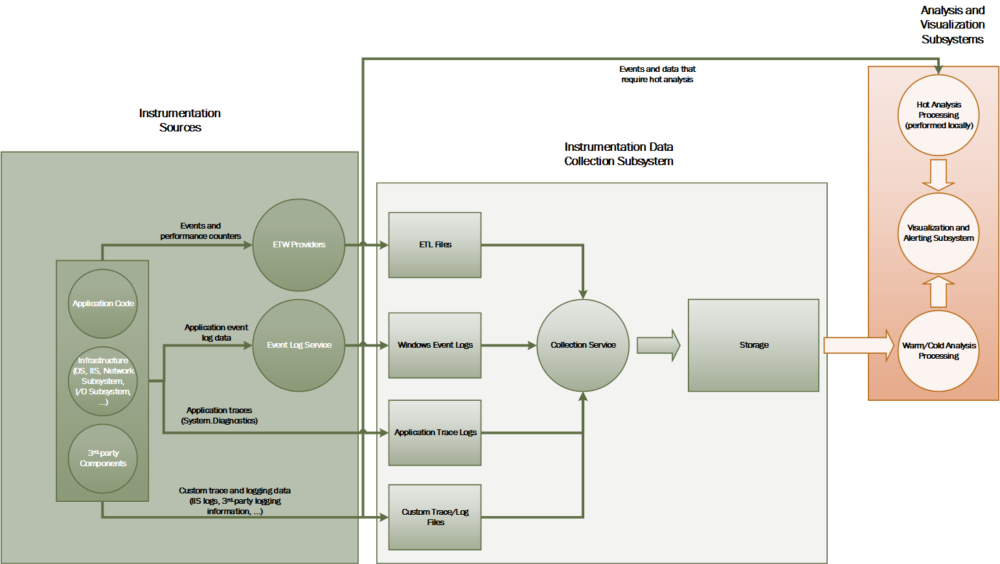
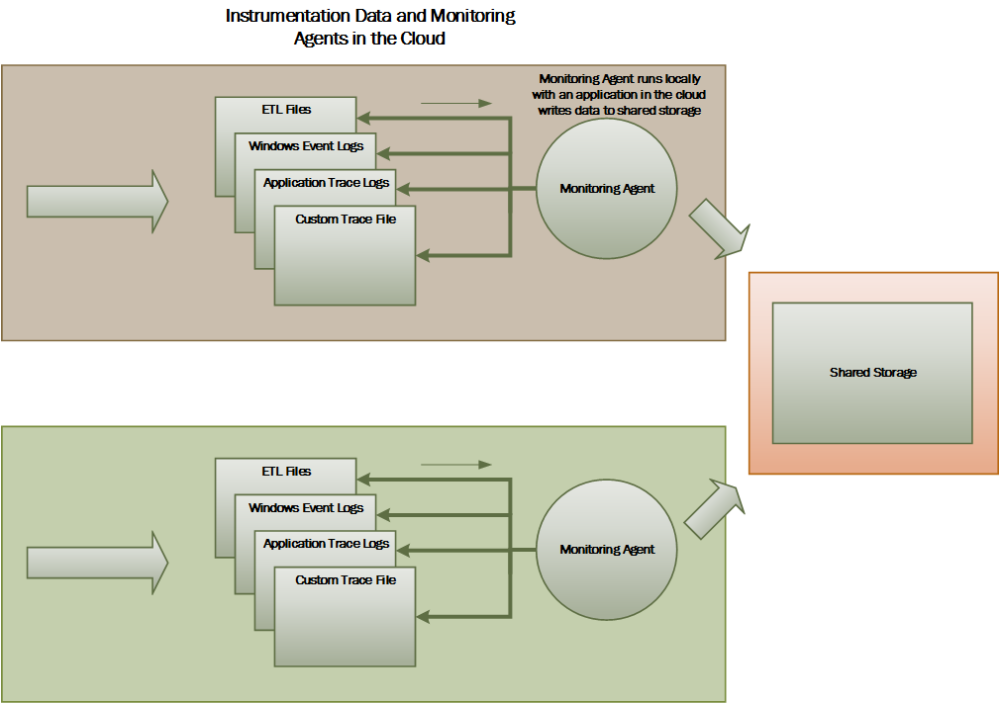
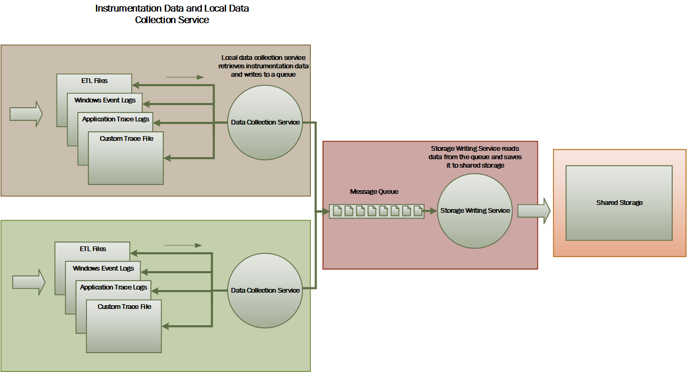
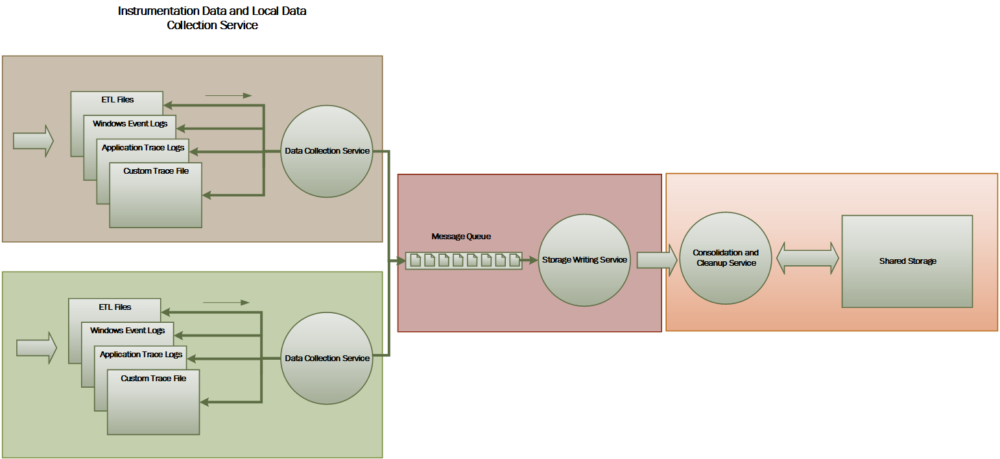

<properties
   pageTitle="监视和诊断指南 | Windows Azure"
   description="有关在云中监视分布式应用程序的最佳实践。"
   services=""
   documentationCenter="na"
   authors="dragon119"
   manager="masimms"
   editor=""
   tags=""/>

<tags
   ms.service="best-practice"
   ms.date="04/28/2015"
   wacn.date="08/29/2015"/>

# 监视和诊断指南

## 概述
根据性质，云中运行的分布式应用程序及服务是由许多移动部件组成的复杂软件片段。在生产环境中，必须能够跟踪用户利用你系统的方式、跟踪资源利用率，通常还要监视系统的运行状况和性能。可以使用本文中的信息作为诊断辅助，来检测和更正问题，同时帮助找出潜在的问题并避免其发生。

## 监视和诊断方案
监视功能可让你深入了解系统运行状况，这是维持服务质量目标的重要部分。收集监视数据的一些常见方案包括：

- 确保系统保持正常运行。
- 跟踪系统及其组件元素的可用性。
- 维护性能，以确保系统的吞吐量不会在工作量增加时意外降级。
- 保证系统符合任何与客户议定的 SLA。
- 保护系统、用户及其数据的隐私性和安全性。
- 跟踪基于审核或法规目的而执行的操作。
- 监视系统的日常使用情况，并帮助哪些趋势在未解决的情况下可能会导致问题。
- 跟踪发生的问题，从初始报告到分析可能原因、纠正、后续软件更新和部署。
- 跟踪操作和调试软件版本。

> [AZURE.NOTE]此列表并不完整。本文档着重介绍这些最常见的监视执行方案，但也可能存在一些较不常见的方案，或自身环境特有的其他方案。

以下部分更详细说明了这些方案。每种方案的信息使用以下格式介绍：

- 方案的简要概述。
- 此方案的典型要求。
- 支持方案所需的原始检测数据，以及此信息的可能来源。
- 如何分析与合并此原始数据，以生成有意义的诊断信息。

## 运行状况监视
如果系统正在运行并能够处理请求，则表示运行正常。运行状况监视的目的在于生成系统当前运行状况的快照，使你能够验证系统的所有组件是否按预期工作。

### 运行状况监视的要求
如果系统的任何部件被视为运行状况不正常，应该快速（在几秒内）向操作员发出警报。操作员应该能够确定系统的哪些部件运行正常，以及哪些部件遇到问题。系统运行状况可以使用交通灯系统来突出显示，红色表示不正常（系统已停止），黄色表示部分正常（系统正在运行但功能减少），绿色表示完全正常。

全面的运行状况监视系统可让操作员向下钻取系统，以查看子系统和组件的运行状态。例如，如果整个系统被描述为部分正常，则操作员应该能够进一步确定哪些功能当前不可用。

### 数据源、检测和数据收集要求
支持运行状况监视所需的原始数据可以由以下情况生成：

- 跟踪用户请求的执行。此信息可以用来确定哪些请求已成功、哪些请求已失败，以及每个请求花费了多长时间。
- 合成用户监视。此过程将模拟用户执行的步骤，并遵循预先定义的一系列步骤。应该捕获每个步骤的结果。
- 记录异常、错误和警告。若要捕获此信息，可以在应用程序代码中嵌入跟踪语句，以及从系统引用的任何服务的事件日志中检索信息。
- 监视系统使用的任何第三方服务的运行状况。这可能需要检索并分析这些服务提供的运行状况数据，而这些信息可能采取各种格式。
- 终结点监视。此机制将在“可用性监视”部分中详细介绍。
- 收集环境性能信息，例如后台 CPU 利用率或 I/O（包括网络）活动。

### 分析运行状况数据
运行状况监视的重点在于快速指示系统是否正在运行。如果检测到关键组件的运行状况不正常（例如，无法响应一系列连续的 ping），即时数据热分析可以触发警报。然后，操作员可以采取适当的纠正措施。

更高级的系统可能包含对最近和当前工作负荷运行冷分析的预测元素，以找出趋势并确定系统是否可能一直保持正常，或是否即将需要其他资源。此预测元素应该基于关键的性能度量值，例如每个服务或子系统中定向请求的速率、这些请求的响应时间，以及流入和流出每个服务的数据量。如果任何度量值超过定义的阈值，系统可以引发警报，让操作员或自动调整功能（如果有）采取必要的预防措施，以保持系统正常运行。这些措施可能涉及到添加资源、重新启动一个或多个失败的服务，或者向优先级较低的请求应用限制。

## 可用性监视
运行状况真正良好的系统要求构成该系统的组件和子系统可用。可用性监视与运行状况监视密切相关，但是运行状况监视提供系统当前运行状况的实时视图，而可用性监视涉及到跟踪系统及其组件的可用性，以生成有关系统运行时间的统计信息。

在许多系统中，某些组件（例如数据库）配置了内置冗余，以便在发生严重故障或连接断开时快速故障转移。在理想情况下，用户不会察觉到这种故障，但从可用性监视的立场来看，有必要尽量多地收集有关此类故障的信息，以尽量找出原因，然后采取纠正措施，并防止故障再次发生。

跟踪可用性所需的数据可能取决于一些低层因素，其中的许多因素可能特定于应用程序、系统和环境。有效的监视系统将捕获对应于这些低层因素的可用性数据，然后将其聚合以提供系统的整体视图。例如，在电子商务系统中，可让客户下单的商务功能可能取决于存储订单详细数据的存储库，以及为这些订单处理货币交易的付款系统。因此，系统的下单部件的可用性取决于存储库和付款子系统的可用性。

### 可用性监视的要求
操作员还应能够查看每个系统和子系统的历史可用性，并使用此信息来找出任何可能会造成一个或多个子系统定期发生故障的趋势（服务是否在一天的特定时间开始发生故障，而该时间对应于高峰处理时间？）

监视解决方案不仅能够提供可用性的即时和历史视图或每个子系统的其他视图，而且还应该能够在一个或多个服务发生故障或用户无法连接到服务时快速向操作员发出警报。这不仅仅是监视每个服务，而且还要检查尝试与服务通信失败时，每个用户执行的操作。在某种程度上，连接失败是正常情况，这有可能是因为暂时性错误，但允许系统就特定时段发生的子系统连接失败次数发出警报可能会有帮助。

### 数据源、检测和数据收集要求
使用运行状况监视时，支持可用性监视所需的原始数据可以通过合成用户监视和记录任何异常、错误和警告来生成。此外，还可以通过执行终结点监视来获取可用性数据。应用程序可以公开一个或多个正常的终结点，每个终结点将对系统中的某个功能区进行测试访问。监视系统可以根据定义的计划来 ping 每个终结点，并收集结果（成功或失败）。

必须记录所有的超时和网络连接失败，以及连接重试次数。所有数据应该标有时间戳。

<a name="analyzing-availablity-data"></a>
### 分析可用性数据
必须聚合并关联检测数据，以支持以下类型的分析：

- 系统和子系统的即时可用性。
- 系统和子系统的可用性故障率。在理想情况下，操作员应该能够将故障与特定的活动相关联；系统发生故障时正在执行什么操作？
- 系统或任何子系统跨任何指定时间间隔的故障率历史视图，以及故障发生时系统上的负载（例如用户请求数）。
- 无法使用系统或任何子系统的原因。例如，服务未运行、断开连接、已连接但超时，以及已连接但返回了错误。

你可以使用公式计算服务在某个时间段的可用性百分比：

```
%Availability =  ((Total Time – Total Downtime) / Total Time ) * 100
```

这有助于评估 SLA（本指南稍后详细介绍 [SLA 监视](#SLA-monitoring)）。_停机_的定义取决于服务。例如，Visual Studio Online 将停机定义为客户尝试连接到服务花费的时间超过 120 秒，以及在该时段建立连接后，所有基本读取和写入操作均失败。

## 性能监视
在随着用户数量以及这些用户访问的数据集大小的增加，因而使系统的压力越来越大时，一个或多个组件有可能会发生故障。通常，在组件发生故障之前的性能会降低。如果你可以检测到这种下降，就可以采取主动措施来补救这种局面。

系统性能取决于许多因素。每个因素通常使用关键性能指标 (KPI) 来度量，例如每秒的数据库事务数，或在指定时间范围内成功为其提供服务的网络请求量。其中一些 KPI 可用作特定的性能度量，还有一些 KPI 可能派生自度量值的组合。

> [AZURE.NOTE]若要判断性能是不良还是良好，需要了解系统应该能够运行的性能级别。这需要系统在典型负载下工作时观测系统，并在一段时间后捕获每个 KPI 的数据。这可能包括在测试环境中于模拟负载下运行系统，并在将系统部署到生产环境之前收集相应的数据。

> 你还应确保性能监视操作不会给系统造成不必要的负担。你可以动态调整有关性能监视过程收集数据的详细度。

### 性能监视的要求
若要检查系统性能，操作员通常需要查看如下所述的信息：

- 对用户请求的响应速率。
- 并发用户请求数。
- 网络流量。
- 完成业务事务的速率。
- 请求的平均处理时间。

提供可帮助操作员找出关联性的工具也很有帮助，例如：

- 并发用户数目与请求延迟时间的比较（在用户发送请求之后开始处理请求所花费的时间）。
- 并发用户数目与平均响应时间的比较（在请求开始处理之后完成请求所花费的时间长度）。
- 请求数量与处理错误次数。

操作员不但要获取此高级功能信息，而且还应该能够在系统中获取每个组件性能的详细视图。通常可以使用低级性能计数器跟踪信息来提供此数据，例如：

- 内存利用率，
- 线程数，
- CPU 处理时间，
- 请求队列长度，
- 磁盘或网络 I/O 速率和错误数，
- 写入或读取的字节数，
- 中间件指标，例如队列长度。

所有视觉效果应该允许操作员指定时间间隔；显示的数据可能是当前状况的快照和/或性能的历史视图。

操作员应该能够根据任何指定的时间间隔为任何给定值的任何性能度量引发警报。

### 数据源、检测和数据收集要求
可以通过监视用户请求抵达并通过系统的进度来收集高级性能数据（吞吐量、并发用户数、业务事务数、错误率等）。这涉及到在应用代码的关键点中添加跟踪语句以及计时信息。应该捕获所有故障、异常和警告并提供足够的数据，以将其与导致其发生的请求相关联。IIS 日志是另一个有用的信息来源。

如果可能，还应捕获应用程序使用的任何外部系统的性能数据。这些外部系统可能提供自身的性能计数器，或其他用于请求性能数据的功能。如果无法做到这一点，则应该记录信息，例如，对外部系统发出的每个请求的开始时间和结束时间，以及操作的状态（成功、失败或警告）。例如，你可以使用秒表为请求计时；在请求开始时启动计时器，在请求完成时停止计时器。

系统中各个组件的低级性能数据可通过 Windows 性能计数器和 Azure 诊断等功能来获取。

### 分析性能数据
许多分析工作包括根据用户请求类型（例如将商品添加到购物车，或在电子商务系统中执行结算过程）聚合性能数据及/或每个请求发送到的子系统或服务。

另一项常见要求是以选择的百分位数聚合性能数据。例如，确定 99% 的请求、95% 的请求和 70% 的请求的响应时间。可能存在 SLA 目标或其他针对每个百分位数设置的目标。应该以接近实时的频率报告持续结果，以帮助检测即时问题，并聚合较长一段时间的结果以生成统计信息。

如果延迟问题影响了性能，操作员应该能够通过检查每个请求执行的每个步骤是否有延迟，以快速识别发生瓶颈的原因。因此，性能数据必须提供一种方式来使每个步骤的性能度量相关联，以将这些度量关联到特定的请求。

根据可视化要求，有用的做法是生成并存储包含原始数据视图的多维数据集，以便对性能信息进行复杂的即席查询和分析。

## 安全监视
包含机密数据的所有商务系统必须实施安全结构。安全机制的复杂性通常取决于数据的机密性。在需要对用户进行身份验证的系统中，应该记录所有登录尝试，不论是失败还是成功的尝试。此外，还应记录所有执行的操作，以及经过身份验证的用户访问的所有资源的详细信息。当用户终止其会话并注销时，也应该记录此类信息。

监视可以帮助检测系统受到的攻击。例如，出现大量失败的登录尝试可能表示发生暴力破解攻击，而请求意外激增可能是 DDoS 攻击的后果。你必须准备好监视对所有资源的所有请求，不论这些请求源于何处；具有登录漏洞的系统可能不需要用户实际登录就会意外地将资源公开给外界。

### 安全监视的要求
安全监视的最重要方面是可让操作员快速：

- 检测未经身份验证的实体尝试的入侵
- 识别实体尝试对无权访问的数据执行操作
- 确定系统或其某个部件是受到内部还是外部的攻击（例如，已经过身份验证的恶意用户可能正在尝试使系统停机）。

若要满足这些要求，应将以下情况通知给操作员：

- 同一帐户在指定时间段内的登录尝试反复失败。
- 同一个已经身份验证的帐户在指定时间段内反复尝试访问禁止的资源。
- 在指定时间段内发生大量未经身份验证或未授权的请求。

提供给操作员的信息应包括每个请求来源的主机地址。如果特定的地址范围定期发生安全违规，则可以阻止这些主机。

保持系统安全的关键部分是能够快速检测偏离常规模式的操作。可以可视化方式显示失败和/或成功登录请求数等信息，以帮助检测是否在非常规时间出现活动高峰（例如用户在上午 3 点登录并执行大量操作，而他们的工作日从上午 9 点才开始）。此信息还可用于帮助配置基于时间的自动调整，例如，如果操作员观测到大量用户定期在一天的特定时间登录，操作员可以安排启动附加的身份验证服务来处理此工作量，然后在高峰过后，关闭这些附加的服务。

### 数据源、检测和数据收集要求
安全性属于大多数分布式系统的全方位层面，而相关的数据可能会在整个系统的多个点生成。应该考虑采用安全信息和事件管理 (SIEM) 方法来收集应用程序、网络设备、服务器、防火墙、防病毒软件及其他入侵预防元素引发的事件所生成的安全性相关信息。

安全监视可以整合来自不属于你应用程序的工具（例如外部机构识别端口扫描活动的实用工具，或者检测尝试在未经身份验证的情况下访问应用程序和数据的网络过滤器）的数据。

在所有情况下，收集的数据必须可让管理员确定任何攻击的性质，并采取适当的应对措施。

### 分析安全数据
安全监视的功能之一是监视数据的各种来源。不同格式和详细程度通常需要对捕获的信息进行复杂分析，以将其关联成一致的信息线索。除了最简单的情况外（例如检测大量的失败登录，或者在未经授权的情况下反复尝试访问重要资源），有时可能无法对安全数据执行任何复杂的自动化处理，而最好是将此数据（标上时间戳，但以非原始格式表示）写入到安全存储库，以供专家进行手动分析。

<a name="SLA-monitoring"></a>

## SLA 监视
许多支持客户付款的商务系统以 SLA 形式保证系统的性能。在根本上，SLA 规定系统可以在议定的时间范围内处理定义的工作量，且不会丢失重要信息。SLA 监视涉及到确保系统能够满足可度量的 SLA。

> [AZURE.NOTE]SLA 监视与性能监视密切相关，而性能监视渉及到确保系统以_最佳方式_工作，SLA 监视由定义_最佳方式_实际含义的合约责任所管控。

SLA 中通常会规定以下条款：

- 整体系统可用性。例如，组织可能会保证系统在 99.9% 的时间内可用；这相当于每年停机时间不超过 9 小时或每周停机时间约 10 分钟。
- 操作吞吐量。这个方面通常以一个或多个关键的高水位线来表示，例如，保证系统能够支持多达 100,000 个并发用户请求，或处理 10,000 个并发业务事务。
- 操作响应时间。系统还可能对请求的处理速率做出保证，例如所有业务事务的 99% 应在 2 秒内完成，而且单个事务花费的时间不会超过 10 秒。

> [AZURE.NOTE]商务系统的某些合同还可能包括有关客户支持的 SLA，例如所有服务台应在 5 分钟内对请求做出响应，所有问题的 99% 应在 1 个工作日内完全解决。有效的[问题跟踪](#issue-tracking)（本部分稍后将会介绍）是满足此类 SLA 的关键所在。

### SLA 监视的要求
在最高层面上，操作员应该能够快速确定系统是否符合议定的 SLA，如果不符合，则向下钻取并检查底层因素，以确定性能未达标准的原因。

通常，可以用可视化方式描述的高级指标包括：

- 服务运行时间百分比。
- 应用程序吞吐量（根据每秒成功的事务和/或操作数度量）。
- 成功/失败的应用程序请求数。
- 应用程序和系统的故障、异常和警告数。

应该能够根据指定的时间段筛选所有这些指标。

一个云应用程序可能会包含在多个子系统和组件中。操作员应该能够选择某个高级指标，并确定底层元素的运行状况如何影响该指标。例如，如果整个系统的运行时间低于可接受的值，操作员应该能够进一步确定哪些元素造成此故障。

> [AZURE.NOTE]需要慎重定义系统运行时间。在使用冗余确保最大可用性的系统中，元素的单个实例可能会发生故障，但系统仍可以保持正常运行。运行状况监视提供的系统运行时间应该指明每个元素的聚合运行时间，而无需多余地指出系统实际上是否已停止。此外，可以隔离故障，因此，即使特定系统不使用，系统的余下部分可能仍然可用，但是功能却会减少（在电子商务系统中，系统故障可能会阻止客户下单，但客户仍可浏览产品目录）。

为了生成警报，如果有任何高级指标超出指定的阈值，系统应该能够引发事件。构成高级指针的各项因素的较低级详细信息应该可以用作警报系统的上下文数据。

### 数据源、检测和数据收集要求
支持 SLA 监视所需的原始数据类似于性能监视所需的原始数据，以及运行状况和可用性监视的某些方面（有关详细信息，请参阅相关部分）。可以通过以下方式捕获此数据：

- 执行终结点监视。
- 记录异常、错误和警告。
- 跟踪用户请求的执行。
- 监视系统所用任何第三方服务的可用性。
- 使用性能度量值和计数器。

必须为所有数据计时并标上时间戳。

### 分析 SLA 数据
必须聚合检测数据，以生成系统整体性能视图以及支持向下钻取，使你能够检查底层子系统的性能。例如，你应该能够：

- 计算给定时间段的用户请求总数，并确定这些请求的成功率和失败率。
- 合并用户请求的响应时间，以生成系统响应时间的整体视图。
- 分析用户请求的进度，将给定请求的整体响应时间细分为该请求中单个工作项的响应时间。  
- 根据任何特定时间段的运行时间百分比确定系统的整体可用性。
- 分析系统中各个组件和服务的可用性时间百分比。这可能包括分析第三方服务生成的日志。

许多商务系统要求根据议定的 SLA 来报告指定时间段（通常是一个月）的实际性能数据。如果在该时间段不符合 SLA，则可以使用此信息计算客户的信用或其他形式的偿还额度。你可以使用[分析可用性数据](#analyzing-availability-data)部分中所述的方法来计算服务可用性。

在内部，组织还可以跟踪导致服务故障的事故数目与性质。学习如何快速解决或完全消除这些问题，将有助于减少停机时间并满足 SLA。

## 审核
根据应用程序的性质，可能有法令或其他法规规定要求审核用户执行的操作并记录所有数据的访问。审核可以提供将客户链接到特定请求的证据；在许多电子商务系统中，不可否认性是帮助维护客户与负责应用程序或服务组织之间的信任的重要因素。

### 审核的要求
分析人员必须能够跟踪用户执行业务操作的顺序，以便你可以重构用户的操作。可能只是出于记录或法证调查而需要这样做。

审核信息高度机密，因为它可能包含识别系统用户的数据，以及用户执行的任务。为此，很可能将以报告形式提供给受信任的分析人员来可视化审核信息，而不是使用支持向下钻取图形操作的交互式系统。分析人员应该能够生成各种报告，例如，列出在指定时间范围内发生的所有用户活动、详述单个用户的活动时序，或列出针对一个或多个资源执行的一系列操作。

### 数据源、检测和数据收集要求
审核信息的主要来源能够包括：

- 管理用户身份验证的安全系统。
- 记录用户活动的跟踪日志。
- 跟踪所有可识别和不可识别网络请求的安全日志。

审核数据的格式及其存储方式可能受到法规要求的约束。例如，可能无法以任何方式清理数据（必须以其原始格式记录），并且对保存数据的存储库的访问必须受到保护，以防篡改数据。

### 分析审核数据
分析人员必须能够完全访问原始格式的原始数据。除了生成一般审核报告的要求外，用于分析此数据的工具还可能专门化及保持为系统的外部工具。

## 使用情况监视
使用情况监视跟踪如何使用应用程序的功能和组件。收集的数据可用于：

- 确定重度使用的功能，以及确定系统中的任何潜在热点。高流量元素可受益于功能分区或更平均分散负载的平均复制。此信息还可用于确定哪些功能不常使用，并且可能成为未来版本中淘汰或取代的候选项。
- 获取正常使用情况下系统操作事件的相关信息。例如，在电子商务站点中，可以记录有关交易数和负责这些交易的客户数的统计信息。此信息可在客户数增加时用于容量规划。
- 检测（可能为间接）系统性能或功能的用户满意度。例如，如果电子商务系统中大量客户定期放弃其购物车，则可能表示结算功能出现问题。
- 生成帐单信息。商务应用程序或多租户服务可能会由于客户使用资源而向其收费。
- 强制实施配额。如果多租户系统中的用户在指定时间段超过其付费的处理时间或资源使用量配额，则可以限制其访问或限制处理。

### 使用情况监视的要求
若要检查系统使用情况，操作员通常需要查看如下所述的信息：

- 每个子系统正在处理并被定向到每个资源的请求数。
- 每个用户执行的工作。
- 每个用户占用的数据存储量。
- 每个用户正在访问的资源。

操作员还应该能够生成图形，例如，显示使用资源最多的用户或最常访问的资源。

### 数据源、检测和数据收集要求
可在相对较高的级别执行使用情况跟踪，记下每个请求的开始时间和结束时间，以及请求的性质（读取、写入等等，具体取决于相关的资源）。可以通过以下方式获取此信息：

- 跟踪用户活动。
- 捕获度量每项资源利用率的性能计数器。
- 监视每个用户执行的操作的 CPU 和 I/O 利用率。

为了计量，你还需要能够识别哪些用户负责执行哪些操作，以及这些操作利用的资源。收集的信息应该详细到足以实现精确的计费。

<a name="issue-tracking"></a>
## 问题跟踪
如果系统中发生意外的事件或行为，客户与其他用户可以报告问题。问题跟踪涉及到管理这些问题、将其与解决系统中任何底层问题的工作量相关联，以及将可能的解决方案通知给客户。

### 问题跟踪的要求
通常使用独立的系统执行问题跟踪，使操作员可以记录和报告用户所报告的问题的详细信息。这些详细信息可以包含用户正在尝试执行的任务、问题的症状、事件序列，以及发出的任何错误或警告消息等信息。

### 数据源、检测和数据收集要求
问题跟踪数据的初始数据源是在第一时间报告问题的用户。用户可能会提供其他数据，例如故障转储（如果应用程序包含用户桌面上运行的组件）、屏幕截图和发生错误的日期与时间，以及任何其他环境信息（例如其位置）。

此信息可用于输入到调试工作，并帮助构建将来软件版本的待办事项。

### 分析问题跟踪数据
不同的用户可能会报告相同的问题，因此问题跟踪系统应该将常见报告相关联。

调试工作的进度应该针对每个问题报告进行记录，当问题解决时，可以将解决方案通知给客户。

如果用户报告了一个已识别的问题，而该问题在问题跟踪系统中有已知的解决方案，则操作员应该能够立即将解决方案通知给用户。

## 跟踪操作和调试软件版本
当用户报告问题时，用户通常只留意对他（或她）操作的即时影响，并且用户只能将自己体验的结果回报给负责维护系统的操作员。这些体验通常只是一个或多个基本问题的可视症状。在许多情况下，分析人员必须认真找出基本操作的时序，以建立问题的根本原因（此过程称为_根本原因分析_）。

> [AZURE.NOTE]根本原因分析可能发现应用程序的设计缺乏效率。在这种情况下，可以重新设计受影响的元素，并将其部署为后续版本的一部分。此程序需要仔细控制，并且应该密切监视更新的组件。

### 跟踪和调试的要求
为了跟踪意外的事件和其他问题，至关重要的一点是，监视数据不仅要提供足够的在较高级别发生的问题的相关信息，而且还要包含足以让分析人员可以回溯这些问题的起源并重新构建发生的事件序列的详细信息。此信息必须足以让分析人员能够诊断任何问题的根本原因，以便开发人员可以进行必要的修改以防止重复发生。

### 数据源、检测和数据收集要求
故障排除可能涉及到跟踪所有作为操作一部分调用的方法（及其参数），而此操作会构建树状结构，描述当客户发出特定请求时通过系统的逻辑流。需要捕获和记录系统由于执行此流而生成的异常和警告。

为了支持调试，系统可以提供挂钩，使操作员能够在系统中的关键点捕获状态信息，或在选定的操作进行时提供详细的逐步信息。捕获这种程度的详细信息可能对系统造成额外的负担，这应该是一个短暂的过程，主要用于发生极不寻常的事件序列，或系统中新发布的一个或多个元素需要仔细监视时，以确保其按预期工作。

## 监视和诊断管道
监视大规模分布式系统是一个很大的难题，前一部分中所述的每种方案不一定是孤立的方案。可能每种情况所需的监视和诊断数据中发生相当程度的重叠，但此数据可能需要以不同方式进行处理和呈现。出于这些原因，应该获取监视和诊断的总体视图。

可将整个监视和诊断过程设想为构成图 1 所示各阶段的管道。


_图 1.监视和诊断管道中的阶段_

图 1 突出显示了如何从各种数据源获取用于监视与诊断的数据。检测/收集阶段与检测相关；确定捕获哪些数据、如何将其捕获以及如何格式化此数据，以便可以轻松检查数据。分析/诊断阶段采用原始数据，并使用它生成用于确定系统状态的有意义信息。此信息可用于做出有关要采取可能措施的决策，并且结果可以回送到检测/收集阶段。可视化/警报阶段呈现系统状态的耗用视图；可以使用一系列仪表板以接近实时的频率显示信息，并且可以生成报告、图形和图表，以提供可以帮助识别长期趋势的数据的历史视图。如果信息指出 KPI 可能会超过可接受的界限，则此阶段还可以对操作员触发警报。在某些情况下，警报还可用于触发尝试采取纠正措施（例如自动调整）的自动化过程。

请注意，这些步骤会构建连续流程，其中的各个段都将会同时发生。在理想情况下，所有阶段应该可以动态配置；在某些时间点，尤其是在新部署系统或发生问题时，可能需要更频繁地收集扩展数据。在其他时候，应该可以恢复为捕获基本级别的重要信息，以验证系统是否正常工作。

此外，整个监视过程应该被视为实时进行的解决方案，该解决方案将要根据反馈进行微调和改善。例如，你首先可以度量许多因素以确定系统运行状况，但是经过一段时间的分析可能会得到优化，因为你会丢弃无关的度量，以便能够更专注于所需的数据，同时可将任何后台干扰降到最低。

## 监视和诊断数据的源
监视过程使用的信息可能来自多个源，如图 1 所示。在应用程序级别，信息来自系统代码中整合的跟踪日志。开发人员应该遵循通过其代码跟踪控制流的标准方法（例如，在进入方法时发出跟踪消息，用于指定方法的名称、当前时间、每个参数的值，以及任何其他相关信息。记录进入和退出时间也可能会有用）。你应该记录所有异常和警告，并确保保留任何嵌入异常和警告的完整跟踪。在理想情况下，你还应该捕获用于识别运行代码的用户的信息，以及活动关联信息（可在其通过系统时跟踪请求），并记录访问所有资源（例如消息队列、数据库、文件及其他依赖服务）的尝试；此信息可用于计量和审核用途。

许多应用程序使用库和框架来执行常见任务，例如访问数据存储，或通过网络进行通信。这些框架可配置为输出其自身的跟踪消息和原始诊断信息，例如事务速率、数据传输成功和失败数，等等。

> [AZURE.NOTE]许多现代框架会自动发布性能和跟踪事件，因此捕获此信息只是提供了一种方式用于检索此信息并将其存储在可以处理和分析的位置。

应用程序运行所在的操作系统可能是低级的系统范围信息的源，例如，指出 I/O 速率、内存利用率和 CPU 使用率的性能计数器。可能还会报告操作系统错误（例如，无法正常打开文件）。

还应该考虑到运行系统的底层基础结构和组件。虚拟机、虚拟网络和存储服务全都可以是重要底层基础结构级别的性能计数器及其他诊断数据的源。

如果应用程序使用其他外部服务（例如 Web 服务器或数据库管理系统），这些服务可能会发布自身的跟踪信息、日志和性能计数器。示例包括 SQL Server 动态管理视图（用于跟踪针对 SQL Server 数据库执行的操作）和 Internet 信息服务器跟踪日志（用于记录对 Web 服务器发出的请求）。

修改系统的组件和部署新版本时，必须能够将问题、事件和度量值归因于每个版本。应将此信息关联回到发布管道，以便能够快速跟踪并纠正特定组件版本的问题。

安全问题可能会发生在系统中的任何时间点。例如，用户可能尝试以无效的用户 ID 或密码登录；已经身份验证的用户可能会尝试在未获授权的情况下获取对资源的访问权限；或者，用户可能会提供无效或过期的密钥以访问加密的信息。始终应该记录成功和失败请求的安全相关信息。

[检测应用程序](#instrumenting-an-application)部分包含应该捕获的信息，但你可以使用各种策略在第一时间收集此信息：

- **应用程序/系统监视**。此策略会使用应用程序、应用程序框架、操作系统和底层基础结构中的内部源。应用程序代码本身可以在客户端请求的生命周期内于重要的时间点生成自身的监视数据。应用程序可以包含跟踪语句，你可以根据情况选择性地启用或禁用这些语句。还可以通过使用诊断框架动态注入诊断。这些框架通常会提供可以附加到代码中各个检测点并在这些点捕获跟踪数据的插件。

此外，代码和/或底层基础结构可能会在关键点引发事件。配置为侦听这些事件的监视代理可以记录事件信息。

- **实际用户监视**。此方法记录用户与应用程序之间的交互并观测每个请求和响应的流。此信息可能具有双重用途：可供每个用户用来计量使用情况，并且可用于确定用户享用的服务质量是否适当（例如，快速响应时间、低延迟和发生最少错误）。捕获的数据可用于识别最常发生失败的关注区域，以及其中系统可能由于应用程序中的热点或其他某种形式的瓶颈而变慢的元素。如果慎重实施这种方法，则可以通过用于调试和测试的应用程序重新构建用户的流。

	> [AZURE.IMPORTANT]通过监视实际用户而捕获的数据应被视为高度机密，因为它可能包含机密材料。如果要保存捕获的数据，必须将其妥善存储。如果出于性能监视或调试目的而使用数据，首先应剥离所有个人识别信息。

- **合成用户监视**。使用这种方法，你可以编写自己的测试客户端来模拟用户，并执行可配置但典型的一系列操作。你可以跟踪测试客户端的性能，以帮助确定系统的状态。还可以使用测试客户端的多个实例作为负载测试操作的一部分，以确定系统在压力下如何响应，以及在这些情况下生成哪种监视输出。

	> [AZURE.NOTE]你可以实施实际和合成用户监视，方法是包含代码来跟踪方法调用的执行并为其计时，以及包含应用程序的其他重要部分。

- **分析**。这种方法主要以监视和改善应用程序性能为目标。它不是在实际和合成用户监视所使用的功能级别运行，而是在应用程序运行时捕获更低级信息。若要实施分析，可以定期对应用程序的执行状态进行采样（确定应用程序在特定时间点正在运行哪个代码片段），或使用在重要时刻（例如方法调用的开始和结束时间）将探测插入代码的检测，而此检测会记录何时调用方法和每个调用花费多长时间。然后，可以分析此数据，以确定应用程序的哪些部分可能会造成性能问题。

- **终结点监视**。此方法专门使用应用程序公开的一个或多个诊断终结点来启用监视。终结点提供一个进入应用程序代码的途径，并可返回有关系统运行状况的信息。不同的终结点可以专注于功能的各方面。你可以编写自己的诊断客户端，用于定期将请求发送到这些终结点，并同化响应。Microsoft 网站上的[运行状况终结点监视模式](https://msdn.microsoft.com/zh-cn/library/dn589789.aspx)更全面地描述了此方法。

若要获得最大覆盖范围，你应该搭配使用这些方法。

<a name="instrumenting-an-application"></a>
## 检测应用程序
检测是监视过程不可或缺的一部分；仅当捕获了可让你对系统的性能和运行状况做出有意义的决策的数据时，才能做出这些决策。使用检测收集的信息应该足以让你评估性能、诊断问题和做出决策，而不迫使你登录远程生产服务器来手动执行跟踪（和调试）。

检测数据通常包含写入跟踪日志的信息和度量值：

- 跟踪日志的内容可能是由应用程序写入文本数据的结果，这是由于跟踪事件而创建的二进制数据（如果应用程序使用 Windows 事件跟踪 – ETW），或者可从系统日志生成它们，这些日志将记录基础结构部件（例如 Web 服务器）生成的事件。文本日志消息通常可供用户阅读，但也应该以可让它们被自动化系统轻松分析的格式来写入它们。还应该将日志分类；不要将所有跟踪数据写入单个日志，但使用独立的日志来记录系统不同操作层面的跟踪输出。这样，你便可以从相应的日志读取，而不必处理单个冗长的文件，因而可以快速筛选日志消息。切勿将具有不同安全要求的信息（例如审核信息和调试数据）写入同一日志。

	> [AZURE.NOTE]日志可以作为文件系统上的文件来实施，或者用其他某种格式保存，例如 Blob 存储中的 Blob。日志信息还可以保存在更结构化的存储中，例如表中的行。

- 度量值通常只是系统中某个层面或资源在特定时间的度量或计数，附有一个或多个关联的标记或维度（有时称为_样本_）。隔离时度量值的单个实例通常没有用；必须在经过一段时间后捕获度量值。要考虑的要点是应该记录哪些度量值，以及多久记录一次。过于频繁地生成度量值数据可能对系统造成极大的额外负担，而不常捕获度量值可能导致遗漏造重大事件的情况。考虑因素根据度量值的不同而异。例如，服务器上的 CPU 利用率可能在很短时间内就有很大的变化，但只在高利用率长时间存活超过数分钟时才变成问题。

<a name="information-for-correlating-data"></a>
### 关联数据的信息
你可以轻松监视单个系统级别的性能计数器、捕获资源的度量值，以及从各种日志文件获取应用程序跟踪信息，但某些形式的监视需要监视管道中的分析与诊断阶段，才能使从多个源捕获的数据相关联。此数据可能在原始数据中采用多种格式，并且必须为分析过程提供足够的检测数据，才能映射这些不同的格式。例如，在应用程序框架级别，某个任务可能由线程 ID 标识，但在应用程序中，同一工作可能与执行该任务的用户的用户 ID 相关联。此外，线程与用户请求之间不可能存在 1:1 映射，因为异步操作可能重复使用相同的线程，代表多个用户执行操作。当执行事务流过系统时，单个请求可能由多个线程处理，因此事情变得更加复杂。如果可能，请将每个请求与通过系统作为请求上下文一部分而传播的唯一活动 ID 相关联（用于生成活动 ID 并将其加入跟踪信息的方法取决于用于捕获跟踪数据的技术）。

所有监视数据应该以相同的方式标上时间戳。为了保持一致，请使用协调世界时记录所有日期和时间。这有助于更轻松地跟踪事件序列。

> [AZURE.NOTE]在不同时区和网络中运行的计算机可能不同步，因此你不应该依赖于单独使用时间戳来使跨越多台计算机的检测数据相关联。

### 检测数据应包含哪些信息？
确定需要收集哪些检测数据时，请注意以下几点：

- 跟踪事件所捕获的信息应该是机器和用户可读的信息。你应该对此信息采用妥善定义的架构，以帮助自动处理跨系统的日志数据，并为读取日志的操作和工程人员提供一致性。包含环境信息，例如部署环境、运行进程的计算机、进程的详细信息，以及调用堆栈。  
- 分析可能对系统造成很大的开销，因此只应在必要时才启用。使用检测进行的分析会在发生每个事件（例如方法调用）时记录事件，而采样只记录选定的事件。选定的事件可以基于时间 – 每隔 N 秒一次；或者基于频率 – 每隔 N 个请求一次。如果事件频繁发生，通过检测进行分析可能造成太大的负担，并且本身会影响整体性能。在此情况下，最好使用采样方法。但是，如果事件频率太低，则采样可能会遗漏事件，在此情况下，检测可能是更好的方法。
- 提供足够的上下文，使开发人员或管理员能够确定每个请求的源。这可能包括某种形式的活动 ID（用于标识请求的特定实例），以及可用于使此活动与执行的计算工作和使用的资源相关联的信息。请注意，此工作可能跨进程与计算机边界。对于计量，上下文还应该包括（直接或间接通过其他关联信息）导致发出请求的客户引用。此上下文提供有关捕获监视数据时应用程序状态的有用信息。
- 记录所有请求，以及从中发出这些请求的位置或区域。此信息可以帮助确定是否有任何位置特定的热点，并提供有用的数据帮助确定是否要将应用程序或其使用的数据重新分区。
- 仔细记录并捕获异常的详细信息。通常，丢失重要的调试信息是因为不良的异常处理。捕获应用程序引发的异常的完整详细信息，如果可能，还应包含任何内部异常及其他上下文信息，包括调用堆栈。
- 应用程序的不同元素捕获的数据必须一致，因为这可以帮助分析事件，并使其与用户请求相关联。请考虑使用完整且可配置的日志记录包来收集信息，而不是依赖于开发人员实施全部采用相同方法的不同系统部件。从关键性能计数器收集数据，例如执行的 I/O 数量、网络利用率、请求数、内存使用率，以及 CPU 利用率。某些基础结构服务可能提供自身的特定性能计数器，例如数据库连接数、执行事务的速率，以及成功或失败的事务数。应用程序还可以定义自身的特定性能计数器。
- 记录所有对外部服务进行的调用，例如数据库系统、Web 服务或其他作为基础结构一部分提供的系统级服务（例如 Azure 缓存）。记录执行每个调用花费的时间，以及调用成功或失败的相关信息。如果可能，请捕获所有重试和由于发生任何暂时性错误而失败的相关信息。

### 确保与遥测系统兼容
在许多情况下，检测生成的信息将作为一系列事件生成，并被传递到独立的遥测系统进行处理和分析。遥测系统通常独立于任何特定应用程序或技术，但是信息应会遵循通常由架构所定义的特定格式。架构有效地指定一个合约，用于定义遥测系统可以引入的数据字段和类型。架构应通用化，以便能够从各种平台和设备传入数据。

常用的架构应该包含所有检测事件公用的字段，例如事件名称、事件时间、发件人的 IP 地址，以及与其他事件关联所需的详细信息（例如用户 ID、 设备 ID 和应用程序 ID）。请记住，事件可能由任意数目的设备引发，因此架构不应依赖于设备类型。此外，同一应用程序的事件可能由许多不同设备引发；应用程序可能支持漫游或其他某种形式的跨设备分发。在理想情况下，这些字段的大部分应该映射到用于捕获事件的日志记录库的输出。

架构还可能包含与不同应用程序常用的特定方案相关的域字段。这可能是有关异常、应用程序开始和结束事件，以及 Web 服务 API 调用成功和/或失败的信息。所有使用同一组域字段的应用程序应该发出相同的一组事件，使你能够构建一组通用报告和分析。

最后，架构可能包含自定义字段，用于捕获应用程序特定事件的详细信息。

### 检测应用程序的最佳实践
以下列表汇总了有关检测云中运行的分布式应用程序的最佳实践。

- 使日志易于阅读，且易于分析。尽可能使用结构化日志。日志消息简明扼要。
- 写入每条日志记录时，在所有日志中标识源并提供上下文和计时信息。
- 对所有时间戳使用相同的时区和格式。这有助于使跨不同地理区域运行的硬件和服务的操作事件相关联。
- 将日志分类并将消息写入适当的日志文件。
- 不要透露有关系统的机密信息或有关用户的个人信息。在记录之前删除此信息，但确保保留相关的详细信息。例如，从任何数据库连接字符串中删除 ID 和密码，但将其余信息写入日志，使分析人员可以确定系统是否正在访问正确的数据库。记录所有严重异常，但允许管理员打开和关闭更低级异常和警告的日志记录。此外，捕获并记录所有重试逻辑信息。此数据可用于监视系统的暂时性运行状况。
- 跟踪进程调用，例如对外部 Web 服务或数据库发出的请求。
- 不要在同一日志文件中混合具有不同安全要求的日志消息。例如，不要将调试和审核信息写入同一日志。
- 除了审核事件外，所有日志调用都应该是不会阻止业务操作进度的即发即弃操作。审核事件例外，因为它对企业很重要，并且可以分类为业务操作的基本部分。
- 日志记录应可扩展，并且对具体目标没有任何直接依赖性。例如，不要使用 _System.Diagnostics.Trace_ 写入信息，而是定义用于公开日志记录方法，并可使用任何相应方式实现的抽象接口（例如 _ILogger_）。
- 所有日志记录必须具有故障安全性，并且永不触发任何级联错误。日志记录不得引发任何异常。
- 将检测视为进行中的迭代过程，并定期检查日志，而不只是在出现问题时。

## 收集和存储数据
监视过程的收集阶段涉及到检索检测生成的信息、格式化此数据以更方便使用分析/计算阶段，以及将已转换的数据保存在可靠且可访问的存储中。从分布式系统的不同部件收集的检测数据可以保存在各种位置，并以不同的格式保存。例如，应用程序代码可以生成跟踪日志并生成应用程序事件日志数据，而监视应用程序使用的基础结构的关键层面性能计数器可以使用其他技术来捕获。应用程序使用的任何第三方组件和服务可以使用独立的跟踪文件、Blob 存储甚至自定义数据存储提供不同格式的检测信息。

执行数据收集的方式通常是实施可从生成检测数据应用程序自动运行的收集服务。图 2 演示了此体系结构的示例，其中突出显示了检测数据收集子系统。



_图 2.收集检测数据_

请注意这是一个简化视图。收集服务不一定是单一过程，可能包含不同计算机上运行的许多构成部件，如以下部分中所述。此外，如果需要对某些遥测数据快速执行分析（热分析，如后面的[支持热、暖和冷分析](#supporting-hot-warm-and-cold-analysis)部分中所述），收集服务外部运行的本地组件可以立即执行分析任务。图 2 针对选定的事件描述了这种情况；在分析处理后，结果可以直接发送到可视化和警报子系统。需要暖分析或冷分析的数据将保留在存储中，同时等候处理。

对于 Azure 应用程序和服务，Azure 诊断 (WAD) 提供了一个可行的解决方案来捕获数据。WAD 从每个计算节点的以下源收集数据、将其聚合在一起，然后上载到 Azure 存储空间：

- Azure 日志
- IIS 日志
- IIS 失败请求日志
- Windows 事件日志
- 性能计数器
- 故障转储
- Windows Azure 诊断基础结构日志  
- 自定义错误日志

有关详细信息，请参阅 Microsoft 网站上的 [Azure：遥测基础知识和疑难解答](http://social.technet.microsoft.com/wiki/contents/articles/18146.windows-azure-telemetry-basics-and-troubleshooting.aspx)一文。

### 收集检测数据的策略
由于云的弹性，为了避免从系统中每个节点手动检索遥测数据，你应该安排将数据发送到中心位置并进行合并。在跨多个数据中心的系统中，先根据区域收集、合并数据，再将数据存储在区域中，然后将区域数据聚合成单个中心系统可能很有帮助。

若要优化带宽使用，可以选择以区块方式（如批）发送较不紧急的数据。不过，数据不得无限期延迟，特别是当它包含时间敏感的信息时。

#### _提取和推送检测数据_
检测数据收集子系统可以从各种日志和应用程序的每个实例的其他源主动检索检测数据（_提取模型_），或可以用作被动接收者，等候要从构成应用程序每个实例的组件发送的数据（_推送模型_）。

实现提取模型的方法是将本地运行的监视代理与应用程序的每个实例配合使用。监视代理是独立的进程，可定期检索（提取）已在本地节点收集的遥测数据，并将此信息直接写入到应用程序所有实例共享的中心存储。这是 WAD 实施的机制。Azure Web 或辅助角色的每个实例可以配置为捕获本地存储的诊断和其他跟踪信息。一起运行的每个监视代理将指定的数据复制到 Azure 存储空间。Microsoft 网站上的[为 Azure 云服务和虚拟机配置诊断](https://msdn.microsoft.com/zh-cn/library/azure/dn186185.aspx)页提供了有关此过程的详细信息。某些元素（例如 IIS 日志、故障转储和自定义错误日志）将写入 Blob 存储，而来自 Windows 事件日志、ETW 事件和性能计数器的数据将记录在表存储中。图 3 演示了此机制：



_图 3.使用监视代理提取信息并写入共享存储_

> [AZURE.NOTE]监视代理非常适合用于捕获从数据源自然提取的检测数据，例如来自 SQL Server 管理视图的信息或 Azure 服务总线队列的长度。

有关配置和使用 Azure 诊断的信息，请访问 Microsoft 网站上的[使用 Azure 诊断收集日志记录数据](https://msdn.microsoft.com/zh-cn/library/azure/gg433048.aspx)页。

使用刚才介绍的方法可以有效地在单个位置存储数量有限的节点上运行小型应用程序的遥测数据。但是，复杂、高度可缩放、全局云应用程序可以轻松地从数百个 Web 和辅助角色、数据库分片和其他服务生成大量的数据。此大量数据很容易超额占用单个中心位置提供的 I/O 带宽。因此，遥测解决方案必须可缩放，以防止它在系统扩展时成为瓶颈，并且在理想情况下，应整合某种程度的冗余，以降低系统部件发生故障时丢失重要监视信息（例如审核或计费数据）的风险。

若要解决这些问题，可以实施队列。图 4 显示了此结构。在此体系结构中，本地监视代理（如果可以进行相应的配置）或自定义数据收集服务（如果不可以进行相应的配置）会将数据发布到队列，异步运行的独立进程（图 4 中的“存储写入服务”）将采用此队列中的数据，并将其写入共享存储。消息队列适用于这种方案，因为它至少提供一次语义，确保一旦发布就不丢失队列的数据。可以使用独立的辅助角色来实施存储写入服务。



_图 4.使用队列来缓冲检测数据_

在收到数据时，本地数据收集服务可将数据立即添加到队列。队列可以充当缓冲区，存储写入服务可以按自身的步调检索和写入数据。默认情况下，队列根据先进先出的原则运行，但如果消息包含必须更快处理的数据，你可以设置消息的优先级，以通过队列将其加速。有关详细信息，请参阅[优先级队列](https://msdn.microsoft.com/zh-cn/library/dn589794.aspx)模式。或者，你可以使用不同的通道（例如服务总线主题），根据所需的分析处理形式将数据定向到不同的目标。

为了实现可缩放性，可以运行存储写入服务的多个实例。如果有大量的事件，你可以使用事件中心将数据分派给不同的计算资源进行处理和存储。

<a name="consolidating-instrumentation-data"></a>
#### _合并检测数据_
数据收集服务从应用程序的单个实例检索的检测数据提供了该实例运行状况和性能的本地化视图。若要评估系统的整体运行状况，需要将本地视图中某些层面的数据合并在一起。这可以在存储数据之后执行，但在某些情况下，也可以在收集数据时进行。系统不会直接将检测数据写入共享存储，而是通过独立的数据合并服务传递检测数据，此服务可以合并数据，并可充当筛选器和清理进程。例如，包含相同关联信息（例如活动 ID）的检测数据可以合并（可能用户最初在一个节点上执行业务操作，然后在节点发生故障时，或根据负载平衡的配置方式，转移到另一个节点）。此进程还可以检测和删除任何重复数据（如果遥测服务使用消息队列将检测数据推送到存储，则始终存在这种可能性）。图 5 演示了此结构的示例。



_图 5.使用独立的服务来合并和清理检测数据_

### 存储检测数据
前面内容中相当简单的视图描述了检测数据的存储方式。事实上，可以合理使用最适合每种类型可能使用方式的技术来存储不同类型的信息。例如，Azure Blob 和表存储在访问方式方面有一些相似之处，但对你可以使用它来执行的操作却有所限制，并且保留的数据的数据粒度相当不同。如果你需要运行更多的分析操作或需要对数据使用全文搜索功能，可能更适合使用数据存储，因为它提供的功能已针对特定类型的查询和数据访问进行优化。例如，性能计数器数据可以存储在 SQL 数据库中以启用即时分析；跟踪日志可能适合存储在 Azure DocumentDB 中；安全信息可以写入 HDFS；需要全文搜索的信息可以使用弹性搜索来存储（还可以使用丰富检索来加速搜索）。 可以实施一个附加的服务用于定期从共享存储检索数据，根据数据用途来分区和筛选数据，然后将其写入一组适合的数据存储，如图 6 所示。另一种方法是在合并和清理过程中包含此功能，并在检索到数据时直接将它写入这些存储，而不是将它存储在中间共享存储区域。每一种方法有其优点和缺点。实施独立分区服务可以减少合并与清理服务的负载，至少可在需要时重新生成某些分区的数据（取决于共享存储中保留的数据量）。但是，这会消耗更多的资源，并且在从每个应用程序实例接收检测数据与将此数据转换成有用信息之间可能出现延迟。


_图 6.根据分析和存储要求将数据分区_

可能会出于多个目的而需要同一检测数据。例如，性能计数器可用于提供系统在一段时间内的性能历史视图，但此信息也可能与其他使用情况数据结合来生成客户帐单信息。在这些情况下，可将同一数据发送到多个目标，例如文档数据库（可充当用于保存帐单信息的长期存储）和多维存储（用于处理复杂的性能分析）。

还应该考虑需要数据的紧急程度。提供警报信息的数据需要快速访问，因此应该保留在快速数据存储中，并编制索引或结构化以优化警报系统运行的查询。在某些情况下，可能需要遥测服务收集每个节点上要格式化的数据，并在本地存储数据，以便警报系统的本地实例可以快速通知任何问题。同一数据可以发送到前面图表中显示的存储写入服务，如果出于其他目的而需要它，则集中存储。

用于更深入分析、报告和找出历史趋势的信息较不紧急，并且可用支持数据采矿和即席查询的方式存储。有关详细信息，请参阅本文档后面的[支持热、暖和冷分析](#supporting-hot-warm-and-cold-analysis)部分。

#### _日志轮转和数据保留_
检测可能生成相当多的数据。从原始日志、跟踪文件和在每个节点上捕获的其他信息开始，到共享存储中保留的此数据的已合并、已清理和已分区视图，此数据可能保留在多个位置。在某些情况下，处理并传输数据后，可以从每个节点中删除原始数据。在其他情况下，可能有必要存储原始信息，或者这样做会有用。例如，出于调试目的而生成的数据最好能够保留原始格式，但是纠正任何 Bug 之后，就可以迅速将其丢弃。性能数据通常有较长的寿命，因此可用于找出性能趋势，以及进行容量规划。此数据的合并视图通常在一段有限的时间内保持联机以实现快速访问，过了这段时间后，可以将其存档或丢弃。针对客户计量和计费收集的数据可能需要无限期保存。此外，法规要求可能规定，针对审核和安全目的收集的信息也需要存档和保存。此数据也很机密，因此可能需要加密或进行保护，以防止篡改。永远不应记录诸如用户密码或其他可用于实行身份诈骗的信息；应该先从数据中清除此类详细信息，然后再存储数据。

#### _向下采样_
通常，存储能够找出长期趋势的历史数据很有用。不是保存整个旧数据，而是可以向下采样数据，以降低其分辨率并节省存储成本。举例来说，不是存储每分钟的性能指标，而是可以合并超过一个月的数据，以构成每小时的视图。

### 收集和存储日志记录信息的最佳实践
以下列表汇总了有关捕获和存储日志记录信息的最佳实践。

- 监视代理或数据收集服务应该作为进程外服务运行，并且应易于部署。
- 来自监视代理或数据收集服务的所有输出应该是与计算机、操作系统或网络协议无关的格式。例如，以自我描述格式发出信息，例如 JSON、MessagePack 或 Protobuf，而不是 ETL/ETW。使用标准格式能够使系统构造处理管道；以议定的格式读取、转换和输出数据的组件可以轻松集成。
- 监视和数据收集进程必须是故障安全的，并且不得触发任何级联错误状况。
- 将信息发送到数据接收器时，如果发生暂时性故障，监视代理或数据收集服务应该已准备好重新排列遥测数据的顺序，以便首先发送最新的信息（监视代理/数据收集服务可以自行选择删除较旧数据，或将其存储在本地，并在稍后将其传输以便与新版本同步）。

## 分析数据和诊断问题
监视和诊断过程的重要组成部分是分析收集的数据，以获取系统整体运行状况的视图。你应该已定义自己的 KPI 和性能度量值，并且必须了解如何根据你的分析要求构建已收集的数据。此外，还必须了解如何在不同的度量值中捕获数据，以及如何关联日志文件，因为此信息可能是跟踪事件序列的关键，并可帮助诊断发生的问题。

如[合并检测数据](#consolidating-instrumentation-data)部分中所述，系统每个部件的数据通常在本地捕获，但一般需要在与参与系统的其他站点上生成的数据相合并。需要慎重关联此信息，以确保准确合并数据。例如，操作的使用数据可能跨越托管用户连接的网站的节点、运行作为此操作一部分访问之独立服务的节点，以及其他节点上保留的数据存储。此信息必须关联在一起，以提供操作的资源和处理使用情况的整体视图。某些预处理和数据筛选可能发生在捕获数据的节点上，而聚合与格式化更可能发生中心节点上。

<a name="supporting-hot-warm-and-cold-analysis"></a>
### 支持热、暖和冷分析
出于可视化、报告和警报目的分析与重新格式化数据可能是消耗自身资源集的复杂过程。某些形式的监视是时间关键型的，需要立即分析数据是否有效。这称为_热分析_。示例包括警报所需的分析，以及安全监视的某些方面（例如检测对系统的攻击）。这些目的所需的数据必须快速可用且结构化，才能有效处理；有时可能需要将分析处理转移到保留数据的单个节点。

其他形式的分析不太注重时间，一旦收到原始数据，可能需要一些计算和聚合。这称为_暖分析_。性能分析通常属于此类别。在此情况下，隔离、单个性能事件在统计上不重要（可能由突发高峰或小异常所导致），而来自事件序列的数据应该提供更可靠的系统性能视图。暖分析还可用于帮助诊断运行状况问题。运行状况事件通常通过执行热分析来处理，并且可以立即引发警报。操作员应该能够通过检查来自暖路径的数据，深入到运行状况事件的原因；此数据应该包含导致问题事件的相关信息，而此问题已造成运行状况事件。

某些类型的监视会生成更长期的数据，并且可以根据预先定义的计划，在日后运行分析。在某些情况下，分析可能需要对一段时间内捕获的大量数据捕获执行复杂筛选。这称为_冷分析_。关键要求是在捕获数据后，便将其安全地存储。例如，使用情况监视和审核需要常规时间点系统状态的精确视图，但这种状态信息不必在收集后立即进行处理。冷分析还可用于提供预测性运行状况分析的数据。可将指定时间段内收集的历史信息与当前运行状况数据（从热路径检索）结合使用，以找出即将导致运行状况问题的趋势。在这些情况下，可能需要引发警报以启用要采取的纠正措施。

### 关联数据
检测捕获的数据可提供系统状态的快照，但分析的目的是为了能够对这些数据采取措施。例如，什么原因在特定的时间于系统级别导致了密集 I/O 负载？ 是大量数据库操作的后果吗？ 数据库响应时间、每秒事务数，以及同一时刻的应用程序响应时间是否反映了这种情况？ 如果是这样，可以降低负载的一种补救措施是将数据分片到更多的服务器上。此外，异常可能是由于系统的任何级别发生故障而引起，一个级别发生异常通常会在上一级别触发另一起故障。出于这些原因，你需要能够将每个级别中不同类型的监视数据相关联，以生成系统及其上运行的应用程序的状态整体视图。然后，可以使用此信息来做出系统是否以可接受方式运行的决策，并确定可以采取哪些措施来提升系统质量。

如[关联数据的信息](#information-for-correlating-data)部分中所述，你必须确保原始检测数据包括足够的上下文和活动 ID 信息，以支持关联事件所需的聚合。此外，此数据可能以不同的格式保存，并且可能需要分析此信息，以将它转换成标准化格式供分析之用。

### 排查和诊断问题
诊断需要能够确定故障或意外行为的原因，包括执行根本原因分析。所需的信息通常包括：

- 在指定的时间范围内来自整个系统或指定子系统的事件日志和跟踪的详细信息。
- 由任何指定级别的异常和故障造成的完整堆栈跟踪，而这些异常和故障在指定的时间段发生在系统或指定的子系统中。
- 在指定的时间范围内系统或指定子系统中任何位置的任何故障进程的故障转储。
- 记录所有用户或选定用户在指定时间段所执行的操作的活动日志。

出于故障排除目的分析数据通常需要对系统体系结构以及构成解决方案的各种组件具有深厚的技术知识。因此，在很大程度上经常需要人工干预来解释数据、建立问题的原因，以及建议适当策略来更正问题。可能只适合以其原始格式存储此信息的副本，并使它可供专家进行冷分析。

## 可视化数据和引发警报
任何监视系统的重要层面是能够使用以下方式呈现数据：操作员可以快速找出任何趋势或问题，如果发生可能需要注意的重大事件，应快速通知操作员。

数据呈现可以采取多种形式，包括使用仪表板、警报和报告的视觉效果。

### 使用仪表板进行可视化
可视化数据的最常见方式是使用仪表板，将信息显示为一系列图表、图形或其他图片形式。这些项无法参数化，分析人员应该能够针对任何特定情况选择重要参数（例如时间段）。仪表板可以分层方式进行组织，顶层仪表板提供系统各层面的整体视图，但具有可让操作员向下钻取详细信息的工具。例如，描述系统整体磁盘 I/O 的仪表板应该允许分析人员深入到数据，并查看每个磁盘的 I/O 速率，以确定是否有一个或多个特定设备造成流量比例分配不当。在理想情况下，仪表板还应显示相关信息，例如生成此 I/O 的每个请求的源（用户或活动）。然后，此信息可用于确定是否（以及如何）将负载更平均地分散到各个设备，以及如果添加更多设备，系统的运行是否更好。仪表板还可能使用颜色编码或其他一些视觉提示，来指示出现异常或超出预期范围的值。使用上面的示例，其 I/O 速率在经过一段较长时间后接近最大容量的磁盘（热磁盘）可能以红色突出显示，其 I/O 速率定期以最大限制运行的磁盘（暖磁盘）可能以黄色突出显示，呈现正常使用情况的磁盘可能以绿色显示。

请注意，若要让仪表板系统有效工作，它必须包含要处理的原始数据。如果你要构建自己的仪表板系统或利用其他组织开发的仪表板，则必须了解你需要在何种级别的数据粒度收集哪些检测数据，以及应该如何格式化以供仪表板使用。

良好的仪表板不只显示信息，还提供一种方法，让分析人员提出有关该信息的特定问题。某些系统为操作员提供了管理工具用于运行这些任务和浏览底层数据。或者，可以根据用于保存此信息的存储库直接查询，或将其导入 Microsoft Excel 等工具，以进一步进行分析和报告。

> [AZURE.NOTE]应该限制只有已获授权的人员可以访问仪表板；此信息可能是商业机密。你还应保护仪表板所呈现的底层数据，以防止用户将其更改。

### 引发警报
警报是分析监视和检测数据，并在检测到重大事件时生成通知的过程。

警报用于确保系统保持正常运行、可响应性和安全。它是任何系统的重要部分，可对用户做出性能、可用性和隐私性保证，并指出数据可能需要立即处理。事件若触发警报，可能需要通知操作员。警报还可用于调用系统功能，例如自动调整。

警报通常取决于以下检测数据：

- 安全事件。如果事件日志指出反复发生身份验证和/或授权失败，则表示系统可能遭受攻击，操作员应会收到通知。
- 性能度量值。如果特定性能度量值超出指定的阈值，系统必须快速响应。
- 可用性信息。如果检测到错误，可能需要快速重新启动一个或多个子系统，或故障转移到备份资源。子系统反复发生故障可能意味着较严重的问题。

操作员可能通过使用多种传送渠道（例如电子邮件、寻呼机或短信）接收警报信息。警报还可以指出已发生的情况的严重性。许多警报系统支持订户组，并且可将同一组警报发送到属于同一组的所有操作员。

警报系统应该可自定义，并且来自底层检测数据的适当值可以作为参数提供。操作员可通过这种方法筛选数据，并着重于那些阈值或关注的值组合。请注意，在某些情况下，原始检测数据可以提供给警报系统，而在其他情况下，可能更适合提供聚合的数据（例如，如果节点的 CPU 利用率在过去 10 分钟超过 90%，则可能触发警报）。提供给警报系统的详细信息还应包括任何适当的摘要和上下文信息；此数据可以帮助降低误报事件误发警报的可能性。

### 报告
报告用于生成系统的整体视图，并可以合并历史数据以及当前信息。报告本身的要求划分为两大类：操作报告和安全报告。

操作报告通常包括以下方面：

- 聚合统计信息，可让你了解整个系统或指定子系统在指定时间范围内的资源利用率。
- 识别整个系统或指定子系统在一段指定时间内的资源使用趋势。
- 监视整个系统或指定子系统在指定时间段发生的异常。
- 根据部署的资源确定应用程序的效率，并了解是否可以减少资源量（及其相关成本），而不无谓地影响性能。

安全报告涉及到跟踪每个客户的系统使用情况，可能包括：

- 审核用户操作；这需要记录每个用户执行的单个请求，以及日期和时间。应该结构化数据，使管理员能够快速重新构建特定用户在指定时间段执行的操作序列。
- 按用户跟踪资源使用情况；这需要记录用户每个请求访问构成系统的各种资源的方式，以及访问的时间长短。管理员必须能够使用此数据，按用户生成指定时间段的利用率报告（可能出于计费目的）。

在许多情况下，批处理进程可以根据定义的计划生成报告（正常情况下，延迟不是问题），但在需要时，还应该可以根据特定情况生成报告。举例来说，如果你要将数据存储在关系数据库（例如 Azure SQL 数据库）中，则可以使用 SQL Server Reporting Services 等工具来提取并格式化数据，然后将其呈现为一组报告。

## 相关模式和指南
- 自动缩放指南介绍如何通过减少操作员持续监视系统性能的需要来降低管理开销，并做出有关添加或删除资源的决策。
- [运行状况终结点监视模式](https://msdn.microsoft.com/zh-cn/library/dn589789.aspx)介绍如何在应用程序中实施可让外部工具通过公开终结点定期访问的功能检查。
- [优先级队列](https://msdn.microsoft.com/zh-cn/library/dn589794.aspx)模式说明如何排定队列消息的优先级，以便在较不紧急的消息之前接收和处理紧急请求。

## 更多信息
- Microsoft 网站上的[监视、诊断和排查 Microsoft Azure 存储空间问题](/documentation/articles/storage-monitoring-diagnosing-troubleshooting)一文。
- Microsoft 网站上的 [Azure：遥测基础知识和疑难解答](http://social.technet.microsoft.com/wiki/contents/articles/18146.windows-azure-telemetry-basics-and-troubleshooting.aspx)一文。
- Microsoft 网站上的[使用 Azure 诊断收集日志记录数据](https://msdn.microsoft.com/zh-cn/library/azure/gg433048.aspx)页。
- Microsoft 网站上的[为 Azure 云服务和虚拟机配置诊断](https://msdn.microsoft.com/zh-cn/library/azure/dn186185.aspx)页。
- Microsoft 网站上的 [Azure Redis 缓存](/home/features/redis-cache/) 和 [HDInsight](/home/features/hdinsight/) 页。
- Microsoft 网站上的[如何使用服务总线队列](/home/features/messaging/)页。
- Microsoft 网站上的 [Azure 虚拟机中的 SQL Server Business Intelligence](https://msdn.microsoft.com/zh-cn/library/azure/jj992719.aspx) 一文。
- Microsoft 网站上的[了解 Azure 中的监视警报和通知](https://msdn.microsoft.com/zh-cn/library/azure/dn306639.aspx)页。

<!---HONumber=67-->