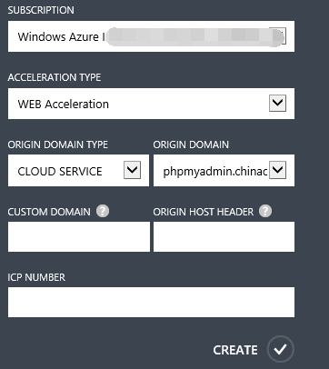
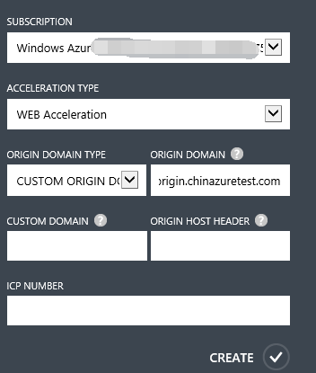
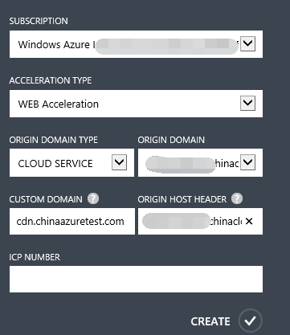
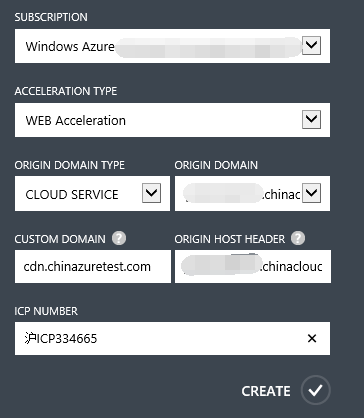

<properties linkid="dev-net-common-tasks-cdn" urlDisplayName="CDN" pageTitle="How to Create Web Acceleration-Type CDNs – Azure Feature Guide" metaKeywords="Azure CDN, Azure CDN, Azure blobs, Azure caching, Azure add-ons, CDN acceleration, CDN service, mainstream CDN, Web acceleration, Web, webpage acceleration, static acceleration, cache rules, image acceleration, CDN technical documentation, CDN help files, portal website acceleration" description="Learn how to create Web Acceleration-type CDNs on Microsoft Azure Management Portal, and learn about default caching rules for Web CDNs." metaCanonical="" services="" documentationCenter=".NET" title="" authors="" solutions="" manager="" editor="" />
<tags ms.service="cdn"
    ms.date=""
    wacn.date="1/11/2016"
    />

#Creating Web Acceleration CDN Nodes

> [AZURE.SELECTOR]
- [Chinese Version](/documentation/articles/cdn-how-to-create-Web-CDN-endpoint)
- [English Version](/documentation/articles/cdn-enus-how-to-create-Web-CDN-endpoint)

The Web Acceleration service is the most basic and most widely used CDN acceleration service, and is mainly intended to accelerate small files with low update frequencies, such as HTML files, CSS, images, JS, and Flash animation. Caching these small files on Azure CDN edge nodes reduces access pressure on source stations and meets users’ needs in terms of nearby website access, improving the website access experience and helping to boost user traffic on the website.

Web Acceleration CDN nodes are suitable for use with portal-type websites with large amounts of visits, such as those belonging to small, medium or large enterprises, or government agency or corporate websites.

This article is about creating domain names for Web Acceleration. You can also refer to [Using Microsoft Azure CDN](http://www.windowsazure.cn/documentation/articles/cdn-enus-how-to-use/) to find out about the basics of creating Microsoft Azure CDN acceleration nodes.

###**Default cache rules for Web Acceleration**

The Azure CDN sets default cache rules (see below) for web acceleration. You can also set custom cache rules according to your own requirements. For specific details, see the Azure CDN Management Portal advanced management help documentation on “Domain Management.” If the source station content changes or is updated, but the cache time to live (TTL) has not yet expired, you can manually refresh the CDN cache files to synchronize the updated source station content in real time. For specific details, see the Microsoft Azure CDN Management Portal advanced management help documentation on “Cache Refresh.”

**The system’s default cache rules for Web Acceleration**

1. Dynamic files—such as those with the extensions PHP, ASPX, ASP, JSP, DO, DWR, CGI, FCGI, ACTION, ASHX, AXD and JSON—are not cached.
2. Files with the extensions SHTML, HTML, HTM and JS are cached for half a day (720 minutes) by default. 
3. All other static files are cached for one day (1,440 minutes) by default.

###**Create web acceleration domain names**

1. In the navigation pane of the Microsoft Azure Management Portal, click “CDN.”
2. In the function area, click “New.” In the “New” dialogue box, select “App Services,” “CDN,” and “Quick Create” in that order.
3. Select “Web Acceleration” from the “Acceleration Type” drop-down list.
4. In the “Origin Domain Type” drop-down list, select cloud service, storage account, web app, or a customized origin domain. **Note** that Web Acceleration does not support the “media service” origin domain type.
5. In the “Origin Domain” drop-down list, select one option from the list of available cloud services, storage accounts, or web apps for use in creating the CDN endpoint.

    
    
    If the selected “Origin Domain Type” is “Customized Origin Domain,” input your own origin domain address under “Origin Domain.” You can enter one or multiple origin domain IP addresses (separate multiple addresses with semicolons, e.g. “126.1.1.1;172.1.1.1”), or an origin domain name such as “origin.chinaazuretest.com”.

    

6. In “Custom Domain”, enter the custom domain name you wish to use, e.g. cdn.chinaazuretest1.com. Custom domains support extensive domain name acceleration. **Note** that the custom domain name cannot be the same as the origin domain name.
7. In “Origin Host Header,” enter the return to source access host header accepted by your source station. Once you have entered the “Custom Domain,” the system will automatically fill in a default value based on the “Origin Domain Type” you selected. To be more specific, if your source station is on Azure, the default value will be the corresponding source station address. If your source station is not on Azure, the default value will be the “Custom Domain” that you entered. Of course, you can also modify this based on the actual configuration of your source station.
    
    If the origin domain type is cloud services, the corresponding return to source host header is:

    
    
    If the origin domain type is a custom origin domain, the corresponding return to source host header is:

    

8. In “ICP Number,” enter the corresponding ICP record number for the custom domain that you entered (e.g., Jing ICP Bei XXXXXXXX Hao-X).

    

9. Click “Create” to create the new endpoint.

Once the endpoint has been created, it will appear in the list of subscribed endpoints. The list view shows the custom domains used to access cached content, as well as the origin domains.
 The origin domain is the original location of the content cached on the CDN. Custom domains are URLs used to access CDN cache content.

>**Note** that configurations created for endpoints cannot be used immediately; they must first pass checks to confirm that the ICP custom domain name matches the ICP number. For more details, see the second half of Step 2: Create new CDN endpoints in [Using Microsoft Azure CDN](http://www.windowsazure.cn/documentation/articles/cdn-how-to-use/).

<!---HONumber=CDN_1201_2015-->