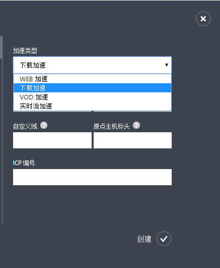
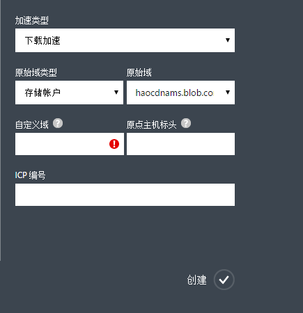
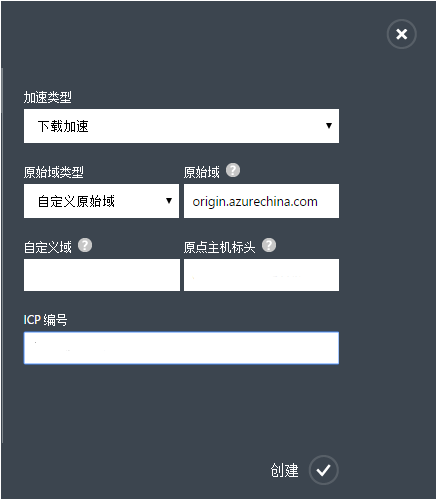
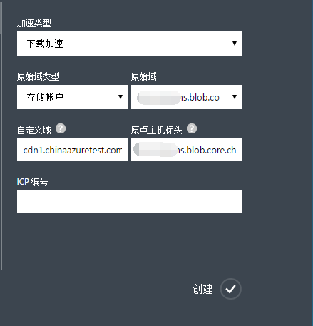
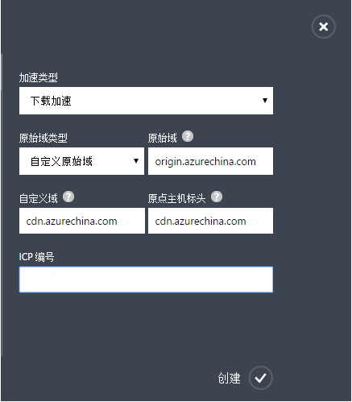
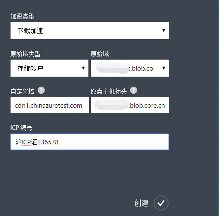
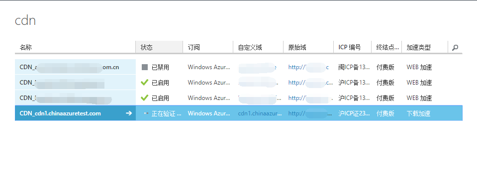

<properties linkid="dev-net-common-tasks-cdn" urlDisplayName="CDN" pageTitle="Create download acceleration Azure Content Delivery Network nodes | Microsoft Azure" metaKeywords="Azure CDN, Azure CDN, Azure blobs, Azure caching, Azure add-ons, CDN acceleration, CDN service, cloud acceleration, download acceleration, download, cache rules, ICP, ICP record number, ICP number, technical documentation, help files, bandwidth, large file download, software upgrade installation package, game download acceleration, app download acceleration, mobile app update, firmware upgrade" description="Learn how to create download acceleration Content Delivery Network nodes on the Azure portal, and learn about default caching rules for these nodes." metaCanonical="" services="" documentationCenter=".NET" title="" authors="" solutions="" manager="" editor="" />
<tags ms.service="cdn"
    ms.date=""
    wacn.date="11/27/2015"
    />

#Create download acceleration Content Delivery Network nodes
Download acceleration is primarily intended for use with downloads of large files of 20 MB or more—for example, with download delivery for software installation packages, game clients, apps, or videos. The Azure Content Delivery Network caches the files to the Content Delivery Network edge nodes. This relieves bandwidth pressure on source station downloads and improves the user’s download experience.

Download acceleration is suitable for use in scenarios such as downloading operating system and firmware upgrades, game clients, mobile app updates, and computer applications.

This article is about creating domain names for download acceleration. You can also refer to [Using Microsoft Azure Content Delivery Network](http://www.windowsazure.cn/documentation/articles/cdn-how-to-use/) to find out about the basics of creating Microsoft Azure Content Delivery Network acceleration nodes.

###**Default cache rules for download acceleration**
The Microsoft Azure Content Delivery Network sets default cache rules (see below) for download acceleration. You can also set custom cache rules according to your own requirements. For specific details, see the advanced management help file on domain name management in the Azure portal. If the source station content changes or is updated, but the cache time to live (TTL) has not yet expired, you can manually refresh the Content Delivery Network cache files. This will synchronize the updated source station content in real time. For specific details, see the advanced management help file on cache refreshing in the Azure portal.

**The system’s default cache rules for download acceleration**

1. Dynamic files are not cached. Dynamic files have extensions like .php, .aspx, .asp, .jsp, and .do.
2. Files with the following extensions are cached for one month: .7z, .apk, .wdf, .cab, .dhp, .exe, .flv, .gz, .ipa, .iso, .mpk, .mpq, .pbcv, .pxl, .qnp, .r00, .rar, .xy, .xy2, and .zip.

###**Create domain names for download acceleration**

1. In the navigation pane of the Microsoft Azure portal, click **CDN**.
2. In the function area, click **Create New**. In the **Create New** dialog box, select **App Services**, **CDN**, and **Quick Create**.
3. Select **Download Acceleration** from the **Acceleration Type** drop-down list.

    

4. In the **Origin Domain Type** drop-down list, select cloud service, storage account, web app, or customized origin domain. Note that download acceleration does not support the “media service” origin domain type.
5. In the **Origin Domain** drop-down list, select one option from the list of available cloud services, storage accounts, or web apps to use when you create the Content Delivery Network endpoint. 
    

    If the selected origin domain type is **Customized Origin Domain**, input your own origin domain address under **Origin Domain**. You can enter one or multiple origin domain IP addresses. Separate the multiple addresses with semicolons, e.g., 126.1.1.1;172.1.1.1.

    

6. In **Custom Domain**, enter the custom domain name that you wish to use, e.g., cdn1.azurechinatest.com. Custom domains support extensive domain name acceleration.
7. In **Origin Host Header**, enter the return-to-source access host header accepted by your source station. After you enter the custom domain, the system automatically fills in a default value based on the origin domain type that you selected. To be more specific: If your source station is on Azure, the default value is the corresponding source station address. If your source station is not on Azure, the default value is the custom domain that you entered. You can also modify this based on the actual configuration of your source station.

    If the origin domain type is a storage account, the corresponding return-to-source host header is:

    
    
    If the origin domain type is a custom origin domain, the corresponding return-to-source host header is:

    
    
      
8. In “ICP Number,” enter the corresponding ICP record number for the custom domain that you entered (e.g., Jing ICP Bei XXXXXXXX Hao-X).
     
    

9. Click **Create** to create the new endpoint.

After you create the endpoint, it appears in the list of subscribed endpoints. The list view shows the custom domains that are used to access cached content, as well as the origin domains. The origin domain is the original location of the content cached on the Content Delivery Network node. Custom domains are URLs that are used to access the Content Delivery Network cache content.

   

> **[AZURE.NOTE]** Configurations created for endpoints cannot be used immediately. They must first pass checks to confirm that the ICP custom domain name matches the ICP number. For more details, see the second half of Step 2: Create new Content Delivery Network endpoints in [Using Microsoft Azure Content Delivery Network](http://www.windowsazure.cn/documentation/articles/cdn-how-to-use/).

<!---HONumber=CDN_1201_2015-->