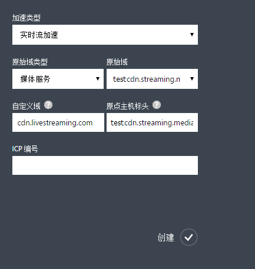

<properties linkid="dev-net-common-tasks-cdn" urlDisplayName="CDN" pageTitle="Create Azure Live Streaming acceleration Azure Content Delivery Network nodes | Microsoft Azure" metaKeywords="Azure CDN, Azure CDN, Azure blobs, Azure caching, Azure add-on, Live Streaming, streaming acceleration, CDN acceleration, CDN service, mainstream CDN, live streaming acceleration, media service, Azure Media Service, cache rules, HLS, CDN technical documentation, CDN help files, live video streaming acceleration, direct broadcast acceleration" description="Learn how to create Live Streaming acceleration Content Delivery Network nodes on the Microsoft Azure portal, and learn about default caching rules for these nodes." metaCanonical="" services="" documentationCenter=".NET" title="" authors="" solutions="" manager="" editor="" />
<tags ms.service="cdn"
    ms.date=""
    wacn.date="11/27/2015"
    />

#Create streaming media (direct broadcast) acceleration Content Delivery Network nodes
The streaming media acceleration option is mainly intended to provide acceleration services for online video and audio broadcasting. The high-speed, real-time properties of webcasting are very popular with users. The real-time nature of direct broadcasting means that huge numbers of users access services concurrently. This puts an enormous strain on source station and bandwidth resources. Such services are also subject to Chinese restrictions on cross-region or cross-carrier traffic, which impose significant requirements on high-quality, high-speed streaming media direct broadcasts. The Microsoft Azure Content Delivery Network streaming media acceleration service acquires the source station video stream in real time and delivers it to the Content Delivery Network edge node closest to the user. It uses intelligent caching and scheduling strategies to calculate and provide the optimal node for the user. This reduces the lag and bandwidth pressures caused by link transmissions. The user is charged for data usage. The service provides users with a high-speed, smooth, high-quality direct broadcast viewing experience.

Microsoft Azure Content Delivery Network streaming media acceleration is principally based on the HTTP Live Streaming (HLS) protocol and supports [Azure Media Services](http://www.windowsazure.cn/home/features/media-services/).

Streaming media acceleration is suitable for use with all types of streaming media direct broadcast websites, such as online television broadcasts and direct broadcasts of sporting events or major public events.

This article is about creating domain names for streaming media acceleration. You can also refer to [Using Microsoft Azure Content Delivery Network](http://www.windowsazure.cn/documentation/articles/cdn-how-to-use/) to find out about the basics of creating Microsoft Azure Content Delivery Network acceleration nodes.

###**Default cache rules for streaming media acceleration**
Microsoft Azure Content Delivery Network sets default cache rules (see below) for streaming media acceleration. You can also set custom cache rules according to your own requirements. For specific details, see the advanced management help file on domain name management in the Azure portal. If the source station content changes or is updated, but the cache time to live (TTL) has not yet expired, you can manually refresh the Content Delivery Network cache files. This synchronizes the updated source station content in real time. For specific details, see the advanced management help file on cache refreshing in the Azure portal.

**The system’s default cache rules for streaming media acceleration:**

 1. TS files are cached for two minutes.
 2. M3U8 files are cached for two seconds. 
      
###**Create streaming media acceleration domain names**

1. In the navigation pane of the Azure portal, click **CDN**.
2. In the function area, click **Create New**. In the **Create New** dialog box, select **App Services**, **CDN**, and **Quick Create** in that order.
3. Select **Streaming Media Acceleration** from the **Acceleration Type** drop-down list.

    

4. In the **Origin Domain Type** drop-down list, select cloud service, storage account, web app, media services, or a customized origin domain.
5. In the **Origin Domain** drop-down list, select one option from the list of available media services for use in creating the Content Delivery Network endpoint. 
 
    

    If the selected origin domain type is **Customized Origin Domain**, input your own origin domain address under **Origin Domain**. You can enter an origin domain name such as origin.livestreaming.com, or you can enter one or multiple origin domain IP addresses. Separate multiple addresses with semicolons, e.g., 126.1.1.1;172.1.1.1.

    

6. In **Custom Domain**, enter the custom domain name you wish to use, e.g., cdn.livestreaming.com. Custom domains support extensive domain name acceleration.
7. In **Origin Host Header**, enter the return-to-source access host header accepted by your source station. After you enter the custom domain, the system automatically fills in a default value based on the origin domain type that you selected. To be more specific: If your source station is on Azure, the default value is the corresponding source station address. If your source station is not on Azure, the default value is the custom domain that you entered. Of course, you can also modify this based on the actual configuration of your source station.

    If the origin domain type is media services, the corresponding return-to-source host header is:

    
    
    If the origin domain type is a custom origin domain, the corresponding return-to-source host header is:

    
    
      
8. In **ICP Number**, enter the corresponding ICP record number for the custom domain that you entered (e.g., Jing ICP Bei XXXXXXXX Hao-X).
     
    

9. Click **Create** to create the new endpoint.

After you create the endpoint, it appears in the list of subscribed endpoints. The list view shows the custom domains that are used to access cached content, as well as the origin domains. The origin domain is the original location of the content that is cached on the Content Delivery Network. Custom domains are URLs that are used to access the Content Delivery Network cache content.

   

>**[AZURE.NOTE]** Configurations that are created for endpoints cannot be used immediately. They must first pass checks to confirm that the ICP custom domain name matches the ICP number. For more details, see the second half of “Step 2: Create new Content Delivery Network endpoints” in [Using Microsoft Azure Content Delivery Network](http://www.windowsazure.cn/documentation/articles/cdn-how-to-use/).

<!---HONumber=CDN_1201_2015-->

