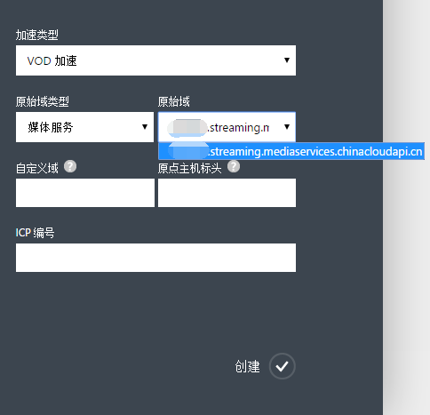
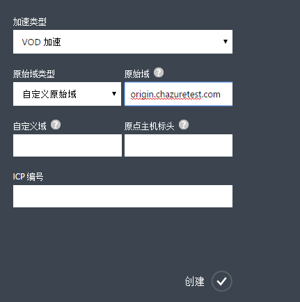
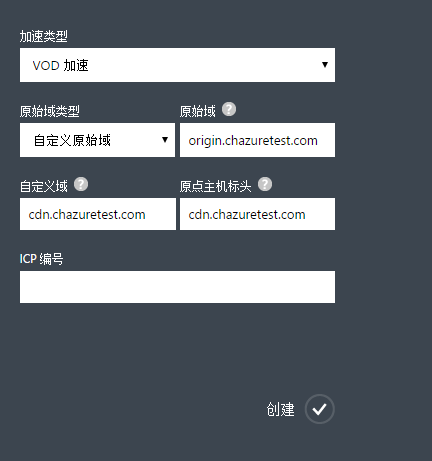

<properties linkid="dev-net-common-tasks-cdn" urlDisplayName="CDN" pageTitle="Create VOD acceleration Azure Content Delivery Network nodes | Microsoft Azure" metaKeywords="Azure CDN, Azure CDN, Azure blobs, Azure caching, Azure add-ons, CDN acceleration, CDN service, mainstream CDN, VOD, video on demand acceleration, VOD acceleration, cache rules, media service, Azure Media Service, CDN technical documentation, CDN help files" description="Learn how to create VOD acceleration Content Delivery Network nodes on the Azure portal, and learn about default caching rules for these nodes." metaCanonical="" services="" documentationCenter=".NET" title="" authors="" solutions="" manager="" editor="" />
<tags ms.service="cdn"
    ms.date=""
    wacn.date="11/27/2015"
    />

#Create video-on-demand (VOD) acceleration Content Delivery Network nodes
The video-on-demand (VOD) acceleration service is mainly intended to provide acceleration services for online VOD. With the rise of online video and media services, more and more people are choosing to use Internet platforms to watch videos and listen to audio content. Given the limitations on the Internet environment in China, this places huge demands on the final delivery of audio and video content. Microsoft Azure Content Delivery Network delivers and caches streaming media content, such as audio and video, to Content Delivery Network edge nodes. It directs user requests to the optimal node. This reduces the load on source station servers and saves on bandwidth resources. As a result, the service provides users with a high-speed, smooth, high-quality online video experience.

Azure Content Delivery Network VOD acceleration supports [Azure Media Services](http://www.windowsazure.cn/home/features/media-services/).

VOD acceleration is suitable for use with all types of online audio and VOD websites, such as media video websites, online education websites, and mobile app clients.

This article is about creating domain names for VOD acceleration. You can also refer to [Using Microsoft Azure Content Delivery Network](http://www.windowsazure.cn/documentation/articles/cdn-how-to-use/) to find out about the basics of creating Azure Content Delivery Network acceleration nodes.

###**Default cache rules for VOD acceleration**
Microsoft Azure Content Delivery Network sets default cache rules (see below) for VOD acceleration. You can also set custom cache rules according to your own requirements. For specific details, see the advanced management help file on domain name management in the Azure portal. If the source station content changes or is updated, but the cache time to live (TTL) has not yet expired, you can manually refresh the Content Delivery Network cache files. This synchronizes the updated source station content in real time. For specific details, see the advanced management help file on cache refreshing in the Azure portal.

**The system’s default cache rules for VOD acceleration:**

1. Dynamic files are not cached. Dynamic files have extensions like .php, .aspx, .asp, .jsp, and .do.
2. Files with the following extensions are cached for one hour: .mwv, .html, .shtml, .hml, .gif, .swf, .png, .bmp, and .js.
3. Audio files—.mp3 and .wma files—are cached for one day.
4. Files with the following extensions are cached for one month: .7z, .apk, .wdf, .cab, .dhp, .exe, .flv, .gz, .ipa, .iso, .mpk, .mpq, .pbcv, .pxl, .qnp, .r00, .rar, .xy, .xy2, and .zip.
      
###**Create VOD acceleration domain names**

1. In the navigation pane of the Azure portal, click **CDN**.
2. In the function area, click **Create New**. In the **Create New** dialog box, select **App Services**, **CDN**, and **Quick Create**.
3. Select **VOD Acceleration** from the **Acceleration Type** drop-down list.

    

4. In the **Origin Domain Type** drop-down list, select cloud service, storage account, web app, media services, or a customized origin domain.
5. In the **Origin Domain** drop-down list, select one option from the list of available storage accounts and media services for use in creating the Content Delivery Network endpoint.
  
    

    If the selected origin domain type is **Customized Origin Domain**, input your own origin domain address under **Origin Domain**. You can enter an original domain name such as origin.chazuretest.com, or you can enter one or multiple origin domain IP addresses. Separate multiple addresses with semicolons, e.g., 126.1.1.1;172.1.1.1.

    

6. In **Custom Domain**, enter the custom domain name you wish to use, e.g., cdn.chazuretest.com. Custom domains support extensive domain name acceleration.
7. In **Origin Host Header**, enter the return-to-source access host header accepted by your source station. After you enter the custom domain, the system automatically fills in a default value based on the origin domain type you selected. To be more specific: If your source station is on Azure, the default value is the corresponding source station address. If your source station is not on Azure, the default value is the custom domain that you entered. Of course, you can also modify this based on the actual configuration of your source station.

    If the origin domain type is media services, the corresponding return-to-source host header is:

    
    
    If the origin domain type is a custom origin domain, the corresponding return to source host header is:

    
          
8. In **ICP Number**, enter the corresponding ICP record number for the custom domain that you entered (e.g., Jing ICP Bei XXXXXXXX Hao-X).
     
    

9. Click **Create** to create the new endpoint.

After you create the endpoint, it appears in the list of subscribed endpoints. The list view shows the custom domains that are used to access cached content, as well as the origin domains. The origin domain is the original location of the content that is cached on the Content Delivery Network nodes. Custom domains are URLs that are used to access Content Delivery Network cache content.

   

>**[AZURE.NOTE]** Configurations that are created for endpoints cannot be used immediately. They must first pass checks to confirm that the ICP custom domain name matches the ICP number. For more details, see the second half of “Step 2: Create new Content Delivery Network endpoints” in [Using Microsoft Azure Content Delivery Network](http://www.windowsazure.cn/documentation/articles/cdn-how-to-use/).

<!---HONumber=CDN_1201_2015-->