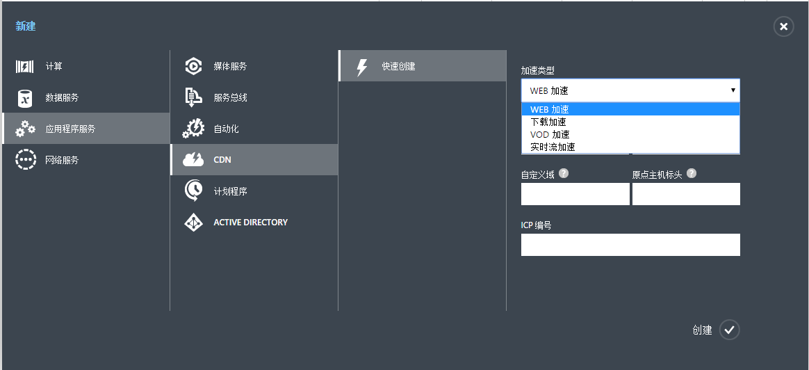
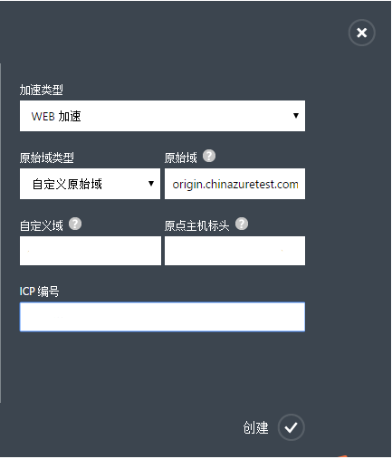

<properties linkid="dev-net-common-tasks-cdn" urlDisplayName="CDN" pageTitle="Create web acceleration Azure Content Delivery nodes | Microsoft Azure" metaKeywords="Azure CDN, Azure CDN, Azure blobs, Azure caching, Azure add-ons, CDN acceleration, CDN service, mainstream CDN, Web acceleration, Web, webpage acceleration, static acceleration, cache rules, image acceleration, CDN technical documentation, CDN help files, portal website acceleration" description="Learn how to create web acceleration Content Delivery Network nodes on the Microsoft Azure portal, and learn about default caching rules for these nodes." metaCanonical="" services="" documentationCenter=".NET" title="" authors="" solutions="" manager="" editor="" />
<tags ms.service="cdn"
    ms.date=""
    wacn.date="11/27/2015"
    />

#Create web acceleration Content Delivery Network nodes
The web acceleration service is the most basic and most widely used Content Delivery Network acceleration service, and is mainly intended to accelerate small files with low update frequencies, such as .html, .css, and .js files, images, and Flash animation. Caching these small files on Microsoft Azure Content Delivery Network edge nodes reduces access pressure on source stations and meets users’ needs for nearby website access. This improves the website access experience and helps to boost user traffic on the website.

Web acceleration Content Delivery Network nodes are suitable for use with portal websites that have large numbers of visits, such as those belonging to small, medium or large enterprises, or government agency or corporate websites.

This article is about creating domain names for web acceleration. You can also refer to [Using Microsoft Azure Content Delivery Network](http://www.windowsazure.cn/documentation/articles/cdn-how-to-use/) to find out about the basics of creating Azure Content Delivery Network acceleration nodes.

###**Default cache rules for web acceleration**
Microsoft Azure Content Delivery Network sets default cache rules (see below) for download acceleration. You can also set custom cache rules according to your own requirements. For specific details, see the advanced management help file on domain name management in the Azure portal. If the source station content changes or is updated, but the cache time to live (TTL) has not yet expired, you can manually refresh the Content Delivery Network cache files. This synchronizes the updated source station content in real time. For specific details, see the advanced management help file on cache refreshing in the Azure portal.

**The system’s default cache rules for web acceleration:**

1. Dynamic files are not cached. Dynamic files have extensions like .php, .aspx, .jsp, .do, .dwr, .cgi, .fcgi, .action, .ashx, .axd, and .json.
2. Files with the extensions .shtml, .html, .htm, and .js are cached for half a day (720 minutes) by default. 
3. All other static files are cached for one day (1,440 minutes) by default.

###**Create web acceleration domain names**

1. In the navigation pane of the Azure portal, click **CDN**.
2. In the function area, click **Create New**. In the **Create New** dialog box, select **App Services**, **CDN**, and **Quick Create**.

    

3. Select **Web Acceleration** from the **Acceleration Type** drop-down list.
4. In the **Origin Domain Type** drop-down list, select cloud service, storage account, web app, or a customized origin domain. Note that web acceleration does not support the “media service” origin domain type.
5. In the **Origin Domain** drop-down list, select one option from the list of available cloud services, storage accounts, or web apps for use in creating the Content Delivery Network endpoint.

    
    
    If the selected origin domain type is **Customized Origin Domain**, input your own origin domain address under **Origin Domain**. You can enter an origin domain name such as origin.chinaazuretest.com, or enter one or multiple origin domain IP addresses. Separate the multiple addresses with semicolons, e.g., 126.1.1.1;172.1.1.1.

    

6. In **Custom Domain**, enter the custom domain name you wish to use, e.g., cdn.chinaazuretest1.com. Custom domains support extensive domain name acceleration. Note that the custom domain name cannot be the same as the origin domain name.
7. In **Origin Host Header**, enter the return-to-source access host header accepted by your source station. After you enter the custom domain, the system automatically fills in a default value based on the origin domain type that you selected. To be more specific: If your source station is on Azure, the default value is the corresponding source station address. If your source station is not on Azure, the default value is the custom domain that you entered. Of course, you can also modify this based on the actual configuration of your source station.
    
    If the origin domain type is cloud services, the corresponding return-to-source host header is:

    
    
    If the origin domain type is a custom origin domain, the corresponding return-to-source host header is:

    

8. In **ICP Number**, enter the corresponding ICP record number for the custom domain that you entered (e.g., Jing ICP Bei XXXXXXXX Hao-X).

    

9. Click **Create** to create the new endpoint.

Once you have created the endpoint, it appears in the list of subscribed endpoints. The list view shows the custom domains that are used to access cached content, as well as the origin domains. The origin domain is the original location of the content that is cached on the CDN. Custom domains are URLs that are used to access Content Delivery Network cache content.

   

>**[AZURE.NOTE]** Configurations that are created for endpoints cannot be used immediately. They must first pass checks to confirm that the ICP custom domain name matches the ICP number. For more details, see the second half of “Step 2: Create new Content Delivery Network endpoints” in [Using Microsoft Azure Content Delivery Network](http://www.windowsazure.cn/documentation/articles/cdn-how-to-use/).

<!---HONumber=CDN_1201_2015-->
