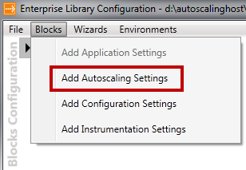

<properties linkid="dev-net-how-to-autoscaling" urlDisplayName="Autoscaling" pageTitle="使用自动缩放应用程序块 (.NET) - Azure" metaKeywords="Azure autoscaling, Azure autoscaling C#, Azure autoscaling .NET" description="了解如何在 Azure 中使用自动缩放应用程序。代码示例用 C# 编写且使用 .NET API。" metaCanonical="" services="cloud-services" documentationCenter=".NET" title="How to Use the Autoscaling Application Block" authors="" solutions="" manager="" editor="" />
<tags ms.service="cloud-services"
    ms.date="11/14/2014"
    wacn.date="04/11/2015"
    />

# 如何使用自动缩放应用程序块

本指南演示如何通过[用于 Azure 的 Microsoft Enterprise Library 5.0 集成包][]中的"自动缩放应用程序块"功能执行常见任务。相关示例用 C# 编写且使用 .NET API。所涉及的任务包括**托管块**、**使用约束规则**以及**使用反应规则**。有关自动缩放应用程序块的详细信息，请参阅[后续步骤][]部分。

## 目录

[什么是自动缩放应用程序块？][]
 [概念][]   
 [从目标 Azure 应用程序收集性能计数器数据][]   
 [为自动缩放应用程序块设置宿主应用程序][]   
 [如何：实例化并运行自动缩放程序][] [如何：定义服务模型][]   
 [如何：定义自动缩放规则][]   
 [如何：配置自动缩放应用程序块][]   
 [后续步骤][]

## 什么是自动缩放应用程序块？

自动缩放应用程序块可根据你专门为你的应用程序定义的规则自动缩放你的 Microsoft Azure 应用程序。你可以使用这些规则帮助你的 Azure 应用程序保持其吞吐量以响应其工作负载中的更改，同时控制与在 Azure 中托管你的应用程序关联的成本。除了通过增加或减少你的应用程序中的角色实例数进行缩放外，此应用程序块还使你能够执行其他缩放操作，例如限制你的应用程序中的特定功能或者使用自定义操作。

你可以选择在 Azure 角色或在本地应用程序中托管该应用程序块。

自动缩放应用程序块是[用于 Azure 的 Microsoft Enterprise Library 5.0 集成包][]的一部分。

## 概念

在下图中，绿线显示两天内 Azure 角色中正运行实例数的走势图。该实例数随时间自动变化以响应一组自动缩放规则。

应用程序块使用两种类型的规则定义您的应用程序的自动缩放行为：

-   **约束规则：**若要设置实例数的上限和下限（例如，假定在每天早上 8:00 到 10:00 之间，你需要最少 4 个和最多 6 个实例），可使用**约束规则**。在上图中，红线和蓝线表示约束规则。例如，在图中的 **A** 点，角色实例的最小数目从 2 升至 4，以适应此时预期增加的应用程序工作负载。在图中的 **B** 点，防止角色实例数攀升到 5 之上，以便控制应用程序的运行成本。

-   **反应规则：**若要使角色实例数能够根据不可预测的需求变化而变化，可使用**反应规则**。在图中的 **C** 点，应用程序块将角色实例数从 4 自动减少至 3，以响应工作负载的减少。在 **D** 点，应用程序块检测到工作负载增加并将运行的角色实例数从 3 自动增加至 4。

应用程序块将其配置设置存储在两个存储中：

-   **规则存储：**规则存储包含你的业务配置；你为 Azure 应用程序定义的所有自动缩放规则的列表。此存储通常是一个 XML 文件，位于自动缩放应用程序块可以读取的位置，例如，位于 Azure Blob 存储或本地文件中。

-   **服务信息存储：**服务信息存储可存储你的操作配置，是 Azure 应用程序的服务模型。此服务模型包括有关你的 Azure 应用程序的所有信息（例如角色名称和存储帐户详细信息），应用程序块需要这些信息才能从目标 Azure 应用程序收集数据点以及执行缩放操作。

## 从目标 Azure 应用程序收集性能计数器数据

在定义规则时，反应规则可以使用角色中的性能计数器数据。例如，反应规则可以监视 Azure 角色的 CPU 利用率，以确定应用程序块是否应该启动缩放操作。应用程序块可读取 Azure 存储中名为 **WADPerformanceCountersTable** 的 Azure 诊断表中的性能计数器数据。

默认情况下，Azure 不会将性能计数器数据写入 Azure 存储中的 Azure 诊断表。因此，您应修改需要从中收集性能计数器数据的角色以保存此数据。有关如何在你的应用程序中启用性能计数器的详细信息，请参阅[在 Azure 中使用性能计数器][]。

## 为自动缩放应用程序块设置宿主应用程序

你可以在 Azure 角色或在本地应用程序中托管自动缩放应用程序块。自动缩放应用程序块通常托管在与您要自动缩放的目标应用程序不同的应用程序中。本节提供有关如何配置你的托管应用程序的指南。

### 获取自动缩放应用程序块 NuGet 程序包

在你的 Visual Studio 项目中使用自动缩放应用程序块之前，你需要获取自动缩放应用程序块二进制文件并在你的项目中添加对其的引用。利用 NuGet Visual Studio 扩展，可以轻松地在 Visual Studio 和 Visual Web Developer 中安装和更新库和工具。自动缩放应用程序块 NuGet 程序包是获取自动缩放应用程序块 API 的最简单方法。有关 **NuGet** 以及如何安装和使用 **NuGet** Visual Studio 扩展的详细信息，请参阅 [NuGet][] 网站。

在安装 NuGet 程序包管理器后，若要在您的应用程序中安装自动缩放 NuGet 程序包，请执行以下操作：

1.  打开"NuGet Package Manager Console"窗口。在"工具"菜单中，依次选择"Library Package Manager"和"Package Manager Console"。

2.  在"NuGet 程序包管理器控制台"窗口中，输入以下命令：

        PM> Install-Package EnterpriseLibrary.WindowsAzure.Autoscaling

安装 NuGet 程序包时将用使用自动缩放应用程序块所需的所有必需程序集和引用更新你的项目。您的项目现在包括用于自动缩放规则定义和服务信息的 XML 架构文件。该项目现在还包括一个包含有关自动缩放应用程序块的重要信息的自述文件：

### 将目标框架设置为 .NET Framework 4

你的项目必须以 .NET Framework 4 为目标。若要更改或验证目标框架，请执行以下操作：

1.  在"解决方案资源管理器"中，右键单击项目名称并选择"属性"。

2.  在"属性"窗口的"应用程序"选项卡中，确保"目标框架"设置为".NET Framework 4"。

	

### 添加命名空间引用

将以下代码命名空间声明添加到任何 C# 文件的顶部，你希望使用此类文件以编程方式访问自动缩放应用程序块：

    using Microsoft.Practices.EnterpriseLibrary.Common.Configuration;
    using Microsoft.Practices.EnterpriseLibrary.WindowsAzure.Autoscaling;

## 如何：实例化并运行自动缩放程序

使用 **IServiceLocator.GetInstance** 方法实例化自动缩放程序，然后调用 **Autoscaler.Start** 方法以运行 **Autoscaler**。

    Autoscaler scaler =
        EnterpriseLibraryContainer.Current.GetInstance<Autoscaler>();
    scaler.Start();

## 如何：定义服务模型

通常，可将你的服务模型（你的 Windows Azure 环境的描述，其中包括有关订阅、托管服务、角色和存储帐户的信息）存储在 XML 文件中。你可以在项目中的 **AutoscalingServiceModel.xsd** 文件中找到此 XML 文件架构的副本。在 Visual Studio 中，此架构可在你编辑服务模型 XML 文件时提供 Intellisense 和验证功能。

在你的项目中创建名为 **services.xml** 的新 XML 文件。

在 Visual Studio 中，你必须确保已将该服务模型文件复制到输出文件夹。为此，请按以下步骤操作：

1.  右键单击该文件并选择"属性"。

2.  在"属性"窗格中，将"复制到输出目录"值设置为"始终复制"。

    

	以下代码示例显示 **services.xml** 文件中的一个服务模型示例：

    <?xml version="1.0" encoding="utf-8" ?>
    <serviceModel xmlns="http://schemas.microsoft.com/practices/2011/entlib/autoscaling/serviceModel">
      <subscriptions>
        <subscription name="[subscriptionname]"
                      certificateThumbprint="[managementcertificatethumbprint]"
                      subscriptionId="[subscriptionid]"
                      certificateStoreLocation="CurrentUser"
                      certificateStoreName="My">
          <services>
            <service dnsPrefix="[hostedservicednsprefix]" slot="Staging">
              <roles>
                <role alias="AutoscalingApplicationRole"
                      roleName="[targetrolename]"
                      wadStorageAccountName="targetstorage"/>
              </roles>
            </service>
          </services>
          <storageAccounts>
            <storageAccount alias="targetstorage"
              connectionString="DefaultEndpointsProtocol=https;AccountName=[storageaccountname];AccountKey=[storageaccountkey]">
            </storageAccount>
          </storageAccounts>
        </subscription>
      </subscriptions>
    </serviceModel>

你必须将方括号中的值替换为特定于你的环境和目标应用程序的值。若要找到其中许多值，你将需要登录到 [Azure 管理门户][]。

登录到管理门户。

-   **[subscriptionname]：**选择一个友好名称来代表包含要在其中使用自动缩放的应用程序的Azure 订阅。

-   **[subscriptionid]：**包含要在其中使用自动缩放的应用程序的 Azure 订阅的唯一 ID。

    1.  在 Azure 管理门户中单击"云服务"。

    2.  在"云服务"列表中，单击托管要在其中使用自动缩放的应用程序的服务。右侧的"速览"窗格将显示"订阅 ID"。

    

  
	-   **[hostedservicednsprefix]：**要在其中使用自动缩放的托管服务的 DNS 前缀。

    1.  在 Azure 管理门户中单击"云服务"。

    2.  在"云服务"列表中，单击托管要在其中使用自动缩放的应用程序的服务。云服务的名称。单击"DNS 前缀"。

        
 
	-   **[targetrolename]：**自动缩放规则的目标角色的名称。

    1.  在 Azure 管理门户中单击"云服务"。

    2.  在"云服务"列表中，单击托管要在其中使用自动缩放的应用程序的服务，然后单击"实例"。**Role* 列显示目标角色的名称。

        

	-   **[storageaccountname]** 和 **[storageaccountkey]：**你将用于目标 Azure 应用程序的 Azure 存储帐户的名称。

    1.  在 Azure 管理门户中，单击"存储"。

    2.  在"存储帐户"列表中，选择将使用的存储帐户。"名称"列将显示该名称。

    3.  单击屏幕底部的"管理密钥"按钮以获取主访问密钥。

        
  
 
	-   **[managementcertificatethumbprint]：**应用程序块将用于保护目标应用程序缩放请求的管理证书的**指纹**。

    1.  在 Azure 管理门户中，单击"设置"。

    2.  "指纹"列将显示该指纹。

        
 

若要了解有关服务模型文件的内容的详细信息，请参阅
[存储服务信息数据][]。

## 如何：定义自动缩放规则

通常，可将控制你的目标应用程序中角色实例数的自动缩放规则存储在一个 XML 文件中。你可以在你的项目中的 **AutoscalingRules.xsd** 文件中找到此 XML 文件架构的副本。在 Visual Studio 中，此架构可在你编辑 XML 文件时提供 Intellisense 和验证功能。

在你的项目中创建名为 **rules.xml** 的新 XML 文件。

在 Visual Studio 中，你必须确保已将规则文件复制到输出文件夹。为此，请按以下步骤操作：

1.  右键单击该文件并选择"属性"。

2.  在"属性"窗格中，将"复制到输出目录"值设置为"始终复制"。

以下代码示例显示 **rules.xml** 文件中的一个规则集示例：

    <?xml version="1.0" encoding="utf-8" ?>
    <rules xmlns="http://schemas.microsoft.com/practices/2011/entlib/autoscaling/rules">
      <constraintRules>
        <rule name="default" enabled="true" rank="1" description="The default constraint rule">
          <actions>
            <range min="2" max="6" target="AutoscalingApplicationRole"/>
          </actions>
        </rule>
      </constraintRules>
      <reactiveRules>
        <rule name="ScaleUpOnHighUtilization" rank="10" description="Scale up the web role" enabled="true" >
          <when>
            <any>
               <greaterOrEqual operand="WebRoleA_CPU_Avg_5m" than="60"/>
            </any>
          </when>
          <actions>
            <scale target="AutoscalingApplicationRole" by="1"/>
          </actions>
        </rule>
        <rule name="ScaleDownOnLowUtilization" rank="10" description="Scale up the web role" enabled="true" >
          <when>
            <all>
              <less operand="WebRoleA_CPU_Avg_5m" than="60"/>
            </all>
          </when>
          <actions>
            <scale target="AutoscalingApplicationRole" by="-1"/>
          </actions>
        </rule>
      </reactiveRules>
      <operands>
        <performanceCounter alias="WebRoleA_CPU_Avg_5m"
          performanceCounterName="\Processor(_Total)\% Processor Time"
          source ="AutoscalingApplicationRole"
          timespan="00:05:00" aggregate="Average"/>
      </operands>
    </rules>

在此示例中，有三个自动缩放规则（一个**约束规则**和两个**反应规则**），它们可用于名为 **AutoscalingApplicationRole**（是在**服务模型**中定义的角色的别名）的目标：

-   约束规则始终有效并将最小角色实例数设置为 2，将最大角色实例数设置为 6。

-   两个反应规则都使用名为 **WebRoleA\_CPU\_Avg\_5m** 的**操作数**，可计算过去 5 分钟内名为 **AutoscalingApplicationRole** 的 Azure 角色的平均 CPU 使用率。此角色在**服务模型**中定义。

-   如果过去 5 分钟内的平均 CPU 利用率大于或等于 60%，名为 **ScaleUpOnHighUtilization** 的反应规则会将目标角色的实例计数增加 1。

-   如果过去 5 分钟内的平均 CPU 利用率小于 60%，名为 **ScaleDownOnLowUtilization** 的反应规则会将目标角色的实例计数减少 1。

## 如何：配置自动缩放应用程序块

在定义服务模型和自动缩放规则后，你必须配置自动缩放应用程序块以使用它们。此操作配置信息存储在应用程序配置文件中。

默认情况下，自动缩放应用程序块希望将自动缩放规则和服务模型存储在 Azure Blob 中。在此示例中，你将配置应用程序块以从本地文件系统中加载它们。

### 在宿主应用程序中配置自动缩放应用程序块

1.  在"解决方案资源管理器"中，右键单击"App.config"文件，然后单击"编辑配置文件"。

2.  在"块"菜单中，单击"添加自动缩放设置"：  
	
  
3.  展开"自动缩放设置"，然后单击"数据点存储存储帐户"旁的省略号 (...)，添加应用程序块将在其中存储所收集的数据点的 Azure 存储帐户的"帐户名称"和"帐户密钥"，（如果你不确定在何处查找这些值，请参阅 [如何：定义服务模型][]），然后单击"确定"：  

	

4.  展开"自动缩放设置"部分以显示"规则存储"和"服务信息存储"部分。默认情况下，它们配置为使用 Azure Blob 存储：  
	

5.  单击"规则存储"旁的加号 (+)，指向"设置规则存储"，然后单击"使用本地文件规则存储"，然后单击"是"。 
6.  在"文件名"框中，键入 **rules.xml**。这是包含你的自动缩放规则的文件的名称：  
	

7.  单击"服务信息存储"旁的加号 (+)，指向"设置服务信息存储"，然后单击"使用本地文件服务信息存储"，然后单击"是"。

8.  在"文件名"框中，键入 **services.xml**。这是包含你的自动缩放规则的文件的名称：  
	

9.  在"企业库配置"窗口中的"文件"菜单上，单击"保存"以保存你的配置更改。然后在"企业库配置"窗口中的"文件"菜单上，单击"退出"。

若要获取有关自动缩放应用程序块正在执行操作的更多信息，你需要捕获它写入的日志消息。例如，如果您在控制台应用程序中托管应用程序块，则可在 Visual Studio 中的"输出"窗口中查看日志消息。以下部分演示如何配置此行为。

### 在自动缩放应用程序块宿主应用程序中配置日志记录

1.  在 Visual Studio 中，在"解决方案资源管理器"中双击"App.config"文件以在编辑器中将其打开。然后添加 **system.diagnostics** 节，如以下示例所示：

        <?xml version="1.0" encoding="utf-8" ?>
        <configuration>
          ...
          <system.diagnostics>
            <sources>
              <sourcename="Autoscaling General" switchName="SourceSwitch" switchType="System.Diagnostics.SourceSwitch" />
              <sourcename="Autoscaling Updates" switchName="SourceSwitch" switchType="System.Diagnostics.SourceSwitch" />
            </sources>
            <switches>
              <addname="SourceSwitch" value="Verbose, Information, Warning, Error, Critical" />
            </switches>
          </system.diagnostics>
        </configuration>

2.  保存更改。

现在你可运行你的自动缩放应用程序块宿主控制台应用程序，并观察自动缩放规则如何用于你的目标 Azure 应用程序。运行宿主控制台应用程序时，您应该会在 Visual Studio 的"输出"窗口中看到如下消息。这些日志消息有助于您了解应用程序块的行为。例如，它们指示应用程序块将满足哪些规则，以及应用程序块将执行哪些操作。

    Autoscaling General Verbose: 1002 : Rule match.
    [BEGIN DATA]{"EvaluationId":"6b27dfa0-b671-44a3-adf1-bb1e0b7c3726",
    "MatchingRules":[{"RuleName":"default","RuleDescription":"The default constraint rule",
    "Targets":["AutoscalingApplicationRole"]},{"RuleName":"ScaleUp","RuleDescription":"Scale up the web role",
    "Targets":[]},{"RuleName":"ScaleDown","RuleDescription":"Scale up the web role","Targets":[]}]}

    详细自动缩放更新：3001 :即将检查托管服务的当前部署配置，以确定是否需要更改（进行角色缩放，或者对设置进行更改）。
    [BEGIN DATA]{"EvaluationId":"6b27dfa0-b671-44a3-adf1-bb1e0b7c3726",
    "HostedServiceDetails":{"Subscription":"AutoscalingHowTo","HostedService":"autoscalingtarget",
    "DeploymentSlot":"Staging"},"ScaleRequests":{"AutoscalingApplicationRole":{"Min":2,"Max":6,"AbsoluteDelta":0,
    "RelativeDelta":0,"MatchingRules":"default"}},"SettingChangeRequests":{}}

    Autoscaling Updates Verbose: 3003 : Role scaling requests for hosted service about to be submitted.
    [BEGIN DATA]{"EvaluationId":"6b27dfa0-b671-44a3-adf1-bb1e0b7c3726",
    "HostedServiceDetails":{"Subscription":"AutoscalingHowTo","HostedService":"autoscalingtarget",
    "DeploymentSlot":"Staging"},
    "ScaleRequests":{"AutoscalingApplicationRole":
    {"Min":2,"Max":6,"AbsoluteDelta":0,"RelativeDelta":0,"MatchingRules":"default"}},
    "SettingChangeRequests":{},"InstanceChanges":{"AutoscalingApplicationRole":{"CurrentValue":1,"DesiredValue":2}},
    "SettingChanges":{}}

    Autoscaling Updates Information: 3002 : Role configuration changes for deployment were submitted.
    [BEGIN DATA]{"EvaluationId":"6b27dfa0-b671-44a3-adf1-bb1e0b7c3726",
    "HostedServiceDetails":{"Subscription":"AutoscalingHowTo","HostedService":"autoscalingtarget",
    "DeploymentSlot":"Staging"},"ScaleRequests":{"AutoscalingApplicationRole":{"Min":2,"Max":6,"AbsoluteDelta":0,
    "RelativeDelta":0,"MatchingRules":"default"}},"SettingChangeRequests":{},
    "InstanceChanges":{"AutoscalingApplicationRole":{"CurrentValue":1,"DesiredValue":2}},
    "SettingChanges":{},"RequestID":"f8ca3ada07c24559b1cb075534f02d44"}

## 后续步骤

现在，您已了解使用自动缩放应用程序块的基础知识，单击下面的链接可了解如何实现更复杂的自动缩放方案：

-   [在辅助角色中托管自动缩放应用程序块][]
-   [实施限制行为][]
-   [了解规则等级和调节][]
-   [扩展和修改自动缩放应用程序块][]
-   [使用优化稳定器来防止高频振荡并优化成本][]
-   [使用通知和手动缩放][]
-   [定义缩放组][]
-   [使用 WASABiCmdlet 通过 Windows PowerShell 操作块][]
-   [面向开发人员的用于 Azure 的 Enterprise Library 5.0 集成包指南][]
-   [Sage 如何使用自动缩放降低 Azure 托管成本][]
-   [使用 Azure 中的自动缩放降低 TechNet 和 MSDN 托管成本并减少环境影响][]

  [用于 Azure 的 Microsoft Enterprise Library 5.0 集成包]: https://msdn.microsoft.com/zh-CN/library/hh680918(v=pandp.50).aspx
  [后续步骤]: #NextSteps
  [什么是自动缩放应用程序块？]: #WhatIs
  [概念]: #Concepts
  [从目标 Azure 应用程序收集性能计数器数据]: #PerfCounter
  [为自动缩放应用程序块设置宿主应用程序]: #CreateHost
  [如何：实例化并运行自动缩放程序]: #Instantiate
  [如何：定义服务模型]: #DefineServiceModel
  [如何：定义自动缩放规则]: #DefineAutoscalingRules
  [如何：配置自动缩放应用程序块]: #Configure
  [在 Azure 中使用性能计数器]: /zh-cn/documentation/articles/cloud-services-dotnet-use-performance-counters/
  [NuGet]: http://nuget.org/
  [Azure 管理门户]: http://manage.windowsazure.cn
  [存储服务信息数据]: http://msdn.microsoft.com/zh-cn/library/hh680878(PandP.50).aspx		
  [在辅助角色中托管自动缩放应用程序块]: http://msdn.microsoft.com/zh-cn/library/hh680914(PandP.50).aspx
  [实施限制行为]: http://msdn.microsoft.com/zh-cn/library/hh680896(PandP.50).aspx
  [了解规则等级和调节]: http://msdn.microsoft.com/zh-cn/library/hh680923(PandP.50).aspx
  [扩展和修改自动缩放应用程序块]: http://msdn.microsoft.com/zh-cn/library/hh680889(PandP.50).aspx
  [使用优化稳定器来防止高频振荡并优化成本]: http://msdn.microsoft.com/zh-cn/library/hh680951(PandP.50).aspx
  [使用通知和手动缩放]: http://msdn.microsoft.com/zh-cn/library/hh680885(PandP.50).aspx
  [定义缩放组]: http://msdn.microsoft.com/zh-cn/library/hh680902(PandP.50).aspx
  [使用 WASABiCmdlet 通过 Windows PowerShell 操作块]: http://msdn.microsoft.com/zh-cn/library/hh680938(PandP.50).aspx
  [面向开发人员的用于 Azure 的 Enterprise Library 5.0 集成包指南]: http://msdn.microsoft.com/zh-cn/library/hh680949(PandP.50).aspx
  [Sage 如何使用自动缩放降低 Azure 托管成本]: http://msdn.microsoft.com/zh-cn/library/jj838716(PandP.50).aspx
  [使用 Azure 中的自动缩放降低 TechNet 和 MSDN 托管成本并减少环境影响]: http://msdn.microsoft.com/zh-cn/library/jj838718(PandP.50).aspx
<!--HONumber=39-->
