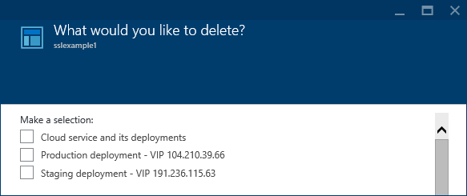

<properties 
	pageTitle="如何管理云服务（预览门户）| Windows Azure" 
	description="了解如何在 Azure 预览门户中管理云服务。这些示例使用 Azure 预览门户。" 
	services="cloud-services" 
	documentationCenter="" 
	authors="Thraka" 
	manager="timlt" 
	editor=""/>

<tags 
	ms.service="cloud-services" 
	ms.date="09/22/2015"
	wacn.date="11/12/2015"/>

# 如何管理云服务

> [AZURE.SELECTOR]
- [Azure Portal](/documentation/articles/cloud-services-how-to-manage)
- [Azure Portal](/documentation/articles/cloud-services-how-to-manage-portal)

在 Azure 预览门户的“云服务”区域中，可以更新服务角色或部署、将预留部署升级到生产环境、将资源链接到云服务，以便可以查看资源依赖关系并对资源进行整体缩放，以及删除云服务或部署。

## 如何：更新云服务角色或部署

如果你需要更新云服务的应用程序代码，请使用云服务边栏选项卡上的“更新”。你可以更新一个角色或所有角色。你将需要上载新的服务包和服务配置文件。

1. 在 [Azure 门户][]中，选择想要更新的云服务。此操作将打开云服务实例边栏选项卡。

2. 在边栏选项卡中，单击“更新”按钮。

    

3. 使用新服务包文件 (.cspkg) 和服务配置文件 (.cscfg) 更新部署。

    

4. **可选**更新部署标签和存储帐户。

5. 如果更新更改了角色数量或任何角色的大小，则选中“如果角色大小或数量发生改变，则允许更新”复选框以继续进行更新。

	>[AZURE.WARNING]请注意，如果你更改角色大小（即，托管角色实例的虚拟机大小）或角色数量，则必须重建每个角色实例（虚拟机）的映像，并且将会丢失所有本地数据。

6. 如果任何服务角色只有一个角色实例，则选中“即使一个或多个角色包含单个实例也进行更新”复选框以继续进行升级。

	如果每个角色至少具有两个角色实例（虚拟机），那么 Azure 在云服务更新期间只能保证 99.95% 的服务可用性。这使得一台虚拟机可以在另一台虚拟机正更新时处理客户端请求。

8. 单击“确定”开始更新服务。

## 如何：交换部署以将暂留部署升级到生产环境

使用“交换”可将云服务的预留部署升级到生产环境。当你决定部署云服务的新版本时，你可以在云服务过渡环境中暂存和测试新版本，同时让你的客户在生产环境中继续使用当前版本。当你准备好将新版本升级到生产环境时，可以使用“交换”来切换这两个部署 URL。

可以通过“云服务”页或仪表板来交换部署。

1. 在 [Azure 门户][]中，选择想要更新的云服务。此操作将打开云服务实例边栏选项卡。

2. 在边栏选项卡中，单击“交换”按钮。

    

3. 将打开以下确认提示。

	

4. 验证部署信息后，单击“确定”交换部署。

	交换部署的速度很快，因为唯一发生更改的是部署所用的虚拟 IP 地址 (VIP)。

	为节省计算成本，当你确定新的生产部署将按预期执行时，可以删除过渡环境中的部署。

## 如何：将资源链接到云服务

Azure 预览门户不会像当前 Azure 门户一样将资源链接在一起。而是必须将其他资源部署到云服务正在使用的同一资源组。

## 如何：删除部署和云服务

必须先删除每个现有部署，然后才能删除云服务。

为节省计算成本，你可以在验证生产部署能够按预期运行后删除过渡部署。即使云服务未运行，也会向你收取角色实例的计算费用。

可使用以下过程删除部署或云服务。

1. 在 [Azure 门户][]中，选择想要删除的云服务。此操作将打开云服务实例边栏选项卡。

2. 在边栏选项卡中，单击“删除”按钮。

    

3. 可以通过检查“云服务及其部署”，或通过选择“生产部署”或“暂存部署”来删除整个云服务。

    

4. 单击底部的“删除”按钮。

5. 要删除云服务，则单击“删除云服务”。然后在出现确认提示时单击“是”。

> [AZURE.NOTE]
> 如果为云服务配置了详细监视，那么在删除云服务时，Azure 不会从你的存储帐户中删除监视数据。你将需要手动删除这些数据。有关在何处查找度量值表的信息，请参阅[此](/documentation/articles/cloud-services-how-to-monitor)文章。

[Azure 门户]: https://manage.windowsazure.cn
## 后续步骤

* [云服务的常规配置](/documentation/articles/cloud-services-how-to-configure-portal)。
* 了解如何[部署云服务](/documentation/articles/cloud-services-how-to-create-deploy-portal)。
* 配置[自定义域名](/documentation/articles/cloud-services-custom-domain-name-portal)。
* 配置 [ssl 证书](/documentation/articles/cloud-services-configure-ssl-certificate-portal)。

<!---HONumber=79-->