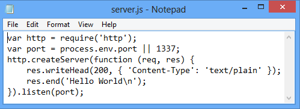
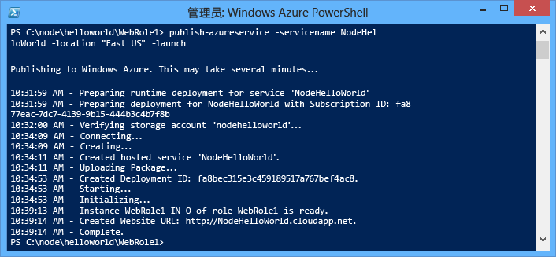
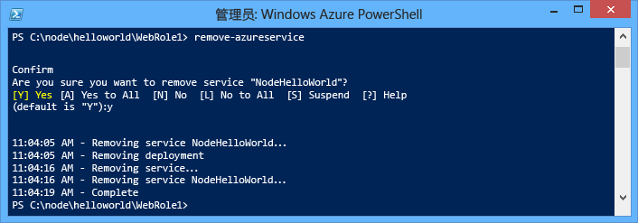

<properties linkid="dev-nodejs-getting-started" urlDisplayName="Cloud Service" pageTitle="Node.js 入门指南 - Azure 教程" metaKeywords="Azure node.js getting started, Azure Node.js tutorial, Azure Node.js tutorial" description="一类端到端教程，可帮助你开发简单的 Node.js Web 应用程序并将其部署到 Azure。" metaCanonical="" services="cloud-services" documentationCenter="Node.js" title="Build and deploy a Node.js application to an Azure Cloud Service" authors="larryfr" solutions="" manager="" editor="" />
<tags ms.service="cloud-services"
    ms.date="02/24/2015"
    wacn.date="04/11/2015"
    />

# 生成 Node.js 应用程序并将其部署到 Azure 云服务

完成本指南时，你将在 Azure 云服务中运行一个简单的 Node.js 应用程序。云服务是 Azure 中可扩展的云应用程序的构造块。它们允许进行单独且独立的管理，并允许横向扩展应用程序的前端和后端组件。云服务为可靠托管每个角色提供强大的专用虚拟机。

有关云服务以及如何将它们与 Azure 网站和虚拟机进行比较的详细信息，请参阅 [Azure 网站、云服务和虚拟机的比较](/zh-cn/documentation/articles/choose-web-site-cloud-service-vm/)。

<strong>想要构建一个简单的网站？</strong>

如果你的方案只涉及一个简单的网站前端，可以考虑 <a href="/zh-cn/documentation/articles/web-sites-nodejs-develop-deploy-mac/">使用轻型 Azure 网站。</a> 随着你的网站的不断扩大和你的需求的变化，你可以轻松升级到云服务。

 

通过学习本教程，你将可以生成一个托管在 Web 角色中的简单 Web 应用程序。你将使用计算仿真程序在本地测试你的应用程序，然后使用 PowerShell 命令行工具来部署该应用程序。

以下是已完成应用程序的屏幕快照：

## 创建新的 Node 应用程序

执行以下任务可创建一个新的 Azure 云服务项目以及基本的 Node.js 基架：

1. 在**开始菜单**或**开始屏幕**中，搜索 **Azure PowerShell**。最后，右键单击"Azure PowerShell"并选择"以管理员身份运行"********。

	![Azure PowerShell icon][powershell-menu]

	[WACOM.INCLUDE [install-dev-tools](../includes/install-dev-tools.md)]

2.  在 C 盘新建一个 **node** 目录，然后切换到 c:\\node 目录：
	
	![A command prompt displaying the commands 'mkdir c:\\node' and 'cd node'.][mkdir]

3.  输入以下 cmdlet 以创建新的解决方案：

        PS C:\node> New-AzureServiceProject helloworld

    	你将看到以下响应：

	

	**New-AzureServiceProject** cmdlet 生成一个用于新建将发布到云服务的 Azure Node 应用程序的基础结构。该结构包含向 Azure 发布应用程序所需的配置文件。该 cmdlet 还会将工作目录更改为服务的目录。

	使用 **New-AzureServiceProject** cmdlet 创建的文件包括：

	-   **ServiceConfiguration.Cloud.cscfg**、**ServiceConfiguration.Local.cscfg** 和 **ServiceDefinition.csdef** 是
 是发布应用程序时必需的 Azure 特定文件。
		
	有关这些文件的详细信息，请参阅[创建 Azure 托管服务概述][]。

	-   **deploymentSettings.json** 存储供 Azure PowerShell 部署 cmdlet 使用的本地设置。

4.  输入以下命令以使用 **Add-AzureNodeWebRole** cmdlet 添加新的 Web 角色：

        PS C:\node\helloworld> Add-AzureNodeWebRole

	你将看到以下响应：

	

	**Add-AzureNodeWebRole** cmdlet 为应用程序创建新目录并为基础 Node.js 应用程序生成基架。该命令还会修改在上一步中创建的 **ServiceConfiguration.Cloud.csfg**、**ServiceConfiguration.Local.csfg** 和 **ServiceDefinition.csdef** 文件，从而为新角色添加配置项。

	

	<b>说明</b>
	
默认情况下，如果你未提供角色名称，将为你创建一个角色名称。你可以提供一个名称作为 <b>Add-AzureNodeWebRole</b>的第一个参数。例如， <code>Add-AzureNodeWebRole MyRole</code>

	

5.  使用以下命令导航到 **WebRole1** 目录，然后在记事本中打开 **server.js** 文件。 

	PS C:\\node\\helloworld> cd WebRole1
        PS C:\node\helloworld\WebRole1> notepad server.js

	**server.js** 文件是使用 **Add-AzureNodeWebRole** cmdlet 创建的，并且包含以下起始代码。此代码与 [nodejs.org][] 网站上的"Hello World"示例类似，只不过：

   	-   端口已更改，以允许应用程序通过云环境查找分配给它的正确端口。
   	-   已删除控制台日志记录功能。

	

## 在模拟器中本地运行应用程序

Azure 计算模拟器是 Azure SDK 所安装的工具之一，你可以使用此工具本地测试应用程序。计算仿真程序将模拟在将应用程序部署到云时该程序将要运行的环境。执行以下步骤以在模拟器中测试该应用程序。

1.  关闭"记事本"并切换回 Windows PowerShell 窗口。
  	输入以下 cmdlet 以在仿真程序中运行你的服务：

        PS C:\node\helloworld\WebRole1> Start-AzureEmulator -Launch

	**-Launch** 参数指定工具应自动打开浏览器窗口，并当应用程序在模拟器中运行时立即显示该应用程序。这将打开一个浏览器，其中显示"Hello World"，如以下屏幕截图所示。这表示服务正在计算模拟器中运行且工作正常。

	

2.  若要停止计算模拟器，请使用 **Stop-AzureEmulator** 命令：
	
	PS C:\node\helloworld\WebRole1> Stop-AzureEmulator

## 将应用程序部署到 Azure

	[WACOM.INCLUDE [create-account-note](../includes/create-account-note.md)]

###下载 Azure 发布设置

若要将应用程序部署到 Azure，必须先为 Azure 订阅下载发布设置。以下步骤将指导你完成此过程：

1.  从 Windows PowerShell 窗口中，通过运行以下 cmdlet 来启动下载页：

        PS C:\node\helloworld\WebRole1> Get-AzurePublishSettingsFile

	此操作将使用浏览器导航到发布设置下载页。系统可能会提示你使用 Microsoft 帐户登录。如果是这样，请使用与你的 Azure 订阅关联的帐户。

	将已下载的配置文件保存到你能够轻松访问的文件位置。

2.  在 Azure PowerShell 窗口中，使用以下 cmdlet 配置 Windows PowerShell for Node.js cmdlet 以使用下载的 Azure 发布配置文件：

        PS C:\node\helloworld\WebRole1> Import-AzurePublishSettingsFile [path to file]

	

	<b>说明</b>
	
导入发布设置之后，应考虑删除所下载的 .publishSettings 文件，因为该文件包含可供他人用来访问你的帐户的信息。

	

    

### 发布应用程序

1.  使用 **Publish-AzureServiceProject** cmdlet 发布应用程序，如下所示。

        PS C:\node\helloworld\WebRole1> Publish-AzureServiceProject -ServiceName NodeHelloWorld -Location "East US" -Launch

	- **servicename** 参数指定用于此部署的名称。此名称必须是唯一的，否则发布过程将失败。

	- **location** 参数指定将要在其中托管应用程序的数据中心。若要查看可用数据中心的列表，请使用 **Get-AzureLocation cmdlet**。

	- **launch** 参数将在部署完成后启动你的浏览器并导航到托管服务。

	发布成功之后，你将看到如下响应：

	

	**Publish-AzureServiceProject** cmdlet 执行以下步骤：

1.  创建将部署到 Azure 的包。该包将包含 node.js 应用程序文件夹中的所有文件。

2.  如果存储帐户不存在，将创建一个新的**存储帐户**。Azure 存储帐户用于存储部署期间的应用程序包。在部署完成后，你可以安全删除该存储帐户。

3.  如果云服务尚不存在，将创建一个新的**云服务**。**云服务**是一个容器，用于在将应用程序部署到 Azure 后托管该应用程序。有关详细信息，请参阅[创建 Azure 托管服务概述][]。

4.  将部署包发布到 Azure。

	> [WACOM.NOTE]
	> 部署应用程序并在首次发布该程序后使其可供使用可能需要花费 5 - 7 分钟时间。

	在部署完成后，系统会打开一个浏览器窗口并导航到云服务。

	

	你的应用程序现在正在 Azure 上运行！

## 停止并删除应用程序

部署应用程序后，你可能希望禁用它，以避免产生额外费用。Azure 将按使用的服务器小时数对 Web 角色实例计费。你的应用程序部署之后就会开始使用服务器时间，即使相关实例并未运行且处于停止状态也是如此。

1.  在 Windows PowerShell 窗口中，使用以下 cmdlet 以停止上一节中创建的服务部署：

        PS C:\node\helloworld\WebRole1> Stop-AzureService

	停止服务可能需要花费几分钟时间。在服务停止时，你会收到一条指示服务已停止的消息。

	

2.  若要删除服务，请调用以下 cmdlet：

        PS C:\node\helloworld\WebRole1> Remove-AzureService

	在出现提示时，输入 **Y** 以删除服务。

	删除服务可能需要花费几分钟时间。在服务被删除后，你将收到一条指示服务已被删除的消息。

	

	

	<strong>说明</strong>
	
删除服务不会删除最初发布服务时所创建的存储帐户，并且你仍需为使用的存储付费。有关删除存储帐户的详细信息，请参阅<a href="http://msdn.microsoft.com/zh-cn/library/windowsazure/hh531562.aspx">如何从 Azure 订阅中删除存储帐户</a>的第一个参数。

[已展开了 Azure SDK Node.js 条目的 Windows"开始"菜单]: ./media/cloud-services-nodejs-develop-deploy-app/azure-powershell-menu.png
[mkdir]: ./media/cloud-services-nodejs-develop-deploy-app/getting-started-6.png
[nodejs.org]: http://nodejs.org/
[helloworld 文件夹目录列表。]: ./media/cloud-services-nodejs-develop-deploy-app/getting-started-7.png
[创建 Azure 托管服务概述]: http://msdn.microsoft.com/zh-cn/library/windowsazure/jj155995.aspx
[WebRole1 文件夹目录列表]: ./media/cloud-services-nodejs-develop-deploy-app/getting-started-8.png
[在任务栏中右键单击 Azure 仿真程序时显示的菜单。]: ./media/cloud-services-nodejs-develop-deploy-app/getting-started-11.png
[显示 http://www.windowsazure.cn/ 的浏览器窗口（"试用"链接已突出显示）]: ./media/cloud-services-nodejs-develop-deploy-app/getting-started-12.png
[显示 liveID 登录页的浏览器窗口]: ./media/cloud-services-nodejs-develop-deploy-app/getting-started-13.png
[显示 publishSettings 文件另存为对话框的 Internet Explorer。]: ./media/cloud-services-nodejs-develop-deploy-app/getting-started-14.png

[Publish-AzureService 命令的完整状态输出]: ./media/cloud-services-nodejs-develop-deploy-app/node20.png
[如何从 Azure 订阅中删除存储帐户]: /zh-cn/documentation/articles/storage-manage-storage-account/
[powershell-menu]: ./media/cloud-services-nodejs-develop-deploy-app/azure-powershell-start.png
<!--HONumber=39-->
