<properties linkid="dev-nodejs-cloud9" urlDisplayName="Deploying with Cloud9" pageTitle="使用 Cloud9 部署 Node.js - Azure 教程" metaKeywords="Cloud9 IDE Azure, Azure node.js, Azure node apps" description="学习如何使用 Cloud9 IDE 开发、生成 Node.js 应用程序并将其部署到 Azure。" metaCanonical="" services="cloud-services" documentationCenter="Node.js" title="Deploying an Azure App from Cloud9" authors="larryfr" solutions="" manager="" editor="" />
<tags ms.service="cloud-services"
    ms.date="02/25/2015"
    wacn.date="04/11/2015"
    />

# 从 Cloud9 部署 Azure 应用程序

本教程介绍如何使用 Cloud9 IDE 开发、生成 Node.js 应用程序并部署到 Azure。

在本教程中，你将了解如何：

-   创建 Cloud9 IDE 项目
-   将项目部署到 Azure
-   更新现有 Azure 部署
-   在过渡部署和生产部署之间移动项目

[Cloud9 IDE][] 提供跨平台的、基于浏览器的开发环境。Cloud9 针对 Node.js 项目支持的功能之一是你可以直接从 IDE 内部署到 Azure。Cloud9 还与 GitHub 和 BitBucket 存储库服务集成，因此你可以轻松地与他人共享你的项目。

使用 Cloud9，你可以从许多最新的浏览器和操作系统开发应用程序并将其部署到 Azure，而无需在本地安装额外的开发工具或 SDK。下面的步骤是通过在 Mac 上使用 Google Chrome 演示的。

## 注册

要使用 Cloud9，首先需要访问其网站并[注册订阅][Cloud9 IDE]。可以使用现有 GitHub 或 BitBucket 帐户登录，也可以创建一个 Cloud9 帐户。网站上既提供免费订阅，也提供包含更多功能的付费订阅。有关详细信息，请参阅 [Cloud9 IDE][]。

## 创建 Node.js 项目

1.  登录 Cloud9，单击"My Projects"（我的项目）旁的"+"号，然后选择"Create a new project"（创建新项目）************。

	

2.  在"Create a new project"（创建新项目）对话框中，输入项目名称、访问类型和项目类型****。单击"Create"（创建）****以创建项目。

	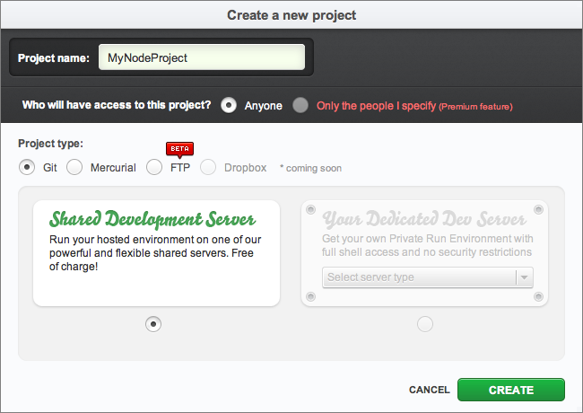

	

	<strong>说明</strong>
	
有些选项需要付费 Cloud9 计划。

	

	

	<strong>说明</strong>
	
在部署到 Azure 时不使用你的 Cloud9 项目的项目名称。

	

3.  创建项目后，单击"Start Editing"（开始编辑）****。如果这是你首次使用 Cloud9 IDE，系统会提供一个选项，帮助你了解此服务。如果你想跳过导览，以后再看，请选择"Just the editor, please"（仅编辑器）****。

	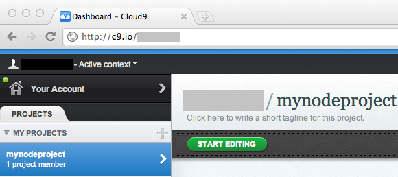

4.  要创建新的 Node 应用程序，请选择"File"（文件），然后选择"New File"（新建文件）********。

	

5.  将显示标题为"Untitled1"（无标题 1）****的新选项卡。在"Untitled1"（无标题 1）选项卡上输入以下代码来创建 Node 应用程序：

        var http = require('http');
        var port = process.env.PORT;
        http.createServer(function(req,res) {
            res.writeHead(200, { 'Content-Type': 'text/plain' });
            res.end('hello azure\n');
        }).listen(port);
	
	

	<strong>说明</strong>
	
使用 process.env.PORT 可确保应用程序无论是在 Cloud9 调试器中运行还是已部署到 Azure，都会选取正确的端口。

	

6.  若要保存代码，请选择"File"（文件），然后选择"Save as"（另存为）********。在
    "Save as"（另存为）对话框中，输入 **server.js** 作为文件名，然后****
    单击"Save"（保存）****。

	

	<strong>说明</strong>
	
你可能会注意到一个警告符号，它指示 req 变量未使用。你可以放心地忽略此警告。

	

	

## 运行应用程序

<strong>说明</strong>

虽然本节中提供的步骤对 Hello World 应用程序已足够，但对于使用外部模块的应用程序，你可能还需要针对调试环境选择特定版本的 Node.js。为此，请从调试下拉菜单中选择"配置..."，然后选择特定版本的 Node.js<strong></strong>。例如，如果未选择 Node.js 0.6.x，则在使用"azure"模块时，你可能会收到身份验证错误。

1.  单击"调试"****在 Cloud9 调试器中运行应用程序。
	
	

2.  将显示输出窗口。单击列出的 URL
    双通过浏览器窗口访问你的应用程序。

	

	产生的应用程序如下所示：

	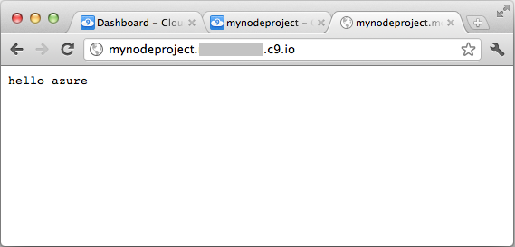

3.  若要停止调试应用程序，请单击"停止"****。

## 创建 Azure 帐户

若要将应用程序部署到 Azure，你需要一个帐户。如果你还没有 Azure 帐户，可以执行下列步骤注册一个免费试用帐户：

[WACOM.INCLUDE [create-azure-account](../includes/create-azure-account.md)]

## 创建部署

1.  若要创建新的部署，请选择"部署"，然后单击"+"********创建部署服务器。

    ![create a new deployment][create a new deployment]

2.  在"添加部署目标"对话框中，输入部署名称，然后在"选择类型"列表中选择"Azure"************。指定的部署名称将用于在 Cloud9 内标识部署；它与 Azure 内的部署名称不对应。

3.  如果这是你第一次创建使用 Azure 的 Cloud9 部署，必须配置你的 Azure 发布设置。执行下列步骤下载这些设置并将其安装到 Cloud9：

    1.单击"下载 Azure 设置"****。

        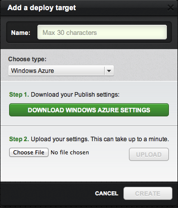

        这将打开 Azure 管理门户并提示你下载 Azure 发布设置。你需要登录 Azure 帐户后才能开始下载。

    2.  将发布设置文件保存到本地驱动器。

    3.  在"添加部署目标"对话框中，选择"选择文件"，然后选择在上一步骤中下载的文件********。

    4.  选择文件后，单击"上载"****。

4.  单击"+新建"****以创建新的托管服务。"托管服务"是一个容器，用于在将应用程序部署到 Azure 后托管该应用程序。有关详细信息，请参阅[创建 Azure 托管服务概述][]。

	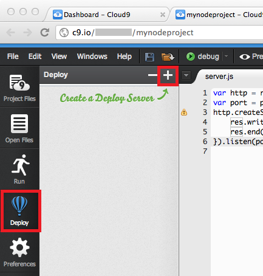

5.  系统会提示你输入新托管服务的名称和配置选项，例如实例数量、主机 OS 和数据中心。指定的部署名称将用作 Azure 中的托管服务名称。该名称在 Azure 系统中必须是唯一的。
	
	

	

	<strong>说明</strong>
	
在"添加部署目标"对话框中，"选择现有部署"部分下会列出所有现有 Azure 托管服务；选择现有托管服务会导致此项目被部署到该服务<strong></strong><strong></strong>。

	

	

	<strong>说明</strong>
	
选择"启用 RDP"<strong></strong>并提供用户名和密码会为你的部署启用远程桌面。

	

## 部署到 Azure 生产环境

1.  选择在前面的步骤中创建的部署。将出现一个对话框，其中提供有关此部署的信息，以及部署到 Microsoft Azure 之后将使用的生产 URL。

	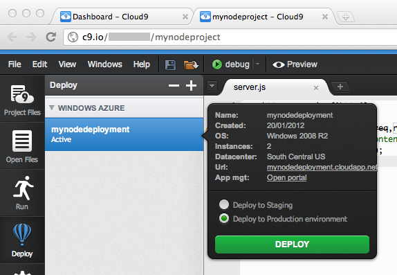

2.  选择"部署到生产环境"****。

3.  单击"部署"****以开始部署。

4.  如果这是你第一次将此项目部署到 Azure，将会收到"未找到 web.config"****错误。选择"是"****创建该文件。这会将"Web.cloud.config"文件添加到你的项目中。
	
	

5.  如果这是你第一次将此项目部署到 Azure，将会收到"'csdef'文件不存在"****错误。选择"是"****创建 .csdef 文件。这会将"ServiceDefinition.csdef"文件添加到你的项目中。    ServiceDefinition.csdef 是发布应用程序时必需的 Azure 特定文件。有关详细信息，请参阅[创建 Azure 托管服务概述][]。

6.  系统会提示你为此应用程序选择实例大小。选择"小型"，然后单击"创建"********。有关 Azure VM 大小的详细信息，请参阅[如何配置虚拟机大小][]。

	

7.  部署项将显示该部署过程的状态。完成后，部署将显示为"活动"****。

	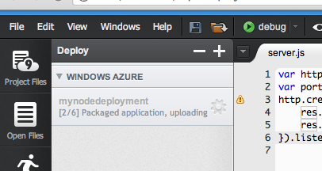

	

	<strong>说明</strong>
	
通过 Cloud 9 IDE 部署的项目会获得一个 GUID 作为在 Azure 中的部署名称。

	

8.  部署对话框包含指向生产 URL 的链接。部署完成后，单击该 URL 可浏览到正在 Azure 中运行的应用程序。

	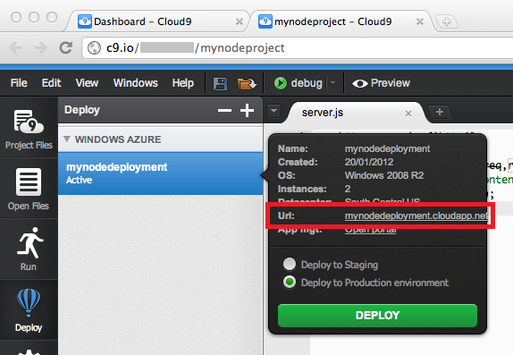

## 更新应用程序

当你对应用程序进行更改时，可以使用 Cloud9 将更新的应用程序部署到同一 Azure 托管服务。

1.  在 server.js 文件中，更新你的代码，以使"hello azure v2"显示在屏幕上。可以用下面的更新代码替换现有代码：

        var http = require('http');
        var port = process.env.PORT;
        http.createServer(function(req,res) {
            res.writeHead(200, { 'Content-Type': 'text/plain' });
            res.end('hello azure v2\n');
        }).listen(port);

2.  若要保存代码，请选择"文件"，然后选择"保存"********。

## 将更新部署到 Azure 过渡环境

1.  选择"部署到过渡环境"****。

2.  单击"部署"****以开始部署。

	每个 Azure 托管服务都支持两种环境：过渡环境和生产环境。过渡环境和生产环境完全一样，只不过你只能使用 Azure 生成的经过模糊处理的基于 GUID 的 URL 访问过渡应用程序。你可以使用过渡环境测试你的应用程序，验证更改后再通过执行虚拟 IP (VIP) 交换（将在本教程后面的内容中介绍），将过渡版本移至生产环境中。

3.  将应用程序部署到过渡环境时，基于 GUID 的过渡 URL 将显示在控制台输出中，如下面的屏幕截图中所示。单击 URL 可在浏览器中打开你的过渡应用程序。

	

## 使用 VIP 交换将更新移动到生产环境

服务部署到生产或过渡环境后，会在该环境中为服务分配一个虚拟 IP 地址 (VIP)。要将服务从过渡环境移至生产环境，可通过执行 VIP 交换（用于交换过渡和生产部署）来实现，而无需重新部署。VIP 交换可在不中断生产环境正常运行的情况下，将经过测试的过渡应用程序放入生产环境中。有关更多详细信息，请参阅[在 Azure 中管理部署概述][]。

1.  在部署对话框中，单击"打开门户"链接以打开****
    Azure 管理门户。

	![Link from deploy dialog to Azure Management Portal][Link from deploy dialog to Azure Management Portal]

2.  使用凭据登录门户。

3.  在网页的左侧，选择"托管服务、存储帐户和 CDN"，然后单击"托管服务"********。

	![Azure Management Portal][Azure Management Portal]

	结果窗格中显示具有你在 Cloud9 中指定的名称的托管服务以及两个部署，一个部署的"环境"值为"过渡"，另一个为"生产"************。

4.  若要执行 VIP 交换，请选择托管服务，然后在功能区中单击"交换 VIP"****。

	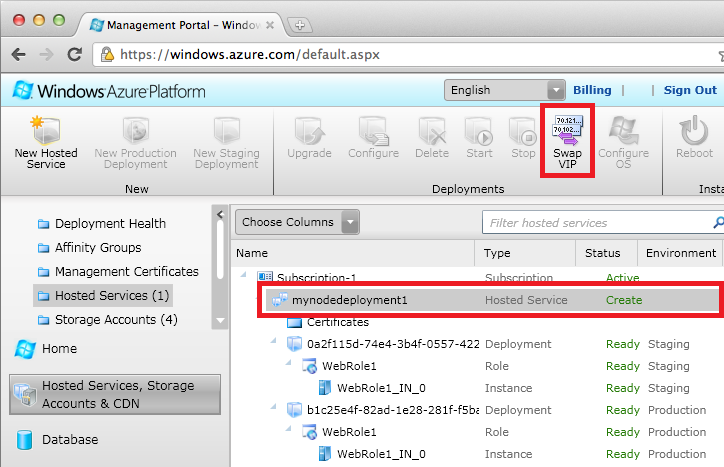

5.  在出现的"交换 VIP"对话框中单击"确定"****。

6.  浏览到你的生产应用程序。你会看到，之前部署到过渡环境中的应用程序版本现在出现在生产环境中。

	

## 使用远程桌面

如果您在创建部署时启用了 RDP 并指定了用户名和密码，则可以使用远程桌面，通过选择一个特定实例，然后选择功能区上的"连接"来连接到您的托管服务。

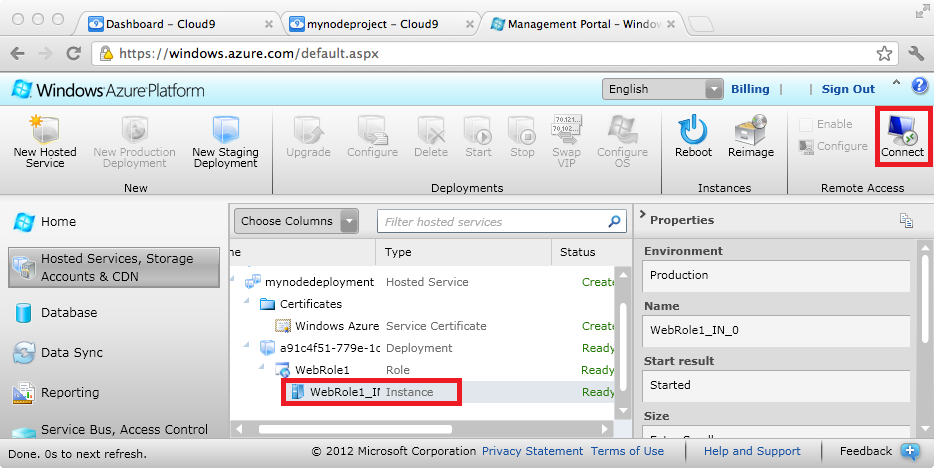

当你单击"连接"时，系统会提示你打开或下载 .RDP 文件。此文件包含连接到远程桌面会话所需的信息。在 Windows 系统上运行此文件时，系统会提示你输入在创建部署时输入的用户名和密码，之后将你连接到所选实例的桌面。

<strong>说明</strong>

连接到你的应用程序托管实例的 .RDP 文件只适用于 Windows 上的远程桌面
应用程序。

## 停止并删除应用程序

Azure 按使用服务器的小时数对角色实例进行收费，你的应用程序一旦部署，就开始使用服务器时间，即使实例未运行并处于停止状态也是如此。此外，生产和过渡部署都会使用服务器时间。

Cloud9 侧重提供 IDE，而不提供在应用程序部署到 Azure 后直接停止或删除应用程序的方法。若要删除 Azure 中托管的应用程序，请执行以下步骤：

1.  在部署对话框中，单击"打开门户"****链接以打开 Azure 管理门户。

	

2.  使用凭据登录门户。

3.  在网页的左侧，选择"托管服务、存储帐户和 CDN"，然后单击"托管服务"********。

4.  选择过渡部署（由"环境"值指示）****。在功能区上单击"删除"来删除应用程序****。

	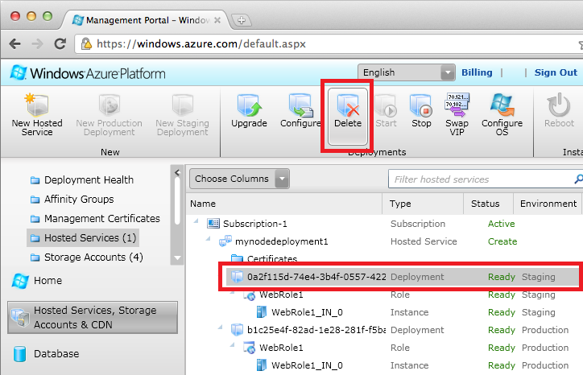

5.  选择生产部署并单击"删除"同时删除该应用程序****。

## 其他资源

-   [Cloud9 文档][]

  [Cloud9 IDE]: http://cloud9ide.com/ 
  [创建 Azure 托管服务概述]: http://msdn.microsoft.com/zh-cn/library/windowsazure/jj155995.aspx
  [如何配置虚拟机大小]: http://msdn.microsoft.com/zh-cn/library/windowsazure/ee814754.aspx
  [在 Azure 中管理部署概述]: http://msdn.microsoft.com/zh-cn/library/windowsazure/gg433027.aspx
  [Cloud9 文档]: http://go.microsoft.com/fwlink/?LinkId=241421&clcid=0x409
<!--HONumber=39-->
