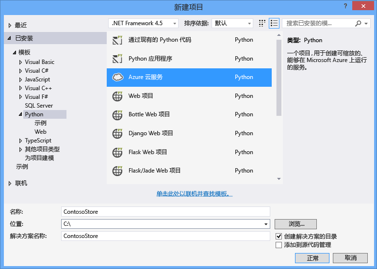
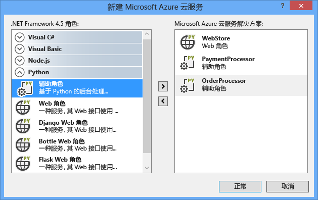
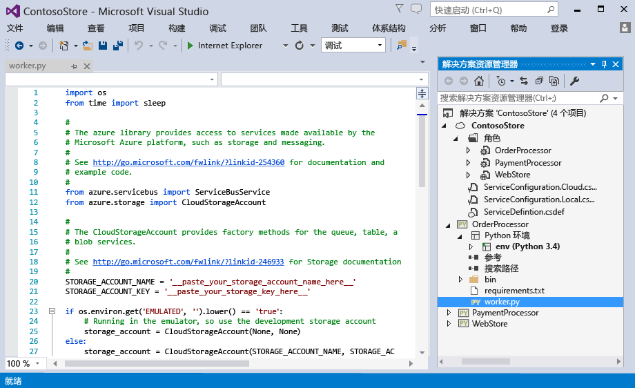
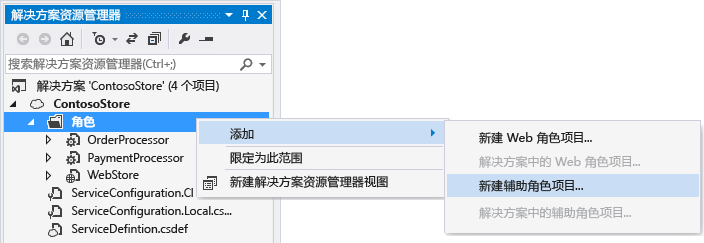
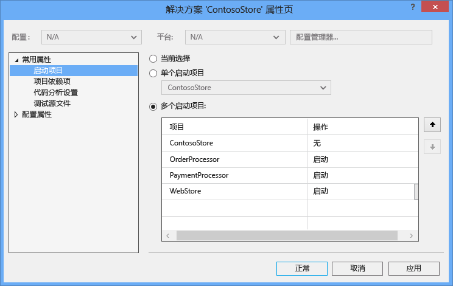
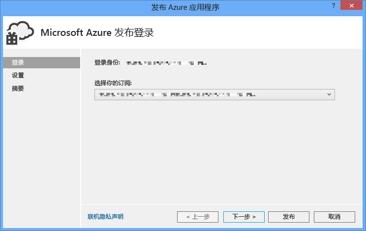
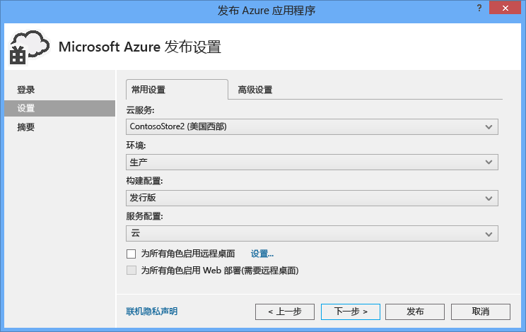
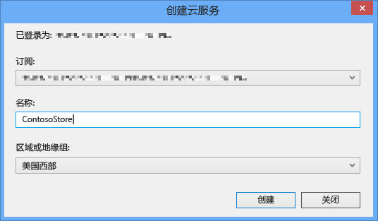
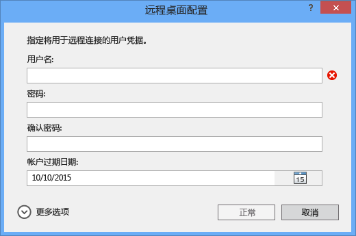
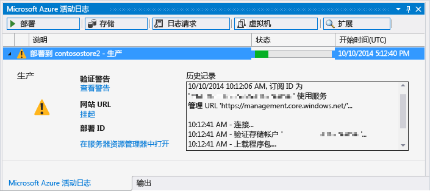

<properties linkid="develop-python-cloud-services-with-ptvs" urlDisplayName="Python Web and Worker Roles with Python Tools 2.1 for Visual Studio" pageTitle="使用 Python Tools 2.1 for Visual Studio 创建 Python Web 角色和辅助角色" metaKeywords="Azure python, web role, worker role, PTVS, cloud service" description="概述如何使用 Python Tools for Visual Studio 创建 Azure 云服务，包括 Web 角色和辅助角色。" metaCanonical="" services="" documentationCenter="Python" title="Python Web and Worker Roles with Python Tools 2.1 for Visual Studio" authors="huvalo" solutions="" manager="wpickett" editor="" />
<tags ms.service=""
    ms.date=""
    wacn.date=""
    />

# 使用 Python Tools 2.1 for Visual Studio 创建 Python Web 角色和辅助角色

本指南概述如何 [Python Tools for Visual Studio][] 创建 Python Web 角色和辅助角色。

+ [先决条件](#prerequisites)
+ [什么是 Python Web 角色和辅助角色？](#what-are-python-web-and-worker-roles)
+ [创建项目](#project-creation)
+ [本地运行](#run-locally)
+ [发布到 Azure](#publish-to-azure)
+ [后续步骤](#next-steps)

##先决条件

 - Visual Studio 2012 或 2013
 - [Python Tools 2.1 for Visual Studio][]
 - [Azure SDK Tools for VS 2013][] 或 [Azure SDK Tools for VS 2012][]
 - [Python 2.7 32 位][]或 [Python 3.4 32 位][]

[WACOM.INCLUDE [create-account-and-websites-note](../includes/create-account-and-websites-note.md)]

##什么是 Python Web 角色和辅助角色？

Azure 提供了三种用于运行应用程序的计算模型：[Azure 网站][execution model-web sites]、[Azure 虚拟机][execution model-vms]和 [Azure 云服务][execution model-cloud services]。这三种模型都支持 Python。云服务（包括 Web 角色和辅助角色）提供了"平台即服务 (PaaS)"。在云服务中，Web 角色提供专用的 Internet Information Services (IIS) Web 服务器来托管前端 Web 应用程序，而辅助角色可独立于用户交互或输入运行异步任务、运行时间较长的任务或永久性任务。

有关详细信息，请参阅[什么是云服务？]。

<strong>想要构建一个简单的网站？</strong>

如果你的方案只涉及一个简单的网站前端，则可以考虑使用轻型 Azure 网站。随着你的网站的不断扩大和你的需求的变化，你可以轻松升级到云服务。请在 <a href="/develop/python/">Python 开发人员中心</a>查看介绍 Azure 网站开发的文章。

 

##创建项目

可以在 Visual Studio 中，在"新建项目"对话框中的"Python"下面选择"Azure 云服务"************。 

在 Azure 云服务向导中，可以选择创建新的 Web 角色和辅助角色。

辅助角色模板附带了样板代码，用于连接到 Azure 存储帐户或 Service Bus。

你随时可以将 Web 或辅助角色添加到现有云服务。可以选择添加解决方案中的现有项目，也可以创建新的项目。 

云服务可以包含用不同语言实现的角色。例如，可以包含使用 Django 实现的 Python Web 角色，和 Python 与 C# 辅助角色。可以轻松地使用 Service Bus 队列或存储队列在角色之间通信。

##本地运行

如果将云服务项目设置为启动项目并按 F5，云服务将在本地 Azure 仿真程序中运行。

虽然 PTVS 支持在仿真程序中启动，但调试（断点等）将无法工作。

若要调试 Web 和辅助角色，可以将角色项目设置为启动项目，然后调试该项目。还可以设置多个启动项目。右键单击解决方案并选择"设置启动项目"****。

##发布到 Azure

若要发布，请右键单击解决方案中的云服务项目，然后选择"发布"****。

在设置页中，选择你要发布到的云服务。

可以创建新的云服务（如果没有）。

在计算机上启用远程桌面连接以调试失败也很有用。

完成配置设置后，单击"发布"****。

输出窗口中会显示部分进度信息，然后你将看到"Microsoft Azure 活动日志"窗口。

部署需要几分钟才能完成，然后，你的 Web 角色和/或辅助角色将在 Azure 上运行！

##后续步骤

有关在 Python Tools for Visual Studio 中处理 Web 和辅助角色的更多详细信息，请参阅 PTVS 文档：

- [云服务项目][]

有关从 Web 和辅助角色使用 Azure 服务（例如，使用 Azure 存储空间或 Service Bus）的详细信息，请参阅以下指南：
 
- [Blob 服务][]
- [表服务][]
- [队列服务][]
- [Service Bus 队列][]
- [Service Bus 主题][]

<!--Link references-->

[什么是云服务？]: /zh-cn/documentation/articles/cloud-services-what-is/
[执行模型-网站]: /zh-cn/documentation/articles/fundamentals-application-models/#WebSites
[执行模型-vms]: /zh-cn/documentation/articles/fundamentals-application-models/#VMachine
[执行模型-云服务]: /zh-cn/documentation/articles/fundamentals-application-models/#CloudServices
[Python 开发人员中心]: /develop/python/

[Blob 服务]: /zh-cn/documentation/articles/storage-python-how-to-use-blob-storage/
[队列服务]: /zh-cn/documentation/articles/storage-python-how-to-use-queue-storage/
[表服务]: /zh-cn/documentation/articles/storage-python-how-to-use-table-storage/
[Service Bus 队列]: /zh-cn/documentation/articles/service-bus-python-how-to-use-queues/
[Service Bus 主题]: /zh-cn/documentation/articles/service-bus-python-how-to-use-topics-subscriptions/

<!--External Link references-->

[Python Tools for Visual Studio]: http://pytools.codeplex.com
[Python Tools for Visual Studio 文档]: http://pytools.codeplex.com/documentation 
[云服务项目]: http://pytools.codeplex.com/wikipage?title=Features%20Cloud%20Project

[Python Tools 2.1 for Visual Studio]: http://go.microsoft.com/fwlink/?LinkId=517189
[Azure SDK Tools for VS 2013]: http://go.microsoft.com/fwlink/?LinkId=323510
[Azure SDK Tools for VS 2012]: http://go.microsoft.com/fwlink/?LinkId=323511
[Python 2.7 32 位]: http://go.microsoft.com/fwlink/?LinkId=517190 
[Python 3.4 32 位]: http://go.microsoft.com/fwlink/?LinkId=517191
<!--HONumber=39-->
