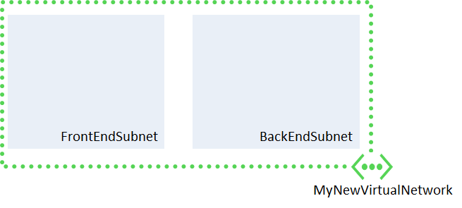

<properties 
	pageTitle="教程：创建仅使用云的虚拟网络" 
	description="通过本教程了解如何创建一个仅使用云的 Azure 虚拟网络。" 
	services="virtual-machines, virtual-network" 
	documentationCenter="" 
	authors="cherylmc" 
	manager="adinah" 
	editor=""/>

<tags 
	ms.service="virtual-network"
	ms.date="08/17/2015" 
	wacn.date="09/15/2015"/>

# 教程：在 Azure 中创建仅包含云的虚拟网络

本教程将指导你在 Azure 管理门户中创建包含两个子网的仅限云的示例 Azure 虚拟网络。生成的虚拟网络如下所示：

例如，FrontEndSubnet 可用于 Web 服务器，BackEndSubnet 可用于 SQL 服务器或域控制器。

本教程假定您之前未使用过 Azure。其目的是通过一个示例配置逐步提供指导，来帮助你熟悉创建自己虚拟网络所要执行的步骤。如果你要针对特定的配置创建只使用云的虚拟网络，请参阅[在管理门户中配置只使用云的虚拟机](/documentation/articles/virtual-network/virtual-networks-create-vnet)。如果你要查找有关虚拟网络的设计方案和高级信息，请参阅 [Azure 虚拟网络概述](http://msdn.microsoft.com/zn-ch/library/windowsazure/jj156007.aspx)。

> [AZURE.NOTE]本教程将不会指导你创建跨界配置（在这种配置中，虚拟网络将连接到组织网络）。有关指导你创建提供跨界连接和站点到站点 VPN 连接（例如，连接到位于你公司内的 Active Directory 或 SharePoint）的虚拟网络的教程，请参阅[教程：创建跨界虚拟网络以建立站点到站点连接](/documentation/articles/virtual-network/virtual-networks-create-site-to-site-cross-premises-connectivity)。

##  目标

在本教程中，你将学习如何设置一个包含两个子网的、只使用云的基本 Azure 虚拟网络。

##  先决条件

*  至少具有一个有效活动 Azure 订阅的 Microsoft 帐户。如果你还没有 Azure 订阅，可以通过[试用 Azure](/pricing/1rmb-trial/) 免费注册。如果你已有 MSDN 订阅，请参阅 [Microsoft Azure 特价：MSDN、 MPN、和 Bizspark 优惠](/pricing/member-offers/msdn-benefits-details/)。

##  为本教程创建虚拟网络

若要创建这个仅限云的示例虚拟网络，请执行以下操作

1. 登录到管理门户。

2. 在屏幕的左下角，单击“新建”>“网络服务”>“虚拟网络”，然后单击“自定义创建”启动配置向导。

	![][Image1]

3. 在“虚拟网络详细信息”页上，输入以下信息：

- **名称** - 键入 **YourVirtualNetwork**。

- **区域** - 将在位于指定区域内的数据中心创建你的虚拟网络。为获得最佳性能，请从下拉列表中选择你所在的区域。
 

	![][Image2]

4. 单击右下角的下一步箭头。有关此页上各项设置的详细信息，请参阅[关于使用管理门户配置虚拟网络](http://go.microsoft.com/fwlink/p/?linkid=248092&clcid=0x409)中的“虚拟网络详细信息”部分。

5. 在“DNS 服务器和 VPN 连接”页上，单击右下角的“下一步”箭头。Azure 将为添加到此虚拟网络的新虚拟机分配一个基于 Internet 的 Azure DNS 服务器，使这些虚拟机可以访问 Internet 资源。有关此页上各设置的更多信息，请参阅[关于使用管理门户配置虚拟网络](http://go.microsoft.com/fwlink/p/?linkid=248092&clcid=0x409)中的“DNS 服务器和 VPN 连接”页。
	
6.	就像使用真实网络一样，虚拟网络也需要向其中的虚拟机分配一系列 IP 地址（称为地址空间）。虚拟网络也支持子网，这些子网需要自身的、从虚拟网络地址空间派生的地址空间。在本教程中，我们将创建 BackEndSubnet 和 FrontEndSubnet。在“虚拟网络地址空间”页上配置以下项：

	- 对于“地址空间”，请在“CIDR (地址计数)”中选择“/16 (65535)”。

	- 对于子网，请在第一行中键入 **BackEndSubnet** 覆盖现有名称，键入 **10.0.1.0** 作为起始 IP，然后在“CIDR (地址计数)”中选择“/24 (256)”。单击“添加子网”，然后键入 **FrontEndSubnet** 作为名称，键入 **10.0.2.0** 作为起始 IP。
		
	![][Image4]

 返回到我们的虚拟网络示意图，你已配置以下地址空间：
 
	
- FrontEndSubnet：10.0.2.0/24
- BackEndSubnet：10.0.1.0/24

 有关此页面上各项设置的详细信息，请参阅[关于使用管理门户配置虚拟网络](http://go.microsoft.com/fwlink/p/?linkid=248092&clcid=0x409)中的“虚拟网络地址空间”页。

7. 单击该页右下角的复选标记，此时将开始创建你的虚拟网络。创建虚拟网络后，在 Azure 管理门户中的“网络”页上，你将看到“状态”下面列出了“已创建”。  

	![][Image5]

你可以参考以下资源继续了解 Azure 基础结构服务：

- [如何创建自定义虚拟机](virtual-machines-create-custom.md) 使用本主题在虚拟网络中安装虚拟机。有关虚拟机和安装选项的详细信息，请参阅 [Azure 虚拟机](/documentation/services/virtual-machines/)。

- [在 Azure 虚拟网络中安装新的 Active Directory 林](documentation/articles/active-directory-new-forest-virtual-machine) - 使用本主题在不连接任何其他网络的情况下安装新的 Windows Server Active Directory (AD) 林。本教程将介绍创建虚拟机 (VM) 以安装新林所需的特定步骤。如果你计划使用本教程，请不要通过管理门户创建任何虚拟机。有关详细信息，请参阅[在 Azure 虚拟机中部署 Windows Server Active Directory 的准则](http://msdn.microsoft.com/zn-ch/library/windowsazure/jj156090.aspx)。

若要删除此虚拟网络，请将它选中，单击“删除”，然后单击“是”。

如果你已准备好针对特定的配置创建只使用云的虚拟网络，请参阅[在管理门户中配置只使用云的虚拟机](/documentation/articles/virtual-network/virtual-networks-create-vnet)。

如果你要查找有关虚拟网络的设计方案和高级信息，请参阅 [Azure 虚拟网络概述](http://msdn.microsoft.com/zn-chlibrary/windowsazure/jj156007.aspx)。

有关其他虚拟网络配置过程和设置，请参阅 [Azure 虚拟网络配置任务](http://go.microsoft.com/fwlink/p/?linkid=296652&clcid=0x409)。

## 另请参阅

-  [Azure 虚拟网络常见问题解答](http://go.microsoft.com/fwlink/p/?LinkId=296650)

-  [Azure 虚拟网络配置任务](http://go.microsoft.com/fwlink/p/?LinkId=296652)

-  [使用网络配置文件配置虚拟网络](documentation/articles/virtual-network/virtual-networks-using-network-configuration-file.md)

-  [VM 和角色实例的名称解析](http://go.microsoft.com/fwlink/?LinkId=248097)

[Image1]: ./media/create-virtual-network/createVNet_01_OpenVirtualNetworkWizard.png
[Image2]: ./media/create-virtual-network/createVNet_02_VirtualNetworkDetails.png
[Image3]: ./media/create-virtual-network/createVNet_03_DNSServersandVPNConnectivity.png
[Image4]: ./media/create-virtual-network/createVNet_04_VirtualNetworkAddressSpaces.png
[Image5]: ./media/create-virtual-network/createVNet_05_VirtualNetworkCreatedStatus.png
[Image7]: ./media/create-virtual-network/createVNet_07_VNetExampleSpaces.png
[Image8]: ./media/create-virtual-network/createVNet_07_VNetExampleSpaces.png

<!---HONumber=69-->