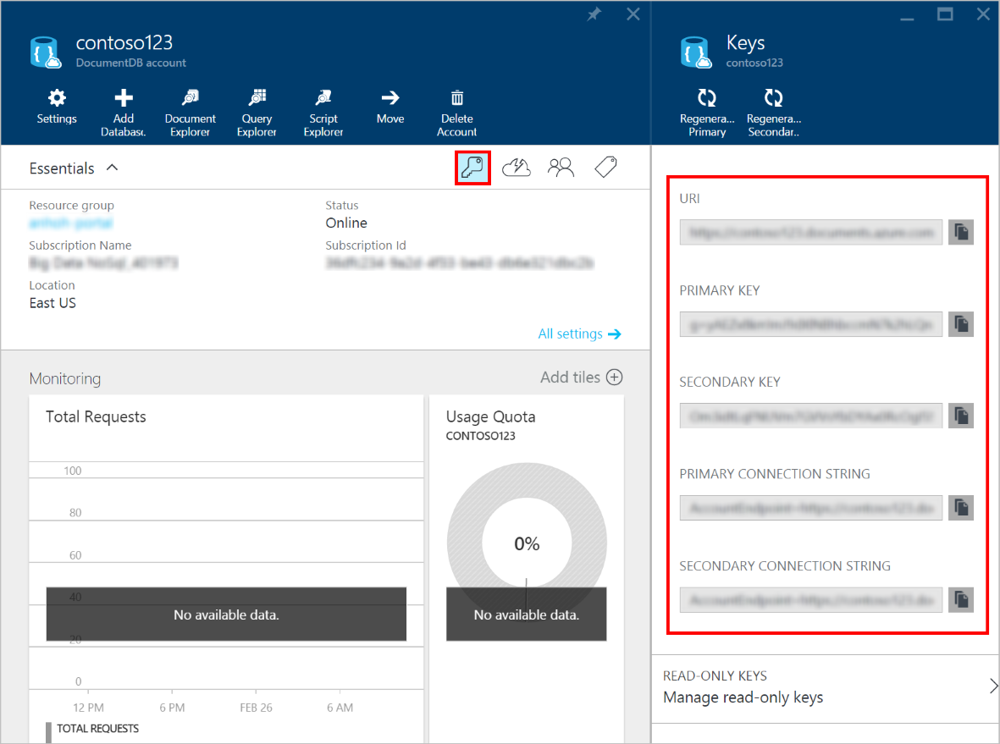
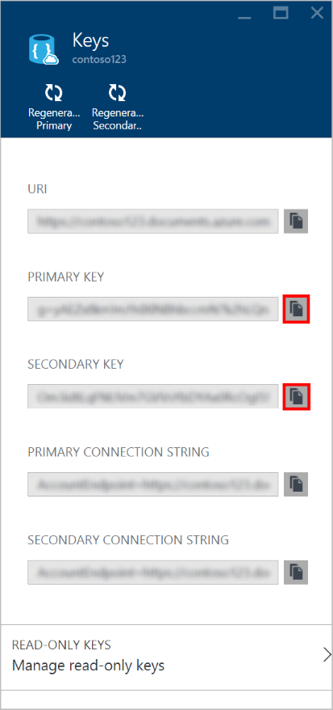
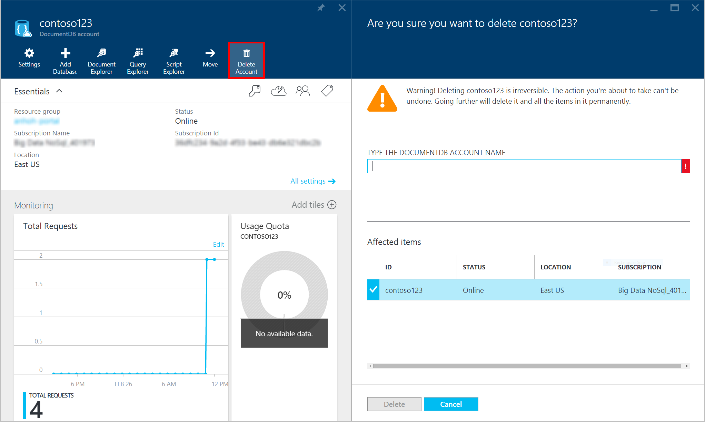

<properties
	pageTitle="通过 Azure 门户预览管理 DocumentDB 帐户 | Azure"
	description="了解如何通过 Azure 门户预览管理你的 DocumentDB 帐户。查找有关使用 Azure 门户预览查看、复制、删除和访问帐户的指南。"
	keywords="Azure 门户预览、documentdb、azure、Microsoft azure"
	services="documentdb"
	documentationCenter=""
	authors="AndrewHoh"
	manager="jhubbard"
	editor="cgronlun"/>

<tags
	ms.service="documentdb"
	ms.date="06/14/2016"
	wacn.date="07/04/2016"/>

# 如何管理 DocumentDB 帐户

了解如何设置全球一致性级别，以及管理多个区域以实现数据的全局可用性。此外，了解如何使用密钥，以及如何在 Azure 门户预览中删除帐户。
microsoft.com/
## 管理 DocumentDB 一致性设置

根据应用程序的语义选择正确的一致性级别。你应在 DocumentDB 中熟悉可用的一致性级别：[Using consistency levels to maximize availability and performance in DocumentDB（使用一致性级别最大化 DocumentDB 中的可用性和性能）][consistency]。DocumentDB 在每个一致性级别为你的数据库帐户提供一致性、可用性和性能保证。使用非常一致性级别配置数据库帐户需要将数据局限在单个 Azure 区域，而不能使其全局可用。另一方面，宽松的一致性级别 - 受限停滞、会话或最终一致性可让你将任意数量的 Azure 区域与你的数据库帐户相关联。以下简单步骤说明如何为数据库帐户选择默认的一致性级别。

### 指定 DocumentDB 帐户的默认一致性

1. 在 [Azure 门户预览](https://portal.azure.cn/)中，访问你的 DocumentDB 帐户。
2. 在帐户边栏选项卡中，如果“设置”边栏选项卡尚未打开，请单击“所有设置”。
![默认一致性会话][5]

3. 在“所有设置”边栏选项卡中，单击“功能”下的“默认一致性”条目。
    ![默认一致性会话][6]

4. 在“默认一致性”边栏选项卡中，选择新的一致性级别，然后单击“保存”。
5. 可通过 Azure 门户预览通知中心监控操作的进度。

> [AZURE.NOTE] 可能需要几分钟对你的 DocumentDB 帐户的默认一致性设置更改才会生效。

## 添加区域

DocumentDB 已在大部分 [Azure 区域][azureregions]中推出。为数据库帐户选择默认的一致性级别后，可以关联一个或多个区域（具体取决于所选的默认一致性级别和全局分发需求）。

> [AZURE.NOTE] 目前，可将新区域添加到 2016 年 6 月 13 日或之后创建的新 DocumentDB 帐户。在应用商店中选择“Azure DocumentDB - 多区域数据库帐户”以创建多区域帐户。6 月 13 日之前创建的帐户在不久之后就能支持全局可用性。

1. 在 [Azure 门户预览](https://portal.azure.com/)的跳转栏中，单击“DocumentDB 帐户”。
2. 在“DocumentDB 帐户”边栏选项卡中，选择要修改的数据库帐户。
3. 在帐户边栏选项卡中，如果“所有设置”边栏选项卡尚未打开，请单击“所有设置”。
4. 在“所有设置”边栏选项卡中，单击“添加/删除区域”。
    ![在“DocumentDB 帐户”>“设置”>“添加/删除区域”下添加区域][1]
5. 在“添加/删除区域”边栏选项卡中，选择要添加或删除的区域，然后单击“确定”。添加区域会产生费用，请参阅定价页了解详细信息。

    ![在图中单击区域可以添加或删除区域][2]

### 选择区域

具体而言，在配置多个区域时，请确保从每个配对区域列中选择相同数目的区域（使用 +/-1 可更改为奇数/偶数）。例如，如果你要部署到 4 个美国区域，请从左列中选择 2 个美国区域，再从右列中选择 2 个美国区域。因此，下面是适当的设置：美国西部、美国东部、美国中北部和美国中南部。

如果只为灾难恢复方案配置 2 个区域，请务必遵循本指南。如果要配置 2 个以上的区域，则遵循本指南是不错的做法，但只要某些选定的区域遵守这种配对，则就没有必要遵循本指南。

## 选择写入区域

尽管与 DocumentDB 数据库帐户关联的所有区域都能提供读取（单项与多项分页读取）和查询，但只有一个区域可以主动接收写入（插入、更新插入、替换和删除）请求。若要设置活动写入区域，请执行以下操作

1. 在“DocumentDB 帐户”边栏选项卡中，选择要修改的数据库帐户。
2. 在帐户边栏选项卡中，如果“所有设置”边栏选项卡尚未打开，请单击“所有设置”。
3. 在“所有设置”边栏选项卡中，单击“写入区域优先级”。
    ![在“DocumentDB 帐户”>“设置”>“添加/删除区域”下更改写入区域][3]
4. 单击并拖动区域以便为区域列表排序。区域列表中的第一个区域是活动写入区域。
    ![通过在“DocumentDB 帐户”>“设置”>“更改写入区域”下为区域列表重新排序来更改写入区域][4]

## 查看、复制和重新生成访问密钥
当你创建 DocumentDB 帐户时，服务生成两个主访问密钥，用于访问 DocumentDB 帐户时的身份验证。提供两个访问密钥后，DocumentDB 支持在不中断你的 DocumentDB 帐户连接的情况下重新生成密钥。

在“Microsoft Azure 门户预览”中，在“DocumentDB 帐户”边栏选项卡的的“Essentials”栏中访问“密钥”边栏选项卡，以查看、复制和重新生成用于访问 DocumentDB 帐户的访问密钥。

另一种方法是从“所有设置”边栏选项卡访问“密钥”条目。

请注意，“密钥”边栏选项卡还包括可用来从[数据迁移工具](/documentation/articles/documentdb-import-data)连接到你的帐户的主要和辅助连接字符串。

它还包括为用户提供 DocumentDB 的只读访问权限的只读密钥。读取和查询为只读操作，而创建、删除和替换则不是。

### 在 Azure 门户预览中查看并复制访问密钥

1.      在 [Azure 门户预览](https://portal.azure.cn/)中，访问你的 DocumentDB 帐户。 

2. 在“DocumentDB 帐户”边栏选项卡的“概要”栏中，单击“密钥”。

3.      在“密钥”边栏选项卡中，单击你想要复制的密钥右侧的“复制”按钮。

  

### 重新生成访问密钥

你应定期将访问密钥更改为你的 DocumentDB 帐户，使你的连接更安全。分配了两个访问密钥，你可以使用一个访问密钥保持与 DocumentDB 帐户的连接，同时，你可以重新生成另一个访问密钥。

> [AZURE.WARNING] 重新生成访问密钥会影响任何依赖于当前密钥的应用程序。所有使用访问密钥访问 DocumentDB 帐户的客户端都必须更新为使用新密钥。

如果你具有使用 DocumentDB 帐户的应用程序或云服务，则重新生成密钥将失去连接，除非你滚动使用密钥。以下步骤概述了滚动密钥的过程。

1.      更新应用程序代码中的访问密钥以引用 DocumentDB 帐户的辅助访问密钥。

2.      为你的 DocumentDB 帐户重新生成主访问密钥。在 [Azure 门户预览](https://portal.azure.cn/)中，访问你的 DocumentDB 帐户。

3. 在“DocumentDB 帐户”边栏选项卡的“概要”栏中，单击“密钥”。

4.      在“密钥”边栏选项卡上，单击“重新生成主密钥”，然后单击“确定”以确认要生成新密钥。

5.      当你确认新的密钥可供使用后（大约在重新生成后的 5 分钟），请更新应用程序代码中的访问密钥以引用新的主访问密钥。

6.      重新生成辅助访问密钥。

> [AZURE.NOTE] 可能需要几分钟时间才能使用新生成的密钥来访问你的 DocumentDB 帐户。

## 删除 DocumentDB 帐户
若要从 Azure 门户预览中删除不再使用的 DocumentDB 帐户，请使用“DocumentDB 帐户”边栏选项卡中的“删除”命令。

1. 在 [Azure 门户预览](https://portal.azure.cn)中，访问你要删除的 DocumentDB 帐户。
2. 在“DocumentDB 帐户”边栏选项卡中，单击“删除帐户”。
3. 在生成的确认边栏选项卡中，键入 DocumentDB 帐户名称以确认你想要删除该帐户。
4. 单击确认边栏选项卡上的“删除”按钮。

## 后续步骤

了解如何[开始使用 DocumentDB 帐户](http://go.microsoft.com/fwlink/p/?LinkId=402364)。

若要了解更多有关 DocumentDB 的信息，请参阅 [azure.cn](http://go.microsoft.com/fwlink/?LinkID=402319&clcid=0x409) 上的 Azure DocumentDB 文档。

<!--Image references-->
[1]: ./media/documentdb-manage-account/documentdb_add_region-1.png
[2]: ./media/documentdb-manage-account/documentdb_add_region-2.png
[3]: ./media/documentdb-manage-account/documentdb_change_write_region-1.png
[4]: ./media/documentdb-manage-account/documentdb_change_write_region-2.png
[5]: ./media/documentdb-manage-account/documentdb_change_consistency-1.png
[6]: ./media/documentdb-manage-account/chooseandsaveconsistency.png

<!--Reference style links - using these makes the source content way more readable than using inline links-->
[bcdr]: https://azure.microsoft.com/documentation/articles/best-practices-availability-paired-regions/
[consistency]: /documentation/articles/documentdb-consistency-levels/
[azureregions]: https://azure.microsoft.com/zh-cn/regions/#services
[offers]: https://azure.microsoft.com/zh-cn/pricing/details/documentdb/

<!---HONumber=Mooncake_0627_2016-->