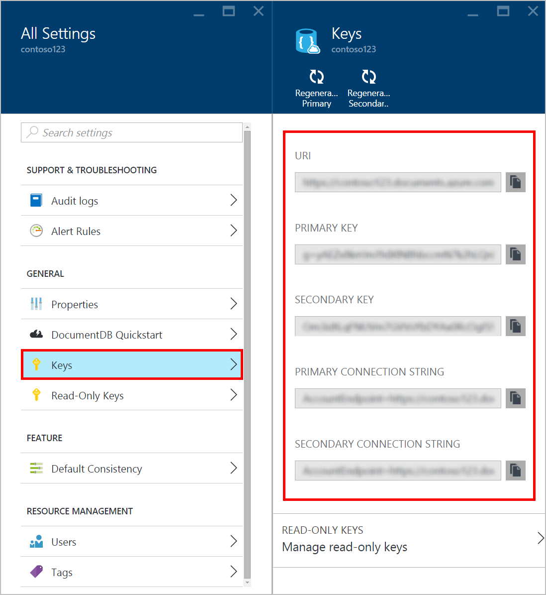
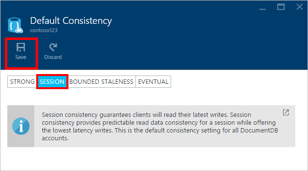

<properties
	pageTitle="通过 Azure 门户管理 DocumentDB 帐户 | Azure"
	description="了解如何通过 Azure 门户管理你的 DocumentDB 帐户。查找有关使用 Azure 门户查看、复制、删除和访问帐户的指南。"
	keywords="Azure 门户、documentdb、azure、Microsoft azure"
	services="documentdb"
	documentationCenter=""
	authors="AndrewHoh"
	manager="jhubbard"
	editor="cgronlun"/>

<tags
	ms.service="documentdb"
	ms.date="02/26/2016"
	wacn.date="06/28/2016"/>

# 如何管理 DocumentDB 帐户

了解如何使用密钥和一致性级别。此外，了解如何在 Azure 门户中删除帐户。

## 查看、复制和重新生成访问密钥
当你创建 DocumentDB 帐户时，服务生成两个主访问密钥，用于访问 DocumentDB 帐户时的身份验证。提供两个访问密钥后，DocumentDB 支持在不中断你的 DocumentDB 帐户连接的情况下重新生成密钥。

在“Microsoft Azure 门户”中，在“DocumentDB 帐户”边栏选项卡的的“Essentials”栏中访问“密钥”边栏选项卡，以查看、复制和重新生成用于访问 DocumentDB 帐户的访问密钥。

另一种方法是从“所有设置”边栏选项卡访问“密钥”条目。

请注意，“密钥”边栏选项卡还包括可用来从[数据迁移工具](/documentation/articles/documentdb-import-data)连接到你的帐户的主要和辅助连接字符串。

它还包括为用户提供 DocumentDB 的只读访问权限的只读密钥。读取和查询为只读操作，而创建、删除和替换则不是。

### 在 Azure 门户中查看并复制访问密钥

1.      在 [Azure 门户](https://portal.azure.cn/)中，访问你的 DocumentDB 帐户。 

2.      在“DocumentDB 帐户”边栏选项卡的“Essentials”栏中，单击“密钥”。

3.      在“密钥”边栏选项卡中，单击你想要复制的密钥右侧的“复制”按钮。

  

### 重新生成访问密钥

你应定期将访问密钥更改为你的 DocumentDB 帐户，使你的连接更安全。分配了两个访问密钥，你可以使用一个访问密钥保持与 DocumentDB 帐户的连接，同时，你可以重新生成另一个访问密钥。

> [AZURE.WARNING] 重新生成访问密钥会影响任何依赖于当前密钥的应用程序。所有使用访问密钥访问 DocumentDB 帐户的客户端都必须更新为使用新密钥。

如果你具有使用 DocumentDB 帐户的应用程序或云服务，则重新生成密钥将失去连接，除非你滚动使用密钥。以下步骤概述了滚动密钥的过程。

1.      更新应用程序代码中的访问密钥以引用 DocumentDB 帐户的辅助访问密钥。

2.      为你的 DocumentDB 帐户重新生成主访问密钥。在 [Azure 门户](https://portal.azure.cn/)中，访问你的 DocumentDB 帐户。

3.      在“DocumentDB 帐户”边栏选项卡的“Essentials”栏中，单击“密钥”。

4.      在“密钥”边栏选项卡上，单击“重新生成主密钥”，然后单击“确定”以确认要生成新密钥。

5.      当你确认新的密钥可供使用后（大约在重新生成后的 5 分钟），请更新应用程序代码中的访问密钥以引用新的主访问密钥。

6.      重新生成辅助访问密钥。

请注意，可能需要几分钟时间才能使用新生成的密钥来访问你的 DocumentDB 帐户。

## 管理 DocumentDB 一致性设置
DocumentDB 支持四种定义完好的用户可配置的数据一致性级别，从而使开发人员能够在一致性、可用性和延迟之间实现可预测的平衡。

- **强**一致性保证读操作始终返回上次写入的值。

- **有限过时**一致性保证读取的内容不会太过时。它专门用于保证不会读取比上次写入版本旧 K 个版本以上的内容。

- **会话**一致性保证单向读取（即不会读取旧数据，然后新数据，再旧数据）、单向写入（有序写入），以及保证读取任何单个客户端的最新写入内容。

- **最终**一致性保证读取操作始终读取写入内容的有效子集，并最终合并这些子集。

请注意在默认情况下，DocumentDB 帐户设置为使用会话级别一致性。有关 DocumentDB 一致性设置的其他信息，请参阅[一致性级别](http://go.microsoft.com/fwlink/p/?LinkId=402365)部分。

### 指定 DocumentDB 帐户的默认一致性

1.      在 [Azure 门户](https://portal.azure.cn/)中，访问你的 DocumentDB 帐户。 

2.      在“帐户”边栏选项卡中，如果“设置”边栏选项卡尚未打开，请单击最上方命令栏中的“设置”图标。

3.      在“所有设置”边栏选项卡中，单击“功能”下的“默认一致性”条目。

4.      在“默认一致性”边栏选项卡中，选择新的一致性级别，然后单击“保存”。

5.      可通过 Azure 门户通知中心监控操作的进度。

请注意，可能需要几分钟对你的 DocumentDB 帐户的默认一致性设置更改才会生效。

## 如何：在 Azure 门户中删除 DocumentDB 帐户
若要从 Azure 门户中删除不再使用的 DocumentDB 帐户，请使用“DocumentDB 帐户”边栏选项卡中的“删除”命令。

1.      在 [Azure 门户](https://portal.azure.cn/)中，访问你要删除的 DocumentDB 帐户。 

2.      在“DocumentDB 帐户”边栏选项卡中单击“删除”命令。

3.      在生成的确认边栏选项卡中，键入 DocumentDB 帐户名称以确认你想要删除该帐户。

4.      单击确认边栏选项卡上的“删除”按钮。

## 后续步骤

了解如何[开始使用 DocumentDB 帐户](http://go.microsoft.com/fwlink/p/?LinkId=402364)。

若要了解更多有关 DocumentDB 的信息，请参阅 [azure.com](http://go.microsoft.com/fwlink/?LinkID=402319&clcid=0x409) 上的 Azure DocumentDB 文档。

<!---HONumber=Mooncake_0425_2016-->