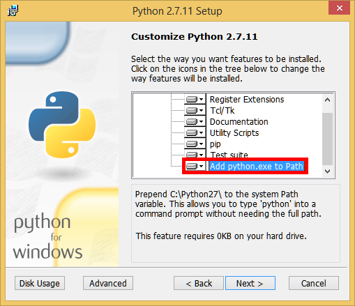
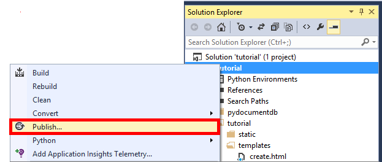
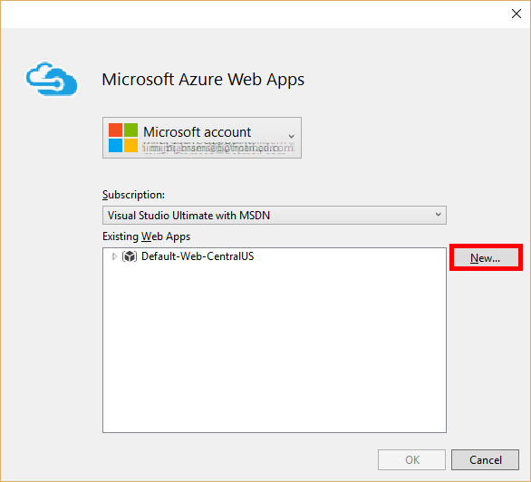

<properties
    pageTitle="使用 DocumentDB 开发 Python Flask Web 应用程序 | Azure"
    description="查看使用 DocumentDB 来存储和访问托管于 Azure 的 Python Flask Web 应用程序的数据的数据库教程。查找应用程序开发解决方案。" 
	keywords="应用程序开发, 数据库教程, Python Flask, Python web 应用程序, Python Web 开发, DocumentDB, Azure, Microsoft Azure"
    services="documentdb"
    documentationCenter="python"
    authors="ryancrawcour"
    manager="jhubbard"
    editor="cgronlun"/>

<tags
    ms.service="documentdb"
    ms.date="04/08/2016"
    wacn.date="06/29/2016"/>

# 使用 DocumentDB 开发 Python Flask Web 应用程序

> [AZURE.SELECTOR]
- [.NET](/documentation/articles/documentdb-dotnet-application)
- [Node.js](/documentation/articles/documentdb-nodejs-application)
- [Java](/documentation/articles/documentdb-java-application)
- [Python](/documentation/articles/documentdb-python-application)

本教程演示了如何使用 Azure DocumentDB 来存储和访问托管于 Azure 的 Python Web 应用程序的数据，并假定你之前有过一些使用 Python 和 Azure 网站的经验。

本数据库教程涵盖以下内容：

1. 创建和预配 DocumentDB 帐户。
2. 创建 Python MVC 应用程序。
3. 从 Web 应用程序连接和使用 Azure DocumentDB。
4. 将 Web 应用程序部署到 Azure 网站。

通过学习本教程，你将可以构建一个可对轮询进行投票的简单投票应用程序。

## 数据库教程先决条件

在按照本文中的说明操作之前，你应确保已安装下列项：

- 有效的 Azure 帐户。如果你没有帐户，只需花费几分钟就能创建一个免费试用帐户。有关详细信息，请参阅 [Azure 试用](/pricing/free-trial/)。
- [Visual Studio 2013](http://www.visualstudio.com/) 或更高版本，或者免费版 [Visual Studio Express]()。本教程中的说明专为 Visual Studio 2015 所编写。 
- 来自 [GitHub](http://microsoft.github.io/PTVS/) 的 Python Tools for Visual Studio。本教程使用的是 Python Tools for VS 2015。 
- 2\.4 版或更高版本 Azure Python SDK for Visual Studio 在 [azure.com](/downloads/) 上提供。我们使用的是 Microsoft Azure SDK for Python 2.7。
- 来自 [python.org][2] 的 Python 2.7。我们使用的是 Python 2.7.11。 

> [AZURE.IMPORTANT] 如果首次安装 Python 2.7，请确保在自定义 Python 2.7.11 屏幕中，选择“向路径添加 python.exe”。
> 
>    

- 来自 [Microsoft 下载中心][3]的Microsoft Visual C++ Compiler for Python 2.7。

## 步骤 1：创建一个 DocumentDB 数据库帐户

让我们首先创建 DocumentDB 帐户。如果你已有帐户，则可以跳到[步骤 2：新建 Python Flask Web 应用程序](#step-2:-create-a-new-python-flask-web-application)。

[AZURE.INCLUDE [documentdb-create-dbaccount](../includes/documentdb-create-dbaccount.md)]

  现在，我们将演练如何从头开始新建 Python Flask Web 应用程序。

## 步骤 2：新建 Python Flask Web 应用程序

1. 在 Visual Studio 的“文件”菜单中，指向“新建”，然后单击“项目”。

    将显示“新建项目”对话框。

2. 在左窗格中，依次展开“模板”、“Python”，然后单击“Web”。

3. 在中心窗格中选择“Flask Web 项目”，然后在“名称”框中，键入“tutorial”，然后单击“确定”。请记住，Python 包的名称应全部为小写，如 [Style Guide for Python Code（Python 代码风格指南）](https://www.python.org/dev/peps/pep-0008/#package-and-module-names)中所述。

	对于新接触 Python Flask 的人员，它是一个 Web 应用程序开发框架，可帮助你更快地在 Python 中构建 Web 应用程序。

	

4. 在“Python Tools for Visual Studio”窗口中，单击“安装到虚拟环境中”。

	

5. 在“添加虚拟环境”窗口中，由于 PyDocumentDB 目前不支持 Python 3.x，因此可以接受默认设置并将 Python 2.7 用作基本环境，然后单击“创建”。此操作将设置项目所需的 Python 虚拟环境。

	

    成功安装环境后，输出窗口将显示 `Successfully installed Flask-0.10.1 Jinja2-2.8 MarkupSafe-0.23 Werkzeug-0.11.5 itsdangerous-0.24 'requirements.txt' was installed successfully.`

## 步骤 3：修改 Python Flask Web 应用程序

### 将 Python Flask 包添加到你的项目

设置项目后，你需要将所需的 Flask 包（包括 pydocumentdb - 用于 DocumentDB 的 Python 软件包）添加到你的项目。

1. 在解决方案资源管理器中，打开名为 **requirements.txt** 的文件并将内容替换为：

    	flask==0.9
    	flask-mail==0.7.6
    	sqlalchemy==0.7.9
    	flask-sqlalchemy==0.16
    	sqlalchemy-migrate==0.7.2
    	flask-whooshalchemy==0.55a
    	flask-wtf==0.8.4
    	pytz==2013b
    	flask-babel==0.8
    	flup
    	pydocumentdb>=1.0.0

2. 保存 **requirements.txt** 文件。
3. 在解决方案资源管理器中，右键单击“env”，然后单击“使用 requirements.txt 安装”。

	

    安装成功后，输出窗口将显示以下信息：

        Successfully installed Babel-2.3.2 Tempita-0.5.2 WTForms-2.1 Whoosh-2.7.4 blinker-1.4 decorator-4.0.9 flask-0.9 flask-babel-0.8 flask-mail-0.7.6 flask-sqlalchemy-0.16 flask-whooshalchemy-0.55a0 flask-wtf-0.8.4 flup-1.0.2 pydocumentdb-1.6.1 pytz-2013b0 speaklater-1.3 sqlalchemy-0.7.9 sqlalchemy-migrate-0.7.2

    > [AZURE.NOTE] 在相当少见的情况下，你可能会在输出窗口中看到失败。如果出现此情况，请检查错误是否与清理相关。有时候清理会失败，但安装仍是成功的（在输出窗口中向上滚动以确认这一点）。可以通过[验证虚拟环境](#verify-the-virtual-environment)来检查安装。如果安装失败，但验证成功，则可以继续操作。

### 验证虚拟环境

我们必须确保正确安装所有内容。

1. 按 **Ctrl**+**Shift**+**B** 生成解决方案。
2. 生成成功后，按 **F5** 启动网站。这将启动 Flask 开发服务器，并启动 Web 浏览器。你应该看到以下页面。

	

3. 在 Visual Studio 中按 **Shift**+**F5** 停止调试网站。

### 创建数据库、集合和文档定义

现在，通过添加新文件并更新其他文件来创建投票应用程序。

1. 在解决方案资源管理器中，右键单击“教程”项目，单击“添加”，然后单击“新建项”。选择“空 Python 文件”并将该文件命名为 **forms.py**。  
2. 将以下代码添加到 forms.py 文件，然后保存该文件。

		python
		from flask.ext.wtf import Form
		from wtforms import RadioField
		
		class VoteForm(Form):
			deploy_preference  = RadioField('Deployment Preference', choices=[
		        ('Web Site', 'Web Site'),
		        ('Cloud Service', 'Cloud Service'),
		        ('Virtual Machine', 'Virtual Machine')], default='Web Site')

### 将所需的导入添加到 views.py 中

1. 在解决方案资源管理器中，展开 **tutorial** 文件夹并打开 **views.py** 文件。 
2. 将以下导入语句添加到 **views.py** 文件的顶部，然后保存该文件。这些语句将导入 DocumentDB 的 PythonSDK 和 Flask 包。

		python
		from forms import VoteForm
		import config
		import pydocumentdb.document_client as document_client
		

### 创建数据库、集合和文档

- 仍在 **views.py** 中，将以下代码添加到文件末尾。这将创建窗体使用的数据库。不要删除 **views.py** 中任何现有的代码。仅将其追加到末尾。

		python
		@app.route('/create')
		def create():
		    """Renders the contact page."""
		    client = document_client.DocumentClient(config.DOCUMENTDB_HOST, {'masterKey': config.DOCUMENTDB_KEY})
		
		    # Attempt to delete the database.  This allows this to be used to recreate as well as create
		    try:
		        db = next((data for data in client.ReadDatabases() if data['id'] == config.DOCUMENTDB_DATABASE))
		        client.DeleteDatabase(db['_self'])
		    except:
		        pass
		
		    # Create database
		    db = client.CreateDatabase({ 'id': config.DOCUMENTDB_DATABASE })
		
		    # Create collection
		    collection = client.CreateCollection(db['_self'],{ 'id': config.DOCUMENTDB_COLLECTION }, { 'offerType': 'S1' })
		
		    # Create document
		    document = client.CreateDocument(collection['_self'],
		        { 'id': config.DOCUMENTDB_DOCUMENT,
		          'Web Site': 0,
		          'Cloud Service': 0,
		          'Virtual Machine': 0,
		          'name': config.DOCUMENTDB_DOCUMENT 
		        })
		
		    return render_template(
		       'create.html',
		        title='Create Page',
		        year=datetime.now().year,
		        message='You just created a new database, collection, and document.  Your old votes have been deleted')

> [AZURE.TIP] **CreateCollection** 方法采用可选的 **RequestOptions** 作为第三个参数。这可以用于指定集合的产品/服务类型。如果没有提供任何 offerType 值，则将使用默认的产品/服务类型创建集合。有关 DocumentDB 产品/服务类型的详细信息，请参阅 [DocumentDB 中的性能级别](/documentation/articles/documentdb-performance-levels)。

### 读取数据库、集合、文档，并提交窗体

- 仍在 **views.py** 中，将以下代码添加到文件末尾。这将设置窗体、读取数据库、集合和文档。不要删除 **views.py** 中任何现有的代码。仅将其追加到末尾。

		python
		@app.route('/vote', methods=['GET', 'POST'])
		def vote(): 
		    form = VoteForm()
		    replaced_document ={}
		    if form.validate_on_submit(): # is user submitted vote  
		        client = document_client.DocumentClient(config.DOCUMENTDB_HOST, {'masterKey': config.DOCUMENTDB_KEY})
		
		        # Read databases and take first since id should not be duplicated.
		        db = next((data for data in client.ReadDatabases() if data['id'] == config.DOCUMENTDB_DATABASE))
		
		        # Read collections and take first since id should not be duplicated.
		        coll = next((coll for coll in client.ReadCollections(db['_self']) if coll['id'] == config.DOCUMENTDB_COLLECTION))
		
		        # Read documents and take first since id should not be duplicated.
		        doc = next((doc for doc in client.ReadDocuments(coll['_self']) if doc['id'] == config.DOCUMENTDB_DOCUMENT))
		
		        # Take the data from the deploy_preference and increment our database
		        doc[form.deploy_preference.data] = doc[form.deploy_preference.data] + 1
		        replaced_document = client.ReplaceDocument(doc['_self'], doc)
		
		        # Create a model to pass to results.html
		        class VoteObject:
		            choices = dict()
		            total_votes = 0
		
		        vote_object = VoteObject()
		        vote_object.choices = {
		            "Web Site" : doc['Web Site'],
		            "Cloud Service" : doc['Cloud Service'],
		            "Virtual Machine" : doc['Virtual Machine']
		        }
		        vote_object.total_votes = sum(vote_object.choices.values())
		
		        return render_template(
		            'results.html', 
		            year=datetime.now().year, 
		            vote_object = vote_object)
		
		    else :
		        return render_template(
		            'vote.html', 
		            title = 'Vote',
		            year=datetime.now().year,
		            form = form)

### 创建 HTML 文件

1. 在解决方案资源管理器中的 **tutorial** 文件夹中，右键单击 **templates** 文件夹，单击“添加”，然后单击“新建项”。 
2. 选择“HTML 页”，然后在名称框中键入 **create.html**。 
3. 重复步骤 1 和步骤 2，以创建另外两个 HTML 文件：results.html 和 vote.html。
4. 将以下代码添加到 `<body>` 元素中的 **create.html**。它将显示一条消息，说明我们创建了新的数据库、集合和文档。

		html
		
		
		<h2>{{ title }}.</h2>
		<h3>{{ message }}</h3>
		
<a href="{{ url_for('vote') }}" class="btn btn-primary btn-large">Vote &raquo;</a>

		
	

5. 将以下代码添加到 `<body`> 元素中的 **results.html**。它将显示轮询结果。

		html
		
		
		<h2>Results of the vote</h2>
			 
			
		
		

			
{{choice}}

		        

		        	

		        		

		                    		{{vote_object.choices[choice]}}
					

				

		        

		

		
		
		 
		<a class="btn btn-primary" href="{{ url_for('vote') }}">Vote again?</a>
		
		

6. 将以下代码添加到 `<body`> 元素中的 **vote.html**。它将显示轮询并接受投票。注册投票时，控件权将传递到 views.py 中，我们将在该位置识别投票并相应地追加文档。

	html
	
	
	<h2>What is your favorite way to host an application on Azure?</h2>
	<form action="" method="post" name="vote">
		{{form.hidden_tag()}}
	        {{form.deploy_preference}}
	        <button class="btn btn-primary" type="submit">Vote</button>
	</form>
	
	

7. 在 **templates** 文件夹中，使用以下内容替换 **index.html** 的内容。这将作为你的应用程序的登录页。
	
	html
	
	
	<h2>Python + DocumentDB Voting Application.</h2>
	<h3>This is a sample DocumentDB voting application using PyDocumentDB</h3>
	
<a href="{{ url_for('create') }}" class="btn btn-primary btn-large">Create/Clear the Voting Database &raquo;</a>

	
<a href="{{ url_for('vote') }}" class="btn btn-primary btn-large">Vote &raquo;</a>

	
	

### 添加配置文件并更改 \_\_init\_\_.py

1. 在解决方案资源管理器中，右键单击“教程”项目，单击“添加”，再单击“新建项”，选择“空 Python 文件”，然后将该文件命名为 **config.py**。Flask 中的窗体需要此配置文件。也可将其用于提供密钥。但此教程不需要此密钥。

2. 将以下代码添加到 config.py，你需要在下一步更改 **DOCUMENTDB\_HOST** 和 **DOCUMENTDB\_KEY** 的值。

	python
	CSRF_ENABLED = True
	SECRET_KEY = 'you-will-never-guess'
	
	DOCUMENTDB_HOST = 'https://YOUR_DOCUMENTDB_NAME.documents.azure.com:443/'
	DOCUMENTDB_KEY = 'YOUR_SECRET_KEY_ENDING_IN_=='
	
	DOCUMENTDB_DATABASE = 'voting database'
	DOCUMENTDB_COLLECTION = 'voting collection'
	DOCUMENTDB_DOCUMENT = 'voting document'
	

3. 在 [Azure 门户](https://portal.azure.com/)中，单击“浏览”、“DocumentDB 帐户”导航到“密钥”边栏选项卡，双击要使用的帐户名，然后单击**Essentials** 区域的“密钥”按钮。在“密钥”边栏选项卡中，复制 **URI** 值并将其粘贴到 **config.py** 文件中，作为 **DOCUMENTDB\_HOST** 属性的值。
4. 返回到 Azure 门户，在“密钥”边栏选项卡中，复制“主密钥”或“辅助密钥”的值，并将其粘贴到 **config.py** 文件，作为 **DOCUMENTDB\_KEY** 属性的值。
5. 在 **\_\_init\_\_.py** 文件中，添加以下行。 

        app.config.from_object('config')

    因此，该文件的内容应为：

	python
	from flask import Flask
	app = Flask(__name__)
	app.config.from_object('config')
	import tutorial.views
	

6. 添加所有文件后，解决方案资源管理器应如下所示：

	

## 步骤 4：本地运行 Web 应用程序

1. 按 **Ctrl**+**Shift**+**B** 生成解决方案。
2. 生成成功后，按 **F5** 启动网站。你应会在屏幕上看到以下内容：

	

3. 单击“创建/清除投票数据库”以生成数据库。

	

4. 然后，单击“投票”并选择你的选项。

	

5. 对于你所投的每一票，它都增加了相应的计数器。

	

6. 按 Shift+F5 停止调试该项目。

## 步骤 5：将 Web 应用程序部署到 Azure 网站

现在，你拥有了针对 DocumentDB 正常工作的完整应用程序，我们打算将其部署到 Azure 网站。

1. 右键单击解决方案资源管理器中的项目（确保不再在本地运行它），然后选择“发布”。  

 	

2. 在“发布 Web”窗口中，选择“Microsoft Azure Web Apps”，然后单击“下一步”。

	

3. 在“Microsoft Azure Web Apps 窗口”窗口中，单击“新建”。

	

4. 在“在 Microsoft Azure 上创建站点”窗口中，输入“Web 应用名”、“App Service 计划”、“资源组”和“区域”，然后单击“创建”。

	

5. 在“发布 Web”窗口中，单击“发布”。

	

3. 在几秒钟内，Visual Studio 将完成 Web 应用程序发布并启动浏览器，你可从中查看在 Azure 中运行的简单作品！

## 故障排除

如果这是你在计算机上运行的第一个 Python 应用程序，请确保下列文件夹（或等效的安装位置）包括在 PATH 变量中：

    C:\Python27\site-packages;C:\Python27\;C:\Python27\Scripts;

如果在投票页上收到了错误，并且已将项目命名为“教程”以外的名称，请确保 **\_\_init\_\_.py** 引用行中正确的项目名称：`import tutorial.view`。

## 后续步骤

祝贺你！ 你刚使用 Azure DocumentDB 完成了第一个 Python Web 应用程序并将其发布到了 Azure 网站。

我们将根据你的反馈经常更新并改进此主题。完成该教程后，请使用此页面上顶部和底部的投票按钮，并确保包括有关你想要看到的改进的反馈意见。如果你希望我们直接与你联系，欢迎将你的电子邮件地址附在评论中。

若要将其他功能添加到 Web 应用程序，请查看 [DocumentDB Python SDK](/documentation/articles/documentdb-sdk-python) 中提供的 API。

有关 Azure、Visual Studio 和 Python 的详细信息，请参阅 [Python 开发人员中心](https://azure.microsoft.com/develop/python/)。

有关其他 Python Flask 教程，请参阅 [The Flask Mega-Tutorial, Part I: Hello, World!（Flask 大型教程，第 I 部分：Hello, World!）](http://blog.miguelgrinberg.com/post/the-flask-mega-tutorial-part-i-hello-world)。

  [Visual Studio Express]: http://www.visualstudio.com/products/visual-studio-express-vs.aspx
  [2]: https://www.python.org/downloads/windows/
  [3]: https://www.microsoft.com/download/details.aspx?id=44266
  [Microsoft Web Platform Installer]: http://www.microsoft.com/web/downloads/platform.aspx
  [Azure portal]: http://portal.azure.cn

<!---HONumber=Mooncake_0425_2016-->