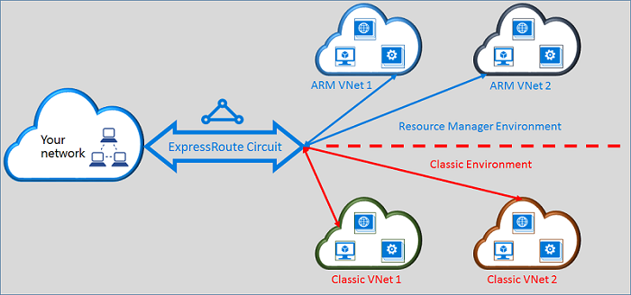

<properties
   pageTitle="将 ExpressRoute 线路从经典部署模型转移到 Resource Manager 部署模型 | Azure"
   description="本页概述桥接经典部署模型与 Resource Manager 部署模型时所要了解的知识。"
   documentationCenter="na"
   services="expressroute"
   authors="ganesr"
   manager="carmonm"
   editor=""/>
<tags
   ms.service="expressroute"
   ms.date="04/01/2016"
   wacn.date="05/16/2016"/>

# 将 ExpressRoute 线路从经典部署模型转移到 Resource Manager 部署模型

本文概述将 ExpressRoute 线路从经典部署模型转移到 Resource Manager 部署模型的效果。

[AZURE.INCLUDE [vpn-gateway-sm-rm](../includes/vpn-gateway-sm-rm-include.md)]

可以使用一条 ExpressRoute 线路连接到在经典部署模型和 Resource Manager 部署模型中部署的虚拟网络 (VNet)。无论 ExpressRoute 线路的创建方式为何，现在都可以链接到这两种部署模型中的虚拟网络。

## 在经典部署模型中创建的 ExpressRoute 线路

在经典部署模型中创建的 ExpressRoute 线路必须先转移到 Resource Manager 部署模型，才能连接到经典部署模型和 Resource Manager 部署模型。转移连接时，不会发生连接断开的情况。经典部署模型中的所有线路 VNet 链接（在同一订阅中和跨订阅）将会保留。成功完成转移后，ExpressRoute 线路的感观和执行方式与在 Resource Manager 部署模型中创建的 ExpressRoute 线路完全相同。现在你可以在 Resource Manager 部署模型中建立与虚拟网络的连接。

将 ExpressRoute 线路转移到 Resource Manager 部署模型后，只能使用 Resource Manager 部署模型来管理 ExpressRoute 线路的生命周期。这意味着，某些操作（例如，添加/更新/删除对等互连，更新带宽、SKU 和计费类型等线路属性，以及删除线路）只能在 Resource Manager 部署模型中执行。有关如何有关管理对这两种部署模型的访问权限的更多详细信息，请参阅下面有关在 Resource Manager 部署模型中创建的线路的部分。

不需要与连接提供商合作即可执行转移。

## 在 Resource Manager 部署模型中创建的 ExpressRoute 线路

你可以实现从这两种部署模型访问 Resource Manager 部署模型中创建的 ExpressRoute 线路。订阅中的任何 ExpressRoute 线路都可以从这两种部署模型访问。

- 默认情况下，在 Resource Manager 部署模型中创建的 ExpressRoute 线路无法访问经典部署模型。
- 默认情况下，无法从这两种部署模型访问从经典部署模型转移到 Resource Manager 部署模型的 ExpressRoute 线路。
- 无论是在 Resource Manager 部署模型还是经典部署模型中创建的，ExpressRoute 线路始终都可以访问 Resource Manager 部署模型。这意味着，你可以根据[如何链接虚拟网络](/documentation/articles/expressroute-howto-linkvnet-arm)中的说明，与 Resource Manager 部署模型中创建的虚拟网络建立连接。 
- 对经典部署模型的访问权限由 ExpressRoute 线路中的“allowClassicOperations”参数控制。 

>[AZURE.IMPORTANT] 将应用[服务限制](/documentation/articles/azure-subscription-service-limits)页中所述的所有配额。例如，标准线路最多可以有 10 个跨经典部署模型和 Resource Manager 部署模型的 VNet 链接/连接。

### 控制对经典部署模型的访问权限

设置 ExpressRoute 线路的“allowClassicOperations”参数，即可让单个 ExpressRoute 线路链接到这两种部署模型中的 VNet。

将“allowClassicOperations”设置为 TRUE 可从这两种部署模型中的 VNet 链接到 ExpressRoute 线路。可以遵循有关[如何链接经典部署模型中的虚拟网络](/documentation/articles/expressroute-howto-linkvnet-classic)的指导链接到经典部署模型中的 VNet。可以遵循有关[如何链接 Resource Manager 部署模型中的虚拟网络](/documentation/articles/expressroute-howto-linkvnet-arm)的指导，链接到 Resource Manager 部署模型中的 VNet。

将“allowClassicOperations”设置为 FALSE 会阻止从经典部署模型访问线路。但是，经典部署模型中的所有 VNet 链接将会保留。在此情况下，ExpressRoute 线路不会显示在经典部署模型中。

### 经典部署模型中支持的操作

当“allowClassicOperations”设置为 TRUE 时，ExpressRoute 线路支持以下经典操作。

 - 获取 ExpressRoute 线路信息
 - 创建/更新/获取/删除与经典 VNet 建立的 VNet 链接
 - 创建/更新/获取/删除跨订阅连接的 VNet 链接授权

当“allowClassicOperations”设置为 TRUE 时，无法执行以下经典操作。

 - 创建/更新/获取/删除 Azure 专用、Azure 公共互连
 - 删除 ExpressRoute 线路

## 经典模型与 Resource Manager 模型的通信

ExpressRoute 线路相当于经典部署模型与 Resource Manager 部署模型之间的桥梁。经典部署模型的 VNet 中部署的虚拟机与 Resource Manager 部署模型的 VNet 中部署的虚拟机之间的流量将流经 ExpressRoute，前提是这两个 VNet 链接到相同的 ExpressRoute 线路。聚合吞吐量受限于虚拟网络网关的吞吐容量。在这种情况下，流量不进入连接提供商或你的网络。VNet 之间的流量将完全包含在 Microsoft 网络中。

## 对 Azure 公共互连资源的访问权限

你可以继续访问通常可通过 Azure 公共互连访问的资源，而不会出现任何中断。

## 支持的操作

本部分介绍支持通过此功能执行的操作

 - 可以使用一条 ExpressRoute 线路访问经典部署模型和 Resource Manager 部署模型中部署的 VNet。
 - 可以将 ExpressRoute 线路从经典部署模型转移到 Resource Manager 部署模型。转移后，ExpressRoute 线路的感观和执行方式与在 Resource Manager 部署模型中创建的任何其他 ExpressRoute 线路相似。
 - 只能转移 ExpressRoute 线路。无法通过此操作转移线路链接、VNet 和 VPN 网关。
 - 将 ExpressRoute 线路转移到 Resource Manager 部署模型后，只能使用 Resource Manager 部署模型来管理 ExpressRoute 线路的生命周期。这意味着，某些操作（例如，添加/更新/删除对等互连，更新带宽、SKU 和计费类型等线路属性，以及删除线路）只能在 Resource Manager 部署模型中执行。
 - ExpressRoute 线路相当于经典部署模型与 Resource Manager 部署模型之间的桥梁。经典部署模型的 VNet 中部署的虚拟机与 Resource Manager 部署模型的 VNet 中部署的虚拟机之间的流量将流经 ExpressRoute，前提是这两个 VNet 链接到相同的 ExpressRoute 线路。 
 - 经典部署模型和 Resource Manager 部署模型中的跨订阅连接。

## 不支持的操作

本部分介绍不支持通过此功能执行的操作

 - 将线路链接、网关和虚拟网络从经典部署模型转移到 Resource Manager 部署模型。
 - 从经典部署模型管理 ExpressRoute 线路的生命周期。
 - 对经典部署模型的 RBAC 支持。无法对经典部署模型中的线路执行 RBAC 控制。订阅的任何管理员/共同管理员可以将 VNet 链接到线路/取消链接。

## 配置

请遵循 [将 ExpressRoute 线路从经典部署模型转移到 Resource Manager 部署模型](/documentation/articles/expressroute-howto-move-arm)中所述的说明。

## 后续步骤

- 有关工作流信息，请参阅 [ExpressRoute 线路预配工作流和线路状态](/documentation/articles/expressroute-workflows)。
- 配置 ExpressRoute 连接。

	- [创建 ExpressRoute 线路](/documentation/articles/expressroute-howto-circuit-arm)
	- [配置路由](/documentation/articles/expressroute-howto-routing-arm)
	- [将 VNet 链接到 ExpressRoute 线路](/documentation/articles/expressroute-howto-linkvnet-arm)

<!---HONumber=Mooncake_0509_2016-->