<properties 
	pageTitle="将 BI 工具与 HDInsight 上的 Apache Spark 配合使用 | Azure" 
	description="逐步说明如何在 Apache Spark 上使用笔记本，基于原始数据创建架构并将其保存为 Hive 表，然后使用 BI 工具分析 Hive 表中的数据" 
	services="hdinsight" 
	documentationCenter="" 
	authors="nitinme" 
	manager="paulettm" 
	editor="cgronlun"/>

<tags 
	ms.service="hdinsight" 
	ms.date="07/19/2015" 
	wacn.date="08/14/2015"/>

# 将 BI 工具与 Azure HDInsight 上的 Apache Spark 配合使用

了解如何使用 Azure HDInsight 中的 Apache Spark 来执行以下操作：

* 获取原始示例数据并将其保存为 Hive 表
* 使用 Power BI 与 Tableau 等 BI 工具来分析和可视化数据。

**先决条件：**

必须满足以下条件：

- Azure 订阅。 
- Apache Spark 群集。有关说明，请参阅[在 Azure HDInsight 中设置 Apache Spark 群集](/documentation/articles/hdinsight-apache-spark-provision-clusters)。
- 装有 Microsoft Spark ODBC 驱动程序的计算机。可从[此处](http://go.microsoft.com/fwlink/?LinkId=616229)安装该驱动程序。
- [Power BI](http://www.powerbi.com/) 或 [Tableau Desktop](http://www.tableau.com/products/desktop) 等 BI 工具。可以从 [http://www.powerbi.com/](http://www.powerbi.com/) 获取免费的 Power BI 预览版订阅。

##将原始数据保存为 Hive 表

在本部分，我们将使用与 HDInsight 中的 Apache Spark 群集关联的 [Jupyter](https://jupyter.org) 笔记本来运行用于处理原始示例数据并将其保存为 Hive 表的任务。示例数据是所有群集在默认情况下均会提供的 .csv 文件 (hvac.csv)。

将数据保存为 Hive 表之后，下一部分我们将使用 Power BI 和 Tableau 等 BI 工具来连接该 Hive 表。

1. 启动 Jupyter 笔记本。在 Azure 门户选择你的 Spark 群集，然后在底部的门户任务栏中单击“Jupyter 笔记本”。出现提示时，输入 Spark 群集的管理员凭据。

2. 创建新的笔记本。单击“新建”，然后单击“Python 2”。

	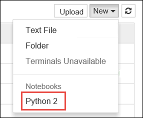

3. 新笔记本随即已创建，并以 Untitled.pynb 名称打开。在顶部单击笔记本名称，然后输入一个友好名称。

	

4. 导入所需的模块，然后创建 Spark 和 Hive 上下文。将以下代码段粘贴到空白单元格中，然后按 **SHIFT + ENTER**。

		from pyspark import SparkContext
		from pyspark.sql import *
		from pyspark.sql import HiveContext

		# Create Spark and Hive contexts
		sc = SparkContext('spark://headnodehost:7077', 'pyspark')
		hiveCtx = HiveContext(sc)

	每当你在 Jupyter 中运行作业时，Web 浏览器窗口标题中会显示“(繁忙)”状态以及笔记本标题。右上角 **Python 2** 文本的旁边还会出现一个实心圆。作业完成后，实心圆将变成空心圆。

	 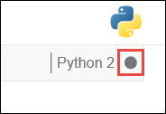

4. 将示例数据载入临时表。当你在 HDInsight 中设置 Spark 群集时，系统会将示例数据文件 **hvac.csv** 复制到 **\\HdiSamples\\SensorSampleData\\hvac** 下的关联存储帐户。

	将以下代码段粘贴到空白单元格中，然后按 **SHIFT + ENTER**。此代码段会将数据注册到名为 **hvac** 的 Hive 表。

		# Create an RDD from sample data
		hvacText = sc.textFile("wasb:///HdiSamples/SensorSampleData/hvac/HVAC.csv")
		
		# Parse the data and create a schema
		hvacParts = hvacText.map(lambda s: s.split(",")).filter(lambda s: s[0] != "Date")
		hvac = hvacParts.map(lambda p: {"Date": str(p[0]), "Time": str(p[1]), "TargetTemp": int(p[2]), "ActualTemp": int(p[3]), "BuildingID": int(p[6])})
		
		# Infer the schema and create a table		
		hvacTable = hiveCtx.inferSchema(hvac)
		hvacTable.registerAsTable("hvactemptable")
		hvacTable.saveAsTable("hvac")

5. 确认是否已成功创建表。将以下代码段粘贴到笔记本的空白单元格中，然后按 **SHIFT + ENTER**。

		hiveCtx.sql("SHOW TABLES").show()

	你应会看到如下所示的输出：

		tableName       isTemporary
		hvactemptable   true       
		hivesampletable false      
		hvac            false

	只有 **isTemporary** 列中包含 false 的表才是要存储在元存储中，并且可从 BI 工具访问的 Hive 表。在本教程中，我们将连接到刚刚创建的 **hvac** 表。

6. 确认表是否包含所需的数据。将以下代码段粘贴到笔记本的空白单元格中，然后按 **SHIFT + ENTER**。

		hiveCtx.sql("SELECT * FROM hvac LIMIT 10").show()
	
7. 现在可以通过重新启动内核来退出笔记本。在顶部菜单栏中，依次单击“内核”、“重新启动”，然后在出现提示时再次单击“重新启动”。

	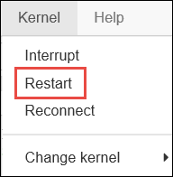

##使用 Power BI 分析 Hive 表中的数据

将数据保存为 Hive 表后，可以使用 Power BI 来连接数据并以可视化方式呈现，以便创建报告、仪表板等。

1. 登录到 [Power BI](http://www.powerbi.com/)。

2. 在“欢迎”屏幕中，单击“数据库和其他信息”。

	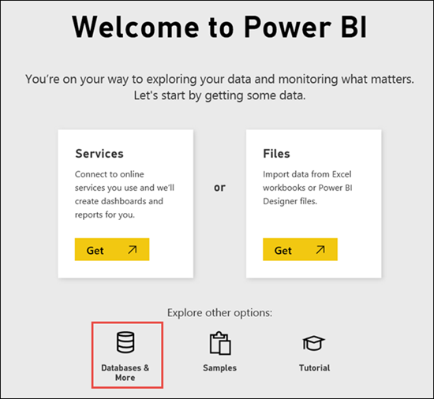

3. 在下一个屏幕中，单击“Spark”，然后单击“连接”。

4. 在 Azure HDInsight 页上的 Spark 中，提供用于连接 Spark 群集的值，然后单击“连接”。

	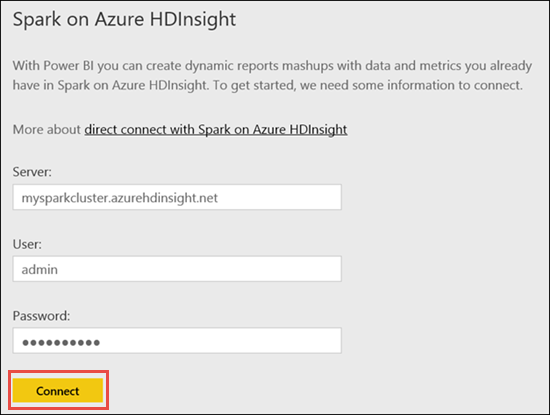

	建立连接后，Power BI 将开始从 HDInsight 上的 Spark 群集导入数据。

5. Power BI 导入数据并显示新的仪表板。新数据集还会添加到“数据集”标题的下面。单击仪表板中的 Spark 磁贴，打开一个工作表用于可视化数据。

	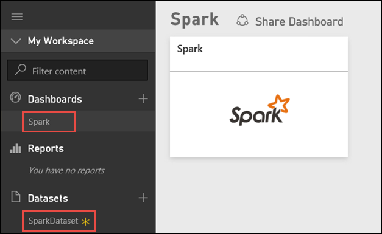

6. 请注意，右侧的“字段”列表列出了前面创建的 **hvac** 表。展开该表，以查看前面在笔记本的表中定义的字段。

	  

7. 生成视觉效果，以显示每栋建筑物的目标温度与实际温度之间的差异。为此，请拖放“轴”下面的“BuildingID”字段，以及“值”下面的“ActualTemp”/“**TargetTemp**”字段。

	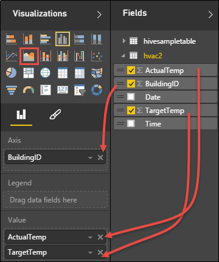

	此外，请选择“区域映射”（红色所示）以可视化数据。

8. 默认情况下，视觉效果会显示 **ActualTemp** 和 **TargetTemp** 的总和。对于这两个字段，从下拉列表中选择“平均”可以求出两栋建筑物的实际和目标温度的平均值。

	

9. 数据视觉效果应与下面类似。在视觉效果上移动光标可获取相关数据的工具提示。

	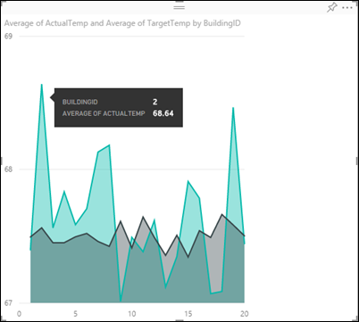

10. 在顶部菜单中，单击“保存”并提供报告名称。你还可以固定视觉效果。固定视觉效果时，系统会将它存储在仪表板上，让你直观地跟踪最新值。

	你可以针对同一个数据集添加任意数目的视觉效果，并将其固定在仪表板上，以获取数据快照。此外，HDInsight 上的 Spark 群集已直接连接到 Power BI。这意味着，Power BI 随时能够获取群集的最新信息，因此你不需要计划数据集的刷新。

##使用 Tableau Desktop 分析 Hive 表中的数据
	
1. 启动 Tableau Desktop。在左窗格中，从要连接到的服务器列表中单击“Spark SQL”。

2. 在 Spark SQL 连接对话框中，按照下图所示提供值，然后单击“确定”。

	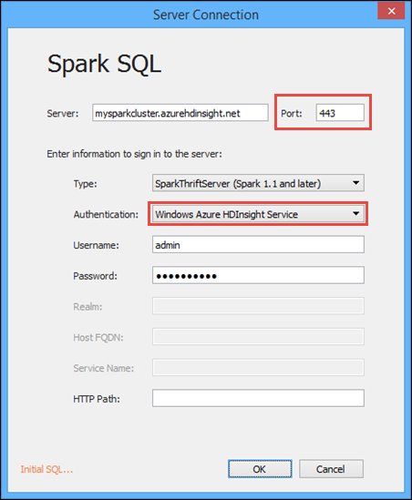

	仅当你已在计算机上安装了 [Microsoft Spark ODBC 驱动程序](http://go.microsoft.com/fwlink/?LinkId=616229)时，身份验证下拉列表才将“Microsoft Azure HDInsight 服务”列作一个选项。

3. 在下一个屏幕上，从“架构”下拉列表中单击“查找”图标，然后单击“默认”。

	

4. 对于“表”字段，请再次单击“查找”图标以列出群集中的所有 Hive 表。你应会看到以前使用笔记本创建的 **hvac** 表。

	

5. 将表拖放到右侧顶部的框中。Tableau 将导入数据，并以红色框突出显示架构。

	

6. 单击左下角的“工作表 1”选项卡。针对每个日期生成一种视觉效果，用于显示所有建筑物的目标温度和实际温度平均值。将“日期”和“建筑物 ID”拖到“列”，将“实际温度”/“目标温度”拖到“行”。在“标记”下面选择“区域”，以使用区域映射视觉效果。

	 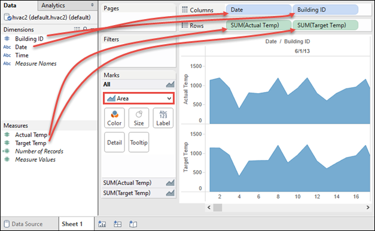

7. 默认情况下，温度字段显示为聚合值。如果你想要改为显示平均温度，可以从下拉列表中执行该操作，如下所示。

	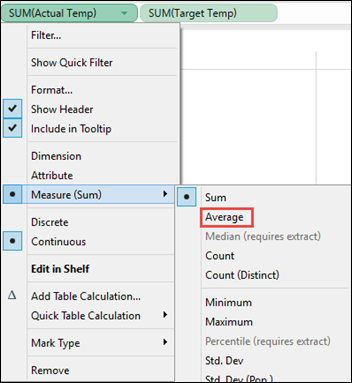

8. 你也可以将一个温度映射叠加在另一个温度映射之上，以更好地感受目标温度和实际温度之间的差异。将鼠标移到下方区域映射的角落，直到上方出现以红色圆圈突出显示的控点形状为止。将该映射拖到另一映射的顶部。看到以红色矩形突出显示的形状时松开鼠标。

	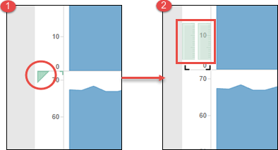

	 数据视觉效果应发生如下所示的更改：

	
	 
9. 单击“保存”以保存工作表。你可以创建仪表板，并在其中添加一个或多个工作表。

##另请参阅

* [概述：Azure HDInsight 上的 Apache Spark](/documentation/articles/hdinsight-apache-spark-overview)
* [快速入门：在 HDInsight 上设置 Apache Spark 并使用 Spark SQL 运行交互式查询](/documentation/articles/hdinsight-apache-spark-zeppelin-notebook-jupyter-spark-sql)
* [使用 HDInsight 中的 Spark 生成机器学习应用程序](/documentation/articles/hdinsight-apache-spark-ipython-notebook-machine-learning)
* [使用 HDInsight 中的 Spark 生成实时流式处理应用程序](/documentation/articles/hdinsight-apache-spark-csharp-apache-zeppelin-eventhub-streaming)
* [管理 Azure HDInsight 中 Apache Spark 群集的资源](/documentation/articles/hdinsight-apache-spark-resource-manager)

[hdinsight-versions]: /documentation/articles/hdinsight-component-versioning
[hdinsight-upload-data]: /documentation/articles/hdinsight-upload-data
[hdinsight-storage]: /documentation/articles/hdinsight-use-blob-storage
[azure-purchase-options]: http://www.windowsazure.cn/pricing/overview/
[azure-trial]: http://www.windowsazure.cn/pricing/1rmb-trial/
[azure-management-portal]: https://manage.windowsazure.cn/
[azure-create-storageaccount]: /documentation/articles/storage-create-storage-account
<!---HONumber=66-->