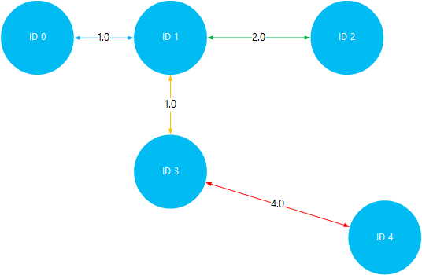

<properties title="How to use Giraph with HDInsight" pageTitle="了解如何将 Apache Giraph 与 Azure HDInsight (Hadoop) 配合使用 | Azure" description="Learn how to use Apache Giraph to perform graph processing with Azure HDInsight" metaKeywords="Azure HDInsight Apache Giraph, hdinsight giraph, hdinsight graph, hadoop giraph, azure hadoop, hadoop graph" services="hdinsight" solutions="big-data" documentationCenter="" authors="larryfr" videoId="" scriptId="" />

<tags 
wacn.date="04/11/2015"
ms.service="hdinsight" ms.workload="big-data" ms.tgt_pltfrm="na" ms.devlang="na" ms.topic="article" ms.date="08/14/2014" ms.author="larryfr"></tags>

## 了解如何将 Apache Giraph 与 Azure HDInsight (Hadoop) 配合使用

[Apache Giraph][giraph] 可让你使用 Hadoop 执行图形处理，并可以在 Azure HDInsight 上使用。

图形可为对象之间的关系建模，例如，为大型网络（例如 Internet）上的路由器之间的连接建模，或者为社交网络上的人物之间的关系建模（有时称为社交图形）。通过图形处理，你可以推导出图形中对象之间的关系，例如：

-   根据当前的关系识别潜在的朋友

-   识别网络中两台计算机之间的最短路由

-   计算网页的排名

## 本文内容

-   [生成 Apache Giraph 并将其部署到 HDInsight 群集](#build)

-   [运行 SimpleShortestPathsComputation 示例](#run)

    有关 Giraph 随附的其他示例的列表，请参阅 [Package org.apache.giraph.examples](https://giraph.apache.org/apidocs/org/apache/giraph/examples/package-summary.html)。

-   [排查你可能会遇到的问题](#tshoot)

## 要求

-   Azure HDInsight 群集版本 3.0 或 3.1

-   [Git](http://git-scm.com/)

-   Java 1.6

-   [Maven](http://maven.apache.org/) 3 或更高版本

## </a>生成并部署 Giraph

Giraph 未作为 HDInsight 群集的一部分提供，因此必须从源生成。可以在 [Giraph 存储库](https://github.com/apache/giraph)中找到有关如何生成 Giraph 的详细信息。

1.  目前 (7-14-2014)，Giraph 需要安装一个修补程序才能与 HDInsight 使用的 WASB 文件存储配合工作。该修补程序已提交到 Apache Giraph 项目，但尚未获得批准。请从 [GIRAPH-930](https://issues.apache.org/jira/browse/GIRAPH-930) 的“附件”部分下载该修补程序，并将它作为 **giraph-930.diff** 保存到本地驱动器。

2.  在命令行中，使用以下 Git 命令创建 Giraph 存储库的克隆。

        git clone https://github.com/apache/giraph.git

3.  将目录切换到步骤 2 的克隆操作所创建的 **giraph** 目录。

        cd giraph

4.  使用以下命令将修补程序合并到本地存储库中。

        git apply giraph-930.diff

    将 **giraph-930.diff** 替换为你在步骤 1 中创建的文件的路径。

5.  使用下列命令之一为你的 HDInsight 群集版本生成 Giraph。

    -   对于 **HDInsight 3.0** (Hadoop 2.2)

            mvn package -Phadoop_0.20.203 - DskipTests

    -   对于 **HDInsight 3.1** (Hadoop 2.4)

            mvn package -Phadoop_0.23 -DskipTests

    完成生成操作后，**\\giraph\\giraph-examples\\target** 中会出现示例 JAR 文件。

6.  使用 [Azure PowerShell][aps] 和 [HDInsight-Tools][tools] 将该示例 JAR 文件上载到 HDInsight 群集的主存储。

        Add-HDInsightFile giraph-examples-1.1.0-SNAPSHOT-for-hadoop-0.23.1-jar-with-dependencies.jar example/jars/giraph.jar clustername

    将 **giraph-examples-1.1.0-SNAPSHOT-for-hadoop-0.23.1-jar-with-dependencies.jar** 替换为你在前一步骤生成的 JAR 文件的路径和名称，并将 **clustername** 替换为 HDInsight 群集的名称。例如，如果你使用 `-Phadoop_0.20.203` 参数生成了包，则 JAR 的文件名将包含 **hadoop-0.20.203**。

    完成该命令后，JAR 文件即已上载到 wasb:///example/jars/giraph.jar。

    > [WACOM.NOTE] 有关可用于将文件上载到 HDInsight 的实用工具列表，请参阅[在 HDInsight 中上载 Hadoop 作业的数据](/zh-cn/documentation/articles/hdinsight-upload-data/)。

## </a>运行示例

SimpleShortestPathsComputation 演示了有关查找图形中对象之间最短路径的基本 [Pregel](http://people.apache.org/~edwardyoon/documents/pregel.pdf) 实现。请执行以下步骤，以上载示例数据，使用 SimpleShortestPathsComputation 示例运行作业，然后查看结果。

> [WACOM.NOTE] [GitHub 存储库](https://github.com/apache/giraph/tree/release-1.1)的 [release-1.1 分库](https://github.com/apache/giraph)中提供了此示例和其他示例的源代码。

1.  创建名为 **tiny\_graph.txt** 的新文件。该文件应包含以下行。

        [0,0,[[1,1],[3,3]]]
        [1,0,[[0,1],[2,2],[3,1]]]
        [2,0,[[1,2],[4,4]]]
        [3,0,[[0,3],[1,1],[4,4]]]
        [4,0,[[3,4],[2,4]]]

    此数据使用以下格式描述[定向图形][]中对象之间的关系：`[source_id,source_value,[[dest_id], [edge_value],...]]`. 每行代表一个 **source\_id** 对象与一个或多个 **dest\_id** 对象之间的关系。**edge\_value**（或权重）可被视为 **source\_id** 与 **dest\_id** 之间的连接的强度或距离。

    使用表示对象间距离的值（或权重）绘制图形后，上述数据可能与下面类似。

    

2.  使用 [Azure PowerShell][aps] 和 [HDInsight-Tools][tools] 将 **tiny\_graph.txt** 文件上载到 HDInsight 群集的主存储。

        Add-HDInsightFile tiny_graph.txt example/data/tiny_graph.txt clustername

    将群集名称替换为你的 HDInsight 群集的名称。

3.  将 **tiny\_graph.txt** 文件用作输入，使用以下 PowerShell 运行 **SimpleShortstPathsComputation** 示例。这要求你事先安装并配置 [Azure PowerShell][aps]。

        $clusterName = "clustername"
        # Giraph examples JAR
        $jarFile = "wasb:///example/jars/giraph.jar"
        # Arguments for this job
        $jobArguments = "org.apache.giraph.examples.SimpleShortestPathsComputation", `
                        "-ca", "mapred.job.tracker=headnodehost:9010", `
                        "-vif", "org.apache.giraph.io.formats.JsonLongDoubleFloatDoubleVertexInputFormat", `
                        "-vip", "wasb:///example/data/tinygraph.txt", `
                        "-vof", "org.apache.giraph.io.formats.IdWithValueTextOutputFormat", `
                        "-op",  "wasb:///example/output/shortestpaths", `
                        "-w", "2"
        # Create the definition
        $jobDefinition = New-AzureHDInsightMapReduceJobDefinition `
          -JarFile $jarFile `
          -ClassName "org.apache.giraph.GiraphRunner" `
          -Arguments $jobArguments

        # Run the job, write output to the PowerShell window
        $job = Start-AzureHDInsightJob -Cluster $clusterName -JobDefinition $jobDefinition
        Write-Host "Wait for the job to complete ..." -ForegroundColor Green
        Wait-AzureHDInsightJob -Job $job
        Write-Host "STDERR"
        Get-AzureHDInsightJobOutput -Cluster $clusterName -JobId $job.JobId -StandardError
        Write-Host "Display the standard output ..." -ForegroundColor Green
        Get-AzureHDInsightJobOutput -Cluster $clusterName -JobId $job.JobId -StandardOutput

    在上面的示例中，请将 **clustername** 替换为 HDInsight 群集的名称。

### 查看结果

完成该作业后，结果将以 **part-m-\#\#\#\#\#** 文件形式存储在 **wasb:///example/out/shotestpaths** 文件夹中。使用 [Azure PowerShell][aps] 和 [HDInsight-Tools][tools] 下载输出文件。

    Find-HDInsightFile example/output/shortestpaths/part* clustername | foreach-object { Get-HDInsightFile $_.name .  itsfullofstorage }
    Cat example/output/shortestpaths/part*

这将在当前目录中创建 **example/output/shortestpaths** 目录结构，并下载以 **part** 开头的文件。然后，**Cat** cmdlet 将显示文件的内容，看上去应该与下面类似。

    0   1.0
    4   5.0
    2   2.0
    1   0.0
    3   1.0

SimpleShortestPathComputation 示例硬编码为从对象 ID 1 开始查找与其他对象间的最短路径。因此，输出应显示为 `destination_id distance`，其中，distance 为对象 ID 1 与目标 ID 的边缘之间的行程值（或权重）。

在可视化此数据的情况下，你可以通过体验 ID 1 与所有其他对象之间的最短路径来验证结果。请注意，ID 1 与 ID 4 之间的最短路径为 5。这是从 ID 1 到 ID 3，然后再从 ID 3 到 ID 4 的总距离。

## </a>故障排除

### 输出目录已存在

Giraph 作业在运行时将创建指定的输出目录。如果该目录已存在，则会出现错误，指示输出目录已存在。

如果你想要多次运行某个作业，则必须删除作业之间的输出目录，或者为每个作业指定一个不同的输出目录。

### </a>使用 Hadoop 命令行

尽管本文演示了如何通过 PowerShell 运行 Giraph 作业，但你也可以使用 Hadoop 命令行运行该作业。

> [WACOM.NOTE] 仅当使用远程桌面连接到 HDInsight 群集时，才可以使用 Hadoop 命令行。
>
> 与 HDInsight 群集等 Azure 计算资源建立的远程桌面会话只能从基于 Windows 的远程桌面客户端运行。

若要连接到 HDInsight 群集，请执行以下步骤：

1.  使用 [Azure 管理门户](https://manage.windowsazure.cn)选择你的 HDInsight 群集，然后选择“配置”。

2.  在页的底部，选择“启用远程”并提供用户名、密码和远程桌面连接的过期日期。

3.  处理启用远程桌面的请求后，页的底部将显示一个新的“连接”条目。选择此条目可以下载远程桌面会话的 .RDP 文件。

4.  可以保存该 .RDP 文件，或者将它立即打开以启动远程桌面客户端。在连接过程中，系统将要求你提供你在启用远程桌面连接时使用的用户名和密码。

5.  建立连接后，请使用桌面上的“Hadoop 命令行”图标来启动 Hadoop 命令行。

6.  以下示例演示了如何将 **giraph.jar** 文件复制到群集头节点，然后使用 Hadoop 命令行运行作业。

        hadoop fs -copyToLocal wasb:///example/jar/giraph.jar
        hadoop jar giraph.jar org.apache.giraph.GiraphRunner org.apache.giraph.examples.SimpleShortestPathsComputation -ca "mapred.job.tracker=headnodehost:9010" -vif org.apache.giraph.io.formats.JsonLongDoubleFloatDoubleVertexInputFormat -vip wasb:///example/data/tinygraph.txt -vof org.apache.giraph.io.formats.IdWithValueTextOutputFormat -op wasb:///example/output/shortestpaths -w 2

### 旧版 HDInsight

如果要在旧版 HDInsight 上使用 Giraph，则必须针对该版本支持的特定 Hadoop 版本编译 Giraph。请参阅 [HDInsight 群集版本中的新增功能](/zh-cn/documentation/articles/hdinsight-component-versioning/)，以确定与你的 HDInsight 版本对应的 Hadoop 版本。

此外，旧版 HDInsight 可能要求你从 Hadoop 命令行运行 Giraph 作业。如果在从 PowerShell 运行作业时收到错误，请尝试从 [Hadoop 命令行](#cmd)运行该作业。

## 后续步骤

了解如何将 Giraph 与 HDInsight 配合使用后，请尝试将 [Pig][] 和 [Hive][] 与 HDInsight 配合使用。

  [Apache Giraph]: http://giraph.apache.org
  [生成 Apache Giraph 并将其部署到 HDInsight 群集]: #build
  [运行 SimpleShortestPathsComputation 示例]: #run
  [Package org.apache.giraph.examples]: https://giraph.apache.org/apidocs/org/apache/giraph/examples/package-summary.html
  [排查你可能会遇到的问题]: #tshoot
  [Git]: http://git-scm.com/
  [Maven]: http://maven.apache.org/
  [Giraph 存储库]: https://github.com/apache/giraph
  [GIRAPH-930]: https://issues.apache.org/jira/browse/GIRAPH-930
  [Azure PowerShell]: /zh-cn/documentation/articles/install-configure-powershell/
  [HDInsight-Tools]: https://github.com/Blackmist/hdinsight-tools
  [在 HDInsight 中上载 Hadoop 作业的数据]: /zh-cn/documentation/articles/hdinsight-upload-data/
  [Pregel]: http://people.apache.org/~edwardyoon/documents/pregel.pdf
  [release-1.1 分库]: https://github.com/apache/giraph/tree/release-1.1
  [定向图形]: http://en.wikipedia.org/wiki/Directed_graph
  [tiny\_graph.txt 中的对象绘制为圆圈，线条表示对象之间的不同距离]: ./media/hdinsight-giraph/giraph-graph.png
  [将对象绘制为圆圈，并绘制对象之间的最短路径]: ./media/hdinsight-giraph/giraph-graph-out.png
  [Azure 管理门户]: https://manage.windowsazure.cn
  [HDInsight 群集版本中的新增功能]: /zh-cn/documentation/articles/hdinsight-component-versioning/
  [Hadoop 命令行]: #cmd
  [Pig]: /zh-cn/documentation/articles/hdinsight-use-pig/
  [Hive]: /zh-cn/documentation/articles/hdinsight-use-hive/

  [giraph]: http://giraph.apache.org
[tools]: https://github.com/Blackmist/hdinsight-tools
[aps]: /zh-cn/documentation/articles/install-configure-powershell/
