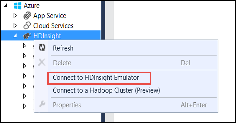
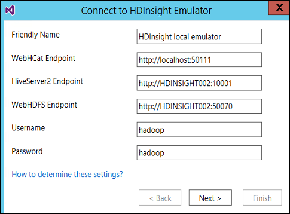
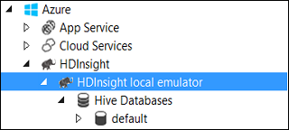

<properties
	pageTitle="HDInsight 的 Hadoop Emulator 入门 | Windows Azure"
	description="使用安装的模拟器，参考 MapReduce 教程和其他示例来了解 Hadoop 生态系统。HDInsight Emulator 的工作原理类似于 Hadoop 沙盒。"
	keywords="emulator,hadoop ecosystem,hadoop sandbox,mapreduce tutorial"
	editor="cgronlun"
	manager="paulettm"
	services="hdinsight"
	authors="nitinme"
	documentationCenter=""/>

<tags
	ms.service="hdinsight"
	ms.date="11/29/2015"
	wacn.date="01/14/2015"/>
# 使用 HDInsight Emulator（一个 Hadoop 沙盒）开始了解 Hadoop 生态系统

本指南指导你开始使用 Microsoft HDInsight Emulator for Azure（以前称作 HDInsight Server 开发者预览版）中的 Hadoop 群集。HDInsight Emulator 附带来自 Hadoop 生态系统的与 Azure HDInsight 相同的组件。有关详细信息（包括与部署的版本有关的信息），请参阅 [Azure HDInsight 包含哪个版本的 Hadoop？](/documentation/articles/hdinsight-component-versioning)。

安装该模拟器后，遵照 MapReduce 教程进行单词计数，然后运行示例。

> [AZURE.NOTE]HDInsight Emulator 只包括一个 Hadoop 群集。它不包括 HBase 或 Storm。

HDInsight Emulator 提供非常类似于 Hadoop 沙盒的本地开发环境。如果你对 Hadoop 比较熟悉，则可以开始通过 Hadoop 分布式文件系统 (HDFS) 使用 HDInsight Emulator。在 HDInsight 中，默认文件系统是 Azure Blob 存储。因此，最终你将需要使用 Azure Blob 存储开发你的作业。若要将 Azure Blob 存储与 HDInsight Emulator 配合使用，你必须对模拟器的配置进行更改。

> [AZURE.NOTE]HDInsight Emulator 只能使用单节点部署。

## 先决条件
在开始阅读本教程前，你必须具有：

- HDInsight Emulator 需要 64 位版本的 Windows。必须满足以下要求之一：

	- Windows 7 Service Pack 1
	- Windows Server 2008 R2 Service Pack 1
	- Windows 8
	- Windows Server 2012

- 安装和配置 Azure PowerShell。有关说明，请参阅[安装和配置 Azure PowerShell](/documentation/articles/powershell-install-configure)。

##安装 HDInsight Emulator

Microsoft HDInsight Emulator 可通过 Microsoft Web 平台安装程序进行安装。

> [AZURE.NOTE]HDInsight Emulator 目前只支持英语操作系统。如果你已安装该模拟器的先前版本，则必须先从“控制面板/程序和功能”中卸载以下两个组件，然后安装最新版本的模拟器：<ul> <li>Microsoft HDInsight Emulator for Azure 或 HDInsight 开发者预览版（无论安装了哪一个）</li> <li>Hortonworks 数据平台</li> </ul>

**安装 HDInsight Emulator**

1. 打开 Internet Explorer，然后浏览到 [Microsoft HDInsight Emulator for Azure 安装页][hdinsight-emulator-install]。
2. 单击“立即安装”。
3. 在页面底部提示安装 HDINSIGHT.exe 时单击“运行”。
4. 在弹出的“用户帐户控制”窗口中单击“是”按钮，以便完成安装。此时将显示“Web 平台安装程序”窗口。
6. 单击页面底部的“安装”。
7. 单击“我接受”同意许可条款。
8. 确认 Web 平台安装程序显示“已成功安装以下产品”，然后单击“完成”。
9. 单击“退出”以关闭“Web 平台安装程序”窗口。

**验证 HDInsight Emulator 安装**

该安装应该已经在你的桌面上安装了三个图标。这三个图标按如下所示进行链接：

- **Hadoop 命令行** - 在 HDInsight Emulator 中从其运行 MapReduce、Pig 和 Hive 作业的 Hadoop 命令提示符。

- **Hadoop 名称节点状态** - NameNode 对于 HDFS 中的所有文件维持基于树的目录。它还跟踪 Hadoop 群集中所有文件的数据位置。客户端与 NameNode 进行通信，以便确定将所有文件的数据节点存储于何处。

- **Hadoop Yarn 状态** - 将 MapReduce 任务分配给群集中的节点的作业跟踪器。

该安装应该还安装了若干本地服务。下面是“服务”窗口的屏幕快照：

![模拟器窗口中列出的 Hadoop 生态系统服务。][image-hdi-emulator-services]

默认情况下，不会启动与 HDInsight Emulator 相关的服务。若要启动这些服务，请在 Hadoop 命令行中，在 \\hdp（默认位置）下运行 **start\_local\_hdp\_services.cmd**。若要在重新启动计算机后自动启动这些服务，请运行 **set-onebox-autostart.cmd**。

有关安装和运行 HDInsight Emulator 的已知问题，请参阅 [HDInsight Emulator 发行说明](/documentation/articles/hdinsight-emulator-release-notes)。安装日志位于 **C:\HadoopFeaturePackSetup\HadoopFeaturePackSetupTools\gettingStarted.winpkg.install.log**。

##在 Emulator 中使用 HDInsight Tools for Visual Studio

你可以使用 HDInsight Tools for Visual Studio 连接到 HDInsight Emulator。有关如何在 Azure 上对 HDInsight 群集使用 Visual Studio 工具的信息，请参阅 [HDInsight Hadoop Tools for Visual Studio 入门](/documentation/articles/hdinsight-hadoop-visual-studio-tools-get-started)。

### 安装 Emulator 的 HDInsight 工具

有关如何安装 HDInsight Visual Studio 工具的说明，请单击[此处](/documentation/articles/hdinsight-hadoop-visual-studio-tools-get-started#installation)。

### 连接到 HDInsight Emulator

1. 打开 Visual Studio。
2. 在“视图”菜单中，单击“服务器资源管理器”，以打开“服务器资源管理器”窗口。
3. 展开“Azure”，右键单击“HDInsight”，然后单击“连接到 HDInsight Emulator”。

	 

4. 在“连接到 HDInsight Emulator”对话框中，检查 WebHCat、HiveServer2 和 WebHDFS 终结点的值，然后单击“下一步”。如果你没有对 Emulator 的默认配置进行任何更改，则使用默认填充的值即可。如果你做了任何更改，请更新对话框中的值，然后单击“下一步”。

	

5. 成功建立连接后，单击“完成”。现在，你应会在服务器资源管理器中看到“HDInsight Emulator”。

	

成功建立连接后，可以在 Emulator 中使用 HDInsight VS 工具，就像在 Azure HDInsight 群集中使用这些工具一样。有关如何在 Azure HDInsight 群集中使用 VS 工具的说明，请参阅[使用 HDInsight Hadoop Tools for Visual Studio](/documentation/articles/hdinsight-hadoop-visual-studio-tools-get-started)。

## 故障排除：将 HDInsight 工具连接到 HDInsight Emulator

1. 在连接到 HDInsight Emulator 时，即使对话框中显示 HiveServer2 已成功连接，你也必须将 Hive 配置文件（路径为 C:\\hdp\\hive-*version*\\conf\\hive-site.xml）中的 **hive.security.authorization.enabled 属性**手动设置为 **false**，然后重新启动本地 Emulator。仅当你在预览表的前 100 行时，HDInsight Tools for Visual Studio 才会连接到 HiveServer2。如果不打算使用此类查询，可将 Hive 配置保留原样。

2. 如果你在运行 HDInsight Emulator 的计算机上使用动态 IP 分配 (DHCP)，则可能需要更新 C:\\hdp\\hadoop-*version*\\etc\\hadoop\\core-site.xml，并将 **hadoop.proxyuser.hadoop.hosts** 属性的值更改为 (*)。这样，Hadoop 用户便可以从所有主机进行连接，以模拟你在 Visual Studio 中输入的用户。

		<property>
			<name>hadoop.proxyuser.hadoop.hosts</name>
			<value>*</value>
		</property>

3. 当 Visual Studio 尝试连接到 WebHCat 服务时，你可能会收到错误（错误: 找不到作业 job\_XXXX\_0001）。在这种情况下，必须重新启动 WebHCat 服务并重试。若要重新启动 WebHCat 服务，请启动“服务”MMC，右键单击“Apache Hadoop Templeton”（这是 WebHCat 服务的旧名称），然后单击“重新启动”。

##单词计数 MapReduce 教程

现在你已在工作站上配置了 HDInsight Emulator，接下来，请试着学习此 MapReduce 教程来测试安装。首先，请将一些文本文件上载到 HDFS，然后运行单词计数 MapReduce 作业以便计算特定单词在这些文件中出现的频率。

单词计数 MapReduce 程序已打包到 *hadoop-mapreduce-examples-2.4.0.2.1.3.0-1981.jar* 中。该 jar 文件位于 *C:\\hdp\\hadoop-2.4.0.2.1.3.0-1981\\share\\hadoop\\mapreduce* 文件夹中。

用于单词计数的 MapReduce 作业采用两个参数：

- 一个输入文件夹。你将使用 *hdfs://localhost/user/HDIUser* 作为输入文件夹。
- 一个输出文件夹。你将使用 *hdfs://localhost/user/HDIUser/WordCount_Output* 作为输出文件夹。输出文件夹不能是现有文件夹，否则 MapReduce 作业将失败。如果要第二次运行 MapReduce 作业，则必须指定一个不同的输出文件夹，或删除现有的输出文件夹。

**运行单词计数 MapReduce 作业**

1. 从桌面双击“Hadoop 命令行”以打开 Hadoop 命令行窗口。当前文件夹应为：

		c:\hdp\hadoop-2.4.0.2.1.3.0-1981

	如果不是，请运行以下命令：

		cd %hadoop_home%

2. 运行以下 Hadoop 命令以使 HDFS 文件夹对输入和输出文件进行排序：

		hadoop fs -mkdir /user
		hadoop fs -mkdir /user/HDIUser

3. 运行以下 Hadoop 命令以便将某些本地文本文件复制到 HDFS：

		hadoop fs -copyFromLocal C:\hdp\hadoop-2.4.0.2.1.3.0-1981\share\doc\hadoop\common*.txt /user/HDIUser

4. 运行以下命令以便列出 /user/HDIUser 文件夹中的文件：

		hadoop fs -ls /user/HDIUser

	你应该看到以下文件：

		C:\hdp\hadoop-2.4.0.2.1.3.0-1981>hadoop fs -ls /user/HDIUser
		Found 4 items
		-rw-r--r--   1 username hdfs     574261 2014-09-08 12:56 /user/HDIUser/CHANGES.txt
		-rw-r--r--   1 username hdfs      15748 2014-09-08 12:56 /user/HDIUser/LICENSE.txt
		-rw-r--r--   1 username hdfs        103 2014-09-08 12:56 /user/HDIUser/NOTICE.txt
		-rw-r--r--   1 username hdfs       1397 2014-09-08 12:56 /user/HDIUser/README.txt

5. 运行以下命令来运行单词计数 MapReduce 作业：

		C:\hdp\hadoop-2.4.0.2.1.3.0-1981>hadoop jar C:\hdp\hadoop-2.4.0.2.1.3.0-1981\share\hadoop\mapreduce\hadoop-mapreduce-examples-2.4.0.2.1.3.0-1981.jar wordcount /user/HDIUser/*.txt /user/HDIUser/WordCount_Output

6. 运行以下命令以便从输出文件中列出其中含有“windows”的单词数：

		hadoop fs -cat /user/HDIUser/WordCount_Output/part-r-00000 | findstr "windows"

	输出应该是：

		C:\hdp\hadoop-2.4.0.2.1.3.0-1981>hadoop fs -cat /user/HDIUser/WordCount_Output/part-r-00000 | findstr "windows"
		windows 4
		windows.        2
		windows/cygwin. 1

有关 Hadoop 命令的详细信息，请参阅 [Hadoop 命令参考][hadoop-commands-manual]。

##分析示例 web 日志数据

HDInsight Emulator 安装提供了一些示例，以便用户能够在 Windows 上开始学习基于 Apache Hadoop 的服务。这些示例涉及在处理大型数据集时通常需要的一些任务。这些示例是根据上述 MapReduce 教程制作的，可帮助你熟悉与 MapReduce 编程模型及其生态系统。

示例数据是围绕处理 IIS 万维网联盟 (W3C) 日志数据进行组织的。提供数据生成工具以便创建不同大小的数据集并将这些数据集导入到 HDFS 或 Azure Blob 存储中。（有关详细信息，请参阅[将 Azure Blob 存储用于 HDInsight](/documentation/articles/hdinsight-hadoop-use-blob-storage)）。然后，可以在 Azure PowerShell 脚本生成的数据页上运行 MapReduce、Pig 或 Hive 作业。使用的 Pig 和 Hive 脚本是基于 MapReduce 的抽象层，最终都会编译成 MapReduce 程序。你可以运行一系列作业，以便观察使用这些不同技术的影响以及数据大小对执行这些处理任务的影响。

### 本节内容

- [IIS W3C 日志数据方案](#scenarios)
- [加载示例 W3C 日志数据](#loaddata)
- [运行 Java MapReduce 作业](#javamapreduce)
- [运行 Hive 作业](#hive)
- [运行 Pig 作业](#pig)

###IIS W3C 日志数据方案

W3C 方案生成以下三种大小的 IIS W3C 日志数据并将这些数据导入到 HDFS 或 Azure Blob 存储中：1MB（小）、500MB（中）和 2GB（大）。它提供三种作业类型并且分别在 C#、Java、Pig 和 Hive 中实现它们。

- **totalhits** - 计算针对某一给定页的请求总数。
- **avgtime** - 计算每页某一请求所用的平均时间（单位为秒）。
- **errors** - 计算对于其状态为 404 或 500 的请求，每页、每小时的错误数。

这些示例及其文档并未提供针对关键 Hadoop 技术的深入研究或完整实现。使用的群集只具有单个节点，因此对于此版本，无法观察添加多个节点的影响。

###加载示例 W3C 日志数据

通过 Azure PowerShell 脚本 importdata.ps1 实现生成数据并且将数据导入到 HDFS。

**导入示例 W3C 日志数据**

1. 从桌面打开 Hadoop 命令行。
2. 将目录切换到 **C:\\hdp\\GettingStarted**。
3. 运行以下命令以生成数据并且将数据导入到 HDFS：

		powershell -File importdata.ps1 w3c -ExecutionPolicy unrestricted

	如果要改为将数据导入到 Azure Blob 存储，请参阅[连接到 Azure Blob 存储](#blobstorage)。

4. 从 Hadoop 命令行运行以下命令以便列出 HDFS 上导入的文件：

		hadoop fs -ls -R /w3c

	输出应如下所示：

		C:\hdp\GettingStarted>hadoop fs -ls -R /w3c
		drwxr-xr-x   - username hdfs          0 2014-09-08 15:40 /w3c/input
		drwxr-xr-x   - username hdfs          0 2014-09-08 15:41 /w3c/input/large
		-rw-r--r--   1 username hdfs  543683503 2014-09-08 15:41 /w3c/input/large/data_w3c_large.txt
		drwxr-xr-x   - username hdfs          0 2014-09-08 15:40 /w3c/input/medium
		-rw-r--r--   1 username hdfs  272435159 2014-09-08 15:40 /w3c/input/medium/data_w3c_medium.txt
		drwxr-xr-x   - username hdfs          0 2014-09-08 15:39 /w3c/input/small
		-rw-r--r--   1 username hdfs    1058423 2014-09-08 15:39 /w3c/input/small/data_w3c_small.txt

5. 如果你要验证文件内容，请运行以下命令，以在控制台窗口中显示一个数据文件：

		hadoop fs -cat /w3c/input/small/data_w3c_small.txt

现在，你已创建数据文件并已将其导入到 HDFS。你可以开始运行其他 Hadoop 作业。

###运行 Java MapReduce 作业

MapReduce 是针对 Hadoop 的基本计算引擎。默认情况下，它是在 Java 中实现的，但也有利用采用 C# 的 .NET 和 Hadoop Streaming 的示例。运行 MapReduce 作业的语法是：

	hadoop jar <jarFileName>.jar <className> <inputFiles> <outputFolder>

jar 文件和源文件位于 C:\\Hadoop\\GettingStarted\\Java 文件夹中。

**运行 MapReduce 作业以便计算网页点击数**

1. 打开 Hadoop 命令行。
2. 将目录切换到 **C:\\hdp\\GettingStarted**。
3. 运行以下命令以便在该文件夹存在时删除输出目录。如果输出文件夹已存在，该 MapReduce 作业将失败。

		hadoop fs -rm -r /w3c/output

3. 运行以下命令：

		hadoop jar .\Java\w3c_scenarios.jar "microsoft.hadoop.w3c.TotalHitsForPage" "/w3c/input/small/data_w3c_small.txt" "/w3c/output"

	下表介绍了该命令的元素：<table border="1"> <tr><td>参数</td><td>备注</td></tr> <tr><td>w3c\_scenarios.jar</td><td>该 jar 文件位于 C:\\hdp\\GettingStarted\\Java 文件夹中。</td></tr> <tr><td>microsoft.hadoop.w3c.TotalHitsForPage</td><td>可使用以下项之一替代该类型：<ul> <li>microsoft.hadoop.w3c.AverageTimeTaken</li> <li>microsoft.hadoop.w3c.ErrorsByPage</li> </ul></td></tr> <tr><td>/w3c/input/small/data\_w3c\_small.txt</td><td>可使用以下项之一替代该输入文件：<ul> <li>/w3c/input/medium/data\_w3c\_medium.txt</li> <li>/w3c/input/large/data\_w3c\_large.txt</li> </ul></td></tr> <tr><td>/w3c/output</td><td>这是输出文件夹名称。</td></tr> </table>

4. 运行以下命令以显示输出文件：

		hadoop fs -cat /w3c/output/part-00000

	输出应如下所示：

		c:\Hadoop\GettingStarted>hadoop fs -cat /w3c/output/part-00000
		/Default.aspx   3380
		/Info.aspx      1135
		/UserService    1126

	Default.aspx 页得到了 3360 次点击，依此类推。尝试根据上表中的建议替换值并再次运行这些命令，然后观察输出如何根据作业类型和数据大小发生变化。

### 运行 Hive 作业
精通结构化查询语言 (SQL) 的分析人士对于 Hive 查询引擎可能感到很熟悉。它提供与 SQL 类似的界面以及用于 HDFS 的关系数据模型。Hive 使用一种称作 HiveQL 的语言，这与 SQL 十分类似。Hive 在基于 Java 的 MapReduce 框架上提供了一个抽象层，Hive 查询在运行时将编译成 MapReduce。

**运行 Hive 作业**

1. 打开 Hadoop 命令行。
2. 将目录切换到 **C:\\hdp\\GettingStarted**。
3. 运行以下命令以便在 **/w3c/hive/input** 文件夹存在时删除该文件夹。如果该文件夹存在，则 hive 作业将失败。

		hadoop fs -rmr /w3c/hive/input

4. 运行以下命令以便创建 **/w3c/hive/input** 文件夹，然后将数据文件复制到 /hive/input：

        hadoop fs -mkdir /w3c/hive
		hadoop fs -mkdir /w3c/hive/input

		hadoop fs -cp /w3c/input/small/data_w3c_small.txt /w3c/hive/input

5. 运行以下命令以执行 **w3ccreate.hql** 脚本文件。该脚本将创建一个 Hive 表，并且将数据导入到该 Hive 表中：

	> [AZURE.NOTE]在此阶段，你也可以使用 HDInsight Visual Studio 工具来运行 Hive 查询。打开 Visual Studio，创建一个新项目，然后从 HDInsight 模板中选择“Hive 应用程序”。打开该项目后，将查询添加为新项。该查询位于 **C:/hdp/GettingStarted/Hive/w3c** 中。将查询添加到项目后，将 **${hiveconf:input}** 替换为 **/w3c/hive/input**，然后按“提交”。

		C:\hdp\hive-0.13.0.2.1.3.0-1981\bin\hive.cmd -f ./Hive/w3c/w3ccreate.hql -hiveconf "input=/w3c/hive/input/data_w3c_small.txt"

	输出将如下所示：

		Logging initialized using configuration in file:/C:/hdp/hive-0.13.0.2.1.3.0-1981	/conf/hive-log4j.properties
		OK
		Time taken: 1.137 seconds
		OK
		Time taken: 4.403 seconds
		Loading data to table default.w3c
		Moved: 'hdfs://HDINSIGHT02:8020/hive/warehouse/w3c' to trash at: hdfs://HDINSIGHT02:8020/user/<username>/.Trash/Current
		Table default.w3c stats: [numFiles=1, numRows=0, totalSize=1058423, rawDataSize=0]
		OK
		Time taken: 2.881 seconds

6. 运行以下命令以便运行 **w3ctotalhitsbypage.hql** HiveQL 脚本文件：

	> [AZURE.NOTE]如前所述，你也可以使用 HDInsight Visual Studio 工具运行此查询。

        C:\hdp\hive-0.13.0.2.1.3.0-1981\bin\hive.cmd -f ./Hive/w3c/w3ctotalhitsbypage.hql

	下表描述了该命令的元素：<table border="1"> <tr><td>文件</td><td>说明</td></tr> <tr><td>C:\\hdp\\hive-0.13.0.2.1.3.0-1981\\bin\\hive.cmd</td><td>Hive 命令脚本。</td></tr> <tr><td>C:\\hdp\\GettingStarted\\Hive\\w3c\\w3ctotalhitsbypage.hql</td><td> 你可以使用以下文件之一替代该 Hive 脚本文件：<ul> <li>C:\\hdp\\GettingStarted\\Hive\\w3c\\w3caveragetimetaken.hql</li> <li>C:\\hdp\\GettingStarted\\Hive\\w3c\\w3cerrorsbypage.hql</li> </ul> </td></tr>

	</table>

	w3ctotalhitsbypage.hql HiveQL 脚本是：

		SELECT filtered.cs_uri_stem,COUNT(*)
		FROM (
		  SELECT logdate,cs_uri_stem from w3c WHERE logdate NOT RLIKE '.*#.*'
		) filtered
		GROUP BY (filtered.cs_uri_stem);

	输出的末尾将如下所示：

		MapReduce Total cumulative CPU time: 5 seconds 391 msec
		Ended Job = job_1410201800143_0008
		MapReduce Jobs Launched:
		Job 0: Map: 1  Reduce: 1   Cumulative CPU: 5.391 sec   HDFS Read: 1058638 HDFS Write: 53 SUCCESS
		Total MapReduce CPU Time Spent: 5 seconds 391 msec
		OK
		/Default.aspx   3380
		/Info.aspx      1135
		/UserService    1126
		Time taken: 49.304 seconds, Fetched: 3 row(s)

请注意，作为每个作业的第一步，将创建一个表并将之前创建的文件中的数据加载到该表中。你可以通过使用以下命令查看 HDFS 中的 /Hive 节点，浏览已创建的文件：

	hadoop fs -lsr /apps/hive/

### 运行 Pig 作业

Pig 处理使用称作 *Pig Latin* 的数据流语言。Pig Latin 抽象提供了比 MapReduce 更丰富的数据结构，并为 Hadoop 执行 SQL 对关系数据库管理系统执行的操作。

**运行 pig 作业**

1. 打开 Hadoop 命令行。
2. 将目录切换为 **C:\\hdp\\GettingStarted** 文件夹。
3. 运行以下命令来提交 Pig 作业：

		C:\hdp\pig-0.12.1.2.1.3.0-1981\bin\pig.cmd -f ".\Pig\w3c\TotalHitsForPage.pig" -p "input=/w3c/input/small/data_w3c_small.txt"

	下表显示了该命令的元素：
	<table border="1">
	<tr><td>文件</td><td>说明</td></tr>
	<tr><td>C:\\hdp\\pig-0.12.1.2.1.3.0-1981\\bin\\pig.cmd</td><td>Pig 命令脚本。</td></tr>
	<tr><td>C:\\hdp\\GettingStarted\\Pig\\w3c\\TotalHitsForPage.pig</td><td>你可以使用以下文件之一替代该 Pig Latin 脚本文件：
	<ul>
	<li>C:\\hdp\\GettingStarted\\Pig\\w3c\\AverageTimeTaken.pig</li>
	<li>C:\\hdp\\GettingStarted\\Pig\\w3c\\ErrorsByPage.pig</li>
	</ul>
	</td></tr>
	<tr><td>/w3c/input/small/data\_w3c\_small.txt</td><td>你可以使用更大的文件替换该参数：

	<ul>
	<li>/w3c/input/medium/data_w3c_medium.txt</li>
	<li>/w3c/input/large/data_w3c_large.txt</li>
	</ul></td></tr> </table>

	输出应如下所示：

		(/Info.aspx,1135)
		(/UserService,1126)
		(/Default.aspx,3380)

请注意，因为 Pig 脚本编译到 MapReduce 作业，并且可能会编译到多个此类作业，所以，你在处理 Pig 作业的过程中可能会看到多个 MapReduce 作业正在执行。

<!---
### Rebuild the samples
The samples currently contain all the required binaries, so building is not required. If you'd like to make changes to the Java or .NET samples, you can rebuild them by using either the Microsoft Build Engine (MSBuild) or the included Azure PowerShell script.

**To rebuild the samples**

1. Open a Hadoop command line.
2. Run the following command:

		powershell -F buildsamples.ps1
--->

##连接到 Azure Blob 存储
HDInsight Emulator 使用 HDFS 作为默认文件系统。但是，Azure HDInsight 使用 Azure Blob 存储作为默认文件系统。可以将 HDInsight Emulator 配置为使用 Azure Blob 存储而不是本地存储。遵照以下说明在 Azure 中创建存储容器，然后将它连接到 HDInsight Emulator。

>[AZURE.NOTE]有关 HDInsight 如何使用 Azure Blob 存储的详细信息，请参阅[将 Azure Blob 存储与 HDInsight 配合使用](/documentation/articles/hdinsight-hadoop-use-blob-storage)。

在开始遵照下面的说明之前，你必须创建存储帐户。有关说明，请参阅[如何创建存储帐户](/documentation/articles/storage-create-storage-account)。

**创建容器**

1. 登录到 [Azure 门户][azure-management-portal]。
2. 单击左侧的“存储”。此时将显示订阅下的存储帐户列表。
3. 单击要从该列表创建容器的存储帐户。
4. 单击页面顶部的“容器”。
5. 单击页面底部的“添加”。
6. 输入“名称”并选择“访问”。你可以使用三种访问级别中的任何一种。默认级别为“私有”。
7. 单击“确定”以保存更改。现在，门户上会列出新的容器。

必须先将帐户名称和帐户密钥添加到配置文件，然后才能访问 Azure 存储帐户。

**配置与 Azure 存储帐户的连接**

1. 在记事本中打开 **C:\\hdp\\hadoop-2.4.0.2.1.3.0-1981\\etc\\hadoop\\core-site.xml**。
2. 将以下 <property> 标记添加到其他 <property> 标记旁：

		<property>
		    <name>fs.azure.account.key.<StorageAccountName>.blob.core.chinacloudapi.cn</name>
		    <value><StorageAccountKey></value>
		</property>

	你必须使用与你的存储帐户信息匹配的值替代 <StorageAccountName> 和 <StorageAccountKey>。

3. 保存更改。你无需重新启动 Hadoop 服务。

使用以下语法可访问该存储帐户：

	wasb://<ContainerName>@<StorageAccountName>.blob.core.chinacloudapi.cn/

例如：

	hadoop fs -ls wasb://myContainer@myStorage.blob.core.chinacloudapi.cn/

##运行 Azure PowerShell
HDInsight Emulator 也支持某些 Azure PowerShell cmdlet。这些 cmdlet 包括：

- HDInsight 作业定义 cmdlet

	- New-AzureHDInsightSqoopJobDefinition
	- New-AzureHDInsightStreamingMapReduceJobDefinition
	- New-AzureHDInsightPigJobDefinition
	- New-AzureHDInsightHiveJobDefinition
	- New-AzureHDInsightMapReduceJobDefinition
	- Start-AzureHDInsightJob
	- Get-AzureHDInsightJob
	- Wait-AzureHDInsightJob

下面是用于提交 Hadoop 作业的示例：

	$creds = Get-Credential (hadoop as username, password can be anything)
	$hdinsightJob = <JobDefinition>
	Start-AzureHDInsightJob -Cluster http://localhost:50111 -Credential $creds -JobDefinition $hdinsightJob

在调用 Get-Credential 时系统将会向你显示一个提示。你必须将 **hadoop** 用作用户名。密码可以是任意字符串。群集名称始终是 **http://localhost:50111**。

有关提交 Hadoop 作业的详细信息，请参阅[以编程方式提交 Hadoop 作业](/documentation/articles/hdinsight-submit-hadoop-jobs-programmatically)。有关适用于 HDInsight 的 Azure Powershell cmdlet 的详细信息，请参阅 [HDInsight cmdlet 参考][hdinsight-powershell-reference]。

##删除 HDInsight Emulator
在安装模拟器的计算机上打开控制面板，然后在“程序”下面单击“卸载程序”。从已安装程序的列表中，右键单击“Microsoft HDInsight Emulator for Azure”，然后单击“卸载”。

##后续步骤
在本 MapReduce 教程中，你安装了 HDInsight Emulator - 一个 Hadoop 沙盒 - 并运行了一些 Hadoop 作业。若要了解更多信息，请参阅下列文章：

- [Azure HDInsight 入门](/documentation/articles/hdinsight-hadoop-tutorial-get-started-windows-v1)
- [为 HDInsight 开发 Java MapReduce 程序](/documentation/articles/hdinsight-develop-deploy-java-mapreduce)
- [为 HDInsight 开发 C# Hadoop 流式处理 MapReduce 程序](/documentation/articles/hdinsight-hadoop-develop-deploy-streaming-jobs)
- [HDInsight Emulator 发行说明](/documentation/articles/hdinsight-emulator-release-notes)
- [讨论 HDInsight 的 MSDN 论坛](https://social.msdn.microsoft.com/Forums/zh-cn/home)

[azure-sdk]: /downloads/
[azure-create-storage-account]: /documentation/articles/storage-create-storage-account
[azure-management-portal]: https://manage.windowsazure.cn/
[netstat-url]: http://technet.microsoft.com/zh-cn/library/ff961504.aspx

[hdinsight-develop-mapreduce]: /documentation/articles/hdinsight-develop-deploy-java-mapreduce
[hdinsight-emulator-install]: http://www.microsoft.com/web/gallery/install.aspx?appid=HDINSIGHT
[hdinsight-emulator-release-notes]: /documentation/articles/hdinsight-emulator-release-notes
[hdinsight-storage]: /documentation/articles/hdinsight-hadoop-use-blob-storage
[hdinsight-submit-jobs]: /documentation/articles/hdinsight-submit-hadoop-jobs-programmatically
[hdinsight-powershell-reference]: http://msdn.microsoft.com/zh-cn/library/azure/dn479228.aspx
[hdinsight-get-started]: /documentation/articles/hdinsight-get-started
[hdinsight-develop-deploy-streaming]: /documentation/articles/hdinsight-hadoop-develop-deploy-streaming-jobs
[hdinsight-versions]: /documentation/articles/hdinsight-component-versioning
[Powershell-install-configure]: /documentation/articles/powershell-install-configure

[hadoop-commands-manual]: http://hadoop.apache.org/docs/r1.1.1/commands_manual.html

[image-hdi-emulator-services]: ./media/hdinsight-hadoop-emulator-get-started/HDI.Emulator.Services.png

<!---HONumber=74-->