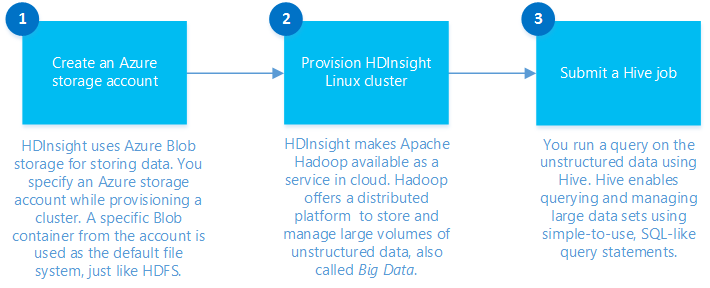
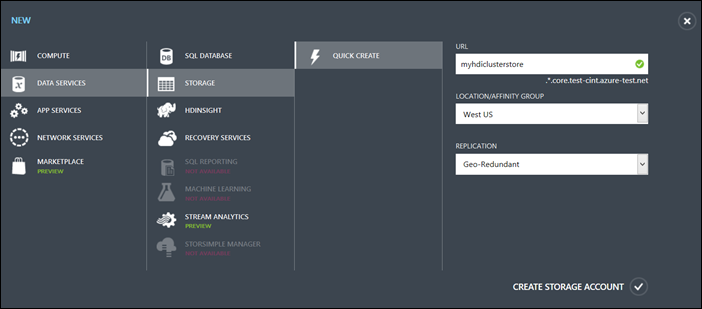
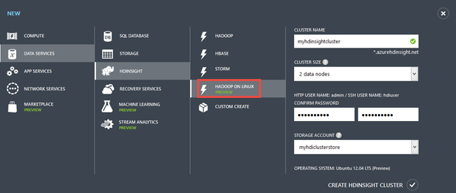
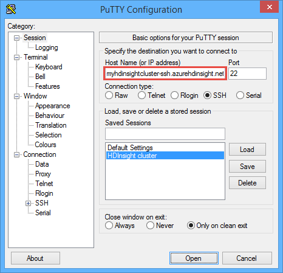

<properties
   pageTitle="Linux 教程：Hadoop 和 Hive 入门 | Microsoft Azure"
   description="遵循本 Linux 教程开始使用 HDInsight 中的 Hadoop。了解如何设置 Linux 群集，以及如何使用 Hive 查询数据。"
   services="hdinsight"
   documentationCenter=""
   authors="nitinme"
   manager="paulettm"
   editor="cgronlun"/>

<tags
   ms.service="hdinsight"
   wacn.date="06/26/2015"
   ms.date="03/13/2015"/> 

# Hadoop 教程：在 Linux 上的 HDInsight 中开始将 Hadoop 与 Hive 配合使用（预览版）

> [AZURE.SELECTOR]
- [Windows](hdinsight-hadoop-tutorial-get-started-windows)
- [Linux](hdinsight-hadoop-linux-tutorial-get-started)

本 Hadoop 教程演示如何在 Linux 上设置 Hadoop 群集并运行 Hive 查询以从非结构化数据中提取有意义的信息，让你快速地在 Linux 上开始使用 Azure HDInsight。

> [AZURE.NOTE]如果你不熟悉 Hadoop 和大数据，则可以了解有关 <a href="http://go.microsoft.com/fwlink/?LinkId=510084" target="_blank">Apache Hadoop</a>、<a href="http://go.microsoft.com/fwlink/?LinkId=510086" target="_blank">MapReduce</a>、<a href="http://go.microsoft.com/fwlink/?LinkId=510087" target="_blank">Hadoop 分布式文件系统 (HDFS)</a> 和 <a href="http://go.microsoft.com/fwlink/?LinkId=510085" target="_blank">Hive</a> 术语的详细信息。若要了解 HDInsight 如何在 Azure 中启用 Hadoop，请参阅 [HDInsight 中的 Hadoop 简介](hdinsight-hadoop-introduction)。

## 本教程的目标是什么？ ##

假设你具有一个大型非结构化数据集，想要对其运行查询以提取一些有意义的信息。下面说明了如何实现此目标：

   

## 先决条件

在开始学习这篇针对 Hadoop 的 Linux 教程之前，你必须具有：

- Azure 订阅。有关获得订阅的详细信息，请参阅<a href="/pricing/overview/" target="_blank">购买选项</a><a href="/pricing/1rmb-trial/" target="_blank">试用版</a>。

**估计完成时间：**30 分钟

## 本教程的内容

* [创建 Azure 存储帐户](#storage)
* [设置 HDInsight Linux 群集](#provision)
* [在群集上提交 Hive 作业](#hivequery)
* [后续步骤](#nextsteps)

## 创建 Azure 存储帐户

HDInsight 使用 Azure Blob 存储来存储数据。有关详细信息，请参阅[将 Azure Blob 存储与 HDInsight 配合使用](hdinsight-use-blob-storage)。

你设置 HDInsight 群集时，指定 Azure 存储帐户。将该帐户的一个特定 Blob 存储容器指定为默认文件系统，如同在 HDFS 中一样。默认情况下，在与你指定的存储帐户相同的数据中心内设置 HDInsight 群集。

除了此存储帐户，你可以在自定义配置 HDInsight 群集时添加其他存储帐户。这些其他存储帐户可以来自相同的 Azure 订阅，也可以来自不同的 Azure 订阅。有关说明，请参阅[使用自定义选项设置 HDInsight Linux 群集](hdinsight-hadoop-provision-linux-clusters)。

若要简化此教程，仅使用默认的 Blob 容器和存储帐户。事实上，数据文件通常存储在指定的存储帐户中。

**创建 Azure 存储帐户**

1. 登录到 <a href="https://manage.windowsazure.cn/" target="_blank">Azure 门户</a>。
2. 单击左下角的“新建”，依次指向“数据服务”和“存储”，然后单击“快速创建”。

	

3. 输入“URL”、“位置”和“复制”的信息，然后单击“创建存储帐户”。不支持地缘组。你将在存储列表中看到新的存储帐户。

	>[AZURE.NOTE]用于设置 HDInsight Linux 群集（例如我们在本教程中使用的群集）的“快速创建”选项，不要求你在设置该群集时提供位置。默认情况下，它与该群集共存于存储帐户所在的数据中心内。因此，确保在群集支持的位置中创建存储帐户，这些位置包括：“中国东部”、“中国北部”。

4. 等到新存储帐户的“状态”更改为“联机”。
5. 从列表中选择新的存储帐户，然后单击该页底部的“管理访问密钥”。
7. 记下“存储帐户名称”和“主访问密钥”（或“辅助访问密钥”；任一密钥都起作用）的信息。本教程后面的步骤中将会用到它们。

有关详细信息，请参阅[如何创建存储帐户](storage-create-storage-account)和[将 Azure Blob 存储与 HDInsight 配合使用](hdinsight-use-blob-storage)。

## 在 Linux 上设置 HDInsight 群集

当你设置 HDInsight 群集时，便设置了包含 Hadoop 和相关应用程序的 Azure 计算资源。在本部分中，你将使用“快速创建”选项在 Linux 上设置 HDInsight 群集。此选项使用默认用户名和 Azure 存储容器，并为群集配置 HDInsight 版本 3.2（Hadoop 版本 2.6、Hortonworks 数据平台版本 2.2），它基于 Ubuntu 12.04 长期支持 (LTS) 运行。有关不同 HDInsight 版本及其服务级别协议的信息，请参阅 [HDInsight 组件版本控制](hdinsight-component-versioning)页。

>[AZURE.NOTE]你还可以创建运行 Windows Server 操作系统的 Hadoop 群集。有关说明，请参阅 [HDInsight 入门](hdinsight-get-started)。

**设置 HDInsight 群集**

1. 登录到 <a href="https://manage.windowsazure.cn/" target="_blank">Azure 门户</a>。

2. 单击左下方的“新建”，然后依次单击“数据服务”、“HDINSIGHT”和“LINUX 上的 HADOOP”。

	

4. 输入或选择下列值：

	<table border="1">
	<tr><th>Name</th><th>值</th></tr>
	<tr><td>群集名称</td><td>群集的名称。</td></tr>
	<tr><td>群集大小</td><td>要部署的数据节点的数目。默认值为 4。但是，下拉菜单还提供了使用 1 或 2 个数据节点的选项。可以使用“自定义创建”选项指定任意数量的群集节点<strong></strong>。提供了有关各种群集大小的计帐费率的定价详细信息。单击下拉框正上方的 <strong>?</strong> 符号，并在弹出窗口中单击相应链接。</td></tr>
	<tr><td>密码</td><td><i>HTTP</i> 帐户（默认用户名：admin）和 <i>SSH</i> 帐户（默认用户名：hdiuser）的密码。请注意，这些不是在其上设置群集的虚拟机的管理员帐户。</td></tr>
	
	<tr><td>存储帐户</td><td>从下拉框中选择你创建的存储帐户。 
	
	存储帐户一经选定，就无法进行更改。如果删除了存储帐户，则群集将不再可供使用。HDInsight 群集共存于存储帐户所在的数据中心内。
	</td></tr>
	</table>保留群集名称的副本。本教程后面的步骤中将会用到它。

5. 单击“创建 HDINSIGHT 群集”。在设置完成后，状态栏将显示“正在运行”。

	>[AZURE.NOTE]以上过程将通过使用默认 SSH 用户名和 Azure 存储容器的“快速创建”选项创建 Linux 群集。若要使用自定义选项创建群集，例如使用 SSH 密钥进行身份验证或使用其他存储帐户，请参阅[使用自定义选项设置 HDInsight Linux 群集](hdinsight-hadoop-provision-linux-clusters)。

## 在群集上提交 Hive 作业
既然你已设置 HDInsight Linux 群集，下一步就是运行示例 Hive 作业，以查询 HDInsight 群集随附的示例数据 (sample.log)。示例数据包含日志信息，其中包括跟踪、警告、信息和错误。我们通过查询此数据来检索包含特定严重性的所有错误日志。你必须执行以下步骤，以对 HDInsight Linux 群集运行 Hive 查询：

- 连接到 Linux 群集
- 运行 Hive 作业

### 连接到群集

你可以通过使用 SSH 从 Linux 计算机或基于 Windows 的计算机连接到 Linux 上的 HDInsight 群集。

**从 Linux 计算机连接**

1. 打开终端并输入以下命令：

		ssh <username>@<clustername>-ssh.azurehdinsight.cn

	由于群集是使用“快速创建”选项设置的，因此，默认的 SSH 用户名是 **hdiuser**。因此，命令必须为：

		ssh hdiuser@myhdinsightcluster-ssh.azurehdinsight.cn

2. 出现提示时，输入你在设置群集时所提供的密码。成功连接后，提示将更改为：

		hdiuser@headnode-0:~$

**从基于 Windows 的计算机连接**

1. 下载基于 Windows 的客户端的 <a href="http://www.chiark.greenend.org.uk/~sgtatham/putty/download.html" target="_blank">PuTTY</a>。

2. 打开 PuTTY。在“类别”中，单击“会话”。在“PuTTY 会话的基本选项”屏幕中，将 HDInsight 服务器的 SSH 地址输入到“主机名(或 IP 地址)”字段中。SSH 地址是群集名称，后接“-ssh.azurehdinsight.cn”。例如 **myhdinsightcluster-ssh.azurehdinsight.cn**。

	

3. 若要保存连接信息以供将来使用，请在“保存的会话”下方输入此连接的名称，然后单击“保存”。该连接将会添加到已保存会话的列表中。

4. 单击“打开”以连接到群集。当系统提示输入用户名时，输入 **hdiuser**。对于密码，输入你在设置群集时指定的密码。成功连接后，提示将更改为：

		hdiuser@headnode-0:~$

### 运行 Hive 作业

通过 SSH 连接到群集后，使用以下命令来运行 Hive 查询。

1. 在提示符处使用以下命令，启动 Hive 命令行界面 (CLI)：

		hive

2. 通过 CLI，输入以下语句，以使用群集上已经可用的示例数据创建名为 **log4jLogs** 的新表：

		DROP TABLE log4jLogs;
		CREATE EXTERNAL TABLE log4jLogs(t1 string, t2 string, t3 string, t4 string, t5 string, t6 string, t7 string)
		ROW FORMAT DELIMITED FIELDS TERMINATED BY ' '
		STORED AS TEXTFILE LOCATION 'wasb:///example/data/';
		SELECT t4 AS sev, COUNT(*) AS cnt FROM log4jLogs WHERE t4 = '[ERROR]' GROUP BY t4;

	这些语句将执行以下操作：

	- **DROP TABLE** - 删除表和数据文件（如果该表已存在）。
	- **CREATE EXTERNAL TABLE** - 在 Hive 中创建新的外部表。外部表仅在 Hive 中存储表定义；数据会保留在原始位置。
	- **ROW FORMAT** - 告知 Hive 如何设置数据的格式。在此情况下，每个日志中的字段以空格分隔。
	- **STORED AS TEXTFILE LOCATION** - 让 Hive 知道数据的存储位置（example/data 目录），并且数据已存储为文本。
	- **SELECT** - 选择第 t4 列包含值 [ERROR] 的所有行的计数。

	>[AZURE.NOTE]外部表应在你希望通过外部源（例如自动化数据上载过程）或另一个 MapReduce 操作更新基础数据时使用，但是，你始终希望 Hive 查询使用最新数据。删除外部表*不会*删除数据，只会删除表定义。

	这将返回以下输出：

		Query ID = hdiuser_20150116000202_cceb9c6b-4356-4931-b9a7-2c373ebba493
		Total jobs = 1
		Launching Job 1 out of 1
		Number of reduce tasks not specified. Estimated from input data size: 1
		In order to change the average load for a reducer (in bytes):
		  set hive.exec.reducers.bytes.per.reducer=<number>
		In order to limit the maximum number of reducers:
		  set hive.exec.reducers.max=<number>
		In order to set a constant number of reducers:
		  set mapreduce.job.reduces=<number>
		Starting Job = job_1421200049012_0006, Tracking URL = <URL>:8088/proxy/application_1421200049012_0006/
		Kill Command = /usr/hdp/2.2.1.0-2165/hadoop/bin/hadoop job  -kill job_1421200049012_0006
		Hadoop job information for Stage-1: number of mappers: 1; number of reducers: 1
		2015-01-16 00:02:40,823 Stage-1 map = 0%,  reduce = 0%
		2015-01-16 00:02:55,488 Stage-1 map = 100%,  reduce = 0%, Cumulative CPU 3.32 sec
		2015-01-16 00:03:05,298 Stage-1 map = 100%,  reduce = 100%, Cumulative CPU 5.62 sec
		MapReduce Total cumulative CPU time: 5 seconds 620 msec
		Ended Job = job_1421200049012_0006
		MapReduce Jobs Launched:
		Stage-Stage-1: Map: 1  Reduce: 1   Cumulative CPU: 5.62 sec   HDFS Read: 0 HDFS Write: 0 SUCCESS
		Total MapReduce CPU Time Spent: 5 seconds 620 msec
		OK
		[ERROR]    3
		Time taken: 60.991 seconds, Fetched: 1 row(s)

	请注意，输出包含 **[ERROR] 3**，因为有三个行包含此值。

3. 使用以下语句创建名为 **errorLogs** 的新内部表：

		CREATE TABLE IF NOT EXISTS errorLogs (t1 string, t2 string, t3 string, t4 string, t5 string, t6 string, t7 string) STORED AS ORC;
		INSERT OVERWRITE TABLE errorLogs SELECT t1, t2, t3, t4, t5, t6, t7 FROM log4jLogs WHERE t4 = '[ERROR]';

	这些语句将执行以下操作：

	- **CREATE TABLE IF NOT EXISTS** - 创建表（如果该表尚不存在）。由于未使用 **EXTERNAL** 关键字，因此这是一个“内部”表，它存储在 Hive 数据仓库中并完全受 Hive 的管理。与外部表不同，删除内部表会同时删除基础数据。
	- **STORED AS ORC** - 以优化行纵栏表 (ORC) 格式存储数据。这是高度优化且有效的 Hive 数据存储格式。
	- **INSERT OVERWRITE ...SELECT** - 从包含 [ERROR] 的 **log4jLogs** 表中选择行，然后将数据插入 **errorLogs** 表中。

4. 若要验证是否只有在第 t4 列中包含 [ERROR] 的行才存储到 **errorLogs** 表，请使用以下语句从 **errorLogs** 返回所有行：

		SELECT * from errorLogs;

	以下输出应显示在控制台上：

		2012-02-03	18:35:34	SampleClass0	[ERROR]	 incorrect		id
		2012-02-03	18:55:54	SampleClass1	[ERROR]	 incorrect		id
		2012-02-03	19:25:27	SampleClass4	[ERROR]	 incorrect		id
		Time taken: 0.987 seconds, Fetched: 3 row(s)

	返回的数据应该全都对应于 [ERROR] 日志。

## 后续步骤
在本 Linux 教程中，你已学习如何使用 HDInsight 在 Linux 上设置 Hadoop 群集，以及如何通过 SSH 对其运行 Hive 查询。若要了解更多信息，请参阅下列文章：

- [使用自定义选项在 Linux 上设置 HDInsight](hdinsight-hadoop-provision-linux-clusters)
- [在 Linux 上使用 HDInsight](hdinsight-hadoop-linux-information)
- [使用 Ambari 管理 HDInsight 群集](hdinsight-hadoop-manage-ambari)
- [将 MapReduce 与 HDInsight 配合使用][hdinsight-use-mapreduce]
- [将 Hive 与 HDInsight 配合使用][hdinsight-use-hive]
- [将 Pig 与 HDInsight 配合使用][hdinsight-use-pig]
- [将 Azure Blob 存储与 HDInsight 配合使用](hdinsight-use-blob-storage)
- [将数据上载到 HDInsight][hdinsight-upload-data]

[1]: hdinsight-hadoop-visual-studio-tools-get-started

[hdinsight-provision]: hdinsight-provision-clusters
[hdinsight-admin-powershell]: hdinsight-administer-use-powershell
[hdinsight-upload-data]: hdinsight-upload-data
[hdinsight-use-mapreduce]: hdinsight-use-mapreduce
[hdinsight-use-hive]: hdinsight-use-hive
[hdinsight-use-pig]: hdinsight-use-pig

[powershell-download]: http://go.microsoft.com/fwlink/p/?linkid=320376&clcid=0x409
[powershell-install-configure]: install-configure-powershell
[powershell-open]: install-configure-powershell#Install

[img-hdi-dashboard]: ./media/hdinsight-hadoop-tutorial-get-started-windows/HDI.dashboard.png
[img-hdi-dashboard-query-select]: ./media/hdinsight-hadoop-tutorial-get-started-windows/HDI.dashboard.query.select.png
[img-hdi-dashboard-query-select-result]: ./media/hdinsight-hadoop-tutorial-get-started-windows/HDI.dashboard.query.select.result.png
[img-hdi-dashboard-query-select-result-output]: ./media/hdinsight-hadoop-tutorial-get-started-windows/HDI.dashboard.query.select.result.output.png
[img-hdi-dashboard-query-browse-output]: ./media/hdinsight-hadoop-tutorial-get-started-windows/HDI.dashboard.query.browse.output.png
[image-hdi-clusterstatus]: ./media/hdinsight-hadoop-tutorial-get-started-windows/HDI.ClusterStatus.png
[image-hdi-gettingstarted-powerquery-importdata]: ./media/hdinsight-hadoop-tutorial-get-started-windows/HDI.GettingStarted.PowerQuery.ImportData.png
[image-hdi-gettingstarted-powerquery-importdata2]: ./media/hdinsight-hadoop-tutorial-get-started-windows/HDI.GettingStarted.PowerQuery.ImportData2.png

<!---HONumber=61-->