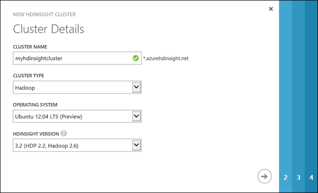
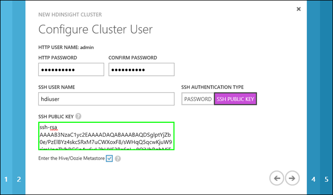
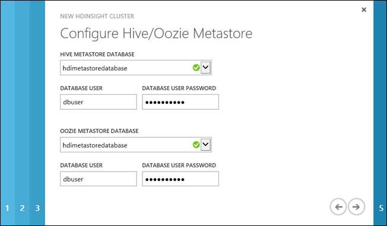
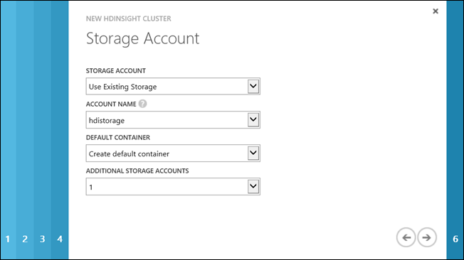

<properties 
   pageTitle="在 Linux 上的 HDInsight 中设置 Hadoop 群集 | Azure" 
   description="了解如何使用管理门户、命令行和 .NET SDK 在 Linux 上为 HDInsight 设置 Hadoop 群集。" 
   services="hdinsight" 
   documentationCenter="" 
   authors="nitinme" 
   manager="paulettm" 
   editor="cgronlun"/>
<tags ms.service="hdinsight"
    ms.date="04/02/2015"
    wacn.date="04/15/2015"
    />

# 使用自定义选项在 HDInsight 中设置 Hadoop Linux 群集（预览版）

在本文中，你将了解如何通过下述不同方法，使用自定义选项在 Azure HDInsight 上设置 Hadoop Linux 群集 - 使用 Azure 管理门户、PowerShell、命令行工具或 HDInsight .NET SDK。

## 什么是 HDInsight 群集？

你是否曾经疑惑过，为何我们每次谈论 Hadoop 或 BigData 时都会提到群集？这是因为，Hadoop 能够针对分散在不同群集节点上的大型数据实现分布式处理。群集采用主/从体系结构，其中包括一个主节点（又称头节点或命名节点）和若干个从节点（又称数据节点）。有关详细信息，请参阅 <a href="http://hadoop.apache.org/" target="_blank">Apache Hadoop</a>。

![HDInsight Cluster][img-hdi-cluster]

HDInsight 群集会抽象化 Hadoop 实现详细信息，因此你不必担心如何与不同的群集节点通信。当你设置 HDInsight 群集时，便设置了包含 Hadoop 和相关应用程序的 Azure 计算资源。有关详细信息，请参阅 [HDInsight 中的 Hadoop 简介](/documentation/articles/hdinsight-hadoop-introduction/)。要改动的数据存储在 Azure Blob 存储中，其在 HDInsight 的上下文中又称为  *Azure 存储空间 - Blob*（或 WASB）。有关详细信息，请参阅[将 Azure Blob 存储与 HDInsight 配合使用](/documentation/articles/hdinsight-use-blob-storage/)。

本文提供有关群集的不同设置方法的说明。如果你正在寻求通过一种快捷的方法设置群集，请参阅 [Linux 上的 Azure HDInsight 入门](/documentation/articles/hdinsight-hadoop-linux-get-started)。

**先决条件：**

在开始阅读本文前，你必须具有：

- Azure 订阅。Azure 是基于订阅的平台。HDInsight PowerShell cmdlet 通过订阅执行任务。有关获取订阅的详细信息，请参阅<a href="/pricing/overview/" target="_blank">购买选项</a>或<a href="/pricing/1rmb-trial/" target="_blank">免费试用</a>。
- SSH 密钥。如果你想要使用 SSH 和密钥而不是密码远程登录到 Linux 群集。建议使用密钥登录方法，因为它更安全。有关如何生成 SSH 密钥的说明，请参阅以下文章
	-  在 Linux 计算机中 - [从 Linux、Unix 或 OS X 搭配使用 SSH 与基于 Linux 的 HDInsight (Hadoop)](/documentation/articles/hdinsight-hadoop-linux-use-ssh-unix)。
	-  在 Windows 计算机中 - [从 Windows 搭配使用 SSH 与基于 Linux 的 HDInsight (Hadoop)](/documentation/articles/hdinsight-hadoop-linux-use-ssh-windows)。

## 配置选项

### Linux 上的群集

HDInsight 提供在 Azure 上设置 Linux 群集的选项。如果你熟悉 Linux 或 Unix、要从现有的基于 Linux 的 Hadoop 解决方案进行迁移，或者想要轻松集成针对 Linux 所构建的 Hadoop 生态系统组件，请设置 Linux 群集。有关 Linux 上的 Azure HDInsight 的详细信息，请参阅 [Linux 上的 Hadoop 简介](/documentation/articles/hdinsight-hadoop-introduction)。 

### 其他存储

在配置期间，你必须指定一个 Azure Blob 存储帐户和一个默认容器。该容器被集群用作默认存储位置。或者，你也可以指定也会与集群相关联的其他 Blob。

有关使用 Hive 的更多信息，请参阅[将 Azure Blob 存储与 HDInsight 配合使用](/documentation/articles/hdinsight-use-blob-storage/)。

### 元存储

元存储包含有关 Hive 表、分区、架构、列等的信息。该信息被 Hive 用于定位数据在 HDFS 上的存储位置（或用于 HDInsight 的 WASB）。默认情况下，Hive 使用嵌入的数据库存储该信息。

设置 HDInsight 群集时，你可以指定一个 SQL Database 来包含 Hive 元存储。由此，当你删除一个群集时将保留元数据信息，其存储到外部的 SQL Database 中。

> [AZURE.NOTE] 目前，只有在使用 .NET SDK 设置 HDInsight for Linux 时，才提供使用元存储的选项。有关说明，请参阅[使用 .NET SDK 在 Linux 上设置 HDInsight 群集](#sdk)。

##  用于设置 HDInsight Linux 群集的选项

你可以从 Linux 计算机以及 Windows 计算机设置 HDInsight Hadoop Linux 群集。下表提供了不同操作系统中可用设置选项的相关信息，以及每个选项说明的链接。

从运行此操作系统的计算机设置 Linux 群集 | 使用 Azure 管理门户 | 使用跨平台 CLI | 使用 .NET SDK | 使用 PowerShell

---------- | ---------- | ---------- | ---------- | ----------
Linux |单击[此处](#portal) | 单击[此处](#cli) | 不适用 | 即将推出
Windows | 单击[此处](#portal) | 单击[此处](#cli) | 单击[此处](#sdk) | 即将推出

###  使用 Azure 管理门户

HDInsight 群集使用 Azure Blob 存储容器作为默认文件系统。创建 HDInsight 群集前，要先具有位于同一数据中心的 Azure 存储帐户。有关详细信息，请参阅[将 Azure Blob 存储与 HDInsight 配合使用] (/documentation/articles/hdinsight-use-blob-storage/)。有关创建 Azure 存储帐户的详细信息，请参阅[如何创建存储帐户][azure-create-storageaccount]。

> [AZURE.NOTE] 目前，只有**中国东部**和**中国北部**地区可以托管 HDInsight 群集。

**使用"自定义创建"选项创建 HDInsight 群集**

1. 登录到 [Azure 管理门户][azure-management-portal]。
2. 单击页面底部的"+ 新建"，然后依次单击"数据服务"、"HDINSIGHT"和"自定义创建"。
3. 在"群集详细信息"页上，键入或选择以下值：

	

    <table border='1'>
		<tr><th>属性</th><th>值</th></tr>
		<tr><td>群集名称</td>
			<td>
命名群集。 

				<ul>
				<li>DNS 名称必须以字母数字开头和结尾，且可包含短划线。</li>
				<li>字段必须是介于 3 到 63 个字符之间的字符串。</li>
				</ul></td></tr>
		<tr><td>群集类型</td>
			<td>对于群集类型，请选择"Hadoop"<strong></strong>。</td></tr>
		<tr><td>操作系统</td>
			<td>选择"Ubuntu 12.04 LTS 预览版"<b></b>在 Linux 上设置 HDInsight 群集。若要设置 Windows 群集，请参阅<a href="/documentation/articles/hdinsight-provision-clusters/" target="_blank">在 Windows 上的 HDInsight 中设置 Hadoop 群集</a>。</td></tr>
		<tr><td>HDInsight 版本</td>
			<td>选择版本。对于 Linux 上的 Hadoop，默认值为 HDInsight 版本 3.2，该版本使用 Hadoop 2.5。</td></tr>
		</table>

	输入或选择表中所示的值，然后单击右箭头。

4. 在"配置群集"页上，输入或选择以下值：

	<table border="1">
	<tr><th>名称</th><th>值</th></tr>
	<tr><td>数据节点</td><td>要部署的数据节点的数目。出于测试目的，请创建单节点群集。  群集大小限制因 Azure 订阅而异。若要提高限制的大小，请联系 Azure 计费支持。</td></tr>
	<tr><td>区域/虚拟网络</td><td>
选择与上一个过程中创建的存储帐户相同的区域。HDInsight 要求存储帐户位于同一区域。在以后的配置中，你只能选择你在此处指定的区域中的存储帐户。

可以选择的区域为：<strong>中国东部</strong>、<strong>中国北部</strong> 
</td></tr>
	</table>

5. 在"配置群集用户"页上提供以下值：

    

    <table border='1'>
		<tr><th>属性</th><th>值</th></tr>
		<tr><td>HTTP 密码</td>
			<td>指定默认 HTTP 用户的密码，即 <i>admin</i>。</td></tr>
		<tr><td>SSH 用户名</td>
			<td>指定 SSH 用户名。你将使用此用户名在 HDInsight 群集节点上发起远程 SSH 会话。</td></tr>
		<tr><td>SSH 身份验证类型</td>
			<td>指定是要使用密码还是 SSH 密钥来对 SSH 用户进行身份验证</td></tr>
		<tr><td>SSH 密码</td>
			<td>如果选择密码作为身份验证类型，请指定 SSH 密码来对 SSH 用户进行身份验证。当你尝试在远程 Linux 计算机上发起 SSH 会话时，系统会提示你输入这个密码。</td></tr>
		<tr><td>SSH 公钥</td>
			<td>如果你选择密钥作为身份验证类型，请指定已经生成的 SSH 公钥。当你与 Linux 群集中的某个节点建立 SSH 会话时，需要使用与此公钥关联的私钥。 
			有关如何在 Linux 计算机上生成 SSH 密钥的说明，请参阅<a href="/documentation/articles/hdinsight-hadoop-linux-use-ssh-unix/" target="_blank">此文</a>。有关如何在 Windows 计算机上生成 SSH 密钥的说明，请参阅<a href="/documentation/articles/hdinsight-hadoop-linux-use-ssh-windows/" target="_blank">此文</a>。
		</td></tr>
		</table>

	> [AZURE.NOTE] 建议将 SSH 公钥身份验证与 SSH 配合使用，因为它比密码身份验证更安全。

	单击右箭头。

6. 在"存储帐户"页上提供以下值：

    

	<table border='1'>
		<tr><th>属性</th><th>值</th></tr>
		<tr><td>存储帐户</td>
			<td>为 HDInsight 群集指定将用作默认文件系统的 Azure 存储帐户。可以选择以下三个选项之一：
			<ul>
				<li>Use Existing Storage</li>
				<li>创建新存储</li>
				<li>使用其他订阅中的存储</li>
			</ul>
			</td></tr>
		<tr><td>帐户名</td>
			<td><ul>
				<li>如果选择使用现有存储，请为"帐户名"选择现有的存储帐户<strong></strong>。下拉列表中只列出了你选择在其中设置群集的同一数据中心内的存储帐户。</li>
				<li>如果选择"创建新存储"或"使用其他订阅中的存储"选项，则必须提供存储帐户名<strong></strong><strong></strong>。</li>
			</ul></td></tr>
		<tr><td>帐户密钥</td>
			<td>如果选择"使用其他订阅中的存储"选项，请指定该存储帐户的帐户密钥<strong></strong>。</td></tr>
		<tr><td>默认容器</td>
			<td>
指定存储帐户上用作 HDInsight 群集默认文件系统的默认容器。如果为"存储帐户"字段选择了"使用现有存储"并且该帐户不存在现有容器，则会按默认创建与群集同名的容器<strong></strong><strong></strong>。如果已存在与群集同名的容器，将在容器名称后附加一个序列号。例如，mycontainer1、mycontainer2，等等。但是，如果现有存储帐户的容器名称与你指定的群集名称不同，则你也可以使用该容器。

            
如果选择创建新存储或使用其他 Azure 订阅中的存储，则必须指定默认容器名称

        </td></tr>
		<tr><td>其他存储帐户</td>
			<td>HDInsight 支持多个存储帐户。一个群集可以使用的其他存储帐户数没有限制。但是，如果你使用管理门户创建群集，由于 UI 限制，你最多只能创建七个存储帐户。指定的每个其他存储帐户将在向导中添加一个额外的"存储帐户"页，以便你在此指定帐户信息。例如，在上面的屏幕截图中，选择了 1 个附加的存储帐户，因此第 5 页添加到了对话框。</td></tr>
	</table>

	单击右箭头。

7. 如果你选择为群集配置其他存储，请在"存储帐户"页上，输入其他存储帐户的帐户信息：

	

    同样，你可以使用相应的选项从现有帐户中做出选择，创建新存储，或者使用其他 Azure 订阅中的存储。提供值的过程类似于前面的步骤。

    > [AZURE.NOTE] 一旦为 HDInsight 群集选择了 Azure 存储帐户，就不能再删除该帐户，也不能将它更改为另一帐户。

 	在指定其他存储帐户后，请单击复选标记开始设置群集。 

###  使用跨平台命令行

设置 HDInsight 群集的另一方法是使用跨平台命令行界面。该命令行工具在 Node.js 中实现。可以在支持 Node.js 的任意平台（包括 Windows、Mac 和 Linux）上使用它。可从以下位置安装 CLI：

- **Node.JS SDK** - <a href="https://www.npmjs.com/package/azure-mgmt-hdinsight" target="_blank">https://www.npmjs.com/package/azure-mgmt-hdinsight</a>
- **跨平台 CLI** - <a href="https://github.com/Azure/azure-xplat-cli/archive/hdinsight-February-18-2015.tar.gz" target="_blank">https://github.com/Azure/azure-xplat-cli/archive/hdinsight-February-18-2015.tar.gz</a>

有关如何使用命令行界面的一般指南，请参阅[针对 Mac 和 Linux 的 Azure 命令行工具][azure-command-line-tools]。

以下说明将指导你在 Linux 和 Windows 上安装跨平台命令行，然后使用该命令行来设置群集。

- [设置适用于 Linux 的 Azure 跨平台命令行](#clilin)
- [设置适用于 Windows 的 Azure 跨平台命令行](#cliwin)
- [使用 Azure 跨平台命令行设置 HDInsight 群集](#cliprovision)

#### 设置适用于 Linux 的跨平台命令行

执行以下过程，将你的 Linux 计算机设置为使用 Azure 命令行工具。

- 使用 NPM 安装跨平台命令行
- 连接到你的 Azure 订阅

**使用 NPM 安装命令行界面**

1.	在 Linux 计算机上打开终端窗口，然后运行以下命令：

		sudo npm install -g https://github.com/Azure/azure-xplat-cli/archive/hdinsight-February-18-2015.tar.gz

2.	运行以下命令以验证安装：

		azure hdinsight -h

	可以在不同级别使用 *-h* 开关以显示帮助信息。例如：

		azure -h
		azure hdinsight -h
		azure hdinsight cluster -h
		azure hdinsight cluster create -h

**连接到 Azure 订阅**

在使用命令行界面前，你必须配置工作站和 Azure 之间的连接。命令行界面使用你的 Azure 订阅信息连接到你的帐户。可从 Azure 的发布设置文件中获取此信息。稍后可以导入发布设置文件作为永久性本地配置设置，命令行界面会将此设置用于后续操作。你只需导入你的发布设置一次。

> [AZURE.NOTE] 发布设置文件包含敏感信息。Microsoft 建议你删除该文件或采取其他措施来加密包含该文件的用户文件夹。在 Windows 上，修改文件夹属性或使用 BitLocker。 

1.	打开终端窗口。
2.	运行以下命令以登录到你的 Azure 订阅。

		azure account download

	

	该命令将启动要从中下载发布设置文件的网页。如果网页未打开，请单击终端窗口中的链接以打开浏览器页面并登录门户。 

3.	将发布设置文件下载到计算机。
5.	从命令提示符窗口，运行以下命令以导入发布设置文件：

		azure account import <path/to/the/file>

	
#### 设置适用于 Windows 的跨平台命令行

执行以下过程，将你的 Windows 计算机设置为使用 Azure 命令行工具。

- 安装跨平台命令行（使用 NPM 或 Windows 安装程序）
- 下载并导入 Azure 帐户发布设置

可以使用  *Node.js Package Manager (NPM)* 或 Windows 安装程序安装该命令行界面。Microsoft 建议你只使用这两个选项中的一个来进行安装。

**使用 NPM 安装命令行界面**

1.	浏览到 **www.nodejs.org**。
2.	单击"安装"，然后使用默认设置按说明操作。
3.	从工作站打开"命令提示符"（或"Azure 命令提示符"，或"VS2012 的开发人员命令提示符"）。
4.	在命令提示符窗口中运行以下命令。

		npm install -g https://github.com/Azure/azure-xplat-cli/archive/hdinsight-February-18-2015.tar.gz

	> [AZURE.NOTE] 如果收到"未找到 NPM 命令"的错误消息，请验证以下路径位于 PATH 环境变量中：<i>C:\Program Files (x86)\nodejs；C:\Users\[用户名]\AppData\Roaming\npm</i> 或 <i>C:\Program Files\nodejs；C:\Users\[用户名]\AppData\Roaming\npm</i>

5.	运行以下命令以验证安装：

		azure hdinsight -h

	可以在不同级别使用 *-h* 开关以显示帮助信息。例如：

		azure -h
		azure hdinsight -h
		azure hdinsight cluster -h
		azure hdinsight cluster create -h

**使用 Windows 安装程序安装命令行界面**

1.	浏览到 **http://www.windowsazure.cn/downloads/**。
2.	向下滚动到"命令行工具"部分，然后单击"跨平台命令行界面"，按 Web 平台安装程序向导的要求操作。

**下载和导入发布设置**

在使用命令行界面前，你必须配置工作站和 Azure 之间的连接。命令行界面使用你的 Azure 订阅信息连接到你的帐户。可从 Azure 的发布设置文件中获取此信息。稍后可以导入发布设置文件作为永久性本地配置设置，命令行界面会将此设置用于后续操作。你只需导入你的发布设置一次。

> [AZURE.NOTE] 发布设置文件包含敏感信息。Microsoft 建议你删除该文件或采取其他措施来加密包含该文件的用户文件夹。在 Windows 上，修改文件夹属性或使用 BitLocker。

1.	打开"命令提示符"。
2.	运行以下命令来下载发布设置文件。

		azure account download

	![HDI.CLIAccountDownloadImport][image-cli-account-download-import]

	该命令将启动要从中下载发布设置文件的网页。

3.	出现保存文件的提示时，请单击"保存"并提供文件的保存位置。
5.	从命令提示符窗口，运行以下命令以导入发布设置文件：

		azure account import <path/to/the/file>

	
#### 使用 Azure 跨平台命令行设置 HDInsight 群集

使用跨平台命令行设置 HDInsight 群集的步骤如下：

- 创建 Azure 存储帐户
- 设置群集

**创建 Azure 存储帐户**

HDInsight 使用 Azure Blob 存储容器作为默认文件系统。你需要先拥有 Azure 存储帐户，然后才能创建 HDInsight 群集。存储帐户必须位于同一数据中心。

- 在命令提示符窗口中运行以下命令，以创建 Azure 存储帐户：

		azure storage account create [options] <StorageAccountName>

	出现指定位置的提示时，请选择 HDINsight 群集可以设置到的位置。该存储位置必须与 HDInsight 群集所在的位置相同。目前，只有**中国东部**和**中国北部**地区可以托管 HDInsight 群集。  

有关使用 Azure 管理门户创建 Azure 存储帐户的信息，请参阅[创建、管理或删除存储帐户][azure-create-storageaccount]。

如果你已有存储帐户但是不知道帐户名称和帐户密钥，可以使用以下命令来检索该信息：

	-- lists storage accounts
	azure storage account list

	-- Shows information for a storage account
	azure storage account show <StorageAccountName>

	-- Lists the keys for a storage account
	azure storage account keys list <StorageAccountName>

有关使用管理门户获取信息的详细信息，请参阅如何管理存储帐户中的 *如何：查看、复制和重新生成存储访问密钥*部分，主题为[创建、管理或删除存储帐户][azure-create-storageaccount]。

HDInsight 群集还需要在存储帐户中提供一个容器。如果你提供的存储帐户尚不包含容器， *azure hdinsight cluster create* 将提示你输入容器名称，然后会创建该容器。但是，如果你想要预先创建容器，可以使用以下命令：

	azure storage container create --account-name <StorageAccountName> --account-key <StorageAccountKey> [ContainerName]

准备好存储帐户和 blob 容器后，你就可以创建群集了。

**设置 HDInsight 群集**

- 从命令提示符窗口，运行以下命令：

		azure hdinsight cluster create --clusterName <ClusterName> --storageAccountName "<StorageAccountName>.blob.core.chinacloudapi.cn" --storageAccountKey <StorageAccountKey> --storageContainer <StorageContainerName> --dataNodeCount <NumberOfNodes> --location <DataCenterLocation> --userName <HDInsightClusterUsername> --password <HDInsightClusterPassword> --osType linux --sshUserName <SSH username> --sshPassword <SSH user password>		

	![HDI.CLIClusterCreation][image-cli-clustercreation]

**使用配置文件设置 HDInsight 群集**

通常，你设置 HDInsight 群集，运行作业，然后删除该群集以降低成本。在命令行界面上，你可以选择将配置保存到文件，以便在每次设置群集时重用这些配置。

- 在命令提示符窗口中运行以下命令：

		#Create the config file
		azure hdinsight cluster config create <file>

		#Add commands to create a basic cluster
		azure hdinsight cluster config set <file> --clusterName <ClusterName> --dataNodeCount <NumberOfNodes> --location "<DataCenterLocation>" --storageAccountName "<StorageAccountName>.blob.core.chinacloudapi.cn" --storageAccountKey "<StorageAccountKey>" --storageContainer "<BlobContainerName>" --userName "<Username>" --password "<UserPassword>" --osType linux --sshUserName <SSH username> --sshPassword <SSH user password>

		#If requred, include commands to use additional blob storage with the cluster
		azure hdinsight cluster config storage add <file> --storageAccountName "<StorageAccountName>.blob.core.chinacloudapi.cn"
		       --storageAccountKey "<StorageAccountKey>"
	
		#Run this command to create a cluster using the config file
		azure hdinsight cluster create --config <file>

	>[AZURE.NOTE] 用于元存储的 Azure SQL Database 必须允许连接到其他 Azure 服务，包括 Azure HDInsight。在 Azure SQL 数据库仪表板的右侧单击服务器名称。这是运行 SQL 数据库实例的服务器。进入服务器视图后，请单击"配置"，单击"Microsoft Azure 服务"对应的"是"，然后单击"保存"。

	![HDI.CLIClusterCreationConfig][image-cli-clustercreation-config]

**列出和显示群集详细信息**

- 使用以下命令来列出和显示群集详细信息：

		azure hdinsight cluster list
		azure hdinsight cluster show <ClusterName>

	![HDI.CLIListCluster][image-cli-clusterlisting]

**删除群集**

- 使用以下命令来删除群集：

		azure hdinsight cluster delete <ClusterName>

###  使用 HDInsight .NET SDK
HDInsight .NET SDK 提供 .NET 客户端库，可简化从 .NET 应用程序中使用 HDInsight 的操作。

使用 SDK 在 Linux 上设置 HDInsight 群集时必须执行以下过程：

- 安装 HDInsight .NET SDK
- 创建自签名证书
- 创建控制台应用程序
- 运行应用程序

**安装 HDInsight .NET SDK**

可以从 [NuGet](http://nuget.codeplex.com/wikipage?title=Getting%20Started) 安装该 SDK 的最新发行版。下一过程中将显示说明。

**创建自签名证书**

创建自签名证书，将其安装到工作站上，然后将其上传到你的 Azure 订阅。有关说明，请参阅[创建自签名证书](/documentation/articles/hdinsight-administer-use-management-portal/#cert)。

**创建 Visual Studio 控制台应用程序**

1. 打开 Visual Studio 2013。

2. 在"文件"菜单中，单击"新建"，然后单击"项目"。

3. 在"新建项目"中，键入或选择以下值：

	<table style="border-color: #c6c6c6; border-width: 2px; border-style: solid; border-collapse: collapse;">
	<tr>
	<th style="border-color: #c6c6c6; border-width: 2px; border-style: solid; border-collapse: collapse; width:90px; padding-left:5px; padding-right:5px;">属性</th>
	<th style="border-color: #c6c6c6; border-width: 2px; border-style: solid; border-collapse: collapse; width:90px; padding-left:5px; padding-right:5px;">值</th></tr>
	<tr>
	<td style="border-color: #c6c6c6; border-width: 2px; border-style: solid; border-collapse: collapse; padding-left:5px;">类别</td>
	<td style="border-color: #c6c6c6; border-width: 2px; border-style: solid; border-collapse: collapse; padding-left:5px; padding-right:5px;">模板/Visual C#/Windows</td></tr>
	<tr>
	<td style="border-color: #c6c6c6; border-width: 2px; border-style: solid; border-collapse: collapse; padding-left:5px;">模板</td>
	<td style="border-color: #c6c6c6; border-width: 2px; border-style: solid; border-collapse: collapse; padding-left:5px;">控制台应用程序</td></tr>
	<tr>
	<td style="border-color: #c6c6c6; border-width: 2px; border-style: solid; border-collapse: collapse; padding-left:5px;">名称</td>
	<td style="border-color: #c6c6c6; border-width: 2px; border-style: solid; border-collapse: collapse; padding-left:5px;">CreateHDICluster</td></tr>
	</table>

4. 单击"确定"以创建该项目。

5. 在"工具"菜单中，单击"Nuget Package Manager"，然后单击"Package Manager Console"。

6. 在控制台中运行下列命令以安装程序包。

		Install-Package Microsoft.WindowsAzure.Management.HDInsight

	此命令将 .NET 库以及对这些库的引用添加到当前 Visual Studio 项目中。

7. 在解决方案资源管理器中，双击 **Program.cs** 将其打开。

8. 将下列 using 语句添加到文件顶部。

		using System.Security.Cryptography.X509Certificates;
		using Microsoft.WindowsAzure.Management.HDInsight;
		using Microsoft.WindowsAzure.Management.HDInsight.ClusterProvisioning;

9. 在 Main() 函数中，复制并粘贴以下代码：

        string thumbprint = "<CertificateThumbprint>";  
        string subscriptionid = "<AzureSubscriptionID>";
        string clustername = "<HDInsightClusterName>";
        string location = "<MicrosoftDataCenter>";
        string storageaccountname = "<AzureStorageAccountName>.blob.core.chinacloudapi.cn";
        string storageaccountkey = "<AzureStorageAccountKey>";
        string containername = "<HDInsightDefaultContainerName>";
        string username = "<HDInsightUsername>";
        string password = "<HDInsightUserPassword>";
        int clustersize = <NumberOfNodesInTheCluster>;
		string version = "<version>";
        string sshusername = "<ssh user name>";
        string sshpublickey = "<ssh public key>;
		
		//if required, provide details of the Hive and Oozie metastore that you want to configure. ServerName is the name of the server on which the SQL databases are provisioned. HiveStoreSqlDatabaseName and OozieStoreSqlDatabaseName are the names of databases created on the server. You can also use the same database for both Hive and Oozie metastores
		Metastore hiveMetastore = new Metastore("<ServerName>.database.chinacloudapi.cn", "<HiveStoreSqlDatabaseName>", "<SqlDatabaseUser>", "<SqlDatabasePassword>");
        Metastore oozieMetastore = new Metastore("<ServerName>.database.chinacloudapi.cn", "<OozieStoreSqlDatabaseName>", "<SqlDatabaseUser>", "<SqlDatabasePassword>");

        // Get the certificate object from certificate store using the friendly name to identify it
        X509Store store = new X509Store();
        store.Open(OpenFlags.ReadOnly);
        X509Certificate2 cert = store.Certificates.Cast<X509Certificate2>().First(item => item.Thumbprint == thumbprint);

        // Create an HDInsightClient object
        HDInsightCertificateCredential creds = new HDInsightCertificateCredential(new Guid(subscriptionid), cert);
        var client = HDInsightClient.Connect(creds);

		// Supply th cluster information
        ClusterCreateParametersV2 clusterInfo = new ClusterCreateParametersV2()
        {
            Name = clustername,
            Location = location,
            DefaultStorageAccountName = storageaccountname,
            DefaultStorageAccountKey = storageaccountkey,
            DefaultStorageContainer = containername,
            UserName = username,
            Password = password,
            ClusterSizeInNodes = clustersize
			Version = version,
            OSType = OSType.Linux,
            SshUserName = sshusername,
            SshPublicKey = sshpublickey,
			HiveMetastore = hiveMetastore,		//only if you created a hivemetastore object earlier
            OozieMetastore = oozieMetastore		//only if you created an ooziemetastore object earlier
        };

		// Configure Hive and Oozie if you opted for the metastores earlier
		clusterInfo.HiveConfiguration.ConfigurationCollection.Add(new KeyValuePair<string, string>("datanucleus.connectionPoolingType", "none"));
		clusterInfo.OozieConfiguration.ConfigurationCollection.Add(new KeyValuePair<string, string>("oozie.service.AuthorizationService.security.enabled", "false"));
        

		// Create the cluster
        Console.WriteLine("Creating the HDInsight cluster ...");

        ClusterDetails cluster = client.CreateCluster(clusterInfo);

        Console.WriteLine("Created cluster: {0}.", cluster.ConnectionUrl);
        Console.WriteLine("Press ENTER to continue.");
        Console.ReadKey();

10. 替换 main() 函数开头的变量。

**运行应用程序**

该应用程序在 Visual Studio 中打开时，按 **F5** 运行该应用程序。控制台窗口应打开并显示应用程序的状态。设置一个 HDInsight 群集可能需要几分钟时间。

##  后续步骤
在本文中，你已经学习了几种在 Linux 上设置 HDInsight Hadoop 群集的方法。若要了解更多信息，请参阅以下文章：

- [使用 Linux 上的 HDInsight](/documentation/articles/hdinsight-hadoop-linux-information). 了解在 Linux 上使用 HDInsight 群集的细微差异。
- [使用 Ambari 管理 HDInsight 群集](/documentation/articles/hdinsight-hadoop-manage-ambari)。了解如何使用 Ambari Web 或 Ambari REST API 在 HDInsight 群集上监视和管理基于 Linux 的 Hadoop。 
- [将 MapReduce 与 HDInsight 配合使用][hdinsight-use-mapreduce]。了解在群集上运行 MapReduce 作业的不同方法。
- [将 Hive 与 HDInsight 配合使用][hdinsight-use-hive]。了解在群集上运行 Hive 查询的不同方法。
- [将 Pig 与 HDInsight 配合使用][hdinsight-use-pig]。了解在群集上运行 Pig 作业的不同方法。
- [将 Azure Blob 存储与 HDInsight 配合使用](/documentation/articles/hdinsight-use-blob-storage)。了解 HDInsight 如何使用 Azure Blob 存储来存储 HDInsight 群集的数据。
- [将数据上载到 HDInsight][hdinsight-upload-data]。了解如何处理 HDInsight 群集的 Azure Blob 存储中存储的数据。

[hdinsight-use-mapreduce]: /documentation/articles/hdinsight-use-mapreduce/
[hdinsight-use-hive]: /documentation/articles/hdinsight-use-hive/
[hdinsight-use-pig]: /documentation/articles/hdinsight-use-pig/
[hdinsight-upload-data]: /documentation/articles/hdinsight-upload-data/
[hdinsight-sdk-documentation]: http://msdn.microsoft.com/zh-cn/library/dn479185.aspx
[hdinsight-hbase-custom-provision]: /documentation/articles/hdinsight-hbase-get-started/

[hdinsight-customize-cluster]: /documentation/articles/hdinsight-hadoop-customize-cluster/
[hdinsight-get-started]: /documentation/articles/hdinsight-get-started/
[hdinsight-admin-powershell]: /documentation/articles/hdinsight-administer-use-powershell/

[hdinsight-submit-jobs]: /documentation/articles/hdinsight-submit-hadoop-jobs-programmatically/
[hdinsight-powershell-reference]: http://msdn.microsoft.com/zh-cn/library/azure/dn479228.aspx

[azure-management-portal]: https://manage.windowsazure.cn/

[azure-command-line-tools]: /documentation/articles/xplat-cli/
[azure-create-storageaccount]: /documentation/articles/storage-create-storage-account/

[azure-purchase-options]: /pricing/overview/
[azure-free-trial]: /pricing/1rmb-trial/
[hdi-remote]: /documentation/articles/hdinsight-administer-use-management-portal/#rdp

[Powershell-install-configure]: /documentation/articles/install-configure-powershell/

[image-hdi-customcreatecluster]: ./media/hdinsight-get-started/HDI.CustomCreateCluster.png
[image-hdi-customcreatecluster-clusteruser]: ./media/hdinsight-get-started/HDI.CustomCreateCluster.ClusterUser.png
[image-hdi-customcreatecluster-storageaccount]: ./media/hdinsight-get-started/HDI.CustomCreateCluster.StorageAccount.png
[image-hdi-customcreatecluster-addonstorage]: ./media/hdinsight-get-started/HDI.CustomCreateCluster.AddOnStorage.png

[image-cli-account-download-import]: ./media/hdinsight-hadoop-provision-linux-clusters/HDI.CLIAccountDownloadImport.png
[image-cli-clustercreation]: ./media/hdinsight-hadoop-provision-linux-clusters/HDI.CLIClusterCreation.png
[image-cli-clustercreation-config]: ./media/hdinsight-hadoop-provision-linux-clusters/HDI.CLIClusterCreationConfig.png
[image-cli-clusterlisting]: ./media/hdinsight-hadoop-provision-linux-clusters/HDI.CLIListClusters.png "List and show clusters"

[image-hdi-ps-provision]: ./media/hdinsight-provision-clusters/HDI.ps.provision.png

[img-hdi-cluster]: ./media/hdinsight-provision-clusters/HDI.Cluster.png

  [89e2276a]: /documentation/articles/hdinsight-use-sqoop/ "Use Sqoop with HDInsight"

<!--HONumber=50-->