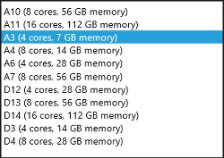
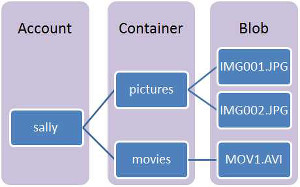
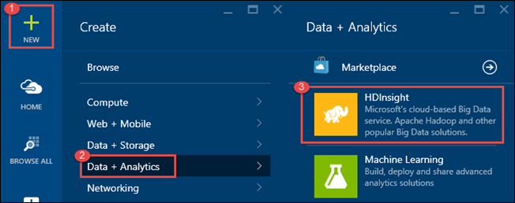
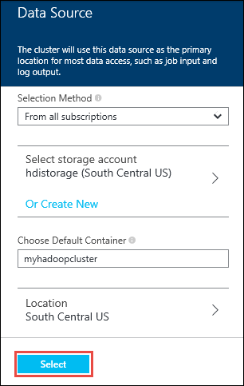
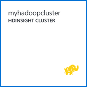

<properties
   pageTitle="在 HDInsight 中预配自定义 Hadoop 群集 | Azure"
   description="了解如何通过使用 Azure 预览门户、Azure PowerShell、命令行或 .NET SDK 预配自定义的 Azure HDInsight 群集。"
   services="hdinsight"
   documentationCenter=""
   tags="azure-portal"
   authors="mumian"
   manager="paulettm"
   editor="cgronlun"/>

<tags
   ms.service="hdinsight"
   ms.date="08/11/2015"
   wacn.date="10/03/2015" />

# 在 HDInsight 中设置 Hadoop 群集

了解如何规划 HDInsight 群集的预配。

[AZURE.INCLUDE [选择器](../includes/hdinsight-portal-management-selector.md)]

* [在 HDInsight 中设置 Hadoop 群集](/documentation/articles/hdinsight-provision-clusters-v1)

[AZURE.INCLUDE [hdinsight-azure-preview-portal](../includes/hdinsight-azure-preview-portal.md)]

* [在 HDInsight 中设置 Hadoop 群集](/documentation/articles/hdinsight-provision-clusters-v1)

**先决条件：**

在开始按照本文中的说明操作之前，你必须具有以下内容：

- Azure 订阅。请参阅[获取 Azure 免费试用版](http://azure.microsoft.com/documentation/videos/get-azure-free-trial-for-testing-hadoop-in-hdinsight/)。

## 基本配置选项

- **群集名称**

	群集名称用于标识群集。群集名称必须遵循以下准则：

	- 字段必须是包含 3 到 63 个字符的字符串
	- 字段只能包含字母、数字和连字符。

- **订阅名称**

	一个 HDInsight 群集与一个 Azure 订阅绑定。

- **操作系统**

	可以在以下操作系统中的一个上预配 HDInsight 群集：- **Windows 上的 HDInsight (Windows Server 2012 R2 Datacenter)**。

- **HDInsight 版本**

	用于确定要用于此群集的 HDInsight 版本。有关详细信息，请参阅 [HDInsight 中的 Hadoop 群集版本和组件](https://go.microsoft.com/fwLink/?LinkID=320896&clcid=0x409)。

- **群集类型**和**群集大小（也称为数据节点）**

	HDInsight 可让客户部署各种不同的群集类型，用于不同的数据分析工作负荷。目前提供的群集类型包括：

	- Hadoop 群集：用于查询和分析工作负荷
	- HBase 群集：用于 NoSQL 工作负荷
	- Storm 群集：用于实时事件处理工作负荷

	

	> [AZURE.NOTE]*Azure HDInsight 群集*也称为 *HDInsight 中的 Hadoop 群集*或者 *HDInsight 群集*。有时，该术语可与 *Hadoop 群集*换用。它们都代表托管在 Windows Azure 环境中的 Hadoop 群集。

	在给定的群集类型中，各节点有不同的角色，使客户能够针对特定角色，根据适合其工作负荷的详细信息来调整节点的大小。例如，如果执行的分析作业类型会消耗大量内存，Hadoop 群集可以使用大量内存来预配辅助节点。

	

	HDInsight 的 Hadoop 群集是使用两个角色部署的：

	- 头节点（2 个节点）
	- 数据节点（至少 1 个节点）

	

	HDInsight 的 HBase 群集是使用三个角色部署的：- 头服务器（2 个节点）- 区域服务器（至少 1 个节点）- 主/Zookeeper 节点（3 个节点）

	

	HDInsight 适用的 Storm 群集是使用三个角色部署的：- Nimbus 服务器（2 个节点）- 监督服务器（至少 1 个节点）- Zookeeper 节点（3 个节点）

	客户需根据群集的生存期，支付这些节点的使用费。创建群集之后便开始计费，删除群集时便停止计费（无法取消分配或保留群集）。群集大小会影响群集价格。为了方便学习，建议使用 1 个数据节点。有关 HDInsight 定价的详细信息，请参阅 [HDInsight 定价](https://go.microsoft.com/fwLink/?LinkID=282635&clcid=0x409)。

	>[AZURE.NOTE]群集大小限制因 Azure 订阅而异。若要提高限制的大小，请联系计费支持人员。

- **区域/虚拟网络（也称为位置）**

	

	有关受支持地区的列表，请单击 [HDInsight 定价](https://go.microsoft.com/fwLink/?LinkID=282635&clcid=0x409)中的“区域”下拉列表。

- **节点大小**

	

	选择节点的 VM 大小。有关详细信息，请参阅[云服务的大小](/documentation/articles/cloud-services-sizes-specs)。

	根据所选的 VM，你的成本可能会有所不同。HDInsight 对群集节点使用所有标准层 VM。有关 VM 大小如何影响价格的信息，请参阅 <a href="http://azure.microsoft.com/pricing/details/hdinsight/" target="_blank">HDInsight 价格</a>。

- **HDInsight 用户**

	HDInsight 群集允许你在预配期间配置两个用户帐户：

	- HTTP 用户。默认用户名是在 Azure 预览门户上使用基本配置创建的 admin。
	- RDP 用户（Windows 群集）：用于通过 RDP 连接到群集。在创建帐户时，必须将过期日期设置为从当天算起的 90 天。

- **Azure 存储帐户**

	原始 HDFS 使用群集上的多个本地磁盘。HDInsight 使用 Azure Blob 存储来存储数据。Azure Blob 存储是一种稳健、通用的存储解决方案，它与 HDInsight 无缝集成。通过 Hadoop 分布式的文件系统 (HDFS) 界面，可以针对 Blob 存储中的结构化或非结构化数据直接运行 HDInsight 中的整套组件。通过将数据存储在 Blob 存储中，你可以安全删除用于计算的 HDInsight 群集而不会丢失用户数据。

	在配置期间，你必须指定 Azure 存储帐户，并在该 Azure 存储帐户中指定 Azure Blob 存储容器。某些预配过程要求事先创建 Azure 存储帐户和 Blob 存储容器。群集使用该 Blob 存储容器作为默认存储位置。你也可以选择指定群集可访问的其他 Azure 存储帐户（链接的存储）。此外，群集还可以访问任何配置有完全公共读取权限或仅限对 blob 的公共读取权限的 Blob 容器。有关限制访问的详细信息，请参阅[管理对 Azure 存储资源的访问](/documentation/articles/storage-manage-access-to-resources)。

	

	>[AZURE.NOTE]Blob 存储容器提供一组 Blob 集，如图所示：

	

	>[AZURE.WARNING]不要对多个群集共享一个 Blob 存储容器。此操作不受支持。

	有关使用辅助 Blob 存储的详细信息，请参阅[将 Azure Blob 存储与 HDInsight 配合使用](/documentation/articles/hdinsight-use-blob-storage)。

- **Hive/Oozie 元存储**

	元存储包含 Hive 和 Oozie 元数据，例如 Hive 表、分区、架构和列。使用元存储有助于保留你的 Hive 和 Oozie 元数据，这样，在设置新群集时，你不需要重新创建 Hive 表或 Oozie 作业。默认情况下，Hive 使用嵌入的 Azure SQL 数据库存储此信息。在删除群集时，嵌入的数据库无法保留元数据。例如，你使用 Hive 元存储预配了一个群集。你创建了一些 Hive 表。在删除群集并通过相同的 Hive 元存储重建群集之后，便可以看到在原始群集中创建的 Hive 表。

## 高级配置选项

>[AZURE.NOTE]本部分目前仅适用于基于 Windows 的 HDInsight 群集。

### 使用 HDInsight 群集自定义功能来自定义群集

有时，你可能需要配置配置文件。以下是其中的一些配置文件。

- core-site.xml
- hdfs-site.xml
- mapred-site.xml
- yarn-site.xml
- hive-site.xml
- oozie-site.xml

群集无法保留重新制作映像所造成的更改。有关详细信息，请参阅[重新启动角色实例进行 OS 升级](http://blogs.msdn.com/b/kwill/archive/2012/09/19/role-instance-restarts-due-to-os-upgrades.aspx)。若要在群集生存期保留更改，你可以在预配过程中使用 HDInsight 群集自定义。

下面是用于自定义 Hive 配置的 Azure PowerShell 脚本示例：

	# hive-site.xml configuration
	$hiveConfigValues = new-object 'Microsoft.WindowsAzure.Management.HDInsight.Cmdlet.DataObjects.AzureHDInsightHiveConfiguration'
	$hiveConfigValues.Configuration = @{ "hive.metastore.client.socket.timeout"="90" } #default 60

	$config = New-AzureHDInsightClusterConfig `
	            -ClusterSizeInNodes $clusterSizeInNodes `
	            -ClusterType $clusterType `
	          | Set-AzureHDInsightDefaultStorage `
	            -StorageAccountName $defaultStorageAccount `
	            -StorageAccountKey $defaultStorageAccountKey `
	            -StorageContainerName $defaultBlobContainer `
	          | Add-AzureHDInsightConfigValues `
	            -Hive $hiveConfigValues

	New-AzureHDInsightCluster -Name $clusterName -Location $location -Credential $credential -OSType Windows -Config $config

下面是有关自定义其他配置文件的更多示例：

	# hdfs-site.xml configuration
	$HdfsConfigValues = @{ "dfs.blocksize"="64m" } #default is 128MB in HDI 3.0 and 256MB in HDI 2.1

	# core-site.xml configuration
	$CoreConfigValues = @{ "ipc.client.connect.max.retries"="60" } #default 50

	# mapred-site.xml configuration
	$MapRedConfigValues = new-object 'Microsoft.WindowsAzure.Management.HDInsight.Cmdlet.DataObjects.AzureHDInsightMapReduceConfiguration'
	$MapRedConfigValues.Configuration = @{ "mapreduce.task.timeout"="1200000" } #default 600000

	# oozie-site.xml configuration
	$OozieConfigValues = new-object 'Microsoft.WindowsAzure.Management.HDInsight.Cmdlet.DataObjects.AzureHDInsightOozieConfiguration'
	$OozieConfigValues.Configuration = @{ "oozie.service.coord.normal.default.timeout"="150" }  # default 120

有关详细信息，请参阅 Azim Uddin 标题为[自定义 HDInsight 群集预配](http://blogs.msdn.com/b/bigdatasupport/archive/2014/04/15/customizing-hdinsight-cluster-provisioning-via-powershell-and-net-sdk.aspx)的博客。

### 使用脚本操作自定义群集

你可以在设置期间通过使用脚本安装其他组件或自定义群集配置。此类脚本可通过“脚本操作”调用，脚本操作是一种配置选项，可通过预览门户、HDInsight Windows PowerShell cmdlet 或 HDInsight .NET SDK 使用。有关详细信息，请参阅[使用脚本操作自定义 HDInsight 群集](/documentation/articles/hdinsight-hadoop-customize-cluster)。

### 使用 Azure 虚拟网络

[Azure 虚拟网络](http://azure.microsoft.com/documentation/services/virtual-network/)允许你创建包含需要用于解决方案的资源的安全永久性网络。通过虚拟网络，你可以：

* 在专用网络（仅限云）中将云资源连接在一起。

	

* 通过使用虚拟专用网络 (VPN) 将云资源连接到本地数据中心网络（站点到站点或点到站点）。

	利用站点到站点配置，你可以通过使用硬件 VPN 或路由和远程访问服务将多个资源从数据中心连接到 Azure 虚拟网络。

	

	利用点到站点配置，你可以通过使用软件 VPN 将特定资源连接到 Azure 虚拟网络。

	

有关虚拟网络特性、优势和功能的详细信息，请参阅 [Azure 虚拟网络概述](http://msdn.microsoft.com/zh-cn/library/azure/jj156007.aspx)。

> [AZURE.NOTE]你必须先创建 Azure 虚拟网络，然后才能设置 HDInsight 群集。有关详细信息，请参阅[在虚拟网络中预配 Hadoop 群集](/documentation/articles/hdinsight-hbase-provision-vnet#provision-an-hbase-cluster-into-a-virtual-network)。
>
> Azure HDInsight 仅支持基于位置的虚拟网络，并且当前不适用于基于地缘组的虚拟网络。使用 Azure PowerShell Cmdlet Get-AzureVNetConfig 来检查现有的 Azure 虚拟网络是否基于位置。如果虚拟网络并非基于位置，你可以使用以下选项：
>
> - 导出现有的虚拟网络配置，然后创建新的虚拟网络。默认情况下，所有新的虚拟网络都基于位置。
> - 迁移到基于位置的虚拟网络。请参阅[将现有服务迁移到区域范围](http://azure.microsoft.com/blog/2014/11/26/migrating-existing-services-to-regional-scope/)。
>
> 强烈建议为一个群集指定一个子网。

## 预配工具

- Azure 预览门户
- Azure PowerShell
- HDInsight .NET SDK

### 使用预览门户

你可以参考 [基本配置选项] 和 [高级配置选项] 以获取有关字段的说明。

**创建 HDInsight 群集**

1. 登录到 [Azure 预览门户][azure-preview-portal]。
2. 单击“新建”，单击“数据分析”，然后单击“HDInsight”。

    

3. 键入或选择以下值：
  - **群集名称**：输入群集的名称。如果该群集名称可用，则名称旁边会出现绿色的复选标记。
  - **群集类型**：选择“Hadoop”。
  - **群集操作系统**：选择“Windows Server 2012 R2 Datacenter”。
  - **订阅**：选择将用于预配此群集的 Azure 订阅。
  - **资源组**：选择现有资源组或创建新的资源组。如果有可用的资源组，则此条目默认为现有资源组中的一个。
  - **凭据**：配置 Hadoop 用户（HTTP 用户）的用户名和密码。如果你为该群集启用了远程桌面，则需要配置远程桌面用户的用户名、密码和帐户过期日期。在底部单击“选择”以保存更改。

	
  - **数据源**：创建新的 Azure 存储帐户，或选择现有的帐户，使其用作群集的默认文件系统。

	   

  	- **选择方法**：将此项设置为“来自所有订阅”，以便能够浏览所有订阅中的存储帐户。如果你想要输入现有存储帐户的“存储名称”和“访问密钥”，请将此项设置为“访问密钥”。
  	- **选择存储帐户/新建**：单击“选择存储帐户”，浏览并选择要与群集关联的现有存储帐户。或者单击“新建”来创建新的存储帐户。使用出现的字段输入存储帐户名称。如果该名称可用，将出现绿色复选标记。
    - **选择默认容器**：使用此选项输入要用于该群集的默认容器名称。尽管你可以输入任何名称，但我们建议使用与群集相同的名称，以方便辨别用于这个特定群集的容器。
  	- **位置**：存储帐户所在的地理区域，或要在其中创建存储帐户的地理区域。这个位置将确定群集位置。该群集与默认存储帐户必须并存于相同的 Azure 数据中心。

  - **节点定价层**：设置该群集所需的辅助角色节点数。该群集的预估成本将显示在边栏选项卡内。

	

  - “可选配置”用于选择群集的版本，以及配置其他可选设置，例如加入**虚拟网络**、设置**外部元存储**用于保存 Hive 和 Oozie 的数据、使用脚本操作来自定义要安装自定义组件的群集，或使用具有该群集的其他存储帐户。

  	- **HDInsight 版本**：选择要用于该群集的版本。有关详细信息，请参阅 [HDInsight 群集版本](/documentation/articles/hdinsight-component-versioning)。
  	- **虚拟网络**：如果你想要将群集放入虚拟网络，请选择 Azure 虚拟网络和子网。  

		

    >[AZURE.NOTE]基于 Windows 的 HDInsight 群集只能放入传统的虚拟网络。

  	- **外部元存储**：指定 Azure SQL 数据库用于存储与该群集关联的 Hive 和 Oozie 元数据。

		

		对于“为 Hive 使用现有的 SQL DB”元数据，请单击“是”，选择 SQL 数据库，然后提供该数据库的用户名/密码。如果要“为 Oozie 元数据使用现有的 SQL DB”，请重复这些步骤。单击“选择”，直到返回“可选配置”边栏选项卡。

		>[AZURE.NOTE]用于元存储的 Azure SQL 数据库必须允许连接到其他 Azure 服务，包括 Azure HDInsight。在 Azure SQL 数据库仪表板的右侧单击服务器名称。这是运行 SQL 数据库实例的服务器。进入服务器视图后，请单击“配置”，单击“Azure 服务”对应的“是”，然后单击“保存”。

  	- 如果你想要在创建群集时使用自定义脚本自定义群集，请选择“脚本操作”。有关脚本操作的详细信息，请参阅[使用脚本操作自定义 HDInsight 群集](/documentation/articles/hdinsight-hadoop-customize-cluster)。在“脚本操作”边栏选项卡上提供如屏幕截图中所示的详细信息。

		

    - **Azure 存储密钥**：指定与该群集关联的其他存储帐户。在“Azure 存储密钥”边栏选项卡中，单击“添加存储密钥”，然后选择现有的存储帐户或创建新的帐户。

		

4. 单击“创建”。选择“固定到启动板”会将群集的磁贴添加到预览门户的启动板。该图标指示群集正在预配，完成预配后，将改为显示 HDInsight 图标。

	| 预配时 | 预配完成 |
	| ------------------ | --------------------- |
	|  |  |

	> [AZURE.NOTE]创建群集需要一些时间，通常约 15 分钟左右。使用启动板上的磁贴或页面左侧的“通知”项检查预配进程。

5. 预配完成后，在启动板中单击群集磁贴，以启动群集边栏选项卡。群集边栏选项卡提供有关该群集的基本信息，如名称、其所属的资源组、位置、操作系统、群集仪表板 URL 等。

	

	参考以下内容了解边栏选项卡顶部和“基本功能”部分中的图标：

	* **设置**和**所有设置**：显示该群集的“设置”边栏选项卡，可让你访问该群集的详细配置信息。

	* **仪表板**、**群集仪表板**和 **URL**：这是访问群集仪表板（也就是可在群集上运行作业的 Web 门户）的所有途径。

	* **远程桌面**：可让你在群集节点上启用/禁用远程桌面。

	* **缩放群集**：可让你更改此群集的辅助角色节点数。

	* **删除**：删除 HDInsight 群集。

	* **快速启动** ()：显示可帮助你开始使用 HDInsight 的信息。

	* **用户** ()：可让你设置 Azure 订阅上其他用户对此群集的_门户管理_权限。

		> [AZURE.IMPORTANT]这_只会_影响在预览门户中对此群集的访问和权限，对于连接到 HDInsight 群集或将作业提交到其上的用户并没有作用。

	* **标记** ()：标记可让你设置键/值对，以定义云服务的自定义分类。例如，你可以创建名为 __project__ 的键，然后对与特定项目关联的所有服务使用一个公用值。

### 使用 Azure PowerShell
Azure PowerShell 是一个功能强大的脚本编写环境，可用于在 Azure 中控制和自动执行工作负荷的部署和管理。本部分提供有关如何通过使用 Azure PowerShell 设置 HDInsight 群集的说明。有关配置工作站以运行 HDInsight Windows Powershell cmdlet 的信息，请参阅[安装和配置 Azure PowerShell](/documentation/articles/install-configure-powershell)。有关将 Azure PowerShell 与 HDInsight 配合使用的详细信息，请参阅[使用 PowerShell 管理 HDInsight](/documentation/articles/hdinsight-administer-use-powershell)。有关 HDInsight Windows PowerShell cmdlet 的列表，请参阅 [HDInsight cmdlet 参考](https://msdn.microsoft.com/library/azure/dn858087.aspx)。

通过使用 Azure PowerShell 设置 HDInsight 群集需要执行以下过程：

- 创建 Azure 资源组
- 创建 Azure 存储帐户
- 创建 Azure Blob 容器
- 创建 HDInsight 群集

		# Use the new Azure Resource Manager mode
		Switch-AzureMode AzureResourceManager

		###########################################
		# Create required items, if none exist
		###########################################

		# Sign in
		Add-AzureAccount

		# Select the subscription to use
		$subscriptionName = "<SubscriptionName>"        # Provide your Subscription Name
		Select-AzureSubscription -SubscriptionName $subscriptionName

		# Register your subscription to use HDInsight
		Register-AzureProvider -ProviderNamespace "Microsoft.HDInsight" -Force

		# Create an Azure Resource Group
		$resourceGroupName = "<ResourceGroupName>"      # Provide a Resource Group name
		$location = "<Location>"                        # For example, "West US"
		New-AzureResourceGroup -Name $resourceGroupName -Location $location

		# Create an Azure Storage account
		$storageAccountName = "<StorageAcccountName>"   # Provide a Storage account name
		New-AzureStorageAccount -ResourceGroupName $resourceGroupName -StorageAccountName $storageAccountName -Location $location -Type Standard_GRS

		# Create an Azure Blob Storage container
		$containerName = "<ContainerName>"              # Provide a container name
		$storageAccountKey = Get-AzureStorageAccountKey -Name $storageAccountName -ResourceGroupName $resourceGroupName | %{ $_.Key1 }
		$destContext = New-AzureStorageContext -StorageAccountName $storageAccountName -StorageAccountKey $storageAccountKey
		New-AzureStorageContainer -Name $containerName -Context $destContext

		###########################################
		# Create an HDInsight Cluster
		###########################################

		# Skip these variables if you just created them
		$resourceGroupName = "<ResourceGroupName>"      # Provide the Resource Group name
		$storageAccountName = "<StorageAcccountName>"   # Provide the Storage account name
		$containerName = "<ContainerName>"              # Provide the container name
		$storageAccountKey = Get-AzureStorageAccountKey -Name $storageAccountName -ResourceGroupName $resourceGroupName | %{ $_.Key1 }

		# Set these variables
		$clusterName = $containerName           		# As a best practice, have the same name for the cluster and container
		$clusterNodes = <ClusterSizeInNodes>    		# The number of nodes in the HDInsight cluster
		$credentials = Get-Credential

		# The location of the HDInsight cluster. It must be in the same data center as the Storage account.
		$location = Get-AzureStorageAccount -ResourceGroupName $resourceGroupName -StorageAccountName $storageAccountName | %{$_.Location}

		# Create a new HDInsight cluster
		New-AzureHDInsightCluster -ClusterName $clusterName -ResourceGroupName $resourceGroupName -HttpCredential $credentials -Location $location -DefaultStorageAccountName "$storageAccountName.blob.core.chinacloudapi.cn" -DefaultStorageAccountKey $storageAccountKey -DefaultStorageContainer $containerName  -ClusterSizeInNodes $clusterNodes -ClusterType Hadoop

	

### 使用 HDInsight .NET SDK
HDInsight .NET SDK 提供 .NET 客户端库，可简化从 .NET 应用程序使用 HDInsight 的操作。请遵照以下说明创建一个 Visual Studio 控制台应用程序，并粘贴用于创建群集的代码。

**创建 Visual Studio 控制台应用程序**

1. 打开 Visual Studio 2013。

2. 在“文件”菜单中，单击“新建”，然后单击“项目”。

3. 在“新建项目”中，键入或选择以下值：

	<table style="border-color: #c6c6c6; border-width: 2px; border-style: solid; border-collapse: collapse;">
<tr>
<th style="border-color: #c6c6c6; border-width: 2px; border-style: solid; border-collapse: collapse; width:90px; padding-left:5px; padding-right:5px;">属性</th>
<th style="border-color: #c6c6c6; border-width: 2px; border-style: solid; border-collapse: collapse; width:90px; padding-left:5px; padding-right:5px;">值</th></tr>
<tr>
<td style="border-color: #c6c6c6; border-width: 2px; border-style: solid; border-collapse: collapse; padding-left:5px;">类别</td>
<td style="border-color: #c6c6c6; border-width: 2px; border-style: solid; border-collapse: collapse; padding-left:5px; padding-right:5px;">模板/Visual C#/Windows</td></tr>
<tr>
<td style="border-color: #c6c6c6; border-width: 2px; border-style: solid; border-collapse: collapse; padding-left:5px;">模板</td>
<td style="border-color: #c6c6c6; border-width: 2px; border-style: solid; border-collapse: collapse; padding-left:5px;">控制台应用程序</td></tr>
<tr>
<td style="border-color: #c6c6c6; border-width: 2px; border-style: solid; border-collapse: collapse; padding-left:5px;">Name</td>
<td style="border-color: #c6c6c6; border-width: 2px; border-style: solid; border-collapse: collapse; padding-left:5px;">CreateHDICluster</td></tr>
</table>

4. 单击“确定”以创建该项目。

5. 在“工具”菜单中，单击“Nuget 包管理器”，然后单击“管理解决方案的 Nuget 包”。在对话框中的“搜索”文本框内，搜索 **HDInsight**。通过显示的结果安装以下项：

	 * Microsoft.Azure.Management.HDInsight
	 * Microsoft.Azure.Management.HDInsight.Job

	搜索“Azure 身份验证”，并通过显示的结果安装 **Microsoft.Azure.Common.Authentication**。

6. 在解决方案资源管理器中双击 **Program.cs** 将它打开，粘贴以下代码，并提供变量的值：

        using System;
		using System.Collections.Generic;
		using System.Diagnostics;
		using System.Linq;
		using System.Security;
		using System.Text;
		using System.Threading.Tasks;
		using Hyak.Common;
		using Microsoft.Azure;
		using Microsoft.Azure.Common.Authentication;
		using Microsoft.Azure.Common.Authentication.Models;
		using Microsoft.Azure.Management.HDInsight;
		using Microsoft.Azure.Management.HDInsight.Job;
		using Microsoft.Azure.Management.HDInsight.Job.Models;
		using Microsoft.Azure.Management.HDInsight.Models;
		using Newtonsoft.Json;

		namespace CreateHDICluster
		{
		    internal class Program
		    {
		        private static ProfileClient _profileClient;
		        private static SubscriptionCloudCredentials _cloudCredentials;
		        private static HDInsightManagementClient _hdiManagementClient;

		        private static Guid SubscriptionId = new Guid("<SubscriptionID>");
		        private const string ResourceGroupName = "<ResourceGroupName>";
		        private const string ExistingStorageName = "<storageaccountname>.blob.core.chinacloudapi.cn";
		        private const string ExistingStorageKey = "<account key>";
		        private const string ExistingContainer = "<container name>";
		        private const string NewClusterName = "<cluster name>";
		        private const int NewClusterNumNodes = <number of nodes>;
		        private const string NewClusterLocation = "<location>";		//should be same as the storage account
		        private const OSType NewClusterOsType = OSType.Windows;
		        private const HDInsightClusterType NewClusterType = HDInsightClusterType.Hadoop;
		        private const string NewClusterVersion = "3.2";
		        private const string NewClusterUsername = "admin";
		        private const string NewClusterPassword = "<password>";

		        private static void Main(string[] args)
		        {
		            System.Console.WriteLine("Start cluster provisioning");

		            _profileClient = GetProfile();
		            _cloudCredentials = GetCloudCredentials();
		            _hdiManagementClient = new HDInsightManagementClient(_cloudCredentials);

		            System.Console.WriteLine(String.Format("Creating the cluster {0}...", NewClusterName));
		            CreateCluster();
		            System.Console.WriteLine("Done. Press any key to continue.");
		            System.Console.ReadKey(true);
		        }

		        private static void CreateCluster()
		        {
		            var parameters = new ClusterCreateParameters
		            {
		                ClusterSizeInNodes = NewClusterNumNodes,
		                UserName = NewClusterUsername,
		                Password = NewClusterPassword,
		                Location = NewClusterLocation,
		                DefaultStorageAccountName = ExistingStorageName,
		                DefaultStorageAccountKey = ExistingStorageKey,
		                DefaultStorageContainer = ExistingContainer,
		                ClusterType = NewClusterType,
		                OSType = NewClusterOsType
		            };

		            _hdiManagementClient.Clusters.Create(ResourceGroupName, NewClusterName, parameters);
		        }

		        private static ProfileClient GetProfile(string username = null, SecureString password = null)
		        {
		            var profileClient = new ProfileClient(new AzureProfile());
		            var env = profileClient.GetEnvironmentOrDefault(EnvironmentName.AzureCloud);
		            var acct = new AzureAccount { Type = AzureAccount.AccountType.User };

		            if (username != null && password != null)
		                acct.Id = username;

		            profileClient.AddAccountAndLoadSubscriptions(acct, env, password);

		            return profileClient;
		        }

		        private static SubscriptionCloudCredentials GetCloudCredentials()
		        {
		            var sub = _profileClient.Profile.Subscriptions.Values.FirstOrDefault(s => s.Id.Equals(SubscriptionId));

		            Debug.Assert(sub != null, "subscription != null");
		            _profileClient.SetSubscriptionAsDefault(sub.Id, sub.Account);

		            return AzureSession.AuthenticationFactory.GetSubscriptionCloudCredentials(_profileClient.Profile.Context);
		        }

		    }
		}

7. 按 **F5** 运行应用程序。控制台窗口应打开并显示应用程序的状态。系统还会提示你输入 Azure 帐户凭据。设置一个 HDInsight 群集可能需要几分钟时间。

## 后续步骤
在本文中，你已经学习了几种设置 HDInsight 群集的方法。若要了解更多信息，请参阅下列文章：

* [Azure HDInsight 入门](/documentation/articles/hdinsight-get-started) - 了解如何开始使用你的 HDInsight 群集
* [将 Sqoop 与 HDInsight 配合使用](/documentation/articles/hdinsight-use-sqoop) - 了解如何在 HDInsight 和 SQL 数据库或 SQL Server 之间复制数据
* [使用 PowerShell 管理 HDInsight](/documentation/articles/hdinsight-administer-use-powershell) - 了解如何通过 Azure PowerShell 使用 HDInsight
* [以编程方式提交 Hadoop 作业](/documentation/articles/hdinsight-submit-hadoop-jobs-programmatically) - 了解如何以编程方式将作业提交到 HDInsight
* [Azure HDInsight SDK 文档][hdinsight-sdk-documentation] - 探索 HDInsight SDK

[hdinsight-sdk-documentation]: http://msdn.microsoft.com/library/dn479185.aspx
[azure-preview-portal]: https://manage.windowsazure.cn

<!---HONumber=71-->