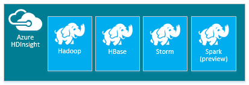
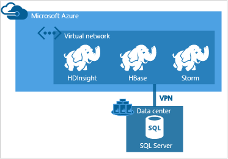
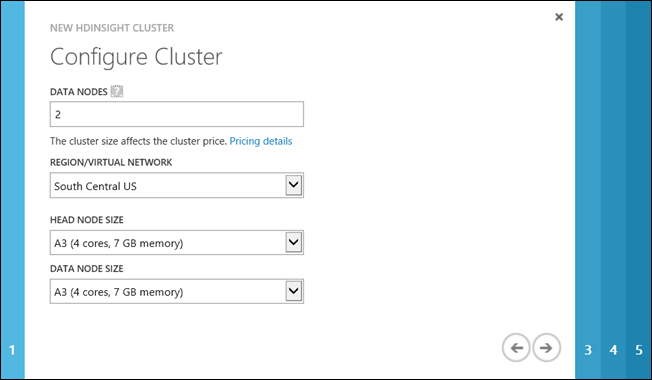
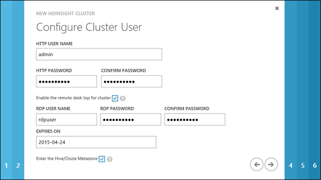
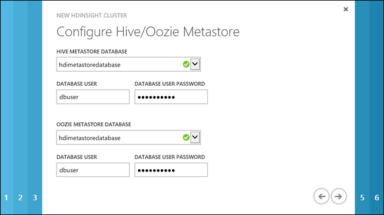
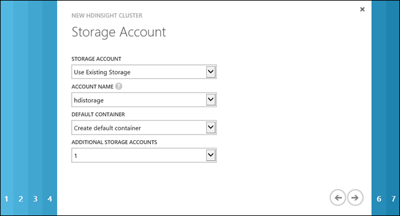

<properties
   pageTitle="在 HDInsight 中创建 Hadoop 群集 | Windows Azure"
   	description="了解如何通过使用 Azure 预览门户、Azure PowerShell、命令行或 .NET SDK 创建 Azure HDInsight 群集。"
   services="hdinsight"
   documentationCenter=""
   tags="azure-portal"
   authors="mumian"
   manager="paulettm"
   editor="cgronlun"/>

<tags
	ms.service="hdinsight"
	ms.date="11/16/2015"
	wacn.date="12/17/2015"/>

# 在 HDInsight 中创建 Hadoop 群集

了解如何规划 HDInsight 群集的创建。

[AZURE.INCLUDE [选择器](../includes/hdinsight-portal-management-selector.md)]

**先决条件：**

在开始按照本文中的说明操作之前，你必须具有以下内容：

- Azure 订阅。请参阅[获取 Azure 试用版](/pricing/1rmb-trial/)。

## 基本配置选项

- **群集名称**

	群集名称用于标识群集。群集名称必须遵循以下准则：

	- 字段必须是包含 3 到 63 个字符的字符串
	- 字段只能包含字母、数字和连字符。

- **订阅名称**

	一个 HDInsight 群集与一个 Azure 订阅绑定。

- **资源组名称**

	应用程序通常由许多组件构成，例如 Web 应用、数据库、数据库服务器、存储和第三方服务。你可以使用 Azure 资源管理器 (ARM) 以组（称为 Azure 资源组）的方式处理应用程序中的资源。你可以通过一个协调的操作为应用程序部署、更新、监视或删除所有资源。你可以使用一个模板来完成部署，该模板适用于不同的环境，例如测试、过渡和生产。你可以通过查看整个组的累积费用，明确了解组织的帐单开支。有关详细信息，请参阅 [Azure 资源管理器概述](/documentation/articles/resource-group-overview)。	
- **操作系统**

	你可以在下列其中一个操作系统上创建 HDInsight 群集：
	- **HDInsight on Windows (Windows Server 2012 R2 Datacenter)**：

- **HDInsight 版本**

	用于确定要用于此群集的 HDInsight 版本。有关详细信息，请参阅 [HDInsight 中的 Hadoop 群集版本和组件](/documentation/articles/hdinsight-component-versioning/)

- **群集类型**和**群集大小（也称为数据节点）**

	HDInsight 可让客户部署各种不同的群集类型，用于不同的数据分析工作负荷。目前提供的群集类型包括：

	- Hadoop 群集：用于查询和分析工作负荷
	- HBase 群集：用于 NoSQL 工作负荷
	- Storm 群集：用于实时事件处理工作负荷

	

	> [AZURE.NOTE]*Azure HDInsight 群集*也称为 *HDInsight 中的 Hadoop 群集*或者 *HDInsight 群集*。有时，该术语可与 *Hadoop 群集*换用。它们都代表托管在 Windows Azure 环境中的 Hadoop 群集。

	在给定的群集类型中，各节点有不同的角色，使客户能够针对特定角色，根据适合其工作负荷的详细信息来调整节点的大小。例如，如果执行的分析作业类型会消耗大量内存，Hadoop 群集可以使用大量内存来创建辅助节点。

	

	HDInsight 的 Hadoop 群集是使用两个角色部署的：

	- 头节点（2 个节点）
	- 数据节点（至少 1 个节点）

	

	HDInsight 的 HBase 群集是使用三个角色部署的：
	- 头服务器（2 个节点）
	- 区域服务器（至少 1 个节点）
	- 主/Zookeeper 节点（3 个节点）

	

	HDInsight 适用的 Storm 群集是使用三个角色部署的：
	- Nimbus 服务器（2 个节点）
	- 监督服务器（至少 1 个节点）
	- Zookeeper 节点（3 个节点）

	客户需根据群集的生存期，支付这些节点的使用费。创建群集之后便开始计费，删除群集时便停止计费（无法取消分配或保留群集）。群集大小会影响群集价格。为了方便学习，建议使用 1 个数据节点。有关 HDInsight 定价的详细信息，请参阅 [HDInsight 定价](/home/features/hdinsight/#price)。

	>[AZURE.NOTE]群集大小限制因 Azure 订阅而异。若要提高限制的大小，请联系计费支持人员。

- **区域/虚拟网络（也称为位置）**

	

	有关受支持区域的列表，请单击 [HDInsight 定价](/home/features/hdinsight/#price)中的“区域”下拉列表。

- **节点大小**

	

	选择节点的 VM 大小。有关详细信息，请参阅[云服务的大小](/documentation/articles/cloud-services-sizes-specs)

	根据所选的 VM，你的成本可能会有所不同。HDInsight 对群集节点使用所有标准层 VM。有关 VM 大小如何影响价格的信息，请参阅 <a href="/home/features/hdinsight/#price" target="_blank">HDInsight 价格</a>。

- **HDInsight 用户**

	HDInsight 群集允许你在预配期间配置两个用户帐户：

	- HTTP 用户。默认用户名是在 Azure 管理门户上使用基本配置创建的 admin。
	- RDP 用户（Windows 群集）：用于通过 RDP 连接到群集。在创建帐户时，必须将过期日期设置为从当天算起的 90 天。

- **Azure 存储帐户**

	原始 HDFS 使用群集上的多个本地磁盘。HDInsight 使用 Azure Blob 存储来存储数据。Azure Blob 存储是一种稳健、通用的存储解决方案，它与 HDInsight 无缝集成。通过 Hadoop 分布式的文件系统 (HDFS) 界面，可以针对 Blob 存储中的结构化或非结构化数据直接运行 HDInsight 中的整套组件。通过将数据存储在 Blob 存储中，你可以安全删除用于计算的 HDInsight 群集而不会丢失用户数据。

	在配置期间，你必须指定 Azure 存储帐户，并在该 Azure 存储帐户中指定 Azure Blob 存储容器。某些创建过程要求事先创建 Azure 存储帐户和 Blob 存储容器。群集使用该 Blob 存储容器作为默认存储位置。你也可以选择指定群集可访问的其他 Azure 存储帐户（链接的存储）。此外，群集还可以访问任何配置有完全公共读取权限或仅限对 blob 的公共读取权限的 Blob 容器。有关限制访问的详细信息，请参阅[管理对 Azure 存储资源的访问](/documentation/articles/storage-manage-access-to-resources)。

	

	>[AZURE.NOTE]Blob 存储容器提供一组 Blob 集，如图所示：

	

	>[AZURE.WARNING]不要对多个群集共享一个 Blob 存储容器。此操作不受支持。

	有关使用辅助 Blob 存储的详细信息，请参阅[将 Azure Blob 存储与 HDInsight 配合使用](/documentation/articles/hdinsight-hadoop-use-blob-storage)。

- **Hive/Oozie 元存储**

	元存储包含 Hive 和 Oozie 元数据，例如 Hive 表、分区、架构和列。使用元存储有助于保留你的 Hive 和 Oozie 元数据，这样，在创建新群集时，你不需要重新创建 Hive 表或 Oozie 作业。默认情况下，Hive 使用嵌入的 Azure SQL 数据库存储此信息。在删除群集时，嵌入的数据库无法保留元数据。例如，你使用 Hive 元存储创建了一个群集。你创建了一些 Hive 表。在删除群集并通过相同的 Hive 元存储重建群集之后，便可以看到在原始群集中创建的 Hive 表。
    
    > [AZURE.NOTE]元存储配置不可用于 HBase 群集类型。

## 高级配置选项

>[AZURE.NOTE]本部分目前仅适用于基于 Windows 的 HDInsight 群集。

### 使用 HDInsight 群集自定义功能来自定义群集

有时，你可能需要配置配置文件。以下是其中的一些配置文件。

- core-site.xml
- hdfs-site.xml
- mapred-site.xml
- yarn-site.xml
- hive-site.xml
- oozie-site.xml

群集无法保留重新制作映像所造成的更改。有关详细信息，请参阅[重新启动角色实例进行 OS 升级](http://blogs.msdn.com/b/kwill/archive/2012/09/19/role-instance-restarts-due-to-os-upgrades.aspx)。若要在群集生存期保留更改，你可以在创建过程中使用 HDInsight 群集自定义。

下面是用于自定义 Hive 配置的 Azure PowerShell 脚本示例：

	# hive-site.xml configuration
	$hiveConfigValues = @{ "hive.metastore.client.socket.timeout"="90" }
	
	$config = New-AzureRmHDInsightClusterConfig `
		| Set-AzureRmHDInsightDefaultStorage `
			-StorageAccountName "$defaultStorageAccountName.blob.core.chinacloudapi.cn" `
			-StorageAccountKey $defaultStorageAccountKey `
		| Add-AzureRmHDInsightConfigValues `
			-HiveSite $hiveConfigValues 
	
	New-AzureRmHDInsightCluster `
		-ResourceGroupName $existingResourceGroupName `
		-ClusterName $clusterName `
		-Location $location `
		-ClusterSizeInNodes $clusterSizeInNodes `
		-ClusterType Hadoop `
		-OSType Windows `
		-Version "3.2" `
		-HttpCredential $httpCredential `
		-Config $config 

下面是有关自定义其他配置文件的更多示例：

	# hdfs-site.xml configuration
	$HdfsConfigValues = @{ "dfs.blocksize"="64m" } #default is 128MB in HDI 3.0 and 256MB in HDI 2.1

	# core-site.xml configuration
	$CoreConfigValues = @{ "ipc.client.connect.max.retries"="60" } #default 50

	# mapred-site.xml configuration
	$MapRedConfigValues = @{ "mapreduce.task.timeout"="1200000" } #default 600000

	# oozie-site.xml configuration
	$OozieConfigValues = @{ "oozie.service.coord.normal.default.timeout"="150" }  # default 120

有关详细信息，请参阅 Azim Uddin 的标题为[自定义 HDInsight 群集创建](http://blogs.msdn.com/b/bigdatasupport/archive/2014/04/15/customizing-hdinsight-cluster-provisioning-via-powershell-and-net-sdk.aspx)的博客。

### 使用脚本操作自定义群集

你可以在创建期间通过使用脚本安装其他组件或自定义群集配置。此类脚本可通过“脚本操作”调用，脚本操作是一种配置选项，可通过预览门户、HDInsight Windows PowerShell cmdlet 或 HDInsight .NET SDK 使用。有关详细信息，请参阅[使用脚本操作自定义 HDInsight 群集](/documentation/articles/hdinsight-hadoop-customize-cluster)。

### 使用 Azure 虚拟网络

[Azure 虚拟网络](/documentation/services/networking/)允许你创建包含需要用于解决方案的资源的安全永久性网络。通过虚拟网络，你可以：

* 在专用网络（仅限云）中将云资源连接在一起。

	

* 通过使用虚拟专用网络 (VPN) 将云资源连接到本地数据中心网络（站点到站点或点到站点）。

	利用站点到站点配置，你可以通过使用硬件 VPN 或路由和远程访问服务将多个资源从数据中心连接到 Azure 虚拟网络。

	

	利用点到站点配置，你可以通过使用软件 VPN 将特定资源连接到 Azure 虚拟网络。

	

有关虚拟网络特性、优势和功能的详细信息，请参阅 [Azure 虚拟网络概述](/documentation/articles/virtual-networks-overview)。

> [AZURE.NOTE]你必须先创建 Azure 虚拟网络，然后才能设置 HDInsight 群集。有关详细信息，请参阅[在虚拟网络中创建 Hadoop 群集](/documentation/articles/hdinsight-hbase-provision-vnet#provision-an-hbase-cluster-into-a-virtual-network)。
>
> Azure HDInsight 仅支持基于位置的虚拟网络，并且当前不适用于基于地缘组的虚拟网络。使用 Azure PowerShell Cmdlet Get-AzureVNetConfig 来检查现有的 Azure 虚拟网络是否基于位置。如果虚拟网络并非基于位置，你可以使用以下选项：
>
> - 导出现有的虚拟网络配置，然后创建新的虚拟网络。默认情况下，所有新的虚拟网络都基于位置。
> - 迁移到基于位置的虚拟网络。请参阅[将现有服务迁移到区域范围](http://azure.microsoft.com/blog/2014/11/26/migrating-existing-services-to-regional-scope/)。
>
> 强烈建议为一个群集指定一个子网。

## 使用管理门户创建

HDInsight 群集使用 Azure Blob 存储容器作为默认文件系统。创建 HDInsight 群集前，需要具有位于同一数据中心的 Azure 存储帐户。有关详细信息，请参阅[将 Azure Blob 存储与 HDInsight 配合使用](/documentation/articles/hdinsight-hadoop-use-blob-storage)。有关创建 Azure 存储帐户的详细信息，请参阅[如何创建存储帐户](/documentation/articles/storage-create-storage-account)。

> [AZURE.NOTE]目前，只有**中国北部**和**中国东部**区域可以托管 HDInsight 群集。

**创建 HDInsight 群集**

1. 登录到 [Azure 管理门户][azure-management-portal]。
2. 单击页面底部的“+ 新建'，然后依次单击“数据服务”、“HDINSIGHT”和“自定义创建”。
3. 在“群集详细信息”页上，键入或选择以下值：

	![提供 Hadoop HDInsight 群集详细信息][image-customprovision-page1]

    <table border='1'>
	<tr><th>属性</th><th>值</th></tr>
	<tr><td>群集名称</td>
		<td>
命名群集。

			<ul>
			<li>域名系统 (DNS) 名称必须以字母数字字符开头和结尾，并且可以包含短划线。</li>
			<li>字段必须是介于 3 到 63 个字符之间的字符串。</li>
			</ul></td></tr>
	<tr><td>群集类型</td>
		<td>对于群集类型，请选择“Hadoop”。<strong></strong></td></tr>
	<tr><td>HDInsight 版本</td>
		<td>选择版本。对于 Hadoop，默认值为 HDInsight 版本 3.1，该版本使用 Hadoop 2.4。</td></tr>
	</table>
	
	输入或选择表中所示的值，然后单击右箭头。

4. 在“配置群集”页上，输入或选择以下值：

	

	<table border="1">
<tr><th>Name</th><th>值</th></tr>
<tr><td>数据节点</td><td>要部署的数据节点的数目。出于测试目的，创建一个单节点群集。 群集大小限制因 Azure 订阅而异。若要提高限制的大小，请联系 Azure 计费支持。</td></tr>
<tr><td>区域/虚拟网络</td><td>
选择与上一个过程中创建的存储帐户相同的区域。HDInsight 要求存储帐户位于同一区域中。稍后，在配置中，你只能选择位于你在此处指定的区域中的存储帐户。

 可用区域为：<strong>中国东部</strong>、<strong>中国北部</strong>。 如果你创建了 Azure 虚拟网络，则可以选择 HDInsight 群集要配置使用的网络。

有关创建 Azure 虚拟网络的详细信息，请参阅 [虚拟网络配置任务](http://msdn.microsoft.com/zh-cn/library/azure/jj156206.aspx)。
</td></tr>
<tr><td>头节点大小</td><td>
为头节点选择虚拟机 (VM) 大小。
</td></tr>
<tr><td>数据节点大小</td><td>
为数据节点选择 VM 大小。
</td></tr>
</table>

	>[AZURE.NOTE]根据所选的 VM，你的成本可能会有所不同。HDInsight 对群集节点使用所有标准层 VM。有关 VM 大小如何影响价格的信息，请参阅 <a href="/home/features/hdinsight/#price" target="_blank">HDInsight 价格</a>。

5. 在“配置群集用户”页上提供以下值：

    

    <table border='1'>
		<tr><th>属性</th><th>值</th></tr>
		<tr><td>HTTP 用户名</td>
			<td>指定 HDInsight 群集用户名。</td></tr>
		<tr><td>HTTP 密码/确认密码</td>
			<td>指定 HDInsight 群集用户密码。</td></tr>
		<tr><td>为群集启用远程桌面</td>
			<td>在设置后，选中此复选框，以为可远程连接到群集节点的远程桌面用户指定用户名、密码和到期日期。稍后，你还可以在设置了群集后启用远程桌面。有关说明，请参阅<a href="/documentation/articles/hdinsight-administer-use-management-portal-v1/#rdp" target="_blank">使用 RDP 连接到 HDInsight 群集</a>。</td></tr>
		<tr><td>输入 Hive/Oozie 元存储</td>
			<td>选中此复选框可指定要用作 Hive/Oozie 元存储的群集所在数据中心上的 SQL 数据库。如果你选中此复选框，则必须在向导的后续页中指定有关 Azure SQL 数据库的详细信息。如果你希望即使在删除群集后也会保留有关 Hive/Oozie 作业的元数据，则此选项将十分有用。</td></tr>
		</td></tr>		
	</table>
	
	单击右箭头。

6. 在“配置 Hive/Oozie 元存储”页上提供以下值：

    

	指定要用作 Hive/Oozie 元存储的 Azure SQL 数据库。你可以为 Hive 和 Oozie 元存储指定相同的数据库。此 SQL 数据库必须与 HDInsight 群集位于同一数据中心。该列表框只列出你在“群集详细信息”页中指定的同一数据中心的 SQL 数据库<strong></strong>。另请指定用于连接到你选择的 Azure SQL 数据库的用户名和密码。

    >[AZURE.NOTE]用于元存储的 Azure SQL 数据库必须允许连接到其他 Azure 服务，包括 Azure HDInsight。在 Azure SQL 数据库仪表板的右侧单击服务器名称。这是运行 SQL 数据库实例的服务器。进入服务器视图后，请单击“配置”，单击“Azure 服务”对应的“是”，然后单击“保存”。

    单击右箭头。

7. 在“存储帐户”页上提供以下值：

    

	<table border='1'>
		<tr><th>属性</th><th>值</th></tr>
		<tr><td>存储帐户</td>
			<td>为 HDInsight 群集指定将用作默认文件系统的 Azure 存储帐户。可以选择以下三个选项之一：
			<ul>
				<li><strong>使用现有存储</strong></li>
				<li><strong>创建新存储</strong></li>
				<li><strong>使用其他订阅中的存储</strong></li>
			</ul>
			</td></tr>
		<tr><td>帐户名</td>
			<td><ul>
				<li>如果选择了使用现有存储，请为“帐户名”选择现有的存储帐户<strong></strong>。下拉列表仅列出你选择设置群集的相同数据中心内的存储帐户。</li>
				<li>如果选择了“创建新存储”或“使用其他订阅中的存储”选项，则必须提供存储帐户名<strong></strong><strong></strong>。</li>
			</ul></td></tr>
		<tr><td>帐户密钥</td>
			<td>如果选择了“使用其他订阅中的存储”选项，请指定该存储帐户的帐户密钥<strong></strong>。</td></tr>
		<tr><td>默认容器</td>
			<td>
指定存储帐户上用作 HDInsight 群集默认文件系统的默认容器。如果为“存储帐户”字段选择了“使用现有存储”，并且该帐户中不存在现有容器，则默认情况下，将创建与群集同名的容器<strong></strong><strong></strong>。如果已存在与群集同名的容器，则将在容器名称后追加一个序列号。例如，mycontainer1、mycontainer2，等等。但是，如果现有存储帐户的容器名称与你指定的群集名称不同，则你也可以使用该容器。

	        
如果选择了创建新存储或使用其他 Azure 订阅中的存储，则必须指定默认容器名称。

	    </td></tr>
		<tr><td>其他存储帐户</td>
			<td>HDInsight 支持多个存储帐户。一个群集可以使用的其他存储帐户数没有限制。但是，如果你通过使用 Azure 管理门户创建群集，则由于 UI 限制，你最多只能创建七个存储帐户。指定的每个其他存储帐户将在向导中添加一个额外的“存储帐户”页，以便你在此指定帐户信息。例如，在上面的屏幕截图中，选择了 1 个附加的存储帐户，因此第 5 页添加到了对话框。</td></tr>
	</table>

	单击右箭头。

7. 如果你选择了为群集配置其他存储，请在“存储帐户”页上，输入其他存储帐户的帐户信息：

	

    同样，你可以选择从现有存储创建新存储，或者使用其他 Azure 订阅中的存储。提供值的过程类似于前面的步骤。

    > [AZURE.NOTE]一旦为 HDInsight 群集选择了 Azure 存储帐户，就不能再删除该帐户，也不能将它更改为另一帐户。

8. 在“脚本操作”页上，单击“添加脚本操作”，以在创建群集时提供有关要运行以自定义群集的自定义脚本的详细信息。有关详细信息，请参阅[使用脚本操作自定义 HDInsight 群集](/documentation/articles/hdinsight-hadoop-customize-cluster)。
	
	

	<table border='1'>
		<tr><th>属性</th><th>值</th></tr>
		<tr><td>Name</td>
			<td>指定脚本操作的名称。</td></tr>
		<tr><td>脚本 URI</td>
			<td>指定调用以自定义群集的脚本的统一资源标识符 (URI)。</td></tr>
		<tr><td>节点类型</td>
			<td>指定在其上运行自定义脚本的节点。你可以选择“所有节点”、“仅限头节点”或“仅限数据节点”。<b></b><b></b><b></b>
		<tr><td>Parameters</td>
			<td>根据脚本的需要，指定参数。</td></tr>
	</table>

你可以添加多个脚本操作，以在群集上安装多个组件。添加脚本后，单击复选标记以开始设置群集。

## 使用 Azure PowerShell 创建
Azure PowerShell 是一个功能强大的脚本编写环境，可用于在 Azure 中控制和自动执行工作负荷的部署和管理。本部分提供有关如何通过使用 Azure PowerShell 设置 HDInsight 群集的说明。有关配置工作站以运行 HDInsight Windows Powershell cmdlet 的信息，请参阅[安装和配置 Azure PowerShell](/documentation/articles/powershell-install-configure)。有关将 Azure PowerShell 与 HDInsight 配合使用的详细信息，请参阅[使用 PowerShell 管理 HDInsight](/documentation/articles/hdinsight-administer-use-powershell)。有关 HDInsight Windows PowerShell cmdlet 的列表，请参阅 [HDInsight cmdlet 参考](https://msdn.microsoft.com/zh-cn/library/azure/dn858087.aspx)。

通过使用 Azure PowerShell 创建 HDInsight 群集需要执行以下过程：

- 创建 Azure 资源组
- 创建 Azure 存储帐户
- 创建 Azure Blob 容器
- 创建 HDInsight 群集

	$subscriptionId = "<Azure Subscription ID>"
	
	$newResourceGroupName = "<Azure Resource Group Name>" 
	$location = "<Azure Location>" # 例如，"China East 2" 
	$newDefaultStorageAccountName = "<Azure Storage Account Name>" 
	$newClusterName = "<Azure HDInsight Cluster Name>" 
	$clusterSizeInNodes = 1
	
	###########################################
	# 登录 Azure
	###########################################
	$china = Get-AzureRmEnvironment -Name AzureChinaCloud; Login-AzureRmAccount -Environment $china
	Select-AzureRmSubscription -SubscriptionId $subscriptionId
	
	###########################################
	# 创建资源组
	###########################################
	New-AzureRmResourceGroup -Name $newRresourceGroupName -Location $location
	
	###########################################
	# 准备默认存储帐户和容器
	###########################################
	New-AzureRmStorageAccount -ResourceGroupName $newResourceGroupName -Name $newDefaultStorageAccountName -Location $location
	
	$defaultStorageAccountKey = Get-AzureRmStorageAccountKey -ResourceGroupName $newResourceGroupName -Name $newDefaultStorageAccountName |  %{ $_.Key1 }
	$defaultStorageContext = New-AzureStorageContext -StorageAccountName $newDefaultStorageAccountName -StorageAccountKey $defaultStorageAccountKey
	New-AzureStorageContainer -Name $newClusterName -Context $defaultStorageContext #use the cluster name as the container name
		
	###########################################
	# 创建群集
	########################################### 
	$httpCredential =Get-Credential -Message "输入 HTTP 帐户凭据:" New-AzureRmHDInsightCluster `
	New-AzureRmHDInsightCluster `
		-ResourceGroupName $newResourceGroupName `
		-ClusterName $newClusterName `
		-Location $location `
		-ClusterSizeInNodes $clusterSizeInNodes `
		-ClusterType Hadoop `
		-OSType Windows `
		-Version "3.2" `
		-HttpCredential $httpCredential 

## 使用 HDInsight .NET SDK 创建

HDInsight .NET SDK 提供 .NET 客户端库，可简化从 .NET 应用程序使用 HDInsight 的操作。请遵照以下说明创建一个 Visual Studio 控制台应用程序，并粘贴用于创建群集的代码。

**创建 Visual Studio 控制台应用程序**

1. 在 Visual Studio 中创建新的 C# 控制台应用程序。
2. 在 Nuget 包管理器控制台中输入以下 Nuget 命令。

		Install-Package Microsoft.Azure.Common.Authentication -pre
		Install-Package Microsoft.Azure.Management.HDInsight -Pre

6. 在解决方案资源管理器中双击 **Program.cs** 将它打开，粘贴以下代码，并提供变量的值：

		using System;
		using System.Security;
		using Microsoft.Azure;
		using Microsoft.Azure.Common.Authentication;
		using Microsoft.Azure.Common.Authentication.Factories;
		using Microsoft.Azure.Common.Authentication.Models;
		using Microsoft.Azure.Management.HDInsight;
		using Microsoft.Azure.Management.HDInsight.Models;
		
		namespace CreateHDInsightCluster
		{
			class Program
			{
				private static HDInsightManagementClient _hdiManagementClient;
		
				private static Guid SubscriptionId = new Guid("<Azure Subscription ID");
				private const string ExistingResourceGroupName = "<Azure Resource Group Name>";
				private const string ExistingStorageName = "<Default Storage Account Name>.blob.core.chinacloudapi.cn";
				private const string ExistingStorageKey = "<Default Storage Account Key>";
				private const string ExistingBlobContainer = "<Default Blob Container Name>";
				private const string NewClusterName = "<HDInsight Cluster Name>";
				private const int NewClusterNumNodes = 1;
				private const string NewClusterLocation = "EAST US 2";     // Must be the same as the default Storage account
				private const OSType NewClusterOsType = OSType.Windows;
				private const HDInsightClusterType NewClusterType = HDInsightClusterType.Hadoop;
				private const string NewClusterVersion = "3.2";
				private const string NewClusterUsername = "admin";
				private const string NewClusterPassword = "<HTTP User password";
		
				static void Main(string[] args)
				{
					System.Console.WriteLine("Running");
		
					var tokenCreds = GetTokenCloudCredentials();
					var subCloudCredentials = GetSubscriptionCloudCredentials(tokenCreds, SubscriptionId);
		
					_hdiManagementClient = new HDInsightManagementClient(subCloudCredentials);
				
					var parameters = new ClusterCreateParameters
					{
						ClusterSizeInNodes = NewClusterNumNodes,
						UserName = NewClusterUsername,
						Password = NewClusterPassword,
						Location = NewClusterLocation,
						DefaultStorageAccountName = ExistingStorageName,
						DefaultStorageAccountKey = ExistingStorageKey,
						DefaultStorageContainer = ExistingBlobContainer,
						ClusterType = NewClusterType,
						OSType = NewClusterOsType
					};
		
					_hdiManagementClient.Clusters.Create(ExistingResourceGroupName, NewClusterName, parameters);
				}
				private static void CreateCluster()
				{
					var parameters = new ClusterCreateParameters
					{
						ClusterSizeInNodes = NewClusterNumNodes,
						UserName = NewClusterUsername,
						Password = NewClusterPassword,
						Location = NewClusterLocation,
						DefaultStorageAccountName = ExistingStorageName,
						DefaultStorageAccountKey = ExistingStorageKey,
						DefaultStorageContainer = ExistingBlobContainer,
						ClusterType = NewClusterType,
						OSType = NewClusterOsType
					};
		
					_hdiManagementClient.Clusters.Create(ExistingResourceGroupName, NewClusterName, parameters);
				}
		
				public static TokenCloudCredentials GetTokenCloudCredentials(string username = null, SecureString password = null)
				{
					var authFactory = new AuthenticationFactory();
		
					var account = new AzureAccount { Type = AzureAccount.AccountType.User };
		
					if (username != null && password != null)
						account.Id = username;
		
					var env = AzureEnvironment.PublicEnvironments[EnvironmentName.AzureCloud];
		
					var accessToken =
						authFactory.Authenticate(account, env, AuthenticationFactory.CommonAdTenant, password, ShowDialog.Auto)
							.AccessToken;
		
					return new TokenCloudCredentials(accessToken);
				}
		
				public static SubscriptionCloudCredentials GetSubscriptionCloudCredentials(TokenCloudCredentials creds, Guid subId)
				{
					return new TokenCloudCredentials(subId.ToString(), creds.Token);
		
				}
			}
		}

7. 按 **F5** 运行应用程序。控制台窗口应打开并显示应用程序的状态。系统还会提示你输入 Azure 帐户凭据。设置一个 HDInsight 群集可能需要几分钟时间。

## 使用本地 SQL Server Integration Services 创建

你还可以使用 SQL Server Integration Services (SSIS) 来创建或删除 HDInsight 群集。Azure Feature Pack for SSIS 提供适用于 HDInsight 群集的以下组件。

- [Azure HDInsight Create Cluster Task][ssisclustercreate]
- [Azure HDInsight Delete Cluster Task][ssisclusterdelete]
- [Azure 订阅连接管理器][connectionmanager]

在[此处][ssispack]了解有关 Azure Feature Pack for SSIS 的详细信息。

##后续步骤
在本文中，你已经学习了几种创建 HDInsight 群集的方法。若要了解更多信息，请参阅下列文章：

* [Azure HDInsight 入门](/documentation/articles/hdinsight-hadoop-tutorial-get-started-windows) - 了解如何开始使用你的 HDInsight 群集
* [将 Sqoop 与 HDInsight 配合使用](/documentation/articles/hdinsight-use-sqoop) - 了解如何在 HDInsight 和 SQL 数据库或 SQL Server 之间复制数据
* [使用 PowerShell 管理 HDInsight](/documentation/articles/hdinsight-administer-use-powershell) - 了解如何通过 Azure PowerShell 使用 HDInsight
* [以编程方式提交 Hadoop 作业](/documentation/articles/hdinsight-submit-hadoop-jobs-programmatically) - 了解如何以编程方式将作业提交到 HDInsight
* [Azure HDInsight SDK 文档][hdinsight-sdk-documentation] - 探索 HDInsight SDK

##附录 A - ARM 模板

以下 Azure 资源管理器模板使用相关的 Azure 存储帐户创建 Hadoop 群集。

	{
	  "$schema": "https://schema.management.azure.com/schemas/2015-01-01/deploymentTemplate.json#",
	  "contentVersion": "1.0.0.0",
	  "parameters": {
	    "location": {
	      "type": "string",
	      "defaultValue": "China North",
	      "allowedValues": [
	        "China North"
	      ],
	      "metadata": {
	        "description": "The location where all azure resources will be deployed."
	      }
	    },
	    "clusterName": {
	      "type": "string",
	      "metadata": {
	        "description": "The name of the HDInsight cluster to create."
	      }
	    },
	    "clusterLoginUserName": {
	      "type": "string",
	      "defaultValue": "admin",
	      "metadata": {
	        "description": "These credentials can be used to submit jobs to the cluster and to log into cluster dashboards."
	      }
	    },
	    "clusterLoginPassword": {
	      "type": "securestring",
	      "metadata": {
	        "description": "The password for the cluster login."
	      }
	    },
	    "sshUserName": {
	      "type": "string",
	      "defaultValue": "username",
	      "metadata": {
	        "description": "These credentials can be used to remotely access the cluster and the edge node virtual machine."
	      }
	    },
	    "sshPassword": {
	      "type": "securestring",
	      "metadata": {
	        "description": "The password for the ssh user."
	      }
	    },
	    "clusterStorageAccountName": {
	      "type": "string",
	      "metadata": {
	        "description": "The name of the storage account to be created and be used as the cluster's storage."
	      }
	    },
	    "clusterStorageType": {
	      "type": "string",
	      "defaultValue": "Standard_LRS",
	      "allowedValues": [
	        "Standard_LRS",
	        "Standard_GRS",
	        "Standard_ZRS"
	      ]
	    },
	    "clusterWorkerNodeCount": {
	      "type": "int",
	      "defaultValue": 4,
	      "metadata": {
	        "description": "The number of nodes in the HDInsight cluster."
	      }
	    }
	  },
	  "variables": {},
	  "resources": [
	    {
	      "name": "[parameters('clusterStorageAccountName')]",
	      "type": "Microsoft.Storage/storageAccounts",
	      "location": "[parameters('location')]",
	      "apiVersion": "2015-05-01-preview",
	      "dependsOn": [],
	      "tags": {},
	      "properties": {
	        "accountType": "[parameters('clusterStorageType')]"
	      }
	    }
	  ],
	  "outputs": {
	    "cluster": {
	      "type": "object",
	      "value": "[reference(resourceId('Microsoft.HDInsight/clusters',parameters('clusterName')))]"
	    }
	  }
	}

[hdinsight-sdk-documentation]: http://msdn.microsoft.com/zh-cn/library/dn479185.aspx
[azure-preview-portal]: https://manage.windowsazure.cn
[connectionmanager]: http://msdn.microsoft.com/zh-cn/library/mt146773(v=sql.120).aspx
[ssispack]: http://msdn.microsoft.com/zh-cn/library/mt146770(v=sql.120).aspx
[ssisclustercreate]: http://msdn.microsoft.com/zh-cn/library/mt146774(v=sql.120).aspx
[ssisclusterdelete]: http://msdn.microsoft.com/zh-cn/library/mt146778(v=sql.120).aspx

<!---HONumber=Mooncake_1207_2015-->