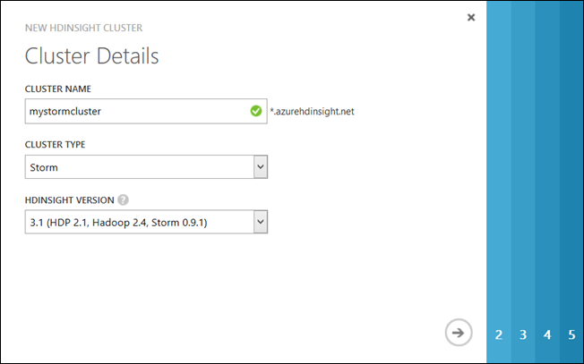
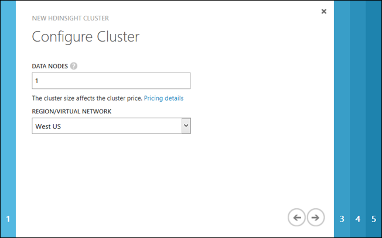
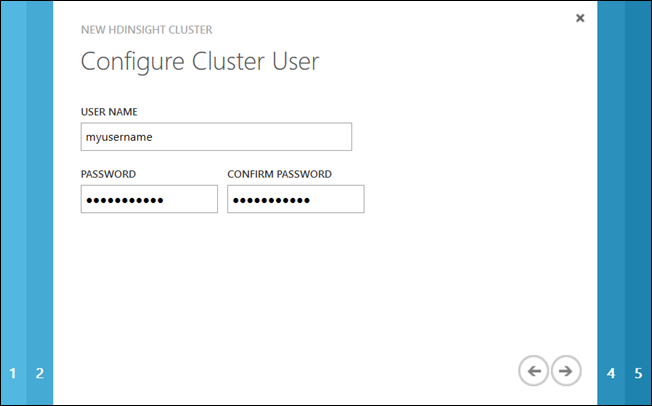
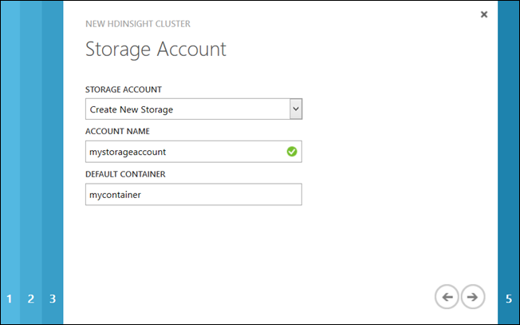
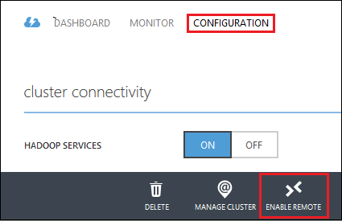
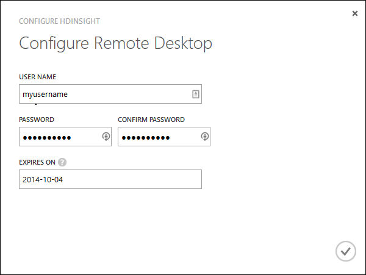
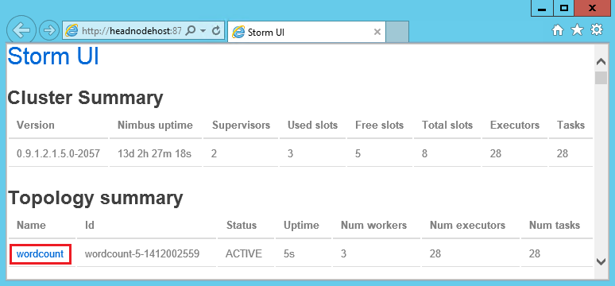
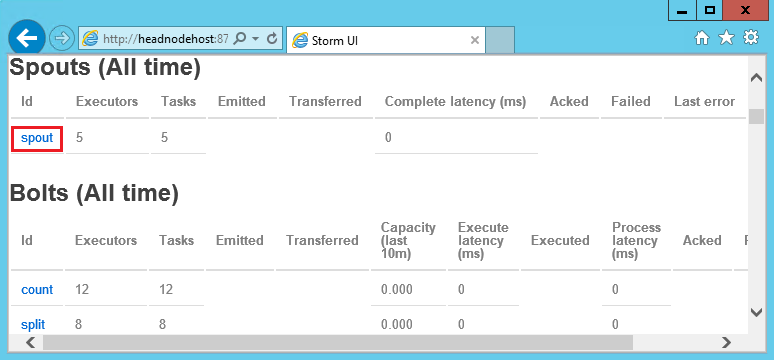
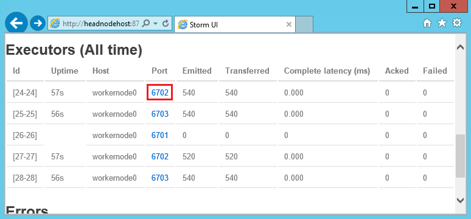

<properties title="Getting started using Storm with Hadoop in HDInsight" pageTitle="开始将 Apache Storm 与 Windows Azure HDInsight 配合使用 (Hadoop)" description="Learn how to use  Apache Storm to process data in realtime with HDInsight (Hadoop)" metaKeywords="Azure hdinsight storm, Azure hdinsight realtime, azure hadoop storm, azure hadoop realtime, azure hadoop real-time, azure hdinsight real-time" services="hdinsight" solutions="" documentationCenter="big-data" authors="larryfr" videoId="" scriptId="" />

<tags 
wacn.date="04/11/2015"
ms.service="hdinsight" ms.workload="big-data" ms.tgt_pltfrm="na" ms.devlang="na" ms.topic="article" ms.date="09/30/2014" ms.author="larryfr" />

# 开始将 Storm 与 HDInsight 配合使用 (Hadoop)

Apache Storm 是一个可扩展的、具有容错能力的分布式实时计算系统，用于处理数据流。使用 Azure HDInsight，你可以创建基于云的 Hadoop 群集，该群集使用 Storm 进行实时数据分析。

## 在本教程中，你将学习...

* [如何设置 HDInsight Storm 群集](#provision)

* [如何连接至该群集](#connect)

* [如何运行 Storm 拓扑](#run)

* [如何监视 Storm 拓扑](#monitor)

* [如何停止 Storm 拓扑](#stop)

* [后续步骤](#next)

## 开始之前

你必须具备以下条件才能成功完成本教程。

* Azure 订阅

* Windows Azure PowerShell

* 如果你不熟悉 Apache Storm，应先阅读文章[《HDInsight Storm 概述》](/zh-cn/documentation/articles/hdinsight-storm-overview)。

## 在 Azure 门户中设置 Storm 群集

[WACOM.INCLUDE [provisioningnote](../includes/hdinsight-provisioning.md)]

1. 登录到 [Azure 管理门户][azureportal]

2. 单击位于左侧的 **HDInsight**，然后单击页面左下角的 **+ 新建**。

3. 单击第二列中的 HDInsight 图标，然后选择**自定义**。

4. 在**群集详细信息**页面上，输入新群集的名称，并选择 **Storm** 作为**群集类型**。选择箭头以继续。

	

5. 输入用于此群集的**数据节点**的数量，然后输入将在其中创建此群集的**区域/虚拟网络**。选择箭头以继续。

	> [WACOM.NOTE] 为了最大限度地降低用于本文的群集的成本，请将**群集大小**降为 1，并在使用完毕后，将此群集删除。

	

6. 输入管理员**用户名**和**密码**，然后选择箭头以继续。

	

4. 对于**存储帐户**，选择**创建新存储**，或者选择现有的存储帐户。选择或输入要使用的**帐户名称**和**默认容器**。单击左下角的勾选图标以创建该 Storm 群集。

	

## 使用 HDInsight Storm

对于 HDInsight Storm 的预览版，你必须通过远程桌面连接至群集，才能使用 Storm。使用以下步骤连接至 HDInsight 群集和使用 Storm 命令。

### 连接至群集

1. 使用 [Azure 管理门户][的管理功能]启用至你的 HDInsight 群集的远程桌面连接。在门户中，选择你的 HDInsight 群集，然后选择位于"__配置__"页面底部的"__启用远程__"。

    

    出现提示时，输入用于远程会话的用户名和密码。你还必须选择远程访问的过期日期。

	

2. 远程访问一旦启用后，选择"__连接__"开始连接。这将会下载 __.rdp__ 文件，该文件可用于启动远程桌面会话。

    

	> [WACOM.NOTE] 连接至远程计算机时，你可能会收到用于信任证书的多个提示。

3. 连接后，使用桌面上的"__Hadoop 命令行__"图标打开 Hadoop 命令行。

	

3. 在 Hadoop 命令行中，使用以下命令将目录更改为包含 Storm 命令的目录。

	cd %storm_home%\bin

4. 如要查看可用命令的列表，请输入不带任何参数的"storm"。

HDInsight 群集带有多个示例 Storm 拓扑。以下步骤将会使用示例 **WordcountTopology**。有关 HDInsight Storm 附带示例的详细信息，请参阅[后续步骤](#next)。

### 运行 Storm 拓扑

若要运行 **WordCountTopology**，请使用以下命令。

	storm jar ..\contrib\storm-starter\storm-starter-<version>-jar-with-dependencies.jar storm.starter.WordCountTopology wordcount

这将告诉 Storm，我们想要运行 **wordcount** 拓扑，该拓扑来自 **storm.starter.WordCountTopology** 类，它包含在 **storm-starter-&lt;version>-jar-with-dependencies.jar** 文件中。该文件以及其他 Storm 示例位于 %storm_home% 目录下的 contrib 文件夹中。

> [WACOM.NOTE] 包含示例的 JAR 文件的版本可能会定期变化。运行此命令时，指定你的群集附带的文件的版本。

请注意，当你输入命令时，不会返回任何内容。**Storm 拓扑一旦启动，就将一直运行，直到你将其停止。** WordCountTopology 将生成随机的句子，并会一直计算所遇到的每个单词的出现次数，直到你将其停止。

### 监视 Storm 拓扑的状态

WordCountTopology 示例不会将输出写入目录，但我们可以使用 Storm UI 网页来查看拓扑的状态以及输出。

1. 使用远程桌面，连接至你的 HDInsight 群集。

2. 从桌面打开 **Storm UI** 链接。这将会显示 Storm UI 网页。在**拓扑摘要**下，选择 **wordcount** 条目。

	

	这将会显示拓扑的统计信息，包括组成拓扑的组件、**spout** 和 **bolt**。

5. 选择页面中的 **spout** 链接，然后选择**执行者（全部时间）**列表中**已发出**和**已传输**列数值大于 0 的某个条目的**端口**号。

	

	

	> [WACOM.NOTE] 根据群集中的节点的数量，以及你正在运行的拓扑，拓扑开始处理前可能需要花费数分钟的时间。定期刷新页面，直到**已发出**和**已传输**的值开始增加。

6. 你应看到所含信息与以下信息类似的页面。

		2014-09-24 14:16:22 b.s.d.task [INFO] Emitting: spout default [snow white and the seven dwarfs] 
		2014-09-24 14:16:22 b.s.d.executor [INFO] Processing received message source: split:17, stream: default, id: {}, [and] 
		2014-09-24 14:16:22 b.s.d.task [INFO] Emitting: count default [and, 16774] 
		2014-09-24 14:16:22 b.s.d.executor [INFO] Processing received message source: split:20, stream: default, id: {}, [and] 
		2014-09-24 14:16:22 b.s.d.task [INFO] Emitting: count default [and, 16775] 
		2014-09-24 14:16:22 b.s.d.executor [INFO] Processing received message source: split:17, stream: default, id: {}, [dwarfs] 
		2014-09-24 14:16:22 b.s.d.task [INFO] Emitting: count default [dwarfs, 8359] 
		2014-09-24 14:16:22 b.s.d.executor [INFO] Processing received message source: split:20, stream: default, id: {}, [dwarfs] 
		2014-09-24 14:16:22 b.s.d.task [INFO] Emitting: count default [dwarfs, 8360] 
		2014-09-24 14:16:22 b.s.d.task [INFO] Emitting: spout default [i am at two with nature] 
		2014-09-24 14:16:22 b.s.d.executor [INFO] Processing received message source: split:23, stream: default, id: {}, [two] 
		2014-09-24 14:16:22 b.s.d.task [INFO] Emitting: count default [two, 8236] 
		2014-09-24 14:16:22 b.s.d.executor [INFO] Processing received message source: split:22, stream: default, id: {}, [a] 
		2014-09-24 14:16:22 b.s.d.task [INFO] Emitting: count default [a, 8280] 
		2014-09-24 14:16:22 b.s.d.executor [INFO] Processing received message source: split:19, stream: default, id: {}, [and] 
		2014-09-24 14:16:22 b.s.d.task [INFO] Emitting: count default [and, 16776] 

	从此代码段，你可以看到，spout 发出"snow white and the seven dwarfs"，它被划分为一个个的单词。另外，从拓扑启动开始，将保留拓扑处理的每个单词次数的计数。例如，查看以上输出时，spout 已发出单词"dwarfs"8360 次。

### 停止 Storm 拓扑

**WordCountTopology** 将会保持运行，直到你将其停止。若要将其停止，请使用以下命令。

	storm kill wordcount

如果你在执行此命令之后立即查看 Storm UI 网页，你将会注意到，**拓扑摘要**中的 **wordcount** 已变为"已终止"。数秒之后，该拓扑将不再会在**拓扑摘要**部分中列出。

##后续步骤

* **示例文件** - HDInsight Storm 群集在 **%storm_home%\contrib** 目录中提供了多个示例。每个示例都会包含以下内容。

	* 源代码 - 例如，storm-starter-0.9.1.2.1.5.0-2057-sources.jar

	* Java 文档 - 例如，storm-starter-0.9.1.2.1.5.0-2057-javadoc.jar

	* 示例 - 例如，storm-starter-0.9.1.2.1.5.0-2057-jar-with-dependencies.jar

	可以使用"jar"命令提取源代码或 Java 文档。例如，"jar -xvf storm-starter-0.9.1.2.1.5.0.2057-javadoc.jar"。

	> [WACOM.NOTE] Java 文档由网页构成。一旦提取，可以使用浏览器来查看 **index.html** 文件。

* [使用 Storm 和 HDInsight 分析传感器数据](/zh-cn/documentation/articles/hdinsight-storm-sensor-data-analysis)

* [在 HDInsight 中的 Storm 上使用 SCP.NET 和 C# 开发流式数据处理应用程序](/zh-cn/documentation/articles/hdinsight-hadoop-storm-scpdotnet-csharp-develop-streaming-data-processing-application)

[apachestorm]: https://storm.incubator.apache.org
[stormdocs]: http://storm.incubator.apache.org/documentation/Documentation.html
[stormstarter]: https://github.com/apache/storm/tree/master/examples/storm-starter
[stormjavadocs]: https://storm.incubator.apache.org/apidocs/
[azureportal]: https://manage.windowsazure.cn/

